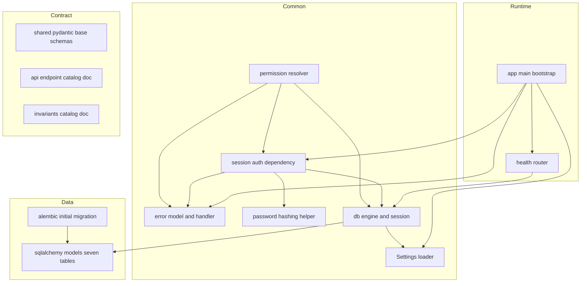
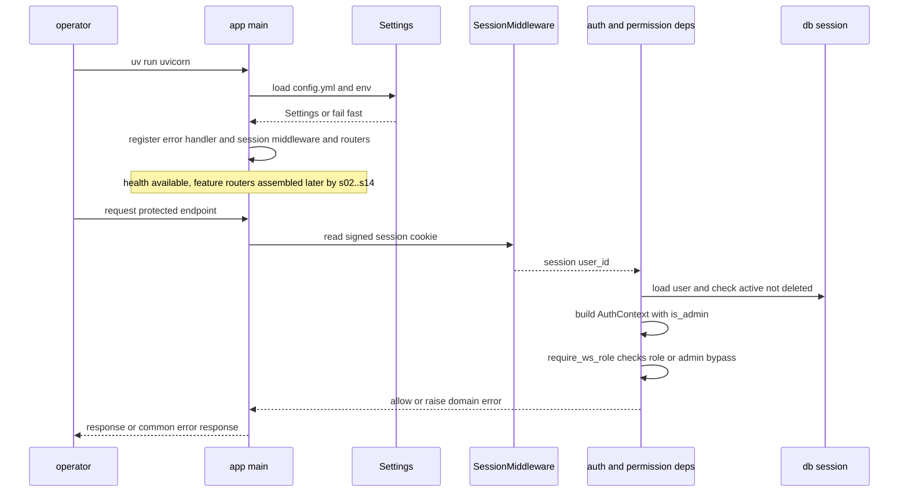
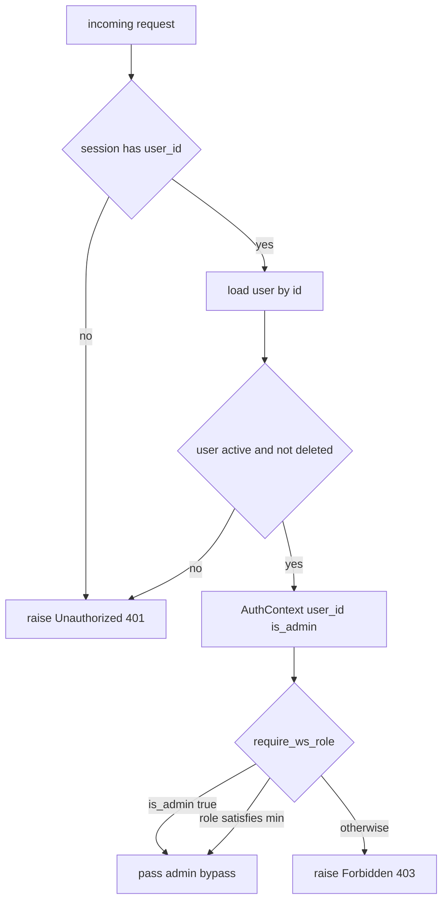
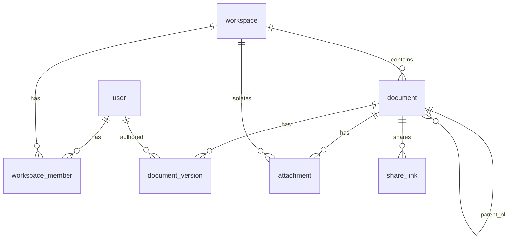

# Design Document — s01-contract-foundation

## Overview

**Purpose**: 이 spec은 MarkSpace 전체(하위 spec s02~s14, 통합 체크포인트 s04~s15)가 공유하는 **단일 계약 소스**
(DB 스키마 · API 엔드포인트 카탈로그 · `{Resource}Create/Read/Update` 스키마 규약 · 공통 에러 모델 · 도메인 불변식 INV-1~12)와,
그 계약을 실제로 검증 가능하게 만드는 **공용 런타임 인프라**(MySQL 8 마이그레이션 · pydantic-settings 단일 `Settings` ·
공통 에러 핸들러 · 세션 인증 의존성 · 워크스페이스 권한 resolver · FastAPI 부트스트랩 · health)를 함께 소유한다.

**Users**: 하위 feature 구현자는 이 계약·인프라를 재구현하지 않고 재사용한다. 통합 체크포인트는 이 단일 소스를 유일한
대조 기준으로 삼아 계층 경계 불변식 회귀를 검증한다. 운영자는 마이그레이션 적용·앱 부팅·health로 계약을 검증한다.

**Impact**: 현재 `backend/`는 uv 스캐폴드(`pyproject.toml`, `main.py`)만 존재한다. 이 spec이 레이어드 애플리케이션 골격,
전체 DB 스키마, 공용 인프라 모듈을 최초로 도입하여 이후 모든 feature가 얹힐 기반을 만든다.

### Goals
- `docs/projects.md` §2 전체 데이터 모델을 재현 가능한 Alembic 마이그레이션으로 적용한다(7개 테이블 + `is_admin`).
- 하위 spec·체크포인트가 참조할 **단일 계약 문서**를 확정한다: 엔드포인트 카탈로그, 스키마 명명 규약, 공통 에러 모델, INV-1~12 매핑.
- 재사용 가능한 공용 인프라를 부팅한다: 단일 `Settings`, 공통 에러 핸들러, 세션 인증 의존성, 권한 resolver, 보안 헬퍼.
- spec 자체가 검증되도록 한다: 마이그레이션 적용(왕복), 앱 부팅, `Settings` 로드, health(+DB 연결).

### Non-Goals
- 각 feature 엔드포인트의 **동작** 구현(로그인 자격증명 검증·세션 write, 문서 CRUD·bundle 전이, 잠금·버전, 휴지통,
  첨부, 공유 링크) — 시그니처(계약)만 두고 구현은 각 feature spec.
- 프론트엔드 화면.
- 범위 밖(§6): 검색, rollback, lock 타임아웃, CRDT, self sign-up/SSO, 보관 폴더 자동 정리, 다중 admin 정책.

## Boundary Commitments

### This Spec Owns
- **DB 스키마 전체**: user, workspace, workspace_member, document, document_version, attachment, share_link 7개 테이블 +
  user.`is_admin`. Alembic 초기 마이그레이션(upgrade/downgrade), 제약·인덱스, soft-delete 전제.
- **공용 설정**: `config.yml` + `.env`를 병합하는 pydantic-settings 단일 `Settings`와 그 접근자.
- **공통 에러 계약**: 단일 에러 응답 스키마 + 에러 코드 카탈로그 + 전역 예외 핸들러.
- **세션 인증 의존성**: 세션에서 현재 사용자·admin 여부를 확정하는 재사용 의존성(미인증/비활동/삭제 거부). 세션 미들웨어 등록.
- **권한 resolver**: 워크스페이스 단위 owner/editor/viewer 위계 판정 + admin bypass(INV-3) 의존성 팩토리.
- **보안 헬퍼**: 비밀번호 해싱(hash/verify) 공용 유틸(스킴 계약).
- **API 계약 문서**: 엔드포인트 카탈로그(경로·메서드·요구 role·요청/응답 스키마·소유 spec) + `{Resource}Create/Read/Update` 규약.
- **불변식 카탈로그**: INV-1~12 원문 + 계약 요소·소유 spec 매핑.
- **앱 부트스트랩**: FastAPI 앱, 미들웨어·에러 핸들러·라우터 조립 지점(빈 상태 포함), health 엔드포인트.

### Out of Boundary
- 로그인 자격증명 검증과 세션 write/clear(s02), 본인 비밀번호 변경 흐름(s02).
- admin 계정 생명주기 동작(s03), 워크스페이스/멤버십 CRUD 동작(s05).
- 문서 CRUD·계층·이동·렌더·status/bundle 전이 엔진(s07), 잠금·버전(s09), 휴지통(s10), 첨부(s12), 공유 링크(s14).
- 위 feature 라우터의 **동작**. s01은 라우터 조립 지점과 계약 시그니처만 제공한다.
- 리소스 → 워크스페이스 매핑의 구체 구현(각 feature가 resolver에 주입).

### Allowed Dependencies
- **Upstream**: 없음(프로젝트 루트 계약). 상위 근거 문서로 `docs/projects.md`만 참조.
- **Shared infra 사용 허용**: FastAPI, Starlette(SessionMiddleware), SQLAlchemy 2.0(sync), Alembic, PyMySQL,
  pydantic/pydantic-settings v2, itsdangerous, pwdlib[argon2], PyYAML, uvicorn.
- **제약**: 모든 설정 접근은 단일 `Settings` 경유(모듈별 설정 파일·`os.environ` 직접 접근 금지). 물리 삭제 금지(INV-4).
  의존 방향은 항상 아래층(Types/Model → Config → Repository → Service → API/Runtime)을 향한다.

### Revalidation Triggers
이 계약의 다음 변경은 **모든 통합 체크포인트(L1~L6) 재실행**을 유발한다(roadmap 재검증 트리거):
- DB 스키마 변경(컬럼·제약·ENUM·인덱스 추가/변경).
- 공통 에러 응답 스키마·에러 코드 카탈로그 변경.
- 세션 인증 의존성 또는 권한 resolver의 시그니처·판정 규칙 변경.
- `{Resource}Create/Read/Update` 규약 또는 엔드포인트 카탈로그(경로·메서드·요구 role·소유권) 변경.
- 불변식 카탈로그(INV 매핑) 변경.
- `Settings` 스키마·부트스트랩 조립 순서·health 계약 변경.

#### 계약 변경 이력 (change log)
- **[소유권 정정] 카탈로그 row 9 `POST /admin/workspaces/{id}/owner`(REQ-2.7) 소유 spec `s03` → `s05`**:
  s03이 해당 엔드포인트를 명시적으로 disown하였고, 워크스페이스 멤버십 리소스를 필요로 하므로 s05-workspace가 동작을 구현한다.
  카탈로그 소유권 변경은 계약 변경(위 Revalidation Triggers)에 해당하여 통합 체크포인트 재검증 대상이다.

## Architecture

### Architecture Pattern & Boundary Map

레이어드 아키텍처(steering `structure.md` 정렬). s01은 횡단 `common` 인프라 + `model`/마이그레이션 + 빈 라우터 조립 지점을
소유하고, 각 feature가 `api/service/repository`를 채운다.



**Architecture Integration**:
- **Selected pattern**: 레이어드 + 횡단 common. 의존 방향은 좌(하위)→우(상위) 단방향.
- **Domain/feature boundaries**: s01은 common·model·마이그레이션·계약 문서·부트스트랩만 소유. feature 도메인(auth/workspace/
  document-core/…)의 service·repository·router 동작은 각 spec 소유.
- **Existing patterns preserved**: uv 실행 표준, 설정 단일화, 물리 삭제 없음, `{Resource}Create/Read/Update` 명명(structure.md).
- **New components rationale**: 최초 골격이므로 common 인프라 전부가 신규. 각 컴포넌트는 단일 책임을 갖는다.
- **Steering compliance**: 권한 검사·설정 접근을 공통 레이어에 단일 구현(structure.md 코드 조직 원칙).

### Dependency Direction (강제)
```
Types/Schemas · Models  →  Settings/Config  →  Db(engine/session)  →  Repository(feature)
    →  Service(feature)  →  Dependencies(session/permission)  →  API Router  →  Runtime(bootstrap)
```
각 레이어는 왼쪽 레이어만 import한다. 위 방향 위반은 구현·리뷰에서 오류로 취급한다. `common`은 어떤 feature 도메인도 import하지 않는다.

### Technology Stack

| Layer | Choice / Version | Role in Feature | Notes |
|-------|------------------|-----------------|-------|
| Backend / Runtime | FastAPI `>=0.139`, uvicorn[standard] `>=0.35` | ASGI 앱·라우팅·의존성 주입 | `uv run uvicorn app.main:app` |
| Session | Starlette `SessionMiddleware` + itsdangerous `>=2.2` | 서명 쿠키 세션(서버측 테이블 없음) | payload는 `user_id`만, secret은 .env |
| Config | pydantic-settings `>=2.14` + PyYAML `>=6.0` | 단일 `Settings`(config.yml + .env) | `settings_customise_sources`로 YAML 소스 포함 |
| Data / ORM | SQLAlchemy `>=2.0.51,<2.1` (sync) | 모델 정의·세션·쿼리 | `mysql+pymysql://…?charset=utf8mb4` |
| Data / Driver | PyMySQL `>=1.1` | MySQL 8 드라이버 | 순수 파이썬, Windows 빌드 툴체인 불필요 |
| Data / Migration | Alembic `>=1.18` | 스키마 마이그레이션(upgrade/downgrade) | autogenerate 후 수동 검토 |
| Security | pwdlib[argon2] `>=0.3` | 비밀번호 해싱(Argon2id) | passlib 3.13 비호환 회피 |
| DB | MySQL 8 | 관계형 저장소 | utf8mb4 기본 |

> 상세 버전 근거·대안 비교는 `research.md` 참조.

## File Structure Plan

### Directory Structure
```
backend/
├── config.yml                       # 비밀 아닌 설정 단일 소스(신규)
├── .env.example                     # secret 키 목록 예시(.env는 커밋 금지)
├── alembic.ini                      # Alembic 설정(신규)
├── pyproject.toml                   # 의존성 추가(수정)
├── app/
│   ├── __init__.py
│   ├── main.py                      # FastAPI 앱 부트스트랩·미들웨어·에러핸들러·라우터 조립·health 포함
│   ├── config.py                    # Settings + get_settings() 단일 접근자
│   ├── common/
│   │   ├── __init__.py
│   │   ├── errors.py                # ErrorResponse/ErrorCode·도메인 예외·전역 예외 핸들러 등록
│   │   ├── db.py                    # SQLAlchemy engine·SessionLocal·get_db 의존성·Base
│   │   ├── security.py              # 비밀번호 hash/verify 헬퍼
│   │   ├── auth.py                  # 세션 인증 의존성(AuthContext, get_current_user)
│   │   └── permissions.py           # Role 위계·require_ws_role 의존성 팩토리·WorkspaceRoleResolver
│   ├── schemas/
│   │   ├── __init__.py
│   │   └── base.py                  # ORMReadModel 등 {Resource}Read 공통 베이스·페이지네이션 규약
│   ├── models/
│   │   ├── __init__.py              # Base metadata 노출(Alembic target_metadata)
│   │   ├── user.py                  # user
│   │   ├── workspace.py             # workspace, workspace_member
│   │   ├── document.py              # document, document_version
│   │   ├── attachment.py            # attachment
│   │   └── share_link.py            # share_link
│   └── routers/
│       └── __init__.py              # feature 라우터 조립 지점(초기 비어있음, health만 main에서 등록)
└── migrations/
    ├── env.py                       # Settings에서 DB URL 주입, target_metadata = Base.metadata
    ├── script.py.mako
    └── versions/
        └── 0001_initial_schema.py   # 7테이블 + is_admin 초기 스키마(upgrade/downgrade)
```

### Modified Files
- `backend/pyproject.toml` — 위 Technology Stack 의존성 추가(`uv add`).
- `backend/main.py` — 기존 헬로 스크립트. 앱 진입점을 `app/main.py`로 이전하고 필요 시 얇은 실행 래퍼만 유지.

> 각 파일은 단일 책임. `common/*`은 feature 도메인을 import하지 않는다. `models/*`는 Alembic `target_metadata` 소스이며 순환 없이 `Base`만 공유한다.

## System Flows

### 부팅 및 요청 처리 계약 흐름


### 세션 인증 판정


## Requirements Traceability

| Requirement | Summary | Components | Interfaces / Contracts | Flows |
|-------------|---------|------------|------------------------|-------|
| 1.1–1.11 | 전체 스키마 마이그레이션·soft-delete·왕복 | Models, Migration | 7 테이블 DDL + is_admin, upgrade/downgrade | — |
| 2.1–2.6 | 단일 Settings(config.yml+.env)·fail fast | Settings | `Settings`, `get_settings()` | 부팅 흐름 |
| 3.1–3.8 | 공통 에러 모델·핸들러·코드 카탈로그 | Errors | `ErrorResponse`, `ErrorCode`, 전역 핸들러 | 요청 처리 |
| 4.1–4.5 | 세션 인증 의존성·비활동/삭제 거부·admin 노출 | Session Auth, Security | `AuthContext`, `get_current_user` | 세션 인증 판정 |
| 5.1–5.7 | 워크스페이스 role 위계·admin bypass·재사용 의존성 | Permission Resolver | `require_ws_role`, `WorkspaceRoleResolver`, `Role` | 세션 인증 판정 |
| 6.1–6.6 | 엔드포인트 카탈로그·`{Resource}CRU` 규약·소유권 | API Catalog, Base Schemas | 카탈로그 표, `ORMReadModel` | — |
| 7.1–7.7 | 불변식 카탈로그·계약 요소 매핑 | Invariants Catalog | INV 매핑 표 | — |
| 8.1–8.6 | 부트스트랩·health·라우터 조립·전역 핸들러 | Bootstrap, Health | `create_app()`, `GET /health` | 부팅 흐름 |

## Components and Interfaces

| Component | Domain/Layer | Intent | Req Coverage | Key Dependencies (P0/P1) | Contracts |
|-----------|--------------|--------|--------------|--------------------------|-----------|
| Settings | Common/Config | 단일 설정 로드 | 2 | pydantic-settings (P0) | Service, State |
| Errors | Common | 공통 에러 모델·핸들러 | 3 | FastAPI (P0) | Service, API |
| Db | Common/Data | engine·session·Base | 1,8 | Settings (P0), SQLAlchemy (P0) | Service, State |
| SessionAuth | Common | 현재 사용자·admin 확정 | 4 | Db (P0), SessionMiddleware (P0), Errors (P1) | Service |
| PermissionResolver | Common | ws role 판정·admin bypass | 5 | Db (P0), SessionAuth (P0), Errors (P1) | Service |
| Security | Common | 비밀번호 해싱 | 4 | pwdlib (P0) | Service |
| Models | Data | 7테이블 ORM | 1 | SQLAlchemy (P0) | State |
| Migration | Data | 초기 스키마 적용 | 1 | Alembic (P0), Models (P0) | Batch |
| BaseSchemas | Contract | Read 공통 규약 | 6 | pydantic (P0) | State |
| ApiCatalog | Contract(doc) | 엔드포인트 단일 소스 | 6 | — | API |
| InvariantsCatalog | Contract(doc) | INV-1~12 매핑 | 7 | — | — |
| Bootstrap+Health | Runtime | 앱 조립·상태점검 | 8 | 전 common (P0) | API, Service |

### Common / Config

#### Settings
| Field | Detail |
|-------|--------|
| Intent | config.yml(비밀 아님) + .env(secret)를 병합한 단일 설정 객체 |
| Requirements | 2.1, 2.2, 2.3, 2.4, 2.5, 2.6 |

**Responsibilities & Constraints**
- 모든 설정 접근의 유일 지점. 모듈별 설정 파일·`os.environ` 직접 접근 금지.
- 필수 항목 누락 시 부팅 시점 검증 오류로 **fail fast**(부분 부팅 금지).
- `settings_customise_sources`로 우선순위: init > env > .env > config.yml.

**Contracts**: Service [x] / State [x]

##### Service Interface
```python
class Settings(BaseSettings):
    model_config = SettingsConfigDict(
        yaml_file="config.yml", env_file=".env",
        env_file_encoding="utf-8", extra="ignore",
    )
    # --- config.yml (비밀 아님) ---
    app_name: str
    db_host: str
    db_port: int = 3306
    db_name: str
    db_user: str
    default_trash_retention_days: int = 30
    file_storage_root: str                 # 첨부 파일 저장 루트(WS별 격리 하위 디렉터리)
    session_cookie_name: str = "session"
    session_max_age_seconds: int = 1209600  # 14d
    # --- .env (secret) ---
    db_password: str
    session_secret: str

    @classmethod
    def settings_customise_sources(cls, settings_cls, init_settings,
        env_settings, dotenv_settings, file_secret_settings): ...

    @property
    def sqlalchemy_url(self) -> str: ...     # mysql+pymysql://…?charset=utf8mb4

@lru_cache
def get_settings() -> Settings: ...          # 단일 접근자(의존성으로도 주입 가능)
```
- Preconditions: `config.yml` 존재, `.env`에 secret 존재.
- Postconditions: 완전 검증된 불변 `Settings` 반환 또는 부팅 실패.
- Invariants: 애플리케이션 전역에서 동일 인스턴스(캐시).

**Implementation Notes**
- Integration: `get_settings()`를 FastAPI 의존성 및 `db.py`·`main.py`에서 사용. Alembic `env.py`도 이 URL을 읽는다.
- Validation: 누락·형변환 실패는 pydantic ValidationError → 부팅 실패로 표면화.
- Risks: PyYAML 미설치 시 YAML 소스 실패 → 의존성에 포함.

### Common / Errors

#### Errors
| Field | Detail |
|-------|--------|
| Intent | 전 엔드포인트 공통 에러 응답 스키마·코드 카탈로그·전역 예외 핸들러 |
| Requirements | 3.1, 3.2, 3.3, 3.4, 3.5, 3.6, 3.7, 3.8 |

**Responsibilities & Constraints**
- 모든 오류를 단일 `ErrorResponse` 형태로 직렬화. 내부 세부정보(스택 등) 미노출.
- FastAPI RequestValidationError·HTTPException·도메인 예외·미처리 예외를 전역 핸들러가 공통 형태로 변환.

**Contracts**: Service [x] / API [x]

##### Data / API Contract
```python
class FieldError(BaseModel):
    field: str
    message: str

class ErrorResponse(BaseModel):
    code: str            # ErrorCode 값
    message: str         # 사람이 읽을 메시지
    field_errors: list[FieldError] | None = None

class ErrorCode(str, Enum):
    UNAUTHENTICATED = "unauthenticated"   # 401
    FORBIDDEN = "forbidden"               # 403
    VALIDATION_ERROR = "validation_error" # 422
    NOT_FOUND = "not_found"               # 404
    CONFLICT = "conflict"                 # 409  (상태/불변식 충돌)
    UNPROCESSABLE = "unprocessable"       # 422  (도메인 규칙 위반)
    INTERNAL = "internal"                 # 500

class DomainError(Exception):
    code: ErrorCode
    message: str
    http_status: int
    field_errors: list[FieldError] | None = None

def register_error_handlers(app: FastAPI) -> None: ...  # 전역 핸들러 등록
```

**에러 코드 카탈로그(계약)**

| HTTP | ErrorCode | 발생 조건 |
|------|-----------|-----------|
| 401 | unauthenticated | 세션 없음·무효·비활동/삭제 사용자 |
| 403 | forbidden | 요구 role 미충족(viewer 변경 시도 포함), admin 아님 |
| 404 | not_found | 대상 리소스 부재 |
| 409 | conflict | 상태/불변식 충돌(예: 잠금 보유자 충돌, bundle 규칙) |
| 422 | validation_error / unprocessable | 요청 검증 실패 / 도메인 규칙 위반 |
| 500 | internal | 미처리 서버 오류(세부정보 미노출) |

**Implementation Notes**
- Integration: `register_error_handlers(app)`를 `create_app()`에서 호출. 하위 spec은 `DomainError` 하위 표준 예외를 raise만 하면 공통 응답이 된다.
- Validation: RequestValidationError → 422 + field_errors 매핑.
- Risks: 미처리 예외를 반드시 500 공통 응답으로 감싸 스택 노출 방지.

### Common / Data

#### Db
| Field | Detail |
|-------|--------|
| Intent | SQLAlchemy engine·세션 팩토리·`get_db` 의존성·선언적 `Base` |
| Requirements | 1.1, 1.9, 8.3 |

**Contracts**: Service [x] / State [x]
```python
class Base(DeclarativeBase): ...
engine = create_engine(get_settings().sqlalchemy_url, pool_pre_ping=True)
SessionLocal = sessionmaker(bind=engine, autoflush=False, expire_on_commit=False)
def get_db() -> Iterator[Session]: ...        # 요청 스코프 세션, 종료 시 close
```
- Invariants: 세션은 요청 스코프. 물리 삭제 없음 전제로 쿼리 기본은 soft-delete 필터.
- Notes: `models` 패키지가 `Base.metadata`를 채우고 Alembic이 이를 target으로 사용.

### Common / Security

#### Security
| Field | Detail |
|-------|--------|
| Intent | 비밀번호 해싱 단일 스킴(s02·s03이 재사용) |
| Requirements | 4.3 |

**Contracts**: Service [x]
```python
_hasher = PasswordHash.recommended()          # Argon2id
def hash_password(raw: str) -> str: ...
def verify_password(raw: str, hashed: str) -> bool: ...
```
- Rationale: s02(비번 변경)·s03(비번 재설정)이 동일 스킴으로 `user.password_hash`를 기록하도록 계약화.
- Boundary: 해싱 유틸만 소유. 실제 로그인/재설정 흐름은 s02/s03.

### Common / Auth

#### SessionAuth
| Field | Detail |
|-------|--------|
| Intent | 서명 쿠키 세션에서 현재 사용자·admin 여부 확정 |
| Requirements | 4.1, 4.2, 4.3, 4.4, 4.5 |

**Responsibilities & Constraints**
- 세션 payload의 `user_id`로 사용자 로드 → `is_active`·`is_deleted` 검사 → `AuthContext` 반환.
- 세션 없음/무효/비활동/삭제 → `DomainError(UNAUTHENTICATED, 401)`.
- `is_admin`을 컨텍스트에 노출하여 권한 resolver의 admin bypass 판정 근거 제공.
- 세션 저장은 Starlette `SessionMiddleware`(서명 쿠키). **세션 write/clear(로그인/로그아웃)는 s02 소유.**

**Dependencies**
- Inbound: 모든 보호 엔드포인트(하위 spec) — 현재 사용자 확정(P0)
- Outbound: Db — 사용자 로드(P0); Errors — 401 산출(P1); SessionMiddleware — 쿠키(P0)

**Contracts**: Service [x]
```python
class AuthContext(BaseModel):
    user_id: int
    is_admin: bool

def get_current_user(request: Request, db: Session = Depends(get_db)) -> AuthContext: ...
# 사용법: current: AuthContext = Depends(get_current_user)
```
- Preconditions: `SessionMiddleware` 등록됨.
- Postconditions: 유효 사용자면 `AuthContext`, 아니면 401 raise.

### Common / Permissions

#### PermissionResolver
| Field | Detail |
|-------|--------|
| Intent | 워크스페이스 단위 role 위계 판정 + admin bypass(INV-1·2·3) |
| Requirements | 5.1, 5.2, 5.3, 5.4, 5.5, 5.6, 5.7 |

**Responsibilities & Constraints**
- 권한은 **워크스페이스 단위만**(INV-1). role 위계 owner ≥ editor ≥ viewer.
- `require_ws_role(min_role)`는 요구 role을 만족하거나 요청자가 admin이면 통과, 아니면 403(INV-3 admin bypass).
- viewer는 editor 이상 요구 작업에서 항상 거부(INV-2, 읽기 전용은 요구 role=viewer로 표현).
- 자원 → workspace_id 매핑은 각 feature가 주입(문서 id→ws 등). resolver는 workspace_id 기준 판정만.

**Dependencies**
- Inbound: 문서·휴지통·공유 등 라우터(하위 spec) — 권한 게이팅(P0)
- Outbound: Db — workspace_member 조회(P0); SessionAuth — AuthContext(P0); Errors — 403(P1)

**Contracts**: Service [x]
```python
class Role(IntEnum):        # 위계 비교용
    VIEWER = 1
    EDITOR = 2
    OWNER = 3

class WorkspaceRoleResolver:
    def resolve(self, db: Session, ctx: AuthContext, workspace_id: int) -> Role | None: ...
    def has_at_least(self, db: Session, ctx: AuthContext,
                     workspace_id: int, minimum: Role) -> bool: ...  # admin이면 항상 True

def require_ws_role(minimum: Role) -> Callable[..., AuthContext]: ...
# 사용법(하위 spec): current = Depends(require_ws_role(Role.EDITOR))
#   workspace_id는 경로/본문에서 추출해 주입하는 얇은 어댑터를 각 feature가 제공.

def require_admin(ctx: AuthContext = Depends(get_current_user)) -> AuthContext: ...
# admin 전용 게이트: not ctx.is_admin이면 표준 403 DomainError(FORBIDDEN)을 raise, admin이면 ctx 통과.
# 사용법(하위 spec): current: AuthContext = Depends(require_admin)
```
- Invariants: admin은 멤버십·role과 무관하게 통과(INV-3). 문서별 개별 권한 없음(INV-1).
- Boundary: 판정 로직만 소유. 실제 멤버십 데이터는 s05가 채운다(그 전까지 admin만 통과).
- **권한 검사 단일화(steering config/permission-singularity)**: 권한 검사는 `require_ws_role`와 나란히 공통 레이어에
  단일 정의한다. admin 전용 엔드포인트(카탈로그 row 5–9)는 이 유일한 `require_admin` 정의를 소비하며,
  **feature spec은 자체 `require_admin`을 재정의해서는 안 된다(MUST NOT)**. `require_admin`은 `AuthContext.is_admin`만
  얇게 검사하여 `not ctx.is_admin`일 때 표준 403 `DomainError(FORBIDDEN)`을 산출한다(INV-3 admin 판정과 정합).

### Contract / Base Schemas

#### BaseSchemas
| Field | Detail |
|-------|--------|
| Intent | `{Resource}Create/Read/Update` 규약과 Read 공통 필드 베이스 |
| Requirements | 6.2, 6.5 |

**Contracts**: State [x]
```python
class ORMReadModel(BaseModel):
    model_config = ConfigDict(from_attributes=True)

class TimestampedRead(ORMReadModel):
    id: int
    created_at: datetime
    updated_at: datetime | None = None

class Page(BaseModel, Generic[T]):     # 목록 응답 공통 규약
    items: list[T]
    total: int
```
- 규약: 요청 생성=`{Resource}Create`, 수정=`{Resource}Update`(부분), 응답=`{Resource}Read`(가능 시 `TimestampedRead` 상속).
- Boundary: 리소스별 구체 스키마는 각 feature가 이 베이스를 상속해 정의.

### Contract / API Endpoint Catalog (단일 소스)

전 도메인 엔드포인트 계약. `요구 role`은 최소 권한(admin 항상 bypass). **동작 구현은 소유 spec**이 수행하며 이 표가 계약 기준이다.

| # | Method | Path | 요구 role | Request | Response | 소유 spec | Req |
|---|--------|------|-----------|---------|----------|-----------|-----|
| 인증·계정 |
| 1 | POST | /auth/login | (없음) | LoginRequest | AuthUserRead | s02 | 1.1,1.2,1.3 |
| 2 | POST | /auth/logout | 인증됨 | — | — | s02 | 1.4 |
| 3 | GET | /auth/me | 인증됨 | — | AuthUserRead | s02 | 1.1 |
| 4 | POST | /auth/password | 인증됨 | PasswordChangeRequest | — | s02 | 1.5 |
| Admin 계정관리 |
| 5 | POST | /admin/users | admin | UserCreate | UserRead | s03 | 2.2 |
| 6 | GET | /admin/users | admin | — | Page[UserRead] | s03 | 2.2 |
| 7 | PATCH | /admin/users/{id} | admin | UserUpdate | UserRead | s03 | 2.3,2.4,2.5 |
| 8 | POST | /admin/users/{id}/password | admin | AdminPasswordResetRequest | — | s03 | 1.6 |
| 9 | POST | /admin/workspaces/{id}/owner | admin | OwnerChangeRequest | WorkspaceRead | s05 | 2.7 |
| 워크스페이스 |
| 10 | POST | /workspaces | (인증됨, owner화) | WorkspaceCreate | WorkspaceRead | s05 | 3.1 |
| 11 | GET | /workspaces | 인증됨 | — | Page[WorkspaceRead] | s05 | 3.1 |
| 12 | GET | /workspaces/{id} | viewer | — | WorkspaceRead | s05 | 3.1 |
| 13 | PATCH | /workspaces/{id} | owner | WorkspaceUpdate | WorkspaceRead | s05 | 3.1,7.2 |
| 14 | DELETE | /workspaces/{id} | owner | — | — | s05 | 3.2 |
| 15 | POST | /workspaces/{id}/members | owner | MemberCreate | MemberRead | s05 | 3.3 |
| 16 | PATCH | /workspaces/{id}/members/{uid} | owner | MemberUpdate | MemberRead | s05 | 3.5 |
| 17 | DELETE | /workspaces/{id}/members/{uid} | owner | — | — | s05 | 3.4 |
| 문서 코어 |
| 18 | POST | /workspaces/{id}/documents | editor | DocumentCreate | DocumentRead | s07 | 4.1,4.2 |
| 19 | GET | /workspaces/{id}/documents | viewer | — | Page[DocumentRead] | s07 | 4.4 |
| 20 | GET | /documents/{id} | viewer | — | DocumentRead | s07 | 4.4 |
| 21 | PATCH | /documents/{id} | editor | DocumentUpdate | DocumentRead | s07 | 4.6 |
| 22 | POST | /documents/{id}/move | editor | DocumentMoveRequest | DocumentRead | s07 | 4.6,4.7,4.8 |
| 23 | DELETE | /documents/{id} | editor | — | — | s07 | 6.2,6.3 |
| 잠금·버전 |
| 24 | POST | /documents/{id}/lock | editor | — | DocumentLockRead | s09 | 5.1,5.2 |
| 25 | POST | /documents/{id}/save | editor | DocumentSaveRequest | DocumentVersionRead | s09 | 5.3,5.7 |
| 26 | POST | /documents/{id}/cancel | editor | — | — | s09 | 5.4 |
| 27 | POST | /documents/{id}/force-unlock | owner | — | — | s09 | 5.6 |
| 28 | GET | /documents/{id}/versions | viewer | — | Page[DocumentVersionRead] | s09 | 5.7 |
| 휴지통 |
| 29 | GET | /workspaces/{id}/trash | editor | — | Page[TrashBundleRead] | s10 | 6.11 |
| 30 | POST | /trash/{bundleId}/restore | editor | — | — | s10 | 6.5,6.6,6.7 |
| 31 | DELETE | /trash/{bundleId} | editor | — | — | s10 | 6.9,6.10 |
| 첨부 |
| 32 | POST | /documents/{id}/attachments | editor | (multipart) AttachmentCreate | AttachmentRead | s12 | 8.1,8.2,8.3 |
| 33 | GET | /attachments/{id} | viewer | — | (binary) | s12 | 8.4 |
| 공유 |
| 34 | POST | /documents/{id}/share | editor | — | ShareLinkRead | s14 | 7.1,7.3 |
| 35 | PATCH | /documents/{id}/share | editor | ShareLinkUpdate | ShareLinkRead | s14 | 7.7 |
| 36 | GET | /public/{token} | (공개) | — | PublicDocumentRead | s14 | 7.5,7.6 |
| 37 | GET | /public/{token}/attachments/{aid} | (공개) | — | (binary) | s14 | 8.4,8.5 |

> 이 카탈로그는 초기 계약 기준선이다. 세부 경로·스키마 필드는 소유 spec의 design에서 확정하되, 경로·메서드·요구 role·소유권 변경은
> **계약 변경**으로 간주되어 재검증 트리거(위 Revalidation Triggers)를 발동한다. `{Resource}` 스키마는 모두 §Base Schemas 규약을 따른다.

### Contract / Invariants Catalog (INV-1~12)

`docs/projects.md` §5 원문 불변식과 이를 강제·검증하는 계약 요소·소유 spec 매핑. 통합 체크포인트의 회귀 기준.

| INV | 요지 | 강제 계약 요소 | 강제/검증 소유 |
|-----|------|----------------|----------------|
| 1 | 권한은 워크스페이스 단위만, 문서별 개별 권한 없음 | PermissionResolver(ws 단위 판정), 스키마(workspace_member만 권한 보유) | resolver(s01) / s05·전 라우터 |
| 2 | viewer는 문서·휴지통 변경 불가(읽기 전용) | require_ws_role(editor 이상), Errors 403 | resolver(s01) / s07·s10 |
| 3 | admin 접근은 어떤 권한 검사로도 차단 안 됨 | AuthContext.is_admin, require_ws_role admin bypass | s01 auth·resolver / 전 spec |
| 4 | user·document·attachment 물리 삭제 없음(dangling FK 없음) | 스키마 soft-delete 컬럼(is_deleted/status/is_archived), FK 제약 | s01 스키마 / 전 spec |
| 5 | 문서 이동 시 사이클 없음 | document.parent_id 자기참조, move 계약(4.8 거부) | 스키마(s01) / s07 |
| 6 | 문서·이동·공유는 WS 경계 넘지 않음 | document.workspace_id, attachment.workspace_id, 이동 same-WS 계약 | 스키마(s01) / s07·s12·s14 |
| 7 | deleted 문서·보관 파일 복원 경로 없음 | status=deleted 종착, attachment.is_archived | 스키마(s01) / s10·s12 |
| 8 | 무효화된 공유 링크는 재발급 없이 접근 불가 | share_link.is_enabled + 재발급 계약(§4.5) | 스키마(s01) / s14 |
| 9 | 문서당 편집 잠금 최대 1인 | document.lock_user_id 단일 컬럼 | 스키마(s01) / s09 |
| 10 | 삭제/복구/완전삭제는 묶음 단위 원자적·비병합 | document.status·trashed_at, bundle 계약 | 스키마(s01) / s07·s10 |
| 11 | 독립 묶음 자식은 부모보다 먼저 trash(child.trashed_at ≤ parent.trashed_at) | trashed_at 컬럼(묶음별 독립 보유) | 스키마(s01) / s07·s10 |
| 12 | 묶음 보관 만료는 각 trashed_at 기준 독립 산정 | trashed_at + retention(workspace.trash_retention_days) | 스키마(s01) / s10 |

> INV-10~12의 **엔진 동작**(비흡수·독립 타이머·복구 위치)은 document-core(s07) 서비스에 단일 구현으로 캡슐화된다(structure.md).
> s01은 이를 가능케 하는 **스키마·상태 컬럼 계약**과 이 매핑 문서만 소유한다.

### Runtime / Bootstrap + Health

#### Bootstrap
| Field | Detail |
|-------|--------|
| Intent | FastAPI 앱 조립(설정·미들웨어·에러핸들러·라우터 조립 지점·health) |
| Requirements | 8.1, 8.2, 8.3, 8.4, 8.5, 8.6 |

**Contracts**: API [x] / Service [x]
```python
def create_app() -> FastAPI:
    settings = get_settings()
    app = FastAPI(title=settings.app_name)
    app.add_middleware(SessionMiddleware, secret_key=settings.session_secret,
                       session_cookie=settings.session_cookie_name,
                       max_age=settings.session_max_age_seconds, same_site="lax")
    register_error_handlers(app)
    app.include_router(health_router)
    # feature 라우터 조립 지점: s02~s14가 여기에 include_router로 추가(초기 비어있음)
    return app

app = create_app()
```

##### API Contract
| Method | Endpoint | Request | Response | Errors |
|--------|----------|---------|----------|--------|
| GET | /health | — | `HealthRead{status, db}` | 500 |

- `HealthRead`: `status: "ok"`, `db: "ok" | "down"`(경량 `SELECT 1`로 연결 확인, 8.3).
- 라우터 조립 지점은 초기 비어 있고 health만 등록. feature 동작은 이 spec에서 구현하지 않는다(8.4).

## Data Models

### Domain Model
- 집계 루트: **User**(계정 상태), **Workspace**(권한·공유·보관 정책 경계), **Document**(계층·상태·잠금 집계).
- 값/부속: WorkspaceMember(권한), DocumentVersion(스냅샷), Attachment(파일 참조), ShareLink(공개 링크).
- 불변식: 전역 §5 INV-1~12(위 카탈로그). soft-delete 전제로 참조 무결성 유지.



### Physical Data Model (MySQL 8, utf8mb4) — 초기 마이그레이션 0001

모든 테이블 `ENGINE=InnoDB DEFAULT CHARSET=utf8mb4`. 타임스탬프는 `DATETIME`.

**user**
- `id BIGINT PK AUTO_INCREMENT`
- `login_id VARCHAR(255) NOT NULL UNIQUE`
- `password_hash VARCHAR(255) NOT NULL`
- `name VARCHAR(255) NOT NULL`
- `email VARCHAR(255) NULL`
- `is_admin BOOLEAN NOT NULL DEFAULT FALSE`  ← 단일 admin 수동 설정(설계 결정, research.md)
- `is_active BOOLEAN NOT NULL DEFAULT TRUE`
- `is_deleted BOOLEAN NOT NULL DEFAULT FALSE`
- `created_at DATETIME NOT NULL`, `updated_at DATETIME NULL`
- INDEX: `(is_deleted, is_active)` (로그인·목록 soft-delete 필터)

**workspace**
- `id BIGINT PK AUTO_INCREMENT`, `name VARCHAR(255) NOT NULL`
- `is_shareable BOOLEAN NOT NULL DEFAULT FALSE`
- `trash_retention_days INT NOT NULL DEFAULT 30`
- `created_at DATETIME NOT NULL`, `updated_at DATETIME NULL`

**workspace_member**
- `id BIGINT PK AUTO_INCREMENT`
- `workspace_id BIGINT NOT NULL FK → workspace(id)`
- `user_id BIGINT NOT NULL FK → user(id)`
- `role ENUM('owner','editor','viewer') NOT NULL`
- UNIQUE `(workspace_id, user_id)`; INDEX `(user_id)`

**document**
- `id BIGINT PK AUTO_INCREMENT`
- `workspace_id BIGINT NOT NULL FK → workspace(id)`
- `parent_id BIGINT NULL FK → document(id)`
- `title VARCHAR(255) NOT NULL`
- `status ENUM('active','trashed','deleted') NOT NULL DEFAULT 'active'`
- `sort_order DECIMAL(30,15) NOT NULL`  ← 형제 중간 삽입 지원(§2.4, 6.7)
- `current_version_id BIGINT NULL FK → document_version(id)`
- `lock_user_id BIGINT NULL FK → user(id)`, `lock_acquired_at DATETIME NULL`
- `trashed_at DATETIME NULL`  ← 묶음별 독립 보유(INV-11·12)
- `created_by BIGINT NOT NULL FK → user(id)`
- `created_at DATETIME NOT NULL`, `updated_at DATETIME NULL`
- INDEX: `(workspace_id, status, parent_id)`, `(workspace_id, status, trashed_at)`
- 참고: `current_version_id`는 `document_version` 생성 후 설정(순환 FK는 nullable로 회피, 저장 시 갱신).

**document_version**
- `id BIGINT PK AUTO_INCREMENT`
- `document_id BIGINT NOT NULL FK → document(id)`
- `content MEDIUMTEXT NOT NULL`
- `created_by BIGINT NOT NULL FK → user(id)`, `created_at DATETIME NOT NULL`
- INDEX: `(document_id, created_at)`

**attachment**
- `id BIGINT PK AUTO_INCREMENT`
- `workspace_id BIGINT NOT NULL FK → workspace(id)`  ← WS별 격리(INV-6)
- `document_id BIGINT NOT NULL FK → document(id)`
- `file_path VARCHAR(1024) NOT NULL`, `original_name VARCHAR(255) NOT NULL`
- `kind ENUM('image','file') NOT NULL`
- `is_archived BOOLEAN NOT NULL DEFAULT FALSE`  ← 보관 폴더 이동=영구삭제(§4.4)
- `created_at DATETIME NOT NULL`
- INDEX: `(workspace_id, is_archived)`, `(document_id)`

**share_link**
- `id BIGINT PK AUTO_INCREMENT`
- `document_id BIGINT NOT NULL FK → document(id)`
- `token VARCHAR(64) NOT NULL UNIQUE`
- `is_enabled BOOLEAN NOT NULL DEFAULT TRUE`
- `created_at DATETIME NOT NULL`

**참조 무결성 / soft-delete(INV-4)**: 물리 삭제가 없으므로 FK 대상 행은 항상 존재하며 dangling FK가 생기지 않는다.
`ON DELETE`는 실제 물리 삭제를 사용하지 않으므로 `RESTRICT`(기본) 유지. 삭제·비활동·보관은 플래그/상태 전환으로만 표현.

### Data Contracts & Integration
- **API 데이터 전송**: 모든 요청/응답은 §Base Schemas 규약(`{Resource}Create/Read/Update`, `TimestampedRead`, `Page[T]`) 준수, JSON(첨부는 multipart/binary).
- **에러 직렬화**: 전 엔드포인트 `ErrorResponse` 단일 형태.

## Error Handling

### Error Strategy
- **Fail fast**: 설정 누락은 부팅 실패. 요청 검증 실패는 즉시 422.
- **단일 변환 지점**: 전역 핸들러가 `DomainError`·`RequestValidationError`·`HTTPException`·미처리 예외를 `ErrorResponse`로 변환.

### Error Categories and Responses
- **User Errors(4xx)**: 검증 실패 → 422 + field_errors; 미인증 → 401; 권한 부족 → 403; 미존재 → 404.
- **Business Logic Errors**: 불변식/상태 충돌 → 409 또는 422(unprocessable).
- **System Errors(5xx)**: 미처리 예외 → 500, 내부 세부정보 미노출·서버 로그로만 기록.

### Monitoring
- 표준 로깅(요청 실패·미처리 예외 스택은 서버 로그). health `db` 필드로 DB 연결 가시화. 상세 관측 인프라는 범위 밖.

## Testing Strategy

### Unit Tests
- `Settings`: config.yml+.env 병합·우선순위, 필수 secret 누락 시 부팅 실패(2.1, 2.3, 2.4).
- 에러 핸들러: RequestValidationError→422+field_errors, DomainError→코드·상태 매핑, 미처리 예외→500 비노출(3.2, 3.6, 3.7).
- `get_current_user`: 세션 없음→401, is_active=false/is_deleted=true 사용자→401, 정상→AuthContext(is_admin 반영)(4.1, 4.2, 4.3, 4.4).
- `require_ws_role`: role 위계 충족/미충족(403), admin bypass 통과(5.2, 5.3, 5.5); viewer 변경 거부(5.4).
- security: hash→verify 왕복, 잘못된 비밀번호 verify 실패(4.3).

### Integration Tests
- 마이그레이션 `upgrade head` 후 7테이블+`is_admin`·인덱스·UNIQUE(login_id, token, (workspace_id,user_id)) 존재; `downgrade`로 원복(1.1~1.11).
- 앱 부팅 후 `GET /health` → 200 `{status:"ok", db:"ok"}`, DB 중단 시 `db:"down"`(8.1, 8.2, 8.3).
- 보호 라우트 스텁에 `Depends(require_ws_role(EDITOR))` 부착 시 미인증 401·비멤버 403·admin 200(3~5 계약 결선).

### Contract Consistency Tests (문서 계약)
- 엔드포인트 카탈로그의 모든 경로가 `{Resource}Create/Read/Update` 규약을 따르는지(6.2, 6.5), 각 항목에 소유 spec이 표기됐는지(6.4).
- INV-1~12 카탈로그가 12개 전부 존재하고 각 항목이 계약 요소·소유 spec에 매핑됐는지(7.1, 7.2).

## Security Considerations
- 세션은 서명 쿠키(암호화 아님) → payload는 `user_id`만. `session_secret`은 `.env`에만, 커밋 금지. `same_site=lax`, prod에서 `https_only`.
- 비밀번호는 Argon2id 해싱(pwdlib). 평문 저장 금지. 해싱 스킴은 공용 헬퍼로 단일화.
- admin은 `user.is_admin` 단일 출처. 애플리케이션에 admin 생성 기능 없음(수동 DB 설정, REQ-2.1).
- 에러 응답은 내부 세부정보(스택·SQL) 미노출.

## Supporting References
- 스택 버전·라이브러리 선택 근거, 세션/admin/해싱 설계 결정: `research.md`.
- 상위 계약 근거: `docs/projects.md` §2 데이터 모델 · §3 EARS · §4 상태 전이 · §5 불변식.
