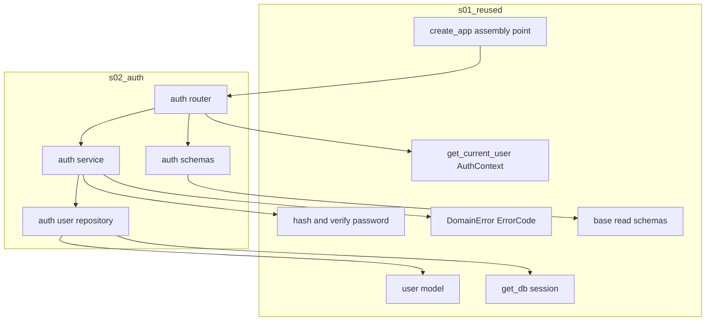
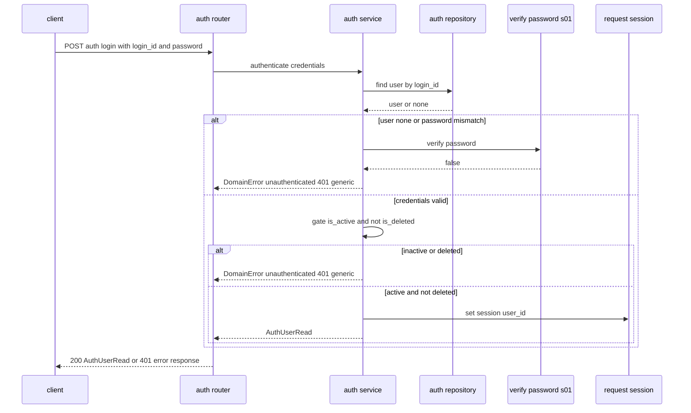
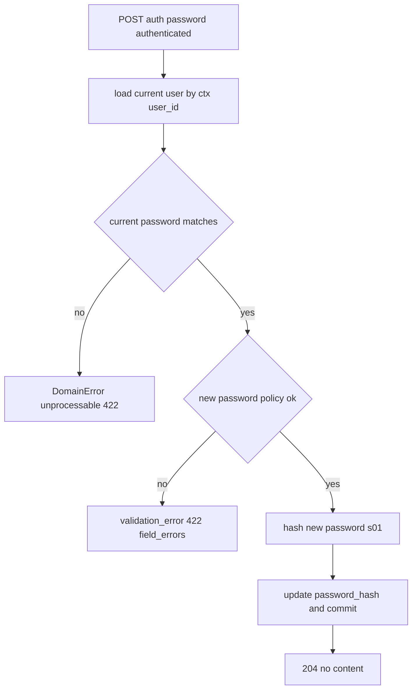

# Design Document — s02-auth

## Overview

**Purpose**: `s02-auth`는 Notion-lite 폐쇄형 서비스의 **자격 증명 기반 인증 동작**을 제공한다 — `login_id`/`password`
로그인과 세션 발급, 로그아웃(세션 종료), 현재 사용자 조회, 본인 비밀번호 변경. 자격 증명이 올바르더라도 비활동
(`is_active=false`)·삭제(`is_deleted=true`) 계정은 로그인이 차단된다.

**Users**: 폐쇄형 서비스 사용자가 인증을 통해 이후 보호 기능에 접근한다. 모든 하위 인증 필요 라우터(s05 이상)와 통합
체크포인트(s04)가 이 인증 경로가 s01 계약과 정합함을 전제한다.

**Impact**: 현재 `backend/`에는 s01의 계약·공용 인프라(세션 미들웨어·`get_current_user`·해싱 헬퍼·에러 모델·user 모델·
빈 라우터 조립 지점)만 존재한다. s02는 그 위에 **auth 도메인 패키지**(라우터·서비스·저장소·스키마)를 최초로 추가하고,
s01이 마련한 조립 지점에 인증 라우터를 연결하여 4개 인증 엔드포인트의 동작을 실현한다.

### Goals
- s01 엔드포인트 카탈로그 1~4번(`/auth/login`·`/auth/logout`·`/auth/me`·`/auth/password`)의 **동작**을 구현한다.
- 로그인 경로에 계정 상태 게이트(비활동·삭제 거부)를 적용한다(REQ-1.4, 1.5).
- s01의 세션 의존성·해싱 헬퍼·에러 모델·user 스키마·base 스키마를 **재사용**하고 재정의하지 않는다.
- 본인 비밀번호 변경을 현재 비밀번호 확인 후 안전하게 수행한다(평문 저장 금지).

### Non-Goals
- user 스키마·세션 미들웨어·해싱 헬퍼·에러 모델·엔드포인트 카탈로그의 **정의**(s01 소유).
- 계정 생성·삭제·비활동/재활성화·admin 비밀번호 재설정(s03 소유).
- 워크스페이스 권한·멤버십 판정(s05; resolver 자체는 s01 소유이며 auth 경로에서는 미사용).
- self sign-up·비밀번호 분실 자가 재설정·SSO/OAuth(프로젝트 범위 밖, `docs/projects.md` §6).
- 프론트엔드 화면.

## Boundary Commitments

### This Spec Owns
- **auth 도메인 서비스 동작**: 로그인 자격 검증 + 계정 상태 게이트 + 세션 write, 로그아웃(세션 clear), 현재 사용자 조회,
  본인 비밀번호 변경(현재 확인 → 새 해시 갱신).
- **auth 요청/응답 스키마**: `LoginRequest`, `AuthUserRead`, `PasswordChangeRequest`(s01 base 스키마 규약 상속).
- **인증 라우터**: `POST /auth/login`, `POST /auth/logout`, `GET /auth/me`, `POST /auth/password`.
- **auth 범위 user 데이터 접근**: `login_id`/`id`로 사용자 조회, 본인 `password_hash` 갱신(인증 목적 한정).
- **조립 연결**: s01 `create_app` 조립 지점에 auth 라우터 등록(main.py의 지정된 지점 수정).

### Out of Boundary
- user 테이블 스키마·마이그레이션·`is_admin` 설정(s01).
- 세션 미들웨어 등록·서명 쿠키 정책·`get_current_user`/`AuthContext` **정의**(s01). s02는 이를 **소비**만 한다.
- 비밀번호 해싱 스킴·`hash_password`/`verify_password` **정의**(s01). s02는 호출만 한다.
- 공통 에러 모델·전역 예외 핸들러 **정의**(s01). s02는 `DomainError`를 raise만 한다.
- 계정 생성·삭제·비활동/재활성화, admin 비밀번호 재설정(s03). s02의 `password_hash` 갱신은 **본인 self-change**에 한정.
- 워크스페이스 role 판정·멤버십 데이터(s05).

### Allowed Dependencies
- **Upstream**: `s01-contract-foundation`만. (roadmap: s02 → s01 단일 의존.)
- **s01 재사용 표면(계약)**: `app/models/user.py`(User), `app/common/auth.py`(`AuthContext`, `get_current_user`, 세션 키),
  `app/common/security.py`(`hash_password`/`verify_password`), `app/common/errors.py`(`DomainError`/`ErrorCode`),
  `app/common/db.py`(`get_db`), `app/schemas/base.py`(`ORMReadModel`/`TimestampedRead`), `app/main.py`(`create_app` 조립 지점).
- **제약**: 설정 접근은 s01 단일 `Settings` 경유. 물리 삭제 금지(INV-4). 의존 방향은 항상 아래층(Schemas/Model → Db →
  Repository → Service → Dependencies → Router → Runtime)을 향한다. `app/common/*`을 수정하지 않는다(소비만).

### Revalidation Triggers
s02의 다음 변경은 **L1 체크포인트(s04) 및 그 이상 재실행**을 유발한다(roadmap 재검증 트리거):
- 인증 엔드포인트 경로·메서드·요구 인증 여부 변경(카탈로그 1~4 이탈).
- 세션 write/clear 방식 또는 세션 payload 키 변경(s01 세션 의존성과의 정합 깨짐).
- 로그인 상태 게이트 규칙(비활동·삭제 거부) 변경.
- 로그인/비밀번호 변경 실패의 에러 코드·상태 매핑 변경.
- `LoginRequest`/`AuthUserRead`/`PasswordChangeRequest` 스키마 형태 변경.

## Architecture

### Architecture Pattern & Boundary Map

레이어드 아키텍처(steering `structure.md` 정렬). s02는 `app/auth/` feature 패키지(router/service/repository/schemas)를
소유하고, s01 common·model·base 스키마·조립 지점을 소비한다. `app/common/*`은 수정하지 않는다.



**Architecture Integration**:
- **Selected pattern**: 레이어드 feature 패키지. 의존 방향은 좌(하위)→우(상위) 단방향, s01만 향한다.
- **Domain/feature boundaries**: s02는 auth 도메인 동작만 소유. 세션·해싱·에러·권한 판정 등 횡단 관심사는 s01 common을 소비.
- **Existing patterns preserved**: uv 실행 표준, 단일 `Settings`, 물리 삭제 없음, `{Resource}Create/Read/Update` 명명,
  공통 권한/설정 단일화(structure.md).
- **New components rationale**: 최초 auth 도메인 패키지. 각 컴포넌트 단일 책임(라우터=I/O·의존성, 서비스=동작, 저장소=조회/갱신,
  스키마=요청/응답 계약).
- **Steering compliance**: 인증 로직을 중복 구현하지 않고 s01 단일 소스를 재사용(structure.md 코드 조직 원칙).

### Dependency Direction (강제)
```
Schemas(auth) · User(model, s01)  →  Settings/Db(s01)  →  Repository(auth)
    →  Service(auth)  →  Dependencies(get_current_user, s01)  →  Router(auth)  →  Runtime(create_app, s01)
```
각 레이어는 왼쪽만 import한다. `app/auth/*`은 `app/common/*`·`app/models/*`·`app/schemas/base`만 참조하고, s01 common을
수정하지 않는다. 로그인 서비스는 세션 write를 위해 라우터에서 전달받은 `request.session`을 조작하되 세션 키는 s01 상수를 재사용한다.

### Technology Stack

s02는 신규 런타임/라이브러리를 도입하지 않는다. 전량 s01 스택을 재사용한다.

| Layer | Choice / Version | Role in Feature | Notes |
|-------|------------------|-----------------|-------|
| Backend / Runtime | FastAPI(s01) | 인증 라우터·의존성 주입 | s01 `create_app` 조립 지점에 include |
| Session | Starlette SessionMiddleware(s01) | 서명 쿠키 세션 write/clear | payload 키=s01 `auth.py` 상수 재사용 |
| Security | pwdlib[argon2](s01) | 자격 검증·현재 확인·새 해시 | `verify_password`/`hash_password` 호출만 |
| Data / ORM | SQLAlchemy(s01) | user 조회·password_hash 갱신 | s01 User 모델·`get_db` 재사용 |
| Schema | pydantic v2(s01) | 요청 검증·응답 직렬화 | base 스키마 상속, 새 의존성 없음 |

> 스택 재사용 근거·세션 정합 리스크는 `research.md` 참조.

## File Structure Plan

### Directory Structure
```
backend/app/
├── auth/                       # (신규) s02 인증 feature 패키지
│   ├── __init__.py
│   ├── router.py               # POST /auth/login, /auth/logout, GET /auth/me, POST /auth/password
│   ├── service.py              # AuthService: 자격검증+상태게이트+세션write, logout, me, 비번변경
│   ├── repository.py           # AuthUserRepository: find_by_login_id, get_by_id, update_password_hash
│   └── schemas.py              # LoginRequest, AuthUserRead, PasswordChangeRequest
└── (s01 소유: common/*, models/*, schemas/base.py, main.py 등 — 수정 금지, main.py 조립 지점만 예외)
```

### Modified Files
- `backend/app/main.py` — s01 `create_app`의 feature 라우터 **조립 지점**에 `app.include_router(auth.router)` 추가(그 외 수정 없음).

### Test Files (신규)
```
backend/tests/auth/
├── test_login.py               # 로그인 성공·실패·비활동·삭제 게이트, 세션 write
├── test_logout_me.py           # 로그아웃 세션 종료, me 조회, 미인증 401
├── test_password_change.py     # 현재 확인·새 해시 갱신·현재 불일치 422·정책 위반 422
└── test_auth_integration.py    # 부팅 앱에서 login→me→password→logout 왕복(mock 없음)
```

> 각 파일 단일 책임. `app/auth/*`은 s01 common/model/base만 import하며 `app/common/*`을 수정하지 않는다.

## System Flows

### 로그인 및 세션 발급 흐름 (계정 상태 게이트 포함)


로그인은 s01 `get_current_user`를 사용하지 않는다(세션 write 이전 경로). 실패 사유(미존재·비밀번호·비활동·삭제)는 모두
**401 UNAUTHENTICATED 동일 메시지**로 반환하여 계정 열거를 방지한다(REQ-1.3).

### 본인 비밀번호 변경 흐름


logout·me·password 엔드포인트는 s01 `get_current_user`로 현재 사용자를 확정하며, 미인증/비활동/삭제 세션은 s01이 401로 거부한다.

## Requirements Traceability

| Requirement | Summary | Components | Interfaces / Contracts | Flows |
|-------------|---------|------------|------------------------|-------|
| 1.1, 1.6 | 자격 검증 후 세션 생성, payload=user_id만 | AuthService, AuthRepository | `authenticate()`, 세션 write | 로그인 흐름 |
| 1.2, 1.7 | 성공 시 비민감 사용자 정보 반환 | AuthSchemas, AuthRouter | `AuthUserRead` | 로그인 흐름 |
| 1.3 | 미존재·비밀번호 불일치 → 401 동일 | AuthService | `DomainError(UNAUTHENTICATED)` | 로그인 흐름 |
| 1.4, 1.5 | 비활동·삭제 계정 로그인 거부 | AuthService | 상태 게이트 | 로그인 흐름 |
| 2.1, 2.2 | 로그아웃 세션 종료·후속 401 | AuthService, AuthRouter | `logout()`, 세션 clear | — |
| 2.3 | 미인증 로그아웃 → 401 | AuthRouter | `Depends(get_current_user)` | — |
| 3.1 | 현재 사용자 정보 조회 | AuthService, AuthRouter | `get_me()`, `AuthUserRead` | — |
| 3.2, 3.3 | 미인증·비활동/삭제 세션 → 401 | AuthRouter | `Depends(get_current_user)`(s01) | — |
| 4.1, 4.4 | 현재 확인 후 새 해시로 갱신·평문 금지 | AuthService, AuthRepository | `change_password()`, `hash_password`(s01) | 비밀번호 변경 흐름 |
| 4.2 | 현재 불일치 → 422 unprocessable | AuthService | `DomainError(UNPROCESSABLE)` | 비밀번호 변경 흐름 |
| 4.3 | 새 비밀번호 정책 위반 → 422 validation | AuthSchemas | pydantic 검증 → 전역 핸들러(s01) | 비밀번호 변경 흐름 |
| 4.5 | 대상=현재 인증 사용자 한정 | AuthRouter, AuthService | ctx.user_id만 사용 | 비밀번호 변경 흐름 |
| 4.6 | 미인증 비밀번호 변경 → 401 | AuthRouter | `Depends(get_current_user)`(s01) | — |
| 5.1–5.5 | s01 계약 재사용·경계·에러 형태 준수 | 전 컴포넌트 | s01 재사용 표면 | — |

## Components and Interfaces

| Component | Domain/Layer | Intent | Req Coverage | Key Dependencies (P0/P1) | Contracts |
|-----------|--------------|--------|--------------|--------------------------|-----------|
| AuthSchemas | auth/Contract | 요청/응답 스키마 | 1.2,1.7,4.3 | pydantic·base 스키마 s01 (P0) | State |
| AuthUserRepository | auth/Data | user 조회·비번 갱신 | 1.1,1.4,1.5,4.1 | User 모델 s01 (P0), get_db s01 (P0) | Service, State |
| AuthService | auth/Service | 인증 동작 오케스트레이션 | 1.1,1.3,1.4,1.5,2.1,3.1,4.1,4.2 | Repository (P0), Security s01 (P0), Errors s01 (P1) | Service |
| AuthRouter | auth/API | 엔드포인트·의존성·세션 I/O | 1.1,2.1,2.3,3.1,4.5,4.6 | AuthService (P0), get_current_user s01 (P0) | API |

### auth / Contract

#### AuthSchemas
| Field | Detail |
|-------|--------|
| Intent | 인증 요청/응답 스키마(s01 base 규약 상속) |
| Requirements | 1.2, 1.7, 4.3 |

**Responsibilities & Constraints**
- `AuthUserRead`는 비민감 필드만 노출(`password_hash` 절대 미포함, REQ-1.7).
- `PasswordChangeRequest`는 새 비밀번호 정책(최소 길이 등)을 pydantic 필드 검증으로 강제 → 위반 시 s01 전역 핸들러가 422로 변환.

**Contracts**: State [x]
```python
class LoginRequest(BaseModel):
    login_id: str
    password: str

class AuthUserRead(ORMReadModel):          # s01 ORMReadModel(from_attributes) 상속
    id: int
    login_id: str
    name: str
    email: str | None = None
    is_admin: bool

class PasswordChangeRequest(BaseModel):
    current_password: str
    new_password: str = Field(min_length=8)  # 정책 예시; 위반 시 422 validation_error
```
- Boundary: 스키마 형태만 소유. 공통 Read 규약·`ErrorResponse`는 s01.

### auth / Data

#### AuthUserRepository
| Field | Detail |
|-------|--------|
| Intent | 인증 목적의 user 조회·본인 password_hash 갱신 |
| Requirements | 1.1, 1.4, 1.5, 4.1 |

**Responsibilities & Constraints**
- `find_by_login_id`는 상태(active/deleted)로 필터링하지 않고 반환한다 — 상태 게이트 판단은 AuthService가 수행(동일 401 응답 통제).
- `update_password_hash`는 s01 해싱 헬퍼가 만든 해시만 기록(평문 금지). 물리 삭제·플래그 전환은 수행하지 않음(s03 경계).

**Dependencies**
- Outbound: User 모델(s01) — 조회/갱신(P0); `get_db`(s01) — 요청 스코프 세션(P0)

**Contracts**: Service [x] / State [x]
```python
class AuthUserRepository:
    def __init__(self, db: Session): ...
    def find_by_login_id(self, login_id: str) -> User | None: ...   # 상태 무관 조회
    def get_by_id(self, user_id: int) -> User | None: ...
    def update_password_hash(self, user: User, password_hash: str) -> None: ...  # commit 포함
```
- Boundary: 인증 범위 데이터 접근만. 계정 생명주기 mutation은 s03.

### auth / Service

#### AuthService
| Field | Detail |
|-------|--------|
| Intent | 로그인·로그아웃·me·비밀번호 변경 동작 오케스트레이션 |
| Requirements | 1.1, 1.3, 1.4, 1.5, 2.1, 3.1, 4.1, 4.2 |

**Responsibilities & Constraints**
- **로그인**: `find_by_login_id` → `verify_password`(s01) → `is_active`/`is_deleted` 게이트. 실패는 전부
  `DomainError(UNAUTHENTICATED, 401)` 동일 메시지. 성공 시 세션 write는 라우터가 전달한 세션 매핑에 s01 세션 키로 `user_id` 기록.
- **로그아웃**: 세션 clear(라우터가 세션 매핑 전달).
- **me**: `AuthContext.user_id`로 사용자 로드 → `AuthUserRead` 매핑.
- **비밀번호 변경**: 현재 사용자 로드 → 현재 비밀번호 `verify_password`(불일치 시 `DomainError(UNPROCESSABLE, 422)`) →
  `hash_password`(s01) → `update_password_hash`. 대상은 항상 `ctx.user_id`(REQ-4.5).

**Dependencies**
- Inbound: AuthRouter — 동작 호출(P0)
- Outbound: AuthUserRepository — 조회/갱신(P0); Security(s01) — verify/hash(P0); Errors(s01) — 401/422(P1)

**Contracts**: Service [x]
```python
class AuthService:
    def __init__(self, repo: AuthUserRepository): ...
    def authenticate(self, login_id: str, password: str, session: MutableMapping) -> AuthUserRead: ...
        # 자격검증+상태게이트 성공 시 session[SESSION_USER_KEY]=user.id, AuthUserRead 반환; 실패 시 401
    def logout(self, session: MutableMapping) -> None: ...          # 세션 clear
    def get_me(self, ctx: AuthContext) -> AuthUserRead: ...
    def change_password(self, ctx: AuthContext, current_password: str, new_password: str) -> None: ...
        # 현재 불일치 시 422 unprocessable; 성공 시 password_hash 갱신
```
- Preconditions: 세션 미들웨어 등록됨(s01). me/change_password는 유효 `AuthContext`(get_current_user 통과).
- Postconditions: 로그인 성공 시 세션에 user_id 존재; 비밀번호 변경 성공 시 저장 해시 교체.
- Invariants: 세션 payload에 민감 정보 없음; 비밀번호는 항상 해시로만 저장.

**Implementation Notes**
- Integration: 세션 키는 s01 `common/auth.py`의 상수를 import해 재사용(중복 하드코딩 금지, research R1).
- Validation: 로그인 실패는 사유 불문 동일 401(계정 열거 방지). 새 비밀번호 정책은 스키마 단에서 422로 선차단.
- Risks: 세션 고정 완화를 위해 로그인 시 user_id 재설정으로 세션 갱신(research R3).

### auth / API

#### AuthRouter
| Field | Detail |
|-------|--------|
| Intent | 인증 엔드포인트·의존성 주입·세션 I/O |
| Requirements | 1.1, 2.1, 2.3, 3.1, 4.5, 4.6 |

**Responsibilities & Constraints**
- `/auth/logout`·`/auth/me`·`/auth/password`는 `Depends(get_current_user)`(s01)로 인증 강제 → 미인증/비활동/삭제 세션 401(s01).
- `/auth/login`은 인증 의존성 없음(공개). `request.session`을 서비스에 전달하여 세션 write/clear.
- 성공 응답: login/me → 200 `AuthUserRead`; logout/password → 204(본문 없음, 카탈로그 Response `—` 정합).

**Dependencies**
- Inbound: 클라이언트 — 인증 요청(P0)
- Outbound: AuthService — 동작(P0); `get_current_user`(s01) — 보호 3개 엔드포인트(P0)

**Contracts**: API [x]

##### API Contract
| Method | Endpoint | 요구 role | Request | Response | Errors |
|--------|----------|-----------|---------|----------|--------|
| POST | /auth/login | (없음) | `LoginRequest` | `AuthUserRead` | 401, 422 |
| POST | /auth/logout | 인증됨 | — | 204 | 401 |
| GET | /auth/me | 인증됨 | — | `AuthUserRead` | 401 |
| POST | /auth/password | 인증됨 | `PasswordChangeRequest` | 204 | 401, 422 |

- Boundary: 경로·메서드·요구 인증은 s01 카탈로그 1~4 그대로. 변경 시 재검증 트리거 발동.

## Data Models

### Domain Model
- s02는 **새 테이블·컬럼을 정의하지 않는다.** s01 `user` 테이블(집계 루트 User: `id`, `login_id`, `password_hash`,
  `name`, `email`, `is_admin`, `is_active`, `is_deleted`, timestamps)을 읽고, 본인 `password_hash`만 갱신한다.
- **상태 게이트 근거 컬럼**: `is_active`, `is_deleted`(로그인 거부 판정). 물리 삭제 없음(INV-4) 전제로 삭제 계정도 행은 존재.
- **세션 상태**: 서버측 테이블 없음. Starlette 서명 쿠키(s01)에 `user_id`만 저장.

### Data Contracts & Integration
- **API 데이터 전송**: 요청/응답은 s01 base 규약(`{Resource}Create/Read/Update`, `ORMReadModel`) 준수, JSON.
- **에러 직렬화**: 전 엔드포인트 s01 `ErrorResponse` 단일 형태(401 unauthenticated, 422 unprocessable/validation_error).

## Error Handling

### Error Strategy
- **단일 변환 지점 재사용**: s02는 `DomainError` 하위 예외를 raise만 하고, s01 전역 핸들러가 `ErrorResponse`로 변환.
- **계정 열거 방지**: 로그인 실패(미존재·비밀번호·비활동·삭제)는 사유 불문 401 UNAUTHENTICATED 동일 코드·메시지.

### Error Categories and Responses
- **미인증/자격 실패(401)**: 로그인 실패, 미인증 보호 엔드포인트 접근 → `ErrorCode.UNAUTHENTICATED`.
- **도메인 규칙 위반(422)**: 비밀번호 변경 시 현재 비밀번호 불일치 → `ErrorCode.UNPROCESSABLE`.
- **요청 검증 실패(422)**: 새 비밀번호 정책 위반 등 → `ErrorCode.VALIDATION_ERROR` + field_errors(pydantic → s01 핸들러).
- **시스템 오류(5xx)**: 미처리 예외는 s01 전역 핸들러가 500으로 감싸 내부 세부정보 미노출.

## Testing Strategy

### Unit Tests
- **로그인 서비스**: 올바른 자격 → 세션에 user_id 기록·`AuthUserRead` 반환(1.1, 1.6); 미존재/비밀번호 불일치 → 401 동일(1.3);
  `is_active=false` → 401(1.4); `is_deleted=true` → 401(1.5). `AuthUserRead`에 `password_hash` 부재(1.7).
- **비밀번호 변경 서비스**: 올바른 현재 → 해시 갱신(1.4 저장); 현재 불일치 → 422 unprocessable(4.2); 대상=ctx.user_id 한정(4.5).
- **스키마 검증**: `PasswordChangeRequest` 새 비밀번호 정책 위반 → 검증 오류(4.3).

### Integration Tests
- **로그인→me 왕복**: 로그인 성공 후 동일 세션 쿠키로 `GET /auth/me` → 200, 로그인 사용자와 일치(1.1, 3.1, 세션 키 정합 R1).
- **로그아웃 종료**: 로그인 후 `POST /auth/logout` → 204, 이후 동일 쿠키 `GET /auth/me` → 401(2.1, 2.2).
- **미인증 보호 접근**: 세션 없이 `/auth/logout`·`/auth/me`·`/auth/password` → 401(2.3, 3.2, 4.6).
- **비밀번호 변경 e2e**: 로그인 → 비밀번호 변경(204) → 이전 비밀번호 로그인 실패(401) → 새 비밀번호 로그인 성공(4.1, 4.4).
- **상태 게이트 e2e**: 마이그레이션된 DB에서 `is_active=false`/`is_deleted=true` 사용자 로그인 → 401(1.4, 1.5).

### Contract Consistency
- 라우터 경로·메서드·요구 인증이 s01 카탈로그 1~4와 일치(5.2). `app/common/*` 미수정 확인(5.1).

## Security Considerations
- 세션 payload는 `user_id`만(민감 정보 없음). 세션 키는 s01 상수 재사용(정합·중복 방지).
- 비밀번호는 s01 Argon2id 헬퍼로만 해싱·검증. 평문 저장·로그 금지. `AuthUserRead`에서 `password_hash` 제외.
- 로그인 실패 응답·코드 통일로 계정 열거 방지. 비밀번호 변경은 현재 비밀번호 재확인 후에만 허용.
- self sign-up·자가 재설정 미제공(폐쇄형 원칙, product.md).

## Supporting References
- 재사용 표면·세션 정합/열거/고정 리스크·설계 결정: `research.md`.
- 계약 단일 소스: `s01-contract-foundation/design.md`(§Common/Auth·Security·Errors, §API Catalog 1~4, §Bootstrap).
- 상위 근거: `docs/projects.md` §3 REQ-1(1.1~1.5, 1.7), §6.
