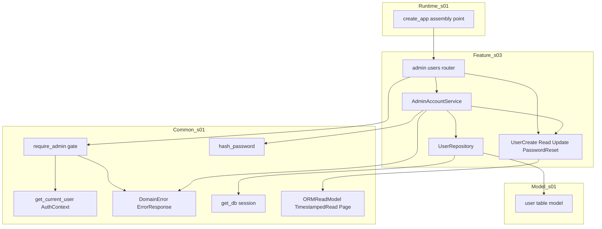
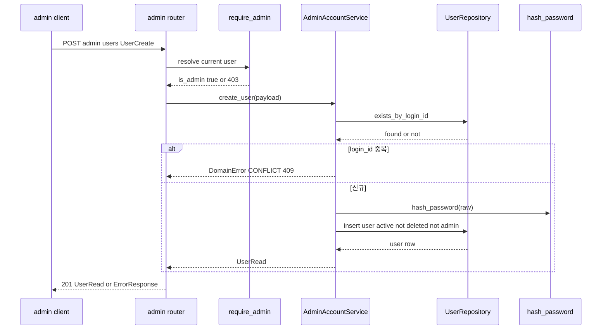
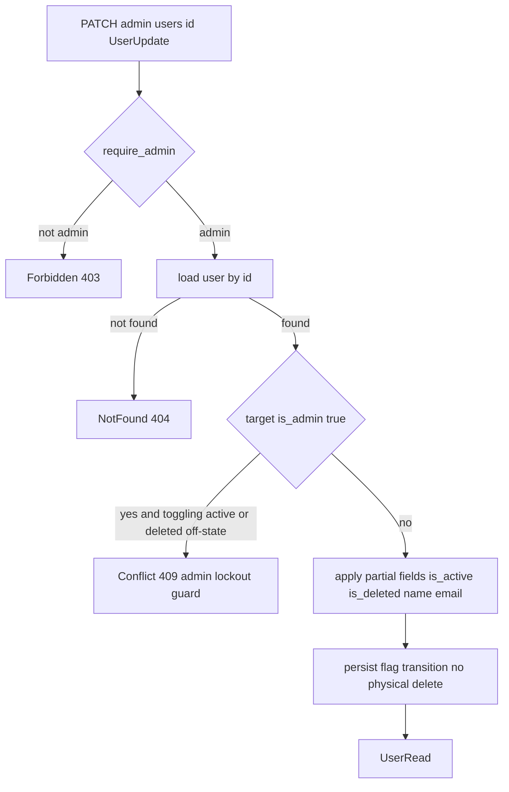

# Design Document — s03-admin-account

## Overview

**Purpose**: 폐쇄형 MarkSpace에서 회원 가입 대신 **단일 admin이 사용자 계정 생명주기를 수동 관리**하는 동작을
구현한다. 대상은 사용자 생성·목록 조회·삭제(flag)·비활동·재활성화·비밀번호 재설정이며, 모두 admin 전용이다.

**Users**: admin(단일 관리자)이 계정관리 엔드포인트를 사용한다. 생성·상태 전환된 계정 상태는 s02(로그인)가
소비하고, s04 통합 체크포인트가 계정 생명주기↔로그인 경계를 검증한다.

**Impact**: `s01-contract-foundation`이 확정한 계약(user 스키마·에러 모델·세션 인증·스키마 규약·해싱 헬퍼)과
빈 라우터 조립 지점 위에, admin 계정 도메인(라우터·서비스·리포지토리·스키마·admin 게이트)을 최초로 채운다.
`s01`의 어떤 계약 엔티티도 재정의하지 않고 재사용한다.

### Goals
- admin 전용 접근 통제 하에 사용자 생성·목록·삭제·비활동·재활성화·비밀번호 재설정을 제공한다(REQ-1~7).
- 모든 삭제·비활동을 flag 전환으로만 표현하고 물리 삭제를 하지 않는다(INV-4).
- `s01` 계약(스키마 규약·에러 모델·인증·해싱)을 재사용하여 계약 드리프트를 방지한다(REQ-8).

### Non-Goals
- 로그인·로그아웃·세션 발급·본인 비밀번호 변경(s02). 계정 상태만 생성하고 로그인 해석은 s02.
- 워크스페이스 소유권 변경(REQ-2.7): **s05-workspace** 소유(§Out of Boundary 참조).
- admin의 문서·데이터 무제약 접근(INV-3): `s01` 권한 resolver가 전 계층 공통 처리.
- 프론트엔드 화면.

## Boundary Commitments

### This Spec Owns
- **admin 계정 도메인 서비스**: 사용자 생성·목록 조회·상태 전이(삭제/비활동/재활성화)·비밀번호 재설정 비즈니스 로직.
- **admin 계정 라우터**: `POST /admin/users`, `GET /admin/users`, `PATCH /admin/users/{id}`,
  `POST /admin/users/{id}/password` (s01 카탈로그 행 5~8).
- **admin 게이트 적용(부착)**: 계정관리 라우트 전체에 `s01` common `require_admin`(권한 계약 소유)을 부착.
  s03는 게이트를 재정의하지 않고 `s01` 정의를 소비만 한다(권한 단일 구현 규칙).
- **User 도메인 스키마**: `UserCreate` / `UserRead` / `UserUpdate` / `AdminPasswordResetRequest`
  (`s01` Base Schemas 규약 상속).
- **User 리포지토리**: `s01` user 모델을 대상으로 한 조회·생성·flag 전환 접근(물리 삭제 없음).

### Out of Boundary
- 로그인 자격 검증·세션 write/clear·본인 비밀번호 변경(s02).
- **워크스페이스 소유권 변경(`POST /admin/workspaces/{id}/owner`, REQ-2.7)**: roadmap·brief가 s05로 배정한다.
  `s01` 카탈로그 행 9의 초기 소유 표기(s03)는 s05로 조정 완료되었다(s01 design.md 변경 이력 참조).
  s03는 이 엔드포인트를 구현하지 않는다.
- INV-3 admin 데이터 접근 우회는 `s01` 권한 resolver 소유(전 계층 공통).
- user 스키마·에러 모델·세션 인증·해싱 헬퍼·스키마 베이스·**권한 게이트(`require_admin`)의 정의**
  (모두 s01 소유, s03는 소비만). `require_admin`은 s01 common 권한 계약(`require_ws_role`과 동일 모듈)으로
  중앙화되어 s03·s05 중복 정의를 제거한다.

### Allowed Dependencies
- **Upstream**: `s01-contract-foundation` — user 모델, `AuthContext`/`get_current_user`,
  **`require_admin`(s01 common 권한 모듈에서 재사용, 재정의 금지)**, `ErrorResponse`/
  `ErrorCode`/`DomainError`, `hash_password`, `ORMReadModel`/`TimestampedRead`/`Page`, `get_db`, 라우터 조립 지점.
- **Shared infra**: FastAPI(라우팅·DI), SQLAlchemy 2.0(sync) 세션, pydantic v2(스키마).
- **제약**: 설정 접근은 `s01` 단일 `Settings` 경유. 물리 삭제 금지(INV-4). 의존 방향은 항상 아래층
  (Schemas → Repository → Service → Dependencies → Router → Bootstrap) 향함. `s01` 계약 시그니처 준수.

### Revalidation Triggers
이 spec의 소비 계약이 다음과 같이 바뀌면 s04(L1) 이상 체크포인트 재검증이 필요하다.
- `s01` user 스키마(컬럼·flag) 변경, `AuthContext`/세션 인증 시그니처 변경, 에러 코드 카탈로그 변경.
- s03 엔드포인트의 경로·메서드·요구 role(admin)·요청/응답 스키마 이름 변경(카탈로그 계약 변경).
- 소유권 정합: REQ-2.7 owner 변경의 s05 배정이 s01 카탈로그에 반영되는 변경.
- 계정 상태 표현(`is_active`/`is_deleted` 의미·독립성) 변경(s02 로그인 소비에 영향).

## Architecture

### Architecture Pattern & Boundary Map

레이어드 아키텍처(steering `structure.md` 정렬). s03는 `s01` 횡단 common·모델을 소비하는 하나의 feature 모듈
(`app/admin_account/`)로 캡슐화된다.



**Architecture Integration**:
- **Selected pattern**: feature 모듈 + 레이어드. 의존 방향은 좌(하위 s01)→우(s03) 단방향.
- **Domain/feature boundaries**: s03는 user 테이블 대상 계정관리 동작만 소유. 인증·에러·해싱·모델은 s01 소유.
- **Existing patterns preserved**: `{Resource}Create/Read/Update` 명명, 단일 `Settings`, 물리 삭제 없음,
  라우터 조립 지점 재사용.
- **New components rationale**: admin 계정 도메인 서비스·리포지토리·라우터·스키마·게이트 5종만 신규. 각 단일 책임.
- **Steering compliance**: 권한 검사(admin 게이트)는 공통 패턴을 재사용하고 라우터별 중복 구현하지 않는다
  (structure.md 코드 조직 원칙). 설정은 s01 `Settings` 주입.

### Dependency Direction (강제)
```
User Schemas → UserRepository → AdminAccountService → require_admin(s01 common) → Admin Router → Bootstrap(assembly)
     (각 레이어는 왼쪽 레이어와 s01 common/model만 import. 위 방향 위반은 리뷰에서 오류로 취급)
```
`app/admin_account/`는 다른 feature 도메인을 import하지 않으며, `s01` `common`·`models`·`schemas.base`만 소비한다.

### Technology Stack

| Layer | Choice / Version | Role in Feature | Notes |
|-------|------------------|-----------------|-------|
| Backend / Runtime | FastAPI(`s01` 버전), uvicorn | 라우팅·의존성 주입 | `s01` 조립 지점에 include_router |
| Auth | `s01` `get_current_user`/`AuthContext`/`require_admin` | admin 여부 판정·게이트 | s03는 s01 `require_admin`을 부착만(재정의 없음) |
| Data / ORM | SQLAlchemy `>=2.0,<2.1`(sync, `s01`) | user 조회·flag 전환 | `s01` `get_db`·user 모델 재사용 |
| Security | `s01` `hash_password`(Argon2id) | 비밀번호 해싱 | 생성·재설정 공용, 평문 저장 금지 |
| Schemas | pydantic v2(`s01` Base Schemas) | 요청/응답 검증 | `{Resource}Create/Read/Update` 규약 |

> 신규 외부 의존성 없음. 전부 `s01`이 도입한 스택 재사용. 버전 근거는 `s01` design·research 참조.

## File Structure Plan

### Directory Structure
```
backend/app/
└── admin_account/                # s03 feature 모듈(신규)
    ├── __init__.py
    ├── router.py                 # 4개 엔드포인트, 전부 s01 common require_admin 게이트 부착
    ├── service.py                # AdminAccountService: 생성/목록/상태전이/비밀번호 재설정 로직
    ├── repository.py             # UserRepository: user 조회·생성·flag 전환(물리 삭제 없음)
    └── schemas.py                # UserCreate/UserRead/UserUpdate/AdminPasswordResetRequest
```

> **게이트 파일 없음**: 이전 계획의 `dependencies.py`는 feature-local `require_admin` 정의만을 위한 파일이었으므로
> 제거한다. `require_admin`이 `s01` common 권한 계약으로 중앙화됨에 따라(권한 단일 구현 규칙), 라우터는 s01의
> `require_admin`을 직접 import하여 부착한다.

### Modified Files
- `backend/app/main.py` **또는** `backend/app/routers/__init__.py` — `s01`이 마련한 feature 라우터 조립 지점에
  `include_router(admin_account.router)`를 추가(REQ-8.5). 조립 지점 위치는 `s01` 구현을 따른다.

> 각 파일 단일 책임. `admin_account/*`는 `s01` `common`·`models`·`schemas.base`만 import하고 다른 feature를
> import하지 않는다. `s01` 계약 요소를 재정의하지 않는다.

## System Flows

### 사용자 생성 흐름


### 계정 상태 전이 판정 (PATCH)


- **판정 요지**: admin 게이트 통과 후 대상 로드→미존재 404. 대상이 관리자면 활동/삭제 flag를 비활성 방향으로
  전환하는 요청을 거부(단일 admin 잠금 방지, 409). `is_active`·`is_deleted`는 독립 갱신.

## Requirements Traceability

| Requirement | Summary | Components | Interfaces / Contracts | Flows |
|-------------|---------|------------|------------------------|-------|
| 1.1–1.4 | admin 전용 접근 통제·admin 단일 출처 | Router(s01 `require_admin` 부착) | `require_admin`(s01 재사용), `AuthContext.is_admin` | 상태 전이 판정 |
| 2.1–2.6 | 사용자 생성·기본 상태·해싱·중복·검증·승격 금지 | Service, Repo, Schemas, Security | `create_user`, `UserCreate/UserRead` | 생성 흐름 |
| 3.1–3.4 | 목록 조회·필드·삭제/비활동 포함·페이지네이션 | Service, Repo, Schemas | `list_users`, `Page[UserRead]` | — |
| 4.1–4.5 | 삭제=is_deleted flag·이름 보존·404·admin 보호·상태 독립 | Service, Repo | `update_user`, `UserUpdate` | 상태 전이 판정 |
| 5.1–5.5 | 비활동=is_active flag·상태 제공·404·admin 보호 | Service, Repo | `update_user` | 상태 전이 판정 |
| 6.1–6.3 | 재활성화=삭제 flag 되돌림·상태 독립·404 | Service, Repo | `update_user` | 상태 전이 판정 |
| 7.1–7.5 | 비밀번호 재설정·해싱·admin 전용·404·검증 | Service, Repo, Security | `reset_password`, `AdminPasswordResetRequest` | — |
| 8.1–8.5 | 스키마 규약·에러 모델·soft-delete·계약 재사용·조립 연결 | 전 컴포넌트, Bootstrap | s01 계약 재사용, `include_router` | 생성 흐름 |

## Components and Interfaces

| Component | Domain/Layer | Intent | Req Coverage | Key Dependencies (P0/P1) | Contracts |
|-----------|--------------|--------|--------------|--------------------------|-----------|
| AdminGate(consume) | Feature/API wiring | s01 `require_admin` 부착(정의 없음) | 1 | s01 require_admin (P0) | API |
| UserSchemas | Feature/Contract | User CRU·재설정 스키마 | 2,3,4,6,7,8 | s01 BaseSchemas (P0) | State |
| UserRepository | Feature/Data | user 조회·생성·flag 전환 | 2,3,4,5,6,7 | s01 Db (P0), s01 UserModel (P0) | Service, State |
| AdminAccountService | Feature/Service | 계정 생명주기 로직 | 2,3,4,5,6,7 | UserRepository (P0), s01 Security (P0), s01 Errors (P1) | Service |
| AdminUserRouter | Feature/API | 4개 엔드포인트 노출 | 1,2,3,4,5,6,7,8 | s01 require_admin (P0), AdminAccountService (P0) | API |
| Bootstrap wiring | Runtime | 라우터 조립 연결 | 8 | s01 create_app (P0), AdminUserRouter (P0) | API |

### Feature / Dependency

#### AdminGate (consume s01 `require_admin`)
| Field | Detail |
|-------|--------|
| Intent | 계정관리 라우트에 s01 common `require_admin`을 부착(게이트 정의는 소유하지 않음) |
| Requirements | 1.1, 1.2, 1.3, 1.4 |

**Responsibilities & Constraints**
- s03는 `require_admin`을 **정의하지 않는다**. `s01` common 권한 모듈(`require_ws_role`과 동일 계약)에서
  `require_admin`을 import하여 라우터에 `Depends(require_admin)`로 부착만 한다.
- `require_admin`은 `s01` `get_current_user`로 `AuthContext`를 확정한 뒤 `is_admin`을 검사하고, 비-admin이면
  403을 산출한다(정의·동작 모두 s01 소유). 비인증(세션 없음·무효)은 `get_current_user`가 401을 산출.
- admin 판정 근거는 `AuthContext.is_admin`(= user.is_admin) 단일 출처. 애플리케이션 승격 수단 없음.
- 중앙화 근거: s03·s05가 각각 `require_admin`을 중복 정의했던 문제를 권한 단일 구현 규칙에 따라 s01로 통합.

**Dependencies**
- Inbound: AdminUserRouter — 전 라우트에 s01 `require_admin` 부착(P0)
- Outbound: s01 Permissions — `require_admin` 재사용(P0); s01 SessionAuth/Errors — 그 내부 의존(s01 소유)

**Contracts**: 소비 계약(s01이 시그니처 소유)
```python
# s01 common 권한 모듈에서 재사용 (s03는 재정의하지 않음)
from app.common.permissions import require_admin

# 라우터 사용법: current: AuthContext = Depends(require_admin)
```
- Preconditions: `s01` SessionMiddleware·`get_current_user`·`require_admin` 등록됨.
- Postconditions: admin이면 `AuthContext` 반환, 아니면 403(비인증은 상위에서 401) — 모두 s01 동작.
- Boundary: s03는 라우트에 부착만 소유. `require_admin` 판정·`AuthContext`·세션 발급 정의는 s01.

### Feature / Contract

#### UserSchemas
| Field | Detail |
|-------|--------|
| Intent | User 요청/응답·비밀번호 재설정 스키마(`{Resource}Create/Read/Update` 규약) |
| Requirements | 2.1, 2.6, 3.2, 4.1, 5.1, 6.1, 7.1, 8.1 |

**Contracts**: State [x]
```python
class UserCreate(BaseModel):
    login_id: str                       # 필수, 공백 금지
    password: str                       # 필수, 평문(즉시 해싱)
    name: str                           # 필수
    email: EmailStr | None = None
    # is_admin/상태 flag는 입력받지 않음(D3 승격 금지)

class UserRead(TimestampedRead):        # s01 TimestampedRead 상속(id, created_at, updated_at)
    login_id: str
    name: str
    email: str | None = None
    is_admin: bool
    is_active: bool
    is_deleted: bool
    # password_hash 미노출

class UserUpdate(BaseModel):            # 부분 갱신
    name: str | None = None
    email: str | None = None
    is_active: bool | None = None
    is_deleted: bool | None = None
    # is_admin 미포함(D3 승격 금지)

class AdminPasswordResetRequest(BaseModel):
    new_password: str                   # 필수, 즉시 해싱
```
- 규약: 생성=`UserCreate`, 응답=`UserRead`(`TimestampedRead` 상속), 수정=`UserUpdate`(부분), 목록=`Page[UserRead]`.
- Boundary: 스키마 형태만 소유. Base 규약(`TimestampedRead`, `Page`)은 s01.

### Feature / Data

#### UserRepository
| Field | Detail |
|-------|--------|
| Intent | user 테이블 조회·생성·flag 전환(물리 삭제 없음) |
| Requirements | 2.1, 2.4, 3.1, 3.3, 4.1, 5.1, 6.1, 7.1 |

**Responsibilities & Constraints**
- `s01` user 모델·`get_db` 세션을 사용. 물리 DELETE를 절대 발행하지 않는다(INV-4).
- 목록은 삭제·비활동 계정을 제외하지 않고 페이지네이션(limit/offset)으로 반환.

**Dependencies**
- Inbound: AdminAccountService — 데이터 접근(P0)
- Outbound: s01 Db — 세션(P0); s01 UserModel — 매핑(P0)

**Contracts**: Service [x] / State [x]
```python
class UserRepository:
    def get_by_id(self, db: Session, user_id: int) -> User | None: ...
    def get_by_login_id(self, db: Session, login_id: str) -> User | None: ...
    def list_paginated(self, db: Session, limit: int, offset: int) -> tuple[list[User], int]: ...
    def create(self, db: Session, *, login_id: str, password_hash: str,
               name: str, email: str | None) -> User: ...   # is_admin=False, is_active=True, is_deleted=False
    def apply_updates(self, db: Session, user: User, changes: dict) -> User: ...  # flag/필드 전환만
    def set_password_hash(self, db: Session, user: User, password_hash: str) -> User: ...
```
- Invariants: 삭제·비활동은 flag 컬럼 갱신으로만 표현. 생성 기본값 `is_admin=False`.
- Notes: `list_paginated`의 total은 전체(삭제 포함) 개수.

### Feature / Service

#### AdminAccountService
| Field | Detail |
|-------|--------|
| Intent | 계정 생성·목록·상태 전이·비밀번호 재설정 비즈니스 로직 |
| Requirements | 2.1, 2.2, 2.3, 2.4, 2.5, 2.6, 3.1, 3.3, 3.4, 4.1, 4.2, 4.4, 4.5, 5.1, 5.3, 5.5, 6.1, 6.2, 7.1, 7.2, 7.3 |

**Responsibilities & Constraints**
- 생성: login_id 중복 검사→409, 비밀번호 `hash_password`, 기본 상태(활동·비삭제·비관리자)로 생성.
- 목록: 페이지네이션 조회→`Page[UserRead]`.
- 상태 전이(update): 대상 로드→미존재 404. 대상이 admin이고 `is_active=false` 또는 `is_deleted=true`로
  전환 시도면 단일 admin 잠금 방지로 409. `is_active`·`is_deleted` 독립 갱신.
- 재설정: 대상 로드→미존재 404, `hash_password`로 갱신.

**Dependencies**
- Inbound: AdminUserRouter — 유스케이스 호출(P0)
- Outbound: UserRepository — 영속(P0); s01 Security — 해싱(P0); s01 Errors — 도메인 오류(P1)

**Contracts**: Service [x]
```python
class AdminAccountService:
    def create_user(self, db: Session, payload: UserCreate) -> UserRead: ...      # 409 on dup login_id
    def list_users(self, db: Session, limit: int, offset: int) -> Page[UserRead]: ...
    def update_user(self, db: Session, user_id: int, changes: UserUpdate) -> UserRead: ...  # 404, 409 admin guard
    def reset_password(self, db: Session, user_id: int, req: AdminPasswordResetRequest) -> None: ...  # 404
```
- Preconditions: 호출자는 admin(라우터 게이트 통과).
- Postconditions: 상태 전이는 flag만 변경(물리 삭제 없음), 비밀번호는 해시로만 저장.
- Invariants: 애플리케이션 경로로 `is_admin` 변경·admin 계정 비활동/삭제 불가.

**Implementation Notes**
- Integration: 도메인 오류는 `s01` `DomainError`로 raise, 전역 핸들러가 `ErrorResponse`로 변환.
- Validation: 스키마 검증(필수·형식)은 pydantic이 422로 처리(s01 핸들러). login_id 중복은 서비스가 409.
- Risks: 단일 admin 잠금 → admin 대상 비활동/삭제 거부 가드로 완화.

### Feature / API

#### AdminUserRouter
| Field | Detail |
|-------|--------|
| Intent | 계정관리 4개 엔드포인트 노출(전부 admin 전용) |
| Requirements | 1.1, 1.2, 1.3, 2.2, 2.4, 2.5, 3.1, 4.1, 5.1, 6.1, 7.1, 8.5 |

**Contracts**: API [x]

##### API Contract
| Method | Endpoint | 요구 role | Request | Response | Errors |
|--------|----------|-----------|---------|----------|--------|
| POST | /admin/users | admin | UserCreate | UserRead | 401, 403, 409, 422 |
| GET | /admin/users | admin | (limit, offset) | Page[UserRead] | 401, 403 |
| PATCH | /admin/users/{id} | admin | UserUpdate | UserRead | 401, 403, 404, 409, 422 |
| POST | /admin/users/{id}/password | admin | AdminPasswordResetRequest | (204 없음 본문) | 401, 403, 404, 422 |

- 전 라우트에 `Depends(require_admin)`(s01 common 재사용) 부착. `s01` API 카탈로그 행 5~8과 정합.
- Boundary: 라우터는 스키마 검증·게이트·서비스 위임만. 로직은 서비스, 정의는 s01.

### Runtime / Bootstrap wiring
| Field | Detail |
|-------|--------|
| Intent | s01 라우터 조립 지점에 admin 라우터 연결 |
| Requirements | 8.5 |

- `s01` `create_app()`의 "feature 라우터 조립 지점"에 `include_router(admin_account.router)`를 추가한다.
- Boundary: 조립 연결만 소유. 부트스트랩·미들웨어·에러 핸들러 등록은 s01.

## Data Models

### Domain Model
- 집계 루트: **User**(계정 상태). s01 소유 스키마를 그대로 사용하며 s03는 새 엔티티·컬럼을 추가하지 않는다.
- 상태 축: `is_active`(로그인 가능 여부)와 `is_deleted`(soft-delete)는 **독립**(docs §2.1). `is_admin`은
  애플리케이션 경로로 불변.

### Physical Data Model
- 대상 테이블: `s01` `user`(변경 없음). s03는 마이그레이션을 추가하지 않는다.
- 사용 컬럼: `id, login_id, password_hash, name, email, is_admin, is_active, is_deleted, created_at, updated_at`.
- 인덱스: `s01`의 `(is_deleted, is_active)`가 목록·필터를 지원.

### Data Contracts & Integration
- **API 데이터 전송**: 요청/응답은 `s01` Base Schemas 규약(JSON). `UserRead`는 `password_hash` 미노출.
- **에러 직렬화**: 전 엔드포인트 `s01` `ErrorResponse` 단일 형태.

## Error Handling

### Error Strategy
- 단일 변환 지점: 서비스는 `s01` `DomainError`를 raise하고 s01 전역 핸들러가 `ErrorResponse`로 변환.

### Error Categories and Responses
| HTTP | ErrorCode | 발생 조건(s03) |
|------|-----------|----------------|
| 401 | unauthenticated | 세션 없음·무효(s01 `get_current_user`) |
| 403 | forbidden | admin 아님(`require_admin`) |
| 404 | not_found | 대상 사용자 id 부재(update/reset) |
| 409 | conflict | login_id 중복 생성, admin 계정 비활동/삭제 시도(단일 admin 잠금 방지) |
| 422 | validation_error | 필수 누락·형식 오류(pydantic) |

### Monitoring
- 표준 로깅(s01). 별도 관측 인프라 없음.

## Testing Strategy

### Unit Tests
- 라우트 게이트(s01 `require_admin` 부착): admin→통과, 비-admin `AuthContext`→403, 비인증→401(s01 경유)를
  라우터 레벨에서 확인(1.1, 1.2, 1.3). `require_admin` 정의 자체의 단위 테스트는 s01 소유.
- `create_user`: 정상 생성 시 `is_active=true`·`is_deleted=false`·`is_admin=false`이고 비밀번호가 해시로 저장,
  중복 login_id→409, 필수 누락→422, is_admin 입력 무시(2.1, 2.2, 2.3, 2.4, 2.6).
- `update_user`: `is_deleted=true` 전환(물리 삭제 아님)·`is_active=false` 전환·재활성화(`is_deleted=false`),
  두 flag 독립, 미존재→404, admin 대상 비활동/삭제→409(4.1, 4.4, 4.5, 5.1, 5.5, 6.1, 6.2).
- `reset_password`: 해시 저장·미존재→404·누락 비밀번호→422, self-reset 경로 부재(7.1, 7.2, 7.4, 7.5).
- `list_users`: 삭제·비활동 계정 포함, `Page`의 items/total 규약(3.1, 3.3, 3.4).

### Integration Tests
- 마이그레이션된 DB + 앱 부팅 상태에서 `POST /admin/users`(admin 세션)→201 `UserRead`, 비-admin→403,
  비인증→401(1.2, 1.3, 2.2, 8.5).
- 생성→`GET /admin/users` 목록 노출→`PATCH`로 삭제(is_deleted)→목록에서 삭제 상태로 계속 노출→재활성화 왕복
  (3.1, 3.3, 4.1, 6.1).
- `POST /admin/users/{id}/password` 후 저장 비밀번호가 새 해시로 갱신(평문 아님)됨 확인(7.1, 7.2).
- 라우터가 `s01` 조립 지점에 등록되어 부팅 시 경로가 노출됨(8.5).

### Contract Consistency Tests
- 응답 스키마가 `{Resource}Read`(`TimestampedRead` 상속)·`Page[UserRead]` 규약을 따르고 `password_hash`
  미노출(8.1).
- 모든 오류가 `s01` `ErrorResponse`(code/message/field_errors) 형태(8.2).
- 삭제·비활동 경로에서 레코드가 물리적으로 제거되지 않음(INV-4, 8.3).

## Security Considerations
- 비밀번호는 `s01` `hash_password`(Argon2id)로만 저장. 평문·응답 노출 금지(`UserRead`에 password 필드 없음).
- admin 게이트는 `AuthContext.is_admin` 단일 출처. 애플리케이션에 admin 생성·승격 기능 없음(수동 DB, docs 2.1).
- 단일 admin 잠금 방지: admin 계정의 애플리케이션 경유 비활동·삭제 거부.
- 비밀번호 재설정은 admin 전용. 사용자 self-reset 경로 없음(docs 1.6).

## Supporting References
- 계약 단일 소스(스키마·에러·인증·해싱·카탈로그·불변식): `s01-contract-foundation/design.md`.
- 설계 결정·소유권 정합(owner 변경 s05 배정)·위험: `research.md`.
- 상위 근거: `docs/projects.md` §2.1 user, §3 REQ-1.6·REQ-2, §5 INV-3·INV-4.
