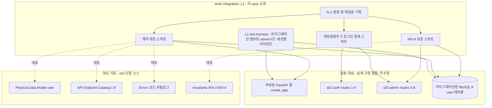
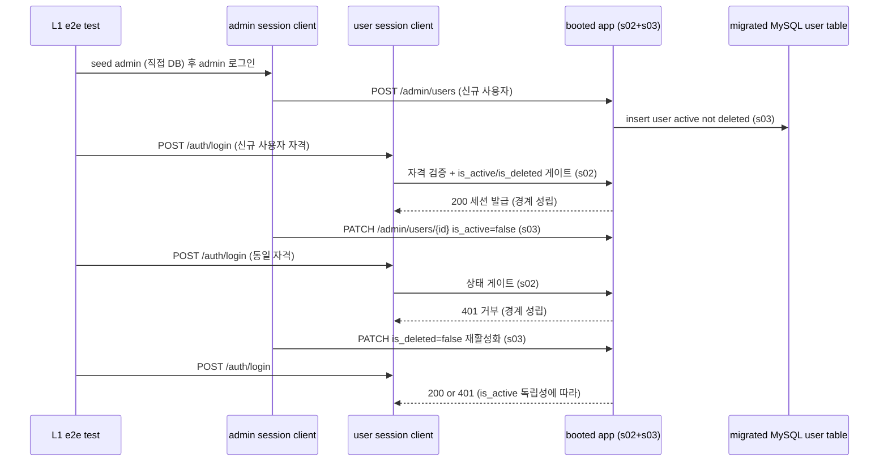
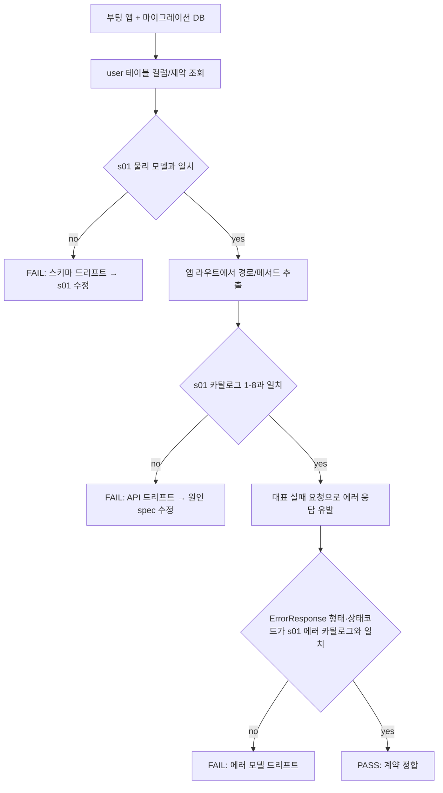

# Design Document — s04-integration-check-L1

## Overview

**Purpose**: `s04-integration-check-L1`은 **L1 누적 통합 검증 체크포인트**다. 이 시점까지 완성된 upstream 누적 집합
(`s01-contract-foundation` ⊕ `s02-auth` ⊕ `s03-admin-account`)이 `s01` 단일 계약 소스와 정합하는지, 그리고 이번
계층에서 처음 결합되는 경계(**계정 생명주기 ↔ 로그인 게이트**)가 실제 결합 상태에서 성립하는지 mock 없이 검증한다.
산출물은 **integration/e2e 테스트 자산과 게이트 판정 기록**뿐이며, feature 로직·엔드포인트·스키마·마이그레이션을
신규 구현하지 않는다.

**Users**: 로드맵 게이트 관리자가 이 체크포인트의 통과 여부로 **G-1**(L2 `s05-workspace` impl 착수 선행 조건)을
판정한다. upstream 구현자는 이 체크포인트를 회귀 조기 경보로 사용한다.

**Impact**: 현재 `backend/`에는 s01 공용 인프라 + s02 `app/auth/` + s03 `app/admin_account/` 구현이 존재한다(가정).
이 체크포인트는 그 위에 `backend/tests/integration_L1/` 테스트 스위트와 하네스만 추가하며, 어떤 애플리케이션 코드도
수정하지 않는다.

### Goals
- 실제 결합(마이그레이션된 DB + 부팅 앱 + 실제 세션)에서 계약 대조 검증: user 스키마·인증/계정 API·에러 모델이
  `s01` 단일 소스와 일치.
- cross-spec 경계 e2e 검증: 생성→로그인, 비활동→거부, 삭제→거부, 재활성화→재허용, admin 재설정→로그인, 본인
  변경→로그인, INV-4 보존.
- G-1 통과/미통과 판정과 재검증 트리거 대상을 명확히 산출.

### Non-Goals
- 새로운 feature 동작·엔드포인트·서비스·스키마·마이그레이션 구현(s01/s02/s03 소유, 완료 가정).
- 개별 spec 단위 검증의 재실행(각 spec 자체 테스트 소유). 체크포인트는 결합·경계만 본다.
- 발견된 계약 위반의 수정(원인 spec에서 수정 후 재실행).
- 워크스페이스·문서 등 L2 이상 관심사(후속 체크포인트 소유).

## Boundary Commitments

### This Spec Owns
- **L1 통합 테스트 하네스**: 마이그레이션 적용·앱 부팅·admin 사용자 시드·세션 유지 클라이언트를 제공하는 픽스처
  (`tests/integration_L1/conftest.py`). mock을 쓰지 않는 실제 결합 환경.
- **계약 대조 스위트**: 실제 결합 런타임의 user 스키마·인증/계정 API 노출·공통 에러 형태를 `s01` 단일 소스와 대조.
- **계정 생명주기 ↔ 로그인 경계 스위트**: brief의 6개 cross-spec 시나리오 e2e.
- **INV-4 보존 스위트**: 삭제 처리 시 물리 삭제 없음·이름 보존 확인.
- **G-1 판정·재검증 트리거 기록**: 검증 결과를 게이트 통과 조건으로 집계하고 재검증 대상(s01/s02/s03)을 명시.

### Out of Boundary
- 애플리케이션 코드 일체(`app/common/*`, `app/auth/*`, `app/admin_account/*`, `app/models/*`, 마이그레이션).
  체크포인트는 이들을 **소비·관찰만** 하고 수정하지 않는다.
- 로그인·계정관리의 **동작 정의**(s02·s03). 로그인 게이트·계정 상태 전이 로직은 검증 대상이지 구현 대상이 아니다.
- 계약 문서(엔드포인트 카탈로그·불변식 카탈로그·에러 카탈로그) 자체의 **정의·완전성**(s01 소유).
- s02·s03 각각의 단위 로직 재검증(각 spec 소유). 여기서는 상태 매개 **결합**만 검증.
- 검증 실패의 코드 수정 — 원인 upstream spec에서 처리.

### Allowed Dependencies
- **Upstream(검증 대상, 실제 구현 결합)**: `s01-contract-foundation`, `s02-auth`, `s03-admin-account`의 실제 구현.
- **대조 기준(single source of truth)**: `s01-contract-foundation/design.md`
  (§Physical Data Model · §API Endpoint Catalog 1~8 · §Errors 에러 코드 카탈로그 · §Invariants Catalog INV-3·4).
- **Shared infra(테스트 실행)**: FastAPI `TestClient`(Starlette, 쿠키 자 유지), SQLAlchemy 2.0(sync) 세션·
  `information_schema` 조회, Alembic 마이그레이션, pytest, MySQL 8. 모든 backend 명령은 `backend/`에서 `uv run`.
- **제약**: mock·stub·가짜 구현 금지(실제 결합만). 설정 접근은 `s01` 단일 `Settings` 경유. 애플리케이션 코드 무수정.
  대조 기준은 개별 spec design이 아니라 `s01` 단일 소스.

### Revalidation Triggers
이 체크포인트는 **재검증 트리거의 최초 소비 지점**이다(roadmap §재검증 트리거). 다음 변경 시 이 체크포인트(및
로드맵상 그 이후 모든 체크포인트 L2~L6)를 누적 집합 기준으로 재실행한다.
- `s01` 계약 변경: DB 스키마(컬럼·제약·ENUM·인덱스), 공통 에러 응답·코드 카탈로그, 세션 인증 의존성·권한 resolver
  시그니처, `{Resource}Create/Read/Update` 규약·엔드포인트 카탈로그(경로·메서드·요구 role·소유권), 불변식 카탈로그.
- `s02` 변경: 인증 엔드포인트 경로·메서드·인증 요구, 세션 write/clear·payload 키, 로그인 상태 게이트 규칙, 로그인/
  비밀번호 변경 실패의 에러 코드·상태 매핑.
- `s03` 변경: 계정관리 엔드포인트 경로·메서드·admin 요구·스키마 이름, 계정 상태(`is_active`/`is_deleted`) 표현·독립성,
  비밀번호 재설정 동작.
- 재실행 시에도 mock 없이 실제 구현을 결합한 상태로 검증한다.

## Architecture

### Architecture Pattern & Boundary Map

체크포인트는 애플리케이션 아키텍처를 확장하지 않는다. `tests/integration_L1/` 하나의 테스트 계층이 부팅된 실제
애플리케이션과 실제 DB를 **관찰**하여 s01 단일 소스와 대조한다.



**Architecture Integration**:
- **Selected pattern**: 테스트 전용 검증 계층(외부 관찰자). 실제 결합 e2e로 경계 회귀를 조기 포착.
- **Domain/feature boundaries**: 체크포인트는 어떤 도메인 코드도 소유하지 않는다. `tests/integration_L1/`만 소유.
- **Existing patterns preserved**: uv 실행 표준, 단일 `Settings`, 부팅 앱(`create_app`)·마이그레이션 재사용,
  물리 삭제 없음(INV-4) 관찰.
- **New components rationale**: 신규는 테스트 하네스와 스위트뿐. 각 스위트는 단일 검증 관심사(계약/경계/불변식).
- **Steering compliance**: 계약 대조 기준을 s01 단일 소스로 고정(계약 드리프트 방지). mock 금지로 실제 결합 검증.

### Dependency Direction (강제)
```
s01 단일 소스(대조 기준)  ←대조←  Contract/Boundary/INV 스위트  ←관찰←  부팅 앱 + 마이그레이션 DB(s01·s02·s03 결합)
                                              ↑
                                     L1 test harness(conftest)
```
테스트 계층은 애플리케이션을 **관찰**만 하고 역방향으로 코드를 수정하지 않는다. 하네스는 `s01` `create_app`·
마이그레이션·`Settings`를 재사용한다.

### Technology Stack

체크포인트는 신규 런타임/라이브러리를 도입하지 않는다(테스트 도구만 사용).

| Layer | Choice / Version | Role in Feature | Notes |
|-------|------------------|-----------------|-------|
| Test Runner | pytest(`s01` 스택) | 통합/e2e 테스트 실행 | `backend/`에서 `uv run pytest` |
| App Under Test | FastAPI `create_app`(s01) | 실제 결합된 부팅 앱 | s02·s03 라우터가 조립된 상태 |
| HTTP Client | Starlette `TestClient` | 실제 세션 쿠키 유지 e2e | 로그인→후속 요청 쿠키 자동 전달 |
| Data / ORM | SQLAlchemy 2.0(sync, s01) | user 레코드·`information_schema` 조회 | 스키마 대조·INV-4 관찰 |
| Migration | Alembic(s01) | 검증용 스키마 준비 | `uv run alembic upgrade head` |
| DB | MySQL 8 | 실제 결합 저장소 | mock 금지 — 실 DB 필수 |

> 신규 외부 의존성 없음. 스택 근거는 `s01` design·research 참조.

## File Structure Plan

### Directory Structure
```
backend/tests/integration_L1/           # s04 체크포인트 소유(신규, 테스트 전용)
├── __init__.py
├── conftest.py                         # L1 하네스: 마이그레이션·부팅 앱·admin 시드·세션 유지 클라이언트 픽스처
├── helpers.py                          # 로그인/계정 생성·상태 전이 호출 등 시나리오 헬퍼(라우트 호출 래퍼)
├── test_contract_conformance.py        # user 스키마·API 노출(1~8)·에러 모델·민감필드 대조 (REQ-2)
├── test_account_lifecycle_login.py     # 생성→로그인, 비활동→거부, 삭제→거부, 재활성화→재허용,
│                                       #   admin 재설정→로그인, 본인 변경→로그인 (REQ-3,4,5,6)
└── test_soft_delete_preservation.py    # INV-4 물리 삭제 없음·이름 보존 (REQ-7)
```

### Modified Files
- 없음. 체크포인트는 애플리케이션 코드를 수정하지 않는다. (`conftest.py`가 필요로 하는 테스트 설정은 `s01`
  `Settings`/`config.yml`의 기존 값을 재사용하며 별도 설정 파일을 신설하지 않는다.)

> `tests/integration_L1/*`은 `s01`·`s02`·`s03`의 공개 표면(부팅 앱·라우트·DB)만 소비하고, 대조 기준으로 `s01`
> design의 계약 요소를 참조한다. 게이트 판정 결과는 테스트 실행 결과(전부 통과 = G-1 통과)로 산출된다.

## System Flows

### cross-spec 경계 e2e — 상태 매개 결합 관찰


- **게이트 조건**: s03로 상태를 만들고 s02로 로그인 결과를 관찰한다. 두 spec은 `user` 테이블 상태로만 결합되므로,
  이 흐름이 실패하면 상태 표현(s03)과 상태 해석(s02) 사이의 계약 드리프트를 가리킨다.

### 계약 대조 판정


## Requirements Traceability

| Requirement | Summary | Components | Interfaces / Contracts | Flows |
|-------------|---------|------------|------------------------|-------|
| 1.1–1.4 | mock 없는 실제 결합·s01 단일 소스 기준·feature 미구현·위반은 원인 spec 수정 | L1TestHarness, 전 스위트 | 실 DB·부팅 앱·세션 클라이언트 | 두 흐름 공통 |
| 2.1 | user 스키마 s01 물리 모델과 일치 | ContractConformanceSuite, L1TestHarness | `information_schema`/ORM ↔ s01 user | 계약 대조 |
| 2.2 | 인증 API 1~4 노출 정합 | ContractConformanceSuite | 앱 라우트 ↔ s01 카탈로그 1~4 | 계약 대조 |
| 2.3 | 계정관리 API 5~8 노출 정합 | ContractConformanceSuite | 앱 라우트 ↔ s01 카탈로그 5~8 | 계약 대조 |
| 2.4 | 에러 응답 형태·상태코드 정합 | ContractConformanceSuite | `ErrorResponse` ↔ s01 에러 카탈로그 | 계약 대조 |
| 2.5 | 민감 필드 미노출 | ContractConformanceSuite | 응답 본문 검사 | 계약 대조 |
| 3.1 | 생성→로그인 성공 | AccountLifecycleLoginSuite, Helpers | `/admin/users`→`/auth/login` | cross-spec e2e |
| 3.2, 3.3 | 재설정→새 비번 로그인·옛 비번 거부 | AccountLifecycleLoginSuite | `/admin/users/{id}/password`→`/auth/login` | cross-spec e2e |
| 4.1 | 비활동→로그인 거부 | AccountLifecycleLoginSuite | `PATCH is_active=false`→`/auth/login` 401 | cross-spec e2e |
| 4.2 | 삭제→로그인 거부 | AccountLifecycleLoginSuite | `PATCH is_deleted=true`→`/auth/login` 401 | cross-spec e2e |
| 4.3 | 보유 세션도 상태 전이 후 401 | AccountLifecycleLoginSuite | 상태 전이 후 `/auth/me` 401 | cross-spec e2e |
| 5.1 | 재활성화→로그인 재성공 | AccountLifecycleLoginSuite | `PATCH is_deleted=false`→`/auth/login` | cross-spec e2e |
| 5.2 | 상태 독립성(비활동 유지 시 여전히 거부) | AccountLifecycleLoginSuite | 두 flag 독립 관찰 | cross-spec e2e |
| 6.1, 6.2 | 본인 변경→새 비번 로그인·옛 비번 거부 | AccountLifecycleLoginSuite | `/auth/password`→`/auth/login` | cross-spec e2e |
| 7.1–7.3 | 삭제 시 물리 삭제 없음·이름 보존 | SoftDeletePreservationSuite | DB 레코드 존재·`GET /admin/users` | 계약 대조 |
| 8.1–8.3 | G-1 통과/미통과 판정·재검증 트리거 명시 | GateVerdict | 전 스위트 결과 집계 | — |

## Components and Interfaces

| Component | Domain/Layer | Intent | Req Coverage | Key Dependencies (P0/P1) | Contracts |
|-----------|--------------|--------|--------------|--------------------------|-----------|
| L1TestHarness | Test/Fixture | 실 결합 환경(마이그레이션·앱·admin시드·세션클라이언트) | 1,2,3,4,5,6,7 | s01 create_app (P0), Alembic (P0), MySQL (P0) | State |
| ContractConformanceSuite | Test/Contract | 스키마·API·에러 모델 대조 | 2,7 | L1TestHarness (P0), s01 단일 소스 (P0) | Batch |
| AccountLifecycleLoginSuite | Test/E2E | 계정 생명주기↔로그인 경계 시나리오 | 3,4,5,6 | L1TestHarness (P0), Helpers (P0) | Batch |
| SoftDeletePreservationSuite | Test/E2E | INV-4 보존 검증 | 7 | L1TestHarness (P0) | Batch |
| Helpers | Test/Support | 로그인·계정 전이 호출 래퍼 | 3,4,5,6 | L1TestHarness (P0) | Service |
| GateVerdict | Test/Report | G-1 판정·재검증 트리거 기록 | 8 | 전 스위트 (P0) | Batch |

### Test / Fixture

#### L1TestHarness
| Field | Detail |
|-------|--------|
| Intent | mock 없는 실제 결합 검증 환경 제공 |
| Requirements | 1.1, 1.3, 2.1, 3.1, 4.1, 5.1, 6.1, 7.1 |

**Responsibilities & Constraints**
- 마이그레이션을 실제 MySQL 8에 적용(`alembic upgrade head`)하여 s01 스키마가 존재하는 DB를 준비한다.
- `s01` `create_app()`로 애플리케이션을 부팅한다 — s02·s03 라우터가 이미 조립된 상태여야 한다.
- **admin 시드**: 애플리케이션에 admin 생성 경로가 없으므로 리포지토리/ORM 또는 직접 INSERT로 `is_admin=true`
  사용자를 DB에 생성한다(테스트 준비 목적, feature 로직 아님).
- 세션 쿠키를 유지하는 `TestClient`를 제공하여 로그인 세션이 후속 요청에 실제로 전달되게 한다.
- **제약**: 어떤 애플리케이션 코드도 수정하지 않는다. mock을 사용하지 않는다. 설정은 s01 `Settings` 재사용.

**Dependencies**
- Inbound: 전 스위트 — 결합 환경(P0)
- Outbound: s01 `create_app`·마이그레이션·`Settings`·user 모델(P0); MySQL 8(P0)

**Contracts**: State [x]
- Preconditions: MySQL 8 가용, s01·s02·s03 구현이 배치됨.
- Postconditions: 마이그레이션된 DB + 부팅 앱 + admin 시드 계정 + 세션 클라이언트 제공. 테스트 종료 시 정리.
- Invariants: mock 부재. 각 테스트는 고유 login_id로 상태 격리.

**Implementation Notes**
- Integration: `uv run pytest`로 실행. DB URL은 s01 `Settings.sqlalchemy_url` 재사용.
- Validation: DB 미가용 시 스킵이 아니라 **실패** 처리하여 미검증이 통과로 오인되지 않게 한다.
- Risks: 테스트 상태 오염 → 트랜잭션 롤백/정리 픽스처와 고유 식별자.

### Test / Contract

#### ContractConformanceSuite
| Field | Detail |
|-------|--------|
| Intent | 실제 결합 런타임을 s01 단일 소스와 대조 |
| Requirements | 2.1, 2.2, 2.3, 2.4, 2.5 |

**Responsibilities & Constraints**
- **스키마**: 마이그레이션된 `user` 테이블의 컬럼·유일제약(`login_id`)·flag 컬럼(`is_admin`/`is_active`/
  `is_deleted`)·`password_hash`가 s01 물리 모델과 일치하는지 `information_schema` 또는 ORM 메타데이터로 대조.
- **API 노출**: 부팅 앱 라우트에서 경로·메서드를 추출해 s01 카탈로그 1~8(auth 4 + admin 4)과 대조. 요구 인증/
  admin 게이트가 실제로 걸려 있는지(미인증 401·비-admin 403) 대표 요청으로 확인.
- **에러 모델**: 미인증(401)·비-admin(403)·미존재(404)·중복 login_id(409)·검증 실패(422)를 실제로 유발해 응답이
  `ErrorResponse`(`code`/`message`/`field_errors`) 형태이고 상태 코드가 s01 에러 카탈로그와 일치하는지 확인.
- **민감 필드**: `/auth/me`·`/auth/login`·`/admin/users` 응답에 `password_hash`가 없는지 확인.
- **제약**: s01 카탈로그가 **대조 기준**이다. s02·s03 design은 기준이 아니라 검증 대상.

**Contracts**: Batch [x]
- Trigger: `uv run pytest tests/integration_L1/test_contract_conformance.py`.
- Output: 각 대조 항목의 pass/fail. 불일치 시 어느 계약 요소가 드리프트했는지 지목.

### Test / E2E

#### AccountLifecycleLoginSuite
| Field | Detail |
|-------|--------|
| Intent | 계정 생명주기(s03) ↔ 로그인(s02) 경계 e2e |
| Requirements | 3.1, 3.2, 3.3, 4.1, 4.2, 4.3, 5.1, 5.2, 6.1, 6.2 |

**Responsibilities & Constraints**
- 시나리오는 모두 admin이 생성한 **비-admin 사용자**를 대상으로 한다(admin 대상 비활동/삭제는 s03가 409로 막음).
- **생성→로그인**: admin `POST /admin/users` → 사용자 `POST /auth/login` 200 + 세션(3.1).
- **비활동→거부**: admin `PATCH is_active=false` → 동일 자격 로그인 401, 세션 미발급(4.1).
- **삭제→거부**: admin `PATCH is_deleted=true` → 로그인 401(4.2). 보유 세션도 이후 `/auth/me` 401(4.3).
- **재활성화→재허용**: admin `PATCH is_deleted=false` → 로그인 200(5.1). 단, `is_active=false` 유지 시 삭제 flag만
  되돌려도 여전히 401(5.2, 상태 독립성).
- **admin 재설정→로그인**: admin `POST /admin/users/{id}/password` → 새 비번 로그인 200, 옛 비번 401(3.2, 3.3).
- **본인 변경→로그인**: 사용자 로그인 → `POST /auth/password` → 새 비번 로그인 200, 옛 비번 401(6.1, 6.2).
- **제약**: 실제 세션 쿠키 자를 사용(로그인→후속 요청 정합). mock 없음.

**Contracts**: Batch [x]
- Trigger: `uv run pytest tests/integration_L1/test_account_lifecycle_login.py`.
- Output: 6개 시나리오 그룹의 pass/fail. 실패 시 상태 표현(s03)/상태 해석(s02) 중 어느 쪽 경계인지 시사.

#### SoftDeletePreservationSuite
| Field | Detail |
|-------|--------|
| Intent | 물리 삭제 없음(INV-4)·이름 보존 확인 |
| Requirements | 7.1, 7.2, 7.3 |

**Responsibilities & Constraints**
- admin이 사용자를 삭제(`is_deleted=true`) 처리한 뒤 DB에서 해당 user 레코드가 물리적으로 존재함을 직접 조회로 확인.
- 삭제된 사용자의 이름·식별 정보가 보존되어 `GET /admin/users` 목록에 삭제 상태로 계속 노출됨을 확인.
- 생명주기 시나리오 전반에서 user 레코드 개수가 물리 삭제로 줄지 않았음을 확인(생성·삭제·재활성화 왕복).

**Contracts**: Batch [x]
- Trigger: `uv run pytest tests/integration_L1/test_soft_delete_preservation.py`.
- Output: INV-4 보존 pass/fail.

### Test / Report

#### GateVerdict
| Field | Detail |
|-------|--------|
| Intent | G-1 통과 판정과 재검증 트리거 대상 기록 |
| Requirements | 8.1, 8.2, 8.3 |

**Responsibilities & Constraints**
- Requirement 2~7 스위트가 **전부 통과**하면 G-1 통과로 집계(전체 `uv run pytest tests/integration_L1` 성공).
  하나라도 실패하면 미통과로, L2 impl 착수 차단으로 표시.
- 재검증 트리거 대상(s01·s02·s03 수정 시 이 체크포인트 및 이후 모든 체크포인트 재실행)을 문서/주석으로 명시.
- **제약**: 판정은 실제 테스트 실행 결과로만 산출한다(수동 선언 금지).

**Contracts**: Batch [x]
- Trigger: `uv run pytest tests/integration_L1`(전체).
- Output: 전체 통과 = G-1 통과. 요약에 재검증 트리거 목록 포함.

## Data Models

### Domain Model
- 체크포인트는 **새 엔티티·테이블·컬럼을 정의하지 않는다.** s01 `user` 테이블(및 s01~s03가 채운 상태)을 읽기·관찰만
  한다. 테스트 준비를 위한 admin 시드·사용자 생성은 s03 경로 또는 s01 모델을 통해 수행하며 스키마를 변경하지 않는다.
- 관찰 대상 상태 축: `is_active`(로그인 가능), `is_deleted`(soft-delete), `password_hash`(자격). 두 flag는 독립.

### Data Contracts & Integration
- **API 데이터 전송**: 검증은 s01 base 규약(`{Resource}Create/Read/Update`, `ErrorResponse`) 준수를 **확인**한다.
- **에러 직렬화**: 전 엔드포인트가 s01 `ErrorResponse` 단일 형태임을 확인 대상으로 삼는다.

## Error Handling

### Error Strategy
- 체크포인트 자체는 도메인 에러를 생성하지 않는다. 대신 검증 대상 시스템의 에러 응답을 **관찰**하여 s01 에러 모델과
  대조한다. 테스트 실패(assertion)는 계약/경계 회귀를 가리키며, 원인 spec에서 수정한다.

### Error Categories and Responses
- **계약 드리프트**: 스키마/API/에러 형태 불일치 → ContractConformanceSuite 실패.
- **경계 회귀**: 상태 전이가 로그인 결과에 반영되지 않음 → AccountLifecycleLoginSuite 실패.
- **불변식 위반**: 물리 삭제 발생 → SoftDeletePreservationSuite 실패.
- **환경 미충족**: DB 미가용 등은 스킵이 아니라 실패로 처리(미검증의 통과 오인 방지).

## Testing Strategy

> 이 spec의 산출물 자체가 테스트다. 아래는 스위트 구성의 근거(요구 수용 기준 매핑)다.

### Integration / E2E Tests
- **계약 대조**(REQ-2, 7): 마이그레이션된 DB의 user 스키마 ↔ s01 물리 모델; 부팅 앱 라우트 ↔ s01 카탈로그 1~8;
  대표 실패 요청의 에러 응답 ↔ s01 에러 카탈로그; 응답 민감 필드 부재.
- **생성/재설정 정방향**(REQ-3): 생성→로그인 200; admin 재설정→새 비번 200·옛 비번 401.
- **비활동/삭제 거부**(REQ-4): 비활동→401; 삭제→401; 보유 세션 무효화(`/auth/me` 401).
- **재활성화·상태 독립성**(REQ-5): 삭제 flag 되돌림→200; 비활동 유지 시 되돌려도 401.
- **본인 비밀번호 변경 정합**(REQ-6): 변경→새 비번 200·옛 비번 401.
- **INV-4 보존**(REQ-7): 삭제 후 레코드 물리 존재·이름 보존·목록 노출·레코드 수 불감소.
- **G-1 판정**(REQ-8): 전체 스위트 통과 집계 = G-1 통과; 재검증 트리거 목록 명시.

### 실행 표준
- 모든 테스트는 `backend/`에서 `uv run pytest tests/integration_L1`로 실행. 실제 MySQL 8·마이그레이션 전제.

## Security Considerations
- 응답 민감 필드(`password_hash`) 부재를 결합 관점에서 재확인(계정 열거·자격 노출 방지 계약이 결합에서도 유지되는지).
- admin 시드는 테스트 하네스 한정이며 애플리케이션에 admin 생성·승격 경로를 추가하지 않는다(product.md 폐쇄형 원칙).
- 로그인 실패는 사유 불문 401 동일 응답(계정 열거 방지)이 결합에서도 유지되는지 확인.

## Supporting References
- 대조 기준 단일 소스: `s01-contract-foundation/design.md`(§Physical Data Model·§API Endpoint Catalog 1~8·
  §Errors·§Invariants Catalog INV-3·4·§Bootstrap `create_app`).
- 검증 대상 동작: `s02-auth/design.md`(로그인 상태 게이트·본인 비번 변경), `s03-admin-account/design.md`(계정
  상태 전이·단일 admin 잠금·비밀번호 재설정·INV-4).
- 게이트·재검증 트리거: `.kiro/steering/roadmap.md`(§게이트 G-1·§재검증 트리거·§Shared seams to watch).
- 검증 방법·리스크·결정: `research.md`.
