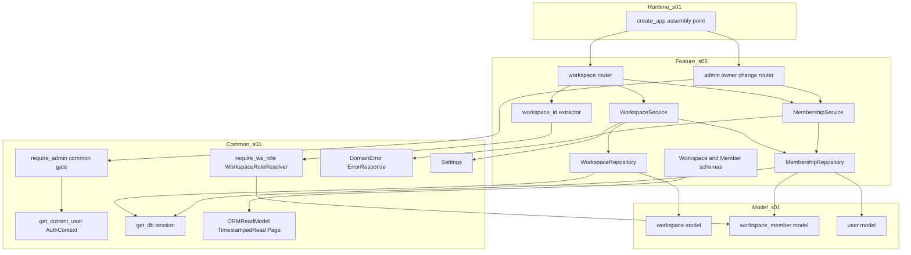
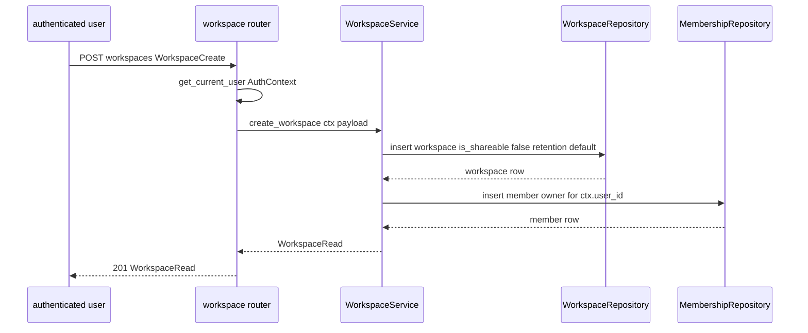
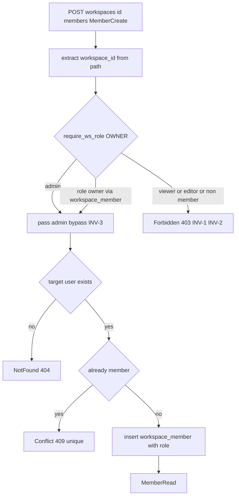
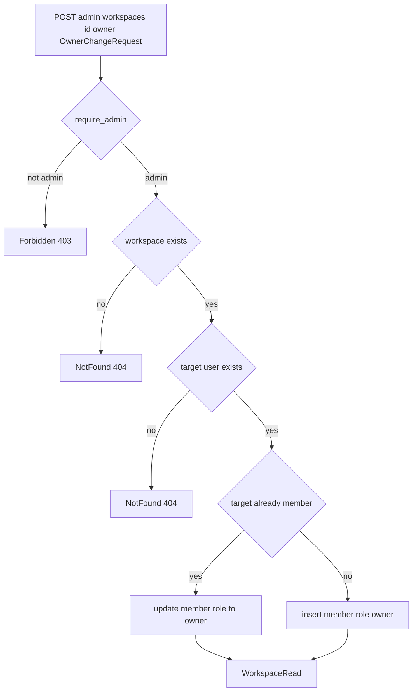

# Design Document — s05-workspace

## Overview

**Purpose**: Notion-lite의 **협업 권한 단위인 워크스페이스**를 구현한다. 워크스페이스 CRUD, 멤버십
(owner/editor/viewer) 관리, `is_shareable`·`trash_retention_days` 설정, admin 소유권 변경을 소유하며,
무엇보다 `s01` 워크스페이스 권한 resolver를 **실제 멤버십 role로 동작**시켜 INV-1·2·3을 실효화한다.

**Users**: 인증된 사용자는 워크스페이스를 만들고 owner로서 멤버·설정을 관리한다. admin은 소유자 없는
워크스페이스에 owner를 지정한다. 하위 문서 도메인(s07 이하)은 이 spec이 채운 `workspace_member`를
근거로 `s01` resolver가 실제 권한을 게이팅할 것을 소비한다. s06 통합 체크포인트가 이 권한 경계를 검증한다.

**Impact**: `s01`이 확정한 계약(workspace·workspace_member 스키마, 권한 resolver, 세션 인증, 에러 모델,
Base Schemas, 라우터 조립 지점) 위에 워크스페이스 도메인(라우터·서비스·리포지토리·스키마·admin 게이트)을
최초로 채운다. `s01`의 어떤 계약 엔티티도 재정의하지 않고 재사용한다. 권한 resolver가 데이터 부재로
admin만 통과시키던 상태에서, 실제 role 판정이 동작하는 상태로 전환한다.

### Goals
- 워크스페이스 생성·목록·상세·수정·삭제와 멤버십 추가·role 변경·제거를 owner/admin 통제 하에 제공한다(REQ-1·2·3).
- `is_shareable` 공유 게이트·`trash_retention_days` 보관일을 owner/admin이 설정하게 한다(REQ-2, docs 7.2).
- `workspace_member` 데이터를 소유·채워 `s01` resolver를 실동작시키고 INV-1·2·3 정합을 확립한다(REQ-4).
- admin 소유권 변경(카탈로그 행 9, REQ-2.7)을 소유·구현한다(REQ-5).

### Non-Goals
- 문서·잠금·버전·휴지통·첨부·공유 링크 동작(s07~s14). `is_shareable`는 게이트 플래그만 소유.
- 사용자 계정 생명주기(s02·s03). 멤버 후보로서 사용자를 조회만 한다.
- `s01` 권한 resolver의 위계 비교·admin bypass **로직** 재정의(전 계층 공통, s01 소유).
- 프론트엔드 화면.

## Boundary Commitments

### This Spec Owns
- **워크스페이스 도메인 서비스**: 생성(요청자 owner화)·목록(멤버 스코프/admin 전체)·상세·수정·설정·삭제 로직.
- **멤버십 도메인 서비스**: 멤버 추가(지정 role)·role 변경·제거, 복수 owner 허용, (workspace_id, user_id) 유일성.
- **워크스페이스·admin 라우터**: `s01` 카탈로그 행 10~17(워크스페이스·멤버십) + **행 9**(`POST
  /admin/workspaces/{id}/owner`, admin 소유권 변경 — s03가 이양).
- **권한 resolver 데이터 경계**: `workspace_member` 데이터 소유(생성/갱신/삭제)와 멤버십 role 조회 제공.
  이로써 `s01` resolver가 실제 role로 판정한다. 자기 라우터용 `workspace_id` 추출 어댑터도 소유.
- **워크스페이스·멤버십 도메인 스키마**: `WorkspaceCreate/Read/Update`, `MemberCreate/Read/Update`,
  `OwnerChangeRequest`(`s01` Base Schemas 규약 상속).

### Out of Boundary
- 문서·이동·bundle 엔진(s07), 잠금·버전(s09), 휴지통(s10), 첨부(s12), 공유 링크 발급/무효화(s14).
- `s01` 권한 resolver의 위계 비교·admin bypass 로직, 세션 인증, 에러 모델, Base Schemas, DB 스키마의 **정의**.
- 사용자 계정 CRUD(s02·s03). s05는 사용자 존재 여부 조회만 수행.
- workspace·workspace_member **스키마 마이그레이션**(s01 소유). s05는 새 마이그레이션을 추가하지 않는다.

### Allowed Dependencies
- **Upstream**: `s01-contract-foundation` — `workspace`/`workspace_member`/`user` 모델, `WorkspaceRoleResolver`/
  `require_ws_role`/`Role`, `AuthContext`/`get_current_user`, **`require_admin`(공통 admin 게이트, 행 9용)**,
  `ErrorResponse`/`ErrorCode`/`DomainError`, `ORMReadModel`/`TimestampedRead`/`Page`, `get_db`,
  `Settings`/`get_settings`, 라우터 조립 지점.
- **간접 upstream**: s04(L1 체크포인트 통과) 이후 착수. user 계정 데이터는 s02·s03가 생성.
- **Shared infra**: FastAPI(라우팅·DI), SQLAlchemy 2.0(sync) 세션, pydantic v2(스키마).
- **제약**: 설정 접근은 `s01` 단일 `Settings` 경유. workspace·workspace_member는 물리 삭제 허용(INV-4
  비대상), user는 조회만. 의존 방향은 항상 아래층(Schemas → Repository → Service → Dependencies →
  Router → Bootstrap) 향함. `s01` 계약 시그니처 준수, resolver 로직 무변경.

### Revalidation Triggers
이 spec의 계약·경계가 다음과 같이 바뀌면 s06(L2) 이상 체크포인트 재검증이 필요하다.
- 워크스페이스·멤버십 엔드포인트의 경로·메서드·요구 role·요청/응답 스키마 이름 변경(카탈로그 계약 변경).
- `workspace_member` role 판정 데이터 계약(무엇이 role 근거인지) 또는 resolver 활성화 방식 변경.
- 워크스페이스/멤버십 삭제 의미(물리 삭제 ↔ soft-delete) 변경.
- ~~s07 문서 도입 후 삭제 정책 재검토~~ **[RESOLVED]** — `delete_workspace`는 빈 워크스페이스에 한해
  허용하고, 문서가 남아 있으면 409로 거부한다(REQ-2.7). `s01` FK `ON DELETE RESTRICT` + INV-4와 정합하는
  최소 해법으로, 새 cascade 기계장치나 INV-4 위반 없이 삭제 의미를 확정한다. 통합 체크포인트 s08(L3)이
  s07 문서 도입 이후 "비어 있지 않은 워크스페이스 삭제 → 409" 경로를 실제 앱 컨텍스트에서 검증한다.
- admin 소유권 변경 의미(upsert-to-owner ↔ 강등 포함) 변경.
- `is_shareable`·`trash_retention_days` 설정 주체·기본값 규약 변경(s10 휴지통·s14 공유 소비에 영향).

## Architecture

### Architecture Pattern & Boundary Map

레이어드 아키텍처(steering `structure.md` 정렬). s05는 `s01` 횡단 common·모델을 소비하는 하나의 feature
모듈(`app/workspace/`)로 캡슐화된다. resolver의 판정 **로직**은 s01에, 판정 **데이터**(workspace_member)는 s05에 있다.



**Architecture Integration**:
- **Selected pattern**: feature 모듈 + 레이어드. 의존 방향은 좌(하위 s01)→우(s05) 단방향.
- **Domain/feature boundaries**: s05는 workspace·workspace_member 대상 동작만 소유. resolver 판정 로직·세션
  인증·에러·모델·스키마 베이스는 s01 소유. resolver는 `workspace_member`(s05가 채운 데이터)를 읽는다.
- **Existing patterns preserved**: `{Resource}Create/Read/Update` 명명, 단일 `Settings`, 라우터 조립 지점
  재사용, 권한 검사 공통 레이어 단일 구현(resolver 재구현 금지).
- **New components rationale**: 워크스페이스/멤버십 서비스·리포지토리·라우터·스키마·workspace_id 어댑터만
  신규. admin 게이트(`require_admin`)는 `s01` 공통 계약을 소비한다(재정의 없음). 각 단일 책임.
- **Steering compliance**: 워크스페이스 단위 권한 판정(INV-1·3)은 `s01` resolver를 재사용하고 라우터별
  중복 구현하지 않는다(structure.md). 설정은 `s01` `Settings` 주입.

### Dependency Direction (강제)
```
Schemas → Repositories(Workspace, Membership) → Services(Workspace, Membership) → Dependencies(ws_id adapter) → Routers → Bootstrap(assembly)
     (admin 게이트 require_admin은 s01 common에서 소비하며 s05가 신설하지 않는다)
     (각 레이어는 왼쪽 레이어와 s01 common/model만 import. 위 방향 위반은 리뷰에서 오류로 취급)
```
`app/workspace/`는 다른 feature 도메인을 import하지 않으며, `s01` `common`·`models`·`schemas.base`만 소비한다.

### Technology Stack

| Layer | Choice / Version | Role in Feature | Notes |
|-------|------------------|-----------------|-------|
| Backend / Runtime | FastAPI(`s01` 버전), uvicorn | 라우팅·의존성 주입 | `s01` 조립 지점에 include_router |
| Auth / Perm | `s01` `get_current_user`/`require_ws_role`/`WorkspaceRoleResolver`/`require_admin` | 인증·워크스페이스 권한 판정·admin 게이트 | s05는 데이터·ws_id 어댑터만 신설(`require_admin`은 s01 공통 소비) |
| Data / ORM | SQLAlchemy `>=2.0,<2.1`(sync, `s01`) | workspace·workspace_member CRUD, user 조회 | `s01` `get_db`·모델 재사용 |
| Config | `s01` `Settings`(pydantic-settings) | 기본 `trash_retention_days` 등 | 단일 접근자 경유 |
| Schemas | pydantic v2(`s01` Base Schemas) | 요청/응답 검증 | `{Resource}Create/Read/Update` 규약 |

> 신규 외부 의존성 없음. 전부 `s01`이 도입한 스택 재사용. 버전 근거는 `s01` design·research 참조.

## File Structure Plan

### Directory Structure
```
backend/app/
└── workspace/                    # s05 feature 모듈(신규)
    ├── __init__.py
    ├── router.py                 # 워크스페이스·멤버십 8개 엔드포인트(행 10~17), require_ws_role 게이트
    ├── admin_router.py           # admin 소유권 변경 1개 엔드포인트(행 9), s01 공통 require_admin 게이트 소비
    ├── service.py                # WorkspaceService, MembershipService(소유권 변경 포함) 비즈니스 로직
    ├── repository.py             # WorkspaceRepository, MembershipRepository(role 조회·user 존재 확인)
    ├── schemas.py                # Workspace/Member CRU + OwnerChangeRequest
    └── dependencies.py           # workspace_id 추출 어댑터(require_ws_role 주입용). require_admin은 소유하지 않고 s01 공통을 소비
```

### Modified Files
- `backend/app/main.py` **또는** `backend/app/routers/__init__.py` — `s01`이 마련한 feature 라우터 조립
  지점에 `include_router(workspace.router)`·`include_router(workspace.admin_router)`를 추가(REQ-6.4).
  조립 지점 위치는 `s01`(및 s03가 먼저 연결한 방식)을 따른다.

> 각 파일 단일 책임. `workspace/*`는 `s01` `common`·`models`·`schemas.base`만 import하고 다른 feature를
> import하지 않는다. `s01` 계약 요소·resolver 로직을 재정의하지 않는다.

## System Flows

### 워크스페이스 생성 및 요청자 owner화

- **판정 요지**: 생성은 인증만 요구한다(부트스트랩). 기본 `trash_retention_days`는 `s01` `Settings`에서
  읽어 적용하고, `is_shareable`는 false로 초기화한다. 생성자는 즉시 owner 멤버가 된다.

### 권한 게이팅 및 resolver 실동작 (변경 작업 예: 멤버 추가)

- **판정 요지**: `require_ws_role(OWNER)`가 `workspace_member`(s05 데이터)를 읽어 role을 판정하고 admin은
  bypass한다. viewer/editor/비멤버는 403(INV-1·2). 이 흐름이 resolver 실동작의 대표 경로다.

### admin 소유권 변경 (upsert-to-owner)

- **판정 요지**: admin 전용. 대상 사용자를 owner로 upsert(멤버면 role 갱신, 아니면 신규 등록). 기존 owner는
  유지(복수 owner 허용). owner 부재 상태에서도 새 owner 지정 가능(docs 3.7).

## Requirements Traceability

| Requirement | Summary | Components | Interfaces / Contracts | Flows |
|-------------|---------|------------|------------------------|-------|
| 1.1–1.6 | 워크스페이스 생성(owner화)·목록(멤버/admin)·상세·404 | WorkspaceService, WsRepo, MemberRepo, Schemas, Router | `create_workspace`, `list_workspaces`, `get_workspace`, `WorkspaceRead` | 생성 흐름 |
| 2.1–2.7 | 이름·is_shareable·retention 설정·삭제(빈 워크스페이스만, 비-empty→409)·owner 게이트 | WorkspaceService, WsRepo, MemberRepo, Router, ws_id adapter | `update_workspace`, `delete_workspace`, `WorkspaceUpdate` | 권한 게이팅 |
| 3.1–3.9 | 멤버 추가·role 변경·제거·복수 owner·유일성·owner 소실 허용 | MembershipService, MemberRepo, Schemas, Router | `add_member`, `change_role`, `remove_member`, `MemberCreate/Update/Read` | 권한 게이팅 |
| 4.1–4.7 | 워크스페이스 단위 판정·위계·viewer 거부·admin bypass·resolver 실동작 | ws_id adapter, MemberRepo, s01 Resolver(재사용) | `require_ws_role`, `workspace_member` role 데이터 | 권한 게이팅 |
| 5.1–5.6 | admin 소유권 변경 upsert·비-admin 403·404·owner 부재 허용 | require_admin, MembershipService, MemberRepo, WsRepo | `change_owner`, `OwnerChangeRequest`, `require_admin` | 소유권 변경 |
| 6.1–6.6 | 스키마 규약·에러 모델·인증/resolver 재사용·조립·마이그레이션 무추가·Settings | 전 컴포넌트, Bootstrap wiring | s01 계약 재사용, `include_router`, `Settings` | 생성 흐름 |

## Components and Interfaces

| Component | Domain/Layer | Intent | Req Coverage | Key Dependencies (P0/P1) | Contracts |
|-----------|--------------|--------|--------------|--------------------------|-----------|
| WsMemberSchemas | Feature/Contract | 워크스페이스·멤버 CRU·소유권 스키마 | 1,2,3,5,6 | s01 BaseSchemas (P0) | State |
| WorkspaceRepository | Feature/Data | workspace CRUD·물리 삭제 | 1,2 | s01 Db (P0), s01 WsModel (P0) | Service, State |
| MembershipRepository | Feature/Data | workspace_member CRUD·role 조회·user 존재 확인 | 1,3,4,5 | s01 Db (P0), s01 MemberModel·UserModel (P0) | Service, State |
| WorkspaceService | Feature/Service | 워크스페이스 생성·조회·설정·삭제 로직 | 1,2 | WorkspaceRepository (P0), MembershipRepository (P0), s01 Settings (P1) | Service |
| MembershipService | Feature/Service | 멤버 추가·role 변경·제거·소유권 변경 | 3,5 | MembershipRepository (P0), s01 Errors (P1) | Service |
| WsIdAdapter | Feature/Dep | 경로 {id}→workspace_id 주입(require_ws_role) | 4 | s01 Resolver (P0) | Service |
| WorkspaceRouter | Feature/API | 워크스페이스·멤버십 8개 엔드포인트 | 1,2,3,4,6 | s01 Resolver (P0), Services (P0) | API |
| AdminOwnerRouter | Feature/API | admin 소유권 변경 1개 엔드포인트 | 5,6 | s01 require_admin (P0), MembershipService (P0) | API |
| Bootstrap wiring | Runtime | 라우터 조립 연결 | 6 | s01 create_app (P0), Routers (P0) | API |

### Feature / Contract

#### WsMemberSchemas
| Field | Detail |
|-------|--------|
| Intent | 워크스페이스·멤버십·소유권 요청/응답 스키마(`{Resource}Create/Read/Update` 규약) |
| Requirements | 1.1, 1.2, 2.1, 2.2, 2.3, 3.1, 3.5, 5.1, 6.1 |

**Contracts**: State [x]
```python
class WorkspaceCreate(BaseModel):
    name: str                                   # 필수, 공백 금지

class WorkspaceUpdate(BaseModel):               # 부분 갱신(owner/admin)
    name: str | None = None
    is_shareable: bool | None = None
    trash_retention_days: int | None = None     # 양의 정수(>0)

class WorkspaceRead(TimestampedRead):           # s01 TimestampedRead 상속(id, created_at, updated_at)
    name: str
    is_shareable: bool
    trash_retention_days: int

class MemberRole(str, Enum):                     # API 표현용 문자열(s01 workspace_member.role ENUM과 동일 값)
    OWNER = "owner"
    EDITOR = "editor"
    VIEWER = "viewer"

class MemberCreate(BaseModel):
    user_id: int                                # 전체 사용자 목록에서 선택
    role: MemberRole

class MemberUpdate(BaseModel):
    role: MemberRole                            # role 변경 전용

class MemberRead(ORMReadModel):
    id: int
    workspace_id: int
    user_id: int
    role: MemberRole

class OwnerChangeRequest(BaseModel):
    new_owner_user_id: int
```
- 규약: 생성=`{Resource}Create`, 응답=`{Resource}Read`(가능 시 `TimestampedRead` 상속), 수정=`{Resource}Update`.
  목록=`Page[WorkspaceRead]`. `MemberRole` 문자열 값은 `s01` `workspace_member.role` ENUM과 동일하다.
- 주의: 위 `MemberRole`(API 문자열)과 `s01` `Role`(IntEnum, 위계 비교용)은 별개다. 권한 게이팅에는 `s01`
  `Role`을, 요청/응답 직렬화에는 `MemberRole`을 사용한다.
- Boundary: 스키마 형태만 소유. Base 규약(`TimestampedRead`, `ORMReadModel`, `Page`)은 s01.

### Feature / Data

#### WorkspaceRepository
| Field | Detail |
|-------|--------|
| Intent | workspace 테이블 조회·생성·수정·물리 삭제 |
| Requirements | 1.1, 1.3, 1.4, 1.5, 2.1, 2.2, 2.3, 2.5 |

**Responsibilities & Constraints**
- `s01` workspace 모델·`get_db` 세션 사용. workspace는 INV-4 비대상이므로 삭제는 물리 DELETE.
- 목록은 admin이면 전체, 아니면 요청자가 멤버인 워크스페이스만(멤버십 조인) 반환.

**Dependencies**
- Inbound: WorkspaceService — 데이터 접근(P0)
- Outbound: s01 Db — 세션(P0); s01 WsModel — 매핑(P0)

**Contracts**: Service [x] / State [x]
```python
class WorkspaceRepository:
    def get_by_id(self, db: Session, workspace_id: int) -> Workspace | None: ...
    def list_for_user(self, db: Session, user_id: int, limit: int, offset: int) -> tuple[list[Workspace], int]: ...
    def list_all(self, db: Session, limit: int, offset: int) -> tuple[list[Workspace], int]: ...  # admin
    def create(self, db: Session, *, name: str, trash_retention_days: int) -> Workspace: ...       # is_shareable=False
    def apply_updates(self, db: Session, ws: Workspace, changes: dict) -> Workspace: ...
    def delete(self, db: Session, ws: Workspace) -> None: ...   # 물리 삭제(멤버십 선삭제 후 호출). 문서 참조 FK RESTRICT 위반 시 IntegrityError를 전파 → 서비스가 409로 변환
```
- Invariants: 생성 기본 `is_shareable=False`. 삭제는 멤버십 제거 후 워크스페이스 제거(서비스 트랜잭션).
  문서가 남아 있으면 `s01` FK `ON DELETE RESTRICT`가 물리 DELETE를 막고, 서비스가 이를 409로 변환한다.

#### MembershipRepository
| Field | Detail |
|-------|--------|
| Intent | workspace_member CRUD·role 조회·대상 user 존재 확인 |
| Requirements | 1.1, 3.1, 3.2, 3.3, 3.5, 3.6, 3.8, 4.2, 4.7, 5.2, 5.3 |

**Responsibilities & Constraints**
- `s01` workspace_member 모델을 대상으로 멤버 추가·role 갱신·제거. (workspace_id, user_id) 유일성은
  `s01` UNIQUE 제약 + 사전 조회로 보장. 멤버십은 물리 삭제(INV-4 비대상).
- `get_role(db, workspace_id, user_id)`은 `s01` resolver가 소비하는 role 데이터의 조회 지점이다.
- `user_exists(db, user_id)`은 `s01` user 모델로 대상 사용자 존재를 확인(is_deleted 사용자도 존재로 간주).

**Dependencies**
- Inbound: WorkspaceService·MembershipService — 데이터 접근(P0); s01 Resolver — role 데이터 소비(P0)
- Outbound: s01 Db — 세션(P0); s01 MemberModel·UserModel — 매핑(P0)

**Contracts**: Service [x] / State [x]
```python
class MembershipRepository:
    def get(self, db: Session, workspace_id: int, user_id: int) -> WorkspaceMember | None: ...
    def get_role(self, db: Session, workspace_id: int, user_id: int) -> str | None: ...  # resolver 데이터 소스
    def add(self, db: Session, *, workspace_id: int, user_id: int, role: str) -> WorkspaceMember: ...
    def set_role(self, db: Session, member: WorkspaceMember, role: str) -> WorkspaceMember: ...
    def remove(self, db: Session, member: WorkspaceMember) -> None: ...                  # 물리 삭제
    def remove_all_for_workspace(self, db: Session, workspace_id: int) -> None: ...       # 워크스페이스 삭제 시
    def user_exists(self, db: Session, user_id: int) -> bool: ...
```
- Invariants: (workspace_id, user_id) 유일. role 값은 owner/editor/viewer 문자열만.
- Boundary: resolver의 **비교·bypass 로직은 소유하지 않는다**. `get_role`은 데이터 조회만 제공한다.

### Feature / Service

#### WorkspaceService
| Field | Detail |
|-------|--------|
| Intent | 워크스페이스 생성(owner화)·목록·상세·설정·삭제 로직 |
| Requirements | 1.1, 1.2, 1.3, 1.4, 1.5, 1.6, 2.1, 2.2, 2.3, 2.4, 2.5 |

**Responsibilities & Constraints**
- 생성: 워크스페이스 insert(기본 `is_shareable=False`, `trash_retention_days`=`s01` `Settings` 기본값) 후
  요청자를 owner 멤버로 등록(단일 트랜잭션).
- 목록: admin이면 전체, 아니면 멤버 스코프. `Page[WorkspaceRead]` 반환.
- 상세: 미존재→404(권한 게이트는 라우터의 `require_ws_role(VIEWER)`가 담당).
- 설정/수정: 부분 갱신. `trash_retention_days`는 양의 정수 검증(≤0이면 422).
- 삭제: **빈 워크스페이스에 한해** 멤버십 전체 제거 후 워크스페이스 물리 삭제(단일 트랜잭션). 워크스페이스에
  문서가 하나라도 남아 있으면(비어 있지 않으면) 삭제를 **거부(409)**한다. 이는 `s01`이 문서·첨부·공유 링크
  등에 부여한 `workspace` 참조 FK `ON DELETE RESTRICT` 및 INV-4(문서·첨부 물리 삭제 금지)와 정합한다.
  판정은 `s01` FK `ON DELETE RESTRICT`에 위임한다: 물리 DELETE 시도가 참조 무결성 위반(비어 있지 않음)으로
  실패하면 이를 `DomainError(CONFLICT, 409)`로 변환한다. L2 시점에는 문서 테이블이 아직 없어 이 경로가
  트리거되지 않으며(항상 빈 워크스페이스), s07 문서 도입 이후 비-empty 삭제 거부가 실효화된다.

**Dependencies**
- Inbound: WorkspaceRouter — 유스케이스 호출(P0)
- Outbound: WorkspaceRepository (P0); MembershipRepository — 생성 시 owner 등록·삭제 시 멤버십 정리(P0);
  s01 Settings — 기본 보관일(P1); s01 Errors — 404/409(비-empty 삭제)/422(P1)

**Contracts**: Service [x]
```python
class WorkspaceService:
    def create_workspace(self, db: Session, ctx: AuthContext, payload: WorkspaceCreate) -> WorkspaceRead: ...
    def list_workspaces(self, db: Session, ctx: AuthContext, limit: int, offset: int) -> Page[WorkspaceRead]: ...
    def get_workspace(self, db: Session, workspace_id: int) -> WorkspaceRead: ...              # 404
    def update_workspace(self, db: Session, workspace_id: int, changes: WorkspaceUpdate) -> WorkspaceRead: ...  # 404, 422
    def delete_workspace(self, db: Session, workspace_id: int) -> None: ...                     # 404, 409(비-empty), 멤버십 선삭제
```
- Preconditions: 변경·삭제 호출자는 라우터에서 `require_ws_role(OWNER)` 통과. 상세는 `VIEWER` 통과.
- Postconditions: 생성 시 워크스페이스·owner 멤버십이 함께 존재. 삭제는 빈 워크스페이스에 한해 성공하며 이때
  워크스페이스·멤버십 모두 제거. 비어 있지 않은 워크스페이스 삭제는 409로 거부되고 아무것도 제거되지 않는다
  (FK `ON DELETE RESTRICT`·INV-4 정합).

#### MembershipService
| Field | Detail |
|-------|--------|
| Intent | 멤버 추가·role 변경·제거 + admin 소유권 변경 로직 |
| Requirements | 3.1, 3.2, 3.3, 3.4, 3.5, 3.6, 3.7, 3.8, 3.9, 5.1, 5.2, 5.3, 5.5, 5.6 |

**Responsibilities & Constraints**
- 추가: 대상 user 존재 확인(미존재→404), 기존 멤버면 409, 아니면 지정 role로 등록.
- role 변경: 대상 멤버십 미존재→404, role 갱신. 복수 owner 허용, 마지막 owner 강등도 허용(3.9).
- 제거: 대상 멤버십 미존재→404, 물리 삭제. 마지막 owner 제거도 허용(3.9).
- 소유권 변경(admin): 워크스페이스 미존재→404, 대상 user 미존재→404, 멤버면 role=owner 갱신, 아니면
  owner 신규 등록(upsert-to-owner). 기존 owner 유지.

**Dependencies**
- Inbound: WorkspaceRouter·AdminOwnerRouter — 유스케이스 호출(P0)
- Outbound: MembershipRepository (P0); WorkspaceRepository — 소유권 변경 시 워크스페이스 존재 확인(P0);
  s01 Errors — 404/409(P1)

**Contracts**: Service [x]
```python
class MembershipService:
    def add_member(self, db: Session, workspace_id: int, payload: MemberCreate) -> MemberRead: ...   # 404, 409
    def change_role(self, db: Session, workspace_id: int, user_id: int, payload: MemberUpdate) -> MemberRead: ...  # 404
    def remove_member(self, db: Session, workspace_id: int, user_id: int) -> None: ...               # 404
    def change_owner(self, db: Session, workspace_id: int, payload: OwnerChangeRequest) -> WorkspaceRead: ...  # 404
```
- Invariants: (workspace_id, user_id) 유일. owner 개수에 하한을 두지 않는다(docs 3.7 수용).
- Boundary: 권한 게이팅은 라우터 의존성이 담당. 서비스는 데이터 규칙(존재·유일·upsert)만.

### Feature / Dependency

#### require_admin (s01 공통 게이트 소비)
| Field | Detail |
|-------|--------|
| Intent | admin 사용자만 소유권 변경 라우트 접근 허용(행 9) |
| Requirements | 5.4 |

**Contracts**: Consume (s01 소유)
```python
# s01 common/permissions가 소유·정의하는 공통 게이트. s05는 정의하지 않고 소비만 한다.
# admin_router.py 사용 예:
#   current: AuthContext = Depends(require_admin)   # s01 common에서 import
```
- Rationale: 행 9는 owner가 아니라 admin 전용이므로 `require_ws_role(OWNER)`로 표현 불가. admin 게이트는 전
  계층 공통 관심사이므로 `s01` `common/permissions`의 `require_admin`으로 **중앙화**되었고, s05는 이를
  재정의하지 않고 소비한다(과거 feature-local 정의 폐기). `workspace/dependencies.py`는 `require_admin`을
  더 이상 소유하지 않는다.
- Boundary: 정의·판정 로직은 s01 소유. s05는 admin_router에서 의존성으로 주입해 소비만 한다.

#### WsIdAdapter (workspace_id 추출)
| Field | Detail |
|-------|--------|
| Intent | 경로 `{id}`를 workspace_id로 추출해 `s01` `require_ws_role`에 주입 |
| Requirements | 4.1, 4.2, 4.3, 4.4, 4.5, 4.6, 4.7 |

**Responsibilities & Constraints**
- `s01` `require_ws_role`은 "workspace_id를 경로/본문에서 추출해 주입하는 얇은 어댑터를 각 feature가
  제공"하도록 계약한다. s05 엔드포인트는 경로 `{id}`가 곧 workspace_id이므로 그 매핑 어댑터를 제공한다.
- resolver 자체(위계 비교·admin bypass)는 호출만 하고 재구현하지 않는다.

**Contracts**: Service [x]
```python
# s01 require_ws_role(minimum) 사용 예(워크스페이스 경로에서 id 추출, Role은 s01 IntEnum)
# owner 필요 라우트: current: AuthContext = Depends(require_ws_role(Role.OWNER))  # 경로 {id} 주입
# viewer 필요 라우트: current: AuthContext = Depends(require_ws_role(Role.VIEWER))
```
- Boundary: 경로→workspace_id 매핑 주입만 소유. 판정 로직은 s01.

### Feature / API

#### WorkspaceRouter
| Field | Detail |
|-------|--------|
| Intent | 워크스페이스·멤버십 8개 엔드포인트 노출 |
| Requirements | 1.1, 1.3, 1.5, 2.1, 2.5, 3.1, 3.4, 3.5, 4.3, 4.4, 6.4 |

**Contracts**: API [x]

##### API Contract
| Method | Endpoint | 요구 role | Request | Response | Errors |
|--------|----------|-----------|---------|----------|--------|
| POST | /workspaces | 인증됨(→owner화) | WorkspaceCreate | WorkspaceRead | 401, 422 |
| GET | /workspaces | 인증됨 | (limit, offset) | Page[WorkspaceRead] | 401 |
| GET | /workspaces/{id} | viewer | — | WorkspaceRead | 401, 403, 404 |
| PATCH | /workspaces/{id} | owner | WorkspaceUpdate | WorkspaceRead | 401, 403, 404, 422 |
| DELETE | /workspaces/{id} | owner | — | (204) | 401, 403, 404 |
| POST | /workspaces/{id}/members | owner | MemberCreate | MemberRead | 401, 403, 404, 409, 422 |
| PATCH | /workspaces/{id}/members/{uid} | owner | MemberUpdate | MemberRead | 401, 403, 404, 422 |
| DELETE | /workspaces/{id}/members/{uid} | owner | — | (204) | 401, 403, 404 |

- 게이트: 상세는 `require_ws_role(VIEWER)`, 수정·삭제·멤버 관리는 `require_ws_role(OWNER)`. 생성·목록은
  `get_current_user`(인증만). `s01` API 카탈로그 행 10~17과 정합.
- Boundary: 라우터는 스키마 검증·게이트·서비스 위임만. 로직은 서비스, 판정은 s01 resolver.

#### AdminOwnerRouter
| Field | Detail |
|-------|--------|
| Intent | admin 소유권 변경 엔드포인트 노출(행 9) |
| Requirements | 5.1, 5.4, 6.4 |

**Contracts**: API [x]

##### API Contract
| Method | Endpoint | 요구 role | Request | Response | Errors |
|--------|----------|-----------|---------|----------|--------|
| POST | /admin/workspaces/{id}/owner | admin | OwnerChangeRequest | WorkspaceRead | 401, 403, 404, 422 |

- 게이트: `Depends(require_admin)` — `s01` `common/permissions`가 소유한 공통 게이트를 소비(s05 재정의 없음).
  `s01` API 카탈로그 행 9와 정합(소유 spec을 s05로 확정).
- Boundary: 라우터는 게이트·위임만. upsert 로직은 `MembershipService.change_owner`.

### Runtime / Bootstrap wiring
| Field | Detail |
|-------|--------|
| Intent | s01 라우터 조립 지점에 워크스페이스·admin 라우터 연결 |
| Requirements | 6.4 |

- `s01` `create_app()`의 "feature 라우터 조립 지점"에 `include_router(workspace.router)`·
  `include_router(workspace.admin_router)`를 추가한다. 조립 지점 위치·방식은 s01·s03을 따른다.
- Boundary: 조립 연결만 소유. 부트스트랩·미들웨어·에러 핸들러 등록은 s01.

## Data Models

### Domain Model
- 집계 루트: **Workspace**(권한·공유·보관 정책 경계). 부속: **WorkspaceMember**(사용자↔워크스페이스 권한).
  s05는 `s01` 소유 스키마를 그대로 사용하며 새 엔티티·컬럼·마이그레이션을 추가하지 않는다.
- 권한 축: `workspace_member.role`(owner/editor/viewer)이 워크스페이스 단위 권한의 유일 근거(INV-1). owner
  복수 허용. 워크스페이스·멤버십은 INV-4 비대상이므로 물리 삭제.

### Physical Data Model
- 대상 테이블: `s01` `workspace`(id, name, is_shareable, trash_retention_days, created_at, updated_at),
  `workspace_member`(id, workspace_id FK, user_id FK, role ENUM, UNIQUE(workspace_id, user_id), INDEX(user_id)),
  `user`(조회 전용). 변경·추가 없음.
- 인덱스: `workspace_member`의 UNIQUE(workspace_id, user_id)·INDEX(user_id)가 멤버십 유일성·역방향
  조회(목록 스코프·resolver role 조회)를 지원.

### Data Contracts & Integration
- **API 데이터 전송**: 요청/응답은 `s01` Base Schemas 규약(JSON). `WorkspaceRead`는 `TimestampedRead` 상속.
- **에러 직렬화**: 전 엔드포인트 `s01` `ErrorResponse` 단일 형태.
- **resolver 데이터 계약**: `workspace_member` 행이 `s01` resolver의 role 판정 근거다. s05가 이 데이터를
  소유·정합 유지한다(생성/갱신/삭제).

## Error Handling

### Error Strategy
- 단일 변환 지점: 서비스·가드는 `s01` `DomainError`를 raise하고 s01 전역 핸들러가 `ErrorResponse`로 변환.

### Error Categories and Responses
| HTTP | ErrorCode | 발생 조건(s05) |
|------|-----------|----------------|
| 401 | unauthenticated | 세션 없음·무효(s01 `get_current_user`) |
| 403 | forbidden | 요구 role 미충족·비멤버(`require_ws_role`), admin 아님(`require_admin`) — INV-1·2 |
| 404 | not_found | 워크스페이스·멤버십·대상 사용자 부재 |
| 409 | conflict | 이미 멤버인 사용자 추가((workspace_id,user_id) 유일성 위반); 비어 있지 않은(문서 잔존) 워크스페이스 삭제 시도(`s01` FK `ON DELETE RESTRICT`·INV-4 정합) |
| 422 | validation_error | 필수 누락·형식 오류·잘못된 role·`trash_retention_days` ≤ 0(pydantic/서비스) |

### Monitoring
- 표준 로깅(s01). 별도 관측 인프라 없음.

## Testing Strategy

### Unit Tests
- `WorkspaceService.create_workspace`: 생성 시 `is_shareable=false`·`trash_retention_days`=Settings 기본값이고
  요청자가 owner 멤버로 등록됨(1.1, 1.2).
- `WorkspaceService.update_workspace`: `is_shareable`·`trash_retention_days` 갱신, `trash_retention_days` ≤ 0 →422,
  미존재→404(2.2, 2.3, 2.4, 1.6).
- `WorkspaceService.delete_workspace`: 빈 워크스페이스는 멤버십 전체 제거 후 물리 삭제, 미존재→404, 문서
  참조 FK RESTRICT 위반(비-empty)은 409로 변환됨을 확인(2.5, 2.7, 1.6). L2 단위 테스트는 FK 위반을
  모사(mock IntegrityError)해 409 변환 경로를 검증한다.
- `MembershipService.add_member`: 신규 등록, 중복 멤버→409, 미존재 사용자→404, 잘못된 role→422(3.1, 3.2, 3.3, 3.4).
- `MembershipService.change_role`/`remove_member`: role 갱신·제거, 마지막 owner 강등·제거도 허용(3.5, 3.6, 3.9).
- `MembershipService.change_owner`: 비멤버는 owner 신규 등록·기존 멤버는 role=owner 갱신, 워크스페이스/사용자
  미존재→404, owner 부재 상태에서도 지정 성공(5.1, 5.2, 5.3, 5.5, 5.6).
- admin 게이트: `require_admin`은 `s01` 공통 게이트이므로 s05는 이를 재정의·단위 검증하지 않는다. 대신
  AdminOwnerRouter가 `s01` `require_admin`을 부착해 admin→통과, 비-admin→403, 비인증→401로 게이팅됨을
  라우터/통합 테스트로 확인한다(5.4).

### Integration Tests
- **resolver 실동작(핵심)**: 마이그레이션된 DB + 부팅 앱에서 사용자를 viewer/editor/owner로 멤버 등록한 뒤
  `require_ws_role(OWNER)` 보호 라우트(예: PATCH/멤버 추가)에 접근 → owner·admin만 통과, viewer/editor/
  비멤버는 403이 되는지 검증(4.2, 4.3, 4.4, 4.5, 4.6, 4.7, INV-1·2·3).
- **생성→멤버십→상세→삭제 왕복**: `POST /workspaces`(요청자 owner 자동 등록)→`POST .../members`로 editor
  추가→해당 editor 세션으로 `GET /workspaces/{id}` 상세 접근 가능→owner가 `DELETE /workspaces/{id}` 후
  워크스페이스·멤버십 모두 제거됨 확인(1.1, 1.5, 3.1, 2.5). L2에는 문서 테이블이 없어 삭제 대상은 항상 빈
  워크스페이스다. **비어 있지 않은 워크스페이스 삭제→409 거부(2.7)는 s07 문서 도입 이후 통합 체크포인트
  s08(L3)에서 검증**한다.
- **admin 소유권 변경**: owner를 모두 제거해 owner 부재로 만든 뒤 `POST /admin/workspaces/{id}/owner`(admin
  세션)로 새 owner 지정→해당 사용자가 owner 게이트 통과, 비-admin 요청은 403(5.1, 5.4, 5.6, 3.9).
- **라우터 조립**: 부팅 후 `/workspaces`·`/admin/workspaces/{id}/owner` 경로가 앱 라우트에 노출됨(6.4).

### Contract Consistency Tests
- 응답 스키마가 `{Resource}Read`(`WorkspaceRead`는 `TimestampedRead` 상속)·`Page[WorkspaceRead]` 규약을
  따름(6.1).
- 모든 오류가 `s01` `ErrorResponse`(code/message/field_errors) 형태(6.2).
- s05가 새 마이그레이션을 추가하지 않고 `s01` workspace·workspace_member 스키마만 사용(6.5).

## Security Considerations
- 워크스페이스 단위 권한만 존재(INV-1). 문서별 개별 권한 없음. 판정은 `s01` resolver 단일 구현 재사용.
- viewer는 어떤 변경도 불가(INV-2). admin은 모든 워크스페이스 판정 bypass(INV-3) — `require_ws_role`의
  admin bypass와 `require_admin`으로 표현.
- admin 소유권 변경은 admin 전용(`require_admin`). 애플리케이션에 admin 승격 수단 없음(`s01`/`docs 2.1`).
- 워크스페이스·멤버십 물리 삭제는 INV-4 비대상 엔티티에 한정(user는 조회만, 절대 삭제하지 않음).

## Supporting References
- 계약 단일 소스(스키마·에러·인증·resolver·카탈로그·불변식): `.kiro/specs/s01-contract-foundation/design.md`.
- 소유권 변경 엔드포인트 이양 근거: `.kiro/specs/s03-admin-account/design.md` §Out of Boundary.
- 설계 결정(resolver 데이터 경계·물리 삭제·upsert-to-owner·admin 게이트)·위험: `research.md`.
- 상위 근거: `docs/projects.md` §1.2, §2.2~2.3, §3 REQ-2.7·REQ-3·REQ-7.2, §5 INV-1·2·3·4·6.
