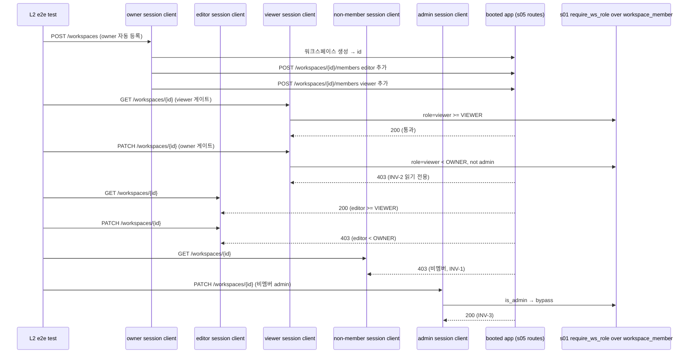
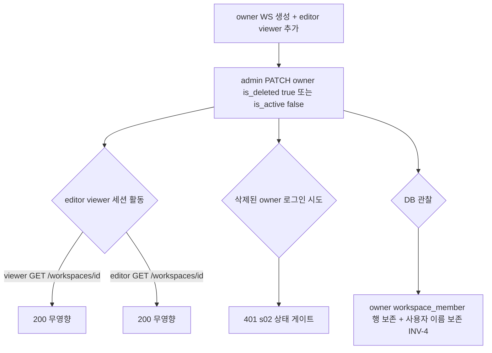
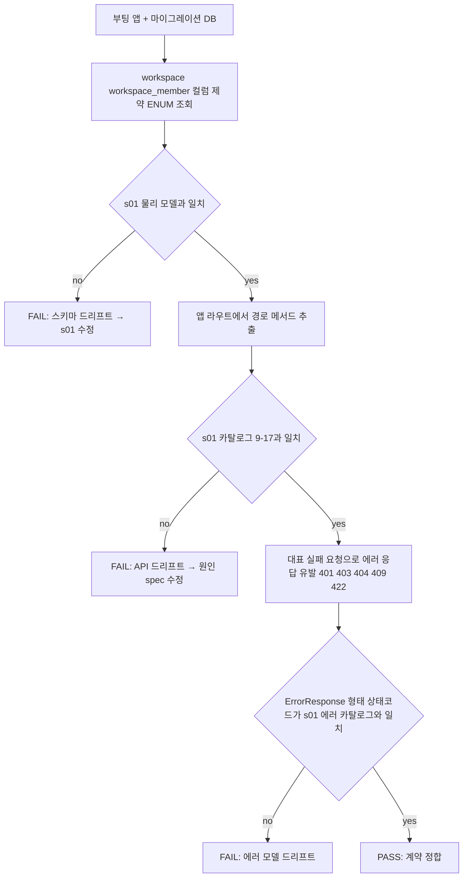

# Design Document — s06-integration-check-L2

## Overview

**Purpose**: `s06-integration-check-L2`는 **L2 누적 통합 검증 체크포인트**다. 이 시점까지 완성된 upstream 누적 집합
(`s01-contract-foundation` ⊕ `s02-auth` ⊕ `s03-admin-account` ⊕ `s05-workspace`)이 `s01` 단일 계약 소스와
정합하는지, 그리고 이번 계층에서 처음 결합되는 경계(**워크스페이스 권한·멤버십 ↔ 세션 인증·계정 생명주기**)가 실제
결합 상태에서 성립하는지 mock 없이 검증한다. 산출물은 **integration/e2e 테스트 자산과 게이트 판정 기록**뿐이며,
feature 로직·엔드포인트·스키마·마이그레이션을 신규 구현하지 않는다.

검증 초점은 **권한 경계(INV-1·2, owner/editor/viewer 위계)**, **admin override(INV-3)**, **admin 소유권 변경**
(카탈로그 행 9)이다. 핵심은 `s01` `require_ws_role` resolver가 `s05`가 채운 **실제 workspace_member 데이터** 위에서
계약대로 판정하고, admin bypass가 모든 워크스페이스 게이트에서 성립하는지를 실제 결합으로 확인하는 것이다.

**Users**: 로드맵 게이트 관리자가 이 체크포인트의 통과 여부로 **게이트(G-1 규칙)**를 판정한다 — 통과해야 L3
(`s07-document-core`) impl 착수가 가능하다. upstream 구현자는 이 체크포인트를 권한 경계 회귀의 조기 경보로 사용한다.

**Impact**: 현재 `backend/`에는 s01 공용 인프라 + s02 `app/auth/` + s03 `app/admin_account/` + s05 `app/workspace/`
구현이 존재하고, `s04-integration-check-L1`의 `backend/tests/integration_L1/` 하네스가 존재한다(가정). 이
체크포인트는 그 위에 `backend/tests/integration_L2/` 테스트 스위트만 추가하며, **L1 하네스를 재사용·확장**하고
어떤 애플리케이션 코드도 수정하지 않는다.

### Goals
- 실제 결합(마이그레이션된 DB + 부팅 앱 + 실제 세션 + 실제 workspace_member 데이터)에서 계약 대조 검증:
  `workspace`·`workspace_member` 스키마·워크스페이스/멤버십/소유권 API(행 9~17)·에러 모델이 `s01` 단일 소스와 일치.
- 권한 경계 e2e 검증: role별 실제 세션으로 viewer/owner 게이트 통과·거부, viewer 읽기 전용(INV-2), 비멤버 차단(INV-1).
- admin override e2e 검증: 비멤버 워크스페이스의 모든 게이트 bypass·전체 목록 가시성(INV-3).
- admin 소유권 변경 e2e 검증: upsert-to-owner → 새 owner 권한 반영, 비-admin 403, 404 경계.
- 아래 계층 결합 검증: 유일 owner 비활동/삭제 시 타 멤버 무영향·멤버십/이름 보존(INV-4), 삭제 멤버 로그인 401.
- 워크스페이스 설정 반영 검증: `is_shareable`·`trash_retention_days`(owner/admin), 기본값.
- 게이트(G-1 규칙, L2→L3) 통과/미통과 판정과 재검증 트리거 대상(s01·s02·s03·s05)을 명확히 산출.

### Non-Goals
- 새로운 feature 동작·엔드포인트·서비스·스키마·마이그레이션 구현(s01/s02/s03/s05 소유, 완료 가정).
- 개별 spec 단위 검증의 재실행(각 spec 자체 테스트 소유). 체크포인트는 결합·경계만 본다.
- 발견된 계약 위반의 수정(원인 spec에서 수정 후 재실행).
- **문서 도메인(L3 이상)**: editor의 문서 쓰기 권한, 문서 CRUD·bundle·잠금·버전·휴지통·첨부·공유. L2에서 editor
  위계는 워크스페이스 게이트 게이팅 범위에서만 관찰한다(문서 쓰기 권한 자체는 s08 이상).

## Boundary Commitments

### This Spec Owns
- **L2 통합 테스트 스위트**(`backend/tests/integration_L2/`): mock을 쓰지 않는 실제 결합 환경 위에서 계약 대조·권한
  경계·admin override·소유권 변경·계정상태↔멤버십 결합·설정 반영을 검증하는 스위트.
- **L2 하네스 확장**: `s04` `integration_L1` 하네스(마이그레이션·앱 부팅·admin 시드·세션 유지 클라이언트·계정
  생명주기 헬퍼)를 **재사용**하고, 워크스페이스 생성·멤버 추가(role)·소유권 변경·설정 변경·다중 role 세션 클라이언트
  헬퍼만 신규 추가한다.
- **게이트 판정·재검증 트리거 기록**: 스위트 전체 통과를 게이트(G-1 규칙, L2→L3) 통과 조건으로 집계하고 재검증
  대상(s01/s02/s03/s05)을 명시.

### Out of Boundary
- 애플리케이션 코드 일체(`app/common/*`, `app/auth/*`, `app/admin_account/*`, `app/workspace/*`, `app/models/*`,
  마이그레이션). 체크포인트는 이들을 **소비·관찰만** 하고 수정하지 않는다.
- `s04`의 `integration_L1` 스위트·하네스의 **정의 변경**. L2는 이를 **재사용**만 하고 L1 자산을 수정하지 않는다
  (필요 시 L1 하네스는 재사용 가능한 형태로 이미 존재한다고 가정).
- 워크스페이스·멤버십·소유권의 **동작 정의**(s05), 로그인·계정관리의 동작 정의(s02·s03). 검증 대상이지 구현 대상 아님.
- 계약 문서(카탈로그·불변식·에러 카탈로그·resolver 계약) 자체의 **정의·완전성**(s01 소유).
- 검증 실패의 코드 수정 — 원인 upstream spec에서 처리.

### Allowed Dependencies
- **Upstream(검증 대상, 실제 구현 결합)**: `s01`·`s02`·`s03`·`s05`의 실제 구현.
- **재사용 대상(하네스)**: `s04-integration-check-L1`의 `tests/integration_L1/conftest.py`·`helpers.py`(마이그레이션·
  부팅·admin 시드·세션 클라이언트·계정 생명주기 헬퍼).
- **대조 기준(single source of truth)**: `s01-contract-foundation/design.md`(§Physical Data Model:
  `workspace`·`workspace_member` · §API Endpoint Catalog 9~17 · §Errors 에러 코드 카탈로그 · §Invariants Catalog
  INV-1·2·3·4 · §Common/Permissions `Role`·`require_ws_role`·admin bypass).
- **Shared infra(테스트 실행)**: FastAPI `TestClient`(Starlette, 쿠키 자 유지), SQLAlchemy 2.0(sync) 세션·
  `information_schema` 조회, Alembic 마이그레이션, pytest, MySQL 8. 모든 backend 명령은 `backend/`에서 `uv run`.
- **제약**: mock·stub·가짜 구현 금지(실제 결합만). 설정 접근은 `s01` 단일 `Settings` 경유. 애플리케이션 코드 무수정.
  대조 기준은 개별 spec design이 아니라 `s01` 단일 소스. L1 하네스는 재사용하되 중복 신설하지 않는다.

### Revalidation Triggers
이 체크포인트는 다음 변경 시 **누적 집합 기준으로 재실행**한다(roadmap §재검증 트리거). `s05`(L2) 수정 시 이
체크포인트 및 로드맵상 그 이후 모든 체크포인트(L3~L6)를, `s01`(계약) 수정 시 **모든** 체크포인트를 재실행한다.
- `s01` 계약 변경: `workspace`/`workspace_member` 스키마(컬럼·제약·ENUM·인덱스), 권한 resolver(`Role` 위계·
  `require_ws_role`·admin bypass) 시그니처·판정 규칙, 세션 인증 의존성, 공통 에러 카탈로그, 카탈로그 행 9~17·
  `{Resource}Create/Read/Update` 규약, 불변식 카탈로그(INV-1·2·3·4).
- `s02` 변경: 로그인 상태 게이트·세션 write/clear·payload 키(계정상태↔멤버십 결합 검증에 영향).
- `s03` 변경: 계정 상태(`is_active`/`is_deleted`) 표현·독립성·전이 동작(유일 owner 전이 검증에 영향).
- `s05` 변경: 워크스페이스/멤버십 엔드포인트 경로·메서드·요구 role·스키마 이름, `workspace_member` role 판정 데이터
  계약·resolver 활성화 방식, 소유권 변경 의미(upsert-to-owner), `is_shareable`/`trash_retention_days` 설정 규약.
- 재실행 시에도 mock 없이 실제 구현을 결합한 상태로 검증한다.

## Architecture

### Architecture Pattern & Boundary Map

체크포인트는 애플리케이션 아키텍처를 확장하지 않는다. `tests/integration_L2/` 하나의 테스트 계층이 부팅된 실제
애플리케이션과 실제 DB(실제 workspace_member 데이터 포함)를 **관찰**하여 s01 단일 소스와 대조한다. 하네스는 L1의
하네스를 재사용·확장한다.

```mermaid
graph TB
    subgraph Checkpoint_s06[tests integration_L2 - 이 spec 소유]
        Harness[L2 하네스 - L1 하네스 재사용 + 워크스페이스/멤버 시나리오 헬퍼]
        ContractSuite[워크스페이스 계약 대조 스위트]
        PermSuite[권한 경계 스위트 INV-1 INV-2]
        AdminSuite[admin override 스위트 INV-3]
        OwnerSuite[admin 소유권 변경 스위트]
        AcctSuite[계정상태 멤버십 결합 스위트]
        SettingsSuite[워크스페이스 설정 스위트]
        Gate[게이트 판정 및 재검증 기록]
    end
    subgraph Reused_s04[tests integration_L1 - 재사용, 무수정]
        L1Harness[L1 하네스 마이그레이션 부팅 admin시드 세션클라이언트]
        L1Helpers[계정 생명주기 헬퍼]
    end
    subgraph Under_Test[검증 대상 - 실제 구현 결합, 무수정]
        App[부팅된 FastAPI 앱 create_app]
        AuthRoutes[s02 auth routes]
        AdminRoutes[s03 admin routes]
        WsRoutes[s05 workspace routes 10-17]
        OwnerRoute[s05 admin owner route 9]
        Resolver[s01 require_ws_role over real membership]
        DB[(마이그레이션된 MySQL 8 workspace workspace_member user)]
    end
    subgraph Baseline[대조 기준 - s01 단일 소스]
        Schema[Physical Model workspace workspace_member]
        Catalog[API Catalog 9-17]
        ErrModel[Errors 코드 카탈로그]
        INV[Invariants INV-1 2 3 4]
        PermContract[Common Permissions Role require_ws_role bypass]
    end
    Harness --> L1Harness
    Harness --> L1Helpers
    Harness --> App
    Harness --> DB
    ContractSuite --> App
    ContractSuite --> DB
    ContractSuite -.대조.-> Schema
    ContractSuite -.대조.-> Catalog
    ContractSuite -.대조.-> ErrModel
    PermSuite --> WsRoutes
    PermSuite --> Resolver
    PermSuite -.대조.-> PermContract
    PermSuite -.대조.-> INV
    AdminSuite --> WsRoutes
    AdminSuite -.대조.-> INV
    OwnerSuite --> OwnerRoute
    AcctSuite --> AdminRoutes
    AcctSuite --> AuthRoutes
    AcctSuite --> WsRoutes
    AcctSuite -.대조.-> INV
    SettingsSuite --> WsRoutes
    Gate --> ContractSuite
    Gate --> PermSuite
    Gate --> AdminSuite
    Gate --> OwnerSuite
    Gate --> AcctSuite
    Gate --> SettingsSuite
```



**Architecture Integration**:
- **Selected pattern**: 테스트 전용 검증 계층(외부 관찰자). 실제 결합 e2e로 권한 경계 회귀를 조기 포착.
- **Domain/feature boundaries**: 체크포인트는 어떤 도메인 코드도 소유하지 않는다. `tests/integration_L2/`만 소유하고
  `tests/integration_L1/` 하네스를 재사용한다.
- **Existing patterns preserved**: uv 실행 표준, 단일 `Settings`, 부팅 앱(`create_app`)·마이그레이션 재사용, mock
  금지, 물리 삭제 없음(INV-4) 관찰, `s04` 하네스 패턴 확장.
- **New components rationale**: 신규는 L2 스위트와 워크스페이스 시나리오 헬퍼뿐. 각 스위트는 단일 검증 관심사
  (계약/권한/override/소유권/계정결합/설정).
- **Steering compliance**: 대조 기준을 s01 단일 소스로 고정(드리프트 방지). 권한 판정은 s01 resolver 단일 구현을
  실제 데이터로 관찰(structure.md 권한 단일화). mock 금지로 실제 결합 검증.

### Dependency Direction (강제)
```
s01 단일 소스(대조 기준)  ←대조←  Contract/Perm/Admin/Owner/Acct/Settings 스위트  ←관찰←  부팅 앱 + 마이그레이션 DB(s01·s02·s03·s05 결합, 실제 멤버십 데이터)
                                                    ↑
                              L2 하네스(conftest) = L1 하네스 재사용 + 워크스페이스 시나리오 헬퍼
```
테스트 계층은 애플리케이션을 **관찰**만 하고 역방향으로 코드를 수정하지 않는다. L2 하네스는 `s01` `create_app`·
마이그레이션·`Settings`와 `s04` L1 하네스를 재사용한다.

### Technology Stack

체크포인트는 신규 런타임/라이브러리를 도입하지 않는다(테스트 도구만 사용).

| Layer | Choice / Version | Role in Feature | Notes |
|-------|------------------|-----------------|-------|
| Test Runner | pytest(`s01` 스택) | 통합/e2e 테스트 실행 | `backend/`에서 `uv run pytest tests/integration_L2` |
| App Under Test | FastAPI `create_app`(s01) | 실제 결합된 부팅 앱 | s02·s03·s05 라우터가 조립된 상태 |
| HTTP Client | Starlette `TestClient` | role별 독립 세션 쿠키 유지 e2e | admin/owner/editor/viewer/비멤버 클라이언트 분리 |
| Data / ORM | SQLAlchemy 2.0(sync, s01) | workspace·workspace_member·user·`information_schema` 조회 | 스키마 대조·INV-4 관찰 |
| Migration | Alembic(s01) | 검증용 스키마 준비 | `uv run alembic upgrade head` |
| DB | MySQL 8 | 실제 결합 저장소(실제 멤버십 데이터) | mock 금지 — 실 DB 필수 |
| Reused Harness | `s04` `tests/integration_L1`(conftest·helpers) | 마이그레이션·부팅·admin 시드·세션·계정 헬퍼 | 재사용·확장(중복 신설 금지) |

> 신규 외부 의존성 없음. 스택 근거는 `s01` design·research 참조.

## File Structure Plan

### Directory Structure
```
backend/tests/integration_L2/           # s06 체크포인트 소유(신규, 테스트 전용)
├── __init__.py
├── conftest.py                         # L2 하네스: L1 하네스(마이그레이션·부팅·admin 시드·세션 클라이언트) 재사용
│                                       #   + 워크스페이스 생성·멤버 추가(role)·소유권 변경·설정·다중 role 세션 픽스처
├── helpers.py                          # 워크스페이스/멤버/소유권/설정 호출 래퍼(L1 helpers 확장, 계정 헬퍼 재사용)
├── test_workspace_contract_conformance.py  # workspace·workspace_member 스키마·API(9~17)·에러 모델 (REQ-2)
├── test_permission_boundary.py             # role 위계·viewer 읽기전용·비멤버 차단 (REQ-3, INV-1·2)
├── test_admin_override.py                  # 비멤버 WS admin bypass·전체 목록 (REQ-4, INV-3)
├── test_owner_change.py                    # admin 소유권 변경 upsert·새 owner 권한·비-admin 403·404 (REQ-5)
├── test_account_state_membership.py        # 유일 owner 전이↔타 멤버 무영향·멤버십/이름 보존 (REQ-6, L1 결합)
└── test_workspace_settings.py              # is_shareable·retention·기본값·admin bypass (REQ-7)
```

### Modified Files
- 없음. 체크포인트는 애플리케이션 코드와 `s04` L1 자산을 수정하지 않는다. (`conftest.py`가 필요로 하는 테스트
  설정은 `s01` `Settings`/`config.yml`의 기존 값과 L1 하네스를 재사용하며 별도 설정 파일을 신설하지 않는다.)

> `tests/integration_L2/*`은 `s01`·`s02`·`s03`·`s05`의 공개 표면(부팅 앱·라우트·DB)과 `s04` L1 하네스만 소비하고,
> 대조 기준으로 `s01` design의 계약 요소를 참조한다. 게이트 판정 결과는 테스트 실행 결과(전부 통과 = 게이트 통과)로
> 산출된다.

## System Flows

### 권한 경계 e2e — resolver 실동작(실제 멤버십 데이터) 관찰


- **게이트 조건**: role별 실제 세션으로 viewer/owner 게이트를 통과·거부시켜 위계 owner ≥ editor ≥ viewer와 admin
  bypass를 관찰한다. 실패하면 resolver 판정(s01)과 멤버십 데이터(s05) 사이의 계약 드리프트를 가리킨다.

### 계정 상태 ↔ 멤버십 결합 — 유일 owner 전이


- **게이트 조건**: 유일 owner를 admin이 비활동/삭제해도 editor·viewer 활동은 무영향(docs 3.7). 삭제된 owner는 로그인
  401(s02), 그러나 멤버십·이름은 물리 삭제 없이 보존(INV-4). 실패 시 계정상태(s03)↔멤버십(s05) 결합 회귀를 가리킨다.

### 계약 대조 판정


## Requirements Traceability

| Requirement | Summary | Components | Interfaces / Contracts | Flows |
|-------------|---------|------------|------------------------|-------|
| 1.1–1.5 | mock 없는 실제 결합·s01 단일 소스·feature 미구현·L1 하네스 확장·위반은 원인 spec 수정 | L2TestHarness, 전 스위트 | 실 DB·부팅 앱·세션 클라이언트·L1 하네스 재사용 | 세 흐름 공통 |
| 2.1, 2.2 | workspace·workspace_member 스키마 s01 물리 모델 일치 | WorkspaceContractConformanceSuite | `information_schema`/ORM ↔ s01 physical model | 계약 대조 |
| 2.3, 2.4 | 카탈로그 9~17·행 9 API 노출 정합 | WorkspaceContractConformanceSuite | 앱 라우트 ↔ s01 카탈로그 9~17 | 계약 대조 |
| 2.5 | 에러 응답 형태·상태코드 정합 | WorkspaceContractConformanceSuite | `ErrorResponse` ↔ s01 에러 카탈로그 | 계약 대조 |
| 2.6 | Base Schemas 규약·마이그레이션 무추가 | WorkspaceContractConformanceSuite | `WorkspaceRead`/`Page` ↔ s01 규약 | 계약 대조 |
| 3.1, 3.4 | viewer 게이트 role별 통과·owner 게이트 owner 통과 | PermissionBoundarySuite, Helpers | `require_ws_role(VIEWER/OWNER)` over membership | 권한 경계 |
| 3.2 | viewer/editor owner 게이트 거부(INV-2) | PermissionBoundarySuite | 403 forbidden | 권한 경계 |
| 3.3 | 비멤버 차단(INV-1) | PermissionBoundarySuite | 403 forbidden | 권한 경계 |
| 3.5 | editor 중간 위계(viewer 통과·owner 거부) | PermissionBoundarySuite | 게이트 조합 관찰 | 권한 경계 |
| 4.1, 4.2 | 비멤버 WS admin viewer·owner 게이트 bypass | AdminOverrideSuite | admin bypass INV-3 | 권한 경계 |
| 4.3 | admin 전체 목록 가시성 | AdminOverrideSuite | `GET /workspaces` admin scope | — |
| 5.1, 5.2 | 소유권 변경 → 새 owner 권한·owner 부재 복구 | OwnerChangeSuite, Helpers | `POST /admin/workspaces/{id}/owner` → owner 게이트 | — |
| 5.3, 5.4 | 비-admin 403·404 경계 | OwnerChangeSuite | `require_admin`·not_found | — |
| 6.1 | 유일 owner 전이 시 타 멤버 무영향 | AccountStateMembershipSuite, Helpers | 상태 전이 후 editor/viewer 접근 | 계정 결합 |
| 6.2, 6.4 | 멤버십·이름 보존·물리 삭제 없음(INV-4) | AccountStateMembershipSuite | DB 레코드 관찰 | 계정 결합 |
| 6.3 | 삭제/비활동 멤버 로그인 401 | AccountStateMembershipSuite | `/auth/login` 401 | 계정 결합 |
| 7.1, 7.2 | is_shareable·retention 반영·422 경계 | WorkspaceSettingsSuite | `PATCH /workspaces/{id}` | — |
| 7.3 | 설정 경로 admin bypass | WorkspaceSettingsSuite | admin PATCH 성공 | — |
| 7.4 | 생성 기본값(is_shareable=false·Settings retention) | WorkspaceSettingsSuite | `POST /workspaces` 응답 | — |
| 8.1–8.3 | 게이트 판정·재검증 트리거 명시 | GateVerdict | 전 스위트 결과 집계 | — |

## Components and Interfaces

| Component | Domain/Layer | Intent | Req Coverage | Key Dependencies (P0/P1) | Contracts |
|-----------|--------------|--------|--------------|--------------------------|-----------|
| L2TestHarness | Test/Fixture | 실 결합 환경(L1 하네스 재사용 + 워크스페이스 시나리오) | 1,2,3,4,5,6,7 | s04 L1 하네스 (P0), s01 create_app (P0), Alembic (P0), MySQL (P0) | State |
| Helpers | Test/Support | 워크스페이스/멤버/소유권/설정 호출 래퍼(계정 헬퍼 재사용) | 3,4,5,6,7 | L2TestHarness (P0), s04 L1 helpers (P0) | Service |
| WorkspaceContractConformanceSuite | Test/Contract | 스키마·API(9~17)·에러 모델 대조 | 2 | L2TestHarness (P0), s01 단일 소스 (P0) | Batch |
| PermissionBoundarySuite | Test/E2E | role 위계·viewer 읽기전용·비멤버 차단 | 3 | L2TestHarness (P0), Helpers (P0) | Batch |
| AdminOverrideSuite | Test/E2E | 비멤버 WS admin bypass·전체 목록 | 4 | L2TestHarness (P0), Helpers (P0) | Batch |
| OwnerChangeSuite | Test/E2E | admin 소유권 변경·새 owner 권한·403·404 | 5 | L2TestHarness (P0), Helpers (P0) | Batch |
| AccountStateMembershipSuite | Test/E2E | 계정상태↔멤버십 결합·보존 | 6 | L2TestHarness (P0), Helpers (P0), s04 L1 helpers (P0) | Batch |
| WorkspaceSettingsSuite | Test/E2E | is_shareable·retention·기본값·admin bypass | 7 | L2TestHarness (P0), Helpers (P0) | Batch |
| GateVerdict | Test/Report | 게이트 판정·재검증 트리거 기록 | 8 | 전 스위트 (P0) | Batch |

### Test / Fixture

#### L2TestHarness
| Field | Detail |
|-------|--------|
| Intent | mock 없는 실제 결합 검증 환경 제공(L1 하네스 재사용·확장) |
| Requirements | 1.1, 1.2, 1.3, 1.4, 2.1, 3.1, 4.1, 5.1, 6.1, 7.1 |

**Responsibilities & Constraints**
- `s04` `tests/integration_L1`의 하네스 픽스처(마이그레이션 `alembic upgrade head`·`s01` `create_app()` 부팅·admin
  시드·세션 유지 `TestClient` 팩토리·고유 login_id 생성기)를 **재사용**한다. 동일 하네스를 중복 정의하지 않는다.
- 부팅 앱은 s02·s03·**s05 라우터가 조립된 상태**여야 한다(워크스페이스·소유권 라우트 노출).
- 워크스페이스 시나리오 픽스처 신규 추가: 여러 사용자를 admin으로 생성하고 각자 세션을 유지하는 role별 클라이언트
  (owner/editor/viewer/비멤버/admin)를 제공하고, 워크스페이스를 생성해 지정 role로 멤버를 구성하는 셋업을 제공.
- **제약**: 어떤 애플리케이션 코드·L1 자산도 수정하지 않는다. mock 미사용. 설정은 s01 `Settings` 재사용. DB
  미가용 시 스킵이 아니라 **실패** 처리(미검증이 통과로 오인되지 않게 함).

**Dependencies**
- Inbound: 전 스위트 — 결합 환경(P0)
- Outbound: s04 L1 하네스(P0); s01 `create_app`·마이그레이션·`Settings`·workspace/workspace_member/user 모델(P0); MySQL 8(P0)

**Contracts**: State [x]
- Preconditions: MySQL 8 가용, s01·s02·s03·s05 구현 및 s04 L1 하네스가 배치됨.
- Postconditions: 마이그레이션된 DB + 부팅 앱(s05 포함) + admin 시드 + role별 세션 클라이언트 + 구성된
  워크스페이스/멤버십 제공. 테스트 종료 시 정리.
- Invariants: mock 부재. 각 테스트는 고유 login_id·워크스페이스로 상태 격리.

**Implementation Notes**
- Integration: `uv run pytest tests/integration_L2`로 실행. DB URL은 s01 `Settings.sqlalchemy_url` 재사용.
- Validation: DB 미가용 시 실패 처리. role별 클라이언트는 독립 세션 쿠키 유지.
- Risks: 멀티 사용자/워크스페이스 상태 오염 → 고유 식별자·정리 픽스처.

### Test / Support

#### Helpers
| Field | Detail |
|-------|--------|
| Intent | 워크스페이스/멤버/소유권/설정 호출 래퍼(L1 계정 헬퍼 재사용·확장) |
| Requirements | 3.1, 4.1, 5.1, 6.1, 7.1 |

**Responsibilities & Constraints**
- 워크스페이스 생성(`POST /workspaces`), 멤버 추가(`POST /workspaces/{id}/members`, role 지정), role 변경
  (`PATCH .../members/{uid}`), 멤버 제거(`DELETE .../members/{uid}`), 소유권 변경(`POST
  /admin/workspaces/{id}/owner`), 설정 변경(`PATCH /workspaces/{id}`) 호출을 감싸는 헬퍼를 제공.
- 계정 생성·로그인·상태 전이(비활동/삭제) 헬퍼는 `s04` L1 `helpers.py`를 **재사용**한다(중복 정의 금지).
- **제약**: 헬퍼는 실제 라우트 호출 래퍼일 뿐 애플리케이션 로직을 대체하지 않는다. mock 없음.

**Contracts**: Service [x]
- Trigger: 각 스위트가 시나리오 셋업에 사용.
- Output: 라우트 호출 결과(status·body)와 구성된 워크스페이스/멤버 식별자.

### Test / Contract

#### WorkspaceContractConformanceSuite
| Field | Detail |
|-------|--------|
| Intent | 실제 결합 런타임을 s01 단일 소스와 대조(스키마·API·에러) |
| Requirements | 2.1, 2.2, 2.3, 2.4, 2.5, 2.6 |

**Responsibilities & Constraints**
- **스키마**: 마이그레이션된 `workspace`(name·is_shareable·trash_retention_days·타임스탬프)와 `workspace_member`
  (workspace_id FK·user_id FK·role ENUM(owner/editor/viewer)·UNIQUE(workspace_id,user_id)·INDEX(user_id))가
  s01 물리 모델과 일치하는지 `information_schema` 또는 ORM 메타데이터로 대조.
- **API 노출**: 부팅 앱 라우트에서 경로·메서드를 추출해 s01 카탈로그 행 10~17(워크스페이스·멤버십)과 행 9(admin
  소유권 변경)와 대조. 요구 role 게이트가 실제로 걸려 있는지(미인증 401·비멤버/비-owner 403·비-admin 403) 대표
  요청으로 확인.
- **에러 모델**: 미인증(401)·권한 부족(403)·미존재(404)·중복 멤버(409)·검증 실패(422, 예: retention ≤ 0)를 실제
  유발해 응답이 `ErrorResponse`(`code`/`message`/`field_errors`) 형태이고 상태 코드가 s01 에러 카탈로그와 일치하는지 확인.
- **Base Schemas·마이그레이션**: `WorkspaceRead`가 `TimestampedRead`(id·created_at·updated_at)를 상속하고 목록이
  `Page[WorkspaceRead]` 규약을 따르는지, s05가 새 마이그레이션 없이 s01 스키마만 사용하는지 확인.
- **제약**: s01 카탈로그·물리 모델이 **대조 기준**이다. s05 design은 기준이 아니라 검증 대상.

**Contracts**: Batch [x]
- Trigger: `uv run pytest tests/integration_L2/test_workspace_contract_conformance.py`.
- Output: 스키마·API 노출(9~17)·에러 형태·Base 규약 대조 그룹의 pass/fail. 불일치 시 드리프트 요소 지목.

### Test / E2E

#### PermissionBoundarySuite
| Field | Detail |
|-------|--------|
| Intent | role 위계(INV-1·2)를 실제 멤버십 데이터 위에서 관찰 |
| Requirements | 3.1, 3.2, 3.3, 3.4, 3.5 |

**Responsibilities & Constraints**
- owner가 워크스페이스를 생성하고 editor·viewer를 멤버로 추가한 뒤, role별 독립 세션으로:
  - **viewer 게이트**(`GET /workspaces/{id}`): owner·editor·viewer 모두 200(3.1), 비멤버 403(3.3).
  - **owner 게이트**(`PATCH /workspaces/{id}`·멤버 추가·제거): owner 200(3.4), editor·viewer 403(3.2, INV-2),
    비멤버 403(3.3).
  - **editor 중간 위계**(3.5): editor가 viewer 게이트는 통과하되 owner 게이트는 거부됨을 대조로 관찰.
- **제약**: 실제 세션 쿠키 자로 e2e(로그인→후속 요청 정합). mock 없음. resolver 판정은 s05가 채운 실제
  `workspace_member` 데이터 위에서 이뤄진다.

**Contracts**: Batch [x]
- Trigger: `uv run pytest tests/integration_L2/test_permission_boundary.py`.
- Output: viewer/owner 게이트 × role 매트릭스의 pass/fail. 실패 시 resolver(s01)/멤버십 데이터(s05) 경계 시사.

#### AdminOverrideSuite
| Field | Detail |
|-------|--------|
| Intent | admin bypass가 모든 워크스페이스 게이트에서 성립(INV-3) |
| Requirements | 4.1, 4.2, 4.3 |

**Responsibilities & Constraints**
- admin이 **자신이 멤버가 아닌** 워크스페이스에 대해:
  - viewer 게이트(`GET /workspaces/{id}`) 접근 성공(4.1).
  - owner 게이트(`PATCH /workspaces/{id}`·멤버 추가) 접근 성공(4.2, INV-3).
- admin의 `GET /workspaces` 목록이 멤버 스코프에 제한되지 않고 전체 워크스페이스를 반환함(4.3).
- **제약**: admin은 `user.is_admin=true`(하네스 시드) 단일 출처. mock 없음.

**Contracts**: Batch [x]
- Trigger: `uv run pytest tests/integration_L2/test_admin_override.py`.
- Output: 비멤버 admin의 viewer·owner 게이트 bypass·전체 목록 가시성 pass/fail.

#### OwnerChangeSuite
| Field | Detail |
|-------|--------|
| Intent | admin 소유권 변경(upsert-to-owner)과 권한 결합 |
| Requirements | 5.1, 5.2, 5.3, 5.4 |

**Responsibilities & Constraints**
- admin `POST /admin/workspaces/{id}/owner`로 사용자를 새 owner 지정 → 그 사용자가 이후 owner 게이트 통과(5.1).
- owner가 없는 상태(유일 owner를 제거해 owner 부재로 만든 뒤)에서 새 owner 지정 성공·권한 획득(5.2, docs 3.7).
- 비-admin의 소유권 변경 호출 → 403(5.3). 존재하지 않는 워크스페이스/대상 사용자 → 404(5.4).
- **제약**: 소유권 변경은 upsert(멤버면 role=owner 갱신, 아니면 신규 owner 등록). 기존 owner 유지(복수 owner 허용).

**Contracts**: Batch [x]
- Trigger: `uv run pytest tests/integration_L2/test_owner_change.py`.
- Output: 새 owner 권한 반영·owner 부재 복구·403·404 pass/fail.

#### AccountStateMembershipSuite
| Field | Detail |
|-------|--------|
| Intent | 계정 생명주기(s03) ↔ 멤버십(s05) 결합·INV-4 보존 |
| Requirements | 6.1, 6.2, 6.3, 6.4 |

**Responsibilities & Constraints**
- owner가 WS 생성 + editor·viewer 추가 후, admin이 **유일 owner**를 비활동(`is_active=false`) 또는 삭제
  (`is_deleted=true`) 처리 → editor·viewer 세션이 자신의 role 라우트에 계속 정상 접근(무영향, 6.1, docs 3.7).
- 워크스페이스 멤버가 삭제 처리되면 그 `workspace_member` 행과 사용자 이름이 DB에 물리적으로 보존됨을 직접 조회로
  확인(6.2, INV-4).
- 삭제/비활동 멤버의 로그인 시도 → 401(6.3, s02 상태 게이트).
- 유일 owner 전이 시나리오 전반에서 `workspace`·`workspace_member`·`user` 레코드에 예기치 않은 물리 삭제가
  없었음을 확인(6.4).
- **제약**: 워크스페이스 owner는 시스템 admin과 별개이므로 s03 admin 잠금 가드에 걸리지 않는다(일반 사용자 owner는
  비활동/삭제 가능). 계정 상태 전이 헬퍼는 s04 L1 헬퍼 재사용.

**Contracts**: Batch [x]
- Trigger: `uv run pytest tests/integration_L2/test_account_state_membership.py`.
- Output: 타 멤버 무영향·멤버십/이름 보존·삭제 멤버 401·물리 삭제 부재 pass/fail.

#### WorkspaceSettingsSuite
| Field | Detail |
|-------|--------|
| Intent | is_shareable·trash_retention_days 설정 반영·기본값·admin bypass |
| Requirements | 7.1, 7.2, 7.3, 7.4 |

**Responsibilities & Constraints**
- owner가 `PATCH /workspaces/{id}`로 `is_shareable` 변경 → 이후 `GET`에 갱신 값 반영(7.1).
- owner가 `trash_retention_days`를 양의 정수로 변경 → 반영, 0 이하 → 422(7.2).
- admin이 비멤버 워크스페이스 설정 변경 성공(7.3, INV-3).
- 신규 워크스페이스 기본값: `is_shareable=false`, `trash_retention_days`=s01 `Settings` 기본값(7.4).
- **제약**: 설정은 s05 소유 동작, 기본 retention은 s01 `Settings`. mock 없음.

**Contracts**: Batch [x]
- Trigger: `uv run pytest tests/integration_L2/test_workspace_settings.py`.
- Output: 설정 반영·422 경계·admin bypass·기본값 pass/fail.

### Test / Report

#### GateVerdict
| Field | Detail |
|-------|--------|
| Intent | 게이트(G-1 규칙, L2→L3) 통과 판정과 재검증 트리거 대상 기록 |
| Requirements | 8.1, 8.2, 8.3 |

**Responsibilities & Constraints**
- Requirement 2~7 스위트가 **전부 통과**하면 게이트 통과로 집계(전체 `uv run pytest tests/integration_L2` 성공)
  = L3(`s07-document-core`) impl 착수 선행 조건 충족. 하나라도 실패하면 미통과로, L3 impl 착수 차단으로 표시.
- 재검증 트리거 대상(s01/s02/s03/s05 수정 시 이 체크포인트 및 로드맵상 그 이후 모든 체크포인트 재실행; s01 수정
  시 모든 체크포인트)을 문서/주석으로 명시.
- **제약**: 판정은 실제 테스트 실행 결과로만 산출한다(수동 선언 금지).

**Contracts**: Batch [x]
- Trigger: `uv run pytest tests/integration_L2`(전체).
- Output: 전체 통과 = 게이트 통과. 요약에 재검증 트리거 목록 포함.

## Data Models

### Domain Model
- 체크포인트는 **새 엔티티·테이블·컬럼을 정의하지 않는다.** s01 `workspace`·`workspace_member`·`user` 테이블(및
  s01~s05가 채운 상태)을 읽기·관찰만 한다. 테스트 준비를 위한 admin 시드·사용자 생성·멤버십 구성은 s03/s05 경로
  또는 s01 모델을 통해 수행하며 스키마를 변경하지 않는다.
- 관찰 대상 상태 축: `workspace_member.role`(권한 판정 근거, INV-1), `user.is_active`/`is_deleted`(로그인 게이트·
  soft-delete), `workspace.is_shareable`/`trash_retention_days`(설정). role 데이터가 resolver 판정의 유일 근거.

### Data Contracts & Integration
- **API 데이터 전송**: 검증은 s01 base 규약(`{Resource}Create/Read/Update`, `Page[T]`, `ErrorResponse`) 준수를
  **확인**한다.
- **에러 직렬화**: 전 워크스페이스/멤버십 엔드포인트가 s01 `ErrorResponse` 단일 형태임을 확인 대상으로 삼는다.
- **resolver 데이터 계약**: `workspace_member` 행이 s01 resolver의 role 판정 근거임을 실제 데이터로 확인한다.

## Error Handling

### Error Strategy
- 체크포인트 자체는 도메인 에러를 생성하지 않는다. 대신 검증 대상 시스템의 에러 응답을 **관찰**하여 s01 에러 모델과
  대조한다. 테스트 실패(assertion)는 계약/경계 회귀를 가리키며, 원인 spec에서 수정한다.

### Error Categories and Responses
- **계약 드리프트**: 워크스페이스 스키마/API/에러 형태 불일치 → WorkspaceContractConformanceSuite 실패.
- **권한 경계 회귀**: role 위계 판정·viewer 읽기 전용·비멤버 차단 불성립 → PermissionBoundarySuite 실패.
- **admin bypass 회귀**: 비멤버 admin이 게이트에서 차단됨 → AdminOverrideSuite 실패.
- **소유권 변경 회귀**: 새 owner 권한 미반영·403/404 미성립 → OwnerChangeSuite 실패.
- **계정↔멤버십 결합 회귀**: 타 멤버 영향·멤버십/이름 소실·삭제 멤버 로그인 허용 → AccountStateMembershipSuite 실패.
- **설정 회귀**: 설정 미반영·기본값 불일치·admin bypass 실패 → WorkspaceSettingsSuite 실패.
- **환경 미충족**: DB 미가용 등은 스킵이 아니라 실패로 처리(미검증의 통과 오인 방지).

## Testing Strategy

> 이 spec의 산출물 자체가 테스트다. 아래는 스위트 구성의 근거(요구 수용 기준 매핑)다.

### Integration / E2E Tests
- **계약 대조**(REQ-2): 마이그레이션 DB의 workspace·workspace_member 스키마 ↔ s01 물리 모델; 부팅 앱 라우트 ↔
  s01 카탈로그 9~17; 대표 실패 요청 에러 응답 ↔ s01 에러 카탈로그; Base Schemas 규약·마이그레이션 무추가.
- **권한 경계**(REQ-3): role별 세션으로 viewer/owner 게이트 통과·거부; viewer 읽기 전용(INV-2); 비멤버 차단(INV-1);
  editor 중간 위계.
- **admin override**(REQ-4): 비멤버 admin의 viewer·owner 게이트 bypass; 전체 목록 가시성(INV-3).
- **소유권 변경**(REQ-5): upsert-to-owner → 새 owner 권한; owner 부재 복구; 비-admin 403; 404 경계.
- **계정↔멤버십 결합**(REQ-6): 유일 owner 비활동/삭제 → 타 멤버 무영향; 멤버십/이름 보존(INV-4); 삭제 멤버 로그인 401.
- **설정 반영**(REQ-7): is_shareable·retention 변경 반영; retention ≤ 0 → 422; admin bypass; 생성 기본값.
- **게이트 판정**(REQ-8): 전체 스위트 통과 집계 = 게이트 통과(L3 착수 가능); 재검증 트리거 목록 명시.

### 실행 표준
- 모든 테스트는 `backend/`에서 `uv run pytest tests/integration_L2`로 실행. 실제 MySQL 8·마이그레이션·실제 멤버십
  데이터 전제. mock 금지.

## Security Considerations
- 권한 경계(INV-1·2)와 admin bypass(INV-3)가 결합 관점에서 유지되는지 재확인 — 워크스페이스 단위 권한만 존재하고
  비멤버·하위 role의 권한 상승이 없는지.
- admin 시드는 테스트 하네스 한정이며 애플리케이션에 admin 생성·승격 경로를 추가하지 않는다(product.md 폐쇄형 원칙).
- 워크스페이스 소유권 변경이 admin 전용(`require_admin`)으로 유지되는지, 비-admin의 소유권 탈취 경로가 없는지 확인.
- 삭제/비활동 계정이 멤버십을 통해 우회 접근하지 못함(로그인 401)을 결합에서 재확인.

## Supporting References
- 대조 기준 단일 소스: `s01-contract-foundation/design.md`(§Physical Data Model workspace·workspace_member ·
  §API Endpoint Catalog 9~17 · §Errors · §Invariants Catalog INV-1·2·3·4 · §Common/Permissions).
- 검증 대상 동작: `s05-workspace/design.md`(권한 게이팅·소유권 변경·설정), `s03-admin-account/design.md`(계정 상태
  전이), `s02-auth/design.md`(로그인 상태 게이트).
- 재사용할 하네스 패턴: `s04-integration-check-L1/design.md`(§L1TestHarness·스위트 구성·게이트 판정).
- 게이트·재검증 트리거: `.kiro/steering/roadmap.md`(§게이트 · §재검증 트리거 · §Shared seams to watch).
- 설계 결정·리스크: `research.md`.
