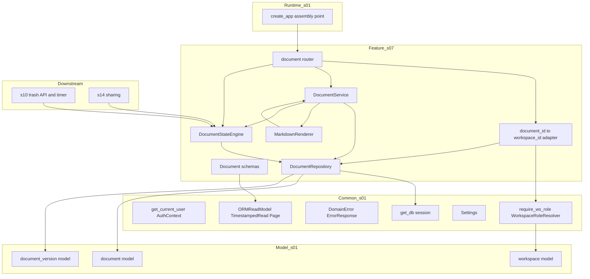
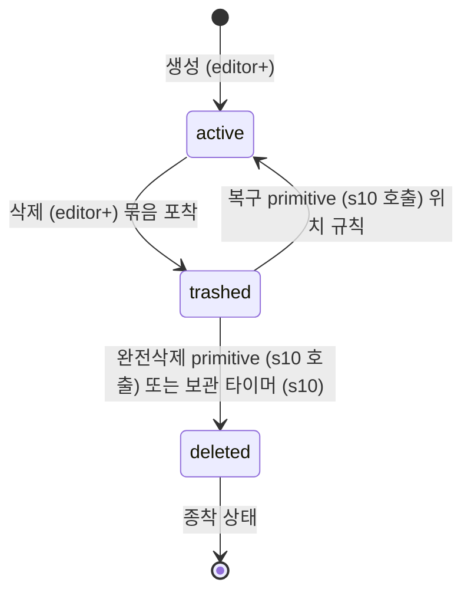
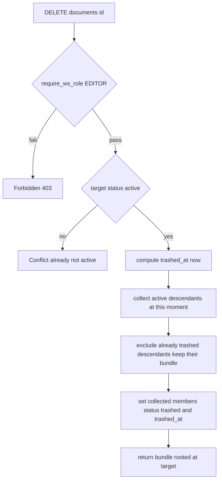
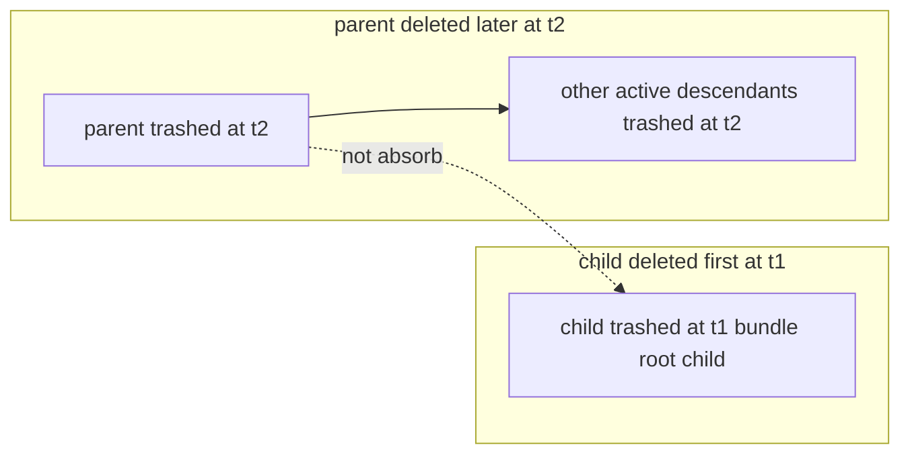
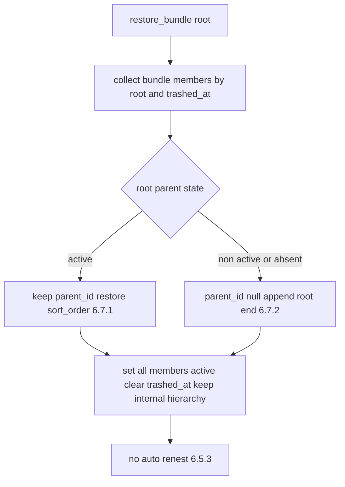

# Design Document — s07-document-core

## Overview

**Purpose**: Notion-lite의 **핵심 도메인**을 구현한다. 계층적 markdown 문서의 엔티티·계층(parent/child)·
CRUD·이동/재정렬(순환 방지·동일 워크스페이스)·현재 버전 렌더/preview를 소유하고, 무엇보다 문서 3단계 상태
(active → trashed → deleted) 전이를 지배하는 **묶음(bundle) 비흡수 엔진**을 단일 구현으로 캡슐화한다
(INV-5·6·10·11·12). 이 엔진은 삭제 캐스케이드·복구 위치 규칙·완전삭제·묶음 식별을 코드 한 곳에 담아,
하위 spec(s10-trash·s14-sharing)이 규칙을 재구현하지 않고 primitive를 호출해 소비하게 한다.

**Users**: editor 이상 사용자는 문서를 만들고 이동·삭제하며, viewer 이상 사용자는 열람한다. 상태 엔진의
직접 소비자는 사람이 아니라 **하위 spec**이다: s10은 복구·완전삭제·묶음 열거 primitive와 보관 타이머를 이
엔진 위에 얹고, s14는 문서 상태·active 하위 집합 질의를 재사용한다. s08 통합 체크포인트가 권한 게이팅과
bundle 엔진 정합을 검증한다.

**Impact**: `s01`이 확정한 계약(document·document_version 스키마, 에러 모델, Base Schemas, 권한 resolver,
라우터 조립 지점) 위에, `s05`가 실동작시킨 `require_ws_role`을 재사용하여 문서 도메인(라우터·CRUD 서비스·
상태 엔진·리포지토리·스키마·문서→WS 어댑터)을 최초로 채운다. `s01`·`s05`의 어떤 계약 엔티티도 재정의하지
않는다. 새 스키마 마이그레이션을 추가하지 않고 기존 컬럼(`status`·`trashed_at`·`parent_id`·`sort_order`·
`current_version_id`) 위에서 묶음 모델을 구현한다.

### Goals
- 문서·하위 문서 생성, 조회·목록, 제목 수정, 이동/재정렬(순환·동일 WS)을 editor/viewer 게이팅 하에 제공한다(REQ-1·2·3·4).
- active → trashed 삭제 캐스케이드를 **묶음 비흡수 모델**로 구현하고(REQ-5·6, INV-10·11·12), 복구·완전삭제
  primitive를 하위 spec 재사용 가능한 단일 엔진으로 캡슐화한다(REQ-7·8·9).
- 현재 버전 markdown을 안전 렌더링하고 편집 preview와 단일 렌더 규약을 공용한다(REQ-2).
- 문서 상태와 편집 잠금의 독립성을 보장하고 lock 필드 정의를 인정하되 동작은 s09에 위임한다(REQ-9).

### Non-Goals
- 휴지통 목록/복구/완전삭제 **API·UX**와 묶음 보관 타이머 자동 영구삭제(s10). 엔진 primitive만 소유.
- 편집 잠금 흐름·버전 스냅샷 생성·본문 저장(s09). 문서 생성은 초기 버전을 만들지 않는다.
- 공유 링크(s14), 첨부 저장·완전삭제 시 보관 이동(s12). 프론트엔드 화면.

## Boundary Commitments

### This Spec Owns
- **문서 CRUD·계층·이동 동작**: `s01` 카탈로그 행 18~23(생성·목록·상세·제목 수정·이동·삭제). 계층
  (parent/child), 같은 WS 내 이동/재정렬, 순환 방지(INV-5), WS 경계 유지(INV-6).
- **status + bundle 전이 엔진(단일 구현, 하위 spec 재사용 대상)**:
  - active → trashed 삭제 캐스케이드(묶음 포착·공통 trashed_at·이미 trashed 하위 제외, 비흡수).
  - trashed → active 복구 primitive(부모 상태 기준 복귀 위치·sort_order 원위치 복원·자동 재중첩 없음).
  - trashed → deleted 완전삭제 primitive(묶음 단위 원자적 전이).
  - 묶음 식별·열거·구성원 확정 primitive(묶음 = 루트 문서 id).
  - active 하위 집합 질의(삭제 캐스케이드와 s14 공유가 공용).
- **markdown 렌더 규약**: 현재 버전 markdown → 안전 HTML 렌더(열람·preview 공용).
- **문서 → workspace_id 매핑 어댑터**: `/documents/{id}` 경로용, `require_ws_role` 주입.
- **문서 도메인 스키마**: `DocumentCreate/Read/Update`, `DocumentMoveRequest`(`s01` Base Schemas 상속).

### Out of Boundary
- 휴지통 목록/복구/완전삭제 **API·UX**·보관 타이머(s10). s10은 이 엔진의 복구·완전삭제·묶음 열거 primitive를 호출한다.
- 편집 잠금 동작·버전 생성·본문 저장(s09). lock 필드 **값 설정**은 s09 소유(이 spec은 존재만 인정).
- 공유 링크 발급/무효화(s14), 첨부 저장·완전삭제 시 보관 이동(s12, 8.6). 완전삭제 primitive는 상태 전이만 수행.
- `s01` 계약 요소(문서 스키마·카탈로그·에러 모델·Base Schemas·resolver 로직·세션 인증)의 **정의**, `s05`
  워크스페이스·멤버십 동작과 resolver 위계 비교·admin bypass 로직.

### Allowed Dependencies
- **Upstream**: `s01-contract-foundation` — `document`/`document_version`/`workspace` 모델, `get_db`,
  `WorkspaceRoleResolver`/`require_ws_role`/`Role`, `AuthContext`/`get_current_user`, `ErrorResponse`/
  `ErrorCode`/`DomainError`, `ORMReadModel`/`TimestampedRead`/`Page`, `Settings`/`get_settings`, 라우터 조립 지점.
- **간접 upstream**: s06(L2 체크포인트 통과) 이후 착수. `s05`가 채운 `workspace_member`로 `require_ws_role` 실동작.
- **Shared infra**: FastAPI(라우팅·DI), SQLAlchemy 2.0(sync) 세션, pydantic v2(스키마), markdown 렌더 +
  HTML 새니타이즈 라이브러리(신규 외부 의존성, research 참조).
- **제약**: 설정 접근은 `s01` 단일 `Settings` 경유. 문서·첨부는 물리 삭제 금지(INV-4) — 상태 전환만.
  의존 방향은 항상 아래층(Schemas → Repository → Service/Engine → Dependencies → Router → Bootstrap) 향함.
  s10·s14를 **import하지 않는다**(하위 spec이 이 엔진을 import). `s01`·`s05` 계약·로직 무변경.

### Revalidation Triggers
이 spec의 계약·경계가 다음과 같이 바뀌면 s08(L3) 이상 체크포인트 재검증이 필요하다.
- 상태 엔진 primitive의 시그니처·의미(삭제 캐스케이드 포착 범위, 복구 위치 규칙, 완전삭제 원자성, 묶음 식별 방식) 변경.
- 묶음 식별자 규약(루트 문서 id ↔ 다른 방식) 또는 묶음 구성원 재구성 규칙 변경 — s10 소비에 직접 영향.
- 문서 CRUD·이동·삭제 엔드포인트의 경로·메서드·요구 role·요청/응답 스키마 이름 변경(카탈로그 계약 변경).
- 이동 규칙(순환 방지·동일 WS·중간 삽입 정렬)의 판정 기준 변경.
- active 하위 집합 질의 규약 변경 — s14 공유 렌더 소비에 영향.
- markdown 렌더 규약(안전 처리 수준·출력 형태) 변경.

## Architecture

### Architecture Pattern & Boundary Map

레이어드 아키텍처(steering `structure.md` 정렬). s07은 `s01` 횡단 common·모델과 `s05` 실동작 resolver를
소비하는 하나의 feature 모듈(`app/document/`)로 캡슐화된다. 핵심은 **상태 전이 규칙을 `DocumentStateEngine`
단일 서비스에 캡슐화**하고, 문서 CRUD/이동/렌더는 `DocumentService`로 분리해 상태 전이는 엔진에 위임하는 것이다.



**Architecture Integration**:
- **Selected pattern**: feature 모듈 + 레이어드 + **상태 엔진 분리**. 의존 방향은 좌(하위 s01/s05)→우(s07)→
  더 우(s10/s14) 단방향. s07은 s10/s14를 import하지 않는다.
- **Domain/feature boundaries**: 상태 전이(삭제·복구·완전삭제·묶음)는 `DocumentStateEngine`만 소유. 문서
  구조(CRUD·이동·렌더)는 `DocumentService`가 소유하고 전이가 필요하면 엔진을 호출. 권한 판정·인증·에러·
  스키마 베이스는 s01, resolver 실동작 데이터는 s05.
- **Existing patterns preserved**: `{Resource}Create/Read/Update` 명명, 단일 `Settings`, 라우터 조립 지점
  재사용, 권한 검사 공통 레이어 단일 구현(resolver 재구현 금지), 상태/bundle 규칙 단일 구현(structure.md).
- **New components rationale**: `DocumentStateEngine`(불변식 캡슐화)·`DocumentService`(문서 구조)·
  `DocumentRepository`(계층·상태 질의)·`MarkdownRenderer`(렌더 규약)·문서→WS 어댑터·라우터·스키마만 신규. 각 단일 책임.
- **Steering compliance**: 묶음/상태 규칙을 document-core 서비스에 단일 구현으로 캡슐화하고 trash·sharing이
  재사용(structure.md 코드 조직 원칙). 권한은 WS 단위 resolver 재사용(INV-1).

### Dependency Direction (강제)
```
Schemas → Repository → (DocumentService · DocumentStateEngine · MarkdownRenderer) → Dependencies(문서→WS 어댑터) → Router → Bootstrap(assembly)
     (각 레이어는 왼쪽 레이어와 s01 common/model·s05 resolver만 import. 위 방향 위반은 리뷰에서 오류로 취급)
```
`app/document/`는 다른 feature 도메인(s09/s10/s12/s14)을 import하지 않으며, `s01` `common`·`models`·
`schemas.base`와 `s05`가 활성화한 `require_ws_role`만 소비한다. `DocumentService`는 상태 전이를 직접 쓰지 않고
`DocumentStateEngine`에 위임한다.

### Technology Stack

| Layer | Choice / Version | Role in Feature | Notes |
|-------|------------------|-----------------|-------|
| Backend / Runtime | FastAPI(`s01` 버전), uvicorn | 라우팅·의존성 주입 | `s01` 조립 지점에 include_router |
| Auth / Perm | `s01` `require_ws_role`/`WorkspaceRoleResolver`/`get_current_user` | 인증·WS 권한 판정 | s07은 문서→WS 어댑터만 신설 |
| Data / ORM | SQLAlchemy `>=2.0,<2.1`(sync, `s01`) | document·document_version CRUD·계층/상태 질의 | `s01` `get_db`·모델 재사용 |
| Markdown 렌더 | markdown-it-py `>=3` 계열 + 새니타이저(예: nh3/bleach 계열) | markdown → 안전 HTML | 신규 의존성, `uv add`. XSS 방지 새니타이즈 필수 |
| Config | `s01` `Settings`(pydantic-settings) | 필요 시 기본값 | 단일 접근자 경유 |
| Schemas | pydantic v2(`s01` Base Schemas) | 요청/응답 검증 | `{Resource}Create/Read/Update` 규약 |

> 렌더/새니타이즈 라이브러리의 최종 버전·선택 근거는 `research.md`에서 확정한다. 핵심 제약은 **서버측 안전
> 렌더(스크립트·이벤트 핸들러 제거)**이며 특정 라이브러리에 종속되지 않는 규약을 유지한다.

## File Structure Plan

### Directory Structure
```
backend/app/
└── document/                     # s07 feature 모듈(신규)
    ├── __init__.py
    ├── router.py                 # 문서 6개 엔드포인트(행 18~23), require_ws_role 게이트
    ├── service.py                # DocumentService: 생성·조회·목록·제목수정·이동/재정렬·렌더 오케스트레이션
    ├── engine.py                 # DocumentStateEngine: 삭제/복구/완전삭제/묶음 식별 (상태 전이 단일 구현)
    ├── renderer.py               # MarkdownRenderer: markdown → 안전 HTML(열람·preview 공용 규약)
    ├── repository.py             # DocumentRepository: document/document_version 질의·계층/상태 조회
    ├── schemas.py                # DocumentCreate/Read/Update, DocumentMoveRequest
    └── dependencies.py           # 문서 id → workspace_id 추출 어댑터(require_ws_role 주입용)
```

### Modified Files
- `backend/app/main.py` **또는** `backend/app/routers/__init__.py` — `s01`이 마련한 라우터 조립 지점에
  `include_router(document.router)` 추가(REQ-10.5). 조립 지점 위치·방식은 `s01`·`s05`를 따른다.
- `backend/pyproject.toml` — markdown 렌더 + 새니타이즈 의존성 추가(`uv add`).

> 각 파일 단일 책임. `document/*`는 `s01` `common`·`models`·`schemas.base`와 `s05` resolver만 import하고
> 다른 feature 도메인을 import하지 않는다. **상태 전이는 `engine.py`에만 존재**하고 `service.py`는 이를 호출한다.

## System Flows

### 문서 상태 머신 (엔진이 지배)

- **판정 요지**: active→trashed 표면(행 23)만 s07 라우터가 직접 노출한다. trashed→active/deleted는 s10
  라우터·타이머가 s07 엔진 primitive를 호출한다. deleted는 종착(INV-7). 전이는 항상 **묶음 단위 원자적**(INV-10).

### 삭제 캐스케이드 — 묶음 포착 (비흡수, 6.2·6.2.1·6.3)

- **판정 요지**: 캐스케이드는 **그 시점 active 하위만** 포착하고 이미 trashed된 하위는 제외한다(6.2.1 비흡수).
  자식만 개별 삭제하면 독립 묶음이 된다(6.3). 묶음 구성원은 이 조작에서 결정적으로 확정되고 모두 동일
  trashed_at을 갖는다. 잠금 여부는 검사하지 않는다(상태·잠금 독립, §4.3).

### 비흡수 유지 — 부모 나중 삭제 (6.4, INV-11)

- **판정 요지**: 부모 삭제(t2)는 이미 trashed된 자식(t1)을 흡수하지 않는다. 자식은 자기 묶음·자기 trashed_at을
  유지한다. `child.trashed_at ≤ parent.trashed_at`(INV-11)이 성립하며, 각 묶음의 보관 만료는 자기 trashed_at
  기준으로 독립 산정된다(INV-12, 타이머는 s10).

### 복구 primitive — 위치·순서 결정 (6.5·6.7, s10이 호출)

- **판정 요지**: 복구 위치는 **복구 시점 루트의 부모 상태**로 1회 검사해 결정한다. 부모 active면 부모 밑
  (sort_order 원위치 복원, 폴백 계단), non-active/부재면 root 맨 뒤. 묶음 내부 상대 계층은 유지하고 자동
  재중첩은 하지 않는다(6.5.3). 독립 묶음은 단독 복구 가능(6.6).

## Requirements Traceability

| Requirement | Summary | Components | Interfaces / Contracts | Flows |
|-------------|---------|------------|------------------------|-------|
| 1.1–1.7 | 문서·하위문서 생성·계층·정렬·editor 게이트 | DocumentService, DocumentRepository, Schemas, Router, WsAdapter | `create_document`, `DocumentCreate/Read` | 생성 |
| 2.1–2.7 | 조회·목록·현재버전 렌더·preview 규약·viewer 게이트 | DocumentService, MarkdownRenderer, DocumentRepository, Router | `get_document`, `list_documents`, `render_markdown`, `DocumentRead` | — |
| 3.1–3.4 | 제목 수정·본문/버전 위임 | DocumentService, DocumentRepository, Schemas, Router | `update_document`, `DocumentUpdate` | — |
| 4.1–4.7 | 이동·재정렬·순환·동일WS·중간삽입 | DocumentService, DocumentRepository, Schemas, Router | `move_document`, `DocumentMoveRequest` | — |
| 5.1–5.7 | 삭제 캐스케이드·묶음 포착·비흡수·원자성 | DocumentStateEngine, DocumentRepository, Router | `trash_document`, `active_descendants` | 삭제 캐스케이드 |
| 6.1–6.5 | 비흡수 유지·독립 타이머 기준·묶음 식별 | DocumentStateEngine, DocumentRepository | `identify_bundles`, `get_bundle` | 비흡수 유지 |
| 7.1–7.7 | 복구 위치·sort_order 복원·자동재중첩 금지·독립복구 | DocumentStateEngine, DocumentRepository | `restore_bundle` | 복구 primitive |
| 8.1–8.5 | 완전삭제 원자성·종착·물리삭제 없음·범위 한정 | DocumentStateEngine, DocumentRepository | `purge_bundle` | 상태 머신 |
| 9.1–9.5 | 엔진 캡슐화·재사용·active하위 질의·상태/잠금 독립·lock 필드 인정 | DocumentStateEngine, DocumentRepository | 엔진 primitive 집합, `active_descendants` | 삭제 캐스케이드 |
| 10.1–10.7 | 스키마 규약·에러·resolver 재사용·문서→WS 어댑터·조립·마이그레이션 무추가·Settings | 전 컴포넌트, WsAdapter, Bootstrap wiring | s01/s05 계약 재사용, `include_router` | — |

## Components and Interfaces

| Component | Domain/Layer | Intent | Req Coverage | Key Dependencies (P0/P1) | Contracts |
|-----------|--------------|--------|--------------|--------------------------|-----------|
| DocumentSchemas | Feature/Contract | 문서 CRU·이동 스키마 | 1,2,3,4,10 | s01 BaseSchemas (P0) | State |
| DocumentRepository | Feature/Data | document/document_version 질의·계층/상태 조회 | 1,2,3,4,5,6,7,8,9 | s01 Db (P0), s01 DocModel·VerModel (P0) | Service, State |
| MarkdownRenderer | Feature/Service | markdown → 안전 HTML(열람·preview 공용) | 2 | 렌더/새니타이즈 lib (P0) | Service |
| DocumentService | Feature/Service | 생성·조회·목록·제목수정·이동/재정렬·렌더 오케스트레이션 | 1,2,3,4,10 | DocumentRepository (P0), MarkdownRenderer (P0), DocumentStateEngine (P1) | Service |
| DocumentStateEngine | Feature/Service | 삭제·복구·완전삭제·묶음 식별(상태 전이 단일 구현) | 5,6,7,8,9 | DocumentRepository (P0), s01 Errors (P1) | Service |
| DocumentWsAdapter | Feature/Dep | 문서 id → workspace_id 추출(require_ws_role 주입) | 10 | s01 Resolver (P0), DocumentRepository (P0) | Service |
| DocumentRouter | Feature/API | 문서 6개 엔드포인트(행 18~23) | 1,2,3,4,5,10 | s01 Resolver (P0), Services·Engine (P0) | API |
| Bootstrap wiring | Runtime | 라우터 조립 연결 | 10 | s01 create_app (P0), Router (P0) | API |

### Feature / Contract

#### DocumentSchemas
| Field | Detail |
|-------|--------|
| Intent | 문서 요청/응답·이동 스키마(`{Resource}Create/Read/Update` 규약) |
| Requirements | 1.1, 1.2, 2.1, 3.1, 4.1, 10.1 |

**Contracts**: State [x]
```python
class DocumentCreate(BaseModel):
    title: str                                  # 필수, 공백 금지
    parent_id: int | None = None                # None이면 루트, 지정 시 하위 문서

class DocumentUpdate(BaseModel):                # 부분 갱신(제목 등 메타데이터)
    title: str | None = None
    # 본문 내용·버전 저장은 s09 소유. 이동은 별도 DocumentMoveRequest.

class DocumentMoveRequest(BaseModel):
    new_parent_id: int | None = None            # None이면 root로 이동
    before_sibling_id: int | None = None        # 재정렬 기준(둘 사이 삽입). 규약은 Service에서 확정
    after_sibling_id: int | None = None

class DocumentRead(TimestampedRead):            # s01 TimestampedRead 상속(id, created_at, updated_at)
    workspace_id: int
    parent_id: int | None
    title: str
    status: str                                 # active/trashed/deleted (s01 ENUM 값)
    sort_order: Decimal
    current_version_id: int | None
    created_by: int
    content: str                                # 현재 버전 markdown 본문(없으면 빈 문자열)
    content_html: str                           # content를 안전 렌더링한 HTML(4.4·4.5 공용 규약)
```
- 규약: 생성=`DocumentCreate`, 수정=`DocumentUpdate`(부분), 응답=`DocumentRead`(`TimestampedRead` 상속),
  목록=`Page[DocumentRead]`. `status` 문자열은 `s01` `document.status` ENUM과 동일 값.
- Boundary: 스키마 형태만 소유. Base 규약(`TimestampedRead`·`ORMReadModel`·`Page`)은 s01. 묶음 표현은
  이 spec의 응답 스키마가 아니라 엔진의 `Bundle` DTO가 소유하며, 휴지통 표시용 확장(`TrashBundleRead`)은 s10 소유.

### Feature / Data

#### DocumentRepository
| Field | Detail |
|-------|--------|
| Intent | document·document_version 질의와 계층/상태 조회의 단일 데이터 접근점 |
| Requirements | 1.1, 1.2, 2.1, 2.4, 3.1, 4.1, 5.2, 5.3, 6.1, 6.5, 7.1, 8.1, 9.3 |

**Responsibilities & Constraints**
- `s01` document·document_version 모델·`get_db` 세션 사용. 문서는 INV-4 대상이므로 **물리 삭제 없음**(상태 전환만).
- 계층 질의: 자식 목록, active 하위(재귀 서브트리), 형제 목록(정렬 순서), 부모 로드.
- 상태 질의: 워크스페이스별 active 목록, trashed 문서 열거(묶음 재구성용, `(workspace_id, status, trashed_at)` 인덱스 활용).
- 현재 버전 본문 로드(`current_version_id` → document_version.content). 버전 **생성은 하지 않는다**(s09).

**Dependencies**
- Inbound: DocumentService·DocumentStateEngine·DocumentWsAdapter — 데이터 접근(P0)
- Outbound: s01 Db — 세션(P0); s01 DocModel·VerModel — 매핑(P0)

**Contracts**: Service [x] / State [x]
```python
class DocumentRepository:
    def get(self, db: Session, document_id: int) -> Document | None: ...
    def get_workspace_id(self, db: Session, document_id: int) -> int | None: ...   # 어댑터용
    def list_active_by_workspace(self, db: Session, workspace_id: int,
                                 limit: int, offset: int) -> tuple[list[Document], int]: ...
    def list_children(self, db: Session, parent_id: int, status: str) -> list[Document]: ...     # 정렬 순
    def list_siblings(self, db: Session, workspace_id: int, parent_id: int | None,
                      status: str) -> list[Document]: ...                                         # 정렬 순
    def collect_active_descendants(self, db: Session, root: Document) -> list[Document]: ...      # 재귀, root 포함
    def list_trashed_by_workspace(self, db: Session, workspace_id: int) -> list[Document]: ...    # 묶음 재구성
    def load_current_content(self, db: Session, doc: Document) -> str: ...                        # 없으면 ""
    def insert(self, db: Session, *, workspace_id: int, parent_id: int | None,
               title: str, sort_order: Decimal, created_by: int) -> Document: ...                 # status=active
    def apply_updates(self, db: Session, doc: Document, changes: dict) -> Document: ...
    def set_status_bulk(self, db: Session, docs: list[Document], *, status: str,
                        trashed_at: datetime | None) -> None: ...                                 # 묶음 전이용
    def set_parent_and_order(self, db: Session, doc: Document, *,
                             parent_id: int | None, sort_order: Decimal) -> Document: ...
```
- Invariants: 문서 물리 삭제 없음. `collect_active_descendants`는 재귀적으로 active 하위만 포함(이미 trashed 제외).
  `set_status_bulk`는 묶음 전이의 원자적 적용 지점(단일 트랜잭션 내 호출).
- Boundary: 데이터 질의·전환만. 상태 규칙(무엇을 묶음으로 볼지, 복구 위치)은 엔진이 결정하고 여기서는 질의·쓰기만 수행한다.

### Feature / Service

#### MarkdownRenderer
| Field | Detail |
|-------|--------|
| Intent | markdown 본문을 안전 HTML로 렌더(열람 4.4·편집 preview 4.5 공용 단일 규약) |
| Requirements | 2.2, 2.3, 2.5 |

**Contracts**: Service [x]
```python
class MarkdownRenderer:
    def render(self, markdown_text: str) -> str: ...   # markdown → 새니타이즈된 HTML. 빈 입력 → 빈/안전 HTML
```
- Responsibilities: markdown 파싱 후 **스크립트·이벤트 핸들러·위험 URL 제거**(XSS 방지). 열람 응답의
  `content_html`과 편집 화면 preview가 동일 규약을 공용한다.
- Boundary: 순수 렌더 규약만 소유. preview UI(프론트엔드)·본문 저장(s09)은 범위 밖. 신규 엔드포인트 없음.

#### DocumentService
| Field | Detail |
|-------|--------|
| Intent | 문서 생성·조회·목록·제목 수정·이동/재정렬·렌더 오케스트레이션(상태 전이는 엔진 위임) |
| Requirements | 1.1, 1.2, 1.3, 1.4, 1.5, 2.1, 2.3, 2.4, 3.1, 3.4, 4.1, 4.2, 4.3, 4.4, 4.5, 4.7 |

**Responsibilities & Constraints**
- 생성: 부모 지정 시 부모가 존재·active·동일 WS인지 검증(아니면 거부, 1.3·1.4). 형제 마지막 순서로 `sort_order`
  부여(1.5). status=active, created_by=요청자. **초기 버전을 만들지 않는다**(current_version_id=NULL).
- 조회/목록: 미존재→404. 조회 응답에 현재 버전 본문(`content`)과 `MarkdownRenderer` 렌더 결과(`content_html`)
  포함(2.1·2.3). 목록은 워크스페이스 active 문서(`Page[DocumentRead]`).
- 제목 수정: 부분 갱신(title). 본문·버전은 s09에 위임(3.4).
- 이동/재정렬: **순환 방지**(대상=자기/후손이면 거부, INV-5), **동일 WS**(새 부모 WS 상이면 거부, INV-6),
  새 부모 존재·active 검증. 두 형제 사이 삽입은 인접 `sort_order` 중간값 부여(다른 형제 재배치 없음, 4.5).
  active 문서에만 적용.
- 상태 전이(삭제 등)는 직접 쓰지 않고 `DocumentStateEngine`에 위임(9.1).

**Dependencies**
- Inbound: DocumentRouter — 유스케이스 호출(P0)
- Outbound: DocumentRepository (P0); MarkdownRenderer — 렌더(P0); DocumentStateEngine — 삭제 위임(P1);
  s01 Errors — 404/409/422(P1)

**Contracts**: Service [x]
```python
class DocumentService:
    def create_document(self, db: Session, ctx: AuthContext, workspace_id: int,
                        payload: DocumentCreate) -> DocumentRead: ...             # 404 부모, 409/422 WS/상태
    def get_document(self, db: Session, document_id: int) -> DocumentRead: ...    # 404, content+content_html 포함
    def list_documents(self, db: Session, workspace_id: int,
                       limit: int, offset: int) -> Page[DocumentRead]: ...
    def update_document(self, db: Session, document_id: int,
                        changes: DocumentUpdate) -> DocumentRead: ...             # 404
    def move_document(self, db: Session, document_id: int,
                      payload: DocumentMoveRequest) -> DocumentRead: ...          # 404, 409 순환/WS/비active
```
- Preconditions: 변경(생성/수정/이동/삭제) 호출자는 라우터에서 `require_ws_role(EDITOR)` 통과. 조회는 `VIEWER` 통과.
- Postconditions: 생성 시 active 문서 존재(버전 없음). 이동 후 계층에 사이클 없음·WS 불변(INV-5·6).
- Invariants: 상태 전이는 엔진만 수행. Service는 active 구조만 다룬다.

#### DocumentStateEngine
| Field | Detail |
|-------|--------|
| Intent | 삭제·복구·완전삭제·묶음 식별을 담는 **상태 전이 단일 구현**(하위 spec 재사용) |
| Requirements | 5.1, 5.2, 5.3, 5.4, 5.5, 5.7, 6.1, 6.2, 6.3, 6.4, 6.5, 7.1, 7.2, 7.3, 7.4, 7.5, 7.6, 7.7, 8.1, 8.2, 8.3, 8.4, 8.5, 9.1, 9.2, 9.3, 9.4, 9.5 |

**Responsibilities & Constraints**
- **삭제(trash)**: 대상이 active인지 검사(아니면 409). 지금 시점 `trashed_at` 산정 후 `collect_active_descendants`로
  active 하위(root 포함)를 포착, 이미 trashed된 하위는 제외(6.2.1 비흡수), 포착 구성원을 단일 트랜잭션에서
  status=trashed·공통 trashed_at으로 전환(원자적, INV-10). 반환은 묶음(root=대상). 잠금 여부 무시(9.4).
- **묶음 식별**: 묶음 = **루트 문서 id**. 루트 = trashed 문서 중 부모가 없거나, 부모가 trashed가 아니거나,
  부모의 trashed_at이 자신과 다른 문서. 구성원 = 루트에서 `parent_id`로 내려가며 status=trashed이고 루트와
  동일 trashed_at인 연결 서브트리. `identify_bundles`(WS 전체 열거)·`get_bundle`(루트 id로 조회·검증).
- **복구(restore)**: `get_bundle`로 구성원 확정. 루트의 부모 상태 1회 검사(6.5): 부모 active→부모 밑
  (parent_id 유지, sort_order 원위치 복원 6.7.1 폴백 계단), non-active/부재→root(parent_id=NULL, root 맨 뒤
  append 6.7.2). 구성원 전체 status=active·trashed_at=NULL, 묶음 내부 계층 유지. 자동 재중첩 없음(6.5.3). 독립
  복구 가능(6.6).
- **완전삭제(purge)**: `get_bundle` 구성원 전체를 status=deleted로 원자적 전환(INV-10). 물리 삭제 없음(INV-4).
  종착(INV-7). 상태 전이만 수행하고 첨부 아카이브(s12)·버전 처리는 소유하지 않는다(8.5).
- **active 하위 질의**: `active_descendants`(삭제 캐스케이드와 s14 공유 렌더가 공용, 9.3).
- 잠금 필드는 읽지 않으며 전이를 막지 않는다(상태/잠금 독립, §4.3·9.4). lock 필드 값은 설정하지 않는다(9.5).

**Dependencies**
- Inbound: DocumentRouter(삭제, P0); s10 trash API·타이머(복구·완전삭제·묶음 열거, P0); s14 sharing(active 하위 질의·상태, P0)
- Outbound: DocumentRepository — 질의·전환(P0); s01 Errors — 409/404(P1)

**Contracts**: Service [x]
```python
@dataclass(frozen=True)
class Bundle:
    root_document_id: int
    trashed_at: datetime
    members: list[Document]        # 루트 포함 구성원(정렬·계층 재구성용)

class DocumentStateEngine:
    # active → trashed (s07 라우터 행 23이 호출)
    def trash_document(self, db: Session, document: Document) -> Bundle: ...       # 409 if not active
    # active 하위 집합 질의 (삭제 캐스케이드·s14 공유 공용)
    def active_descendants(self, db: Session, document: Document) -> list[Document]: ...
    # 묶음 식별·열거 (s10 휴지통 목록이 호출)
    def identify_bundles(self, db: Session, workspace_id: int) -> list[Bundle]: ...
    def get_bundle(self, db: Session, root_document_id: int) -> Bundle: ...        # 404 if not a bundle root
    # trashed → active (s10 복구 API가 호출)
    def restore_bundle(self, db: Session, root_document_id: int) -> Bundle: ...
    # trashed → deleted (s10 완전삭제 API·보관 타이머가 호출)
    def purge_bundle(self, db: Session, root_document_id: int) -> None: ...
```
- Preconditions: `trash_document`는 active 문서. `restore_bundle`·`purge_bundle`·`get_bundle`은 유효한 묶음 루트 id.
- Postconditions: 삭제 후 포착 구성원 trashed·공통 trashed_at. 복구 후 구성원 active·위치 규칙 적용·자동 재중첩 없음.
  완전삭제 후 구성원 deleted(물리 보존). 모든 전이는 묶음 단위 원자적(INV-10).
- Invariants: `child.trashed_at ≤ parent.trashed_at`(INV-11). 묶음별 trashed_at 독립 기준(INV-12, 타이머는 s10).
  서로 다른 시점 묶음은 병합 없음(비흡수). 잠금과 무관.
- Boundary: **상태 전이·묶음 규칙의 유일 소유자.** s10/s14는 이 primitive를 호출만 하고 규칙을 재구현하지 않는다.

### Feature / Dependency

#### DocumentWsAdapter (문서 id → workspace_id 추출)
| Field | Detail |
|-------|--------|
| Intent | `/documents/{id}` 경로에서 문서의 workspace_id를 추출해 `s01` `require_ws_role`에 주입 |
| Requirements | 10.3, 10.4 |

**Contracts**: Service [x]
```python
# /workspaces/{id}/documents (행 18·19): 경로 {id} == workspace_id → require_ws_role 직접 사용
#   생성/목록: current = Depends(require_ws_role(Role.EDITOR|Role.VIEWER))  # 경로 {id} 주입
# /documents/{id} (행 20·21·22·23): 문서 로드 후 workspace_id 추출 어댑터로 require_ws_role 구성
#   예) def ws_role_for_document(minimum: Role) -> Callable[..., AuthContext]:
#         문서 id로 get_workspace_id 조회(미존재→404) 후 require_ws_role(minimum) 판정에 주입
```
- Responsibilities: 문서 미존재→404, 존재 시 workspace_id로 `require_ws_role` 판정 위임. resolver 위계 비교·
  admin bypass는 재구현하지 않는다(10.4).
- Boundary: 경로/문서→workspace_id 매핑 주입만 소유. 판정 로직은 s01, 실동작 데이터는 s05.

### Feature / API

#### DocumentRouter
| Field | Detail |
|-------|--------|
| Intent | 문서 6개 엔드포인트 노출(행 18~23) |
| Requirements | 1.1, 1.6, 1.7, 2.1, 2.4, 2.6, 3.1, 3.2, 4.1, 4.6, 5.2, 5.6, 10.2, 10.3, 10.5 |

**Contracts**: API [x]

##### API Contract
| Method | Endpoint | 요구 role | Request | Response | Errors |
|--------|----------|-----------|---------|----------|--------|
| POST | /workspaces/{id}/documents | editor | DocumentCreate | DocumentRead | 401, 403, 404, 422 |
| GET | /workspaces/{id}/documents | viewer | (limit, offset) | Page[DocumentRead] | 401, 403, 404 |
| GET | /documents/{id} | viewer | — | DocumentRead | 401, 403, 404 |
| PATCH | /documents/{id} | editor | DocumentUpdate | DocumentRead | 401, 403, 404, 422 |
| POST | /documents/{id}/move | editor | DocumentMoveRequest | DocumentRead | 401, 403, 404, 409, 422 |
| DELETE | /documents/{id} | editor | — | (204) | 401, 403, 404, 409 |

- 게이트: 조회·목록은 `require_ws_role(VIEWER)`, 생성·수정·이동·삭제는 `require_ws_role(EDITOR)`(admin bypass).
  `/workspaces/{id}/*`는 경로 id=workspace_id, `/documents/{id}`는 문서→WS 어댑터로 workspace_id 주입.
  `s01` API 카탈로그 행 18~23과 정합.
- DELETE는 `DocumentStateEngine.trash_document`를 호출(active→trashed 묶음 포착). 대상이 active 아니면 409.
- Boundary: 라우터는 스키마 검증·게이트·서비스/엔진 위임만. 로직은 서비스·엔진, 판정은 s01 resolver(s05 데이터).

### Runtime / Bootstrap wiring
| Field | Detail |
|-------|--------|
| Intent | s01 라우터 조립 지점에 문서 라우터 연결 |
| Requirements | 10.5 |

- `s01` `create_app()`의 feature 라우터 조립 지점에 `include_router(document.router)`를 추가한다. 조립 지점
  위치·방식은 `s01`·`s05`를 따른다.
- Boundary: 조립 연결만 소유. 부트스트랩·미들웨어·에러 핸들러 등록은 s01.

## Data Models

### Domain Model
- 집계 루트: **Document**(계층·상태·정렬·현재 버전 참조의 집계). 부속: **DocumentVersion**(본문 스냅샷,
  읽기만; 생성은 s09). s07은 `s01` 소유 스키마를 그대로 사용하며 새 엔티티·컬럼·마이그레이션을 추가하지 않는다.
- **묶음(bundle)**: 도메인 개념이며 별도 테이블/컬럼이 아니다. 묶음 = 한 번의 삭제가 포착한 서브트리로,
  **루트 문서 id**로 식별하고 `status=trashed` + 동일 `trashed_at` + `parent_id` 연결로 결정적으로 재구성한다.
- 불변식: INV-5(이동 사이클 금지)·INV-6(WS 경계)·INV-10(묶음 원자성)·INV-11(child.trashed_at ≤ parent.trashed_at)·
  INV-12(묶음별 독립 보관 기준). INV-4로 문서 물리 삭제 없음. INV-1·2·3은 resolver 재사용으로 강제.

### Physical Data Model
- 대상 테이블(모두 `s01` 소유, 변경·추가 없음):
  - `document`: `id, workspace_id FK, parent_id FK NULL(자기참조), title, status ENUM(active/trashed/deleted),
    sort_order DECIMAL(30,15), current_version_id FK NULL, lock_user_id/lock_acquired_at(s09), trashed_at NULL,
    created_by FK, created_at/updated_at`. 인덱스 `(workspace_id, status, parent_id)`·`(workspace_id, status, trashed_at)`.
  - `document_version`: `id, document_id FK, content, created_by, created_at`. 읽기만(생성은 s09).
- 활용: `(workspace_id, status, parent_id)`가 계층·형제·active 목록 질의를, `(workspace_id, status, trashed_at)`가
  trashed 열거·묶음 재구성·보관 기준(s10 타이머) 질의를 지원한다. `sort_order DECIMAL`이 형제 중간 삽입(4.5·6.7.1)을 지원.
- **정밀도 주의**: 묶음 구성원 재구성은 `trashed_at` 동치에 의존한다. 캐스케이드가 이미 trashed된 하위를
  원자적으로 제외하므로 정상 경로에서 오병합은 발생하지 않으나, `DATETIME` 초 단위 정밀도의 이론적 경합은
  `research.md` Risk에 기록한다(관측 시 s01 계약으로 정밀도 승격).

### Data Contracts & Integration
- **API 데이터 전송**: 요청/응답은 `s01` Base Schemas 규약(JSON). `DocumentRead`는 `TimestampedRead` 상속,
  현재 버전 본문·렌더 HTML 포함. 목록은 `Page[DocumentRead]`.
- **에러 직렬화**: 전 엔드포인트 `s01` `ErrorResponse` 단일 형태.
- **엔진 재사용 계약**: `DocumentStateEngine` primitive(`trash_document`·`restore_bundle`·`purge_bundle`·
  `identify_bundles`·`get_bundle`·`active_descendants`)와 `Bundle` DTO가 s10·s14 소비의 안정 계약이다. 이 계약
  변경은 s08 이상 재검증 트리거다.

## Error Handling

### Error Strategy
- 단일 변환 지점: 서비스·엔진·어댑터는 `s01` `DomainError`를 raise하고 s01 전역 핸들러가 `ErrorResponse`로 변환.
- 상태 충돌(비active 삭제, 존재하지 않는 묶음 루트, 순환·WS 위반 이동)은 409/422로 표면화.

### Error Categories and Responses
| HTTP | ErrorCode | 발생 조건(s07) |
|------|-----------|----------------|
| 401 | unauthenticated | 세션 없음·무효(s01 `get_current_user`) |
| 403 | forbidden | editor/viewer 미충족·비멤버(`require_ws_role`), admin 아님 — INV-1·2 |
| 404 | not_found | 문서·워크스페이스·부모·묶음 루트 부재 |
| 409 | conflict | 비active 문서 삭제, 순환 이동(자기/후손), 동일 WS 위반 이동, 유효하지 않은 묶음 루트 복구/완전삭제 |
| 422 | validation_error / unprocessable | 필수 누락·형식 오류·잘못된 이동 파라미터 |

> 순환/WS 위반 이동은 도메인 규칙 위반이므로 409(conflict) 또는 422(unprocessable)로 일관되게 매핑한다(구현 시 확정).

## Testing Strategy

### Unit Tests
- **삭제 캐스케이드(엔진)**: active 문서 삭제 시 그 시점 active 하위만 공통 trashed_at으로 trashed되고, 이미
  trashed된 하위는 제외됨(비흡수, 6.2·6.2.1). 자식 개별 삭제가 독립 묶음이 됨(6.3). — `trash_document`
- **비흡수·INV-11(엔진)**: 자식 먼저 삭제(t1) 후 부모 삭제(t2)에서 자식이 흡수되지 않고 `child.trashed_at ≤
  parent.trashed_at` 성립, 두 묶음이 별개 루트로 식별됨(6.4·6.4.2). — `identify_bundles`, `get_bundle`
- **복구 위치·순서(엔진)**: 부모 active면 부모 밑 + sort_order 원위치 복원(원위치 충돌 시 중간값·근사·맨 뒤
  폴백), 부모 non-active면 root 맨 뒤; 자동 재중첩 없음(6.5·6.7). — `restore_bundle`
- **완전삭제 원자성(엔진)**: 묶음 전체가 deleted로 전환되고 물리 삭제 없음, 다른 독립 묶음 불변(8.1·8.2·8.4). — `purge_bundle`
- **이동 규칙(서비스)**: 자기/후손 이동 거부(INV-5), 새 부모 WS 상이 시 거부(INV-6), 두 형제 사이 중간값
  삽입(4.5), 새 부모 비active/부재 거부(4.4·4.2·4.8). — `move_document`
- **렌더 규약**: markdown → HTML 렌더 시 스크립트/이벤트 핸들러 제거(XSS 방지), 빈 본문 → 빈/안전 HTML(2.2·2.3). — `MarkdownRenderer.render`

### Integration Tests
- **CRUD·계층 왕복**: 마이그레이션된 DB + 부팅 앱에서 `POST /workspaces/{id}/documents`(루트)→하위 문서 생성
  (부모 지정)→`GET /documents/{id}`가 `content`·`content_html` 포함 응답→`PATCH`로 제목 갱신→
  `POST /documents/{id}/move`로 부모 재지정·재정렬을 검증(1·2·3·4).
- **권한 게이팅(핵심)**: `s05`가 채운 멤버십으로 viewer는 생성·수정·이동·삭제 시 403, editor는 통과, admin은
  bypass, 조회는 viewer 통과함을 실제 앱 컨텍스트에서 검증(10.3, INV-1·2·3). `/documents/{id}`가 문서→WS
  어댑터로 게이팅됨 확인.
- **엔진 재사용 경계**: `DELETE /documents/{id}`가 엔진 `trash_document`를 통해 묶음을 trashed로 만들고, 동일
  엔진의 `restore_bundle`·`purge_bundle`이 상태를 되돌리거나 종착시킴을 검증(엔진 primitive가 라우터 밖에서도
  호출 가능한 재사용 경계임을 확인, 9.1·9.2). — s10이 이 primitive를 소비할 계약 검증.
- **상태·잠금 독립**: `lock_user_id`가 설정된 문서(테스트에서 직접 세팅)도 `trash_document`가 정상 전이함을
  확인(§4.3·9.4). s07은 lock 값을 스스로 설정하지 않음(9.5).

### Property / Edge-case Tests (불변식 집중)
- **비흡수 property**: 임의 트리에서 자식·부모를 임의 순서로 삭제해도 서로 다른 시점 묶음이 병합되지 않고
  각 묶음이 독립 루트로 식별됨(INV-10·11). 
- **독립 타이머 기준 property**: 각 묶음의 보관 기준 시각이 자기 trashed_at이며 다른 묶음 삭제·복구가 그 값을
  바꾸지 않음(INV-12; 타이머 실행은 s10, 여기서는 기준값 불변만 검증).
- **복구 위치 결정성**: 부모 상태 조합(active/trashed/deleted/부재)에 대해 복구 목적지가 6.5 규칙과 항상 일치.
- **이동 사이클 부재 property**: 임의 이동 시퀀스 후에도 계층 그래프에 사이클이 없음(INV-5).

### Contract Consistency Tests
- 응답이 `DocumentRead`(`TimestampedRead` 상속)·`Page[DocumentRead]` 규약과 `s01` `ErrorResponse` 형태를 따름(10.1·10.2).
- s07이 새 마이그레이션을 추가하지 않고 `s01` document·document_version 스키마만 사용(10.6).
- 부팅 후 카탈로그 행 18~23 경로가 앱 라우트에 노출됨(10.5).

## Security Considerations
- 권한은 WS 단위만(INV-1). 문서별 개별 권한 없음. 판정은 `s01` resolver 단일 구현 재사용, 실동작 데이터는 s05.
- viewer는 어떤 변경(생성·수정·이동·삭제)도 불가(INV-2). admin은 모든 판정 bypass(INV-3).
- **markdown 렌더 XSS 방지**: 서버측 렌더 시 스크립트·이벤트 핸들러·위험 URL을 제거하는 새니타이즈를 필수로
  적용한다(신뢰할 수 없는 본문을 안전 HTML로). 열람·preview가 동일 규약을 공용한다.
- 문서·첨부 물리 삭제 없음(INV-4). 완전삭제는 상태 전환만(deleted 종착, INV-7).

## Supporting References
- 계약 단일 소스(문서·문서버전 스키마·에러·인증·resolver·카탈로그·불변식): `.kiro/specs/s01-contract-foundation/design.md`.
- 권한 resolver 실동작·`require_ws_role` 사용 패턴·문서→WS 어댑터 근거: `.kiro/specs/s05-workspace/design.md`.
- 설계 결정(엔진 캡슐화·묶음 식별=루트 id·렌더 규약·정밀도 Risk)·대안 비교: `research.md`.
- 상위 근거: `docs/projects.md` §2.4·§2.5, §3 REQ-4·REQ-6, §4.1~4.3, §5 INV-5·6·10·11·12.
