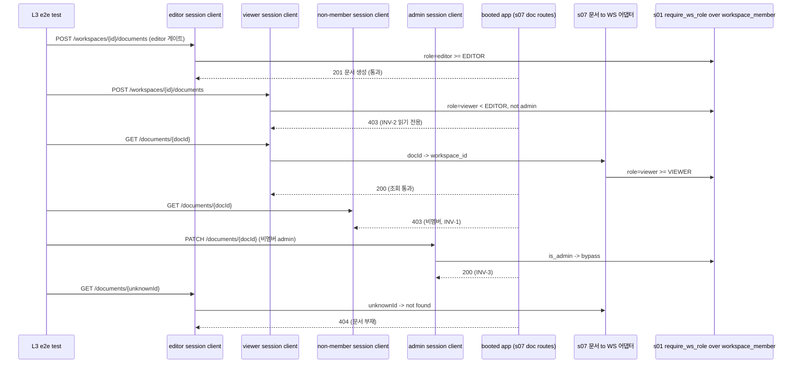
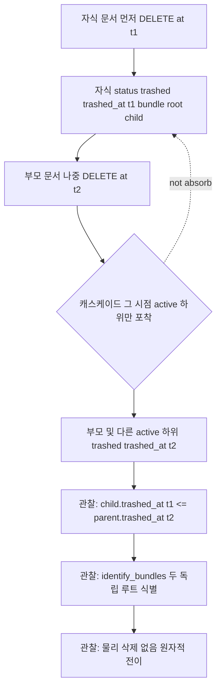
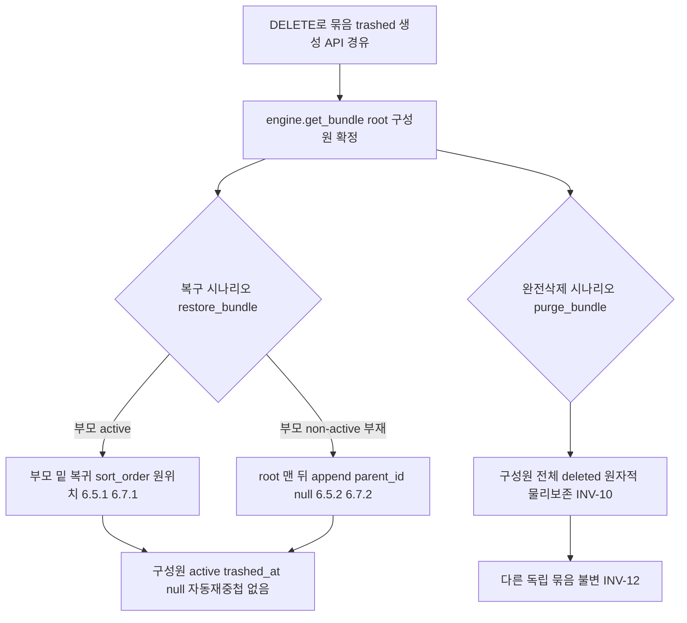
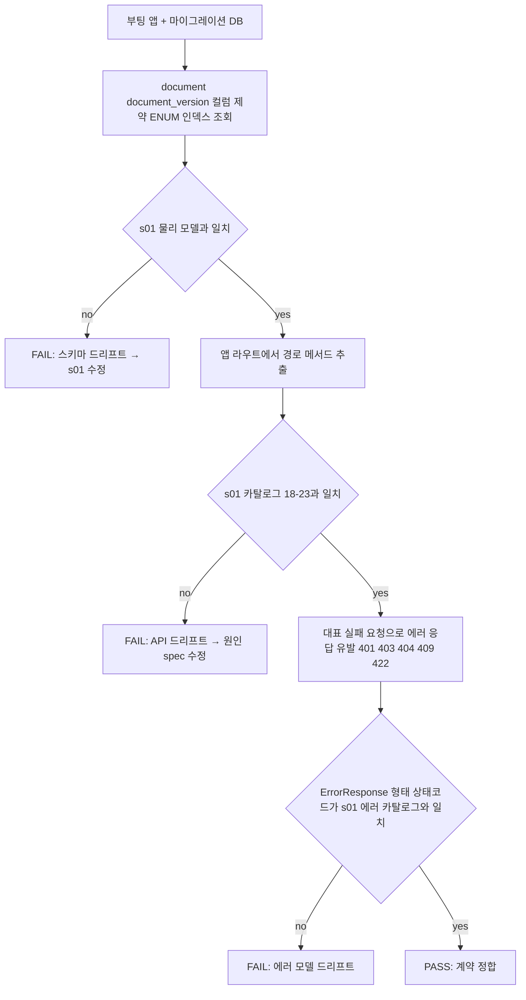

# Design Document — s08-integration-check-L3

## Overview

**Purpose**: `s08-integration-check-L3`는 **L3 누적 통합 검증 체크포인트**다. 이 시점까지 완성된 upstream 누적 집합
(`s01-contract-foundation` ⊕ `s02-auth` ⊕ `s03-admin-account` ⊕ `s05-workspace` ⊕ `s07-document-core`)이 `s01`
단일 계약 소스와 정합하는지, 그리고 이번 계층에서 처음 결합되는 경계(**문서 도메인 ↔ 워크스페이스 권한 경계 ↔
세션 인증·계정 생명주기**)가 실제 결합 상태에서 성립하는지 mock 없이 검증한다. 산출물은 **integration/e2e 테스트
자산과 게이트 판정 기록**뿐이며, feature 로직·엔드포인트·스키마·마이그레이션·상태 엔진을 신규 구현하지 않는다.

검증 초점은 **문서 권한 게이팅(문서 CRUD·이동이 `require_ws_role` 계약대로 게이트되는지, INV-1·2·3)**과
**bundle 전이 엔진 정합(INV-5·6·10·11·12 — 계층 이동 순환 방지·동일 WS 제약·삭제 캐스케이드 비흡수·복구 위치
규칙·완전삭제 원자성·묶음별 독립성)**이다. 핵심은 `s07`이 `DocumentStateEngine` 단일 구현으로 캡슐화한 상태 전이가
실제 API·엔진 결합에서 불변식을 유지하고, 문서→WS 어댑터를 통한 게이팅이 `s05`가 채운 **실제 workspace_member
데이터** 위에서 계약대로 판정하는지를 실제 결합으로 확인하는 것이다.

**Users**: 로드맵 게이트 관리자가 이 체크포인트의 통과 여부로 **게이트(G-1 규칙)**를 판정한다 — 통과해야 L4
(`s09-lock-version`·`s10-trash`) impl 착수가 가능하다. upstream 구현자는 이 체크포인트를 문서 도메인·bundle 엔진·
권한 게이팅 회귀의 조기 경보로 사용한다.

**Impact**: 현재 `backend/`에는 s01 공용 인프라 + s02 `app/auth/` + s03 `app/admin_account/` + s05
`app/workspace/` + s07 `app/document/`(라우터·서비스·`DocumentStateEngine`·`MarkdownRenderer`·문서→WS 어댑터)
구현이 존재하고, `s06-integration-check-L2`의 `backend/tests/integration_L2/` 하네스(그리고 그것이 재사용하는
`integration_L1`)가 존재한다(가정). 이 체크포인트는 그 위에 `backend/tests/integration_L3/` 테스트 스위트만
추가하며, **L2 하네스를 재사용·확장**하고 어떤 애플리케이션 코드도 수정하지 않는다.

### Goals
- 실제 결합(마이그레이션된 DB + 부팅 앱 + 실제 세션 + 실제 멤버십 데이터 + 실제 `DocumentStateEngine`)에서 계약
  대조 검증: `document`·`document_version` 스키마·문서 API(행 18~23)·status 전이 계약·에러 모델이 `s01` 단일 소스와 일치.
- 문서 권한 게이팅 e2e 검증: editor의 문서 생성·수정·이동·삭제 통과, viewer 변경 거부(INV-2), 비멤버 차단(INV-1),
  admin bypass(INV-3), 문서→WS 어댑터 게이팅.
- 문서 계층·이동 정합 검증: 같은 WS 이동/재정렬·중간 삽입 성공, 자기/후손 이동 거부(INV-5), 타 WS 이동 거부(INV-6).
- bundle 삭제 캐스케이드·비흡수 검증(INV-10·11): 그 시점 active 하위만 포착(6.2), 먼저 삭제된 자식 비흡수(6.4)·
  독립 묶음 식별(6.3), 공통 trashed_at, `child.trashed_at ≤ parent.trashed_at`.
- bundle 복구·완전삭제 정합 검증(INV-10·12): 복구 위치 부모 상태 결정(6.5)·sort_order 복원(6.7)·완전삭제 원자성·
  묶음별 독립성·상태/잠금 독립(엔진 primitive 재사용 경계).
- 결합 엣지케이스 검증: `trashed_at` 초 단위 경계 묶음 멤버십(s07 flagged Risk)·삭제된 사용자 작성자 표시 보존(INV-4)·
  문서 보유 워크스페이스 삭제 거부(409, FK RESTRICT·INV-4: s05 워크스페이스 삭제 ↔ s07 문서 존재 경계)·빈 WS 삭제 성공.
- 게이트(G-1 규칙, L3→L4) 통과/미통과 판정과 재검증 트리거 대상(s01·s02·s03·s05·s07)을 명확히 산출.

### Non-Goals
- 새로운 feature 동작·엔드포인트·서비스·스키마·마이그레이션·상태 엔진 구현(s01/s02/s03/s05/s07 소유, 완료 가정).
- 개별 spec 단위 검증의 재실행(각 spec 자체 테스트 소유). 체크포인트는 결합·경계만 본다.
- 발견된 계약 위반의 수정(원인 spec에서 수정 후 재실행).
- **후속 계층(L4 이상)**: 편집 잠금·버전 흐름(s09), 휴지통 목록/복구/완전삭제 **API**·보관 타이머 자동 영구삭제
  (s10), 첨부(s12), 공유(s14). L3은 s07 엔진 primitive(복구·완전삭제·묶음 열거)의 **재사용 계약**이 라우터 밖
  호출에서 불변식을 유지하는 범위까지만 관찰한다.

## Boundary Commitments

### This Spec Owns
- **L3 통합 테스트 스위트**(`backend/tests/integration_L3/`): mock을 쓰지 않는 실제 결합 환경 위에서 문서 계약
  대조·권한 게이팅·계층/이동 정합·bundle 삭제 캐스케이드·복구/완전삭제·결합 엣지케이스를 검증하는 스위트.
- **L3 하네스 확장**: `s06` `integration_L2` 하네스(및 그것이 재사용하는 `integration_L1`: 마이그레이션·앱 부팅·
  admin 시드·세션 유지 클라이언트·계정 생명주기 헬퍼·워크스페이스/멤버/role 세션 시나리오)를 **재사용**하고,
  문서 생성·하위 문서·이동·삭제 호출 헬퍼와 부팅 앱과 동일 DB 세션의 `DocumentStateEngine` 접근 픽스처만 신규 추가.
- **게이트 판정·재검증 트리거 기록**: 스위트 전체 통과를 게이트(G-1 규칙, L3→L4) 통과 조건으로 집계하고 재검증
  대상(s01/s02/s03/s05/s07)을 명시.

### Out of Boundary
- 애플리케이션 코드 일체(`app/common/*`, `app/auth/*`, `app/admin_account/*`, `app/workspace/*`, `app/document/*`,
  `app/models/*`, 마이그레이션). 체크포인트는 이들을 **소비·관찰만** 하고 수정하지 않는다.
- `s06`의 `integration_L2` 스위트·하네스, `s04`의 `integration_L1` 자산의 **정의 변경**. L3은 이를 **재사용**만
  하고 하위 계층 자산을 수정하지 않는다(필요 시 하위 하네스는 재사용 가능한 형태로 이미 존재한다고 가정).
- 문서 CRUD·계층·이동·렌더·status/bundle 전이의 **동작 정의**(s07), 워크스페이스·멤버십·소유권(s05), 로그인·계정
  관리(s02·s03)의 동작 정의. 검증 대상이지 구현 대상 아님.
- 계약 문서(카탈로그·불변식·에러 카탈로그·resolver 계약·물리 모델) 자체의 **정의·완전성**(s01 소유).
- 검증 실패의 코드 수정 — 원인 upstream spec에서 처리.
- 편집 잠금·버전(s09), 휴지통 API·타이머(s10), 첨부(s12), 공유(s14)의 검증 — 후속 체크포인트(s11 이상).

### Allowed Dependencies
- **Upstream(검증 대상, 실제 구현 결합)**: `s01`·`s02`·`s03`·`s05`·`s07`의 실제 구현.
- **재사용 대상(하네스)**: `s06-integration-check-L2`의 `tests/integration_L2/conftest.py`·`helpers.py`(및 그것이
  재사용하는 `integration_L1`): 마이그레이션·부팅·admin 시드·세션 클라이언트·계정 생명주기·워크스페이스/멤버/role 세션 헬퍼.
- **대조 기준(single source of truth)**: `s01-contract-foundation/design.md`(§Physical Data Model:
  `document`·`document_version` · §API Endpoint Catalog 18~23 · §Errors 에러 코드 카탈로그 · §Invariants Catalog
  INV-1·2·3·4·5·6·10·11·12 · §Common/Permissions `Role`·`require_ws_role`·admin bypass · §Base Schemas).
- **Shared infra(테스트 실행)**: FastAPI `TestClient`(Starlette, 쿠키 자 유지), SQLAlchemy 2.0(sync) 세션·
  `information_schema` 조회, `s07` `DocumentStateEngine`(엔진 primitive 직접 호출), Alembic 마이그레이션, pytest,
  MySQL 8. 모든 backend 명령은 `backend/`에서 `uv run`.
- **제약**: mock·stub·가짜 구현 금지(실제 결합만; 엔진 primitive 직접 호출은 실제 s07 코드 실행이므로 허용). 설정
  접근은 `s01` 단일 `Settings` 경유. 애플리케이션 코드 무수정. 대조 기준은 개별 spec design이 아니라 `s01` 단일
  소스. L2 하네스는 재사용하되 중복 신설하지 않는다.

### Revalidation Triggers
이 체크포인트는 다음 변경 시 **누적 집합 기준으로 재실행**한다(roadmap §재검증 트리거). `s07`(L3) 수정 시 이
체크포인트 및 로드맵상 그 이후 모든 체크포인트(L4~L6)를, `s01`(계약) 수정 시 **모든** 체크포인트를 재실행한다.
- `s01` 계약 변경: `document`/`document_version` 스키마(컬럼·제약·ENUM·인덱스), 권한 resolver(`Role` 위계·
  `require_ws_role`·admin bypass) 시그니처·판정 규칙, 세션 인증 의존성, 공통 에러 카탈로그, 카탈로그 행 18~23·
  `{Resource}Create/Read/Update` 규약, 불변식 카탈로그(INV-1·2·3·4·5·6·10·11·12), `trashed_at` 물리 정밀도.
- `s02` 변경: 로그인 상태 게이트·세션 write/clear·payload 키(작성자 삭제 후 로그인 게이트 검증에 영향).
- `s03` 변경: 계정 상태(`is_active`/`is_deleted`) 표현·독립성·전이 동작(작성자 삭제 시 보존 검증에 영향).
- `s05` 변경: 워크스페이스/멤버십 role 판정 데이터 계약·resolver 활성화 방식(문서 게이팅 판정 근거에 영향).
- `s07` 변경: 상태 엔진 primitive 시그니처·의미(삭제 캐스케이드 포착 범위·복구 위치 규칙·완전삭제 원자성·묶음
  식별 방식), 문서 CRUD·이동·삭제 엔드포인트 경로·메서드·요구 role·스키마 이름, 이동 규칙 판정 기준, 문서→WS
  어댑터 게이팅 방식, markdown 렌더 규약.
- 재실행 시에도 mock 없이 실제 구현을 결합한 상태로 검증한다.

## Architecture

### Architecture Pattern & Boundary Map

체크포인트는 애플리케이션 아키텍처를 확장하지 않는다. `tests/integration_L3/` 하나의 테스트 계층이 부팅된 실제
애플리케이션(s07 문서 라우터 포함)과 실제 DB(실제 workspace_member·document 데이터 포함)와 실제
`DocumentStateEngine`을 **관찰·호출**하여 s01 단일 소스와 대조한다. 하네스는 L2의 하네스를 재사용·확장한다.

```mermaid
graph TB
    subgraph Checkpoint_s08[tests integration_L3 - 이 spec 소유]
        Harness[L3 하네스 - L2 하네스 재사용 + 문서/엔진 시나리오 픽스처]
        ContractSuite[문서 계약 대조 스위트]
        GateSuite[문서 권한 게이팅 스위트 INV-1 2 3]
        MoveSuite[계층 이동 정합 스위트 INV-5 6]
        CascadeSuite[bundle 삭제 캐스케이드 스위트 INV-10 11]
        RestoreSuite[bundle 복구 완전삭제 스위트 INV-10 12]
        EdgeSuite[결합 엣지케이스 스위트 정밀도 작성자보존]
        Gate[게이트 판정 및 재검증 기록]
    end
    subgraph Reused[tests integration_L2 및 L1 - 재사용, 무수정]
        L2Harness[L2 하네스 워크스페이스 멤버 role 세션 시나리오]
        L1Harness[L1 하네스 마이그레이션 부팅 admin시드 세션클라이언트 계정헬퍼]
    end
    subgraph Under_Test[검증 대상 - 실제 구현 결합, 무수정]
        App[부팅된 FastAPI 앱 create_app]
        DocRoutes[s07 document routes 18-23]
        WsAdapter[s07 문서 to WS 어댑터]
        Engine[s07 DocumentStateEngine primitive]
        Resolver[s01 require_ws_role over real membership]
        DB[(마이그레이션된 MySQL 8 document document_version workspace_member user)]
    end
    subgraph Baseline[대조 기준 - s01 단일 소스]
        Schema[Physical Model document document_version]
        Catalog[API Catalog 18-23]
        ErrModel[Errors 코드 카탈로그]
        INV[Invariants INV-1 2 3 4 5 6 10 11 12]
        PermContract[Common Permissions Role require_ws_role bypass]
    end
    Harness --> L2Harness
    L2Harness --> L1Harness
    Harness --> App
    Harness --> Engine
    Harness --> DB
    ContractSuite --> App
    ContractSuite --> DB
    ContractSuite -.대조.-> Schema
    ContractSuite -.대조.-> Catalog
    ContractSuite -.대조.-> ErrModel
    GateSuite --> DocRoutes
    GateSuite --> WsAdapter
    GateSuite --> Resolver
    GateSuite -.대조.-> PermContract
    GateSuite -.대조.-> INV
    MoveSuite --> DocRoutes
    MoveSuite -.대조.-> INV
    CascadeSuite --> DocRoutes
    CascadeSuite --> Engine
    CascadeSuite -.대조.-> INV
    RestoreSuite --> Engine
    RestoreSuite -.대조.-> INV
    EdgeSuite --> DocRoutes
    EdgeSuite --> Engine
    EdgeSuite --> DB
    Gate --> ContractSuite
    Gate --> GateSuite
    Gate --> MoveSuite
    Gate --> CascadeSuite
    Gate --> RestoreSuite
    Gate --> EdgeSuite
```



**Architecture Integration**:
- **Selected pattern**: 테스트 전용 검증 계층(외부 관찰자 + 엔진 primitive 재사용 소비자). 실제 결합 e2e로 문서
  도메인·bundle 엔진·권한 게이팅 회귀를 조기 포착.
- **Domain/feature boundaries**: 체크포인트는 어떤 도메인 코드도 소유하지 않는다. `tests/integration_L3/`만
  소유하고 `tests/integration_L2/`·`integration_L1/` 하네스를 재사용한다.
- **Existing patterns preserved**: uv 실행 표준, 단일 `Settings`, 부팅 앱(`create_app`)·마이그레이션 재사용, mock
  금지, 물리 삭제 없음(INV-4) 관찰, `s06` 하네스 패턴 확장, 상태/bundle 규칙 단일 구현(s07 엔진) 소비.
- **New components rationale**: 신규는 L3 스위트와 문서/엔진 시나리오 헬퍼뿐. 각 스위트는 단일 검증 관심사(계약/
  게이팅/이동/캐스케이드/복구·완전삭제/엣지케이스).
- **Steering compliance**: 대조 기준을 s01 단일 소스로 고정(드리프트 방지). 권한 판정은 s01 resolver 단일 구현을
  실제 데이터로 관찰, 상태/bundle 규칙은 s07 엔진 단일 구현을 소비(structure.md 단일화 원칙). mock 금지로 실제 결합 검증.

### Dependency Direction (강제)
```
s01 단일 소스(대조 기준)  ←대조←  Contract/Gate/Move/Cascade/Restore/Edge 스위트  ←관찰·호출←  부팅 앱 + s07 엔진 + 마이그레이션 DB
                                                    ↑
                          L3 하네스(conftest) = L2 하네스 재사용 + 문서/엔진 시나리오 픽스처
```
테스트 계층은 애플리케이션을 **관찰·호출**만 하고 역방향으로 코드를 수정하지 않는다. L3 하네스는 `s01` `create_app`·
마이그레이션·`Settings`·`DocumentStateEngine`과 `s06` L2 하네스(및 L1 하네스)를 재사용한다.

### Technology Stack

체크포인트는 신규 런타임/라이브러리를 도입하지 않는다(테스트 도구 + s07 엔진 소비만 사용).

| Layer | Choice / Version | Role in Feature | Notes |
|-------|------------------|-----------------|-------|
| Test Runner | pytest(`s01` 스택) | 통합/e2e 테스트 실행 | `backend/`에서 `uv run pytest tests/integration_L3` |
| App Under Test | FastAPI `create_app`(s01) | 실제 결합된 부팅 앱 | s02·s03·s05·**s07 문서 라우터**가 조립된 상태 |
| HTTP Client | Starlette `TestClient` | role별 독립 세션 쿠키 유지 e2e | owner/editor/viewer/비멤버/admin 클라이언트 분리 |
| State Engine | `s07` `DocumentStateEngine`(실제 구현) | 복구·완전삭제·묶음 열거 primitive 직접 호출 | 라우터 밖 재사용 경계 검증(mock 아님) |
| Data / ORM | SQLAlchemy 2.0(sync, s01) | document·document_version·`information_schema` 조회 | 스키마 대조·묶음/작성자 관찰 |
| Migration | Alembic(s01) | 검증용 스키마 준비 | `uv run alembic upgrade head` |
| DB | MySQL 8 | 실제 결합 저장소(실제 문서/멤버십 데이터) | mock 금지 — 실 DB 필수 |
| Reused Harness | `s06` `tests/integration_L2`(+`integration_L1`) | 마이그레이션·부팅·admin 시드·세션·워크스페이스/멤버 헬퍼 | 재사용·확장(중복 신설 금지) |

> 신규 외부 의존성 없음. 스택 근거는 `s01` design·research 및 `s07` design 참조.

## File Structure Plan

### Directory Structure
```
backend/tests/integration_L3/               # s08 체크포인트 소유(신규, 테스트 전용)
├── __init__.py
├── conftest.py                             # L3 하네스: L2 하네스(마이그레이션·부팅·admin 시드·세션 클라이언트·
│                                           #   워크스페이스/멤버/role 세션) 재사용 + 문서 트리 구성·엔진 세션 픽스처
├── helpers.py                              # 문서 생성·하위문서·조회·목록·제목수정·이동·삭제 호출 래퍼 +
│                                           #   DocumentStateEngine primitive 호출 래퍼(L2/L1 헬퍼 재사용)
├── test_document_contract_conformance.py   # document·document_version 스키마·API(18~23)·status·에러·Base (REQ-2)
├── test_document_permission_gating.py      # editor/viewer 게이트·비멤버 차단·admin bypass·문서→WS 어댑터 (REQ-3, INV-1·2·3)
├── test_document_hierarchy_move.py         # 같은 WS 이동/재정렬·순환 거부·타 WS 거부·중간삽입 (REQ-4, INV-5·6)
├── test_bundle_delete_cascade.py           # 캐스케이드 active만 포착·비흡수·독립 묶음·원자성 (REQ-5, INV-10·11)
├── test_bundle_restore_purge.py            # 복구 위치·sort_order·완전삭제 원자성·묶음 독립·상태/잠금 독립 (REQ-6, INV-10·12)
└── test_combination_edge.py                # trashed_at 초 단위 묶음 경계·삭제 사용자 작성자 보존·문서 보유 WS 삭제 거부 (REQ-7, INV-4·FK RESTRICT)
```

### Modified Files
- 없음. 체크포인트는 애플리케이션 코드와 `s06`/`s04` 하네스 자산을 수정하지 않는다. (`conftest.py`가 필요로 하는
  테스트 설정은 `s01` `Settings`/`config.yml`의 기존 값과 L2/L1 하네스를 재사용하며 별도 설정 파일을 신설하지 않는다.)

> `tests/integration_L3/*`은 `s01`·`s02`·`s03`·`s05`·`s07`의 공개 표면(부팅 앱·문서 라우트·`DocumentStateEngine`·
> DB)과 `s06` L2 하네스만 소비하고, 대조 기준으로 `s01` design의 계약 요소를 참조한다. 게이트 판정 결과는 테스트
> 실행 결과(전부 통과 = 게이트 통과)로 산출된다.

## System Flows

### 문서 권한 게이팅 e2e — resolver 실동작(실제 멤버십 데이터) 관찰


- **게이트 조건**: role별 실제 세션으로 문서 변경(editor 게이트)·조회(viewer 게이트)를 통과·거부시켜 위계
  editor ≥ viewer와 admin bypass, 비멤버 차단을 관찰한다. 실패하면 resolver 판정(s01)·문서→WS 어댑터(s07)·멤버십
  데이터(s05) 사이의 계약 드리프트를 가리킨다.

### bundle 삭제 캐스케이드 · 비흡수 — API 경유 관찰


- **게이트 조건**: 부모 삭제(t2)가 이미 trashed된 자식(t1)을 흡수하지 않고, 자식이 자기 묶음·자기 trashed_at을
  유지하며 `child.trashed_at ≤ parent.trashed_at`(INV-11)이 성립한다. `identify_bundles`가 두 독립 루트를 식별
  (INV-10 비병합)한다. 실패 시 엔진 비흡수 규칙(s07)의 결합 회귀를 가리킨다.

### bundle 복구 · 완전삭제 — 엔진 primitive 재사용 경계 관찰(라우터 밖)


- **게이트 조건**: 복구 위치는 복구 시점 루트 부모 상태로 1회 검사해 결정(6.5)되고 sort_order가 규칙대로 복원
  (6.7)된다. 완전삭제는 묶음 단위 원자적(INV-10)이며 다른 독립 묶음은 불변(INV-12). 엔진 primitive가 라우터 밖에서
  호출 가능한 재사용 경계임을 확인(s10 소비 계약 선검증). 잠금 필드 유무와 무관하게 전이(§4.3).

### 계약 대조 판정


## Requirements Traceability

| Requirement | Summary | Components | Interfaces / Contracts | Flows |
|-------------|---------|------------|------------------------|-------|
| 1.1–1.5 | mock 없는 실제 결합·s01 단일 소스·feature 미구현·L2 하네스 확장·위반은 원인 spec 수정 | L3TestHarness, 전 스위트 | 실 DB·부팅 앱·세션 클라이언트·엔진·L2 하네스 재사용 | 네 흐름 공통 |
| 2.1, 2.2 | document·document_version 스키마 s01 물리 모델 일치·마이그레이션 무추가 | DocumentContractConformanceSuite | `information_schema`/ORM ↔ s01 physical model | 계약 대조 |
| 2.3 | 카탈로그 18~23 API 노출 정합 | DocumentContractConformanceSuite | 앱 라우트 ↔ s01 카탈로그 18~23 | 계약 대조 |
| 2.4 | 에러 응답 형태·상태코드 정합 | DocumentContractConformanceSuite | `ErrorResponse` ↔ s01 에러 카탈로그 | 계약 대조 |
| 2.5 | Base Schemas 규약·status ENUM 값 | DocumentContractConformanceSuite | `DocumentRead`/`Page` ↔ s01 규약 | 계약 대조 |
| 2.6 | status 전이 계약·deleted 종착·물리삭제 없음 | DocumentContractConformanceSuite, BundleRestorePurgeSuite | status ENUM·INV-4·INV-7 | 계약 대조 |
| 3.1, 3.3 | editor 변경 통과·viewer 조회 통과 | DocumentPermissionGatingSuite, Helpers | `require_ws_role(EDITOR/VIEWER)` over membership | 권한 게이팅 |
| 3.2 | viewer 변경 거부(INV-2) | DocumentPermissionGatingSuite | 403 forbidden | 권한 게이팅 |
| 3.4 | 비멤버 차단(INV-1) | DocumentPermissionGatingSuite | 403 forbidden | 권한 게이팅 |
| 3.5 | admin 비멤버 WS 문서 bypass(INV-3) | DocumentPermissionGatingSuite | admin bypass | 권한 게이팅 |
| 3.6 | 문서→WS 어댑터 게이팅·404/403 | DocumentPermissionGatingSuite | `DocumentWsAdapter` ↔ resolver | 권한 게이팅 |
| 4.1, 4.4 | 같은 WS 이동/재정렬·중간삽입 정렬 | DocumentHierarchyMoveSuite | `POST /documents/{id}/move` | — |
| 4.2 | 자기/후손 이동 거부(INV-5) | DocumentHierarchyMoveSuite | 409/422 | — |
| 4.3 | 타 WS 이동 거부(INV-6) | DocumentHierarchyMoveSuite | 409/422 | — |
| 4.5 | 미존재/비active 부모 이동 거부 | DocumentHierarchyMoveSuite | 404/409 | — |
| 5.1, 5.5 | 캐스케이드 active만 포착·공통 trashed_at·원자성 | BundleDeleteCascadeSuite | `DELETE /documents/{id}` | 삭제 캐스케이드 |
| 5.2 | 비흡수·INV-11 | BundleDeleteCascadeSuite | `identify_bundles`, `get_bundle` | 삭제 캐스케이드 |
| 5.3 | 독립 묶음 식별(6.3) | BundleDeleteCascadeSuite | `identify_bundles` | 삭제 캐스케이드 |
| 5.4 | 비active 재삭제 409 | BundleDeleteCascadeSuite | `DELETE /documents/{id}` 409 | 삭제 캐스케이드 |
| 6.1, 6.2 | 복구 위치 부모상태 결정·sort_order·자동재중첩 없음 | BundleRestorePurgeSuite | `restore_bundle` | 복구·완전삭제 |
| 6.3 | 완전삭제 원자성·deleted 종착·물리보존 | BundleRestorePurgeSuite | `purge_bundle` | 복구·완전삭제 |
| 6.4 | 묶음별 독립성·독립 보관 기준(INV-12) | BundleRestorePurgeSuite | `identify_bundles`, `get_bundle` | 복구·완전삭제 |
| 6.5 | 상태/잠금 독립 | BundleRestorePurgeSuite | `trash_document`/`restore_bundle`/`purge_bundle` | 복구·완전삭제 |
| 7.1, 7.2 | trashed_at 초 단위 묶음 경계·정밀도 승격 기록 | CombinationEdgeSuite | 묶음 재구성 관찰 | 삭제 캐스케이드 |
| 7.3, 7.4 | 삭제 사용자 작성자 보존·물리삭제 부재(INV-4) | CombinationEdgeSuite | `created_by` DB 관찰 | — |
| 7.5, 7.6 | 문서 보유 WS 삭제 409 거부·빈 WS 삭제 성공(FK RESTRICT·INV-4) | CombinationEdgeSuite | `DELETE /workspaces/{id}`(행 14) ↔ document 존재 | — |
| 8.1–8.4 | 게이트 판정·재검증 트리거·환경 미충족 실패 | GateVerdict | 전 스위트 결과 집계 | — |

## Components and Interfaces

| Component | Domain/Layer | Intent | Req Coverage | Key Dependencies (P0/P1) | Contracts |
|-----------|--------------|--------|--------------|--------------------------|-----------|
| L3TestHarness | Test/Fixture | 실 결합 환경(L2 하네스 재사용 + 문서/엔진 시나리오) | 1,2,3,4,5,6,7 | s06 L2 하네스 (P0), s01 create_app (P0), s07 Engine (P0), Alembic (P0), MySQL (P0) | State |
| Helpers | Test/Support | 문서 CRUD·이동·삭제·엔진 primitive 호출 래퍼(L2/L1 헬퍼 재사용) | 3,4,5,6,7 | L3TestHarness (P0), s06 L2 helpers (P0) | Service |
| DocumentContractConformanceSuite | Test/Contract | 스키마·API(18~23)·status·에러·Base 규약 대조 | 2 | L3TestHarness (P0), s01 단일 소스 (P0) | Batch |
| DocumentPermissionGatingSuite | Test/E2E | editor/viewer 게이트·비멤버 차단·admin bypass·어댑터 | 3 | L3TestHarness (P0), Helpers (P0) | Batch |
| DocumentHierarchyMoveSuite | Test/E2E | 같은 WS 이동/재정렬·순환·타 WS·중간삽입 | 4 | L3TestHarness (P0), Helpers (P0) | Batch |
| BundleDeleteCascadeSuite | Test/E2E+Engine | 캐스케이드 active만·비흡수·독립 묶음·원자성 | 5 | L3TestHarness (P0), Helpers (P0), s07 Engine (P0) | Batch |
| BundleRestorePurgeSuite | Test/Engine | 복구 위치·완전삭제 원자성·묶음 독립·상태/잠금 독립 | 6 | L3TestHarness (P0), Helpers (P0), s07 Engine (P0) | Batch |
| CombinationEdgeSuite | Test/E2E+Engine | trashed_at 초 단위 묶음 경계·삭제 사용자 작성자 보존·문서 보유 WS 삭제 거부 | 7 | L3TestHarness (P0), Helpers (P0), s07 Engine (P0), s06 L2 helpers (P0) | Batch |
| GateVerdict | Test/Report | 게이트 판정·재검증 트리거 기록 | 8 | 전 스위트 (P0) | Batch |

### Test / Fixture

#### L3TestHarness
| Field | Detail |
|-------|--------|
| Intent | mock 없는 실제 결합 검증 환경 제공(L2 하네스 재사용·확장 + 엔진 접근) |
| Requirements | 1.1, 1.2, 1.3, 1.4, 2.1, 3.1, 4.1, 5.1, 6.1, 7.1 |

**Responsibilities & Constraints**
- `s06` `tests/integration_L2`의 하네스 픽스처(마이그레이션 `alembic upgrade head`·`s01` `create_app()` 부팅·admin
  시드·세션 유지 `TestClient` 팩토리·고유 login_id 생성기·워크스페이스 생성·멤버 추가(role)·role별 세션 클라이언트)
  를 **재사용**한다. 동일 하네스를 중복 정의하지 않는다.
- 부팅 앱은 s02·s03·s05·**s07 문서 라우터가 조립된 상태**여야 한다(문서 CRUD·이동·삭제 라우트 노출).
- 문서 시나리오 픽스처 신규 추가: 워크스페이스와 role별 멤버(editor/viewer/비멤버/admin)를 구성하고, 문서 트리
  (루트·하위·손자)를 생성하는 셋업을 제공.
- 엔진 접근 픽스처 신규 추가: 부팅 앱과 **동일한 `SessionLocal`/`get_db` 세션 팩토리**로 `s07`
  `DocumentStateEngine`(과 그 `DocumentRepository`)을 인스턴스화해, API 경유 상태 변경과 엔진 primitive 관찰이 동일
  DB를 보게 한다(복구·완전삭제·묶음 열거 primitive 직접 호출용).
- **제약**: 어떤 애플리케이션 코드·하위 하네스 자산도 수정하지 않는다. mock 미사용(엔진 직접 호출은 실제 s07 코드).
  설정은 s01 `Settings` 재사용. DB 미가용 시 스킵이 아니라 **실패** 처리(미검증이 통과로 오인되지 않게 함).

**Dependencies**
- Inbound: 전 스위트 — 결합 환경(P0)
- Outbound: s06 L2 하네스(P0); s01 `create_app`·마이그레이션·`Settings`·document/document_version/workspace_member/
  user 모델(P0); s07 `DocumentStateEngine`·`DocumentRepository`(P0); MySQL 8(P0)

**Contracts**: State [x]
- Preconditions: MySQL 8 가용, s01·s02·s03·s05·s07 구현 및 s06 L2 하네스가 배치됨.
- Postconditions: 마이그레이션된 DB + 부팅 앱(s07 포함) + admin 시드 + role별 세션 클라이언트 + 구성된 워크스페이스/
  멤버/문서 트리 + 엔진 인스턴스 제공. 테스트 종료 시 정리.
- Invariants: mock 부재. 각 테스트는 고유 login_id·워크스페이스·문서 트리로 상태 격리.

**Implementation Notes**
- Integration: `uv run pytest tests/integration_L3`로 실행. DB URL은 s01 `Settings.sqlalchemy_url` 재사용.
- Validation: DB 미가용 시 실패 처리. role별 클라이언트는 독립 세션 쿠키 유지. 엔진 세션은 API 커밋 후 관찰 가능.
- Risks: 멀티 사용자/워크스페이스/문서 트리 상태 오염 → 고유 식별자·정리 픽스처. 엔진/API 세션 분리로 인한 관측
  누락 → 동일 세션 팩토리·커밋 경계 정렬.

### Test / Support

#### Helpers
| Field | Detail |
|-------|--------|
| Intent | 문서 CRUD·이동·삭제·엔진 primitive 호출 래퍼(L2/L1 헬퍼 재사용·확장) |
| Requirements | 3.1, 4.1, 5.1, 6.1, 7.1 |

**Responsibilities & Constraints**
- 문서 생성(`POST /workspaces/{id}/documents`, parent 지정 하위문서 포함), 조회(`GET /documents/{id}`), 목록
  (`GET /workspaces/{id}/documents`), 제목 수정(`PATCH /documents/{id}`), 이동(`POST /documents/{id}/move`), 삭제
  (`DELETE /documents/{id}`) 호출을 감싸는 헬퍼를 제공.
- 엔진 primitive 호출 래퍼: `identify_bundles(workspace_id)`·`get_bundle(root_id)`·`restore_bundle(root_id)`·
  `purge_bundle(root_id)`·`active_descendants(document)`를 하네스 엔진 인스턴스로 호출하고 결과(`Bundle`)를 반환.
- 워크스페이스 생성·멤버 추가(role)·role별 세션 클라이언트·계정 생성·로그인·상태 전이(비활동/삭제) 헬퍼는 `s06`
  L2 `helpers.py`(및 그것이 재사용하는 L1 헬퍼)를 **재사용**한다(중복 정의 금지).
- **제약**: 헬퍼는 실제 라우트 호출·실제 엔진 호출 래퍼일 뿐 애플리케이션 로직을 대체하지 않는다. mock 없음.

**Contracts**: Service [x]
- Trigger: 각 스위트가 시나리오 셋업·엔진 관찰에 사용.
- Output: 라우트 호출 결과(status·body)와 엔진 primitive 결과(`Bundle`·문서 상태), 구성된 문서 트리 식별자.

### Test / Contract

#### DocumentContractConformanceSuite
| Field | Detail |
|-------|--------|
| Intent | 실제 결합 런타임을 s01 단일 소스와 대조(스키마·API·status·에러·Base) |
| Requirements | 2.1, 2.2, 2.3, 2.4, 2.5, 2.6 |

**Responsibilities & Constraints**
- **스키마**: 마이그레이션된 `document`(workspace_id/parent_id/title/status ENUM(active/trashed/deleted)/sort_order
  DECIMAL/current_version_id/trashed_at/created_by/타임스탬프, 인덱스 `(workspace_id, status, parent_id)`·
  `(workspace_id, status, trashed_at)`)와 `document_version`(document_id FK·content·created_by·created_at·
  INDEX(document_id, created_at))이 s01 물리 모델과 일치하는지 `information_schema` 또는 ORM 메타데이터로 대조.
  s07이 새 마이그레이션을 추가하지 않았음을 확인.
- **API 노출**: 부팅 앱 라우트에서 경로·메서드를 추출해 s01 카탈로그 행 18~23(`POST`/`GET /workspaces/{id}/documents`,
  `GET`/`PATCH /documents/{id}`, `POST /documents/{id}/move`, `DELETE /documents/{id}`)과 대조. 요구 role 게이트가
  실제로 걸려 있는지(미인증 401·viewer 변경 403·비멤버 403) 대표 요청으로 확인.
- **에러 모델**: 미인증(401)·권한 부족(403)·미존재(404)·상태 충돌(409, 예: 비active 재삭제·순환 이동)·검증 실패
  (422, 예: 빈 제목)를 실제 유발해 응답이 `ErrorResponse`(`code`/`message`/`field_errors`) 형태이고 상태 코드가
  s01 에러 카탈로그와 일치하는지 확인.
- **Base Schemas·status**: `DocumentRead`가 `TimestampedRead`(id·created_at·updated_at)를 상속하고 목록이
  `Page[DocumentRead]` 규약을 따르는지, `status` 값이 s01 ENUM(active/trashed/deleted)과 동일 집합인지 확인.
- **status 전이·종착**: 문서가 active→trashed(삭제)만 라우터로 노출하고 trashed→deleted가 엔진 종착(INV-7)이며
  어떤 경로에서도 물리 삭제가 없음(INV-4)을 실제 결합으로 확인.
- **제약**: s01 카탈로그·물리 모델이 **대조 기준**이다. s07 design은 기준이 아니라 검증 대상.

**Contracts**: Batch [x]
- Trigger: `uv run pytest tests/integration_L3/test_document_contract_conformance.py`.
- Output: 스키마(2)·API 노출(18~23)·에러 형태·Base 규약·status 전이 대조 그룹의 pass/fail. 불일치 시 드리프트
  요소 지목.

### Test / E2E

#### DocumentPermissionGatingSuite
| Field | Detail |
|-------|--------|
| Intent | 문서 라우트 role 위계(INV-1·2·3)를 실제 멤버십 데이터 위에서 관찰 |
| Requirements | 3.1, 3.2, 3.3, 3.4, 3.5, 3.6 |

**Responsibilities & Constraints**
- owner가 워크스페이스를 만들고 editor·viewer를 멤버로 추가한 뒤, role별 독립 세션으로:
  - **editor 게이트**(생성·수정·이동·삭제): editor·owner 통과(3.1), viewer 403(3.2, INV-2), 비멤버 403(3.4).
  - **viewer 게이트**(조회·목록): owner·editor·viewer 통과(3.3), 비멤버 403(3.4, INV-1).
  - **admin bypass**(3.5): admin이 **자신이 멤버가 아닌** 워크스페이스의 문서 조회·목록·생성·수정·이동·삭제에
    모두 접근 성공(INV-3).
  - **문서→WS 어댑터**(3.6): `/documents/{id}` 라우트가 문서 id로 workspace_id를 추출해 게이트되며, 존재하지 않는
    문서는 404, 권한 미충족은 403임을 확인(어댑터가 resolver 위계 비교·admin bypass를 재구현하지 않고 위임).
- **제약**: 실제 세션 쿠키 자로 e2e(로그인→후속 요청 정합). mock 없음. 판정은 s05가 채운 실제 `workspace_member`
  데이터 위에서 이뤄진다.

**Contracts**: Batch [x]
- Trigger: `uv run pytest tests/integration_L3/test_document_permission_gating.py`.
- Output: editor/viewer 게이트 × role 매트릭스·admin bypass·어댑터 404/403의 pass/fail. 실패 시 resolver(s01)/
  어댑터(s07)/멤버십 데이터(s05) 경계 시사.

#### DocumentHierarchyMoveSuite
| Field | Detail |
|-------|--------|
| Intent | 문서 이동·재정렬 불변식(INV-5·6)을 실제 API 결합에서 관찰 |
| Requirements | 4.1, 4.2, 4.3, 4.4, 4.5 |

**Responsibilities & Constraints**
- editor 세션으로 문서 트리를 구성한 뒤:
  - **같은 WS 이동/재정렬**(4.1): 문서를 다른 부모 밑으로 이동·형제 사이 재정렬 → 성공, 이후 조회에서 새 부모·
    정렬 순서 반영.
  - **순환 방지**(4.2, INV-5): 문서를 자기 자신 또는 후손 밑으로 이동 → 거부(409/422).
  - **WS 경계**(4.3, INV-6): 문서를 다른 워크스페이스 문서 밑으로 이동 → 거부.
  - **중간 삽입 정렬**(4.4): 두 형제 사이로 이동 시 대상만 인접 sort_order 값을 받고 다른 형제는 재배치되지 않음.
  - **부모 검증**(4.5): 존재하지 않는 부모(404) 또는 비active 부모(409)로 이동 → 거부.
- **제약**: 실제 세션 e2e. mock 없음. 거부 상태 코드는 s01 에러 카탈로그의 4xx(409/422/404) 범위 내인지 대조하되
  구체 코드는 s07 구현 확정 값을 허용.

**Contracts**: Batch [x]
- Trigger: `uv run pytest tests/integration_L3/test_document_hierarchy_move.py`.
- Output: 같은 WS 이동·순환 거부·타 WS 거부·중간 삽입·부모 검증의 pass/fail.

#### BundleDeleteCascadeSuite
| Field | Detail |
|-------|--------|
| Intent | 삭제 캐스케이드·비흡수(INV-10·11)를 API·엔진 결합에서 관찰 |
| Requirements | 5.1, 5.2, 5.3, 5.4, 5.5 |

**Responsibilities & Constraints**
- editor가 다단계 문서 트리를 구성한 뒤:
  - **캐스케이드 포착**(5.1): active 하위를 가진 문서를 `DELETE /documents/{id}` → 그 시점 active 하위(루트 포함)만
    trashed·공통 trashed_at. `identify_bundles`/`get_bundle`로 구성원과 trashed_at 동치를 확인.
  - **비흡수·INV-11**(5.2): 자식 먼저(t1) 삭제 → 부모 나중(t2) 삭제 시, 자식이 흡수되지 않고 자기 묶음·자기
    trashed_at(t1) 유지, `child.trashed_at ≤ parent.trashed_at` 성립. 두 묶음이 별개 루트로 식별됨.
  - **독립 묶음**(5.3, 6.3): 일부 하위만 먼저 삭제된 상태에서 부모 삭제 시 두 묶음이 서로 다른 루트로 독립 식별.
  - **비active 재삭제**(5.4): 이미 trashed된 문서 재삭제 → 409 conflict.
  - **원자성·물리보존**(5.5, INV-4·10): 포착 구성원 전이가 단일 원자 조작으로 적용되고 물리 삭제 없음을 DB 관찰로 확인.
- **제약**: 삭제 캐스케이드는 API 경유(권한 게이트 포함), 묶음 식별/검증은 엔진 primitive(`identify_bundles`·
  `get_bundle`) 직접 호출로 관찰. 둘 다 실제 구현. mock 없음.

**Contracts**: Batch [x]
- Trigger: `uv run pytest tests/integration_L3/test_bundle_delete_cascade.py`.
- Output: 캐스케이드 포착·비흡수·독립 묶음·비active 재삭제·원자성의 pass/fail. 실패 시 엔진 비흡수 규칙(s07) 결합 회귀 시사.

#### BundleRestorePurgeSuite
| Field | Detail |
|-------|--------|
| Intent | 복구·완전삭제 primitive 재사용 경계(INV-10·12·6.5·6.7)를 라우터 밖에서 관찰 |
| Requirements | 6.1, 6.2, 6.3, 6.4, 6.5 |

**Responsibilities & Constraints**
- API(`DELETE`)로 묶음을 trashed로 만든 뒤, 부팅 앱과 동일 DB 세션의 엔진 primitive를 직접 호출:
  - **복구 — 부모 active**(6.1, 6.5.1·6.7.1): `restore_bundle(root)` → 루트가 원래 부모 밑으로 복귀, sort_order
    원위치(또는 규칙 폴백) 복원, 구성원 active·trashed_at=NULL.
  - **복구 — 부모 non-active/부재**(6.2, 6.5.2·6.5.3·6.7.2): 루트가 parent_id=NULL로 root 맨 뒤 append, 묶음 내부
    상대 계층 유지, 자동 재중첩 없음.
  - **완전삭제 원자성**(6.3, INV-10·4·7): `purge_bundle(root)` → 구성원 전체 deleted, 물리 보존, deleted 종착.
  - **묶음별 독립성**(6.4, INV-12): 여러 독립 묶음 중 하나를 복구·완전삭제해도 다른 묶음의 구성원·trashed_at·보관
    기준(각 묶음 자기 trashed_at)이 불변.
  - **상태/잠금 독립**(6.5, §4.3): 테스트에서 `lock_user_id`를 직접 세팅한 문서도 삭제·복구·완전삭제가 정상 전이.
    체크포인트는 lock 값을 스스로 설정하지 않는다(테스트 픽스처의 직접 세팅은 관찰용 전제이며 lock 동작 검증은 s09).
- **제약**: 복구·완전삭제 API는 L4(s10)에만 존재하므로 엔진 primitive 직접 호출로 검증(실제 s07 코드, mock 아님).
  이는 s10이 소비할 재사용 계약을 선검증한다.

**Contracts**: Batch [x]
- Trigger: `uv run pytest tests/integration_L3/test_bundle_restore_purge.py`.
- Output: 복구 위치(부모 active/non-active)·sort_order 복원·완전삭제 원자성·묶음 독립·상태/잠금 독립의 pass/fail.

#### CombinationEdgeSuite
| Field | Detail |
|-------|--------|
| Intent | trashed_at 초 단위 묶음 경계(s07 flagged Risk)·삭제 사용자 작성자 보존(INV-4)·문서 보유 WS 삭제 거부(FK RESTRICT·INV-4) 관찰 |
| Requirements | 7.1, 7.2, 7.3, 7.4, 7.5, 7.6 |

**Responsibilities & Constraints**
- **trashed_at 묶음 경계 정밀도**(7.1·7.2): 부모-자식이 동일 초에 trashed될 수 있는 경계(자식 먼저 삭제 → 곧바로
  부모 삭제)를 구성해, 각 삭제가 자기 묶음 구성원을 삭제 시점에 결정적으로 확정하고 `identify_bundles`/`get_bundle`
  재구성이 루트+동일 trashed_at 연결 서브트리 기준으로 독립 묶음을 **오병합 없이** 식별함을 확인. 초 단위 경계에서
  독립 묶음 병합 회귀가 관측되면 실패로 보고하고 `trashed_at` 정밀도 승격을 s01 계약 개정 대상(전 체크포인트 재검증
  동반)으로 기록한다(체크포인트는 수정하지 않음).
- **작성자 보존**(7.3, INV-4): 문서 작성자(`created_by`)를 admin이 삭제(`is_deleted=true`) 처리한 뒤, 그 문서의
  `created_by` 참조와 사용자 이름이 물리 삭제 없이 DB에 보존됨을 직접 조회로 확인(계정 생명주기 L1 ↔ 문서 도메인 결합).
- **물리 삭제 부재**(7.4, INV-4): 삭제·완전삭제 시나리오 전반에서 `document`·`document_version`·`user` 레코드에
  예기치 않은 물리 삭제가 없었음을 확인.
- **문서 보유 WS 삭제 거부**(7.5·7.6, FK RESTRICT·INV-4): owner가 워크스페이스를 만들고 s07 문서 생성
  (`POST /workspaces/{id}/documents`)으로 문서를 하나 추가한 뒤, 그 워크스페이스 삭제(`DELETE /workspaces/{id}`,
  행 14 — s05 엔드포인트, L2 워크스페이스 헬퍼 재사용)를 요청 → **409 conflict**로 거부되고 워크스페이스·문서·멤버십이
  DB에 물리 보존됨을 직접 조회로 확인(`s01` `workspace` 참조 FK `ON DELETE RESTRICT` 및 INV-4 정합). 이어서 문서가
  없는(빈) 워크스페이스 삭제는 여전히 성공(워크스페이스·멤버십 제거)함을 확인해, 삭제가 오직 빈 워크스페이스에만 허용
  되는 경계(s05 워크스페이스 삭제 ↔ s07 문서 존재)가 실제 결합에서 성립함을 관찰. 이 경계는 문서가 처음 존재하는 L3
  에서 최초로 관찰 가능하므로(로드맵상 s07 이후 재검토 대상) 본 체크포인트가 소유.
- **제약**: 계정 상태 전이·워크스페이스 생성/멤버/삭제 헬퍼는 s06 L2(및 L1) 헬퍼 재사용, 문서 생성은 s07 헬퍼 재사용.
  묶음 관찰은 엔진 primitive 직접 호출. mock 없음.

**Contracts**: Batch [x]
- Trigger: `uv run pytest tests/integration_L3/test_combination_edge.py`.
- Output: 초 단위 묶음 경계 무오병합·작성자 보존·물리 삭제 부재·문서 보유 WS 삭제 409 거부·빈 WS 삭제 성공의
  pass/fail. 정밀도 회귀 관측 시 s01 승격 대상 기록.

### Test / Report

#### GateVerdict
| Field | Detail |
|-------|--------|
| Intent | 게이트(G-1 규칙, L3→L4) 통과 판정과 재검증 트리거 대상 기록 |
| Requirements | 8.1, 8.2, 8.3, 8.4 |

**Responsibilities & Constraints**
- Requirement 2~7 스위트가 **전부 통과**하면 게이트 통과로 집계(전체 `uv run pytest tests/integration_L3` 성공)
  = L4(`s09-lock-version`·`s10-trash`) impl 착수 선행 조건 충족. 하나라도 실패하면 미통과로, L4 impl 착수 차단으로 표시.
- 재검증 트리거 대상(s01/s02/s03/s05/s07 수정 시 이 체크포인트 및 로드맵상 그 이후 모든 체크포인트 재실행; s01
  수정 시 모든 체크포인트)을 문서/주석으로 명시.
- 검증 대상 환경(마이그레이션된 MySQL 8·부팅 앱) 미충족은 스킵이 아니라 실패로 처리(미검증의 통과 오인 방지).
- **제약**: 판정은 실제 테스트 실행 결과로만 산출한다(수동 선언 금지).

**Contracts**: Batch [x]
- Trigger: `uv run pytest tests/integration_L3`(전체).
- Output: 전체 통과 = 게이트 통과. 요약에 재검증 트리거 목록·L4 착수 가부 포함.

## Data Models

### Domain Model
- 체크포인트는 **새 엔티티·테이블·컬럼을 정의하지 않는다.** s01 `document`·`document_version`·`workspace_member`·
  `user` 테이블(및 s01~s07이 채운 상태)을 읽기·관찰하고, s07 `DocumentStateEngine`을 호출한다. 테스트 준비를 위한
  admin 시드·사용자 생성·워크스페이스/멤버십 구성·문서 트리 생성은 s03/s05/s07 경로 또는 s01 모델을 통해 수행하며
  스키마를 변경하지 않는다.
- 관찰 대상 상태 축: `document.status`(active/trashed/deleted)·`trashed_at`(묶음 식별·비흡수·독립 기준)·
  `parent_id`/`sort_order`(계층·이동)·`current_version_id`·`lock_user_id`(상태/잠금 독립 관찰)·`created_by`(작성자
  보존). `workspace_member.role`(권한 판정 근거, INV-1). `user.is_deleted`/`name`(작성자 보존·로그인 게이트).
- 관찰 도메인 개념: **묶음(bundle)** = 루트 문서 id + 동일 trashed_at 연결 서브트리(별도 테이블 없음, s07 엔진이 재구성).

### Data Contracts & Integration
- **API 데이터 전송**: 검증은 s01 base 규약(`{Resource}Create/Read/Update`, `Page[T]`, `ErrorResponse`) 준수를
  **확인**한다.
- **에러 직렬화**: 전 문서 엔드포인트가 s01 `ErrorResponse` 단일 형태임을 확인 대상으로 삼는다.
- **엔진 재사용 계약**: `DocumentStateEngine` primitive(`trash_document`·`restore_bundle`·`purge_bundle`·
  `identify_bundles`·`get_bundle`·`active_descendants`)와 `Bundle` DTO가 라우터 밖 호출에서도 s07 계약대로 동작함을
  **확인**한다(s10 소비 계약 선검증). 이 계약 변경은 s08 이상 재검증 트리거다.
- **resolver 데이터 계약**: `workspace_member` 행이 s01 resolver의 문서 라우트 role 판정 근거임을 실제 데이터로 확인.

## Error Handling

### Error Strategy
- 체크포인트 자체는 도메인 에러를 생성하지 않는다. 대신 검증 대상 시스템의 에러 응답을 **관찰**하여 s01 에러 모델과
  대조하고, 엔진 primitive의 상태 충돌 예외(비active 삭제·유효하지 않은 묶음 루트)를 관찰한다. 테스트 실패
  (assertion)는 계약/경계 회귀를 가리키며, 원인 spec에서 수정한다.

### Error Categories and Responses
- **계약 드리프트**: 문서 스키마/API(18~23)/에러 형태/status ENUM 불일치 → DocumentContractConformanceSuite 실패.
- **권한 게이팅 회귀**: editor/viewer 게이트 판정·viewer 읽기 전용·비멤버 차단·admin bypass·어댑터 404/403 불성립
  → DocumentPermissionGatingSuite 실패.
- **계층/이동 회귀**: 순환 미차단(INV-5)·타 WS 이동 허용(INV-6)·중간 삽입 오작동 → DocumentHierarchyMoveSuite 실패.
- **캐스케이드/비흡수 회귀**: active 외 포착·이미 trashed 흡수·묶음 병합·비active 재삭제 미차단 → BundleDeleteCascadeSuite 실패.
- **복구/완전삭제 회귀**: 복구 위치 오판·sort_order 미복원·완전삭제 비원자·묶음 간섭·상태/잠금 결합 → BundleRestorePurgeSuite 실패.
- **엣지케이스 회귀**: 초 단위 묶음 오병합·작성자 소실·물리 삭제 발생 → CombinationEdgeSuite 실패(정밀도 회귀는 s01 승격 대상 기록).
- **환경 미충족**: DB 미가용 등은 스킵이 아니라 실패로 처리(미검증의 통과 오인 방지).

## Testing Strategy

> 이 spec의 산출물 자체가 테스트다. 아래는 스위트 구성의 근거(요구 수용 기준 매핑)다.

### Integration / E2E Tests
- **계약 대조**(REQ-2): 마이그레이션 DB의 document·document_version 스키마 ↔ s01 물리 모델; 부팅 앱 라우트 ↔
  s01 카탈로그 18~23; 대표 실패 요청 에러 응답 ↔ s01 에러 카탈로그; Base Schemas·status ENUM·전이/종착.
- **권한 게이팅**(REQ-3): role별 세션으로 editor/viewer 게이트 통과·거부; viewer 읽기 전용(INV-2); 비멤버 차단
  (INV-1); admin bypass(INV-3); 문서→WS 어댑터 404/403.
- **계층/이동**(REQ-4): 같은 WS 이동/재정렬·중간 삽입; 자기/후손 이동 거부(INV-5); 타 WS 이동 거부(INV-6); 부모 검증.
- **삭제 캐스케이드**(REQ-5): 그 시점 active만 포착(6.2); 먼저 삭제 자식 비흡수(6.4, INV-11); 독립 묶음(6.3);
  비active 재삭제 409; 원자성·물리보존(INV-10·4).
- **복구/완전삭제**(REQ-6): 복구 위치 부모상태 결정(6.5)·sort_order 복원(6.7); 완전삭제 원자성(INV-10)·종착(INV-7);
  묶음별 독립성(INV-12); 상태/잠금 독립(§4.3). 엔진 primitive 직접 호출.
- **결합 엣지케이스**(REQ-7): trashed_at 초 단위 묶음 경계 무오병합(s07 Risk); 삭제 사용자 작성자 보존(INV-4); 물리
  삭제 부재; 문서 보유 워크스페이스 삭제 409 거부·빈 WS 삭제 성공(FK RESTRICT·INV-4, s05 삭제 ↔ s07 문서 존재 경계).
- **게이트 판정**(REQ-8): 전체 스위트 통과 집계 = 게이트 통과(L4 착수 가능); 재검증 트리거 목록 명시; 환경 미충족 실패.

### 실행 표준
- 모든 테스트는 `backend/`에서 `uv run pytest tests/integration_L3`로 실행. 실제 MySQL 8·마이그레이션·실제 문서/
  멤버십 데이터·실제 `DocumentStateEngine` 전제. mock 금지.

## Security Considerations
- 권한 경계(INV-1·2)와 admin bypass(INV-3)가 문서 도메인 결합 관점에서 유지되는지 재확인 — 워크스페이스 단위 권한만
  존재하고 문서별 개별 권한·비멤버·viewer의 권한 상승이 없는지. viewer는 어떤 문서 변경(생성·수정·이동·삭제)도 불가.
- 문서→WS 어댑터가 문서 id를 workspace_id로 매핑하는 과정에서 권한 판정을 우회하는 경로(예: 타 WS 문서 id로 게이트
  회피)가 없는지 확인.
- markdown 렌더는 s07 소유이며 본 체크포인트의 직접 검증 범위 밖이나, 문서 조회 응답의 `content_html`이 신뢰 불가
  본문을 그대로 노출하지 않는지 계약 대조 수준에서 관찰 가능(상세 XSS 새니타이즈 검증은 s07 자체 테스트 소유).
- 문서·첨부 물리 삭제 없음(INV-4). 완전삭제는 상태 전환만(deleted 종착, INV-7). 삭제된 사용자가 문서 접근을 우회
  하지 못함(로그인 401)을 결합에서 재확인.

## Supporting References
- 대조 기준 단일 소스: `s01-contract-foundation/design.md`(§Physical Data Model document·document_version ·
  §API Endpoint Catalog 18~23 · §Errors · §Invariants Catalog INV-1·2·3·4·5·6·10·11·12 · §Common/Permissions ·
  §Base Schemas).
- 검증 대상 동작: `s07-document-core/design.md`(문서 CRUD·이동·삭제 게이팅·`DocumentStateEngine`·`DocumentWsAdapter`·
  삭제 캐스케이드·복구·완전삭제·묶음 식별), `s07-document-core/research.md`(묶음 재구성 정밀도 Risk),
  `s05-workspace/design.md`(권한 게이팅 데이터), `s03-admin-account/design.md`(계정 상태 전이), `s02-auth/design.md`(로그인 게이트).
- 재사용할 하네스 패턴: `s06-integration-check-L2/design.md`(§L2TestHarness·Helpers·스위트 구성·게이트 판정), 및
  그것이 재사용하는 `s04-integration-check-L1`.
- 게이트·재검증 트리거: `.kiro/steering/roadmap.md`(§게이트 · §재검증 트리거 · §Shared seams to watch).
- 설계 결정·리스크: `research.md`.
