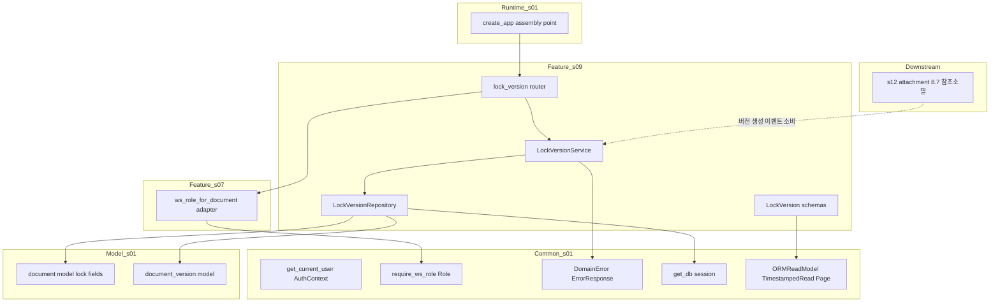
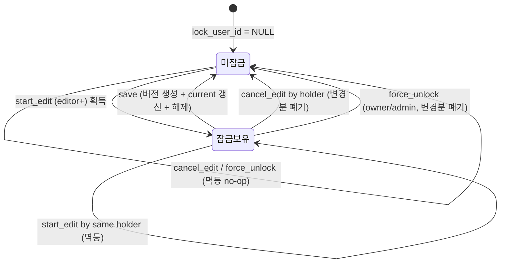
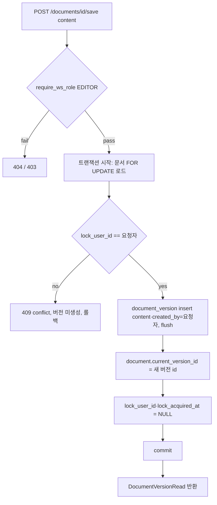

# Design Document — s09-lock-version

## Overview

**Purpose**: Notion-lite의 **편집 잠금**과 **저장 시 버전 생성** 동작을 구현한다. editor 이상 사용자가 문서
편집을 시작하면 잠금을 획득하고(최대 1인, INV-9), 저장하면 새 `document_version` 스냅샷을 만들며
`current_version_id`를 갱신하고 잠금을 해제한다. 저장 없이 취소/이탈하면 잠금을 해제하고 변경분을 폐기하며,
owner/admin은 방치된 잠금을 강제 해제할 수 있다. 자동 타임아웃·rollback은 없고, 버전은 무한 보관된다.

**Users**: editor 이상 사용자는 편집을 시작·저장·취소하고, owner/admin은 강제 해제하며, viewer 이상은 저장
버전 이력을 열람한다. 하위 소비자로 `s12-attachment`가 이 spec의 "저장 = 버전 생성" 이벤트를 근거로 참조
소멸 이미지 아카이브(8.7)를 판정한다(이 spec은 그 판정을 소유하지 않는다).

**Impact**: `s01`이 확정한 계약(`document`의 `lock_user_id`·`lock_acquired_at`·`current_version_id`,
`document_version` 스키마, 카탈로그 행 24~28, 에러 모델, Base Schemas, `require_ws_role`)과 `s07`이
실동작시킨 문서 도메인(문서 엔티티·문서→WS 어댑터) 위에, `s07`이 값 설정을 위임한 lock 필드와 `s07`이
생성하지 않는 `document_version` 레코드의 **쓰기 경로**를 최초로 채운다. 새 마이그레이션·새 컬럼·새 외부
의존성은 추가하지 않는다.

### Goals
- editor 이상의 편집 잠금 시작을 제공하고, 타인 잠금 시 편집 시작을 차단하며 충돌(409)로 "편집 중"을 신호한다(REQ-1).
- 저장 시 버전 생성·`current_version_id` 갱신·잠금 해제를 **단일 트랜잭션으로 원자적**으로 수행한다(REQ-2).
- 편집 취소/이탈·강제 해제로 잠금을 해제하고 미저장 변경분을 폐기한다(REQ-3·4). 자동 타임아웃 없음(REQ-4).
- 버전을 무한 보관하고 목록 열람을 제공하되 rollback·과거 본문 조회는 두지 않는다(REQ-5).
- 잠금·버전 동작이 문서 삭제 상태와 독립임을 보장한다(REQ-6, §4.3, INV-9).

### Non-Goals
- 문서 CRUD·계층·이동·렌더·status/bundle 전이 엔진(`s07`). 이 spec은 상태 전이를 수행하지 않는다.
- 휴지통·보관 타이머(`s10`), 저장 참조 소멸 이미지 아카이브(8.7, `s12`), 공유 링크(`s14`), 프론트엔드 화면.
- 과거 버전 rollback(복원)·과거 버전 **본문** 조회 엔드포인트(`docs/projects.md` §6, 미도입 확정).
- lock 자동 타임아웃(§6, 미도입 확정). 잠금 상태 상시 조회용 신규 GET 엔드포인트(카탈로그 변경 회피).

## Boundary Commitments

### This Spec Owns
- **편집 잠금 생명주기 동작**(카탈로그 행 24·26·27): 시작(획득)·취소·강제 해제. lock 필드
  (`lock_user_id`·`lock_acquired_at`)의 **쓰기 경로**와 INV-9(최대 1인) 강제.
- **저장 → 버전 스냅샷**(행 25): `document_version` 레코드 생성, `document.current_version_id` 갱신, 잠금
  해제를 단일 트랜잭션으로 원자 처리. `document_version` 레코드의 **쓰기 경로**.
- **버전 목록 열람**(행 28): 저장 이력을 `Page[DocumentVersionRead]`(메타데이터 전용)로 반환.
- **잠금·버전 도메인 스키마**: `DocumentLockRead`·`DocumentSaveRequest`·`DocumentVersionRead`(`s01` Base
  Schemas 상속).

### Out of Boundary
- 문서 엔티티·계층·CRUD·이동·렌더·상태 전이 엔진(`s07`). lock 필드·`document_version` 스키마 **정의**는 `s01`.
- 문서→workspace_id 매핑 **어댑터 정의**(`s07` `dependencies.py`). 이 spec은 재사용만 한다.
- 휴지통·보관 타이머(`s10`), 저장 참조 소멸 이미지 아카이브(8.7, `s12`), 공유 링크(`s14`).
- 과거 버전 rollback·과거 버전 본문 조회. 잠금 상태 상시 표시용 신규 조회 엔드포인트.
- `s01` 계약(스키마·카탈로그·에러 모델·Base Schemas·resolver·세션 인증)과 `s05` 워크스페이스·멤버십 동작의 정의.

### Allowed Dependencies
- **Upstream**:
  - `s01-contract-foundation` — `document`/`document_version` 모델, `get_db`, `AuthContext`/
    `get_current_user`, `WorkspaceRoleResolver`/`require_ws_role`/`Role`, `ErrorResponse`/`ErrorCode`/
    `DomainError`, `ORMReadModel`/`TimestampedRead`/`Page`, `Settings`/`get_settings`, 라우터 조립 지점.
  - `s07-document-core` — 문서→workspace_id 어댑터(`ws_role_for_document(minimum: Role)`), 문서 로드 헬퍼.
    (간접 upstream: s08(L3 체크포인트) 통과 이후 착수. `s05`가 채운 `workspace_member`로 resolver 실동작.)
- **Shared infra**: FastAPI(라우팅·DI), SQLAlchemy 2.0(sync) 세션·행 잠금(`FOR UPDATE`), pydantic v2(스키마).
- **제약**: 설정 접근은 `s01` 단일 `Settings` 경유. 문서·버전은 물리 삭제 금지(INV-4). 의존 방향은 항상
  아래층(Schemas → Repository → Service → Dependencies(재사용) → Router → Bootstrap) 향함. `s10`/`s12`/`s14`를
  **import하지 않는다**. `s01`·`s05`·`s07` 계약·로직 무변경. 새 마이그레이션·새 외부 의존성 추가 금지.

### Revalidation Triggers
이 spec의 계약·경계가 다음과 같이 바뀌면 s11(L4) 이상 체크포인트 재검증이 필요하다.
- 잠금 획득/저장/취소/강제해제의 충돌·멱등 판정 규칙(누가 잠금을 풀 수 있는가, INV-9 강제 방식) 변경.
- 저장 트랜잭션의 원자 경계(버전 생성·current 갱신·잠금 해제의 결합) 또는 `document_version` 쓰기 계약 변경.
- 카탈로그 행 24~28의 경로·메서드·요구 role·요청/응답 스키마 이름 변경.
- 잠금·버전 동작이 문서 status에 의존하기 시작하는 등 잠금↔삭제 독립(§4.3) 규칙 변경 — `s10` 결합에 직접 영향.
- `DocumentVersionRead`가 본문을 포함하는 등 버전 열람 계약 변경.

## Architecture

### Architecture Pattern & Boundary Map

레이어드 아키텍처(steering `structure.md` 정렬). `s09`는 `s01` 횡단 common·모델과 `s07` 문서→WS 어댑터를
소비하는 하나의 feature 모듈(`app/lock_version/`)로 캡슐화된다. 잠금 생명주기와 저장(버전+잠금해제)이 강하게
결합되므로 단일 `LockVersionService`가 5개 동작을 담당하고, 데이터 접근은 `LockVersionRepository`가 소유한다.



**Architecture Integration**:
- **Selected pattern**: feature 모듈 + 레이어드. 의존 방향은 좌(하위 s01/s07)→우(s09) 단방향. `s09`는
  `s10`/`s12`/`s14`를 import하지 않는다.
- **Domain/feature boundaries**: 잠금·버전 쓰기(lock 필드·`document_version`)는 `s09`만 소유. 문서 구조·상태
  전이는 `s07`, 권한 판정·세션·에러·스키마 베이스는 `s01`, resolver 실동작 데이터는 `s05`.
- **Existing patterns preserved**: `{Resource}Create/Read` 명명, 단일 `Settings`, 라우터 조립 지점 재사용,
  권한 검사 공통 레이어 단일 구현(문서→WS 어댑터·resolver 재구현 금지), 물리 삭제 없음(INV-4).
- **New components rationale**: `LockVersionService`(잠금·저장 강결합 오케스트레이션)·`LockVersionRepository`
  (lock 필드·버전 쓰기 단일 접근점)·`LockVersionRouter`·스키마만 신규. 각 단일 책임. 문서→WS 어댑터는 `s07` 재사용.
- **Steering compliance**: 권한은 WS 단위 resolver 재사용(INV-1), 설정은 단일 `Settings`, 잠금·삭제 독립(§4.3).

### Dependency Direction (강제)
```
Schemas → Repository → LockVersionService → Dependencies(s07 ws_role_for_document 재사용) → Router → Bootstrap(assembly)
   (각 레이어는 왼쪽 레이어와 s01 common/model·s07 어댑터만 import. 위 방향 위반은 리뷰에서 오류로 취급)
```
`app/lock_version/`는 다른 하위 feature 도메인(`s10`/`s12`/`s14`)을 import하지 않으며, `s01` `common`·
`models`·`schemas.base`와 `s07` 문서→WS 어댑터만 소비한다. 상태 전이는 수행하지 않는다(§4.3).

### Technology Stack

| Layer | Choice / Version | Role in Feature | Notes |
|-------|------------------|-----------------|-------|
| Backend / Runtime | FastAPI(`s01` 버전), uvicorn | 라우팅·의존성 주입 | `s01` 조립 지점에 include_router |
| Auth / Perm | `s01` `require_ws_role`/`Role`/`get_current_user` + `s07` `ws_role_for_document` | 인증·WS 권한 판정 | 어댑터·resolver 재사용, 신설 없음 |
| Data / ORM | SQLAlchemy `>=2.0,<2.1`(sync, `s01`) | lock 필드 r/w, `document_version` insert·조회, `FOR UPDATE` 행 잠금 | `s01` `get_db`·모델 재사용 |
| Config | `s01` `Settings`(pydantic-settings) | 필요 시 기본값 | 단일 접근자 경유 |
| Schemas | pydantic v2(`s01` Base Schemas) | 요청/응답 검증 | `{Resource}Create/Read` 규약 |

> 신규 외부 의존성 없음. 새 마이그레이션 없음(기존 `s01` 스키마 위에서 동작).

## File Structure Plan

### Directory Structure
```
backend/app/
└── lock_version/                 # s09 feature 모듈(신규)
    ├── __init__.py
    ├── router.py                 # 5개 엔드포인트(행 24~28), s07 문서→WS 어댑터로 게이트
    ├── service.py                # LockVersionService: start_edit·save·cancel_edit·force_unlock·list_versions
    ├── repository.py             # LockVersionRepository: lock 필드 r/w(행잠금), 버전 insert·current 갱신·버전 목록
    └── schemas.py                # DocumentSaveRequest, DocumentLockRead, DocumentVersionRead
```

### Modified Files
- `backend/app/main.py` **또는** `backend/app/routers/__init__.py` — `s01`이 마련한 라우터 조립 지점에
  `include_router(lock_version.router)` 추가(REQ-7.6). 조립 지점 위치·방식은 `s01`·`s05`·`s07`을 따른다.

> 각 파일 단일 책임. `lock_version/*`는 `s01` `common`·`models`·`schemas.base`와 `s07` 문서→WS 어댑터만
> import하고 다른 하위 feature 도메인을 import하지 않는다. **버전 생성·current 갱신·잠금 해제는 저장
> 트랜잭션(`service.save` + `repository`) 한 곳에만 존재**한다. 새 마이그레이션·새 의존성 없음.

## System Flows

### 편집 잠금 생명주기 (시작 → 저장/취소/강제해제)

- **판정 요지**: 잠금 판정 근거는 `lock_user_id` 단일 컬럼(INV-9). 타인 잠금 문서에 대한 start_edit·save·
  cancel_edit는 409. 타인 잠금 해제는 force_unlock(owner/admin)만 가능. 모든 동작은 문서 `status`를
  검사하지 않는다(잠금·삭제 독립, §4.3).

### 편집 시작(획득) — 경합 안전 (REQ-1, INV-9)
```mermaid
flowchart TD
    A[POST /documents/id/lock] --> G{require_ws_role EDITOR (문서→WS 어댑터)}
    G -- 문서 없음 --> E404[404 not_found]
    G -- role 미충족 --> E403[403 forbidden]
    G -- pass --> L[문서 행 FOR UPDATE 로드]
    L --> C{lock_user_id 상태}
    C -- NULL --> ACQ[lock_user_id = 요청자, lock_acquired_at = now]
    C -- 요청자 본인 --> IDEM[기존 잠금 유지 (멱등)]
    C -- 타인 --> E409[409 conflict 다른 사용자가 편집 중]
    ACQ --> R[DocumentLockRead 반환]
    IDEM --> R
```
- **판정 요지**: 미잠금 문서 획득은 행 잠금(`FOR UPDATE`) 하에서 `lock_user_id IS NULL`을 재확인해 동시
  획득 경합에서도 INV-9(최대 1인)를 보장한다(research Risk). 동일 보유자 재요청은 멱등 성공.

### 저장 — 원자적 버전 생성·current 갱신·잠금 해제 (REQ-2)

- **판정 요지**: 보유자 검사→버전 insert→current 갱신→잠금 해제가 단일 트랜잭션(원자적, REQ-2.4). 보유자가
  아니면 어떤 버전도 만들지 않고 롤백(REQ-2.5). `current_version_id` nullable FK는 flush로 새 id를 안전히 채운다.

## Requirements Traceability

| Requirement | Summary | Components | Interfaces / Contracts | Flows |
|-------------|---------|------------|------------------------|-------|
| 1.1–1.6 | 편집 잠금 시작·타인 잠금 409·멱등·INV-9·게이트·404 | LockVersionService, LockVersionRepository, LockVersionRouter, (s07 WsAdapter) | `start_edit`, `DocumentLockRead` | 편집 시작(획득) |
| 2.1–2.6 | 저장 시 버전 생성·current 갱신·잠금 해제·원자성·보유자 검사 | LockVersionService, LockVersionRepository, LockVersionRouter | `save`, `DocumentSaveRequest`, `DocumentVersionRead` | 저장 |
| 3.1–3.5 | 취소/이탈 잠금 해제·변경분 폐기·타인 409·멱등·게이트 | LockVersionService, LockVersionRepository, LockVersionRouter | `cancel_edit` | 잠금 생명주기 |
| 4.1–4.5 | 강제 해제(owner/admin)·변경분 폐기·멱등·타임아웃 없음 | LockVersionService, LockVersionRepository, LockVersionRouter | `force_unlock` | 잠금 생명주기 |
| 5.1–5.5 | 버전 목록·무한 보관·rollback 없음·메타데이터·viewer 게이트 | LockVersionService, LockVersionRepository, LockVersionRouter | `list_versions`, `Page[DocumentVersionRead]` | — |
| 6.1–6.4 | 잠금·삭제 독립·상태 전이 미수행·단일 lock 컬럼 | LockVersionService, LockVersionRepository | status 무검사·`lock_user_id` 단일 근거 | 잠금 생명주기 |
| 7.1–7.6 | 카탈로그 준수·마이그레이션 무추가·resolver/어댑터 재사용·에러/Base Schemas·조립 | 전 컴포넌트, Bootstrap wiring | s01/s07 계약 재사용, `include_router` | — |

## Components and Interfaces

| Component | Domain/Layer | Intent | Req Coverage | Key Dependencies (P0/P1) | Contracts |
|-----------|--------------|--------|--------------|--------------------------|-----------|
| LockVersionSchemas | Feature/Contract | 잠금·저장·버전 요청/응답 스키마 | 1,2,5,7 | s01 BaseSchemas (P0) | State |
| LockVersionRepository | Feature/Data | lock 필드 r/w(행잠금)·버전 insert·current 갱신·버전 목록 | 1,2,3,4,5,6 | s01 Db (P0), s01 DocModel·VerModel (P0) | Service, State |
| LockVersionService | Feature/Service | start_edit·save·cancel_edit·force_unlock·list_versions | 1,2,3,4,5,6 | LockVersionRepository (P0), s01 Errors (P1) | Service |
| LockVersionRouter | Feature/API | 5개 엔드포인트(행 24~28) | 1,2,3,4,5,7 | s01 Resolver·s07 WsAdapter (P0), LockVersionService (P0) | API |
| Bootstrap wiring | Runtime | 라우터 조립 연결 | 7 | s01 create_app (P0), Router (P0) | API |

### Feature / Contract

#### LockVersionSchemas
| Field | Detail |
|-------|--------|
| Intent | 잠금·저장·버전 요청/응답 스키마(`{Resource}Create/Read` 규약) |
| Requirements | 1.1, 2.1, 2.6, 5.1, 5.4, 7.5 |

**Contracts**: State [x]
```python
class DocumentSaveRequest(BaseModel):
    content: str                                # 저장할 markdown 본문 스냅샷(빈 문자열 허용)

class DocumentLockRead(ORMReadModel):           # 잠금 획득/보유 정보
    document_id: int
    lock_user_id: int
    lock_acquired_at: datetime

class DocumentVersionRead(ORMReadModel):        # 버전 메타데이터(본문 미포함)
    id: int
    document_id: int
    created_by: int
    created_at: datetime
```
- 규약: 저장 요청=`DocumentSaveRequest`, 잠금 응답=`DocumentLockRead`, 버전 응답=`DocumentVersionRead`
  (`ORMReadModel` 상속), 버전 목록=`Page[DocumentVersionRead]`.
- Boundary: 스키마 형태만 소유. Base 규약(`ORMReadModel`·`Page`)은 `s01`. `DocumentVersionRead`는 본문을
  포함하지 않는다(과거 본문 조회·rollback 없음, research 결정). 현재 본문 열람은 `s07` `GET /documents/{id}`.

### Feature / Data

#### LockVersionRepository
| Field | Detail |
|-------|--------|
| Intent | lock 필드·`document_version`의 단일 데이터 접근점(행 잠금 포함) |
| Requirements | 1.1, 1.3, 1.4, 2.1, 2.2, 2.3, 3.1, 4.1, 5.1, 6.4 |

**Responsibilities & Constraints**
- `s01` `document`·`document_version` 모델·`get_db` 세션 사용. 문서·버전 **물리 삭제 없음**(INV-4).
- 문서 로드: 일반 로드와 **행 잠금 로드**(`FOR UPDATE`)를 모두 제공(획득·저장·해제의 경합 안전).
- lock 필드 쓰기: `acquire_lock`(NULL→요청자·now), `clear_lock`(→NULL). 문서 `status`는 검사·변경하지 않는다(§4.3).
- 버전 쓰기: `insert_version`(content·created_by·created_at, flush로 id 확보), `set_current_version`
  (`document.current_version_id` 갱신).
- 버전 읽기: `list_versions`(document_id로 최신 저장 순, limit/offset/total, `(document_id, created_at)` 인덱스 활용).

**Dependencies**
- Inbound: LockVersionService — 데이터 접근(P0)
- Outbound: `s01` Db — 세션·행 잠금(P0); `s01` DocModel·VerModel — 매핑(P0)

**Contracts**: Service [x] / State [x]
```python
class LockVersionRepository:
    def get(self, db: Session, document_id: int) -> Document | None: ...
    def get_for_update(self, db: Session, document_id: int) -> Document | None: ...     # SELECT ... FOR UPDATE
    def acquire_lock(self, db: Session, doc: Document, *, user_id: int, at: datetime) -> Document: ...
    def clear_lock(self, db: Session, doc: Document) -> Document: ...                    # lock_user_id/at = NULL
    def insert_version(self, db: Session, *, document_id: int, content: str,
                       created_by: int, at: datetime) -> DocumentVersion: ...            # flush로 id 확보
    def set_current_version(self, db: Session, doc: Document, version_id: int) -> Document: ...
    def list_versions(self, db: Session, document_id: int,
                      limit: int, offset: int) -> tuple[list[DocumentVersion], int]: ... # 최신 저장 순
```
- Invariants: lock 판정 근거는 `lock_user_id` 단일 컬럼(INV-9·6.4). `document_version`은 삭제·수정하지 않고
  append만(무한 보관, REQ-5.2). status 무검사·무변경(§4.3).
- Boundary: 데이터 질의·쓰기만. 충돌·멱등·보유자 판정 규칙은 Service가 결정하고 여기서는 질의·쓰기만 수행.

### Feature / Service

#### LockVersionService
| Field | Detail |
|-------|--------|
| Intent | 편집 잠금 생명주기(시작·취소·강제해제)와 저장(버전+잠금해제) 오케스트레이션·규칙 |
| Requirements | 1.1, 1.2, 1.3, 1.4, 2.1, 2.2, 2.3, 2.4, 2.5, 2.6, 3.1, 3.2, 3.3, 3.4, 4.1, 4.3, 4.4, 4.5, 5.1, 5.2, 5.3, 5.4, 6.1, 6.2, 6.3 |

**Responsibilities & Constraints**
- **start_edit**: 행 잠금 로드 후 `lock_user_id` 상태 분기 — NULL→획득(요청자·now), 본인→멱등 성공(변경
  없음), 타인→409(다른 사용자가 편집 중). 문서 미존재→404. `DocumentLockRead` 반환(REQ-1).
- **save**: 단일 트랜잭션에서 행 잠금 로드→보유자 검사(요청자 아니면 409, 버전 미생성)→`insert_version`
  (flush)→`set_current_version`→`clear_lock`→commit. `DocumentVersionRead` 반환(REQ-2). 원자적(REQ-2.4).
- **cancel_edit**: 보유자→`clear_lock`(버전 미생성, 변경분 폐기), 미잠금→멱등 성공(no-op), 타인 잠금→409(REQ-3).
- **force_unlock**: 보유자 무관 `clear_lock`(변경분 폐기, 버전 미생성). 미잠금→멱등 성공. 권한은 라우터에서
  `require_ws_role(OWNER)`로 게이팅(admin bypass)(REQ-4). 자동 타임아웃 없음(REQ-4.4).
- **list_versions**: document_id의 `document_version`을 최신 저장 순 `Page[DocumentVersionRead]`로 반환(REQ-5).
- 모든 동작은 문서 `status`를 검사하지 않고 상태 전이도 수행하지 않는다(§4.3·REQ-6). 잠금 판정은 `lock_user_id`만.

**Dependencies**
- Inbound: LockVersionRouter — 유스케이스 호출(P0)
- Outbound: LockVersionRepository — 질의·쓰기(P0); `s01` Errors — 404/409(P1)

**Contracts**: Service [x]
```python
class LockVersionService:
    def start_edit(self, db: Session, ctx: AuthContext, document_id: int) -> DocumentLockRead: ...  # 404, 409
    def save(self, db: Session, ctx: AuthContext, document_id: int,
             payload: DocumentSaveRequest) -> DocumentVersionRead: ...                              # 404, 409
    def cancel_edit(self, db: Session, ctx: AuthContext, document_id: int) -> None: ...             # 404, 409
    def force_unlock(self, db: Session, ctx: AuthContext, document_id: int) -> None: ...            # 404
    def list_versions(self, db: Session, document_id: int,
                      limit: int, offset: int) -> Page[DocumentVersionRead]: ...                    # 404
```
- Preconditions: 라우터에서 start_edit/save/cancel=`require_ws_role(EDITOR)`, force_unlock=`require_ws_role(OWNER)`,
  list_versions=`require_ws_role(VIEWER)` 통과(admin bypass).
- Postconditions: start_edit 후 문서가 요청자에게 잠김(또는 멱등). save 후 새 버전 존재·current 갱신·잠금 해제.
  cancel/force_unlock 후 잠금 해제·버전 미생성. 모든 전이는 잠금 필드/버전 append에 국한(상태 전이 없음).
- Invariants: 한 문서 잠금 최대 1인(INV-9). 저장은 원자적. status와 독립(§4.3).

### Feature / API

#### LockVersionRouter
| Field | Detail |
|-------|--------|
| Intent | 잠금·버전 5개 엔드포인트 노출(카탈로그 행 24~28) |
| Requirements | 1.1, 1.5, 1.6, 2.1, 2.5, 3.1, 3.5, 4.1, 4.2, 5.1, 5.5, 7.1, 7.3, 7.4, 7.6 |

**Contracts**: API [x]

##### API Contract
| Method | Endpoint | 요구 role | Request | Response | Errors |
|--------|----------|-----------|---------|----------|--------|
| POST | /documents/{id}/lock | editor | — | DocumentLockRead | 401, 403, 404, 409 |
| POST | /documents/{id}/save | editor | DocumentSaveRequest | DocumentVersionRead | 401, 403, 404, 409, 422 |
| POST | /documents/{id}/cancel | editor | — | (204) | 401, 403, 404, 409 |
| POST | /documents/{id}/force-unlock | owner | — | (204) | 401, 403, 404 |
| GET | /documents/{id}/versions | viewer | (limit, offset) | Page[DocumentVersionRead] | 401, 403, 404 |

- 게이트: 모든 경로가 `/documents/{id}/*`이므로 `s07` 문서→WS 어댑터(`ws_role_for_document(minimum)`)로
  문서 id→workspace_id를 추출해 `require_ws_role`에 주입한다(문서 미존재→404). lock/save/cancel=EDITOR,
  force-unlock=OWNER, versions=VIEWER. admin bypass는 resolver가 처리. `s01` 카탈로그 행 24~28과 정합(REQ-7.1).
- `POST /lock`: 타인 잠금 시 409(잠금 보유자 충돌, `s01` 에러 카탈로그). `POST /save`: 보유자 아니면 409(버전
  미생성). `POST /cancel`: 타인 잠금 시 409. 스키마 검증 실패→422.
- Boundary: 라우터는 스키마 검증·게이트·서비스 위임만. 로직은 Service, 판정은 `s01` resolver(`s05` 데이터),
  문서→WS 매핑은 `s07` 어댑터.

### Runtime / Bootstrap wiring
| Field | Detail |
|-------|--------|
| Intent | `s01` 라우터 조립 지점에 잠금·버전 라우터 연결 |
| Requirements | 7.6 |

- `s01` `create_app()`의 feature 라우터 조립 지점에 `include_router(lock_version.router)`를 추가한다. 조립
  지점 위치·방식은 `s01`·`s05`·`s07`을 따른다.
- Boundary: 조립 연결만 소유. 부트스트랩·미들웨어·에러 핸들러 등록은 `s01`.

## Data Models

### Domain Model
- 집계 루트: **Document**(잠금 필드 `lock_user_id`·`lock_acquired_at`·`current_version_id`의 보유자). 부속:
  **DocumentVersion**(본문 스냅샷, append-only). `s09`는 `s01` 소유 스키마를 그대로 사용하며 새 엔티티·컬럼·
  마이그레이션을 추가하지 않는다.
- 불변식: INV-9(문서당 잠금 최대 1인, `lock_user_id` 단일 컬럼으로 강제). INV-4(문서·버전 물리 삭제 없음,
  버전은 append-only). INV-1·2·3은 resolver·문서→WS 어댑터 재사용으로 강제. 잠금·삭제 독립(§4.3).

### Physical Data Model
- 대상 테이블(모두 `s01` 소유, 변경·추가 없음):
  - `document`: `lock_user_id BIGINT FK NULL`, `lock_acquired_at DATETIME NULL`, `current_version_id BIGINT
    FK NULL`(순환 FK는 nullable로 회피, 저장 시 flush 후 갱신), `status ENUM`(이 spec은 읽지도 쓰지도 않음).
  - `document_version`: `id, document_id FK, content MEDIUMTEXT, created_by FK, created_at`. 인덱스
    `(document_id, created_at)`가 목록 최신순 조회를 지원. append-only(무한 보관).
- **경합 처리**: 획득·저장·해제는 문서 행을 `SELECT ... FOR UPDATE`로 로드해 `lock_user_id` 재확인 후
  원자적으로 갱신한다(INV-9 경합 안전, research Risk).
- `current_version_id` 갱신은 `document_version` insert·flush로 새 id를 확보한 뒤 동일 트랜잭션에서 설정한다.

### Data Contracts & Integration
- **API 데이터 전송**: 요청/응답은 `s01` Base Schemas 규약(JSON). `DocumentSaveRequest`(content),
  `DocumentLockRead`, `DocumentVersionRead`(메타데이터), 목록은 `Page[DocumentVersionRead]`.
- **에러 직렬화**: 전 엔드포인트 `s01` `ErrorResponse` 단일 형태.
- **하위 소비 계약**: `s12-attachment`는 이 spec의 "저장 = 새 버전 생성·current 갱신" 결과를 근거로 참조
  소멸 이미지 아카이브(8.7)를 판정한다. 이 spec은 버전 생성만 소유하고 아카이브를 수행하지 않는다.

## Error Handling

### Error Strategy
- 단일 변환 지점: Service·Repository는 `s01` `DomainError`를 raise하고 `s01` 전역 핸들러가 `ErrorResponse`로 변환.
- 잠금 보유자 충돌(타인 잠금 시 시작/저장/취소)과 보유자 아닌 저장은 409(conflict, `s01` 카탈로그의 "잠금
  보유자 충돌")로 일관 매핑.

### Error Categories and Responses
| HTTP | ErrorCode | 발생 조건(s09) |
|------|-----------|----------------|
| 401 | unauthenticated | 세션 없음·무효(`s01` `get_current_user`) |
| 403 | forbidden | editor/owner/viewer 미충족·비멤버(`require_ws_role`), admin 아님 — INV-1·2 |
| 404 | not_found | 문서(또는 소속 워크스페이스) 부재 |
| 409 | conflict | 타인 잠금 문서에 편집 시작/취소, 보유자 아닌 저장(잠금 보유자 충돌, INV-9) |
| 422 | validation_error | 저장 요청 본문(content) 형식 위반 |

- 멱등 케이스(동일 보유자 재시작, 미잠금 취소/강제해제)는 오류가 아니라 성공(200/204)으로 처리한다.

## Testing Strategy

### Unit Tests
- **편집 시작(Service)**: 미잠금→획득(요청자·now 기록), 동일 보유자 재요청→멱등 성공(잠금 불변), 타인
  잠금→409, 문서 미존재→404(1.1·1.2·1.3·1.6). — `start_edit`
- **저장 원자성(Service)**: 보유자 저장 시 새 `document_version` 생성·`current_version_id` 갱신·잠금 해제가
  한 트랜잭션으로 적용되고, 보유자 아닌 저장은 409이며 어떤 버전도 생성되지 않음(2.1·2.2·2.3·2.4·2.5). — `save`
- **취소·강제해제(Service)**: 보유자 취소→잠금 해제·버전 미생성, 미잠금 취소→멱등 no-op, 타인 잠금
  취소→409; 강제해제는 보유자 무관 해제·미잠금 시 멱등(3.1·3.2·3.3·3.4·4.1·4.3). — `cancel_edit`·`force_unlock`
- **버전 목록(Service/Repository)**: 여러 번 저장 후 목록이 최신 저장 순 메타데이터를 페이지 단위로 반환하고
  기존 버전이 삭제되지 않음(무한 보관), 본문이 응답에 포함되지 않음(5.1·5.2·5.4). — `list_versions`
- **INV-9 경합(Repository)**: `FOR UPDATE` 로드 하에서 미잠금 문서에 대한 동시 획득이 한 명만 성공함(1.4). — `acquire_lock`

### Integration Tests
- **잠금→저장 왕복(핵심)**: 마이그레이션된 DB + 부팅 앱에서 editor A가 `POST /lock`→editor B가 `POST /lock`
  시 409("편집 중")→A가 `POST /save`(content)로 새 버전 생성·`current_version_id` 갱신·잠금 해제→B가
  `POST /lock` 성공을 검증(1·2, INV-9).
- **권한 게이팅**: `s05`가 채운 멤버십으로 viewer는 lock/save/cancel 403·editor 통과·admin bypass,
  force-unlock은 owner/admin만 통과·editor 403, versions는 viewer 통과함을 실제 앱 컨텍스트에서 검증(7.3,
  INV-1·2·3). `/documents/{id}/*`가 `s07` 문서→WS 어댑터로 게이팅되고 미존재 문서→404 확인.
- **취소·강제해제 흐름**: A 잠금 후 `POST /cancel`이 잠금을 풀고 버전을 만들지 않음; A 잠금 후 owner가
  `POST /force-unlock`으로 해제하고 A의 미저장 변경분이 폐기됨(버전 없음)을 검증(3·4).
- **잠금·삭제 독립(§4.3)**: 잠긴 문서를 `s07` `DocumentStateEngine.trash_document`로 trashed 전이시켜도 잠금
  필드가 유지되고, 잠금·저장·해제 동작이 status와 무관하게 계속 동작하며, `s09`가 상태 전이를 수행하지
  않음을 검증(6.1·6.2·6.3).
- **카탈로그·마이그레이션 정합**: 부팅 후 카탈로그 행 24~28 경로가 앱 라우트에 노출되고, `s09`가 새
  마이그레이션을 추가하지 않고 `s01` `document`·`document_version` 스키마만 사용함을 검증(7.1·7.2·7.6).

### Contract Consistency Tests
- 응답이 `DocumentLockRead`·`DocumentVersionRead`·`Page[DocumentVersionRead]` 규약과 `s01` `ErrorResponse`
  형태를 따름(7.4·7.5). `DocumentVersionRead`에 본문 필드가 없음(rollback·과거 본문 미제공, 5.3) 확인.

## Security Considerations
- 권한은 WS 단위만(INV-1). 문서별 개별 권한 없음. 판정은 `s01` resolver 단일 구현 재사용, 문서→WS 매핑은
  `s07` 어댑터 재사용, 실동작 데이터는 `s05`.
- viewer는 잠금·저장·취소·강제해제 불가(INV-2). force-unlock은 owner 이상(admin bypass). admin은 모든 판정
  bypass(INV-3).
- INV-9: 한 문서 잠금 최대 1인. 동시 획득 경합은 `FOR UPDATE` 행 잠금으로 방지. 타인 잠금 해제는 owner/admin
  강제해제만 가능.
- 문서·버전 물리 삭제 없음(INV-4). 버전은 append-only(무한 보관). 잠금·버전 동작은 문서 상태를 바꾸지 않는다(§4.3).

## Supporting References
- 계약 단일 소스(document·document_version 스키마·lock 필드·카탈로그 행 24~28·에러 모델·Base Schemas·
  resolver·INV-9): `.kiro/specs/s01-contract-foundation/design.md`.
- 문서 도메인·문서→WS 어댑터(`ws_role_for_document`)·상태/잠금 독립(§4.3·9.4·9.5):
  `.kiro/specs/s07-document-core/design.md`.
- 설계 결정(잠금·삭제 독립·멱등/충돌 규칙·저장 트랜잭션 순서·버전 메타데이터 전용)·Risk(경합):
  `research.md`.
- 상위 근거: `docs/projects.md` §2.4·§2.5, §3 REQ-5, §4.3, §5 INV-9, §6 범위 밖(rollback·타임아웃 미도입).
