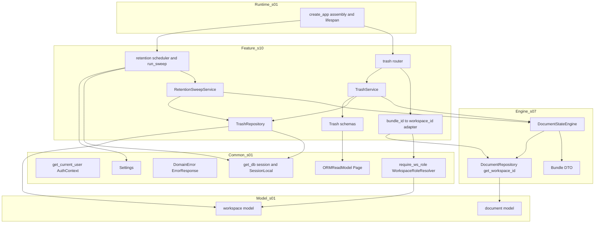
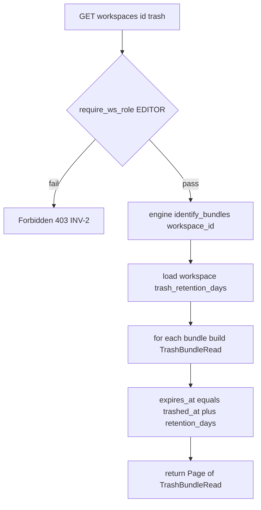
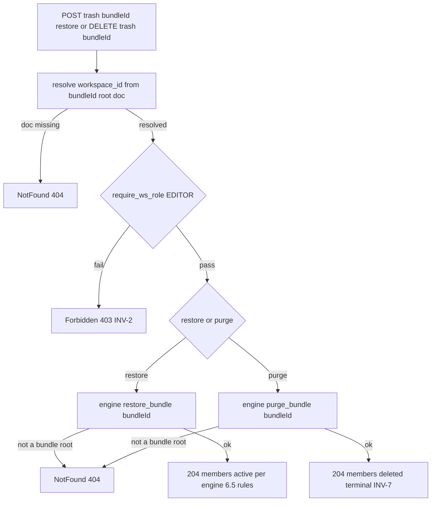
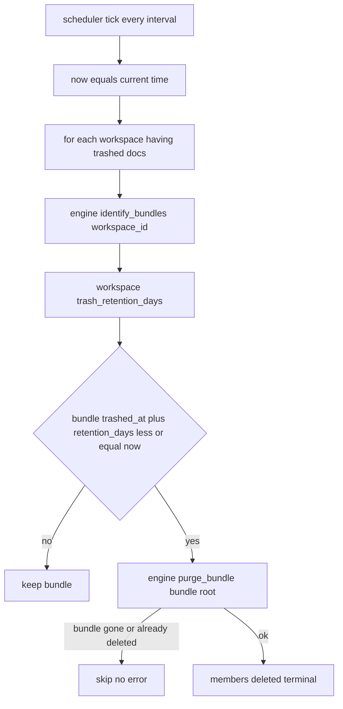

# Design Document — s10-trash

## Overview

**Purpose**: MarkSpace 문서 3단계 생명주기의 **휴지통 단계 API·UX·배치**를 구현한다. 워크스페이스 휴지통의
묶음 목록 열람, 묶음 복구, 묶음 즉시 완전삭제, 그리고 묶음별 독립 보관 타이머에 따른 자동 영구삭제를 소유한다.
핵심 성격은 s07 `DocumentStateEngine`가 캡슐화한 상태 전이 규칙(비흡수·복구 위치·독립 타이머 기준, INV-10·11·12)을
**재구현하지 않고 primitive를 소비하는 얇은 레이어**라는 점이다.

**Users**: editor 이상 사용자는 워크스페이스 휴지통 전체(본인 삭제분 외 포함)를 열람·복구·완전삭제하고, viewer는
접근할 수 없다(REQ-6.11, INV-2). admin은 어떤 권한 검사로도 차단되지 않는다(INV-3). 자동 영구삭제 배치의 직접
소비자는 사람이 아니라 스케줄러이며, s12-attachment가 완전삭제 결과(deleted 전이)를 관찰해 첨부 보관 이동(8.6)을
수행한다. s11(L4) 체크포인트가 잠금↔삭제 독립·묶음 타이머·엔진 결합을 누적 검증한다.

**Impact**: `s01`이 확정한 계약(카탈로그 행 29~31, 에러 모델, Base Schemas, resolver, `document`·`workspace`
스키마, `default_trash_retention_days` Settings)과 `s05`가 실동작시킨 `require_ws_role`·워크스페이스
`trash_retention_days`, 그리고 `s07` 상태 엔진 위에 휴지통 도메인(라우터·서비스·보관 스윕·스케줄러·스키마·
묶음→WS 어댑터)을 최초로 채운다. 새 DB 마이그레이션을 추가하지 않으며, 상태 전이는 엔진에 위임한다. 배치 실행
주기 설정만 `s01` 단일 Settings에 additive 확장한다.

### Goals
- 워크스페이스 휴지통 묶음 목록을 엔진 `identify_bundles`로 열거하고 보관 만료 예정 시각과 함께 노출한다(REQ-1).
- 묶음 복구·완전삭제 API를 엔진 `restore_bundle`·`purge_bundle` 위임으로 제공한다(REQ-2·3).
- 묶음별 `trashed_at` + 워크스페이스 `trash_retention_days` 기준 자동 영구삭제 배치를 멱등하게 구현한다(REQ-4, INV-12).
- editor 이상 워크스페이스 전체 접근·viewer 차단·admin bypass를 resolver 재사용으로 게이팅한다(REQ-5, INV-1·2·3).
- `s01` 계약·`s05` resolver·`s07` 엔진을 재사용하고 상태/묶음 규칙을 재구현하지 않는다(REQ-6).

### Non-Goals
- bundle/status 전이 로직 자체(삭제 캐스케이드·비흡수·복구 위치·완전삭제 원자성·묶음 식별) — s07 엔진 소유.
- 완전삭제·자동삭제 시 첨부 "삭제된 파일 보관 폴더" 이동(8.6) — s12. deleted 전이만 트리거한다.
- 문서 trashed 시 공유 링크 무효화·재발급(7.8~7.10, INV-8) — s14.
- active → trashed 삭제(행 23)와 캐스케이드 — s07. 프론트엔드 화면(확인 다이얼로그 UI 포함).

## Boundary Commitments

### This Spec Owns
- **휴지통 API 3종**: `s01` 카탈로그 행 29~31.
  - `GET /workspaces/{id}/trash`(editor) → `Page[TrashBundleRead]`: 엔진 `identify_bundles` 결과를 표시용으로 투영.
  - `POST /trash/{bundleId}/restore`(editor): 엔진 `restore_bundle(bundleId)` 위임.
  - `DELETE /trash/{bundleId}`(editor): 엔진 `purge_bundle(bundleId)` 위임(파괴적·비가역, 확인은 UX 계약).
- **휴지통 표시 스키마**: `TrashBundleRead`·`TrashMemberRead`(`s01` Base Schemas 상속). 보관 만료 예정 시각
  `expires_at`(= `trashed_at` + workspace `trash_retention_days`) 산정.
- **보관 만료 자동 영구삭제 배치**: `RetentionSweepService`(순수 스윕 로직) + 스케줄러 어댑터·엔트리포인트.
  각 묶음의 만료를 그 묶음 `trashed_at` 기준 독립 산정(INV-12)하고 만료분을 엔진 `purge_bundle`로 전환. 멱등.
- **묶음 id(루트 문서 id) → workspace_id 매핑 어댑터**: `/trash/{bundleId}/*` 경로용 `require_ws_role` 주입.
- **배치 실행 주기 설정의 Settings additive 확장**: `trash_sweep_interval_seconds`(config.yml + 공용 Settings).

### Out of Boundary
- 상태 전이·묶음 규칙(INV-10·11·12)의 **정의·구현** — s07 `DocumentStateEngine`. s10은 primitive를 호출만 한다.
- 완전삭제 결과 첨부 보관 이동(8.6, s12)·공유 링크 무효화(7.8, s14). deleted 전이만 유발한다.
- `s01` 계약(카탈로그·에러 모델·Base Schemas·resolver 로직·세션 인증·DB 스키마·Settings 로더)의 정의, `s05`
  워크스페이스·멤버십·`trash_retention_days` 설정 동작, `s07` 문서 CRUD·삭제 캐스케이드·엔진 내부 규칙.
- 완전삭제 확인 **UI**(프론트엔드). 백엔드는 비가역 계약만 문서화한다.

### Allowed Dependencies
- **Upstream(계약·인프라)**: `s01-contract-foundation` — `document`/`workspace` 모델, `get_db`,
  `WorkspaceRoleResolver`/`require_ws_role`/`Role`, `AuthContext`/`get_current_user`, `ErrorResponse`/`ErrorCode`/
  `DomainError`, `ORMReadModel`/`Page`, `Settings`/`get_settings`, `SessionLocal`, 라우터 조립 지점·lifespan.
- **Upstream(엔진)**: `s07-document-core` — `DocumentStateEngine`(`identify_bundles`·`get_bundle`·`restore_bundle`·
  `purge_bundle`), `Bundle` DTO, `DocumentRepository.get_workspace_id`(묶음→WS 매핑 재사용).
- **간접 upstream**: s08(L3 체크포인트) 통과 이후 착수. 워크스페이스 `trash_retention_days`는 s05가 설정.
- **Shared infra**: FastAPI(라우팅·DI·lifespan), SQLAlchemy 2.0(sync) 세션, pydantic v2(스키마),
  APScheduler(신규 외부 의존성, `uv add`; research 참조).
- **제약**: 설정 접근은 `s01` 단일 `Settings` 경유(모듈별 설정 파일 금지). 문서 물리 삭제 없음(INV-4) — 상태
  전환만, 그마저 엔진 위임. 의존 방향은 항상 아래층(Schemas → Repository/Adapter → Service → Dependencies →
  Router/Scheduler → Bootstrap). s12·s14를 import하지 않는다. `s01`·`s05`·`s07` 계약·로직 무변경(상태 전이 재구현 금지).

### Revalidation Triggers
이 spec의 계약·경계가 다음과 같이 바뀌면 s11(L4) 이상 체크포인트 재검증이 필요하다.
- 휴지통 엔드포인트(행 29~31)의 경로·메서드·요구 role·응답 스키마(`TrashBundleRead`) 이름/필드 변경.
- 보관 만료 산정 규약(무엇을 만료 기준 시각으로 보는지: 묶음 trashed_at ↔ 다른 기준) 또는 묶음별 독립성 변경.
- 묶음 id 해석(루트 문서 id ↔ 별도 식별자) 또는 묶음→WS 매핑 방식 변경.
- 자동 영구삭제 배치의 실행 계약(멱등성·묶음 독립성) 또는 `trash_sweep_interval_seconds` Settings 필드 규약 변경.
- s07 엔진 primitive 시그니처·의미 변경(이 경우 s07가 상위 트리거, s10도 재검증 대상).

## Architecture

### Architecture Pattern & Boundary Map

레이어드 아키텍처(steering `structure.md` 정렬). s10은 `s01` 횡단 common·모델, `s05` 실동작 resolver, `s07`
상태 엔진을 소비하는 하나의 feature 모듈(`app/trash/`)로 캡슐화된다. 핵심은 **상태 전이를 s07 엔진에 전면 위임**하고,
s10은 목록 투영·권한 게이트·보관 스윕 스케줄만 소유하는 것이다.



**Architecture Integration**:
- **Selected pattern**: feature 모듈 + 레이어드 + **상태 전이 전면 위임**. 의존 방향은 좌(하위 s01/s05/s07)→우(s10)
  단방향. s10은 s12/s14를 import하지 않는다.
- **Domain/feature boundaries**: 상태 전이·묶음 규칙은 s07 엔진만 소유. s10은 (1) 목록 투영(`TrashService`),
  (2) 보관 스윕 로직(`RetentionSweepService`), (3) 스케줄 실행(어댑터), (4) 권한 게이트(묶음→WS 어댑터)만 소유.
- **Existing patterns preserved**: `{Resource}Read`·`Page` 규약, 단일 `Settings`, 라우터 조립 지점 재사용,
  권한 검사 공통 레이어 단일 구현(resolver 재구현 금지), 상태/묶음 규칙 단일 구현 재사용(structure.md).
- **New components rationale**: `TrashService`(목록·복구·완전삭제 오케스트레이션)·`RetentionSweepService`(만료
  산정·스윕)·스케줄러 어댑터·`TrashRepository`(표시 보강·retention 조회·스윕 스코프)·묶음→WS 어댑터·라우터·스키마만
  신규. 각 단일 책임.
- **Steering compliance**: 묶음/상태 규칙을 document-core 엔진 재사용으로만 소비(structure.md 코드 조직 원칙).
  권한은 WS 단위 resolver 재사용(INV-1). 설정은 `s01` 단일 Settings 확장(모듈별 파일 금지).

### Dependency Direction (강제)
```
Schemas → (TrashRepository · bundle→WS Adapter) → (TrashService · RetentionSweepService) → Dependencies(require_ws_role 주입) → (Router · Scheduler) → Bootstrap(assembly + lifespan)
     (각 레이어는 왼쪽 레이어와 s01 common/model·s05 resolver·s07 엔진만 import. 위 방향 위반은 리뷰에서 오류로 취급)
```
`app/trash/`는 s12/s14를 import하지 않으며, `s01` `common`·`models`·`schemas.base`, `s05`가 활성화한
`require_ws_role`, `s07` `DocumentStateEngine`·`DocumentRepository`만 소비한다. **상태 전이는 `TrashService`·
`RetentionSweepService`가 직접 쓰지 않고 s07 엔진에 위임한다.**

### Technology Stack

| Layer | Choice / Version | Role in Feature | Notes |
|-------|------------------|-----------------|-------|
| Backend / Runtime | FastAPI(`s01` 버전), uvicorn | 라우팅·의존성 주입·lifespan | `s01` 조립 지점에 include_router, lifespan에 스케줄러 훅 |
| Auth / Perm | `s01` `require_ws_role`/`WorkspaceRoleResolver`/`get_current_user` | 인증·WS 권한 판정 | s10은 묶음→WS 어댑터만 신설 |
| State Engine | `s07` `DocumentStateEngine`·`Bundle` | 복구·완전삭제·묶음 식별 primitive | s10은 호출만, 규칙 무재구현 |
| Data / ORM | SQLAlchemy `>=2.0,<2.1`(sync, `s01`) | workspace retention 조회·스윕 스코프·문서→WS 조회 | `s01` `get_db`·`SessionLocal`·모델 재사용 |
| Scheduler | APScheduler `>=3.10`(BackgroundScheduler) | 주기적 보관 스윕 실행 | 신규 의존성, `uv add`. 스윕 로직과 분리, `<=0`이면 비활성 |
| Config | `s01` `Settings`(pydantic-settings) | `default_trash_retention_days`(기존), `trash_sweep_interval_seconds`(신규 additive) | 단일 접근자 경유 |
| Schemas | pydantic v2(`s01` Base Schemas) | 응답 검증 | `{Resource}Read`·`Page` 규약 |

> APScheduler 최종 버전·대안 비교(asyncio 루프/외부 cron/브로커 큐)는 `research.md` Architecture Pattern
> Evaluation 참조. 핵심 제약은 **스윕 핵심 로직을 스케줄러와 분리해 테스트 가능·멱등하게** 유지하는 것이다.

## File Structure Plan

### Directory Structure
```
backend/app/
└── trash/                        # s10 feature 모듈(신규)
    ├── __init__.py
    ├── router.py                 # 휴지통 3개 엔드포인트(행 29~31), require_ws_role 게이트
    ├── service.py                # TrashService: 목록 투영·복구·완전삭제(엔진 위임 오케스트레이션)
    ├── retention.py              # RetentionSweepService: 만료 산정·스윕(엔진 purge 위임), run_sweep 엔트리포인트
    ├── scheduler.py              # APScheduler 어댑터: lifespan start/stop, 주기 실행 등록
    ├── repository.py             # TrashRepository: workspace retention 조회·스윕 스코프(trashed 보유 WS)·표시 보강
    ├── schemas.py                # TrashBundleRead, TrashMemberRead (+ expires_at 산정 규약)
    └── dependencies.py           # 묶음 id(루트 문서 id) → workspace_id 어댑터(require_ws_role 주입용)
```

### Modified Files
- `backend/app/main.py` **또는** `backend/app/routers/__init__.py` — `s01` 라우터 조립 지점에
  `include_router(trash.router)` 추가. `create_app()` lifespan에 스케줄러 start/stop 훅 연결(REQ-6.5).
- `backend/config.yml` — `trash_sweep_interval_seconds`(기본 3600) 추가.
- `backend/app/config.py`(`s01` `Settings`) — `trash_sweep_interval_seconds: int = 3600` additive 필드 추가.
- `backend/pyproject.toml` — APScheduler 의존성 추가(`uv add`).

> 각 파일 단일 책임. `trash/*`는 `s01` `common`·`models`·`schemas.base`, `s05` resolver, `s07` 엔진만 import하고
> s12/s14를 import하지 않는다. **상태 전이는 엔진 위임이며 s10 어디에도 status/trashed_at 직접 갱신을 두지 않는다.**

## System Flows

### 휴지통 목록 조회 (행 29)

- **판정 요지**: 목록 구성은 엔진 `identify_bundles`가 반환한 `Bundle`(root·trashed_at·members)만을 투영한다.
  s10은 무엇이 묶음인지 재판정하지 않는다(REQ-1.2). `expires_at`은 묶음 `trashed_at` + 워크스페이스
  `trash_retention_days`(REQ-1.4). 응답은 trashed 묶음만 포함하고 deleted는 없다(INV-7).

### 묶음 복구 / 완전삭제 (행 30·31)

- **판정 요지**: 권한 게이트는 묶음 id(루트 문서 id)→workspace_id 매핑으로 판정한다(REQ-5.4). 문서 미존재는
  게이트 단계 404, 존재하나 유효한 묶음 루트가 아니면 엔진이 404(REQ-2.3·3.5). 복구 위치·순서(6.5·6.7)와
  완전삭제 원자성(8.x)은 **엔진이 결정**하며 s10은 위임·상태코드 매핑만 한다. 완전삭제는 비가역(확인은 UX 계약).

### 보관 만료 자동 영구삭제 스윕 (6.8, INV-12)

- **판정 요지**: 스윕은 워크스페이스별로 엔진 `identify_bundles`를 호출해 **묶음별로** 만료를 독립 산정한다
  (REQ-4.2·4.3, INV-12). 한 묶음의 처리는 다른 묶음 기준에 영향을 주지 않는다. 이미 deleted/복구된 묶음은
  `identify_bundles` 결과에 없거나 `purge_bundle`이 안전 처리되어 오류 없이 건너뛴다(REQ-4.6·4.7, 멱등).
  `now`는 스윕 진입점에서 1회 산정해 주입 가능하게 하여 테스트에서 만료 경계를 결정적으로 검증한다.

## Requirements Traceability

| Requirement | Summary | Components | Interfaces / Contracts | Flows |
|-------------|---------|------------|------------------------|-------|
| 1.1–1.8 | 휴지통 묶음 목록·표시·만료 예정·viewer 거부 | TrashService, TrashRepository, TrashSchemas, TrashRouter, BundleWsAdapter | `list_trash`, `identify_bundles`(s07), `TrashBundleRead` | 목록 조회 |
| 2.1–2.6 | 묶음 복구·엔진 위임·404·독립 복구·editor | TrashService, TrashRouter, BundleWsAdapter | `restore_bundle`(s07 위임) | 복구/완전삭제 |
| 3.1–3.7 | 묶음 완전삭제·즉시 deleted·비가역 확인·404·범위 한정 | TrashService, TrashRouter, BundleWsAdapter | `purge_bundle`(s07 위임) | 복구/완전삭제 |
| 4.1–4.7 | 보관 만료 자동 영구삭제·묶음 독립 타이머·멱등 | RetentionSweepService, Scheduler, TrashRepository | `sweep_expired_bundles`, `run_sweep`, `identify_bundles`·`purge_bundle`(s07) | 스윕 |
| 5.1–5.6 | editor+ WS 전체 접근·viewer 403·admin bypass·묶음→WS 매핑 | BundleWsAdapter, TrashRouter, s01 Resolver(재사용) | `require_ws_role`, `get_workspace_id`(s07) | 목록/복구/완전삭제 게이트 |
| 6.1–6.7 | 엔진 재사용·스키마·에러·resolver·조립·마이그레이션 무추가·Settings | 전 컴포넌트, Bootstrap wiring, Settings 확장 | s01/s05/s07 계약 재사용, `include_router`, lifespan | — |

## Components and Interfaces

| Component | Domain/Layer | Intent | Req Coverage | Key Dependencies (P0/P1) | Contracts |
|-----------|--------------|--------|--------------|--------------------------|-----------|
| TrashSchemas | Feature/Contract | 휴지통 묶음 표시 스키마·만료 예정 | 1,6 | s01 BaseSchemas (P0), s07 Bundle (P1) | State |
| TrashRepository | Feature/Data | workspace retention 조회·스윕 스코프·표시 보강 | 1,4 | s01 Db (P0), s01 WsModel (P0) | Service, State |
| BundleWsAdapter | Feature/Dep | 묶음 id(루트 문서 id) → workspace_id 추출(require_ws_role 주입) | 5 | s01 Resolver (P0), s07 DocumentRepository (P0) | Service |
| TrashService | Feature/Service | 목록 투영·복구·완전삭제 오케스트레이션(엔진 위임) | 1,2,3 | s07 Engine (P0), TrashRepository (P0), TrashSchemas (P0), s01 Errors (P1) | Service |
| RetentionSweepService | Feature/Service | 만료 산정·스윕(엔진 purge 위임), 멱등 | 4 | s07 Engine (P0), TrashRepository (P0), s01 Settings (P1) | Service, Batch |
| RetentionScheduler | Feature/Runtime | 주기 스윕 실행 어댑터·run_sweep 엔트리포인트 | 4,6 | RetentionSweepService (P0), s01 SessionLocal·Settings (P0), APScheduler (P0) | Batch |
| TrashRouter | Feature/API | 휴지통 3개 엔드포인트(행 29~31) | 1,2,3,5,6 | s01 Resolver (P0), TrashService (P0), BundleWsAdapter (P0) | API |
| Bootstrap wiring | Runtime | 라우터 조립 + lifespan 스케줄러 연결 | 6 | s01 create_app·lifespan (P0), TrashRouter·RetentionScheduler (P0) | API, Batch |

### Feature / Contract

#### TrashSchemas
| Field | Detail |
|-------|--------|
| Intent | 휴지통 묶음 표시 스키마(`{Resource}Read` 규약)와 보관 만료 예정 시각 산정 |
| Requirements | 1.3, 1.4, 6.2 |

**Contracts**: State [x]
```python
class TrashMemberRead(ORMReadModel):            # 묶음 구성원 요약(표시용)
    id: int                                     # 문서 id
    parent_id: int | None
    title: str

class TrashBundleRead(ORMReadModel):            # 묶음 = 루트 문서 id. s07 Bundle을 표시용으로 투영
    bundle_id: int                              # = root_document_id (카탈로그 {bundleId})
    root_document_id: int
    root_title: str
    workspace_id: int
    trashed_at: datetime                        # 묶음 공통 trashed_at(INV-11·12 기준)
    expires_at: datetime                        # = trashed_at + workspace.trash_retention_days (자동삭제 예정)
    member_count: int
    members: list[TrashMemberRead]              # 묶음 구성원 요약(계층 파악용)
```
- 규약: 응답=`TrashBundleRead`, 목록=`Page[TrashBundleRead]`. `bundle_id`는 s07 묶음 식별자(루트 문서 id)와 동일.
  `expires_at`은 서버 산정 파생값(요청 입력 아님).
- Boundary: 스키마 형태·`expires_at` 산정 규약만 소유. `Bundle`(root·trashed_at·members) 원천은 s07 엔진.
  `Page`·`ORMReadModel` 규약은 s01. 신규 요청 스키마 없음(복구·완전삭제는 본문 없음, 행 30·31).

### Feature / Data

#### TrashRepository
| Field | Detail |
|-------|--------|
| Intent | 워크스페이스 보관일 조회·스윕 스코프 열거·목록 표시 보강의 단일 데이터 접근점 |
| Requirements | 1.4, 4.1, 4.3 |

**Responsibilities & Constraints**
- `s01` workspace 모델·`get_db`/`SessionLocal` 세션 사용. 문서 상태 질의·전이는 하지 않는다(엔진 소관).
- `get_retention_days(db, workspace_id)`: 워크스페이스 `trash_retention_days`(s05 설정값) 조회. 만료 산정 근거.
- `list_workspace_ids_with_trashed(db)`: trashed 문서를 보유한 워크스페이스 id 열거(스윕 스코프 축소). 없으면 빈 목록.
- 표시 보강은 엔진 `Bundle.members`(문서 객체)로 충분하므로 별도 질의를 최소화한다.

**Dependencies**
- Inbound: TrashService — 만료 예정 산정용 retention 조회(P0); RetentionSweepService — 스윕 스코프·retention(P0)
- Outbound: s01 Db — 세션(P0); s01 WsModel — 매핑(P0)

**Contracts**: Service [x] / State [x]
```python
class TrashRepository:
    def get_retention_days(self, db: Session, workspace_id: int) -> int: ...        # workspace.trash_retention_days
    def list_workspace_ids_with_trashed(self, db: Session) -> list[int]: ...        # 스윕 스코프
```
- Invariants: 상태 전이·묶음 식별을 하지 않는다(엔진 위임). 문서 물리 삭제 없음(INV-4).
- Boundary: 워크스페이스 설정 조회·스윕 스코프 질의만. 묶음 경계·문서 상태 판정은 s07 엔진.

### Feature / Dependency

#### BundleWsAdapter (묶음 id → workspace_id 추출)
| Field | Detail |
|-------|--------|
| Intent | `/trash/{bundleId}/*` 경로에서 묶음 루트 문서 id의 workspace_id를 추출해 `s01` `require_ws_role`에 주입 |
| Requirements | 5.1, 5.4 |

**Contracts**: Service [x]
```python
# /workspaces/{id}/trash (행 29): 경로 {id} == workspace_id → require_ws_role(EDITOR) 직접 사용
# /trash/{bundleId} (행 30·31): bundleId(=루트 문서 id) → get_workspace_id 조회(미존재→404) 후 require_ws_role(EDITOR)
def ws_role_for_bundle(minimum: Role) -> Callable[..., AuthContext]:
    # bundleId 경로 파라미터로 s07 DocumentRepository.get_workspace_id 조회(미존재→404),
    # workspace_id를 require_ws_role(minimum) 판정에 주입. resolver 위계·admin bypass는 재구현하지 않음.
    ...
```
- Responsibilities: 묶음 id 문서 미존재→404, 존재 시 workspace_id로 `require_ws_role` 위임. 묶음 루트 유효성
  (trashed 묶음 루트인지)은 여기서 판정하지 않고 서비스 단계 엔진 `get_bundle`/`restore_bundle`/`purge_bundle`가 404.
- Boundary: 경로/문서→workspace_id 매핑 주입만 소유. 판정 로직은 s01, 실동작 데이터는 s05, doc→WS 조회는 s07 재사용.

### Feature / Service

#### TrashService
| Field | Detail |
|-------|--------|
| Intent | 휴지통 목록 투영·복구·완전삭제를 엔진 위임으로 오케스트레이션 |
| Requirements | 1.1, 1.2, 1.3, 1.5, 1.6, 2.1, 2.2, 2.3, 2.4, 3.1, 3.2, 3.3, 3.5, 3.7 |

**Responsibilities & Constraints**
- 목록: 엔진 `identify_bundles(db, workspace_id)`로 묶음 열거 → 각 `Bundle`을 `TrashBundleRead`로 투영하고
  `expires_at = trashed_at + get_retention_days`를 산정(1.3·1.4). trashed 묶음만 노출(1.5). editor는 본인 삭제분
  외 전체 열람(1.6, 권한은 라우터 게이트). 무엇이 묶음인지 재판정하지 않는다(1.2).
- 복구: 엔진 `restore_bundle(db, bundle_id)` 호출. 복구 위치·순서·자동 재중첩 규칙(6.5·6.7)은 엔진 결정에 위임
  (2.2). 유효하지 않은 묶음 루트→엔진 404 전파(2.3). 요청된 묶음에만 적용(2.4).
- 완전삭제: 엔진 `purge_bundle(db, bundle_id)` 호출로 즉시 deleted 전환(3.1). 요청 묶음에만 적용, 다른 묶음
  무영향(3.2). 유효하지 않은 묶음 루트→404(3.5). 상태 전이에 한정, 첨부·공유는 소유하지 않음(3.7).
- **상태 전이·묶음 규칙을 직접 쓰지 않는다.** status/trashed_at을 갱신하지 않고 엔진 primitive만 호출한다.

**Dependencies**
- Inbound: TrashRouter — 유스케이스 호출(P0)
- Outbound: s07 Engine — `identify_bundles`·`restore_bundle`·`purge_bundle`(P0); TrashRepository — retention 조회(P0);
  TrashSchemas — 투영(P0); s01 Errors — 404 전파(P1)

**Contracts**: Service [x]
```python
class TrashService:
    def list_trash(self, db: Session, workspace_id: int,
                   limit: int, offset: int) -> Page[TrashBundleRead]: ...   # identify_bundles 투영 + expires_at
    def restore(self, db: Session, bundle_id: int) -> None: ...             # engine.restore_bundle, 404 전파
    def purge(self, db: Session, bundle_id: int) -> None: ...               # engine.purge_bundle, 404 전파
```
- Preconditions: 호출자는 라우터에서 `require_ws_role(EDITOR)` 통과(admin bypass 포함).
- Postconditions: 복구 후 묶음 구성원 active(엔진 위치 규칙 적용). 완전삭제 후 구성원 deleted(종착). 목록은
  trashed 묶음만·`expires_at` 포함.
- Invariants: 상태 전이는 엔진만 수행(s10은 위임). 묶음 원자성·비흡수·복구 위치(INV-10·11·12)는 엔진 보장.

#### RetentionSweepService
| Field | Detail |
|-------|--------|
| Intent | 보관 만료 묶음을 묶음별 독립 타이머로 산정해 엔진 완전삭제 primitive로 자동 전환(멱등) |
| Requirements | 4.1, 4.2, 4.3, 4.4, 4.5, 4.6, 4.7 |

**Responsibilities & Constraints**
- `sweep_expired_bundles(db, now)`: `list_workspace_ids_with_trashed`로 스코프 축소 → 각 워크스페이스에서 엔진
  `identify_bundles`로 묶음 열거 → 워크스페이스 `retention_days` 조회 → 각 묶음 `trashed_at + retention_days <= now`면
  엔진 `purge_bundle(root)` 호출(4.1·4.4). `now`는 인자로 주입(테스트 결정성).
- 묶음별 독립 산정: 만료 판정은 각 묶음 `trashed_at` 기준이며 다른 묶음 처리가 그 기준을 바꾸지 않는다(4.2, INV-12).
  자식/부모 묶음이 서로 다른 `trashed_at`이면 각자 만료(통상 자식 먼저) — 허용(4.5, 6.4.1).
- 묶음 경계는 엔진 식별에만 의존하고 재구성하지 않는다(4.3).
- 멱등: 이미 deleted/복구되어 `identify_bundles`에 없거나 `purge_bundle`이 안전 처리하는 묶음은 오류 없이 건너뛴다
  (4.6·4.7). 개별 묶음 처리 예외가 전체 스윕을 중단시키지 않도록 격리(로그 후 계속).
- **상태 전이를 직접 쓰지 않는다.** 만료 판정만 s10이 하고 전이는 엔진 `purge_bundle`에 위임한다.

**Dependencies**
- Inbound: RetentionScheduler — 주기 호출(P0); (테스트·수동) `run_sweep` 엔트리포인트(P0)
- Outbound: s07 Engine — `identify_bundles`·`purge_bundle`(P0); TrashRepository — 스코프·retention(P0);
  s01 Settings — 기본 보관일 폴백(P1)

**Contracts**: Service [x] / Batch [x]
```python
class RetentionSweepService:
    def sweep_expired_bundles(self, db: Session, now: datetime) -> int: ...   # 반환: 완전삭제된 묶음 수
```
- Batch: Trigger=스케줄 주기(또는 수동 `run_sweep`). Input=`now`. Output=만료 묶음 deleted 전환.
  Idempotency=이미 처리/복구 묶음 skip, deleted 종착이라 재적용 무해. Recovery=묶음 단위 예외 격리·다음 주기 재시도.
- Invariants: 각 묶음 만료는 자기 `trashed_at` 기준 독립(INV-12). 다른 묶음 삭제·복구가 타이머에 영향 없음.

### Feature / Runtime

#### RetentionScheduler
| Field | Detail |
|-------|--------|
| Intent | 주기 스윕 실행 어댑터(FastAPI lifespan)·독립 실행 엔트리포인트 |
| Requirements | 4.1, 6.5, 6.7 |

**Responsibilities & Constraints**
- `start(app)`/`stop()`: `s01` `create_app()` lifespan에서 호출. `Settings.trash_sweep_interval_seconds`가 `>0`이면
  APScheduler `BackgroundScheduler`에 interval job 등록·기동, `<=0`이면 스케줄러를 기동하지 않는다(외부 cron 사용 신호).
- `run_sweep()`: `SessionLocal`로 자기 세션을 열고 `RetentionSweepService.sweep_expired_bundles(db, now=현재시각)`을
  호출한 뒤 commit/close. 스케줄 job 본체이자 테스트·수동/외부 cron 엔트리포인트(`uv run python -m app.trash.retention`).
- 설정은 `s01` 단일 Settings 경유(모듈별 파일 금지, 6.7). 주기 job은 요청 스코프 세션을 쓰지 않고 자체 세션 관리.

**Dependencies**
- Inbound: Bootstrap lifespan — start/stop(P0)
- Outbound: RetentionSweepService — 스윕(P0); s01 SessionLocal — 세션(P0); s01 Settings — 주기·활성 여부(P0);
  APScheduler — 주기 실행(P0)

**Contracts**: Batch [x]
```python
def run_sweep() -> int: ...                       # SessionLocal 세션으로 sweep 1회, 반환: 처리 묶음 수
def start(app: FastAPI) -> None: ...              # interval>0이면 BackgroundScheduler 기동
def stop() -> None: ...                           # 스케줄러 shutdown
```
- Trigger: interval(초) 주기 또는 수동. Idempotency: 스윕 서비스 멱등성 상속. Recovery: 앱 재시작 시 미실행분은
  다음 주기에 처리. Boundary: 스케줄 실행·세션 수명만 소유. 만료 판정·전이는 서비스·엔진.

### Feature / API

#### TrashRouter
| Field | Detail |
|-------|--------|
| Intent | 휴지통 3개 엔드포인트 노출(행 29~31) |
| Requirements | 1.1, 1.7, 1.8, 2.1, 2.5, 3.1, 3.4, 3.6, 5.1, 5.2, 5.5, 6.3, 6.5 |

**Contracts**: API [x]

##### API Contract
| Method | Endpoint | 요구 role | Request | Response | Errors |
|--------|----------|-----------|---------|----------|--------|
| GET | /workspaces/{id}/trash | editor | (limit, offset) | Page[TrashBundleRead] | 401, 403, 404 |
| POST | /trash/{bundleId}/restore | editor | — | (204) | 401, 403, 404 |
| DELETE | /trash/{bundleId} | editor | — | (204) | 401, 403, 404 |

- 게이트: 전부 `require_ws_role(EDITOR)`(admin bypass, INV-3). `/workspaces/{id}/trash`는 경로 id=workspace_id,
  `/trash/{bundleId}`는 `ws_role_for_bundle`(묶음→WS 어댑터)로 workspace_id 주입. viewer/비멤버→403(INV-2).
  `s01` API 카탈로그 행 29~31과 정합.
- `DELETE /trash/{bundleId}`는 비가역 파괴적 조작이다. 확인 절차(6.10)는 프론트엔드 UX 계약이며, 백엔드는
  OpenAPI 설명에 비가역성을 표기한다(요청 본문 없음, 계약 유지).
- Boundary: 라우터는 게이트·서비스 위임·상태코드 매핑만. 로직은 서비스, 상태 전이는 엔진, 판정은 s01 resolver.

### Runtime / Bootstrap wiring
| Field | Detail |
|-------|--------|
| Intent | s01 라우터 조립 지점에 휴지통 라우터 연결 + lifespan에 스케줄러 훅 |
| Requirements | 6.5 |

- `s01` `create_app()`의 feature 라우터 조립 지점에 `include_router(trash.router)`를 추가하고, lifespan
  startup/shutdown에 `RetentionScheduler.start(app)`/`stop()`을 연결한다. 조립·lifespan 방식은 `s01`·`s05`·`s07`을 따른다.
- Boundary: 조립 연결·lifespan 훅만 소유. 부트스트랩·미들웨어·에러 핸들러 등록은 s01.

## Data Models

### Domain Model
- 이 spec은 **새 엔티티·컬럼·마이그레이션을 추가하지 않는다.** `s01` 소유 `document`(status·trashed_at·parent_id)와
  `workspace`(trash_retention_days) 스키마를 그대로 사용한다.
- **묶음(bundle)**은 도메인 개념이며 별도 테이블/컬럼이 아니다. s07 규약대로 **루트 문서 id**로 식별되고 엔진이
  `status=trashed` + 동일 `trashed_at` + `parent_id` 연결로 재구성한다. s10은 엔진 식별 결과(`Bundle` DTO)만 소비한다.
- 파생값 `expires_at`은 저장하지 않고 응답 시 산정한다(= `trashed_at` + `workspace.trash_retention_days`).
- 불변식: INV-2(viewer 휴지통 불가)·INV-3(admin bypass)·INV-7(deleted 종착)은 s10이 강제/표면화. INV-10·11·12
  (묶음 원자성·독립 타이머·비흡수)는 엔진이 보장하고 s10은 그 위에서 만료 산정만 독립 수행.

### Physical Data Model
- 대상 테이블(모두 `s01` 소유, 변경·추가 없음): `document`(status·trashed_at·parent_id·workspace_id — 인덱스
  `(workspace_id, status, trashed_at)` 활용), `workspace`(trash_retention_days). s10은 읽기·엔진 위임 전이만 한다.
- 활용: `(workspace_id, status, trashed_at)` 인덱스가 엔진의 trashed 열거·묶음 재구성과 s10 스윕 스코프
  (`list_workspace_ids_with_trashed`) 질의를 지원한다.
- 설정: `config.yml` + 공용 `Settings`에 `trash_sweep_interval_seconds`(기본 3600) additive 추가. 보관일 기본은
  기존 `default_trash_retention_days`(30) 재사용. **새 DB 마이그레이션 없음.**

### Data Contracts & Integration
- **API 데이터 전송**: 응답은 `s01` Base Schemas 규약(JSON). 목록은 `Page[TrashBundleRead]`. 복구·완전삭제는
  본문 없는 204(행 30·31).
- **에러 직렬화**: 전 엔드포인트 `s01` `ErrorResponse` 단일 형태.
- **엔진 소비 계약**: s10은 s07 `DocumentStateEngine`의 `identify_bundles`·`get_bundle`(간접)·`restore_bundle`·
  `purge_bundle`와 `Bundle` DTO를 안정 계약으로 소비한다. 이 계약 변경은 s11 이상 재검증 트리거(s07가 상위 트리거).

## Error Handling

### Error Strategy
- 단일 변환 지점: 서비스·어댑터·엔진은 `s01` `DomainError`를 raise하고 s01 전역 핸들러가 `ErrorResponse`로 변환.
- 유효하지 않은 묶음 루트(존재하지 않거나 trashed 묶음 루트 아님)는 엔진이 404로 표면화하고 s10이 전파한다.

### Error Categories and Responses
| HTTP | ErrorCode | 발생 조건(s10) |
|------|-----------|----------------|
| 401 | unauthenticated | 세션 없음·무효(s01 `get_current_user`) |
| 403 | forbidden | editor 미충족·비멤버 휴지통 접근(`require_ws_role`), admin 아님 — INV-2 |
| 404 | not_found | 워크스페이스 부재, 묶음 id 문서 부재(어댑터), 유효하지 않은 묶음 루트 복구/완전삭제(엔진) |
| 422 | validation_error | 목록 페이지네이션 파라미터 형식 오류(있을 경우) |

> 복구/완전삭제는 요청 본문이 없어 422는 통상 발생하지 않는다. 이미 복구/삭제된 묶음에 대한 재요청은 "유효
> 묶음 루트 아님"으로 404가 되며, 별도 409를 두지 않는다(엔진 계약 정합).

## Testing Strategy

### Unit Tests
- **목록 투영·만료 예정(서비스)**: 엔진 `identify_bundles`를 스텁/실호출로 두고, 각 `Bundle`이
  `TrashBundleRead`로 투영되며 `expires_at == trashed_at + retention_days`가 되고 trashed 묶음만 포함됨(1.2·1.3·1.4·1.5). — `TrashService.list_trash`
- **복구·완전삭제 위임(서비스)**: `restore`/`purge`가 엔진 `restore_bundle`/`purge_bundle`을 정확한 루트로 호출하고
  s10이 status/trashed_at을 직접 쓰지 않으며, 유효하지 않은 루트→404 전파(2.1·2.2·2.3·3.1·3.5·3.7). — `TrashService`
- **만료 산정·묶음 독립·멱등(서비스)**: 주입된 `now`에 대해 `trashed_at + retention_days <= now` 묶음만 purge되고,
  아직 남은 묶음은 유지(4.1·4.4); 서로 다른 `trashed_at` 자식/부모 묶음이 각자 만료되어 자식이 먼저 처리됨(4.2·4.5);
  이미 deleted/복구된 묶음은 오류 없이 skip되고 반복 실행이 중복 전이를 일으키지 않음(4.6·4.7). — `RetentionSweepService.sweep_expired_bundles`
- **묶음→WS 어댑터**: 존재하는 묶음 문서 id로 workspace_id를 추출해 `require_ws_role` 판정에 위임하고, 미존재
  문서 id→404, role 미충족→403·admin→통과(5.1·5.4). — `ws_role_for_bundle`

### Integration Tests
- **휴지통 왕복(핵심)**: 마이그레이션된 DB + 부팅 앱에서 s07로 문서를 삭제(trashed)한 뒤 `GET /workspaces/{id}/trash`가
  묶음·`expires_at`을 반환→`POST /trash/{bundleId}/restore`로 복구되어 목록에서 사라지고 문서가 active가 됨→다시
  삭제 후 `DELETE /trash/{bundleId}`로 완전삭제되어 deleted 종착이 됨을 검증(1·2·3, INV-7). 엔진 primitive가 라우터를
  통해 소비됨을 확인.
- **권한 게이팅(핵심)**: `s05` 멤버십으로 viewer는 목록·복구·완전삭제 시 403, editor는 통과(본인 삭제분 외 묶음
  포함), admin bypass, 비인증 401을 실제 앱 컨텍스트에서 검증(5.1·5.2·5.3·5.5, INV-1·2·3). 묶음→WS 어댑터로 게이팅됨 확인.
- **자동 영구삭제 스윕**: 여러 워크스페이스·여러 묶음을 서로 다른 `trashed_at`으로 만든 뒤 `run_sweep`(또는 서비스
  직접 호출, `now` 주입)이 만료 묶음만 deleted로 전환하고, 다른 워크스페이스·미만료 묶음은 불변, 한 묶음 만료가 다른
  묶음 기준에 영향 없음을 검증(4.1~4.5, INV-12).
- **라우터 조립·스케줄러 lifespan**: 부팅 후 카탈로그 행 29~31 경로가 앱 라우트에 노출되고(6.5),
  `trash_sweep_interval_seconds>0` 설정 시 스케줄러가 기동·`<=0`이면 미기동되며 새 마이그레이션이 추가되지 않음(6.6·6.7)을 확인.

### Contract / Boundary Tests
- 응답이 `TrashBundleRead`·`Page[TrashBundleRead]` 규약과 `s01` `ErrorResponse` 형태를 따름(6.2·6.3).
- s10이 상태 전이를 직접 구현하지 않고 엔진 primitive만 호출함을 코드/호출 검증으로 확인(6.1) — s10 서비스에
  status/trashed_at 직접 갱신이 없어야 한다.
- s10이 새 마이그레이션을 추가하지 않고 `s01` document·workspace 스키마만 사용하며, Settings 확장이 additive임을 확인(6.6·6.7).

## Security Considerations
- 권한은 WS 단위만(INV-1). 묶음·문서별 개별 권한 없음. 판정은 `s01` resolver 단일 구현 재사용, 실동작 데이터는 s05.
- viewer는 휴지통 열람·복구·완전삭제 불가(INV-2). admin은 모든 판정 bypass(INV-3). editor는 본인 삭제분 외 WS
  휴지통 전체 접근(6.11) — 워크스페이스 스코프 내 공유 자원.
- 완전삭제·자동삭제는 비가역(deleted 종착, INV-7). 물리 삭제 없음(INV-4) — 엔진이 상태 전환만 수행.
- 완전삭제 확인은 프론트엔드 UX 책임이며(6.10), 백엔드 엔드포인트는 멱등하지 않은 파괴적 조작임을 OpenAPI에 표기.

## Supporting References
- 상태 엔진 primitive·`Bundle` DTO·묶음 식별(루트 id) 규약·doc→WS 조회: `.kiro/specs/s07-document-core/design.md`.
- 계약 단일 소스(카탈로그 행 29~31·에러 모델·Base Schemas·resolver·Settings·스키마): `.kiro/specs/s01-contract-foundation/design.md`.
- 보관일·`trash_retention_days` 설정 소유·`require_ws_role` 실동작: `.kiro/specs/s05-workspace/design.md`.
- 설계 결정(엔진 위임·묶음 id=루트 문서 id 게이트·스윕/스케줄러 분리·Settings additive)·대안 비교·위험: `research.md`.
- 상위 근거: `docs/projects.md` §3 REQ-6.8~6.11, §4.1~4.2, §5 INV-2·3·4·7·10·11·12.
