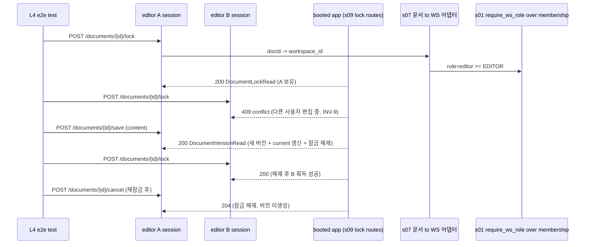
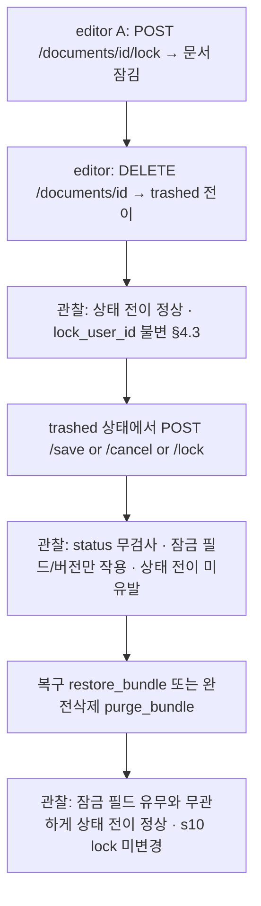
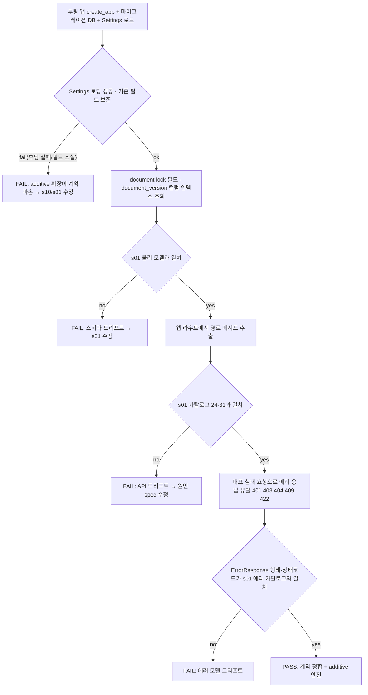

# Design Document — s11-integration-check-L4

## Overview

**Purpose**: `s11-integration-check-L4`는 **L4 누적 통합 검증 체크포인트**다. 이 시점까지 완성된 upstream 누적 집합
(`s01-contract-foundation` ⊕ `s02-auth` ⊕ `s03-admin-account` ⊕ `s05-workspace` ⊕ `s07-document-core` ⊕
`s09-lock-version` ⊕ `s10-trash`)이 `s01` 단일 계약 소스와 정합하는지, 그리고 이번 계층에서 처음 결합되는 경계
(**편집 잠금·버전 도메인 ↔ 휴지통 도메인 ↔ document-core 상태/묶음 엔진 ↔ 아래 계층 권한·계정**)가 실제 결합
상태에서 성립하는지 mock 없이 검증한다. 산출물은 **integration/e2e 테스트 자산과 게이트 판정 기록**뿐이며, feature
로직·엔드포인트·스키마·마이그레이션·상태 엔진·스케줄러를 신규 구현하지 않는다.

검증 초점은 세 축이다. (1) **잠금↔삭제 독립(§4.3, INV-9 ↔ INV-10)**: 잠긴 문서를 trashed로 넣을 수 있고, trashed
문서의 잠금 필드가 상태 전이와 충돌하지 않으며, `s09` 잠금·저장·해제 동작이 문서 `status`를 검사·변경하지 않고
`s10` 상태 전이가 lock 필드를 변경하지 않는다. (2) **묶음(bundle)별 보관 타이머(INV-12)**: `s10`
`RetentionSweepService`가 각 묶음 `trashed_at` + 워크스페이스 `trash_retention_days`를 기준으로 만료를 **독립
산정**해 만료된 묶음만 `purge_bundle`로 실제 영구삭제하며, 한 묶음 처리가 다른 묶음 기준에 영향을 주지 않고 자식이
부모보다 먼저 만료되는 케이스(6.4.1)를 수용하고 멱등이다. (3) **엔진 결합**: `s09`·`s10`이 각각 `s07`
`DocumentStateEngine`과 문서→WS 권한 게이팅을 재구현하지 않고 재사용한다. 여기에 **조정 항목**으로, `s10`이 `s01`
`Settings`에 additive로 추가한 `trash_sweep_interval_seconds`와 APScheduler 도입이 `s01` Settings 계약 로딩과 앱
부팅을 회귀시키지 않는지 실제 부팅으로 확인한다.

**Users**: 로드맵 게이트 관리자가 이 체크포인트의 통과 여부로 **게이트(G-1 규칙)**를 판정한다 — 통과해야 L5
(`s12-attachment`) impl 착수가 가능하다. upstream 구현자는 이 체크포인트를 잠금·버전·휴지통 도메인·엔진 결합·묶음
타이머 회귀의 조기 경보로 사용한다.

**Impact**: 현재 `backend/`에는 s01 공용 인프라 + s02 `app/auth/` + s03 `app/admin_account/` + s05
`app/workspace/` + s07 `app/document/`(라우터·`DocumentStateEngine`·문서→WS 어댑터) + s09 `app/lock_version/`
(잠금·저장·버전 라우터·서비스) + s10 `app/trash/`(휴지통 라우터·`TrashService`·`RetentionSweepService`·
`RetentionScheduler`·Settings additive 확장·APScheduler) 구현이 존재하고, `s08-integration-check-L3`의
`backend/tests/integration_L3/` 하네스(그리고 그것이 재사용하는 `integration_L2`/`integration_L1`)가 존재한다(가정).
이 체크포인트는 그 위에 `backend/tests/integration_L4/` 테스트 스위트만 추가하며, **L3 하네스를 재사용·확장**하고
어떤 애플리케이션 코드도 수정하지 않는다.

### Goals
- 실제 결합(마이그레이션된 DB + 부팅 앱(s09·s10 라우터·스케줄러 포함) + 실제 세션 + 실제 멤버십 데이터 + 실제
  `DocumentStateEngine` + 실제 `RetentionSweepService`)에서 계약 대조: `document` lock 필드·`document_version`
  스키마·잠금/버전/휴지통 API(행 24~31)·에러 모델·Base Schemas가 `s01` 단일 소스와 일치.
- **Settings additive 조정 항목** 검증: `trash_sweep_interval_seconds` 추가가 `s01` `Settings` 계약 로딩을 깨지
  않고 기존 필드 보존·단일 접근자 유지·APScheduler 결합 부팅 회귀 부재.
- 편집 잠금·버전 흐름 e2e: 편집 시작→타인 차단(5.2)→저장 새버전·잠금 해제(5.3)→취소 폐기(5.4)→강제해제(5.6)→
  타임아웃 없음(5.5)→버전 무한 누적·rollback 없음(5.7), INV-9. 잠금·버전 라우트 role 게이팅(INV-1·2·3).
- 휴지통 흐름 e2e: editor+ WS 전체 열람·복구·완전삭제(6.11), viewer/비멤버 거부(INV-1·2), admin bypass(INV-3),
  복구 위치 규칙(6.5) 엔진 결합, 완전삭제 묶음 원자성(6.9, INV-10), 엔진 위임 경계.
- 잠금↔삭제 독립(§4.3): 잠긴 문서 trashed 가능·trashed 문서 잠금 충돌 없음·s09 상태 미전이·s10 lock 미변경.
- 엔진 결합: s09·s10이 s07 엔진·게이팅 재사용(권한 판정·상태 전이 단일 구현 위임).
- 묶음 보관 타이머 자동 영구삭제(6.8, INV-12): 묶음별 독립 만료 산정·만료분만 실제 purge·타 묶음 불변·자식 선만료
  (6.4.1) 수용·멱등·`now` 주입 경계 결정성·워크스페이스 스코프 독립.
- 아래 계층 결합: role별 접근 경계·admin override(INV-1·2·3), 삭제 사용자 작성자·버전 작성자 보존(INV-4), 물리 삭제 부재.
- 게이트(G-1 규칙, L4→L5) 통과/미통과 판정과 재검증 트리거 대상(s01·s02·s03·s05·s07·s09·s10)을 명확히 산출.

### Non-Goals
- 새로운 feature 동작·엔드포인트·서비스·스키마·마이그레이션·상태 엔진·스케줄러 구현(s01/s02/s03/s05/s07/s09/s10
  소유, 완료 가정).
- 개별 spec 단위 검증의 재실행(각 spec 자체 테스트 소유). 체크포인트는 결합·경계만 본다.
- 발견된 계약 위반의 수정(원인 spec에서 수정 후 재실행).
- **후속 계층(L5 이상)**: 첨부·완전삭제 시 보관 폴더 이동(8.6)·저장 참조 소멸 아카이브(8.7, s12), 공유 링크·무효화
  (s14). L4는 s09의 "저장 = 버전 생성" 이벤트와 s10의 "완전삭제 = deleted 전이" 결과가 성립하는 범위까지만
  관찰한다.

## Boundary Commitments

### This Spec Owns
- **L4 통합 테스트 스위트**(`backend/tests/integration_L4/`): mock을 쓰지 않는 실제 결합 환경 위에서 잠금·버전·
  휴지통 계약 대조·Settings additive 조정 항목·잠금·버전 흐름·휴지통 흐름·잠금↔삭제 독립·엔진 결합·묶음 보관 타이머
  독립성·아래 계층 결합 엣지케이스를 검증하는 스위트.
- **L4 하네스 확장**: `s08` `integration_L3` 하네스(및 그것이 재사용하는 `integration_L2`/`integration_L1`:
  마이그레이션·앱 부팅·admin 시드·세션 유지 클라이언트·워크스페이스/멤버/role 세션 시나리오·문서 트리 구성·부팅 앱과
  동일 DB 세션의 `DocumentStateEngine` 접근 픽스처)를 **재사용**하고, 잠금·저장·취소·강제해제·버전 목록 호출 헬퍼,
  휴지통 목록·복구·완전삭제 호출 헬퍼, 보관 스윕 호출(`sweep_expired_bundles`/`run_sweep`, `now` 주입) 픽스처만
  신규 추가.
- **게이트 판정·재검증 트리거 기록**: 스위트 전체 통과를 게이트(G-1 규칙, L4→L5) 통과 조건으로 집계하고 재검증
  대상(s01/s02/s03/s05/s07/s09/s10)을 명시.

### Out of Boundary
- 애플리케이션 코드 일체(`app/common/*`, `app/auth/*`, `app/admin_account/*`, `app/workspace/*`, `app/document/*`,
  `app/lock_version/*`, `app/trash/*`, `app/models/*`, `config.yml`, 마이그레이션). 체크포인트는 이들을 **소비·관찰만**
  하고 수정하지 않는다.
- `s08`의 `integration_L3` 스위트·하네스, `s06`의 `integration_L2`·`s04`의 `integration_L1` 자산의 **정의 변경**.
  L4는 이를 **재사용**만 하고 하위 계층 자산을 수정하지 않는다(필요 시 하위 하네스는 재사용 가능한 형태로 이미
  존재한다고 가정).
- 편집 잠금·저장·버전 동작 정의(s09), 휴지통 API·보관 스윕·스케줄러·Settings 확장 동작 정의(s10), 문서 CRUD·
  삭제 캐스케이드·상태 엔진(s07), 워크스페이스·멤버십(s05), 로그인·계정 관리(s02·s03)의 동작 정의. 검증 대상이지
  구현 대상 아님.
- 계약 문서(카탈로그·불변식·에러 카탈로그·resolver 계약·Settings 스키마·물리 모델) 자체의 **정의·완전성**(s01 소유).
- 검증 실패의 코드 수정 — 원인 upstream spec에서 처리.
- 첨부(s12), 공유(s14)의 검증 — 후속 체크포인트(s13 이상).

### Allowed Dependencies
- **Upstream(검증 대상, 실제 구현 결합)**: `s01`·`s02`·`s03`·`s05`·`s07`·`s09`·`s10`의 실제 구현.
- **재사용 대상(하네스)**: `s08-integration-check-L3`의 `tests/integration_L3/conftest.py`·`helpers.py`(및 그것이
  재사용하는 `integration_L2`/`integration_L1`): 마이그레이션·부팅·admin 시드·세션 클라이언트·워크스페이스/멤버/role
  세션 헬퍼·문서 트리 구성·엔진 세션 픽스처.
- **대조 기준(single source of truth)**: `s01-contract-foundation/design.md`(§Physical Data Model:
  `document`(lock 필드 `lock_user_id`·`lock_acquired_at`·`current_version_id`)·`document_version` · §API Endpoint
  Catalog 24~31 · §Errors 에러 코드 카탈로그 · §Settings 스키마(`default_trash_retention_days`) · §Invariants
  Catalog INV-1·2·3·4·7·9·10·11·12 · §Common/Permissions `Role`·`require_ws_role`·admin bypass · §Base Schemas).
- **Shared infra(테스트 실행)**: FastAPI `TestClient`(Starlette, 쿠키 자 유지), SQLAlchemy 2.0(sync) 세션·
  `information_schema` 조회, `s07` `DocumentStateEngine`(엔진 primitive 관찰), `s10` `RetentionSweepService`·
  `run_sweep`(스윕 직접 호출, `now` 주입), Alembic 마이그레이션, pytest, MySQL 8, APScheduler(부팅 결합 관찰).
  모든 backend 명령은 `backend/`에서 `uv run`.
- **제약**: mock·stub·가짜 구현 금지(실제 결합만; 엔진·스윕 서비스 직접 호출은 실제 s07·s10 코드 실행이므로 허용).
  설정 접근은 `s01` 단일 `Settings` 경유. 애플리케이션 코드·`config.yml` 무수정. 대조 기준은 개별 spec design이
  아니라 `s01` 단일 소스. L3 하네스는 재사용하되 중복 신설하지 않는다.

### Revalidation Triggers
이 체크포인트는 다음 변경 시 **누적 집합 기준으로 재실행**한다(roadmap §재검증 트리거). `s09`·`s10`(L4) 수정 시 이
체크포인트 및 로드맵상 그 이후 모든 체크포인트(L5~L6)를, `s07`·`s05`·`s03`·`s02`(하위 계층) 수정 시 해당 계층
이후 모든 체크포인트를, `s01`(계약) 수정 시 **모든** 체크포인트를 재실행한다.
- `s01` 계약 변경: `document` lock 필드·`document_version` 스키마, 카탈로그 행 24~31 경로·메서드·요구 role·요청/
  응답 스키마 이름, 권한 resolver(`Role` 위계·`require_ws_role`·admin bypass), 세션 인증 의존성, 공통 에러 카탈로그,
  `Settings` 스키마(특히 `default_trash_retention_days` 및 additive 확장 계약), 불변식 카탈로그(INV-1·2·3·4·7·9·
  10·11·12), `trashed_at` 물리 정밀도.
- `s09` 변경: 잠금 획득/저장/취소/강제해제의 충돌·멱등·보유자 판정 규칙(INV-9 강제 방식), 저장 트랜잭션 원자 경계
  (버전 생성·current 갱신·잠금 해제 결합), 카탈로그 행 24~28 계약, 잠금·삭제 독립(§4.3) 규칙, `DocumentVersionRead`
  본문 포함 여부.
- `s10` 변경: 휴지통 엔드포인트(행 29~31) 계약, 보관 만료 산정 규약(만료 기준 시각·묶음별 독립성), 묶음 id 해석·
  묶음→WS 매핑, 자동 영구삭제 배치의 실행 계약(멱등성·묶음 독립성)·`trash_sweep_interval_seconds` Settings 필드
  규약·APScheduler 결합.
- `s07` 변경: 상태 엔진 primitive 시그니처·의미(복구 위치·완전삭제 원자성·묶음 식별), 문서→WS 어댑터 게이팅 방식.
- `s02`·`s03`·`s05` 변경: 로그인/세션 게이트, 계정 상태 전이·보존, 워크스페이스/멤버십 role 판정 데이터.
- 재실행 시에도 mock 없이 실제 구현을 결합한 상태로 검증한다.

## Architecture

### Architecture Pattern & Boundary Map

체크포인트는 애플리케이션 아키텍처를 확장하지 않는다. `tests/integration_L4/` 하나의 테스트 계층이 부팅된 실제
애플리케이션(s09 잠금·버전 라우터 + s10 휴지통 라우터·스케줄러 포함)과 실제 DB(실제 workspace_member·document·
document_version·lock 필드 데이터 포함)와 실제 `DocumentStateEngine`·`RetentionSweepService`를 **관찰·호출**하여
s01 단일 소스와 대조한다. 하네스는 L3의 하네스를 재사용·확장한다.

```mermaid
graph TB
    subgraph Checkpoint_s11[tests integration_L4 - 이 spec 소유]
        Harness[L4 하네스 - L3 하네스 재사용 + 잠금/휴지통/스윕 시나리오 픽스처]
        ContractSuite[누적 계약 대조 + Settings additive 스위트]
        LockSuite[잠금 버전 흐름 스위트 INV-9]
        TrashSuite[휴지통 흐름 스위트 INV-2 10]
        IndepSuite[잠금 삭제 독립 + 엔진 결합 스위트 4.3]
        SweepSuite[묶음 보관 타이머 독립성 스위트 INV-12]
        EdgeSuite[아래 계층 결합 엣지 스위트 INV-1 2 3 4]
        Gate[게이트 판정 및 재검증 기록]
    end
    subgraph Reused[tests integration_L3 L2 L1 - 재사용, 무수정]
        L3Harness[L3 하네스 문서 트리 엔진 세션 시나리오]
        LowerHarness[L2 L1 하네스 마이그레이션 부팅 admin시드 세션클라이언트 워크스페이스 멤버]
    end
    subgraph Under_Test[검증 대상 - 실제 구현 결합, 무수정]
        App[부팅된 FastAPI 앱 create_app - s09 s10 라우터 스케줄러 조립]
        LockRoutes[s09 lock version routes 24-28]
        TrashRoutes[s10 trash routes 29-31]
        Sweep[s10 RetentionSweepService run_sweep]
        Scheduler[s10 RetentionScheduler lifespan]
        Engine[s07 DocumentStateEngine primitive]
        Adapter[s07 문서 to WS 및 묶음 to WS 어댑터]
        Resolver[s01 require_ws_role over real membership]
        Settings[s01 Settings with additive trash_sweep_interval_seconds]
        DB[(마이그레이션된 MySQL 8 document document_version workspace_member user)]
    end
    subgraph Baseline[대조 기준 - s01 단일 소스]
        Schema[Physical Model document lock 필드 document_version]
        Catalog[API Catalog 24-31]
        ErrModel[Errors 코드 카탈로그]
        SettingsContract[Settings 스키마 default_trash_retention_days]
        INV[Invariants INV-1 2 3 4 7 9 10 11 12]
        PermContract[Common Permissions Role require_ws_role bypass]
    end
    Harness --> L3Harness
    L3Harness --> LowerHarness
    Harness --> App
    Harness --> Engine
    Harness --> Sweep
    Harness --> DB
    ContractSuite --> App
    ContractSuite --> Settings
    ContractSuite --> DB
    ContractSuite -.대조.-> Schema
    ContractSuite -.대조.-> Catalog
    ContractSuite -.대조.-> ErrModel
    ContractSuite -.대조.-> SettingsContract
    LockSuite --> LockRoutes
    LockSuite --> Resolver
    LockSuite -.대조.-> PermContract
    LockSuite -.대조.-> INV
    TrashSuite --> TrashRoutes
    TrashSuite --> Engine
    TrashSuite -.대조.-> INV
    IndepSuite --> LockRoutes
    IndepSuite --> TrashRoutes
    IndepSuite --> Engine
    IndepSuite --> Adapter
    IndepSuite -.대조.-> INV
    SweepSuite --> Sweep
    SweepSuite --> Engine
    SweepSuite -.대조.-> INV
    EdgeSuite --> LockRoutes
    EdgeSuite --> TrashRoutes
    EdgeSuite --> DB
    EdgeSuite -.대조.-> PermContract
    Gate --> ContractSuite
    Gate --> LockSuite
    Gate --> TrashSuite
    Gate --> IndepSuite
    Gate --> SweepSuite
    Gate --> EdgeSuite
```



**Architecture Integration**:
- **Selected pattern**: 테스트 전용 검증 계층(외부 관찰자 + 엔진/스윕 서비스 재사용 소비자). 실제 결합 e2e로 잠금·
  버전·휴지통 도메인·엔진 결합·잠금↔삭제 독립·묶음 타이머 회귀를 조기 포착.
- **Domain/feature boundaries**: 체크포인트는 어떤 도메인 코드도 소유하지 않는다. `tests/integration_L4/`만
  소유하고 `tests/integration_L3/`(및 그 하위) 하네스를 재사용한다.
- **Existing patterns preserved**: uv 실행 표준, 단일 `Settings`, 부팅 앱(`create_app`)·마이그레이션 재사용, mock
  금지, 물리 삭제 없음(INV-4) 관찰, `s08` 하네스 패턴 확장, 상태/bundle 규칙 단일 구현(s07 엔진)·권한 판정 단일
  구현(s01 resolver) 소비.
- **New components rationale**: 신규는 L4 스위트와 잠금/휴지통/스윕 시나리오 헬퍼뿐. 각 스위트는 단일 검증 관심사
  (계약+Settings/잠금흐름/휴지통흐름/독립·엔진결합/스윕독립/아래계층엣지).
- **Steering compliance**: 대조 기준을 s01 단일 소스로 고정(드리프트 방지). 권한 판정은 s01 resolver 단일 구현을
  실제 데이터로 관찰, 상태/bundle 규칙은 s07 엔진 단일 구현을 소비(structure.md 단일화 원칙). 설정은 단일 Settings
  additive 확장을 관찰(모듈별 파일 부재 확인). mock 금지로 실제 결합 검증.

### Dependency Direction (강제)
```
s01 단일 소스(대조 기준)  ←대조←  Contract/Lock/Trash/Indep/Sweep/Edge 스위트  ←관찰·호출←  부팅 앱 + s07 엔진 + s10 스윕 + 마이그레이션 DB
                                                    ↑
                          L4 하네스(conftest) = L3 하네스 재사용 + 잠금/휴지통/스윕 시나리오 픽스처
```
테스트 계층은 애플리케이션을 **관찰·호출**만 하고 역방향으로 코드를 수정하지 않는다. L4 하네스는 `s01` `create_app`·
마이그레이션·`Settings`·`DocumentStateEngine`·`s10` `RetentionSweepService`/`run_sweep`과 `s08` L3 하네스(및 하위
하네스)를 재사용한다.

### Technology Stack

체크포인트는 신규 런타임/라이브러리를 도입하지 않는다(테스트 도구 + s07 엔진·s10 스윕 서비스 소비만 사용).

| Layer | Choice / Version | Role in Feature | Notes |
|-------|------------------|-----------------|-------|
| Test Runner | pytest(`s01` 스택) | 통합/e2e 테스트 실행 | `backend/`에서 `uv run pytest tests/integration_L4` |
| App Under Test | FastAPI `create_app`(s01) | 실제 결합된 부팅 앱 | s02·s03·s05·s07·**s09 잠금·버전 + s10 휴지통 라우터·스케줄러**가 조립된 상태 |
| HTTP Client | Starlette `TestClient` | role별 독립 세션 쿠키 유지 e2e | owner/editor/viewer/비멤버/admin + 두 editor(A·B) 클라이언트 분리 |
| State Engine | `s07` `DocumentStateEngine`(실제 구현) | 복구·완전삭제·묶음 열거 primitive 관찰(s10 위임 확인) | 라우터 밖 재사용 경계 관찰(mock 아님) |
| Retention Sweep | `s10` `RetentionSweepService`·`run_sweep`(실제 구현) | 보관 만료 스윕 직접 호출(`now` 주입) | 묶음별 독립 타이머·멱등 검증(mock 아님) |
| Scheduler | `s10` `RetentionScheduler` + APScheduler(부팅 결합) | lifespan 기동/미기동 관찰 | `trash_sweep_interval_seconds` `>0`/`<=0` 분기 관찰 |
| Config | `s01` `Settings`(pydantic-settings, additive `trash_sweep_interval_seconds`) | Settings 로딩·기존 필드 보존 관찰 | 단일 접근자 경유, 모듈별 파일 부재 확인 |
| Data / ORM | SQLAlchemy 2.0(sync, s01) | document(lock 필드)·document_version·`information_schema` 조회 | 스키마 대조·상태/작성자 관찰 |
| Migration | Alembic(s01) | 검증용 스키마 준비 | `uv run alembic upgrade head`; s09·s10 새 마이그레이션 부재 확인 |
| DB | MySQL 8 | 실제 결합 저장소(실제 문서/버전/멤버십 데이터) | mock 금지 — 실 DB 필수 |
| Reused Harness | `s08` `tests/integration_L3`(+`L2`/`L1`) | 마이그레이션·부팅·admin 시드·세션·워크스페이스/멤버·문서 트리·엔진 세션 | 재사용·확장(중복 신설 금지) |

> 신규 외부 의존성 없음. 스택 근거는 `s01` design·research 및 `s09`/`s10` design 참조.

## File Structure Plan

### Directory Structure
```
backend/tests/integration_L4/                # s11 체크포인트 소유(신규, 테스트 전용)
├── __init__.py
├── conftest.py                              # L4 하네스: L3 하네스(마이그레이션·부팅·admin 시드·세션 클라이언트·
│                                            #   워크스페이스/멤버/role 세션·문서 트리·엔진 세션) 재사용 +
│                                            #   두 editor(A·B) 세션·잠금/휴지통 시나리오·스윕 호출(now 주입) 픽스처
├── helpers.py                               # 잠금 시작·저장·취소·강제해제·버전 목록 호출 래퍼 + 휴지통 목록·복구·
│                                            #   완전삭제 호출 래퍼 + run_sweep/sweep_expired_bundles 호출 래퍼
│                                            #   (L3 문서/엔진 헬퍼·L2/L1 헬퍼 재사용)
├── test_cumulative_contract_conformance.py  # lock 필드·document_version·API(24~31)·에러·Base·Settings additive (REQ-2)
├── test_lock_version_flow.py                # 시작→차단→저장·해제→취소→강제해제→타임아웃없음→버전무한·rollback없음·게이팅 (REQ-3, INV-9)
├── test_trash_flow.py                       # editor+ 열람·복구·완전삭제·viewer거부·admin bypass·복구위치·원자성 (REQ-4, INV-2·10)
├── test_lock_delete_independence.py         # 잠금↔삭제 독립·s09 상태 미전이·s10 lock 미변경·엔진/게이팅 재사용 (REQ-5, §4.3)
├── test_retention_sweep_independence.py     # 묶음별 독립 만료·만료분만 purge·자식 선만료·멱등·now주입·WS 스코프 (REQ-6, INV-12)
└── test_combination_layer_edge.py           # role별 접근 경계·admin override·삭제 사용자 작성자/버전 작성자 보존·물리삭제 부재 (REQ-7, INV-1·2·3·4)
```

### Modified Files
- 없음. 체크포인트는 애플리케이션 코드와 `s08`/`s06`/`s04` 하네스 자산, `config.yml`을 수정하지 않는다.
  (`conftest.py`가 필요로 하는 테스트 설정은 `s01` `Settings`/`config.yml`의 기존 값(additive
  `trash_sweep_interval_seconds` 포함)과 L3/L2/L1 하네스를 재사용하며 별도 설정 파일을 신설하지 않는다.)

> `tests/integration_L4/*`은 `s01`~`s10`의 공개 표면(부팅 앱·잠금/버전/휴지통 라우트·`DocumentStateEngine`·
> `RetentionSweepService`·`run_sweep`·`Settings`·DB)과 `s08` L3 하네스만 소비하고, 대조 기준으로 `s01` design의
> 계약 요소를 참조한다. 게이트 판정 결과는 테스트 실행 결과(전부 통과 = 게이트 통과)로 산출된다.

## System Flows

### 잠금→저장 왕복 + 타인 차단 (REQ-3, INV-9)

- **게이트 조건**: A 잠금 후 B 차단(409, INV-9), A 저장 시 새 버전 생성·current 갱신·잠금 해제(원자 결과)로 B가
  후속 획득 성공. 취소는 버전을 만들지 않고 해제. force-unlock은 owner/admin만(editor 403). 시간 경과만으로는
  해제되지 않음(타임아웃 없음). 실패 시 s09 저장 트랜잭션·충돌 판정·게이팅(s01/s05/s07)의 결합 회귀를 가리킨다.

### 휴지통 복구/완전삭제 — 엔진 위임 경계(라우터 경유) (REQ-4, INV-10)
```mermaid
flowchart TD
    A[DELETE /documents/id (s07) → 묶음 trashed] --> B[GET /workspaces/id/trash → Page TrashBundleRead + expires_at]
    B --> C{POST /trash/bundleId/restore or DELETE /trash/bundleId}
    C -- restore --> RB[s10 → s07 engine restore_bundle]
    C -- purge --> PB[s10 → s07 engine purge_bundle]
    RB --> ROK[구성원 active trashed_at null · 복구 위치 부모상태 결정 6.5 · 목록에서 사라짐]
    PB --> POK[구성원 전체 deleted 원자 종착 INV-7 · 물리 보존 INV-10 · 타 묶음 불변]
    C -- viewer/비멤버 --> E403[403 forbidden INV-2 1]
    C -- 문서 부재 bundleId --> E404a[404 어댑터]
    C -- 유효 묶음 루트 아님 --> E404b[404 엔진]
```
- **게이트 조건**: s10 라우터가 s07 엔진 primitive(`restore_bundle`·`purge_bundle`)에 위임해 상태 전이를 재구현하지
  않는다. 복구 위치·완전삭제 원자성은 엔진 결정. editor+ WS 전체 접근, viewer/비멤버 403, admin bypass. 실패 시
  s10 위임 경계·묶음→WS 어댑터·엔진 계약(s07)의 결합 회귀를 가리킨다.

### 묶음 보관 타이머 자동 영구삭제 — 묶음별 독립 산정 (REQ-6, INV-12)
```mermaid
flowchart TD
    S[run_sweep 또는 sweep_expired_bundles(db, now 주입)] --> WS[trashed 보유 워크스페이스 열거]
    WS --> B[engine identify_bundles per workspace]
    B --> RD[workspace trash_retention_days 조회]
    RD --> C{각 묶음: trashed_at + retention <= now}
    C -- no --> KEEP[미만료 묶음 유지 - 불변]
    C -- yes --> P[engine purge_bundle root → 구성원 deleted]
    P --> IND[관찰: 자식 묶음(더 이른 trashed_at)이 부모보다 먼저 만료 6.4.1 수용]
    IND --> INDEP[관찰: 만료 묶음 처리가 타 묶음 trashed_at·보관 기준에 무영향 INV-12]
    INDEP --> IDEM[반복 실행: 이미 deleted/복구 묶음 skip - 멱등]
```
- **게이트 조건**: 만료 판정은 각 묶음 `trashed_at` 기준 독립(INV-12). 만료된 묶음만 실제 `deleted`로 전환되고
  미만료·타 워크스페이스 묶음은 불변. 자식 선만료(6.4.1) 수용. `now` 주입으로 경계 결정성 확보. 재실행 멱등. 실패
  시 s10 스윕의 묶음 독립성·엔진 위임 회귀를 가리킨다.

### 잠금↔삭제 독립 (REQ-5, §4.3)

- **게이트 조건**: 잠긴 문서를 trashed로 전이 가능하고 lock 필드가 상태 전이로 변경되지 않으며, s09 동작이 status를
  검사하지 않고 s10 상태 전이가 lock을 건드리지 않는다. 실패 시 §4.3 독립 규칙(s09·s10·s07 결합)의 회귀를 가리킨다.

### Settings additive 조정 항목 · 계약 대조 판정


## Requirements Traceability

| Requirement | Summary | Components | Interfaces / Contracts | Flows |
|-------------|---------|------------|------------------------|-------|
| 1.1–1.5 | mock 없는 실제 결합·s01 단일 소스·feature 미구현·L3 하네스 확장·위반은 원인 spec 수정 | L4TestHarness, 전 스위트 | 실 DB·부팅 앱·세션 클라이언트·엔진·스윕·L3 하네스 재사용 | 전 흐름 공통 |
| 2.1 | document lock 필드·document_version 스키마 s01 일치·마이그레이션 무추가 | CumulativeContractConformanceSuite | `information_schema`/ORM ↔ s01 physical model | 계약 대조 |
| 2.2 | 카탈로그 24~31 API 노출 정합 | CumulativeContractConformanceSuite | 앱 라우트 ↔ s01 카탈로그 24~31 | 계약 대조 |
| 2.3 | 에러 응답 형태·상태코드 정합 | CumulativeContractConformanceSuite | `ErrorResponse` ↔ s01 에러 카탈로그 | 계약 대조 |
| 2.4 | Base Schemas 규약·버전 본문 부재 | CumulativeContractConformanceSuite | `DocumentLockRead`/`DocumentVersionRead`/`TrashBundleRead`/`Page` ↔ s01 규약 | 계약 대조 |
| 2.5 | Settings additive `trash_sweep_interval_seconds` 로딩 안전·기존 필드 보존·단일 접근자 | CumulativeContractConformanceSuite | `Settings`/`get_settings` ↔ s01 스키마 | Settings 조정 |
| 2.6 | APScheduler 결합 부팅 회귀 부재·`>0`/`<=0` 분기 | CumulativeContractConformanceSuite | `create_app` lifespan ↔ `RetentionScheduler` | Settings 조정 |
| 3.1 | 편집 시작·타인 차단 409·INV-9 | LockVersionFlowSuite, Helpers | `POST /lock` | 잠금 왕복 |
| 3.2 | 저장 새버전·current 갱신·잠금 해제 | LockVersionFlowSuite | `POST /save` | 잠금 왕복 |
| 3.3 | 취소 폐기·잠금 해제·버전 미증가 | LockVersionFlowSuite | `POST /cancel` | 잠금 왕복 |
| 3.4 | 강제해제 owner/admin·editor 403 | LockVersionFlowSuite | `POST /force-unlock` | 잠금 왕복 |
| 3.5 | 타임아웃 없음 | LockVersionFlowSuite | 시간 경과 무해제 관찰 | 잠금 왕복 |
| 3.6 | 버전 무한 누적·rollback 없음·목록 최신순 | LockVersionFlowSuite | `GET /versions`, `Page[DocumentVersionRead]` | — |
| 3.7 | 잠금·버전 라우트 role 게이팅·어댑터 404 | LockVersionFlowSuite | `require_ws_role(EDITOR/OWNER/VIEWER)`·문서→WS 어댑터 | 잠금 왕복 |
| 4.1 | 휴지통 목록 editor+ WS 전체·expires_at | TrashFlowSuite | `GET /workspaces/{id}/trash`, `TrashBundleRead` | 휴지통 복구/완전삭제 |
| 4.2 | 복구 엔진 위임·복구 위치 6.5·목록 소멸 | TrashFlowSuite | `POST /trash/{bundleId}/restore` → `restore_bundle` | 휴지통 복구/완전삭제 |
| 4.3 | 완전삭제 엔진 위임·원자 deleted·타 묶음 불변 | TrashFlowSuite | `DELETE /trash/{bundleId}` → `purge_bundle` | 휴지통 복구/완전삭제 |
| 4.4 | viewer/비멤버 403·admin bypass | TrashFlowSuite | `require_ws_role(EDITOR)` | 휴지통 복구/완전삭제 |
| 4.5 | 문서 부재 404(어댑터)·유효 묶음 아님 404(엔진) | TrashFlowSuite | 묶음→WS 어댑터·엔진 위임 | 휴지통 복구/완전삭제 |
| 5.1 | 잠긴 문서 trashed 가능·lock 필드 불변 | LockDeleteIndependenceSuite | `DELETE /documents/{id}` + lock 관찰 | 잠금↔삭제 독립 |
| 5.2 | trashed 문서 잠금·저장·해제 status 무검사·전이 미유발 | LockDeleteIndependenceSuite | `POST /lock`/`/save`/`/cancel` on trashed | 잠금↔삭제 독립 |
| 5.3 | s10 상태 전이 엔진 위임·lock 미변경 | LockDeleteIndependenceSuite | `restore_bundle`/`purge_bundle`/`identify_bundles` | 잠금↔삭제 독립 |
| 5.4 | s09·s10 권한 판정 재구현 부재·resolver/어댑터 재사용 | LockDeleteIndependenceSuite | `require_ws_role`·문서/묶음→WS 어댑터 | 잠금↔삭제 독립 |
| 5.5 | 잠긴 상태 trashed 문서 완전삭제·복구 정상 전이 | LockDeleteIndependenceSuite | `purge_bundle`/`restore_bundle` | 잠금↔삭제 독립 |
| 6.1 | 만료 묶음만 deleted·미만료 불변·now 주입 | RetentionSweepIndependenceSuite | `sweep_expired_bundles(db, now)` | 보관 스윕 |
| 6.2 | 만료 처리 타 묶음 무영향(독립 타이머) | RetentionSweepIndependenceSuite | `identify_bundles`·`purge_bundle` | 보관 스윕 |
| 6.3 | 자식 선만료 수용 6.4.1 | RetentionSweepIndependenceSuite | 서로 다른 trashed_at 묶음 | 보관 스윕 |
| 6.4 | 멱등·반복 실행 무중복 | RetentionSweepIndependenceSuite | `run_sweep` 반복 | 보관 스윕 |
| 6.5 | 워크스페이스 스코프 독립 | RetentionSweepIndependenceSuite | per-workspace retention | 보관 스윕 |
| 6.6 | 실제 purge DB 관찰·엔진 위임·경계 무재구성 | RetentionSweepIndependenceSuite | DB 관찰·`identify_bundles`/`purge_bundle` | 보관 스윕 |
| 7.1 | role별 잠금·휴지통 접근 경계·admin override | CombinationLayerEdgeSuite | `require_ws_role` over membership | 잠금 왕복·휴지통 |
| 7.2 | 삭제 사용자 문서·버전 작성자 보존·로그인 게이트 | CombinationLayerEdgeSuite | `created_by` DB 관찰·s02 로그인 게이트 | — |
| 7.3 | 물리 삭제 부재(INV-4) | CombinationLayerEdgeSuite | document·document_version·user DB 관찰 | — |
| 8.1–8.4 | 게이트 판정·재검증 트리거·환경 미충족 실패 | GateVerdict | 전 스위트 결과 집계 | — |

## Components and Interfaces

| Component | Domain/Layer | Intent | Req Coverage | Key Dependencies (P0/P1) | Contracts |
|-----------|--------------|--------|--------------|--------------------------|-----------|
| L4TestHarness | Test/Fixture | 실 결합 환경(L3 하네스 재사용 + 잠금/휴지통/스윕 시나리오) | 1,2,3,4,5,6,7 | s08 L3 하네스 (P0), s01 create_app (P0), s07 Engine (P0), s10 RetentionSweepService (P0), Alembic (P0), MySQL (P0) | State |
| Helpers | Test/Support | 잠금·버전·휴지통·스윕 호출 래퍼(L3/L2/L1 헬퍼 재사용) | 3,4,5,6,7 | L4TestHarness (P0), s08 L3 helpers (P0) | Service |
| CumulativeContractConformanceSuite | Test/Contract | lock 필드·document_version·API(24~31)·에러·Base·Settings additive 대조 | 2 | L4TestHarness (P0), s01 단일 소스 (P0) | Batch |
| LockVersionFlowSuite | Test/E2E | 시작→차단→저장·해제→취소→강제해제→타임아웃없음→버전무한·게이팅 | 3 | L4TestHarness (P0), Helpers (P0) | Batch |
| TrashFlowSuite | Test/E2E | 열람·복구·완전삭제·viewer거부·admin bypass·복구위치·원자성 | 4 | L4TestHarness (P0), Helpers (P0), s07 Engine (P0) | Batch |
| LockDeleteIndependenceSuite | Test/E2E+Engine | 잠금↔삭제 독립·s09 미전이·s10 lock 미변경·엔진/게이팅 재사용 | 5 | L4TestHarness (P0), Helpers (P0), s07 Engine (P0) | Batch |
| RetentionSweepIndependenceSuite | Test/Batch+Engine | 묶음별 독립 만료·만료분만 purge·자식 선만료·멱등·WS 스코프 | 6 | L4TestHarness (P0), Helpers (P0), s10 RetentionSweepService (P0), s07 Engine (P0) | Batch |
| CombinationLayerEdgeSuite | Test/E2E | role별 접근 경계·admin override·작성자/버전 작성자 보존·물리삭제 부재 | 7 | L4TestHarness (P0), Helpers (P0), s08 L3/L2 helpers (P0) | Batch |
| GateVerdict | Test/Report | 게이트 판정·재검증 트리거 기록 | 8 | 전 스위트 (P0) | Batch |

### Test / Fixture

#### L4TestHarness
| Field | Detail |
|-------|--------|
| Intent | mock 없는 실제 결합 검증 환경 제공(L3 하네스 재사용·확장 + 스윕 접근) |
| Requirements | 1.1, 1.2, 1.3, 1.4, 2.1, 3.1, 4.1, 5.1, 6.1, 7.1 |

**Responsibilities & Constraints**
- `s08` `tests/integration_L3`의 하네스 픽스처(마이그레이션 `alembic upgrade head`·`s01` `create_app()` 부팅·admin
  시드·세션 유지 `TestClient` 팩토리·고유 login_id 생성기·워크스페이스 생성·멤버 추가(role)·role별 세션 클라이언트·
  문서 트리 생성·부팅 앱과 동일 `SessionLocal`/`get_db` 세션의 `DocumentStateEngine` 접근)를 **재사용**한다. 동일
  하네스를 중복 정의하지 않는다.
- 부팅 앱은 s02·s03·s05·s07·**s09 잠금·버전 라우터 + s10 휴지통 라우터·스케줄러가 조립된 상태**여야 한다(잠금·
  저장·취소·강제해제·버전 목록·휴지통 목록·복구·완전삭제 라우트 노출, lifespan 스케줄러 훅 결합).
- 잠금·버전 시나리오 픽스처 신규 추가: 동일 워크스페이스에 **두 editor(A·B)**와 owner/viewer/비멤버/admin 세션을
  구성하고, 잠금·저장·취소·강제해제·재잠금 왕복을 구성하는 셋업 제공.
- 휴지통 시나리오 픽스처 신규 추가: 문서 트리를 `DELETE /documents/{id}`로 trashed 시켜 여러 독립 묶음(서로 다른
  `trashed_at`)을 구성하고, 워크스페이스 `trash_retention_days`(s05 설정)를 알려진 값으로 세팅.
- 스윕 접근 픽스처 신규 추가: 부팅 앱과 동일 DB 세션으로 `s10` `RetentionSweepService`(또는 `run_sweep`
  엔트리포인트)를 호출하되 **`now`를 주입**해 만료 경계를 결정적으로 검증할 수 있게 한다(실제 s10 코드, mock 아님).
- **제약**: 어떤 애플리케이션 코드·`config.yml`·하위 하네스 자산도 수정하지 않는다. mock 미사용(엔진·스윕 직접
  호출은 실제 s07·s10 코드). 설정은 s01 `Settings` 재사용. DB 미가용·부팅 실패 시 스킵이 아니라 **실패** 처리.

**Dependencies**
- Inbound: 전 스위트 — 결합 환경(P0)
- Outbound: s08 L3 하네스(P0); s01 `create_app`·마이그레이션·`Settings`·모델(P0); s07 `DocumentStateEngine`(P0);
  s10 `RetentionSweepService`·`run_sweep`(P0); MySQL 8(P0)

**Contracts**: State [x]
- Preconditions: MySQL 8 가용, s01~s10 구현 및 s08 L3 하네스가 배치됨. `config.yml`에 `trash_sweep_interval_seconds`
  존재(s10 additive).
- Postconditions: 마이그레이션된 DB + 부팅 앱(s09·s10 포함) + admin 시드 + role별·두 editor 세션 클라이언트 +
  구성된 워크스페이스/멤버/문서 트리/묶음 + 엔진 인스턴스 + 스윕 호출 헬퍼(`now` 주입) 제공. 테스트 종료 시 정리.
- Invariants: mock 부재. 각 테스트는 고유 login_id·워크스페이스·문서 트리로 상태 격리.

**Implementation Notes**
- Integration: `uv run pytest tests/integration_L4`로 실행. DB URL·주기 설정은 s01 `Settings` 재사용.
- Validation: DB 미가용·부팅 실패 시 실패 처리. role별·A/B 클라이언트는 독립 세션 쿠키 유지. 스윕은 `now` 주입.
- Risks: 멀티 사용자/워크스페이스/문서 트리/묶음 상태 오염 → 고유 식별자·정리 픽스처. 스케줄러 실기동으로 인한
  테스트 비결정성 → 테스트에서는 `run_sweep`/`sweep_expired_bundles`를 `now` 주입으로 직접 호출(스케줄러 job 대기 금지).

### Test / Support

#### Helpers
| Field | Detail |
|-------|--------|
| Intent | 잠금·버전·휴지통·스윕 호출 래퍼(L3/L2/L1 헬퍼 재사용·확장) |
| Requirements | 3.1, 4.1, 5.1, 6.1, 7.1 |

**Responsibilities & Constraints**
- 잠금·버전 헬퍼: `POST /documents/{id}/lock`·`/save`(content)·`/cancel`·`/force-unlock`·`GET
  /documents/{id}/versions` 호출을 감싸는 래퍼.
- 휴지통 헬퍼: `GET /workspaces/{id}/trash`·`POST /trash/{bundleId}/restore`·`DELETE /trash/{bundleId}` 호출 래퍼.
- 스윕 헬퍼: 하네스 세션으로 `RetentionSweepService.sweep_expired_bundles(db, now)`(또는 `run_sweep`)를 호출하고
  결과(처리 묶음 수)와 DB 상태를 관찰하는 래퍼. `now`를 인자로 주입.
- 문서 생성·하위 문서·이동·삭제·엔진 primitive(`identify_bundles`·`get_bundle`·`restore_bundle`·`purge_bundle`) 호출
  래퍼와 워크스페이스 생성·멤버 추가(role)·role별 세션 클라이언트·계정 생성·로그인·상태 전이(비활동/삭제) 헬퍼는
  `s08` L3 `helpers.py`(및 그것이 재사용하는 L2/L1 헬퍼)를 **재사용**한다(중복 정의 금지).
- **제약**: 헬퍼는 실제 라우트·엔진·스윕 서비스 호출 래퍼일 뿐 애플리케이션 로직을 대체하지 않는다. mock 없음.

**Contracts**: Service [x]
- Trigger: 각 스위트가 시나리오 셋업·엔진/스윕 관찰에 사용.
- Output: 라우트 호출 결과(status·body), 엔진 primitive 결과(`Bundle`·문서 상태), 스윕 결과(처리 수·deleted 전이),
  구성된 문서 트리·묶음 식별자.

### Test / Contract

#### CumulativeContractConformanceSuite
| Field | Detail |
|-------|--------|
| Intent | 실제 결합 런타임을 s01 단일 소스와 대조(lock 필드·document_version·API·에러·Base·Settings additive) |
| Requirements | 2.1, 2.2, 2.3, 2.4, 2.5, 2.6 |

**Responsibilities & Constraints**
- **스키마**: 마이그레이션된 `document`의 lock 관련 컬럼(`lock_user_id BIGINT FK NULL`·`lock_acquired_at DATETIME
  NULL`·`current_version_id BIGINT FK NULL`)과 `document_version`(`document_id` FK·`content`·`created_by` FK·
  `created_at`·INDEX(document_id, created_at))이 s01 물리 모델과 일치하는지 `information_schema`/ORM 메타데이터로
  대조. s09·s10이 새 마이그레이션을 추가하지 않았음을 확인.
- **API 노출**: 부팅 앱 라우트에서 경로·메서드를 추출해 s01 카탈로그 행 24~31(`POST /documents/{id}/lock`·`/save`·
  `/cancel`·`/force-unlock`, `GET /documents/{id}/versions`, `GET /workspaces/{id}/trash`, `POST
  /trash/{bundleId}/restore`, `DELETE /trash/{bundleId}`)과 대조. 요구 role 게이트가 실제로 걸려 있는지 대표
  요청으로 확인(미인증 401·viewer 변경 403 등).
- **에러 모델**: 미인증(401)·권한 부족(403)·미존재(404)·충돌(409, 예: 타인 잠금 문서 편집 시작·보유자 아닌 저장)·
  검증 실패(422, 예: 저장 본문 형식)를 실제 유발해 응답이 `ErrorResponse`(`code`/`message`/`field_errors`) 형태이고
  상태 코드가 s01 에러 카탈로그와 일치하는지 확인.
- **Base Schemas**: `DocumentLockRead`·`DocumentVersionRead`가 `ORMReadModel`(또는 `TimestampedRead`) 규약을,
  `TrashBundleRead`가 `ORMReadModel` 규약을 따르고 목록이 `Page[T]`인지, `DocumentVersionRead`에 본문 필드가 없는지
  (rollback·과거 본문 미제공) 확인.
- **Settings additive 조정 항목**: `s10`이 추가한 `trash_sweep_interval_seconds`가 존재하는 실제 결합 부팅에서
  `s01` `Settings`/`get_settings` 로딩이 정상 성공(부팅 실패 없음)하고, 기존 필드(`default_trash_retention_days`·
  `db_*`·`session_*`·`file_storage_root` 등)가 보존되며 값이 유효하게 로드됨을 확인. 설정 접근이 단일
  `Settings`/`get_settings` 경유임(모듈별 설정 파일·`os.environ` 직접 접근 부재)을 관찰.
- **APScheduler 결합**: APScheduler 의존성이 결합된 상태에서 `create_app()`이 정상 부팅되고,
  `trash_sweep_interval_seconds`가 `>0`이면 스케줄러 기동·`<=0`이면 미기동되며 이 결합이 기존 앱 부팅 계약을
  회귀시키지 않음을 확인(부팅 스모크).
- **제약**: s01 카탈로그·물리 모델·Settings 스키마가 **대조 기준**이다. s09·s10 design은 기준이 아니라 검증 대상.

**Contracts**: Batch [x]
- Trigger: `uv run pytest tests/integration_L4/test_cumulative_contract_conformance.py`.
- Output: 스키마·API 노출(24~31)·에러 형태·Base 규약·Settings additive·스케줄러 결합 대조 그룹의 pass/fail. 불일치
  시 드리프트 요소 지목.

### Test / E2E

#### LockVersionFlowSuite
| Field | Detail |
|-------|--------|
| Intent | 편집 잠금 생명주기·저장 버전 생성·게이팅을 실제 API 결합에서 관찰(INV-9) |
| Requirements | 3.1, 3.2, 3.3, 3.4, 3.5, 3.6, 3.7 |

**Responsibilities & Constraints**
- 동일 워크스페이스에 두 editor(A·B)·owner·viewer·비멤버·admin 세션을 구성한 뒤:
  - **시작·타인 차단**(3.1, 5.2): A가 `POST /lock` 성공 → B가 `POST /lock` 시 409("편집 중"), 문서당 잠금 최대
    1인(INV-9).
  - **저장 원자 결과**(3.2, 5.3): A가 `POST /save`(content) → 새 `document_version` 생성·`current_version_id`
    갱신·잠금 해제 → 이후 B가 `POST /lock` 성공.
  - **취소**(3.3, 5.4): A가 재잠금 후 `POST /cancel` → 잠금 해제, 새 버전 미생성(버전 목록 불변).
  - **강제해제**(3.4, 5.6): A 잠금 후 owner/admin이 `POST /force-unlock` → 해제·버전 미생성. editor(비 owner)의
    force-unlock은 403.
  - **타임아웃 없음**(3.5, 5.5): 잠금 획득 후 시간 경과(또는 시간 진행 시뮬레이션) 뒤에도 잠금이 유지되고, 명시적
    저장·취소·강제해제로만 해제됨을 관찰(자동 타임아웃 부재).
  - **버전 무한 누적·rollback 없음**(3.6, 5.7): A가 여러 번 저장 → 저장 수만큼 버전 누적(기존 버전 삭제·수정 없음),
    `GET /versions`가 최신 저장 순 메타데이터 반환, rollback·과거 본문 조회 경로 부재(`DocumentVersionRead` 본문 없음).
  - **role 게이팅**(3.7): lock/save/cancel=editor(viewer 403·비멤버 403), force-unlock=owner(editor 403),
    versions=viewer(비멤버 403), admin bypass, 미존재 문서 404(문서→WS 어댑터).
- **제약**: 실제 세션 쿠키 자로 e2e. mock 없음. 판정은 s05가 채운 실제 `workspace_member` 데이터 위에서 이뤄진다.

**Contracts**: Batch [x]
- Trigger: `uv run pytest tests/integration_L4/test_lock_version_flow.py`.
- Output: 시작·차단·저장·취소·강제해제·타임아웃없음·버전무한·게이팅의 pass/fail. 실패 시 s09 저장 트랜잭션·충돌
  판정·게이팅(s01/s05/s07) 경계 시사.

#### TrashFlowSuite
| Field | Detail |
|-------|--------|
| Intent | 휴지통 목록·복구·완전삭제 API가 s07 엔진 위임·게이팅으로 동작함을 관찰(INV-2·10) |
| Requirements | 4.1, 4.2, 4.3, 4.4, 4.5 |

**Responsibilities & Constraints**
- editor가 문서 트리를 `DELETE /documents/{id}`로 trashed 시킨 뒤:
  - **목록**(4.1): `GET /workspaces/{id}/trash` → `Page[TrashBundleRead]`로 trashed 묶음(본인 삭제분 외 WS 전체
    포함)만 반환, 각 묶음에 `expires_at = trashed_at + trash_retention_days` 포함.
  - **복구**(4.2): `POST /trash/{bundleId}/restore` → 엔진 `restore_bundle` 위임, 구성원 active·`trashed_at=NULL`,
    복구 위치가 복구 시점 루트 부모 상태로 결정(부모 active면 부모 밑, non-active/부재면 root 맨 뒤; 6.5), 복구 후
    목록에서 사라짐.
  - **완전삭제**(4.3): `DELETE /trash/{bundleId}` → 엔진 `purge_bundle` 위임, 구성원 전체 원자적 `deleted`(종착,
    INV-7)·물리 보존(INV-10·4)·요청 묶음에만 적용(타 묶음 불변).
  - **게이팅**(4.4): viewer/비멤버 목록·복구·완전삭제 403(INV-1·2), admin 비멤버 WS 접근 성공(INV-3).
  - **어댑터·엔진 404 경계**(4.5): 문서 부재 bundleId → 게이트 단계 404(묶음→WS 어댑터), 존재하나 유효 trashed
    묶음 루트 아님 → 엔진 단계 404.
- **제약**: 복구·완전삭제 상태 전이는 s07 엔진 소관이며 s10은 위임만. 검증은 API 경유(실제 라우터)로 하고 묶음
  구성원·status는 엔진 primitive/DB 관찰로 확인. mock 없음.

**Contracts**: Batch [x]
- Trigger: `uv run pytest tests/integration_L4/test_trash_flow.py`.
- Output: 목록·복구·복구위치·완전삭제 원자성·게이팅·404 경계의 pass/fail. 실패 시 s10 위임 경계·묶음→WS 어댑터·
  엔진 계약(s07) 결합 회귀 시사.

#### LockDeleteIndependenceSuite
| Field | Detail |
|-------|--------|
| Intent | 잠금↔삭제 독립(§4.3)과 s09·s10의 s07 엔진·게이팅 재사용을 관찰 |
| Requirements | 5.1, 5.2, 5.3, 5.4, 5.5 |

**Responsibilities & Constraints**
- **잠긴 문서 trashed**(5.1): editor A가 `POST /lock`으로 잠근 문서를 editor가 `DELETE /documents/{id}`로 trashed
  전이 → 상태 전이 정상, `lock_user_id`가 상태 전이로 변경되지 않음(DB 관찰).
- **trashed 문서의 잠금 동작**(5.2): trashed 상태 문서에 `POST /lock`·`/save`·`/cancel` → 각 동작이 문서 `status`를
  검사하지 않고 잠금 필드/버전 append에만 작용하며 상태 전이를 유발하지 않음(s09 상태 미전이).
- **s10 상태 전이 위임·lock 미변경**(5.3): 복구·완전삭제·스윕이 s10에서 `status`/`trashed_at`을 직접 갱신하지 않고
  엔진 primitive(`restore_bundle`·`purge_bundle`·`identify_bundles`)에 위임하며 lock 필드를 변경하지 않음을 관찰.
- **게이팅 재사용**(5.4): s09 잠금·버전 라우트와 s10 휴지통 라우트가 권한 판정을 재구현하지 않고 s01
  `require_ws_role`와 s07 문서→WS(묶음→WS) 어댑터를 재사용함을 실제 게이팅 관찰로 확인(동일 role 매트릭스 결과).
- **잠긴 상태 trashed 문서 완전삭제·복구**(5.5): 잠금 필드가 설정된 채 trashed된 문서를 `purge_bundle`로 완전삭제
  또는 `restore_bundle`로 복구해도 상태 전이가 잠금 유무와 무관하게 정상 수행됨.
- **제약**: 잠금 상태는 실제 `POST /lock`으로 설정(테스트가 lock 컬럼을 임의 조작하지 않음). 상태 전이는 API/엔진
  실제 호출. mock 없음.

**Contracts**: Batch [x]
- Trigger: `uv run pytest tests/integration_L4/test_lock_delete_independence.py`.
- Output: 잠긴 문서 trashed·trashed 문서 잠금 동작·s10 위임/lock 불변·게이팅 재사용·잠긴 상태 완전삭제/복구의
  pass/fail. 실패 시 §4.3 독립 규칙(s09·s10·s07 결합) 회귀 시사.

### Test / Batch

#### RetentionSweepIndependenceSuite
| Field | Detail |
|-------|--------|
| Intent | 보관 만료 스윕이 묶음별 독립 타이머로 만료 묶음만 실제 영구삭제함을 관찰(INV-12) |
| Requirements | 6.1, 6.2, 6.3, 6.4, 6.5, 6.6 |

**Responsibilities & Constraints**
- 여러 묶음을 **서로 다른 `trashed_at`**으로 구성하고 워크스페이스 `trash_retention_days`를 알려진 값으로 세팅한 뒤
  부팅 앱과 동일 DB 세션의 `RetentionSweepService.sweep_expired_bundles(db, now)`(또는 `run_sweep`)를 **`now` 주입**으로 호출:
  - **만료분만 영구삭제**(6.1): `trashed_at + retention <= now` 묶음만 구성원 `deleted` 전환, 미만료 묶음 불변(status·
    trashed_at 유지).
  - **묶음별 독립 타이머**(6.2, INV-12): 만료 묶음 처리가 다른(미만료) 묶음의 구성원·`trashed_at`·보관 기준에 영향 없음.
  - **자식 선만료 수용**(6.3, 6.4.1): 자식 묶음이 더 이른 `trashed_at`(먼저 삭제)이면 부모 묶음보다 먼저 만료되어
    독립적으로 영구삭제되는 케이스가 허용됨.
  - **멱등**(6.4): 이미 deleted/복구된 묶음을 포함해 스윕 반복 실행 → 이미 처리된 묶음 오류 없이 skip, 중복 전이·
    예외 전파 없음.
  - **워크스페이스 스코프 독립**(6.5): 여러 워크스페이스에서 각 `trash_retention_days`가 자기 워크스페이스 묶음
    만료에만 적용되고 다른 워크스페이스 미만료 묶음 불변.
  - **실제 purge·엔진 위임**(6.6): 만료 묶음이 실제 `deleted`로 전환된 결과를 DB 관찰(구성원 `status=deleted`·물리
    삭제 부재)로 확인하고, 스윕이 묶음 경계를 재구성하지 않고 엔진 `identify_bundles`·`purge_bundle`에만 의존함을 확인.
- **제약**: `now` 주입으로 만료 경계를 결정적으로 검증(스케줄러 job 대기·실시간 sleep 금지). 스윕·엔진 직접 호출은
  실제 s10·s07 코드(mock 아님).

**Contracts**: Batch [x]
- Trigger: `uv run pytest tests/integration_L4/test_retention_sweep_independence.py`.
- Output: 만료분만 purge·독립 타이머·자식 선만료·멱등·WS 스코프·실제 purge/엔진 위임의 pass/fail. 실패 시 s10 스윕
  묶음 독립성(INV-12)·엔진 위임 회귀 시사.

### Test / E2E

#### CombinationLayerEdgeSuite
| Field | Detail |
|-------|--------|
| Intent | 아래 계층 결합 — role별 접근 경계·admin override·작성자 보존(INV-1·2·3·4) 관찰 |
| Requirements | 7.1, 7.2, 7.3 |

**Responsibilities & Constraints**
- **role별 접근 경계·admin override**(7.1): owner/editor/viewer/비멤버/admin 세션으로 잠금·버전·휴지통 라우트 접근
  경계를 관찰 — viewer 잠금·저장·취소·강제해제·휴지통 변경 거부(INV-2), 비멤버 차단(INV-1), admin 비멤버 WS 전면
  접근(INV-3). 아래 계층(s02 세션·s05 멤버십) 결합 위에서 성립.
- **작성자 보존**(7.2, INV-4): 문서·`document_version`을 만든 사용자(`created_by`)를 admin이 삭제(`is_deleted=true`)
  처리한 뒤, 그 문서·버전의 `created_by` 참조와 사용자 이름이 물리 삭제 없이 DB에 보존됨을 직접 조회로 확인. 삭제된
  사용자가 잠금·저장 등 후속 요청 시 로그인 게이트(401)로 차단됨(s02 게이트) 관찰.
- **물리 삭제 부재**(7.3, INV-4): 잠금·저장·취소·강제해제·복구·완전삭제·보관 스윕 시나리오 전반에서 `document`·
  `document_version`·`user` 레코드에 예기치 않은 물리 삭제가 없었음을 DB 관찰로 확인(완전삭제·자동삭제는 status
  전환만).
- **제약**: 계정 상태 전이 헬퍼는 s08 L3(및 L2/L1) 헬퍼 재사용. 작성자·물리 삭제 관찰은 DB 직접 조회. mock 없음.

**Contracts**: Batch [x]
- Trigger: `uv run pytest tests/integration_L4/test_combination_layer_edge.py`.
- Output: role별 접근 경계·admin override·작성자/버전 작성자 보존·물리 삭제 부재의 pass/fail.

### Test / Report

#### GateVerdict
| Field | Detail |
|-------|--------|
| Intent | 게이트(G-1 규칙, L4→L5) 통과 판정과 재검증 트리거 대상 기록 |
| Requirements | 8.1, 8.2, 8.3, 8.4 |

**Responsibilities & Constraints**
- Requirement 2~7 스위트가 **전부 통과**하면 게이트 통과로 집계(전체 `uv run pytest tests/integration_L4` 성공)
  = L5(`s12-attachment`) impl 착수 선행 조건 충족. 하나라도 실패하면 미통과로, L5 impl 착수 차단으로 표시.
- 재검증 트리거 대상(s01/s02/s03/s05/s07/s09/s10 수정 시 이 체크포인트 및 로드맵상 그 이후 모든 체크포인트 재실행;
  s01 수정 시 모든 체크포인트)을 문서/주석으로 명시.
- 검증 대상 환경(마이그레이션된 MySQL 8·부팅 앱·APScheduler 결합) 미충족은 스킵이 아니라 실패로 처리(미검증의 통과
  오인 방지).
- **제약**: 판정은 실제 테스트 실행 결과로만 산출한다(수동 선언 금지).

**Contracts**: Batch [x]
- Trigger: `uv run pytest tests/integration_L4`(전체).
- Output: 전체 통과 = 게이트 통과. 요약에 재검증 트리거 목록·L5 착수 가부 포함.

## Data Models

### Domain Model
- 체크포인트는 **새 엔티티·테이블·컬럼을 정의하지 않는다.** s01 `document`(lock 필드 포함)·`document_version`·
  `workspace`(trash_retention_days)·`workspace_member`·`user` 테이블(및 s01~s10이 채운 상태)을 읽기·관찰하고, s07
  `DocumentStateEngine`·s10 `RetentionSweepService`를 호출한다. 테스트 준비를 위한 admin 시드·사용자 생성·워크스페이스/
  멤버십 구성·문서 트리·묶음 생성·잠금 획득은 s03/s05/s07/s09 경로 또는 s01 모델을 통해 수행하며 스키마를 변경하지 않는다.
- 관찰 대상 상태 축: `document.lock_user_id`·`lock_acquired_at`·`current_version_id`(잠금·저장 관찰),
  `document.status`(active/trashed/deleted)·`trashed_at`(묶음 식별·독립 타이머·잠금↔삭제 독립), `parent_id`/
  `sort_order`(복구 위치), `created_by`(작성자 보존). `document_version.created_by`·`created_at`(버전 무한 누적·작성자
  보존). `workspace.trash_retention_days`(만료 산정). `workspace_member.role`(권한 판정, INV-1). `user.is_deleted`/
  `name`(작성자 보존·로그인 게이트).
- 관찰 도메인 개념: **묶음(bundle)** = 루트 문서 id + 동일 trashed_at 연결 서브트리(별도 테이블 없음, s07 엔진 재구성).
  **잠금** = `lock_user_id` 단일 컬럼(INV-9). **보관 만료** = `trashed_at` + workspace `trash_retention_days`(INV-12).

### Data Contracts & Integration
- **API 데이터 전송**: 검증은 s01 base 규약(`DocumentLockRead`·`DocumentVersionRead`·`TrashBundleRead`,
  `Page[T]`, `ErrorResponse`) 준수를 **확인**한다.
- **엔진 재사용 계약**: `DocumentStateEngine` primitive(`restore_bundle`·`purge_bundle`·`identify_bundles`·
  `get_bundle`)와 `Bundle` DTO가 s09/s10 소비(라우터·스윕 경유)에서 s07 계약대로 동작함을 **확인**한다.
- **스윕 계약**: `RetentionSweepService.sweep_expired_bundles(db, now)`가 묶음별 독립 만료 산정·엔진 위임·멱등
  계약대로 동작함을 `now` 주입 호출로 **확인**한다.
- **Settings 계약**: `s01` `Settings`가 additive `trash_sweep_interval_seconds`를 포함해 로딩되고 기존 필드가
  보존되며 단일 접근자(`get_settings`) 경유임을 **확인**한다.
- **resolver 데이터 계약**: `workspace_member` 행이 s01 resolver의 잠금·버전·휴지통 라우트 role 판정 근거임을 실제
  데이터로 확인.

## Error Handling

### Error Strategy
- 체크포인트 자체는 도메인 에러를 생성하지 않는다. 대신 검증 대상 시스템의 에러 응답을 **관찰**하여 s01 에러 모델과
  대조하고, 엔진·스윕 서비스의 상태 충돌/멱등 처리를 관찰한다. 테스트 실패(assertion)는 계약/경계 회귀를 가리키며,
  원인 spec에서 수정한다.

### Error Categories and Responses
- **계약 드리프트**: lock 필드/document_version 스키마·API(24~31)/에러 형태/Base 규약 불일치 →
  CumulativeContractConformanceSuite 실패.
- **Settings additive 파손**: `trash_sweep_interval_seconds` 추가로 Settings 로딩 실패·기존 필드 소실·부팅 회귀 →
  CumulativeContractConformanceSuite 실패(조정 항목 회귀).
- **잠금·버전 흐름 회귀**: 타인 차단 미작동·저장 비원자·취소 시 버전 생성·강제해제 게이팅 오류·타임아웃 발생·rollback
  존재·게이팅 오판 → LockVersionFlowSuite 실패.
- **휴지통 흐름 회귀**: 목록 오류·복구 위치 오판·완전삭제 비원자·타 묶음 간섭·게이팅 오류·404 경계 오작동 →
  TrashFlowSuite 실패.
- **잠금↔삭제 독립 회귀**: 잠긴 문서 trashed 불가·상태 전이가 lock 변경·잠금 동작이 status 의존·s10 직접 전이 →
  LockDeleteIndependenceSuite 실패.
- **묶음 타이머 회귀**: 미만료 묶음 삭제·만료 묶음 미삭제·타 묶음 간섭·자식 선만료 미수용·멱등 위반 →
  RetentionSweepIndependenceSuite 실패.
- **아래 계층 결합 회귀**: role 경계 오판·admin override 미작동·작성자 소실·물리 삭제 발생 →
  CombinationLayerEdgeSuite 실패.
- **환경 미충족**: DB 미가용·부팅 실패는 스킵이 아니라 실패로 처리(미검증의 통과 오인 방지).

## Testing Strategy

> 이 spec의 산출물 자체가 테스트다. 아래는 스위트 구성의 근거(요구 수용 기준 매핑)다.

### Integration / E2E Tests
- **계약 대조 + Settings additive**(REQ-2): 마이그레이션 DB의 document lock 필드·document_version 스키마 ↔ s01
  물리 모델; 부팅 앱 라우트 ↔ s01 카탈로그 24~31; 대표 실패 요청 에러 응답 ↔ s01 에러 카탈로그; Base Schemas·버전
  본문 부재; `trash_sweep_interval_seconds` additive 로딩 안전·기존 필드 보존·단일 접근자·APScheduler 결합 부팅.
- **잠금·버전 흐름**(REQ-3): 시작→타인 차단(5.2)→저장 새버전·해제(5.3)→취소 폐기(5.4)→강제해제(5.6)→타임아웃 없음
  (5.5)→버전 무한·rollback 없음(5.7); 잠금·버전 라우트 role 게이팅(INV-1·2·3); INV-9.
- **휴지통 흐름**(REQ-4): editor+ WS 전체 열람·복구·완전삭제(6.11); 복구 위치(6.5); 완전삭제 원자성(6.9, INV-10);
  viewer/비멤버 403·admin bypass; 엔진 위임 경계·404.
- **잠금↔삭제 독립**(REQ-5): 잠긴 문서 trashed(§4.3); trashed 문서 잠금 동작 status 무검사; s10 상태 위임·lock
  미변경; s09·s10 게이팅 재사용; 잠긴 상태 trashed 문서 완전삭제·복구.
- **묶음 보관 타이머 독립성**(REQ-6): 만료분만 purge(6.8); 묶음별 독립 타이머(INV-12); 자식 선만료(6.4.1); 멱등; WS
  스코프 독립; `now` 주입 결정성·실제 purge DB 관찰·엔진 위임.
- **아래 계층 결합 엣지케이스**(REQ-7): role별 접근 경계·admin override(INV-1·2·3); 삭제 사용자 문서·버전 작성자
  보존(INV-4)·로그인 게이트; 물리 삭제 부재.
- **게이트 판정**(REQ-8): 전체 스위트 통과 집계 = 게이트 통과(L5 착수 가능); 재검증 트리거 목록 명시; 환경 미충족 실패.

### 실행 표준
- 모든 테스트는 `backend/`에서 `uv run pytest tests/integration_L4`로 실행. 실제 MySQL 8·마이그레이션·실제 문서/
  버전/멤버십 데이터·실제 `DocumentStateEngine`·실제 `RetentionSweepService`·APScheduler 결합 전제. mock 금지.

## Security Considerations
- 권한 경계(INV-1·2)와 admin bypass(INV-3)가 잠금·버전·휴지통 도메인 결합 관점에서 유지되는지 재확인 — 워크스페이스
  단위 권한만 존재하고 문서·묶음별 개별 권한이 없는지. viewer는 잠금·저장·취소·강제해제·휴지통 변경 불가. force-unlock은
  owner 이상(admin bypass).
- 잠금·버전·휴지통 라우트가 문서 id/묶음 id를 workspace_id로 매핑하는 과정에서 권한 판정을 우회하는 경로(예: 타 WS
  문서·묶음 id로 게이트 회피)가 없는지 확인.
- INV-9: 한 문서 잠금 최대 1인. 동시 획득 경합은 s09가 `FOR UPDATE`로 방지(s09 자체 테스트 소유); 본 체크포인트는
  결합 관점의 "타인 차단 409"를 관찰.
- 문서·버전·사용자 물리 삭제 없음(INV-4). 완전삭제·자동삭제는 상태 전환만(deleted 종착, INV-7). 삭제된 사용자가
  잠금·저장·휴지통 접근을 우회하지 못함(로그인 401)을 결합에서 재확인.
- Settings additive 확장은 비밀 아닌 값이며 단일 `Settings` 경유. 별도 설정 파일·`os.environ` 직접 접근이 도입되지
  않았는지 관찰(steering 단일화 원칙).

## Supporting References
- 대조 기준 단일 소스: `s01-contract-foundation/design.md`(§Physical Data Model document(lock 필드)·document_version ·
  §API Endpoint Catalog 24~31 · §Errors · §Settings 스키마 · §Invariants Catalog INV-1·2·3·4·7·9·10·11·12 ·
  §Common/Permissions · §Base Schemas).
- 검증 대상 동작: `s09-lock-version/design.md`(잠금 생명주기·저장 트랜잭션·버전 목록·§4.3 잠금·삭제 독립),
  `s10-trash/design.md`(휴지통 API·`RetentionSweepService`·`RetentionScheduler`·Settings additive·묶음→WS 어댑터·
  엔진 위임), `s07-document-core/design.md`(`DocumentStateEngine`·복구/완전삭제·묶음 식별·문서→WS 어댑터),
  `s05-workspace/design.md`(권한·`trash_retention_days`), `s03-admin-account/design.md`(계정 상태 전이),
  `s02-auth/design.md`(로그인 게이트).
- 재사용할 하네스 패턴: `s08-integration-check-L3/design.md`(§L3TestHarness·Helpers·스위트 구성·게이트 판정), 및
  그것이 재사용하는 `s06-integration-check-L2`·`s04-integration-check-L1`.
- 게이트·재검증 트리거: `.kiro/steering/roadmap.md`(§게이트 · §재검증 트리거 · §Shared seams to watch).
- 설계 결정·리스크: `research.md`.
