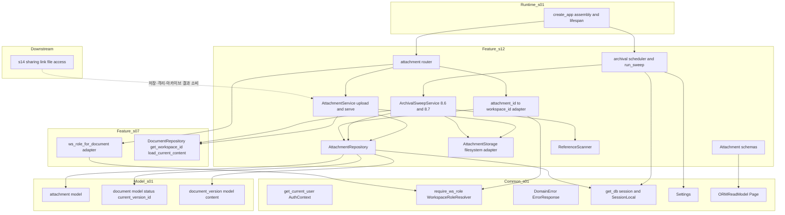
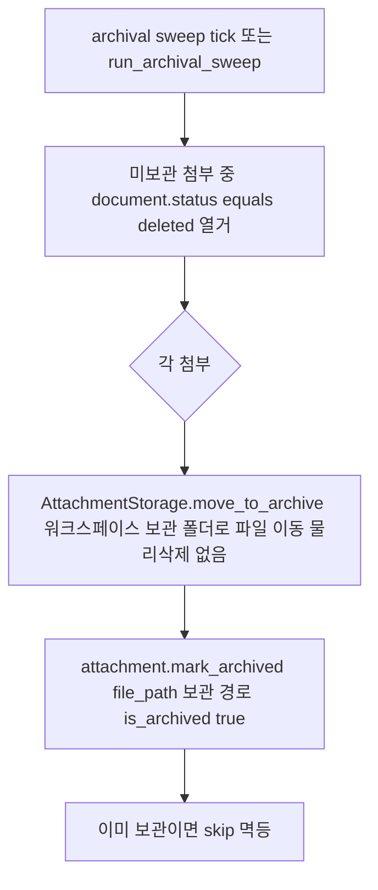
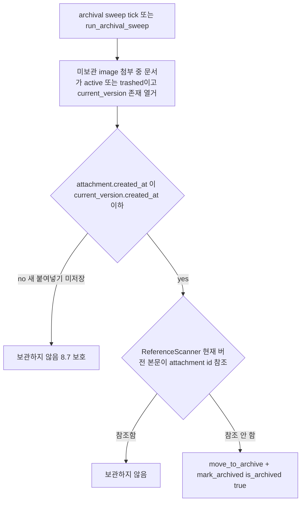

# Design Document — s12-attachment

## Overview

**Purpose**: Notion-lite의 **첨부·이미지 저장과 파일 생명주기**를 구현한다. 편집 중 붙여넣은 이미지와 editor
이상 사용자가 올린 파일을 base64 인라인이 아니라 **파일**로 저장하고(REQ-1·2), 워크스페이스 단위로 격리
보관하며(REQ-3), viewer 이상에게 워크스페이스 권한 게이트 하에 바이너리를 서빙한다. 무엇보다 두 개의 파일
생명주기 사건 — **문서 완전삭제(deleted 전이) 반응 보관 이동(8.6)** 과 **저장 참조 소멸 이미지 아카이브(8.7)** —
을 소유한다. 이 둘은 물리 삭제 없이(INV-4) 파일을 "삭제된 파일 보관 폴더"로 이동하고 `is_archived=true`로
표시하는 조작이며, 보관은 영구삭제로 간주되어 admin 포함 복원·조회가 불가하다(INV-7).

**Users**: editor 이상 사용자는 이미지 붙여넣기·파일 첨부로 첨부를 생성하고, viewer 이상 사용자는 첨부
바이너리를 열람한다. 두 생명주기 반응의 직접 소비자는 사람이 아니라 **하위 계층의 관측 가능한 결과**다: `s10`이
문서를 deleted로 전환하면 s12가 그 상태를 관측해 보관 이동(8.6)하고, `s09`가 새 버전을 저장하면 s12가 현재 버전
참조 변화를 관측해 참조 소멸 이미지를 아카이브(8.7)한다. `s14-sharing`가 s12의 저장·격리·아카이브 결과를 링크
경유 파일 접근(8.4·8.5)에 소비하고, `s13(L5)` 체크포인트가 보관 이동↔완전삭제·참조 소멸↔버전 저장을 누적 검증한다.

**Impact**: `s01`이 확정한 계약(`attachment` 스키마, 카탈로그 행 32~33, 에러 모델, Base Schemas, resolver,
`file_storage_root` Settings)과 `s05`가 실동작시킨 `require_ws_role`, `s07`이 소유한 문서→WS 어댑터·현재 버전
본문 로드, `s09`가 갱신하는 `current_version_id`, `s10`이 유발하는 deleted 전이 위에, 첨부 도메인(라우터·서비스·
저장 어댑터·조정 서비스·스케줄러·스키마·첨부→WS 어댑터)을 최초로 채운다. 새 DB 마이그레이션을 추가하지
않으며, 저장 루트 외 보관 폴더 루트·아카이브 배치 주기·업로드 크기 한도만 `s01` 단일 Settings에 additive 확장한다.

### Goals
- 이미지 붙여넣기·파일 첨부를 파일로 저장하고 문서·워크스페이스에 연결한 뒤 참조 URL을 반환한다(REQ-1·2).
- 파일 저장·조회를 워크스페이스 단위로 격리·게이팅하고, 보관되지 않은 첨부만 서빙한다(REQ-3).
- 문서 deleted 전이의 결과를 관측해 연결 첨부를 물리 삭제 없이 보관 폴더로 이동한다(REQ-4, 8.6, INV-4).
- 새 버전 저장으로 현재 버전이 참조하지 않게 된 이미지를 관측 기반으로 아카이브한다(REQ-5, 8.7).
- 보관 폴더를 WS 격리·비노출·영구(복원 불가)로 유지하고 단조 증가를 수용한다(REQ-6, 8.8~8.11, INV-7).
- `s01` 계약·`s05` resolver·하위 계층 관측 결과를 재사용하고 상태 전이·버전 생성을 재구현하지 않는다(REQ-7).

### Non-Goals
- 문서 상태 전이·완전삭제·묶음 규칙(`s07` 엔진·`s10`). s12는 deleted **결과를 관측**할 뿐 전이하지 않는다.
- 편집 잠금·저장 시 버전 생성·`current_version_id` 갱신(`s09`). s12는 현재 버전 참조 **결과를 관측**할 뿐이다.
- markdown 본문 렌더링(첨부 참조를 이미지로 표시)은 `s07` 렌더 규약. s12는 참조 URL 규약만 제공한다.
- 공유 링크 경유 파일 접근·차단(8.4·8.5, 카탈로그 행 37, `s14`). 프론트엔드 화면.

## Boundary Commitments

### This Spec Owns
- **첨부 생성 동작**(카탈로그 행 32, `POST /documents/{id}/attachments`, editor): 이미지 붙여넣기·파일 첨부를
  파일로 저장(base64 인라인 아님), `attachment` 레코드 생성(`workspace_id`·`document_id`·`file_path`·
  `original_name`·`kind`), 참조 URL 반환. WS 격리 저장(8.3).
- **첨부 조회 서빙**(행 33, `GET /attachments/{id}`, viewer): 보관되지 않은 첨부의 바이너리 스트리밍. 보관된
  첨부는 role 무관 404(8.10). WS 단위 게이팅.
- **파일 저장 어댑터**: 워크스페이스 격리 저장/보관 디렉터리 규약, 파일 저장·스트리밍·보관 위치로의 이동
  (물리 삭제 없음, INV-4).
- **완전삭제 반응 보관 이동(8.6)**: deleted 문서에 연결된 미보관 첨부를 보관 폴더로 이동·`is_archived=true`.
  deleted **상태를 관측**해 판정하며 전이는 소유하지 않는다. 멱등.
- **저장 참조 소멸 아카이브(8.7)**: 현재 버전 본문이 더 이상 참조하지 않는 이미지 첨부를 보관 폴더로 이동.
  현재 버전 참조를 관측해 판정하며 저장·버전 생성은 소유하지 않는다. 이미지 종류에 한정.
- **첨부 참조 URL 규약**: 이미지·파일을 문서 본문에서 가리키는 안정 참조(`/attachments/{id}`). 8.7 참조 소멸
  판정의 근거이자 `s07` 렌더가 소비하는 규약.
- **첨부 id → workspace_id 매핑 어댑터**: `/attachments/{id}` 경로용 `require_ws_role` 주입.
- **보관 배치**: `ArchivalSweepService`(순수 조정 로직) + 스케줄러 어댑터·엔트리포인트. 8.6·8.7을 관측 기반으로
  멱등 수행. WS 격리.
- **설정 additive 확장**: `attachment_archive_root`·`attachment_sweep_interval_seconds`·`attachment_max_bytes`
  (config.yml + 공용 Settings). 저장 루트 `file_storage_root`는 기존 재사용.

### Out of Boundary
- 문서 상태 전이·완전삭제·묶음 식별(INV-5·6·10·11·12)의 **정의·구현** — `s07` `DocumentStateEngine`·`s10`.
  s12는 deleted 상태를 관측만 한다.
- 편집 잠금·저장 트랜잭션·`document_version` 생성·`current_version_id` 갱신 — `s09`. s12는 관측만 한다.
- markdown → 안전 HTML 렌더(첨부 이미지 표시) — `s07` `MarkdownRenderer`. s12는 참조 URL만 제공.
- 공유 링크 발급/무효화·링크 경유 파일 접근(8.4·8.5, 행 37) — `s14`.
- `s01` 계약(카탈로그·에러 모델·Base Schemas·resolver 로직·세션 인증·DB 스키마·Settings 로더)의 **정의**,
  `s05` 워크스페이스·멤버십 동작.

### Allowed Dependencies
- **Upstream(계약·인프라)**: `s01-contract-foundation` — `attachment`/`document`/`document_version` 모델,
  `get_db`/`SessionLocal`, `WorkspaceRoleResolver`/`require_ws_role`/`Role`, `AuthContext`/`get_current_user`,
  `ErrorResponse`/`ErrorCode`/`DomainError`, `ORMReadModel`/`Page`, `Settings`/`get_settings`, 라우터 조립
  지점·lifespan.
- **Upstream(도메인)**: `s07-document-core` — 문서→WS 어댑터(`ws_role_for_document(minimum)`),
  `DocumentRepository.get_workspace_id`·`load_current_content`(현재 버전 본문 로드) 재사용.
- **간접 upstream**: `s11(L4)` 체크포인트 통과 이후 착수. `s05`가 채운 `workspace_member`로 resolver 실동작,
  `s09`가 `current_version_id`를 갱신, `s10`이 문서를 deleted로 전환한다 — s12는 이들의 **결과 상태**에 의존한다.
- **Shared infra**: FastAPI(라우팅·DI·multipart·StreamingResponse·lifespan), SQLAlchemy 2.0(sync) 세션,
  pydantic v2(스키마), APScheduler(주기 스윕, `s10`이 이미 도입한 의존성 재사용), 표준 라이브러리 파일 I/O.
- **제약**: 설정 접근은 `s01` 단일 `Settings` 경유(모듈별 설정 파일 금지). 첨부 물리 삭제 없음(INV-4) — 보관
  이동만. 의존 방향은 항상 아래층(Schemas → Storage/Repository → Service → Dependencies → Router/Scheduler →
  Bootstrap). `s14`를 import하지 않으며, `s07`·`s09`·`s10`의 상태 전이·버전 생성 로직을 재구현하지 않는다.
  `s01`·`s05`·`s07` 계약·로직 무변경. 새 DB 마이그레이션 없음.

### Revalidation Triggers
이 spec의 계약·경계가 다음과 같이 바뀌면 `s13(L5)` 이상 체크포인트 재검증이 필요하다.
- 첨부 엔드포인트(행 32~33)의 경로·메서드·요구 role·요청/응답 스키마(`AttachmentRead`·`AttachmentCreate`)
  이름/필드 변경.
- 첨부 참조 URL 규약(`/attachments/{id}`) 변경 — `s07` 렌더·8.7 참조 소멸 판정·`s14` 링크 접근에 직접 영향.
- 완전삭제 반응 보관 이동(8.6)의 판정 기준(무엇을 관측해 보관하는가: deleted 상태 ↔ 다른 신호) 변경.
- 참조 소멸 아카이브(8.7)의 판정 기준(현재 버전 참조 관측 방식·붙여넣기 보호 규칙) 변경.
- 보관 폴더 격리·비노출·영구성 규약(보관 첨부 서빙 차단·복원 불가) 변경.
- `file_storage_root`/`attachment_archive_root`/`attachment_sweep_interval_seconds`/`attachment_max_bytes`
  Settings 필드 규약 변경.
- `s07` 문서→WS 어댑터·현재 버전 본문 로드, `s09` `current_version_id` 의미, `s10` deleted 전이 규약 변경(이
  경우 해당 spec이 상위 트리거, s12도 재검증 대상).

## Architecture

### Architecture Pattern & Boundary Map

레이어드 아키텍처(steering `structure.md` 정렬). s12는 `s01` 횡단 common·모델, `s05` 실동작 resolver, `s07`
문서→WS 어댑터·현재 버전 로드를 소비하는 하나의 feature 모듈(`app/attachment/`)로 캡슐화된다. 핵심 설계는
**두 생명주기 반응(8.6·8.7)을 하위 계층에 대한 동기 콜백이 아니라 관측 기반 조정(reconciliation)으로 구현**하는
것이다: 하위 계층(s09/s10)은 상위 계층(s12)을 import하지 않으므로(의존 방향), s12는 문서 `status`와 현재 버전
참조라는 **관측 가능한 DB 상태**를 스캔하여 첨부 보관 이동을 판정한다. 조정 로직은 순수 서비스로, 주기 실행은
`s10`이 도입한 APScheduler 어댑터 패턴을 재사용한 얇은 스케줄러로 분리한다.



**Architecture Integration**:
- **Selected pattern**: feature 모듈 + 레이어드 + **관측 기반 조정**. 의존 방향은 좌(하위 s01/s05/s07)→우(s12)
  단방향. s12는 `s14`를 import하지 않고, `s09`/`s10`을 import하지 않으며 그들의 결과 상태만 관측한다.
- **Domain/feature boundaries**: 첨부 저장·서빙(`AttachmentService`), 파일 I/O(`AttachmentStorage`), 두 반응
  조정(`ArchivalSweepService`), 참조 판정(`ReferenceScanner`), 권한 게이트(첨부→WS 어댑터)만 s12 소유. 상태
  전이·버전 생성·묶음 규칙·렌더는 각각 s07/s09/s10 소유.
- **Existing patterns preserved**: `{Resource}Read` 규약, 단일 `Settings`, 라우터 조립 지점·lifespan 재사용,
  권한 검사 공통 레이어 단일 구현(resolver·문서→WS 어댑터 재구현 금지), 물리 삭제 없음(INV-4), 스윕/스케줄러
  분리(s10 패턴 재사용).
- **New components rationale**: `AttachmentService`(업로드·서빙)·`AttachmentStorage`(WS 격리 파일 I/O·보관
  이동)·`ArchivalSweepService`(8.6·8.7 조정)·`ReferenceScanner`(참조 소멸 판정)·`AttachmentRepository`·첨부→WS
  어댑터·스케줄러·라우터·스키마만 신규. 각 단일 책임.
- **Steering compliance**: 권한은 WS 단위 resolver 재사용(INV-1). 설정은 `s01` 단일 Settings additive 확장.
  상태/버전 규칙은 하위 계층 결과 관측으로만 소비(재구현 금지).

### Dependency Direction (강제)
```
Schemas → (AttachmentStorage · AttachmentRepository · ReferenceScanner) → (AttachmentService · ArchivalSweepService) → Dependencies(첨부→WS 어댑터 · s07 문서→WS 어댑터 재사용) → (Router · Scheduler) → Bootstrap(assembly + lifespan)
     (각 레이어는 왼쪽 레이어와 s01 common/model·s05 resolver·s07 어댑터/로드만 import. 위 방향 위반은 리뷰에서 오류로 취급)
```
`app/attachment/`는 `s14`를 import하지 않고 `s09`/`s10`을 import하지 않으며, `s01` `common`·`models`·
`schemas.base`, `s05`가 활성화한 `require_ws_role`, `s07` 문서→WS 어댑터·`DocumentRepository`(get_workspace_id·
load_current_content)만 소비한다. **두 반응(8.6·8.7)은 관측 기반이며 s12는 문서 status/현재 버전 참조를 읽어서
판정한다.**

### Technology Stack

| Layer | Choice / Version | Role in Feature | Notes |
|-------|------------------|-----------------|-------|
| Backend / Runtime | FastAPI(`s01` 버전), uvicorn | 라우팅·DI·multipart 업로드·StreamingResponse·lifespan | `s01` 조립 지점에 include_router, lifespan에 스케줄러 훅 |
| Auth / Perm | `s01` `require_ws_role`/`WorkspaceRoleResolver`/`get_current_user` + `s07` `ws_role_for_document` | 인증·WS 권한 판정 | s12는 첨부→WS 어댑터만 신설 |
| Data / ORM | SQLAlchemy `>=2.0,<2.1`(sync, `s01`) | attachment r/w, document status·current_version 조회, version content 조회 | `s01` `get_db`·`SessionLocal`·모델 재사용 |
| Storage | 표준 라이브러리 파일 I/O(`pathlib`·`shutil`·stream) | WS 격리 저장/보관 디렉터리, 저장·스트리밍·보관 이동 | 로컬 파일시스템, `file_storage_root`/`attachment_archive_root` 기준 |
| Scheduler | APScheduler `>=3.10`(BackgroundScheduler) | 주기 아카이브 스윕 | `s10`이 이미 도입한 의존성 재사용(신규 추가 없음), `<=0`이면 비활성 |
| Config | `s01` `Settings`(pydantic-settings) | `file_storage_root`(기존) + `attachment_archive_root`·`attachment_sweep_interval_seconds`·`attachment_max_bytes`(신규 additive) | 단일 접근자 경유 |
| Schemas | pydantic v2(`s01` Base Schemas) | 요청/응답 검증 | `{Resource}Read` 규약, 업로드는 multipart |

> 신규 외부 의존성 없음(APScheduler는 `s10`이 이미 `uv add`). 새 마이그레이션 없음. 저장·조정 설계 결정과
> 대안 비교는 `research.md` 참조.

## File Structure Plan

### Directory Structure
```
backend/app/
└── attachment/                   # s12 feature 모듈(신규)
    ├── __init__.py
    ├── router.py                 # 첨부 2개 엔드포인트(행 32~33), require_ws_role 게이트
    ├── service.py                # AttachmentService: upload(paste image·file), serve(binary, 보관 시 404)
    ├── archival.py               # ArchivalSweepService: 8.6 deleted 반응·8.7 참조 소멸 조정 + run_archival_sweep
    ├── scheduler.py              # APScheduler 어댑터: lifespan start/stop, 주기 실행 등록
    ├── storage.py                # AttachmentStorage: WS 격리 저장/보관 디렉터리·저장·스트리밍·보관 이동
    ├── reference.py              # ReferenceScanner: 현재 버전 본문이 첨부 id를 참조하는지 판정
    ├── repository.py             # AttachmentRepository: attachment r/w, document status·current_version·content 조회
    ├── schemas.py                # AttachmentCreate(multipart), AttachmentRead
    └── dependencies.py           # 첨부 id → workspace_id 어댑터(require_ws_role 주입용)
```

### Modified Files
- `backend/app/main.py` **또는** `backend/app/routers/__init__.py` — `s01` 라우터 조립 지점에
  `include_router(attachment.router)` 추가. `create_app()` lifespan에 아카이브 스케줄러 start/stop 훅 연결(REQ-7.4).
- `backend/config.yml` — `attachment_archive_root`·`attachment_sweep_interval_seconds`(기본 3600)·
  `attachment_max_bytes`(기본값) 추가.
- `backend/app/config.py`(`s01` `Settings`) — 위 3개 additive 필드 추가(기본값 존재, 비파괴적).

> 각 파일 단일 책임. `attachment/*`는 `s01` `common`·`models`·`schemas.base`, `s05` resolver, `s07` 문서→WS
> 어댑터·`DocumentRepository`만 import하고 `s14`·`s09`·`s10`을 import하지 않는다. **보관 이동(파일→보관 폴더 +
> is_archived)은 `AttachmentStorage.move_to_archive` + `AttachmentRepository.mark_archived` 한 곳에만 존재**하며
> 물리 삭제는 어디에도 없다(INV-4).

## System Flows

### 첨부 생성 — 이미지 붙여넣기 / 파일 첨부 (행 32, REQ-1·2·3)
```mermaid
flowchart TD
    A[POST documents id attachments multipart] --> G{require_ws_role EDITOR (문서→WS 어댑터)}
    G -- 문서 없음 --> E404[404 not_found]
    G -- role 미충족 --> E403[403 forbidden]
    G -- pass --> SZ{크기 한도 초과}
    SZ -- yes --> E422[422 unprocessable]
    SZ -- no --> WS[문서에서 workspace_id 확정 8.3]
    WS --> ST[AttachmentStorage.save 워크스페이스 격리 위치에 파일 저장]
    ST --> IN[attachment insert workspace_id·document_id·file_path·original_name·kind is_archived false]
    IN --> RD[AttachmentRead 반환 url equals attachments id]
```
- **판정 요지**: 소속 workspace_id는 클라이언트 입력이 아니라 대상 문서에서 확정한다(8.3·REQ-3.2). `kind`는
  image(붙여넣기)/file(첨부)로 기록하고 원본 파일명을 보존한다. 저장은 base64 인라인이 아닌 파일이며, 응답의
  `url`(`/attachments/{id}`)이 문서 본문에서의 안정 참조가 된다(8.1·8.7 판정 근거).

### 첨부 조회 서빙 — 보관 비노출 (행 33, REQ-3·6)
```mermaid
flowchart TD
    A[GET attachments id] --> L[attachment 로드]
    L -- 없음 --> E404a[404 not_found]
    L -- 있음 --> AR{is_archived true}
    AR -- yes --> E404b[404 not_found role 무관 8.10]
    AR -- no --> G{require_ws_role VIEWER (첨부 workspace_id)}
    G -- fail --> E403[403 forbidden]
    G -- pass --> S[AttachmentStorage.open_stream 파일 스트리밍]
    S --> R[binary 응답]
```
- **판정 요지**: 보관된 첨부는 요청자 role과 무관하게 404로 처리해 노출하지 않는다(8.9·8.10, INV-7). 이 차단은
  권한 판정보다 **먼저** 적용되어 admin에게도 보관 파일이 노출되지 않는다. 권한 게이트는 첨부 `workspace_id`로
  판정(WS 단위, INV-1).

### 완전삭제 반응 보관 이동 (8.6) — deleted 상태 관측

- **판정 요지**: s12는 deleted 전이를 수행하지 않고 `s10`/`s07`이 만든 `document.status='deleted'`라는 관측 가능한
  결과를 스캔해 판정한다(REQ-4.3). 이동은 물리 삭제 없이 파일을 보관 위치로 옮기고 `is_archived=true`로 표시하는
  것뿐이다(INV-4). 이미 보관된 첨부는 열거에서 제외되어 멱등하다(REQ-4.4).

### 저장 참조 소멸 아카이브 (8.7) — 현재 버전 참조 관측

- **판정 요지**: 이미지가 현재 버전에 참조되는지는 현재 버전 본문에서 `/attachments/{id}` 토큰 존재로 판정한다
  (REQ-5.2). **붙여넣었으나 아직 어떤 저장 버전에도 반영되지 않은 새 이미지**(created_at > 현재 버전 created_at)는
  참조 소멸로 간주하지 않아(REQ-5.3) 편집 중 붙여넣기 직후 오아카이브를 방지한다. 대상은 이미지 종류에 한정
  (REQ-5.6). 일반 파일 첨부의 보관 이동은 완전삭제 반응(8.6)으로만 처리한다.

## Requirements Traceability

| Requirement | Summary | Components | Interfaces / Contracts | Flows |
|-------------|---------|------------|------------------------|-------|
| 1.1–1.5 | 이미지 붙여넣기 파일 저장·문서 연결·참조 URL·404 | AttachmentService, AttachmentStorage, AttachmentRepository, AttachmentSchemas, AttachmentRouter, (s07 DocWsAdapter) | `upload_attachment`, `AttachmentCreate`, `AttachmentRead` | 첨부 생성 |
| 2.1–2.5 | 파일 첨부·kind·원본명·403·401·크기 한도 | AttachmentService, AttachmentStorage, AttachmentRouter | `upload_attachment` | 첨부 생성 |
| 3.1–3.6 | WS 격리 저장·문서 기준 WS 확정·서빙·viewer 게이트·404 | AttachmentStorage, AttachmentService, AttWsAdapter, AttachmentRouter | `serve_attachment`, `ws_role_for_attachment` | 조회 서빙 |
| 4.1–4.5 | deleted 반응 보관 이동·물리삭제 없음·관측 판정·멱등·묶음 범위 | ArchivalSweepService, AttachmentRepository, AttachmentStorage | `archive_for_deleted_documents` | 완전삭제 반응 |
| 5.1–5.6 | 참조 소멸 이미지 아카이브·현재버전 관측·붙여넣기 보호·이미지 한정 | ArchivalSweepService, ReferenceScanner, AttachmentRepository, (s07 load_current_content) | `archive_dereferenced_images`, `ReferenceScanner.is_referenced` | 참조 소멸 |
| 6.1–6.5 | 보관 폴더 WS 격리·보관 비노출·admin 무관·복원 없음·단조 증가 | AttachmentStorage, AttachmentService, ArchivalSweepService | `serve_attachment`(보관 404), `move_to_archive` | 조회 서빙, 두 반응 |
| 7.1–7.7 | 계약 재사용·에러·resolver·조립·마이그레이션 무추가·Settings·관측 의존 | 전 컴포넌트, Bootstrap wiring, Settings 확장 | s01/s05/s07 계약 재사용, `include_router`, lifespan | — |

## Components and Interfaces

| Component | Domain/Layer | Intent | Req Coverage | Key Dependencies (P0/P1) | Contracts |
|-----------|--------------|--------|--------------|--------------------------|-----------|
| AttachmentSchemas | Feature/Contract | 첨부 업로드·조회 스키마 | 1,2,7 | s01 BaseSchemas (P0) | State |
| AttachmentStorage | Feature/Data | WS 격리 저장/보관 디렉터리·저장·스트리밍·보관 이동 | 1,3,4,6 | s01 Settings (P0) | Service, State |
| AttachmentRepository | Feature/Data | attachment r/w·document status·current_version·content 조회 | 1,3,4,5 | s01 Db (P0), s01 AttModel·DocModel·VerModel (P0) | Service, State |
| ReferenceScanner | Feature/Service | 현재 버전 본문의 첨부 참조 여부 판정 | 5 | — | Service |
| AttWsAdapter | Feature/Dep | 첨부 id → workspace_id 추출(require_ws_role 주입) | 3,7 | s01 Resolver (P0), AttachmentRepository (P0) | Service |
| AttachmentService | Feature/Service | upload(paste image·file)·serve(binary, 보관 404) | 1,2,3,6 | AttachmentStorage (P0), AttachmentRepository (P0), s07 DocRepo (P0), s01 Errors (P1) | Service |
| ArchivalSweepService | Feature/Service | 8.6 deleted 반응·8.7 참조 소멸 조정(멱등) | 4,5 | AttachmentRepository (P0), AttachmentStorage (P0), ReferenceScanner (P0), s07 load_current_content (P0) | Service, Batch |
| ArchivalScheduler | Feature/Runtime | 주기 아카이브 스윕 어댑터·run_archival_sweep 엔트리포인트 | 4,5,7 | ArchivalSweepService (P0), s01 SessionLocal·Settings (P0), APScheduler (P0) | Batch |
| AttachmentRouter | Feature/API | 첨부 2개 엔드포인트(행 32~33) | 1,2,3,6,7 | s01 Resolver·s07 DocWsAdapter (P0), AttWsAdapter (P0), AttachmentService (P0) | API |
| Bootstrap wiring | Runtime | 라우터 조립 + lifespan 스케줄러 연결 | 7 | s01 create_app·lifespan (P0), AttachmentRouter·ArchivalScheduler (P0) | API, Batch |

### Feature / Contract

#### AttachmentSchemas
| Field | Detail |
|-------|--------|
| Intent | 첨부 업로드(multipart)·조회 응답 스키마(`{Resource}Read` 규약) |
| Requirements | 1.1, 1.4, 2.1, 2.2, 7.1 |

**Contracts**: State [x]
```python
class AttachmentKind(str, Enum):        # s01 attachment.kind ENUM 값과 동일
    IMAGE = "image"
    FILE = "file"

# 업로드는 multipart/form-data: file(UploadFile) + 선택 kind. 라우터에서 Form/File로 수신.
# kind 미지정 시 업로드 content-type으로 image/file 추론(붙여넣기=image 경로 포함).
class AttachmentCreate(BaseModel):
    kind: AttachmentKind | None = None   # 미지정 시 content-type 추론

class AttachmentRead(ORMReadModel):      # 첨부 메타데이터(바이너리 아님)
    id: int
    workspace_id: int
    document_id: int
    kind: AttachmentKind
    original_name: str
    is_archived: bool
    created_at: datetime
    url: str                             # = "/attachments/{id}" (문서 본문 참조 규약, 파생값)
```
- 규약: 업로드=multipart(`AttachmentCreate` + file), 응답=`AttachmentRead`(`ORMReadModel` 상속). `url`은 서버
  산정 파생값(`/attachments/{id}`)이며 8.7 참조 소멸 판정과 `s07` 렌더가 소비하는 규약. 바이너리 응답은 스키마가
  아니라 `StreamingResponse`.
- Boundary: 스키마 형태·참조 URL 규약만 소유. Base 규약(`ORMReadModel`)은 `s01`. `attachment` 스키마 정의는
  `s01`, 재정의하지 않는다.

### Feature / Data

#### AttachmentStorage
| Field | Detail |
|-------|--------|
| Intent | 워크스페이스 격리 저장/보관 디렉터리 규약과 파일 저장·스트리밍·보관 이동(물리 삭제 없음) |
| Requirements | 1.2, 3.1, 4.1, 4.2, 6.1, 6.5 |

**Responsibilities & Constraints**
- 저장 위치: `{file_storage_root}/{workspace_id}/...`, 보관 위치: `{attachment_archive_root}/{workspace_id}/...`
  로 워크스페이스 단위 격리(8.3·8.8). 경로 트래버설 방지를 위해 저장 파일명은 서버 생성(예: `uuid` + 확장자),
  원본명은 DB `original_name`에만 보존.
- `save`: 업로드 스트림을 워크스페이스 저장 디렉터리에 기록하고 저장 상대 경로 반환(디렉터리 자동 생성).
- `open_stream`: 저장 경로의 파일을 스트리밍용으로 연다(서빙).
- `move_to_archive`: 저장 파일을 워크스페이스 보관 디렉터리로 **이동**하고 새 보관 경로 반환. **물리 삭제 없음**
  (INV-4) — 이동만. 이미 보관 경로면 no-op(멱등).
- 보관 폴더는 자동 정리하지 않으며 단조 증가를 수용한다(8.11).

**Dependencies**
- Inbound: AttachmentService — 저장·스트리밍(P0); ArchivalSweepService — 보관 이동(P0)
- Outbound: s01 Settings — `file_storage_root`·`attachment_archive_root`(P0); 파일시스템(P0)

**Contracts**: Service [x] / State [x]
```python
class AttachmentStorage:
    def save(self, *, workspace_id: int, upload_filename: str,
             stream: BinaryIO) -> str: ...                 # 저장 상대 경로(file_path) 반환
    def open_stream(self, file_path: str) -> BinaryIO: ...  # 서빙용, 부재 시 도메인 예외
    def move_to_archive(self, *, workspace_id: int, file_path: str) -> str: ...  # 보관 경로 반환, 물리삭제 없음
```
- Invariants: 워크스페이스별 저장/보관 디렉터리 분리(격리). 파일 물리 삭제 없음(INV-4) — 보관 이동만.
- Boundary: 파일 I/O·경로 규약만 소유. is_archived 표시(DB)는 Repository, 무엇을 언제 이동할지는 서비스가 결정.

#### AttachmentRepository
| Field | Detail |
|-------|--------|
| Intent | attachment r/w와 조정에 필요한 document status·current_version·본문 조회의 단일 데이터 접근점 |
| Requirements | 1.3, 3.2, 4.1, 4.4, 4.5, 5.1, 5.5 |

**Responsibilities & Constraints**
- `s01` attachment·document·document_version 모델·`get_db`/`SessionLocal` 사용. 첨부 **물리 삭제 없음**(INV-4).
- `insert`: 첨부 레코드 생성(`workspace_id`·`document_id`·`file_path`·`original_name`·`kind`, is_archived=False).
- `get`: 첨부 단건 로드(서빙·게이트용).
- `mark_archived`: 첨부의 `file_path`를 보관 경로로 갱신하고 `is_archived=True`로 설정(상태 표시). 물리 삭제 없음.
- 조정 스코프 질의:
  - `list_unarchived_on_deleted_documents(db)`: `is_archived=false`이고 소속 `document.status='deleted'`인 첨부
    열거(8.6). 이미 보관된 첨부는 제외(멱등 스코프).
  - `list_unarchived_images_with_current_version(db)`: `is_archived=false`, `kind='image'`, 소속 문서가
    active/trashed이며 `current_version_id`가 존재하는 이미지 첨부와 그 문서의 현재 버전 메타(created_at)를 열거(8.7).
- 상태 전이·버전 생성은 하지 않는다(관측만). 현재 버전 본문 로드는 `s07` `DocumentRepository.load_current_content`
  재사용(중복 구현 회피).

**Dependencies**
- Inbound: AttachmentService — insert·get(P0); ArchivalSweepService — 스코프 질의·mark_archived(P0);
  AttWsAdapter — get(P0)
- Outbound: s01 Db — 세션(P0); s01 AttModel·DocModel·VerModel — 매핑(P0)

**Contracts**: Service [x] / State [x]
```python
class AttachmentRepository:
    def insert(self, db: Session, *, workspace_id: int, document_id: int,
               file_path: str, original_name: str, kind: str) -> Attachment: ...   # is_archived=False
    def get(self, db: Session, attachment_id: int) -> Attachment | None: ...
    def mark_archived(self, db: Session, att: Attachment, *, archived_path: str) -> Attachment: ...  # file_path·is_archived=True
    def list_unarchived_on_deleted_documents(self, db: Session) -> list[Attachment]: ...             # 8.6 스코프
    def list_unarchived_images_with_current_version(
        self, db: Session) -> list[tuple[Attachment, int, datetime]]: ...                            # (att, current_version_id, current_version_created_at), 8.7 스코프
```
- Invariants: 첨부 물리 삭제 없음(INV-4). 조정 스코프는 항상 `is_archived=false`만 대상으로 하여 멱등.
- Boundary: attachment 데이터 질의·쓰기와 관측용 문서/버전 조회만. 상태 전이·버전 생성은 하지 않는다.

### Feature / Service

#### ReferenceScanner
| Field | Detail |
|-------|--------|
| Intent | 현재 버전 본문이 특정 첨부를 참조하는지 판정(8.7 참조 소멸 근거) |
| Requirements | 5.1, 5.2 |

**Contracts**: Service [x]
```python
class ReferenceScanner:
    def is_referenced(self, content: str, attachment_id: int) -> bool: ...   # "/attachments/{id}" 토큰 존재 여부
```
- Responsibilities: 문서 본문(markdown)에 첨부 참조 URL 규약(`/attachments/{id}`)이 등장하는지 판정. 첨부 id
  경계(예: `/attachments/12`가 `/attachments/123`을 오탐하지 않도록 경계 구분)를 정확히 처리.
- Boundary: 순수 문자열 판정만 소유. 참조 URL 규약은 `AttachmentSchemas`(`url`)와 동일. 렌더는 `s07` 소관.

#### AttachmentService
| Field | Detail |
|-------|--------|
| Intent | 첨부 업로드(이미지 붙여넣기·파일 첨부)와 조회 서빙(보관 시 404) |
| Requirements | 1.1, 1.2, 1.3, 1.4, 1.5, 2.1, 2.2, 2.5, 3.2, 3.3, 6.2 |

**Responsibilities & Constraints**
- **upload**: 대상 문서 존재 확인(부재→404). 소속 `workspace_id`를 **문서에서 확정**(클라이언트 입력 아님, 8.3·
  REQ-3.2). 업로드 크기 한도(`attachment_max_bytes`) 초과 시 거부(422, REQ-2.5). `AttachmentStorage.save`로 WS
  격리 위치에 저장 → `AttachmentRepository.insert`(kind image/file, original_name 보존) → `AttachmentRead`
  (url=`/attachments/{id}`) 반환. 붙여넣기 이미지는 base64 인라인이 아닌 파일로 저장(kind=image, 8.1).
- **serve**: 첨부 로드(부재→404). `is_archived`이면 **role 무관 404**(8.10, 권한 판정 이전에 차단) →
  `AttachmentStorage.open_stream`으로 바이너리 스트리밍. 권한 게이트(첨부 workspace_id VIEWER)는 라우터에서 주입.
- 상태 전이·버전 생성·아카이브 판정은 소유하지 않는다(각각 s07/s09, 조정은 ArchivalSweepService).

**Dependencies**
- Inbound: AttachmentRouter — upload·serve(P0)
- Outbound: AttachmentStorage — 저장·스트리밍(P0); AttachmentRepository — insert·get(P0); s07 DocumentRepository
  — get_workspace_id(P0); s01 Errors — 404/422(P1)

**Contracts**: Service [x]
```python
class AttachmentService:
    def upload_attachment(self, db: Session, ctx: AuthContext, document_id: int,
                          *, kind: AttachmentKind | None, upload_filename: str,
                          stream: BinaryIO, size: int) -> AttachmentRead: ...      # 404 문서, 422 크기
    def serve_attachment(self, db: Session, attachment_id: int) -> AttachmentBinary: ...  # 404(부재/보관), stream+content-type
```
- Preconditions: upload는 라우터에서 `ws_role_for_document(EDITOR)` 통과, serve는 `ws_role_for_attachment(VIEWER)`
  통과(단, 보관 첨부는 그 이전 404). admin bypass는 resolver가 처리(보관 404는 role 무관).
- Postconditions: upload 후 저장 파일 존재·attachment 레코드 존재(is_archived=false)·url 반환. serve는 미보관
  첨부만 바이너리, 보관·부재는 404.
- Invariants: workspace_id는 문서에서 확정(8.3). 보관 첨부는 어떤 role로도 서빙되지 않는다(8.10, INV-7).

#### ArchivalSweepService
| Field | Detail |
|-------|--------|
| Intent | 완전삭제 반응 보관 이동(8.6)과 참조 소멸 이미지 아카이브(8.7)를 관측 기반으로 조정(멱등) |
| Requirements | 4.1, 4.2, 4.3, 4.4, 4.5, 5.1, 5.3, 5.4, 5.5, 5.6 |

**Responsibilities & Constraints**
- **archive_for_deleted_documents(db)** (8.6): `list_unarchived_on_deleted_documents`로 deleted 문서 연결 미보관
  첨부를 열거 → 각 첨부 `AttachmentStorage.move_to_archive`(WS 보관 폴더로 이동, 물리 삭제 없음) →
  `mark_archived`(is_archived=true, file_path 갱신). deleted 전이를 수행하지 않고 관측만 한다(REQ-4.3). 이미 보관된
  첨부는 스코프에서 제외되어 멱등(REQ-4.4). 대상 문서의 첨부에만 적용(REQ-4.5).
- **archive_dereferenced_images(db)** (8.7): `list_unarchived_images_with_current_version`로 미보관 image 첨부와
  그 문서 현재 버전(created_at)을 열거 → **붙여넣기 보호**: `attachment.created_at > current_version.created_at`이면
  아직 저장 반영 전 새 붙여넣기로 간주하고 skip(REQ-5.3) → 현재 버전 본문을 `s07` `load_current_content`로 로드하고
  `ReferenceScanner.is_referenced(content, attachment.id)`가 False면(현재 버전이 참조 안 함) → `move_to_archive` +
  `mark_archived`. 현재 버전이 참조하면 보관하지 않는다(REQ-5.5). image 종류에 한정(REQ-5.6).
- **sweep(db, now)**: 두 조정을 순서대로 수행하고 처리 건수를 반환. 개별 첨부 처리 예외를 격리해 전체 스윕이
  중단되지 않게 한다(로그 후 계속). `now`는 인자로 주입(테스트 결정성; 8.7 붙여넣기 보호는 저장 시각 비교라
  now에 직접 의존하지 않으나 배치 계약 일관성을 위해 유지).
- **상태 전이·버전 생성을 직접 쓰지 않는다.** 판정은 문서 status·현재 버전 참조 관측으로만, 전이는 없다(INV-4).

**Dependencies**
- Inbound: ArchivalScheduler — 주기 호출(P0); (테스트·수동) `run_archival_sweep` 엔트리포인트(P0)
- Outbound: AttachmentRepository — 스코프 질의·mark_archived(P0); AttachmentStorage — move_to_archive(P0);
  ReferenceScanner — 참조 판정(P0); s07 DocumentRepository — load_current_content(P0)

**Contracts**: Service [x] / Batch [x]
```python
class ArchivalSweepService:
    def archive_for_deleted_documents(self, db: Session) -> int: ...   # 8.6, 반환: 보관 이동 건수
    def archive_dereferenced_images(self, db: Session) -> int: ...     # 8.7, 반환: 보관 이동 건수
    def sweep(self, db: Session, now: datetime) -> int: ...            # 두 조정 합산 처리 건수
```
- Batch: Trigger=스케줄 주기(또는 수동 `run_archival_sweep`). Input=`now`. Output=대상 첨부 is_archived=true·파일
  보관 이동. Idempotency=스코프가 항상 `is_archived=false`만 대상이라 재적용 무해. Recovery=첨부 단위 예외 격리·
  다음 주기 재시도.
- Invariants: 물리 삭제 없음(INV-4). 8.6은 deleted 문서 첨부 전부, 8.7은 참조 소멸 image에 한정. 붙여넣기 보호로
  미저장 새 이미지 오아카이브 방지.

### Feature / Dependency

#### AttWsAdapter (첨부 id → workspace_id 추출)
| Field | Detail |
|-------|--------|
| Intent | `/attachments/{id}` 경로에서 첨부의 workspace_id를 추출해 `s01` `require_ws_role`에 주입 |
| Requirements | 3.3, 3.4, 3.5, 3.6, 7.3 |

**Contracts**: Service [x]
```python
# /documents/{id}/attachments (행 32): s07 ws_role_for_document(Role.EDITOR) 재사용(문서 id→WS)
# /attachments/{id} (행 33): 첨부 id → attachment.workspace_id 조회(미존재→404) 후 require_ws_role(VIEWER)
def ws_role_for_attachment(minimum: Role) -> Callable[..., AuthContext]:
    # attachment_id 경로 파라미터로 AttachmentRepository.get 조회(미존재→404),
    # attachment.workspace_id를 require_ws_role(minimum) 판정에 주입. resolver 위계·admin bypass는 재구현하지 않음.
    ...
```
- Responsibilities: 첨부 미존재→404, 존재 시 `attachment.workspace_id`로 `require_ws_role` 위임. 보관 첨부의 서빙
  차단(role 무관 404)은 어댑터가 아니라 서비스 단계에서 처리(권한 판정 이전 차단, 8.10).
- Boundary: 첨부→workspace_id 매핑 주입만 소유. 판정 로직은 `s01`, 실동작 데이터는 `s05`, 문서→WS는 `s07` 재사용.

### Feature / Runtime

#### ArchivalScheduler
| Field | Detail |
|-------|--------|
| Intent | 주기 아카이브 스윕 실행 어댑터(FastAPI lifespan)·독립 실행 엔트리포인트 |
| Requirements | 4.1, 5.1, 7.4, 7.6 |

**Responsibilities & Constraints**
- `start(app)`/`stop()`: `s01` `create_app()` lifespan에서 호출. `Settings.attachment_sweep_interval_seconds`가
  `>0`이면 APScheduler `BackgroundScheduler`에 interval job 등록·기동, `<=0`이면 기동하지 않는다(외부 cron 신호).
- `run_archival_sweep()`: `SessionLocal`로 자기 세션을 열고 `ArchivalSweepService.sweep(db, now=현재시각)` 호출 후
  commit/close. 스케줄 job 본체이자 테스트·수동/외부 cron 엔트리포인트(`uv run python -m app.attachment.archival`).
- 설정은 `s01` 단일 Settings 경유(모듈별 파일 금지, 7.6). 주기 job은 요청 스코프 세션을 쓰지 않고 자체 세션 관리.

**Dependencies**
- Inbound: Bootstrap lifespan — start/stop(P0)
- Outbound: ArchivalSweepService — 스윕(P0); s01 SessionLocal — 세션(P0); s01 Settings — 주기·활성 여부(P0);
  APScheduler — 주기 실행(P0)

**Contracts**: Batch [x]
```python
def run_archival_sweep() -> int: ...              # SessionLocal 세션으로 sweep 1회, 반환: 처리 건수
def start(app: FastAPI) -> None: ...              # interval>0이면 BackgroundScheduler 기동
def stop() -> None: ...                           # 스케줄러 shutdown
```
- Trigger: interval(초) 주기 또는 수동. Idempotency: 스윕 서비스 멱등성 상속. Recovery: 앱 재시작 시 미처리분은
  다음 주기에 처리. Boundary: 스케줄 실행·세션 수명만 소유. 판정·이동은 서비스·스토리지.

### Feature / API

#### AttachmentRouter
| Field | Detail |
|-------|--------|
| Intent | 첨부 2개 엔드포인트 노출(카탈로그 행 32~33) |
| Requirements | 1.1, 1.5, 2.1, 2.3, 2.4, 3.3, 3.4, 3.6, 6.2, 6.3, 7.2, 7.3, 7.4 |

**Contracts**: API [x]

##### API Contract
| Method | Endpoint | 요구 role | Request | Response | Errors |
|--------|----------|-----------|---------|----------|--------|
| POST | /documents/{id}/attachments | editor | (multipart) file + kind? | AttachmentRead | 401, 403, 404, 422 |
| GET | /attachments/{id} | viewer | — | (binary StreamingResponse) | 401, 403, 404 |

- 게이트: `POST /documents/{id}/attachments`는 `s07` 문서→WS 어댑터(`ws_role_for_document(EDITOR)`)로 문서
  id→workspace_id 주입(문서 미존재→404). `GET /attachments/{id}`는 `ws_role_for_attachment(VIEWER)`로 첨부
  workspace_id 주입(첨부 미존재→404). viewer 미만·비멤버→403(INV-2), 비인증→401. admin bypass는 resolver 처리.
  `s01` 카탈로그 행 32~33과 정합(REQ-7.3·7.4).
- `GET /attachments/{id}`는 **보관된 첨부를 role 무관 404**로 처리해 노출하지 않는다(8.10, 서비스가 권한 판정
  이전 차단). 성공 시 `StreamingResponse`(적절한 content-type). 응답 스키마는 바이너리이므로 카탈로그 "(binary)"와
  정합.
- Boundary: 라우터는 multipart 수신·게이트·서비스 위임·상태코드/스트리밍 매핑만. 로직은 서비스, 파일 I/O는
  스토리지, 판정은 `s01` resolver(`s05` 데이터), 문서→WS는 `s07` 어댑터.

### Runtime / Bootstrap wiring
| Field | Detail |
|-------|--------|
| Intent | `s01` 라우터 조립 지점에 첨부 라우터 연결 + lifespan에 아카이브 스케줄러 훅 |
| Requirements | 7.4 |

- `s01` `create_app()`의 feature 라우터 조립 지점에 `include_router(attachment.router)`를 추가하고, lifespan
  startup/shutdown에 `ArchivalScheduler.start(app)`/`stop()`을 연결한다. 조립·lifespan 방식은 `s01`·`s05`·`s07`·
  `s10`을 따른다.
- Boundary: 조립 연결·lifespan 훅만 소유. 부트스트랩·미들웨어·에러 핸들러 등록은 `s01`.

## Data Models

### Domain Model
- 이 spec은 **새 엔티티·컬럼·마이그레이션을 추가하지 않는다.** `s01` 소유 `attachment`(`workspace_id`·
  `document_id`·`file_path`·`original_name`·`kind`·`is_archived`) 스키마를 그대로 사용하고, 조정 판정을 위해
  `document`(status·current_version_id)와 `document_version`(content·created_at)을 **읽기만** 한다.
- 집계: **Attachment**(파일 참조·보관 상태의 보유자). 파생 관측 대상: 소속 `document.status`(8.6 판정),
  소속 문서 현재 버전 본문(8.7 판정). 첨부 파일 자체는 파일시스템에 저장되고 DB는 참조(`file_path`)만 보유.
- 불변식: INV-4(첨부 물리 삭제 없음 — 보관 이동만), INV-6(WS 격리 — attachment.workspace_id = document의 WS,
  저장/보관 디렉터리도 WS 분리), INV-7(보관=복원 불가·비노출·admin 무관). INV-1·2·3은 resolver·어댑터 재사용으로 강제.

### Physical Data Model
- 대상 테이블(모두 `s01` 소유, 변경·추가 없음):
  - `attachment`: `id, workspace_id FK, document_id FK, file_path VARCHAR(1024), original_name, kind
    ENUM(image/file), is_archived BOOLEAN, created_at`. 인덱스 `(workspace_id, is_archived)`가 조정 스코프 질의를,
    `(document_id)`가 문서별 첨부 조회를 지원한다.
  - `document`: `status ENUM(active/trashed/deleted)`·`current_version_id FK NULL`·`workspace_id`(읽기만).
  - `document_version`: `id, content MEDIUMTEXT, created_at`(읽기만; 현재 버전 참조 판정용).
- 파일시스템: `{file_storage_root}/{workspace_id}/...`(저장), `{attachment_archive_root}/{workspace_id}/...`(보관).
  보관 이동은 파일 rename/move(물리 삭제 없음, INV-4). 보관 폴더 단조 증가 수용(8.11).
- 설정: `config.yml` + 공용 `Settings`에 `attachment_archive_root`(str)·`attachment_sweep_interval_seconds`
  (int, 기본 3600)·`attachment_max_bytes`(int, 기본값) additive 추가. 저장 루트는 기존 `file_storage_root` 재사용.
  **새 DB 마이그레이션 없음.**

### Data Contracts & Integration
- **API 데이터 전송**: 업로드는 multipart/form-data(file + kind?), 조회는 바이너리 `StreamingResponse`. 메타데이터
  응답은 `s01` Base Schemas 규약(`AttachmentRead`, JSON).
- **에러 직렬화**: 전 엔드포인트 `s01` `ErrorResponse` 단일 형태.
- **관측 소비 계약**: s12는 `s10`/`s07`의 `document.status='deleted'`(8.6)와 `s09`가 갱신하는
  `document.current_version_id`→`document_version.content`(8.7)를 안정 관측 계약으로 소비한다. 이 상태·참조 규약
  변경은 해당 spec이 상위 트리거, s12도 `s13` 재검증 대상. **하위 계층은 s12를 알지 못한다(의존 방향 준수).**
- **하위 소비 계약**: `s14-sharing`는 s12의 저장·격리(파일 위치)·아카이브(is_archived) 결과와 참조 URL 규약을
  링크 경유 파일 접근(8.4·8.5)에 소비한다. 보관 첨부는 어떤 경로로도 노출되지 않는다.

## Error Handling

### Error Strategy
- 단일 변환 지점: 서비스·어댑터·스토리지는 `s01` `DomainError`를 raise하고 `s01` 전역 핸들러가 `ErrorResponse`로
  변환. 조정 스윕은 첨부 단위 예외를 격리(로그 후 계속)해 배치 전체 실패를 방지한다.
- 보관 첨부 서빙은 권한 판정 **이전**에 404로 차단해 존재·권한을 노출하지 않는다(8.10).

### Error Categories and Responses
| HTTP | ErrorCode | 발생 조건(s12) |
|------|-----------|----------------|
| 401 | unauthenticated | 세션 없음·무효(`s01` `get_current_user`) |
| 403 | forbidden | 업로드 editor 미충족·조회 viewer 미충족·비멤버(`require_ws_role`), admin 아님 — INV-1·2 |
| 404 | not_found | 대상 문서 부재(업로드), 첨부 부재(조회), **보관된 첨부 조회(role 무관, 8.10)** |
| 422 | validation_error / unprocessable | multipart 형식 오류, 업로드 크기 한도 초과 |

> 보관 첨부 조회는 존재하더라도 404로 처리한다(비노출·복원 불가, INV-7). 별도 410/403을 두지 않아 존재 여부를
> 드러내지 않는다.

## Testing Strategy

### Unit Tests
- **업로드 저장·WS 확정(서비스)**: 이미지 붙여넣기가 base64 인라인이 아닌 파일로 저장되고 kind=image·원본명이
  기록되며, 소속 workspace_id가 클라이언트 입력이 아닌 대상 문서에서 확정되고, 응답 url이 `/attachments/{id}`이며,
  존재하지 않는 문서→404, 크기 한도 초과→422가 됨(1.1·1.2·1.3·1.4·2.1·2.2·2.5·3.2). — `upload_attachment`
- **서빙·보관 비노출(서비스)**: 미보관 첨부는 바이너리를 반환하고, 보관된 첨부는 요청자 role과 무관하게(admin
  포함) 404, 존재하지 않는 첨부→404가 됨(3.3·6.2·6.3). — `serve_attachment`
- **완전삭제 반응 보관 이동(서비스)**: deleted 문서에 연결된 미보관 첨부가 보관 폴더로 이동되고 is_archived=true가
  되며 파일이 물리 삭제되지 않고(보관 위치에 존재), 이미 보관된 첨부는 다시 이동하지 않고(멱등) 다른 문서 첨부는
  불변임(4.1·4.2·4.4·4.5). — `archive_for_deleted_documents`
- **참조 소멸 아카이브·붙여넣기 보호(서비스/스캐너)**: 현재 버전 본문이 참조하지 않는 image가 보관되고, 현재
  버전이 참조하는 image는 보관되지 않으며, current_version보다 나중에 생성된(미저장 붙여넣기) image는 보관되지
  않고, 일반 파일 첨부는 참조 소멸 아카이브 대상이 아님(5.1·5.2·5.3·5.5·5.6). — `archive_dereferenced_images`,
  `ReferenceScanner.is_referenced`(경계 오탐 `/attachments/12` vs `/attachments/123` 포함)
- **첨부→WS 어댑터**: 존재하는 첨부 id로 workspace_id를 추출해 `require_ws_role` 판정에 위임하고, 미존재 첨부
  id→404, viewer 미충족→403·admin→통과(3.4·3.6·7.3). — `ws_role_for_attachment`
- **WS 격리 저장/보관 디렉터리(스토리지)**: 저장·보관 경로가 워크스페이스별로 분리되고, `move_to_archive`가 파일을
  저장 위치에서 보관 위치로 이동(물리 삭제 없음)하며 이미 보관 경로면 멱등임(3.1·6.1·4.2). — `AttachmentStorage`

### Integration Tests
- **첨부 업로드·서빙 왕복(핵심)**: 마이그레이션된 DB + 부팅 앱에서 editor가 `POST /documents/{id}/attachments`로
  이미지·파일을 업로드→응답 url(`/attachments/{id}`)로 `GET /attachments/{id}`가 바이너리를 반환→저장 파일이
  워크스페이스 격리 위치에 존재함을 검증(1·2·3). viewer는 조회 통과·업로드 403, 비멤버 403, 비인증 401,
  admin bypass(INV-1·2·3).
- **완전삭제 반응 보관 이동(8.6, 핵심 seam)**: 문서에 첨부를 올린 뒤 `s07`/`s10` 경로로 문서를 완전삭제(deleted)
  →아카이브 스윕(`run_archival_sweep` 또는 서비스 직접 호출) 실행 후 그 첨부가 보관 폴더로 이동·is_archived=true가
  되고 `GET /attachments/{id}`가 admin 포함 404가 되며, 파일이 물리 삭제되지 않고 보관 위치에 존재함을 검증(4·6,
  INV-4·7). 반복 실행이 멱등함 확인.
- **참조 소멸 아카이브(8.7, 핵심 seam)**: 문서에 이미지를 붙여넣어(url 참조를 본문에 포함) `s09` 경로로 저장
  →이후 그 이미지 참조를 제거한 본문으로 다시 저장(새 현재 버전)→아카이브 스윕 실행 후 그 이미지가 보관되고,
  여전히 참조되는 이미지는 보관되지 않으며, 저장 직후 붙여넣었으나 아직 저장되지 않은 이미지는 보관되지 않음을
  검증(5, 붙여넣기 보호).
- **라우터 조립·스케줄러 lifespan·마이그레이션 무추가**: 부팅 후 카탈로그 행 32~33 경로가 앱 라우트에 노출되고
  (7.4), `attachment_sweep_interval_seconds>0`이면 스케줄러가 기동·`<=0`이면 미기동되며, 새 DB 마이그레이션이
  추가되지 않고 Settings 확장이 additive임을 확인(7.5·7.6).

### Contract / Boundary Tests
- 응답이 `AttachmentRead`·`s01` `ErrorResponse` 규약을 따르고 바이너리 서빙이 `StreamingResponse`임(7.1·7.2).
- s12가 상태 전이·버전 생성을 직접 구현하지 않고 문서 status·현재 버전 참조 관측으로만 보관 이동을 판정함을
  코드/호출 검증으로 확인(7.7) — s12 코드에 status/trashed_at/current_version_id 갱신·버전 insert가 없어야 한다.
- s12가 새 마이그레이션을 추가하지 않고 `s01` attachment·document·document_version 스키마만 사용하며 Settings
  확장이 additive임을 확인(7.5·7.6).

## Security Considerations
- 권한은 WS 단위만(INV-1). 첨부·문서별 개별 권한 없음. 판정은 `s01` resolver 단일 구현 재사용, 문서→WS는 `s07`
  어댑터, 첨부→WS는 s12 어댑터(attachment.workspace_id), 실동작 데이터는 `s05`.
- 업로드는 editor 이상(INV-2), 조회는 viewer 이상. admin은 권한 판정 bypass(INV-3) — 단, **보관 첨부는 admin
  포함 role 무관 404**(8.9·8.10, INV-7). 보관은 복원 경로 없음(INV-7).
- WS 격리: attachment.workspace_id는 대상 문서에서 확정(클라이언트 위조 방지). 저장·보관 디렉터리도 WS별 분리
  (교차 노출 방지, INV-6). 저장 파일명은 서버 생성(경로 트래버설 방지), 원본명은 DB에만 보존.
- 물리 삭제 없음(INV-4): 완전삭제·참조 소멸 모두 보관 폴더로 **이동**만 하고 파일을 삭제하지 않는다. 보관 폴더는
  단조 증가를 수용한다(8.11, 자동 정리 없음 — steering 범위 밖).

## Supporting References
- 계약 단일 소스(attachment·document·document_version 스키마·카탈로그 행 32~33·에러 모델·Base Schemas·
  resolver·`file_storage_root` Settings·INV-4·6·7): `.kiro/specs/s01-contract-foundation/design.md`.
- 문서→WS 어댑터(`ws_role_for_document`)·현재 버전 본문 로드(`load_current_content`)·문서 status: `.kiro/specs/
  s07-document-core/design.md`.
- 저장=새 버전 생성·`current_version_id` 갱신(8.7 관측 근거): `.kiro/specs/s09-lock-version/design.md`.
- 완전삭제·자동 영구삭제 deleted 전이(8.6 관측 근거)·스윕/스케줄러 분리 패턴: `.kiro/specs/s10-trash/design.md`.
- 설계 결정(관측 기반 조정·붙여넣기 보호·참조 URL 규약·보관 비노출·Settings additive)·대안 비교·위험: `research.md`.
- 상위 근거: `docs/projects.md` §2.6 attachment, §3 REQ-8, §4.4 보관 이동, §5 INV-4·6·7.
