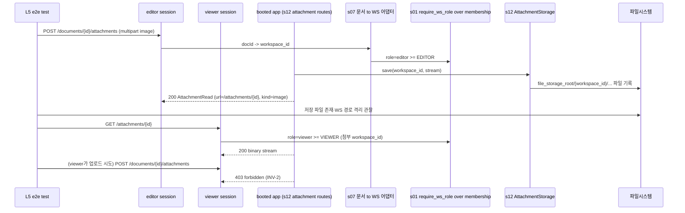
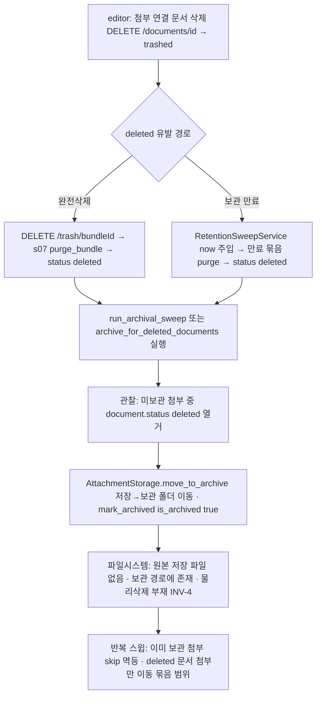
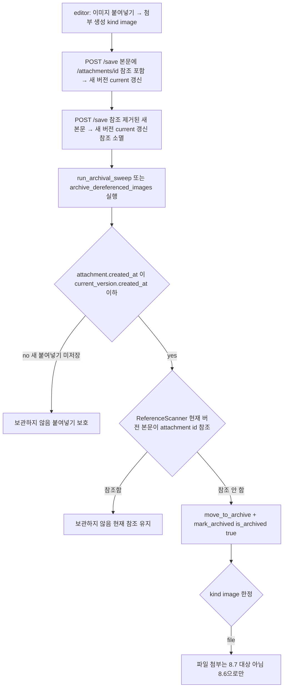
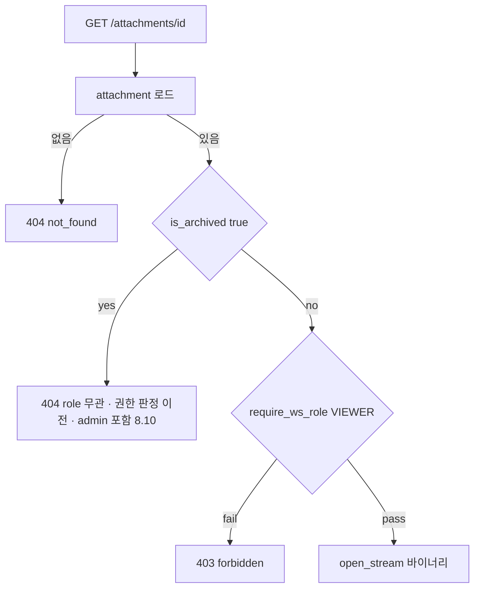
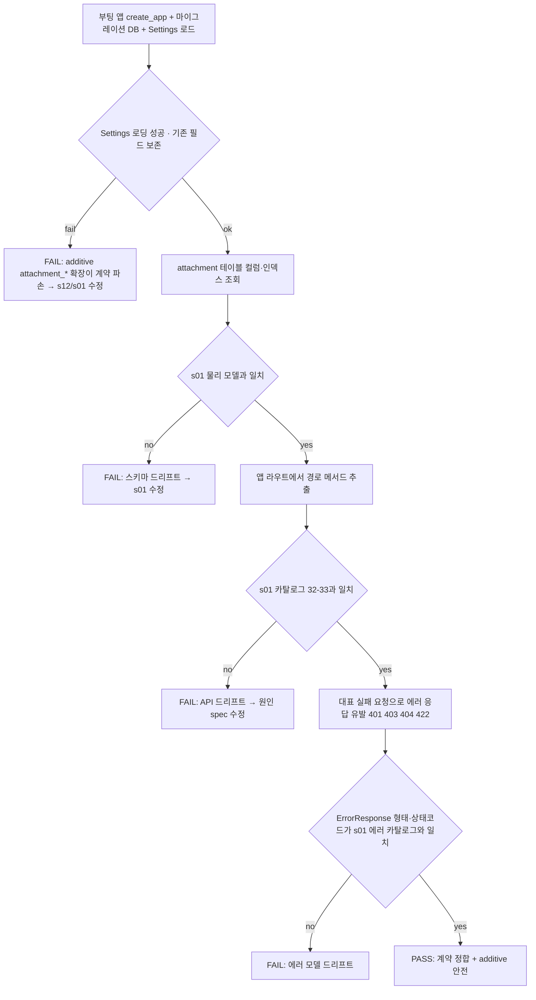

# Design Document — s13-integration-check-L5

## Overview

**Purpose**: `s13-integration-check-L5`는 **L5 누적 통합 검증 체크포인트**다. 이 시점까지 완성된 upstream 누적 집합
(`s01-contract-foundation` ⊕ `s02-auth` ⊕ `s03-admin-account` ⊕ `s05-workspace` ⊕ `s07-document-core` ⊕
`s09-lock-version` ⊕ `s10-trash` ⊕ `s12-attachment`)이 `s01` 단일 계약 소스와 정합하는지, 그리고 이번 계층에서 처음
결합되는 경계(**첨부·이미지 파일 생명주기 ↔ 문서 완전삭제(휴지통) ↔ 저장·버전 ↔ 아래 계층 권한·계정·워크스페이스
격리**)가 실제 결합 상태에서 성립하는지 mock 없이 검증한다. 산출물은 **integration/e2e 테스트 자산과 게이트 판정
기록**뿐이며, feature 로직·엔드포인트·스키마·마이그레이션·상태 엔진·조정 서비스·스케줄러를 신규 구현하지 않는다.

검증 초점은 두 개의 계층 간 트리거다. (1) **보관 이동↔완전삭제(8.6, L4↔L5)**: `s10`이 완전삭제(`purge_bundle`)나
보관 만료 스윕으로 문서를 `deleted`로 전이시키면 `s12` `ArchivalSweepService`가 그 관측 가능한 결과를 스캔해 연결된
미보관 첨부를 워크스페이스 보관 폴더로 **이동**(`is_archived=true`)하되 물리 삭제는 없다(INV-4). (2) **참조 소멸↔버전
저장(8.7, L4↔L5)**: `s09`가 새 버전을 저장해 현재 버전 본문이 이미지 참조를 잃으면 `s12`가 현재 버전 참조를 관측해
그 이미지를 보관 이동하되, 아직 어떤 저장 버전에도 반영되지 않은 새 붙여넣기(`attachment.created_at >
current_version.created_at`)는 오아카이브하지 않는 **붙여넣기 보호**를 지킨다. 여기에 격리·비노출 축으로, 첨부 저장·
보관 폴더의 WS 격리(8.3·8.8)와 **보관된 첨부의 role 무관 404**(권한 판정 이전 차단, admin 포함, 8.9·8.10, INV-7)를
관찰한다. 조정 항목으로 `s12`가 `s01` `Settings`에 additive로 추가한 `attachment_archive_root`·
`attachment_sweep_interval_seconds`·`attachment_max_bytes`와 아카이브 스케줄러 lifespan 결합이 `s01` Settings 로딩·앱
부팅을 회귀시키지 않는지 실제 부팅으로 확인한다.

**Users**: 로드맵 게이트 관리자가 이 체크포인트의 통과 여부로 **게이트(G-1 규칙)**를 판정한다 — 통과해야 L6
(`s14-sharing`) impl 착수가 가능하다. upstream 구현자는 이 체크포인트를 첨부 생명주기·계층 간 트리거·격리 회귀의 조기
경보로 사용한다.

**Impact**: 현재 `backend/`에는 s01 공용 인프라 + s02~s10 도메인 + s12 `app/attachment/`(라우터·`AttachmentService`·
`AttachmentStorage`·`ArchivalSweepService`·`ReferenceScanner`·`ArchivalScheduler`·첨부→WS 어댑터·Settings additive
확장) 구현이 존재하고, `s11-integration-check-L4`의 `backend/tests/integration_L4/` 하네스(그리고 그것이 재사용하는
`integration_L3`/`L2`/`L1`)가 존재한다(가정). 이 체크포인트는 그 위에 `backend/tests/integration_L5/` 테스트 스위트만
추가하며, **L4 하네스를 재사용·확장**하고 어떤 애플리케이션 코드도 수정하지 않는다.

### Goals

- 실제 결합(마이그레이션된 DB + 부팅 앱(s12 첨부 라우터·아카이브 스케줄러 포함) + 실제 세션 + 실제 멤버십 데이터 +
  실제 파일시스템 저장/보관 폴더 + 실제 `ArchivalSweepService` + 실제 `RetentionSweepService`)에서 계약 대조:
  `attachment` 스키마·첨부 API(행 32~33)·`AttachmentRead`/`AttachmentCreate`·참조 URL 규약·에러 모델·Base Schemas가
  `s01` 단일 소스와 일치.
- **Settings additive 조정 항목** 검증: `attachment_archive_root`·`attachment_sweep_interval_seconds`·
  `attachment_max_bytes` 추가가 `s01` `Settings` 계약 로딩을 깨지 않고 기존 필드 보존·단일 접근자 유지·아카이브
  스케줄러 결합 부팅 회귀 부재.
- 첨부 생성·서빙·격리 흐름 e2e: 이미지 붙여넣기 파일 저장(8.1)·파일 첨부(8.2)·WS 격리 저장(8.3)·viewer 서빙 게이트·
  editor 업로드 게이트(INV-2)·미존재 404.
- **보관 이동↔완전삭제(8.6)**: 완전삭제/보관 만료 → deleted 관측 → 연결 첨부 보관 이동(`is_archived=true`)·물리 삭제
  부재(INV-4)·멱등·묶음 범위. 실제 스윕 실행으로 파일시스템·DB 부수효과 관찰.
- **참조 소멸↔버전 저장(8.7)**: 저장으로 참조 소멸된 이미지 보관 이동·붙여넣기 보호(`created_at` 경계)·현재 참조 유지
  시 미보관·이미지 한정. 실제 스윕 실행으로 관찰.
- 보관 폴더 격리·비노출·영구성: role 무관 404(admin 포함, 권한 판정 이전)·복원 경로 부재(INV-7)·보관 폴더 WS 격리·
  단조 증가 수용.
- 아래 계층 결합: role별 접근 경계·admin override(INV-1·2·3)·WS 격리(다른 WS 첨부 비노출, INV-6)·삭제 사용자 결합·
  물리 삭제 부재(INV-4).
- 게이트(G-1 규칙, L5→L6) 통과/미통과 판정과 재검증 트리거 대상(s01·s02·s03·s05·s07·s09·s10·s12)을 명확히 산출.

### Non-Goals

- 새로운 feature 동작·엔드포인트·서비스·스키마·마이그레이션·상태 엔진·조정 서비스·스케줄러 구현(s01~s10·s12 소유,
  완료 가정).
- 개별 spec 단위 검증의 재실행(각 spec 자체 테스트 소유). 체크포인트는 결합·경계만 본다.
- 발견된 계약 위반의 수정(원인 spec에서 수정 후 재실행).
- **후속 계층(L6)**: 공유 링크 경유 파일 접근·차단(8.4·8.5, 카탈로그 행 37, `s14`), 공유 링크 무효화·재발급(INV-8).
  L5는 첨부의 저장·격리·보관 이동 결과가 성립하는 범위까지만 관찰한다.

## Boundary Commitments

### This Spec Owns

- **L5 통합 테스트 스위트**(`backend/tests/integration_L5/`): mock을 쓰지 않는 실제 결합 환경 위에서 첨부 계약 대조·
  Settings additive 조정 항목·첨부 생성/서빙/격리 흐름·보관 이동↔완전삭제(8.6)·참조 소멸↔버전 저장(8.7)·보관 폴더
  격리/비노출/role 무관 404·아래 계층 결합 엣지케이스를 검증하는 스위트.
- **L5 하네스 확장**: `s11` `integration_L4` 하네스(및 그것이 재사용하는 `integration_L3`/`L2`/`L1`: 마이그레이션·앱
  부팅·admin 시드·세션 유지 클라이언트·워크스페이스/멤버/role 세션·문서 트리·엔진 세션·두 editor 세션·휴지통 삭제·
  `now` 주입 retention 스윕 호출 픽스처)를 **재사용**하고, multipart 첨부 업로드 헬퍼, 첨부 바이너리 조회 헬퍼, 이미지
  참조 본문 저장 시나리오 헬퍼, `now` 주입 `ArchivalSweepService`/`run_archival_sweep` 호출 픽스처, 저장/보관 파일
  존재를 관찰하는 파일시스템 헬퍼만 신규 추가.
- **게이트 판정·재검증 트리거 기록**: 스위트 전체 통과를 게이트(G-1 규칙, L5→L6) 통과 조건으로 집계하고 재검증
  대상(s01/s02/s03/s05/s07/s09/s10/s12)을 명시.

### Out of Boundary

- 애플리케이션 코드 일체(`app/common/*`, `app/auth/*`, `app/admin_account/*`, `app/workspace/*`, `app/document/*`,
  `app/lock_version/*`, `app/trash/*`, `app/attachment/*`, `app/models/*`, `config.yml`, 마이그레이션). 체크포인트는
  이들을 **소비·관찰만** 하고 수정하지 않는다.
- `s11`의 `integration_L4` 스위트·하네스, `s08` `integration_L3`·`s06` `integration_L2`·`s04` `integration_L1` 자산의
  **정의 변경**. L5는 이를 **재사용**만 하고 하위 하네스를 수정하지 않는다.
- 첨부 업로드·서빙 동작 정의, `AttachmentStorage`·`ArchivalSweepService`(8.6·8.7)·`ReferenceScanner`·스케줄러·
  Settings 확장 동작 정의(s12), 문서 상태 전이·완전삭제·묶음 엔진(s07·s10), 저장·버전 생성(s09), 워크스페이스·멤버십
  (s05), 로그인·계정 관리(s02·s03)의 동작 정의. 검증 대상이지 구현 대상 아님.
- 계약 문서(카탈로그·불변식·에러 카탈로그·resolver 계약·Settings 스키마·물리 모델) 자체의 **정의·완전성**(s01 소유).
- 검증 실패의 코드 수정 — 원인 upstream spec에서 처리.
- 공유(s14)의 검증·링크 경유 파일 접근(8.4·8.5, 행 37) — 후속 체크포인트(s15/L6).

### Allowed Dependencies

- **Upstream(검증 대상, 실제 구현 결합)**: `s01`·`s02`·`s03`·`s05`·`s07`·`s09`·`s10`·`s12`의 실제 구현.
- **재사용 대상(하네스)**: `s11-integration-check-L4`의 `tests/integration_L4/conftest.py`·`helpers.py`(및 그것이
  재사용하는 `integration_L3`/`L2`/`L1`): 마이그레이션·부팅·admin 시드·세션 클라이언트·워크스페이스/멤버/role 세션·
  문서 트리·엔진 세션·두 editor 세션·잠금/저장/휴지통 헬퍼·`now` 주입 retention 스윕 호출.
- **대조 기준(single source of truth)**: `s01-contract-foundation/design.md`(§Physical Data Model: `attachment`
  (`workspace_id`·`document_id`·`file_path`·`original_name`·`kind ENUM('image','file')`·`is_archived`·인덱스) ·
  §API Endpoint Catalog 32~33 · §Errors 에러 코드 카탈로그 · §Settings 스키마(`file_storage_root`) · §Invariants
  Catalog INV-1·2·3·4·6·7 · §Common/Permissions `Role`·`require_ws_role`·admin bypass · §Base Schemas
  `ORMReadModel`·`Page`).
- **Shared infra(테스트 실행)**: FastAPI `TestClient`(Starlette, 쿠키 자 유지·multipart 업로드), SQLAlchemy 2.0(sync)
  세션·`information_schema` 조회, `s12` `ArchivalSweepService`·`run_archival_sweep`(스윕 직접 호출, `now` 주입),
  `s10` `RetentionSweepService`(보관 만료 유발), `s07` `DocumentStateEngine`(deleted 유발 경로), 표준 라이브러리 파일
  I/O(저장/보관 파일 존재 관찰), Alembic 마이그레이션, pytest, MySQL 8, APScheduler(부팅 결합 관찰).
  모든 backend 명령은 `backend/`에서 `uv run`.
- **제약**: mock·stub·가짜 구현 금지(실제 결합만; 조정 서비스·스윕·엔진 직접 호출은 실제 s12·s10·s07 코드 실행이므로
  허용). 설정 접근은 `s01` 단일 `Settings` 경유. 애플리케이션 코드·`config.yml` 무수정. 대조 기준은 개별 spec design이
  아니라 `s01` 단일 소스. L4 하네스는 재사용하되 중복 신설하지 않는다. 첨부 물리 삭제 없음(INV-4) — 보관 이동만 관찰.

### Revalidation Triggers

이 체크포인트는 다음 변경 시 **누적 집합 기준으로 재실행**한다(roadmap §재검증 트리거). `s12`(L5) 수정 시 이 체크포인트
및 로드맵상 그 이후 모든 체크포인트(L6)를, `s09`·`s10`·`s07`·`s05`·`s03`·`s02`(하위 계층) 수정 시 해당 계층 이후 모든
체크포인트를, `s01`(계약) 수정 시 **모든** 체크포인트를 재실행한다.

- `s01` 계약 변경: `attachment` 스키마(컬럼·인덱스·`kind` ENUM·`is_archived`), 카탈로그 행 32~33 경로·메서드·요구
  role·요청/응답 스키마 이름(`AttachmentCreate`·`AttachmentRead`), 권한 resolver(`Role` 위계·`require_ws_role`·admin
  bypass), 세션 인증 의존성, 공통 에러 카탈로그, `Settings` 스키마(특히 `file_storage_root` 및 additive 확장 계약),
  불변식 카탈로그(INV-1·2·3·4·6·7).
- `s12` 변경: 첨부 엔드포인트(행 32~33) 계약, 첨부 참조 URL 규약(`/attachments/{id}`), 완전삭제 반응 보관 이동(8.6)
  판정 기준(deleted 관측), 참조 소멸 아카이브(8.7) 판정 기준(현재 버전 참조·붙여넣기 보호), 보관 폴더 격리·비노출·
  영구성 규약(보관 첨부 서빙 차단·복원 불가·role 무관 404), `attachment_archive_root`·
  `attachment_sweep_interval_seconds`·`attachment_max_bytes` Settings 필드 규약, 아카이브 스케줄러 결합.
- `s09` 변경: 저장 = 새 `document_version` 생성·`current_version_id` 갱신 계약(8.7 참조 관측 근거).
- `s10` 변경: 완전삭제·보관 만료의 deleted 전이 규약(8.6 관측 근거), retention 스윕 계약.
- `s07` 변경: 문서→WS 어댑터·`DocumentRepository.load_current_content`/`get_workspace_id`, 상태 엔진 primitive.
- `s02`·`s03`·`s05` 변경: 로그인/세션 게이트, 계정 상태 전이·보존, 워크스페이스/멤버십 role 판정 데이터.
- 재실행 시에도 mock 없이 실제 구현을 결합한 상태로 검증한다.

## Architecture

### Architecture Pattern & Boundary Map

체크포인트는 애플리케이션 아키텍처를 확장하지 않는다. `tests/integration_L5/` 하나의 테스트 계층이 부팅된 실제
애플리케이션(s12 첨부 라우터·아카이브 스케줄러 포함)과 실제 DB(실제 attachment·document·document_version·membership
데이터 포함)와 실제 파일시스템(저장/보관 폴더)과 실제 `ArchivalSweepService`·`RetentionSweepService`·
`DocumentStateEngine`을 **관찰·호출**하여 s01 단일 소스와 대조한다. 하네스는 L4의 하네스를 재사용·확장한다.

```mermaid
graph TB
    subgraph Checkpoint_s13[tests integration_L5 - 이 spec 소유]
        Harness[L5 하네스 - L4 하네스 재사용 + 첨부 업로드/서빙/아카이브 스윕/파일시스템 관찰 픽스처]
        ContractSuite[누적 계약 대조 + Settings additive 스위트]
        LifecycleSuite[첨부 생성 서빙 격리 흐름 스위트 8.1 8.2 8.3]
        PurgeSuite[보관 이동 완전삭제 결합 스위트 8.6]
        SaveSuite[참조 소멸 버전 저장 결합 스위트 8.7]
        IsolationSuite[보관 격리 비노출 role무관404 스위트 INV-7]
        EdgeSuite[아래 계층 결합 엣지 스위트 INV-1 2 3 4 6]
        Gate[게이트 판정 및 재검증 기록]
    end
    subgraph Reused[tests integration_L4 L3 L2 L1 - 재사용, 무수정]
        L4Harness[L4 하네스 두 editor 잠금 휴지통 now주입 retention스윕]
        LowerHarness[L3 L2 L1 하네스 마이그레이션 부팅 admin시드 세션 워크스페이스 멤버 문서트리 엔진]
    end
    subgraph Under_Test[검증 대상 - 실제 구현 결합, 무수정]
        App[부팅된 FastAPI 앱 create_app - s12 첨부 라우터 아카이브 스케줄러 조립]
        AttRoutes[s12 attachment routes 32-33]
        AttSvc[s12 AttachmentService upload serve]
        Storage[s12 AttachmentStorage save move_to_archive open_stream]
        ArchiveSvc[s12 ArchivalSweepService 8.6 8.7 run_archival_sweep]
        RefScan[s12 ReferenceScanner]
        TrashRoutes[s10 trash purge routes]
        RetSweep[s10 RetentionSweepService]
        Engine[s07 DocumentStateEngine + DocumentRepository load_current_content]
        Resolver[s01 require_ws_role over real membership]
        Settings[s01 Settings with additive attachment_* fields]
        FS[(파일시스템 file_storage_root · attachment_archive_root)]
        DB[(마이그레이션된 MySQL 8 attachment document document_version workspace_member user)]
    end
    subgraph Baseline[대조 기준 - s01 단일 소스]
        Schema[Physical Model attachment]
        Catalog[API Catalog 32-33]
        ErrModel[Errors 코드 카탈로그]
        SettingsContract[Settings 스키마 file_storage_root]
        INV[Invariants INV-1 2 3 4 6 7]
        PermContract[Common Permissions Role require_ws_role bypass]
        BaseSch[Base Schemas ORMReadModel Page]
    end
    Harness --> L4Harness
    L4Harness --> LowerHarness
    Harness --> App
    Harness --> ArchiveSvc
    Harness --> RetSweep
    Harness --> FS
    Harness --> DB
    ContractSuite --> App
    ContractSuite --> Settings
    ContractSuite --> DB
    ContractSuite -.대조.-> Schema
    ContractSuite -.대조.-> Catalog
    ContractSuite -.대조.-> ErrModel
    ContractSuite -.대조.-> SettingsContract
    ContractSuite -.대조.-> BaseSch
    LifecycleSuite --> AttRoutes
    LifecycleSuite --> Storage
    LifecycleSuite --> Resolver
    LifecycleSuite --> FS
    LifecycleSuite -.대조.-> PermContract
    LifecycleSuite -.대조.-> INV
    PurgeSuite --> TrashRoutes
    PurgeSuite --> RetSweep
    PurgeSuite --> ArchiveSvc
    PurgeSuite --> FS
    PurgeSuite -.대조.-> INV
    SaveSuite --> ArchiveSvc
    SaveSuite --> RefScan
    SaveSuite --> Engine
    SaveSuite --> FS
    SaveSuite -.대조.-> INV
    IsolationSuite --> AttSvc
    IsolationSuite --> ArchiveSvc
    IsolationSuite --> FS
    IsolationSuite -.대조.-> INV
    EdgeSuite --> AttRoutes
    EdgeSuite --> Resolver
    EdgeSuite --> DB
    EdgeSuite -.대조.-> PermContract
    Gate --> ContractSuite
    Gate --> LifecycleSuite
    Gate --> PurgeSuite
    Gate --> SaveSuite
    Gate --> IsolationSuite
    Gate --> EdgeSuite
```



**Architecture Integration**:
- **Selected pattern**: 테스트 전용 검증 계층(외부 관찰자 + 조정 서비스/스윕/엔진 재사용 소비자). 실제 결합 e2e로 첨부
  생명주기·계층 간 트리거(8.6·8.7)·격리/비노출 회귀를 조기 포착.
- **Domain/feature boundaries**: 체크포인트는 어떤 도메인 코드도 소유하지 않는다. `tests/integration_L5/`만 소유하고
  `tests/integration_L4/`(및 그 하위) 하네스를 재사용한다.
- **Existing patterns preserved**: uv 실행 표준, 단일 `Settings`, 부팅 앱(`create_app`)·마이그레이션 재사용, mock
  금지, 물리 삭제 없음(INV-4) 관찰, `s11` 하네스 패턴 확장, 상태/bundle 규칙 단일 구현(s07 엔진)·권한 판정 단일 구현
  (s01 resolver)·조정 단일 구현(s12) 소비.
- **New components rationale**: 신규는 L5 스위트와 첨부 업로드/서빙/아카이브 스윕/파일시스템 관찰 헬퍼뿐. 각 스위트는
  단일 검증 관심사(계약+Settings/첨부흐름/완전삭제결합/저장결합/격리비노출/아래계층엣지).
- **Steering compliance**: 대조 기준을 s01 단일 소스로 고정(드리프트 방지). 권한 판정은 s01 resolver 단일 구현을 실제
  데이터로 관찰, 상태/bundle 규칙은 s07 엔진, 조정은 s12 단일 구현을 소비(structure.md 단일화 원칙). 설정은 단일
  Settings additive 확장을 관찰(모듈별 파일 부재 확인). mock 금지로 실제 결합 검증.

### Dependency Direction (강제)
```
s01 단일 소스(대조 기준)  ←대조←  Contract/Lifecycle/Purge/Save/Isolation/Edge 스위트  ←관찰·호출←  부팅 앱 + s12 조정 서비스/스토리지 + s10 스윕 + s07 엔진 + 파일시스템 + 마이그레이션 DB
                                                    ↑
                          L5 하네스(conftest) = L4 하네스 재사용 + 첨부 업로드/서빙/아카이브 스윕/파일시스템 관찰 픽스처
```
테스트 계층은 애플리케이션을 **관찰·호출**만 하고 역방향으로 코드를 수정하지 않는다. L5 하네스는 `s01` `create_app`·
마이그레이션·`Settings`·`s12` `ArchivalSweepService`/`run_archival_sweep`·`s10` `RetentionSweepService`·`s07`
`DocumentStateEngine`과 `s11` L4 하네스(및 하위 하네스)를 재사용한다.

### Technology Stack

체크포인트는 신규 런타임/라이브러리를 도입하지 않는다(테스트 도구 + s12 조정 서비스·스토리지, s10 스윕, s07 엔진 소비만
사용).

| Layer | Choice / Version | Role in Feature | Notes |
|-------|------------------|-----------------|-------|
| Test Runner | pytest(`s01` 스택) | 통합/e2e 테스트 실행 | `backend/`에서 `uv run pytest tests/integration_L5` |
| App Under Test | FastAPI `create_app`(s01) | 실제 결합된 부팅 앱 | s02·s03·s05·s07·s09·s10·**s12 첨부 라우터·아카이브 스케줄러**가 조립된 상태 |
| HTTP Client | Starlette `TestClient` | role별 독립 세션 쿠키 유지 e2e + multipart 업로드 | owner/editor/viewer/비멤버/admin + 다른 WS 사용자 클라이언트 분리 |
| Archival Sweep | `s12` `ArchivalSweepService`·`run_archival_sweep`(실제 구현) | 8.6·8.7 조정 직접 호출(`now` 주입) | 관측 기반 조정·멱등·붙여넣기 보호 검증(mock 아님) |
| Reference Scan | `s12` `ReferenceScanner`(실제 구현) | 현재 버전 참조 판정 관찰 | 8.7 참조 소멸 근거(간접) |
| Retention Sweep | `s10` `RetentionSweepService`(실제 구현) | 보관 만료로 deleted 유발(`now` 주입) | 8.6의 두 번째 deleted 유발 경로 |
| State Engine | `s07` `DocumentStateEngine` + `DocumentRepository.load_current_content`(실제 구현) | deleted 유발(purge)·현재 버전 본문 로드 관찰 | 라우터 밖 재사용 경계 관찰(mock 아님) |
| Storage | 표준 라이브러리 파일 I/O(`pathlib`) | 저장/보관 파일 존재·경로 격리 관찰 | `file_storage_root`/`attachment_archive_root` 기준 |
| Config | `s01` `Settings`(pydantic-settings, additive `attachment_*`) | Settings 로딩·기존 필드 보존 관찰 | 단일 접근자 경유, 모듈별 파일 부재 확인 |
| Data / ORM | SQLAlchemy 2.0(sync, s01) | attachment·document·document_version·`information_schema` 조회 | 스키마 대조·`is_archived` 관찰 |
| Migration | Alembic(s01) | 검증용 스키마 준비 | `uv run alembic upgrade head`; s12 새 마이그레이션 부재 확인 |
| DB | MySQL 8 | 실제 결합 저장소(실제 첨부/문서/버전/멤버십 데이터) | mock 금지 — 실 DB 필수 |
| Scheduler | `s12` `ArchivalScheduler` + APScheduler(부팅 결합) | lifespan 기동/미기동 관찰 | `attachment_sweep_interval_seconds` `>0`/`<=0` 분기 관찰 |
| Reused Harness | `s11` `tests/integration_L4`(+`L3`/`L2`/`L1`) | 마이그레이션·부팅·admin 시드·세션·워크스페이스/멤버·문서 트리·엔진·두 editor·휴지통·retention 스윕 | 재사용·확장(중복 신설 금지) |

> 신규 외부 의존성 없음. 스택 근거는 `s01` design·research 및 `s12`/`s11` design 참조.

## File Structure Plan

### Directory Structure
```
backend/tests/integration_L5/                     # s13 체크포인트 소유(신규, 테스트 전용)
├── __init__.py
├── conftest.py                                    # L5 하네스: L4 하네스(마이그레이션·부팅·admin 시드·세션 클라이언트·
│                                                  #   워크스페이스/멤버/role 세션·문서 트리·엔진 세션·두 editor·휴지통·
│                                                  #   now 주입 retention 스윕) 재사용 + 첨부 업로드/서빙 시나리오·
│                                                  #   아카이브 스윕 접근(now 주입)·파일시스템 관찰 픽스처
├── helpers.py                                     # 첨부 업로드(multipart)·조회·이미지 참조 본문 저장·
│                                                  #   run_archival_sweep/ArchivalSweepService 호출·저장/보관 파일 관찰
│                                                  #   래퍼 (L4 잠금/저장/휴지통/retention 헬퍼 재사용)
├── test_cumulative_contract_conformance.py        # attachment 스키마·API(32~33)·AttachmentRead/Create·에러·Base·Settings additive (REQ-2)
├── test_attachment_lifecycle_flow.py              # 이미지 붙여넣기 8.1·파일 첨부 8.2·WS 격리 8.3·서빙·업로드/서빙 게이팅 (REQ-3)
├── test_purge_archive_combination.py              # 완전삭제/보관만료 → deleted 관측 → 보관 이동·물리삭제 부재·멱등·묶음 범위 (REQ-4, 8.6)
├── test_save_dereference_combination.py           # 저장 참조 소멸 → 이미지 보관 이동·붙여넣기 보호·현재참조 유지 미보관·이미지 한정 (REQ-5, 8.7)
├── test_archive_isolation.py                      # 보관 role무관 404(admin 포함·권한 이전)·복원 없음·보관 WS 격리·단조증가 (REQ-6, INV-7)
└── test_combination_layer_edge.py                 # role별 접근 경계·admin override·WS 격리·삭제 사용자·물리삭제 부재 (REQ-7, INV-1·2·3·4·6)
```

### Modified Files
- 없음. 체크포인트는 애플리케이션 코드와 `s11`/`s08`/`s06`/`s04` 하네스 자산, `config.yml`을 수정하지 않는다.
  (`conftest.py`가 필요로 하는 테스트 설정은 `s01` `Settings`/`config.yml`의 기존 값(additive `attachment_archive_root`·
  `attachment_sweep_interval_seconds`·`attachment_max_bytes` 포함)과 L4/L3/L2/L1 하네스를 재사용하며 별도 설정 파일을
  신설하지 않는다.)

> `tests/integration_L5/*`은 `s01`~`s12`의 공개 표면(부팅 앱·첨부 라우트·`AttachmentStorage`·`ArchivalSweepService`·
> `run_archival_sweep`·`ReferenceScanner`·`s10` `RetentionSweepService`·`s07` 엔진·`Settings`·DB·파일시스템)과 `s11`
> L4 하네스만 소비하고, 대조 기준으로 `s01` design의 계약 요소를 참조한다. 게이트 판정 결과는 테스트 실행 결과(전부
> 통과 = 게이트 통과)로 산출된다.

## System Flows

### 첨부 생성 → 서빙 → WS 격리 (REQ-3, 8.1·8.2·8.3)

- **게이트 조건**: 업로드는 `require_ws_role(EDITOR)`(문서→WS), 서빙은 `require_ws_role(VIEWER)`(첨부→WS). 이미지는
  base64 인라인이 아닌 파일로 저장되고 WS별 경로에 격리(8.3, INV-6). viewer 업로드 403(INV-2). 실패 시 s12 저장·게이트
  또는 s01/s05/s07 결합 회귀를 가리킨다.

### 보관 이동 ↔ 완전삭제 (REQ-4, 8.6) — deleted 관측 후 실제 스윕

- **게이트 조건**: 완전삭제·보관 만료 두 경로 모두 `document.status='deleted'`로 수렴하고, s12 스윕이 그 관측 결과를
  스캔해 연결 첨부를 보관 이동한다(전이는 s10/s07, 관측·조정은 s12). 이동은 물리 삭제 없이(INV-4) 파일을 보관 위치로
  옮기고 `is_archived=true`. 반복 실행 멱등, deleted 문서 첨부에만 적용. 실패 시 8.6 계층 간 트리거(s12↔s10/s07) 결합
  회귀를 가리킨다.

### 참조 소멸 ↔ 버전 저장 (REQ-5, 8.7) — 현재 버전 참조 관측 후 실제 스윕

- **게이트 조건**: 이미지가 현재 버전에 참조되는지는 현재 버전 본문의 `/attachments/{id}` 토큰 존재로 판정
  (`ReferenceScanner`). 아직 저장 버전에 반영 안 된 새 붙여넣기(`created_at` 경계)는 참조 소멸로 간주하지 않음(붙여넣기
  보호). 현재 참조 유지 이미지는 미보관. 이미지 한정. 실패 시 8.7 계층 간 트리거(s12↔s09) 결합 회귀를 가리킨다.

### 보관 비노출 — role 무관 404, 권한 판정 이전 차단 (REQ-6, 8.9·8.10)

- **게이트 조건**: 보관 첨부는 요청자 role과 무관하게 404, 이 차단이 `require_ws_role` 게이트에 도달하기 전에 성립
  (admin도 404). 복원 경로 부재(INV-7). 보관 폴더는 WS 격리·단조 증가. 실패 시 보관 비노출·영구성 규약(s12) 회귀를
  가리킨다.

### 계약 대조 · Settings additive 조정 항목 판정


## Requirements Traceability

| Requirement | Summary | Components | Interfaces / Contracts | Flows |
|-------------|---------|------------|------------------------|-------|
| 1.1–1.6 | mock 없는 실제 결합·s01 단일 소스·feature 미구현·L4 하네스 확장·위반은 원인 spec 수정·스윕 실제 실행 | L5TestHarness, 전 스위트 | 실 DB·파일시스템·부팅 앱·세션 클라이언트·조정 서비스·스윕·L4 하네스 재사용 | 전 흐름 공통 |
| 2.1 | attachment 스키마 s01 일치·마이그레이션 무추가 | CumulativeContractConformanceSuite | `information_schema`/ORM ↔ s01 physical model | 계약 대조 |
| 2.2 | 카탈로그 32~33 API 노출 정합 | CumulativeContractConformanceSuite | 앱 라우트 ↔ s01 카탈로그 32~33 | 계약 대조 |
| 2.3 | 에러 응답 형태·상태코드 정합 | CumulativeContractConformanceSuite | `ErrorResponse` ↔ s01 에러 카탈로그 | 계약 대조 |
| 2.4 | AttachmentRead Base 규약·참조 URL·바이너리 응답 | CumulativeContractConformanceSuite | `AttachmentRead`/`AttachmentCreate` ↔ s01 Base·참조 URL | 계약 대조 |
| 2.5 | Settings additive `attachment_*` 로딩 안전·기존 필드 보존·단일 접근자 | CumulativeContractConformanceSuite | `Settings`/`get_settings` ↔ s01 스키마 | Settings 조정 |
| 2.6 | 아카이브 스케줄러 결합 부팅 회귀 부재·`>0`/`<=0` 분기 | CumulativeContractConformanceSuite | `create_app` lifespan ↔ `ArchivalScheduler` | Settings 조정 |
| 3.1 | 이미지 붙여넣기 파일 저장·kind image·참조 URL | AttachmentLifecycleFlowSuite, Helpers | `POST /documents/{id}/attachments` | 첨부 생성 |
| 3.2 | 파일 첨부·kind file·원본명·문서 연결 | AttachmentLifecycleFlowSuite | `POST /documents/{id}/attachments` | 첨부 생성 |
| 3.3 | WS 확정(문서 기준)·WS 격리 저장 파일시스템 관찰 | AttachmentLifecycleFlowSuite, FS 헬퍼 | `AttachmentStorage.save` 경로 | 첨부 생성 |
| 3.4 | viewer 서빙·미보관 바이너리 스트리밍 | AttachmentLifecycleFlowSuite | `GET /attachments/{id}` | 첨부 서빙 |
| 3.5 | 업로드 editor 게이트·서빙 viewer 게이트·비멤버/미인증/404·admin bypass | AttachmentLifecycleFlowSuite | `require_ws_role`·문서→WS·첨부→WS 어댑터 | 첨부 생성/서빙 |
| 4.1 | 완전삭제 → deleted → 보관 이동 is_archived | PurgeArchiveCombinationSuite | `archive_for_deleted_documents`/`run_archival_sweep` | 보관 이동↔완전삭제 |
| 4.2 | 보관 만료 → deleted → 보관 이동 | PurgeArchiveCombinationSuite | `RetentionSweepService` + 아카이브 스윕 | 보관 이동↔완전삭제 |
| 4.3 | 물리 삭제 부재·이동만 파일시스템 관찰 | PurgeArchiveCombinationSuite, FS 헬퍼 | `move_to_archive` | 보관 이동↔완전삭제 |
| 4.4 | deleted 관측 판정·s12 상태 전이 미수행 | PurgeArchiveCombinationSuite | `document.status` 관측 | 보관 이동↔완전삭제 |
| 4.5 | 멱등·묶음 범위(deleted 문서 첨부만) | PurgeArchiveCombinationSuite | 반복 `run_archival_sweep` | 보관 이동↔완전삭제 |
| 5.1 | 저장 참조 소멸 이미지 보관 이동 | SaveDereferenceCombinationSuite | `archive_dereferenced_images` | 참조 소멸↔저장 |
| 5.2 | 현재 버전 참조 토큰 판정·현재 참조 유지 미보관 | SaveDereferenceCombinationSuite | `ReferenceScanner.is_referenced` | 참조 소멸↔저장 |
| 5.3 | 붙여넣기 보호(created_at 경계) | SaveDereferenceCombinationSuite | `created_at` 비교 | 참조 소멸↔저장 |
| 5.4 | 현재 버전 참조 관측 판정·s12 저장/버전 생성 미수행 | SaveDereferenceCombinationSuite | `load_current_content` 관측 | 참조 소멸↔저장 |
| 5.5 | 이미지 한정·파일 첨부 미대상 | SaveDereferenceCombinationSuite | `kind` 필터 | 참조 소멸↔저장 |
| 6.1 | 보관 role 무관 404 | ArchiveIsolationSuite | `GET /attachments/{id}`(보관 404) | 보관 비노출 |
| 6.2 | admin 404·권한 판정 이전 차단 | ArchiveIsolationSuite | 서비스 보관 차단 순서 | 보관 비노출 |
| 6.3 | 보관 폴더 WS 격리 파일시스템 관찰 | ArchiveIsolationSuite, FS 헬퍼 | `attachment_archive_root/{workspace_id}` | 보관 비노출 |
| 6.4 | 복원 경로 부재·보관 후 조회 불가 | ArchiveIsolationSuite | 라우트 부재 관찰 | 보관 비노출 |
| 6.5 | 단조 증가 수용·자동 정리 부재 | ArchiveIsolationSuite, FS 헬퍼 | 반복 스윕 후 보관 파일 존속 | 보관 비노출 |
| 7.1 | role별 접근 경계·admin override | CombinationLayerEdgeSuite | `require_ws_role` over membership | 첨부 생성/서빙 |
| 7.2 | WS 격리(다른 WS 첨부 403) | CombinationLayerEdgeSuite | 첨부→WS 어댑터 | 첨부 서빙 |
| 7.3 | 삭제 사용자 결합·레코드 보존·로그인 게이트 | CombinationLayerEdgeSuite | `is_deleted` DB 관찰·s02 로그인 게이트 | — |
| 7.4 | 물리 삭제 부재(INV-4) | CombinationLayerEdgeSuite, FS 헬퍼 | attachment DB 관찰 | — |
| 8.1–8.4 | 게이트 판정·재검증 트리거·환경 미충족 실패 | GateVerdict | 전 스위트 결과 집계 | — |

## Components and Interfaces

| Component | Domain/Layer | Intent | Req Coverage | Key Dependencies (P0/P1) | Contracts |
|-----------|--------------|--------|--------------|--------------------------|-----------|
| L5TestHarness | Test/Fixture | 실 결합 환경(L4 하네스 재사용 + 첨부 업로드/서빙/아카이브 스윕/파일시스템 관찰) | 1,2,3,4,5,6,7 | s11 L4 하네스 (P0), s01 create_app (P0), s12 ArchivalSweepService (P0), s10 RetentionSweepService (P0), s07 Engine (P0), Alembic (P0), MySQL (P0), 파일시스템 (P0) | State |
| Helpers | Test/Support | 첨부 업로드·조회·이미지 참조 저장·아카이브 스윕·파일 관찰 래퍼(L4 헬퍼 재사용) | 3,4,5,6,7 | L5TestHarness (P0), s11 L4 helpers (P0) | Service |
| CumulativeContractConformanceSuite | Test/Contract | attachment 스키마·API(32~33)·AttachmentRead/Create·에러·Base·Settings additive 대조 | 2 | L5TestHarness (P0), s01 단일 소스 (P0) | Batch |
| AttachmentLifecycleFlowSuite | Test/E2E | 이미지 붙여넣기·파일 첨부·WS 격리·서빙·게이팅 | 3 | L5TestHarness (P0), Helpers (P0) | Batch |
| PurgeArchiveCombinationSuite | Test/E2E+Batch | 완전삭제/보관만료 → deleted 관측 → 보관 이동·물리삭제 부재·멱등·묶음 범위 (8.6) | 4 | L5TestHarness (P0), Helpers (P0), s12 ArchivalSweepService (P0), s10 RetentionSweepService (P0) | Batch |
| SaveDereferenceCombinationSuite | Test/E2E+Batch | 저장 참조 소멸 → 이미지 보관 이동·붙여넣기 보호·현재참조 유지 미보관·이미지 한정 (8.7) | 5 | L5TestHarness (P0), Helpers (P0), s12 ArchivalSweepService·ReferenceScanner (P0), s09 저장 (P0) | Batch |
| ArchiveIsolationSuite | Test/E2E | 보관 role무관 404(admin 포함·권한 이전)·복원 없음·보관 WS 격리·단조증가 (INV-7) | 6 | L5TestHarness (P0), Helpers (P0), s12 AttachmentService (P0) | Batch |
| CombinationLayerEdgeSuite | Test/E2E | role별 접근 경계·admin override·WS 격리·삭제 사용자·물리삭제 부재 | 7 | L5TestHarness (P0), Helpers (P0), s11 L4/L3 helpers (P0) | Batch |
| GateVerdict | Test/Report | 게이트 판정·재검증 트리거 기록 | 8 | 전 스위트 (P0) | Batch |

### Test / Fixture

#### L5TestHarness
| Field | Detail |
|-------|--------|
| Intent | mock 없는 실제 결합 검증 환경 제공(L4 하네스 재사용·확장 + 첨부·아카이브 스윕·파일시스템 접근) |
| Requirements | 1.1, 1.2, 1.3, 1.4, 1.6, 2.1, 3.1, 4.1, 5.1, 6.1, 7.1 |

**Responsibilities & Constraints**
- `s11` `tests/integration_L4`의 하네스 픽스처(마이그레이션 `alembic upgrade head`·`s01` `create_app()` 부팅·admin
  시드·세션 유지 `TestClient` 팩토리·고유 login_id 생성기·워크스페이스 생성·멤버 추가(role)·role별 세션 클라이언트·
  문서 트리 생성·부팅 앱과 동일 `SessionLocal`/`get_db` 세션의 `DocumentStateEngine` 접근·두 editor(A·B) 세션·휴지통
  삭제·`now` 주입 `RetentionSweepService` 호출)를 **재사용**한다. 동일 하네스를 중복 정의하지 않는다.
- 부팅 앱은 s02·s03·s05·s07·s09·s10·**s12 첨부 라우터 + 아카이브 스케줄러가 조립된 상태**여야 한다(첨부 업로드·
  서빙 라우트 노출, lifespan 아카이브 스케줄러 훅 결합).
- 첨부 시나리오 픽스처 신규 추가: 대상 문서에 이미지(`kind=image`)·파일(`kind=file`)을 업로드하고, 이미지 참조를 담은
  본문 또는 참조를 제거한 본문으로 저장(`POST /documents/{id}/save`, s09)해 현재 버전 참조를 만들거나 소멸시키는 셋업
  제공. 붙여넣기 보호 경계를 위해 붙여넣기→저장 순서를 명시적으로 구성.
- deleted 유발 픽스처: 첨부 연결 문서를 `DELETE /documents/{id}`로 trashed 후 `DELETE /trash/{bundleId}`(완전삭제)
  또는 `now` 주입 `RetentionSweepService`(보관 만료)로 `deleted`로 전이(L4 헬퍼 재사용).
- 아카이브 스윕 접근 픽스처 신규 추가: 부팅 앱과 동일 DB 세션으로 `s12` `ArchivalSweepService`(`sweep`/
  `archive_for_deleted_documents`/`archive_dereferenced_images`) 또는 `run_archival_sweep` 엔트리포인트를 호출하되
  **`now`를 주입**해 붙여넣기 보호 경계를 결정적으로 검증(실제 s12 코드, mock 아님).
- 파일시스템 관찰 픽스처 신규 추가: `Settings.file_storage_root`·`attachment_archive_root` 기준으로 저장 파일·보관
  파일의 존재/부재·WS별 경로 격리를 관찰하는 헬퍼.
- **제약**: 어떤 애플리케이션 코드·`config.yml`·하위 하네스 자산도 수정하지 않는다. mock 미사용(조정 서비스·스윕·엔진
  직접 호출은 실제 s12·s10·s07 코드). 설정은 s01 `Settings` 재사용. DB 미가용·부팅 실패·파일시스템 미가용 시 스킵이
  아니라 **실패** 처리.

**Dependencies**
- Inbound: 전 스위트 — 결합 환경(P0)
- Outbound: s11 L4 하네스(P0); s01 `create_app`·마이그레이션·`Settings`·모델(P0); s12 `ArchivalSweepService`·
  `run_archival_sweep`·`AttachmentStorage`(P0); s10 `RetentionSweepService`(P0); s07 `DocumentStateEngine`·
  `load_current_content`(P0); MySQL 8(P0); 파일시스템(P0)

**Contracts**: State [x]
- Preconditions: MySQL 8 가용, s01~s12 구현 및 s11 L4 하네스가 배치됨. `config.yml`에 `attachment_archive_root`·
  `attachment_sweep_interval_seconds`·`attachment_max_bytes` 존재(s12 additive), `file_storage_root` 존재.
- Postconditions: 마이그레이션된 DB + 부팅 앱(s12 포함) + admin 시드 + role별·두 WS 세션 클라이언트 + 구성된
  워크스페이스/멤버/문서/첨부 + 조정 서비스 인스턴스 + `now` 주입 아카이브 스윕 호출 헬퍼 + 파일시스템 관찰 헬퍼 제공.
  테스트 종료 시 정리(저장/보관 파일 포함).
- Invariants: mock 부재. 각 테스트는 고유 login_id·워크스페이스·문서·첨부로 상태·파일 경로 격리.

**Implementation Notes**
- Integration: `uv run pytest tests/integration_L5`로 실행. DB URL·저장/보관 루트·주기 설정은 s01 `Settings` 재사용.
- Validation: DB·파일시스템 미가용·부팅 실패 시 실패 처리. role별·다중 WS 클라이언트는 독립 세션 쿠키 유지. 스윕은
  `now` 주입.
- Risks: 저장/보관 파일 경로 오염 → 고유 식별자·정리 픽스처. 스케줄러 실기동 비결정성 → 스윕을 `run_archival_sweep`/
  `ArchivalSweepService`로 직접 호출(스케줄러 job 대기 금지).

### Test / Support

#### Helpers
| Field | Detail |
|-------|--------|
| Intent | 첨부 업로드·조회·이미지 참조 저장·아카이브 스윕·파일 관찰 래퍼(L4 헬퍼 재사용·확장) |
| Requirements | 3.1, 4.1, 5.1, 6.1, 7.1 |

**Responsibilities & Constraints**
- 첨부 헬퍼: `POST /documents/{id}/attachments`(multipart, image/file, 크기 지정) 업로드 래퍼, `GET
  /attachments/{id}` 조회 래퍼(status·content-type·body 관찰).
- 이미지 참조 저장 헬퍼: 첨부 `url`(`/attachments/{id}`)을 포함/제외한 markdown 본문으로 `POST /documents/{id}/save`
  (s09 저장, L4 헬퍼 재사용)를 호출해 현재 버전 참조를 만들거나 소멸시키는 래퍼.
- 아카이브 스윕 헬퍼: 하네스 세션으로 `ArchivalSweepService.sweep(db, now)`(또는 `archive_for_deleted_documents`·
  `archive_dereferenced_images`·`run_archival_sweep`)를 호출하고 결과(처리 건수)와 DB(`is_archived`)·파일시스템 상태를
  관찰하는 래퍼. `now`를 인자로 주입.
- 파일시스템 관찰 헬퍼: `file_storage_root`/`attachment_archive_root` 기준으로 저장/보관 파일 존재·부재·WS 경로 격리를
  확인하는 래퍼.
- 잠금·저장·휴지통 삭제·완전삭제·`now` 주입 retention 스윕·워크스페이스 생성·멤버 추가·role별 세션·계정 생성·로그인·
  상태 전이(비활동/삭제) 헬퍼는 `s11` L4 `helpers.py`(및 그것이 재사용하는 L3/L2/L1 헬퍼)를 **재사용**한다(중복 정의
  금지).
- **제약**: 헬퍼는 실제 라우트·조정 서비스·스윕·파일 I/O 호출 래퍼일 뿐 애플리케이션 로직을 대체하지 않는다. mock 없음.

**Contracts**: Service [x]
- Trigger: 각 스위트가 시나리오 셋업·조정 스윕/파일시스템 관찰에 사용.
- Output: 라우트 호출 결과(status·body·content-type), 스윕 결과(처리 건수·`is_archived` 전이), 저장/보관 파일 존재
  여부, 구성된 문서·첨부 식별자.

### Test / Contract

#### CumulativeContractConformanceSuite
| Field | Detail |
|-------|--------|
| Intent | 실제 결합 런타임을 s01 단일 소스와 대조(attachment 스키마·API·AttachmentRead/Create·에러·Base·Settings additive) |
| Requirements | 2.1, 2.2, 2.3, 2.4, 2.5, 2.6 |

**Responsibilities & Constraints**
- **스키마**: 마이그레이션된 `attachment`의 컬럼(`workspace_id BIGINT FK NOT NULL`·`document_id BIGINT FK NOT
  NULL`·`file_path VARCHAR(1024) NOT NULL`·`original_name VARCHAR(255) NOT NULL`·`kind ENUM('image','file') NOT
  NULL`·`is_archived BOOLEAN NOT NULL DEFAULT FALSE`·`created_at DATETIME NOT NULL`)과 인덱스(`(workspace_id,
  is_archived)`·`(document_id)`)가 s01 물리 모델과 일치하는지 `information_schema`/ORM 메타데이터로 대조. s12가 새
  마이그레이션을 추가하지 않았음을 확인.
- **API 노출**: 부팅 앱 라우트에서 경로·메서드를 추출해 s01 카탈로그 행 32~33(`POST /documents/{id}/attachments`
  editor, `GET /attachments/{id}` viewer)과 대조. 요구 role 게이트가 실제로 걸려 있는지 대표 요청으로 확인(미인증
  401·viewer 업로드 403 등).
- **에러 모델**: 미인증(401)·권한 부족(403)·미존재(404, 문서/첨부)·검증 실패(422, 예: 업로드 크기 초과)를 실제
  유발해 응답이 `ErrorResponse`(`code`/`message`/`field_errors`) 형태이고 상태 코드가 s01 에러 카탈로그와 일치하는지
  확인.
- **Base Schemas / 참조 URL**: `AttachmentRead`가 `ORMReadModel` 규약을 따르고(`id`·`workspace_id`·`document_id`·
  `kind`·`original_name`·`is_archived`·`created_at`), `url`이 `/attachments/{id}` 규약과 일치하며, 바이너리 조회
  응답이 스키마 본문이 아니라 스트리밍(binary)임을 확인. `AttachmentCreate`가 multipart 규약임을 확인.
- **Settings additive 조정 항목**: `s12`가 추가한 `attachment_archive_root`·`attachment_sweep_interval_seconds`·
  `attachment_max_bytes`가 존재하는 실제 결합 부팅에서 `s01` `Settings`/`get_settings` 로딩이 정상 성공(부팅 실패
  없음)하고, 기존 필드(`file_storage_root`·`default_trash_retention_days`·`trash_sweep_interval_seconds`·`db_*`·
  `session_*` 등)가 보존되며 값이 유효하게 로드됨을 확인. 설정 접근이 단일 `Settings`/`get_settings` 경유임(모듈별
  설정 파일·`os.environ` 직접 접근 부재)을 관찰.
- **아카이브 스케줄러 결합**: 스케줄러 결합 상태에서 `create_app()`이 정상 부팅되고, `attachment_sweep_interval_seconds`
  가 `>0`이면 스케줄러 기동·`<=0`이면 미기동되며 이 결합이 기존 앱 부팅 계약을 회귀시키지 않음을 확인(부팅 스모크).
- **제약**: s01 카탈로그·물리 모델·Settings 스키마가 **대조 기준**이다. s12 design은 기준이 아니라 검증 대상.

**Contracts**: Batch [x]
- Trigger: `uv run pytest tests/integration_L5/test_cumulative_contract_conformance.py`.
- Output: 스키마·API 노출(32~33)·에러 형태·Base 규약·참조 URL·Settings additive·스케줄러 결합 대조 그룹의 pass/fail.
  불일치 시 드리프트 요소 지목.

### Test / E2E

#### AttachmentLifecycleFlowSuite
| Field | Detail |
|-------|--------|
| Intent | 첨부 생성·서빙·WS 격리를 실제 API·파일시스템 결합에서 관찰 |
| Requirements | 3.1, 3.2, 3.3, 3.4, 3.5 |

**Responsibilities & Constraints**
- 동일 워크스페이스에 owner/editor/viewer/비멤버/admin 세션을 구성한 뒤:
  - **이미지 붙여넣기**(3.1): editor가 이미지 업로드 → `kind=image`·파일로 저장(디스크 존재)·`AttachmentRead.url` =
    `/attachments/{id}` 반환(base64 인라인 아님).
  - **파일 첨부**(3.2): editor가 비이미지 파일 업로드 → `kind=file`·`original_name` 보존·대상 문서/WS 연결.
  - **WS 격리 저장**(3.3): 소속 `workspace_id`가 대상 문서에서 확정되고 저장 파일이 `file_storage_root/{workspace_id}/`
    하위에 격리됨을 파일시스템 관찰로 확인(INV-6).
  - **서빙**(3.4): viewer가 미보관 첨부 바이너리 조회 성공(스트리밍·content-type).
  - **게이팅**(3.5): 업로드=editor(viewer 403·비멤버 403·미인증 401), 서빙=viewer(비멤버 403), 미존재 문서/첨부 404,
    admin bypass. 판정은 s05 실제 멤버십 위에서.
- 실제 세션 쿠키 자로 e2e, 파일 존재는 실제 파일시스템 관찰. mock 없음.

**Contracts**: Batch [x]
- Trigger: `uv run pytest tests/integration_L5/test_attachment_lifecycle_flow.py`.
- Output: 이미지/파일 저장·WS 격리·서빙·게이팅이 실제 결합에서 통과/거부.

#### PurgeArchiveCombinationSuite
| Field | Detail |
|-------|--------|
| Intent | 완전삭제/보관 만료 → deleted 관측 → s12 보관 이동(8.6)을 실제 스윕 실행으로 관찰(INV-4) |
| Requirements | 4.1, 4.2, 4.3, 4.4, 4.5 |

**Responsibilities & Constraints**
- **완전삭제 경로**(4.1): 첨부 연결 문서를 trashed 후 `DELETE /trash/{bundleId}`(→`purge_bundle`)로 `deleted` →
  `run_archival_sweep`/`archive_for_deleted_documents` 실행 → 연결 미보관 첨부가 보관 폴더로 이동·`is_archived=true`
  DB·파일시스템 관찰.
- **보관 만료 경로**(4.2): `now` 주입 `RetentionSweepService`로 만료 묶음을 `deleted` 전이 → 아카이브 스윕 실행 →
  동일하게 보관 이동. 두 경로 모두 deleted 관측으로 반응함을 확인.
- **물리 삭제 부재**(4.3): 이동은 저장 파일을 `attachment_archive_root/{workspace_id}/`로 옮기는 것이며 원본 저장
  파일이 물리 삭제되지 않고 보관 경로에 존재함을 파일시스템 관찰(INV-4).
- **관측 판정**(4.4): s12가 deleted 전이를 수행하지 않고 `document.status='deleted'` 관측으로 판정함(비deleted 문서의
  첨부는 이동 대상 아님).
- **멱등·묶음 범위**(4.5): 반복 스윕에 이미 보관 첨부 skip(멱등), 완전삭제 묶음의 deleted 문서 첨부만 이동되고 다른
  (비deleted) 문서 첨부는 불변.
- 스윕·완전삭제·retention 직접 호출은 실제 s12·s10·s07 코드. mock 없음.

**Contracts**: Batch [x]
- Trigger: `uv run pytest tests/integration_L5/test_purge_archive_combination.py`.
- Output: 두 deleted 경로 모두 보관 이동·물리삭제 부재·관측 판정·멱등·묶음 범위 통과.

#### SaveDereferenceCombinationSuite
| Field | Detail |
|-------|--------|
| Intent | 저장 참조 소멸 이미지 아카이브(8.7)와 붙여넣기 보호를 실제 스윕 실행으로 관찰 |
| Requirements | 5.1, 5.2, 5.3, 5.4, 5.5 |

**Responsibilities & Constraints**
- **참조 소멸 아카이브**(5.1): 이미지 참조를 포함한 본문으로 저장 → 참조를 제거한 새 본문으로 재저장(s09, 새 버전·
  current 갱신) → `run_archival_sweep`/`archive_dereferenced_images` 실행 → 그 이미지가 보관 이동·`is_archived=true`.
- **현재 참조 판정·유지 시 미보관**(5.2): 현재 버전 본문에 `/attachments/{id}` 토큰이 존재하면 보관하지 않음
  (`ReferenceScanner`). 여전히 참조되는 이미지는 스윕 후에도 미보관.
- **붙여넣기 보호**(5.3): `attachment.created_at > current_version.created_at`(아직 저장 버전에 미반영된 새 붙여넣기)
  이면 참조 소멸로 간주하지 않고 보관하지 않음. 붙여넣기→저장 순서와 `now` 주입으로 경계(직전/직후)를 결정적으로 검증.
- **관측 판정**(5.4): s12가 저장·버전 생성을 수행하지 않고 s09가 만든 현재 버전 참조를 관측(`load_current_content`)해
  판정함.
- **이미지 한정**(5.5): 참조 소멸 스윕은 `kind=image`에만 적용되고 `kind=file`은 참조 소멸로 보관되지 않으며 파일
  첨부의 보관 이동은 완전삭제 반응(8.6)으로만 처리됨.
- 스윕·저장 직접 호출은 실제 s12·s09 코드. mock 없음.

**Contracts**: Batch [x]
- Trigger: `uv run pytest tests/integration_L5/test_save_dereference_combination.py`.
- Output: 참조 소멸 보관 이동·현재 참조 유지 미보관·붙여넣기 보호·이미지 한정 통과.

#### ArchiveIsolationSuite
| Field | Detail |
|-------|--------|
| Intent | 보관 비노출(role 무관 404·권한 이전 차단·admin 포함)·복원 부재·보관 폴더 WS 격리·단조 증가(INV-7) |
| Requirements | 6.1, 6.2, 6.3, 6.4, 6.5 |

**Responsibilities & Constraints**
- **role 무관 404**(6.1): 보관된 첨부를 viewer·editor·owner가 `GET /attachments/{id}`로 조회하면 모두 404.
- **admin 404·권한 이전 차단**(6.2): admin도 404이며, 이 보관 차단이 `require_ws_role` 권한 판정에 도달하기 전에
  적용됨(보관 첨부는 소속 WS 멤버 여부와 무관하게 404).
- **보관 폴더 WS 격리**(6.3): 보관 파일이 `attachment_archive_root/{workspace_id}/` 하위에 격리되어 다른 WS 경로에
  섞이지 않음을 파일시스템 관찰(INV-6).
- **복원 부재**(6.4): 보관 첨부를 active로 되돌리는 엔드포인트가 없고, 보관 후 조회가 어떤 role로도 성공하지 않음
  (INV-7).
- **단조 증가**(6.5): 반복 스윕 후에도 보관 파일이 자동 정리·삭제되지 않고 존속함.
- 보관 유발은 8.6/8.7 실제 스윕으로 수행(임의 DB 조작 금지). mock 없음.

**Contracts**: Batch [x]
- Trigger: `uv run pytest tests/integration_L5/test_archive_isolation.py`.
- Output: 보관 role 무관 404·admin 차단·권한 이전 차단·WS 격리·복원 부재·단조 증가 통과.

#### CombinationLayerEdgeSuite
| Field | Detail |
|-------|--------|
| Intent | role별 접근 경계·admin override·WS 격리·삭제 사용자 결합·물리 삭제 부재를 아래 계층 결합에서 관찰 |
| Requirements | 7.1, 7.2, 7.3, 7.4 |

**Responsibilities & Constraints**
- **role 경계·admin override**(7.1): owner/editor/viewer/비멤버/admin 세션으로 첨부 업로드·서빙 경계 관찰 → viewer
  업로드 거부(INV-2)·비멤버 차단(INV-1)·admin 비멤버 WS 접근 성공(INV-3).
- **WS 격리**(7.2): 워크스페이스 A의 첨부를 B에만 소속된(A 비멤버) 사용자가 조회하면 403(다른 WS 첨부 비노출, INV-6).
- **삭제 사용자 결합**(7.3): 첨부를 업로드한 사용자를 admin이 `is_deleted=true` 처리한 뒤, 그 사용자가 업로드한 첨부
  레코드와 작성 문서 `created_by`가 물리 삭제 없이 DB 보존(첨부 스키마에 업로더 FK 부재이므로 레코드 존속으로 관찰)·
  삭제 사용자의 후속 첨부 업로드·조회 401 로그인 게이트 차단.
- **물리 삭제 부재**(7.4): 첨부 업로드·서빙·보관 이동·참조 소멸 시나리오 전반에서 `attachment` 레코드 물리 삭제(DELETE
  row) 부재·보관은 항상 `is_archived=true` + 파일 이동으로만 표현됨(INV-4).
- 계정 상태 전이 헬퍼는 s11 L4(및 L3/L2/L1) 헬퍼 재사용. mock 없음.

**Contracts**: Batch [x]
- Trigger: `uv run pytest tests/integration_L5/test_combination_layer_edge.py`.
- Output: role 경계·admin override·WS 격리·삭제 사용자 보존·로그인 게이트·물리 삭제 부재 통과.

### Test / Report

#### GateVerdict
| Field | Detail |
|-------|--------|
| Intent | 게이트(G-1 규칙, L5→L6) 판정·재검증 트리거 기록 |
| Requirements | 8.1, 8.2, 8.3, 8.4 |

**Responsibilities & Constraints**
- Requirement 2~7 스위트 전부 통과를 게이트(G-1 규칙, L5→L6) 통과로 집계(=L6 `s14-sharing` impl 착수 선행 조건 충족),
  하나라도 실패면 미통과(=L6 착수 차단).
- 재검증 트리거 대상(`s01`·`s02`·`s03`·`s05`·`s07`·`s09`·`s10`·`s12` 수정 시 이 체크포인트 및 로드맵상 그 이후 모든
  체크포인트 L6를 누적 집합 기준 재실행, `s01` 수정 시 모든 체크포인트 재실행)을 스위트 문서/주석으로 명시.
- 검증 대상 환경(MySQL 8·부팅 앱·파일시스템 저장/보관 폴더·아카이브 스케줄러 결합) 미충족은 스킵이 아니라 실패로
  처리(미검증이 게이트 통과로 오인 방지).

**Contracts**: Batch [x]
- Trigger: `uv run pytest tests/integration_L5` 전체.
- Output: 게이트 통과/미통과 판정, L6 착수 가부, 재검증 트리거 대상 기록.

## Testing Strategy

- **Integration Tests(계약 대조)**: attachment 스키마(`information_schema`/ORM) ↔ s01 물리 모델, 카탈로그 32~33 라우트
  노출, 에러 응답 형태·상태코드, `AttachmentRead`/참조 URL 규약, Settings additive 로딩·스케줄러 결합(REQ-2).
- **E2E(첨부 흐름)**: 이미지 붙여넣기 파일 저장·파일 첨부·WS 격리 저장·viewer 서빙·업로드/서빙 게이팅(REQ-3).
- **E2E+Batch(계층 간 트리거)**: 완전삭제/보관 만료 → deleted → 보관 이동·물리삭제 부재·멱등·묶음 범위(REQ-4, 8.6);
  저장 참조 소멸 → 이미지 보관 이동·붙여넣기 보호·현재참조 유지 미보관·이미지 한정(REQ-5, 8.7). 스윕은 `now` 주입
  직접 호출로 실행하고 파일시스템·DB 부수효과 관찰(mock 없음).
- **E2E(격리·비노출)**: 보관 role 무관 404(admin 포함·권한 이전)·복원 부재·보관 WS 격리·단조 증가(REQ-6, INV-7).
- **E2E(아래 계층 결합)**: role별 접근 경계·admin override·WS 격리·삭제 사용자 결합·물리 삭제 부재(REQ-7,
  INV-1·2·3·4·6).
- **환경 게이트**: DB·파일시스템·부팅 미충족은 실패 처리(REQ-8.4). 전 스위트 통과 = 게이트 통과(REQ-8.1).

## Security Considerations

- **WS 격리·비노출**: 첨부 저장·보관 폴더의 WS 격리(INV-6)와 보관 첨부의 role 무관 404(권한 판정 이전 차단, admin
  포함, INV-7)가 실제 결합에서 성립하는지 관찰한다. 이는 한 워크스페이스의 파일이 다른 워크스페이스·보관 이후에
  노출되지 않음을 보장하는 핵심 보안 경계다.
- **권한 판정 단일 구현**: 첨부 접근은 s01 `require_ws_role` 단일 구현을 실제 멤버십 데이터로 관찰(INV-1). 체크포인트는
  권한 로직을 재구현하지 않는다.
- **물리 삭제 부재**: 보관은 항상 `is_archived=true` + 파일 이동으로만 표현되고 물리 삭제가 없음(INV-4)을 파일시스템·DB
  관찰로 확인한다.
