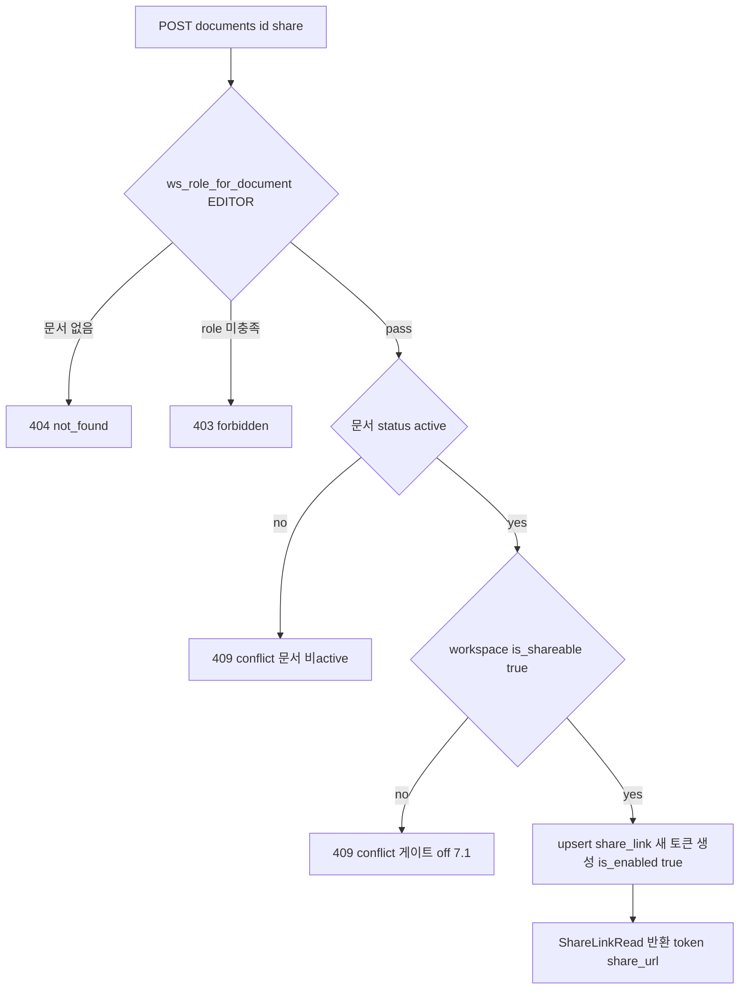
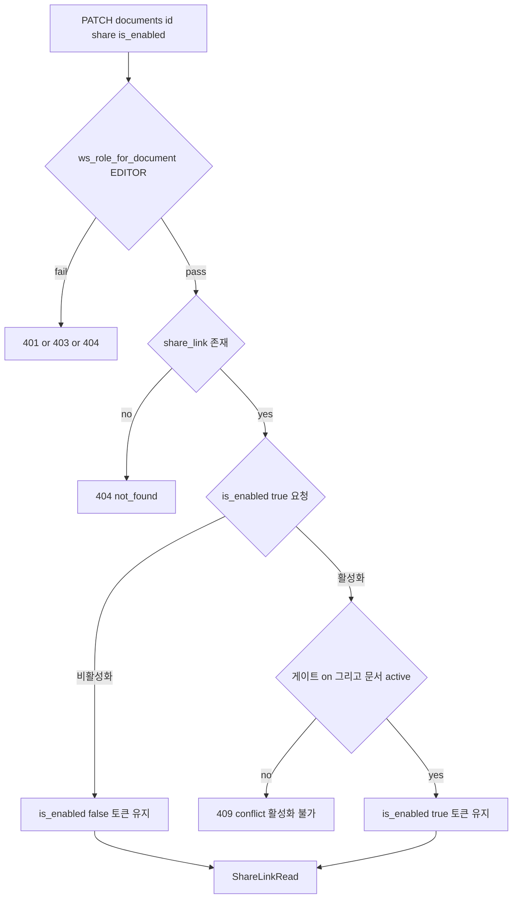
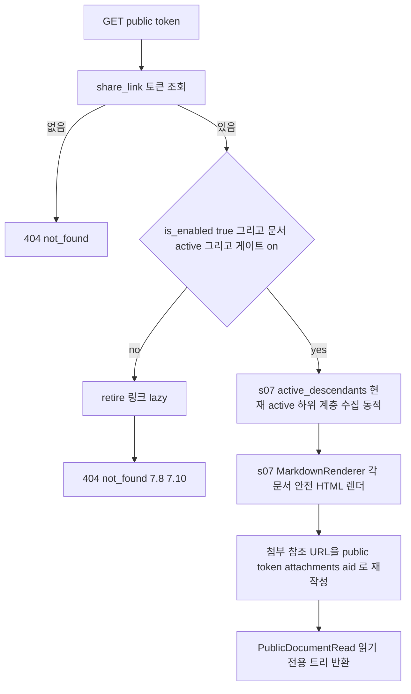
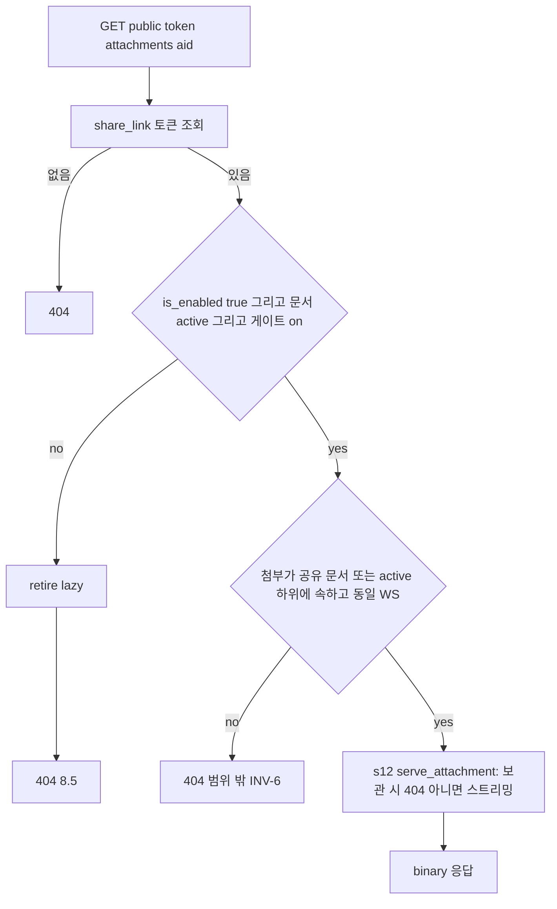
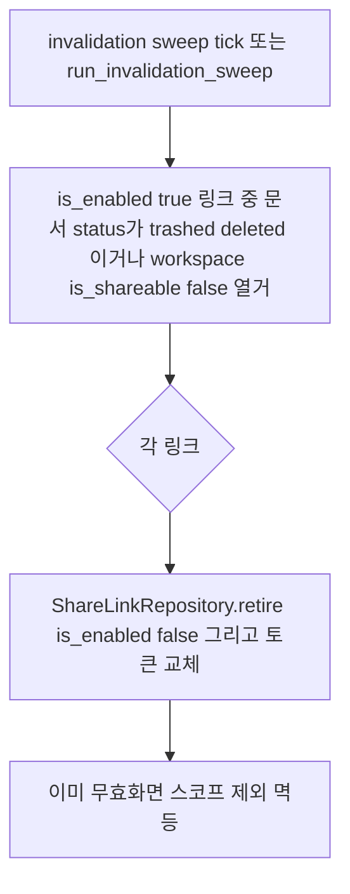

# Design Document — s14-sharing

## Overview

**Purpose**: MarkSpace의 **문서 단위 읽기 전용 공유 링크**를 구현하는 최상위(L6) 도메인이다. 워크스페이스
`is_shareable` 게이트 하에 editor 이상이 링크를 발급/토글하고, 공개 접근자는 인증 없이 문서와 **현재 active 하위
계층**(동적)을 읽기 전용으로 열람하며, 공유 문서에 포함된 첨부를 링크 경유로 내려받는다. 핵심은 **재발급 통일
원칙(INV-8)** 이다: 사용자 조작 **토글**만 동일 토큰의 상태를 되돌리는 예외이고, 그 밖의 무효화(문서 trashed/
deleted, 워크스페이스 게이트 off)는 링크를 **영구 무효화(비활성 + 토큰 교체)** 하며, 다시 공유하려면 **새 토큰으로
재발급**해야 한다. 무효화된 토큰은 재발급 없이 접근되지 않는다.

**Users**: editor 이상 사용자는 발급/재발급/토글로 링크 수명주기를 통제하고, 익명 공개 접근자는 토큰으로 문서 트리
·첨부를 읽는다. 이 spec은 상태 전이를 소유하지 않고 **관측**한다: `s10`/`s07`이 문서를 trashed/deleted로 만들거나
`s05`가 게이트를 off로 두면, s14는 그 **관측 가능한 결과**를 근거로 링크를 무효화한다. 하위 계층은 상위 계층(s14)을
알지 못하므로(의존 방향), 무효화는 `s12`의 아카이브 조정과 동일한 **관측 기반 조정(reconciliation)** + **공개 접근
시점 실시간 게이트**의 이중 구조로 구현한다. `s15(L6)` 체크포인트가 전체 e2e로 무효화·재발급·링크 파일 접근을
누적 검증한다.

**Impact**: `s01`이 확정한 계약(`share_link` 스키마, 카탈로그 행 34~37, 에러 모델, Base Schemas, resolver, 세션
인증, INV-8)과 `s05`가 실동작시킨 게이트·`require_ws_role`, `s07`이 소유한 문서→WS 어댑터·`DocumentStateEngine`
(`active_descendants`)·`MarkdownRenderer`, `s12`가 소유한 첨부 조회 서빙·저장 어댑터 위에, 공유 도메인(라우터·
발급/토글 서비스·공개 렌더 서비스·무효화 조정·스케줄러·스키마·문서→WS 어댑터)을 최초로 채운다. 새 DB
마이그레이션을 추가하지 않으며, 토큰 바이트 길이·무효화 스윕 주기만 `s01` 단일 Settings에 additive 확장한다.

### Goals
- 워크스페이스 `is_shareable` 게이트 하에서 editor 이상이 문서 단위 읽기 전용 링크를 발급/재발급/토글하도록 한다(REQ-1·2·4).
- 활성 링크의 공개 접근에서 문서와 **현재 active 하위 계층**을 안전 HTML로 읽기 전용 렌더하고, 하위 추가를 동적으로 반영한다(REQ-3).
- 재발급 통일 원칙(INV-8)을 구현한다: 토글만 상태 기반 예외, 그 외 무효화는 토큰 교체 + 재발급 필수(REQ-5).
- 공유 문서(및 active 하위)에 포함된 첨부를 링크 경유로 서빙하되 게이트·문서 status·보관·WS 격리로 함께 차단한다(REQ-6).
- 상태 전이·active 하위 질의·안전 렌더·첨부 서빙을 재구현하지 않고 `s07`·`s12` primitive를 재사용한다(REQ-7).

### Non-Goals
- `is_shareable` 게이트 플래그의 설정·소유(`s05`). s14는 게이트 값을 **관측/소비**만 한다.
- 문서 상태 전이·복구·묶음 규칙(`s07` 엔진·`s10`). s14는 문서 status를 **관측**만 한다.
- 첨부 저장·WS 격리·보관 이동·참조 소멸 아카이브(`s12`). s14는 저장·격리·아카이브 **결과를 서빙**만 한다.
- markdown → 안전 HTML 렌더 규약의 **정의**(`s07` `MarkdownRenderer`). 프론트엔드 화면.

## Boundary Commitments

### This Spec Owns
- **공유 링크 발급·재발급 동작**(카탈로그 행 34, `POST /documents/{id}/share`, editor): 게이트·문서 active 검사 후
  활성 링크 발급. 무효화 이후 발급은 **새 토큰 재발급**(INV-8, §4.5).
- **공유 링크 토글 동작**(행 35, `PATCH /documents/{id}/share`, editor): 동일 토큰의 `is_enabled` 상태 전환.
  재발급 통일 원칙의 **유일한 상태 기반 예외**. 활성화는 게이트 on·문서 active 조건 하에서만.
- **공개 읽기 전용 렌더**(행 36, `GET /public/{token}`, 공개): 활성 링크의 문서 + `s07` `active_descendants`로
  얻은 **현재 active 하위 계층**을 `s07` `MarkdownRenderer`로 안전 렌더한 읽기 전용 트리 반환(동적). 공개 HTML의
  첨부 참조를 링크 스코프 경로(`/public/{token}/attachments/{aid}`)로 재작성.
- **링크 경유 첨부 서빙**(행 37, `GET /public/{token}/attachments/{aid}`, 공개): 공유 문서(및 active 하위)에 속한
  첨부 바이너리를 `s12` 첨부 서빙으로 스트리밍. 링크 유효성·서브트리 소속·WS 격리 검사 후 위임.
- **무효화·재발급 판정(관측 기반 조정 + 실시간 게이트)**: 문서 status(trashed/deleted)·워크스페이스 게이트 off를
  관측해 활성 링크를 **retire**(비활성 + 토큰 교체)로 영구 무효화. 공개 접근 시점 실시간 검사로 즉시 차단.
- **공유 도메인 스키마**: `ShareLinkRead`·`ShareLinkUpdate`·`PublicDocumentRead`(하위 노드 포함)(`s01` Base Schemas 상속).
- **문서 id → workspace_id 매핑 재사용**: 행 34~35 게이팅에 `s07` `ws_role_for_document(EDITOR)` 재사용.
- **설정 additive 확장**: `share_token_bytes`·`share_invalidation_sweep_interval_seconds`(config.yml + 공용 Settings).

### Out of Boundary
- 워크스페이스 `is_shareable` 게이트 설정·owner/admin 변경(행 13, `s05`). s14는 게이트 값만 관측.
- 문서 상태 전이·복구·완전삭제·묶음 식별(INV-5·6·10·11·12)의 **정의·구현** — `s07` `DocumentStateEngine`·`s10`.
  s14는 문서 status를 관측만 한다.
- 첨부 저장·업로드·WS 격리·보관 이동·참조 소멸 아카이브·보관 첨부 404 규칙의 **정의** — `s12`. s14는 서빙만 소비.
- markdown → 안전 HTML 렌더 규약 정의 — `s07` `MarkdownRenderer`. s14는 재사용만.
- `s01` 계약(카탈로그·에러 모델·Base Schemas·resolver 로직·세션 인증·DB 스키마·Settings 로더)의 **정의**.

### Allowed Dependencies
- **Upstream(계약·인프라)**: `s01-contract-foundation` — `share_link`/`document`/`workspace`/`attachment` 모델,
  `get_db`/`SessionLocal`, `WorkspaceRoleResolver`/`require_ws_role`/`Role`, `AuthContext`/`get_current_user`,
  `ErrorResponse`/`ErrorCode`/`DomainError`, `ORMReadModel`/`TimestampedRead`, `Settings`/`get_settings`, 라우터
  조립 지점·lifespan.
- **Upstream(도메인)**: `s05` 게이트(`workspace.is_shareable`)·실동작 `require_ws_role`. `s07` 문서→WS 어댑터
  (`ws_role_for_document`)·`DocumentRepository`(`get`·`get_workspace_id`·`load_current_content`·children/subtree
  질의)·`DocumentStateEngine.active_descendants`·`MarkdownRenderer`. `s12` `AttachmentService.serve_attachment`
  (보관 404·부재 404·스트리밍)·`AttachmentRepository.get`(서브트리 소속 검사용).
- **간접 upstream**: `s13(L5)` 체크포인트 통과 이후 착수. `s10`이 문서를 trashed/deleted로, `s05`가 게이트를
  전환한다 — s14는 이들의 **결과 상태**에 의존한다.
- **Shared infra**: FastAPI(라우팅·DI·StreamingResponse·lifespan), SQLAlchemy 2.0(sync) 세션, pydantic v2,
  APScheduler(주기 스윕, `s10`/`s12`가 이미 도입한 의존성 재사용), 표준 라이브러리 `secrets`(토큰 생성).
- **제약**: 설정 접근은 `s01` 단일 `Settings` 경유. 새 DB 마이그레이션 없음. 의존 방향은 항상 아래층(Schemas →
  Repository → Service → Dependencies → Router/Scheduler → Bootstrap). 하위 계층(s05/s07/s10/s12)을 역방향으로
  변경하지 않으며, 상태 전이·게이트 설정·첨부 저장·렌더 규약을 **재구현하지 않는다**. `s14`는 다른 어떤 feature도
  s14를 import하지 않는다(최상위).

### Revalidation Triggers
이 spec의 계약·경계가 다음과 같이 바뀌면 `s15(L6)` 체크포인트 재검증이 필요하다.
- 공유 엔드포인트(행 34~37)의 경로·메서드·요구 role·요청/응답 스키마(`ShareLinkRead`·`ShareLinkUpdate`·
  `PublicDocumentRead`) 이름/필드 변경.
- 무효화 판정 기준(무엇을 관측해 무효화하는가: 문서 status·게이트 ↔ 다른 신호) 또는 **retire=비활성+토큰 교체**
  규약 변경.
- 재발급 통일 원칙 구현(토글=상태 기반 예외 ↔ 그 외=새 토큰) 변경 — INV-8 직접 영향.
- 공개 렌더의 동적 active 하위 포함 규약·공개 HTML 첨부 참조 재작성 규약 변경.
- 링크 경유 첨부 접근의 서브트리 소속·WS 격리·보관 차단 판정 변경.
- `share_token_bytes`/`share_invalidation_sweep_interval_seconds` Settings 필드 규약 변경.
- `s07` `active_descendants`/`MarkdownRenderer`, `s12` 첨부 서빙·보관 404 규약, `s05` 게이트 의미 변경(이 경우
  해당 spec이 상위 트리거, s14도 재검증 대상).

## Architecture

### Architecture Pattern & Boundary Map

레이어드 아키텍처(steering `structure.md` 정렬). s14는 `s01` 횡단 common·모델, `s05` 게이트·resolver, `s07` 문서
primitive·렌더, `s12` 첨부 서빙을 소비하는 하나의 feature 모듈(`app/sharing/`)로 캡슐화된다. 핵심 설계는 **무효화를
하위 계층 동기 콜백이 아니라 (1) 공개 접근 시점 실시간 게이트 + (2) 관측 기반 조정 스윕의 이중 구조로 구현**하는
것이다. 하위 계층(s05/s07/s10)은 상위 계층(s14)을 import하지 않으므로, s14는 문서 status·게이트라는 **관측 가능한
DB 상태**를 읽어 무효화를 판정한다. 실시간 게이트는 무효 상태에서의 접근을 즉시 차단하고(INV-8 while-invalid),
조정 스윕은 무효화를 영구화(retire=토큰 교체)하여 복구·게이트 재활성 후에도 재발급을 강제한다(7.9·7.10).

```mermaid
graph TB
    subgraph Runtime_s01
        Bootstrap[create_app assembly and lifespan]
    end
    subgraph Common_s01
        Auth[get_current_user AuthContext]
        Resolver[require_ws_role WorkspaceRoleResolver]
        Errors[DomainError ErrorResponse]
        Db[get_db session and SessionLocal]
        Settings[Settings]
        BaseSchemas[ORMReadModel TimestampedRead]
    end
    subgraph Model_s01
        ShareModel[share_link model]
        DocModel[document model status]
        WsModel[workspace model is_shareable]
        AttModel[attachment model]
    end
    subgraph Upstream_domain
        DocWsAdapter[s07 ws_role_for_document]
        DocRepo[s07 DocumentRepository]
        Engine[s07 DocumentStateEngine active_descendants]
        Renderer[s07 MarkdownRenderer]
        AttServe[s12 AttachmentService serve_attachment]
        AttRepo[s12 AttachmentRepository get]
    end
    subgraph Feature_s14
        Schemas[Sharing schemas]
        ShareRepo[ShareLinkRepository]
        ShareSvc[ShareLinkService issue toggle]
        PublicSvc[PublicShareService render and file]
        InvalidationSvc[ShareInvalidationSweep retire]
        Scheduler[invalidation scheduler and run_sweep]
        Router[sharing router]
    end
    Bootstrap --> Router
    Bootstrap --> Scheduler
    Router --> DocWsAdapter
    Router --> ShareSvc
    Router --> PublicSvc
    ShareSvc --> ShareRepo
    ShareSvc --> WsModel
    ShareSvc --> DocRepo
    PublicSvc --> ShareRepo
    PublicSvc --> Engine
    PublicSvc --> Renderer
    PublicSvc --> DocRepo
    PublicSvc --> AttServe
    PublicSvc --> AttRepo
    InvalidationSvc --> ShareRepo
    Scheduler --> InvalidationSvc
    Scheduler --> Db
    Scheduler --> Settings
    ShareRepo --> Db
    ShareRepo --> ShareModel
    Schemas --> BaseSchemas
```



**Architecture Integration**:
- **Selected pattern**: feature 모듈 + 레이어드 + **실시간 게이트 + 관측 기반 조정**. 의존 방향은 좌(하위 s01/s05/
  s07/s12)→우(s14) 단방향. s14는 최상위이며 어떤 feature도 s14를 import하지 않는다.
- **Domain/feature boundaries**: 발급·토글(`ShareLinkService`), 공개 렌더·파일 서빙(`PublicShareService`), 무효화
  조정(`ShareInvalidationSweep`)만 s14 소유. 상태 전이·active 하위 질의·안전 렌더·첨부 서빙·게이트 설정은 각각
  s07/s12/s05 소유.
- **Existing patterns preserved**: `{Resource}Read` 규약, 단일 `Settings`, 라우터 조립 지점·lifespan 재사용, 권한
  검사 공통 레이어 단일 구현(resolver·문서→WS 어댑터 재구현 금지), 상태/렌더/첨부 규칙 단일 구현 소비(재구현
  금지), 스윕/스케줄러 분리(s12 패턴 재사용).
- **New components rationale**: `ShareLinkService`(발급·재발급·토글)·`PublicShareService`(공개 렌더·파일 서빙·참조
  재작성)·`ShareInvalidationSweep`(retire 조정)·`ShareLinkRepository`·스케줄러·라우터·스키마만 신규. 각 단일 책임.
- **Steering compliance**: 권한은 WS 단위 resolver 재사용(INV-1). 설정은 `s01` 단일 Settings additive 확장. 상태·
  게이트·렌더·첨부 규칙은 하위 계층 결과 관측/primitive 재사용으로만 소비.

### Dependency Direction (강제)
```
Schemas → ShareLinkRepository → (ShareLinkService · PublicShareService · ShareInvalidationSweep) → Dependencies(s07 문서→WS 어댑터 재사용) → (Router · Scheduler) → Bootstrap(assembly + lifespan)
     (각 레이어는 왼쪽 레이어와 s01 common/model·s05 게이트/resolver·s07 primitive·s12 첨부 서빙만 import. 위 방향 위반은 리뷰에서 오류로 취급)
```
`app/sharing/`는 `s01` `common`·`models`·`schemas.base`, `s05` `require_ws_role`, `s07` 어댑터/`DocumentRepository`/
`DocumentStateEngine`/`MarkdownRenderer`, `s12` `AttachmentService`/`AttachmentRepository`만 소비한다. **무효화는
관측 기반이며 s14는 문서 status·워크스페이스 게이트를 읽어서 판정한다.** 상태 전이·게이트 설정·첨부 저장·렌더
규약을 재구현하지 않는다.

### Technology Stack

| Layer | Choice / Version | Role in Feature | Notes |
|-------|------------------|-----------------|-------|
| Backend / Runtime | FastAPI(`s01` 버전), uvicorn | 라우팅·DI·StreamingResponse·lifespan | `s01` 조립 지점 include_router, lifespan에 스윕 훅 |
| Auth / Perm | `s01` `require_ws_role`/`get_current_user` + `s07` `ws_role_for_document` | 발급·토글 게이팅 | 공개 경로(행 36~37)는 인증 우회, 토큰·게이트·status·격리로 제한 |
| Data / ORM | SQLAlchemy `>=2.0,<2.1`(sync, `s01`) | share_link r/w, document status·workspace 게이트 조회 | `s01` `get_db`·`SessionLocal`·모델 재사용 |
| Doc primitives | `s07` `DocumentStateEngine.active_descendants`·`DocumentRepository`·`MarkdownRenderer` | 동적 active 하위·안전 렌더 | 재사용, 재구현 금지 |
| Attachment serve | `s12` `AttachmentService.serve_attachment`·`AttachmentRepository` | 링크 경유 파일 서빙·보관 404 | 재사용, 저장/격리/보관 재구현 금지 |
| Token | 표준 라이브러리 `secrets.token_urlsafe` | 공유 토큰 생성(추측 불가) | `share_token_bytes` 설정, `token VARCHAR(64)` 내 적재 |
| Scheduler | APScheduler `>=3.10`(BackgroundScheduler) | 주기 무효화 스윕 | `s10`/`s12`가 이미 도입한 의존성 재사용, `<=0`이면 비활성 |
| Config | `s01` `Settings`(pydantic-settings) | `share_token_bytes`·`share_invalidation_sweep_interval_seconds`(신규 additive) | 단일 접근자 경유 |
| Schemas | pydantic v2(`s01` Base Schemas) | 요청/응답 검증 | `{Resource}Read` 규약 |

> 신규 외부 의존성 없음(APScheduler 재사용, `secrets`는 표준 라이브러리). 새 마이그레이션 없음. 토큰·무효화 설계
> 결정과 대안 비교는 `research.md` 참조.

## File Structure Plan

### Directory Structure
```
backend/app/
└── sharing/                     # s14 feature 모듈(신규)
    ├── __init__.py
    ├── router.py                # 공유 4개 엔드포인트(행 34~37): 발급·토글(editor 게이트)·공개 렌더·공개 파일(공개)
    ├── service.py               # ShareLinkService: issue(발급/재발급, 게이트·active 검사)·toggle(상태 전환)
    ├── public_service.py        # PublicShareService: 공개 렌더(문서+동적 active 하위·안전 렌더·참조 재작성)·링크 경유 파일 서빙
    ├── invalidation.py          # ShareInvalidationSweep: 문서 status·게이트 관측 retire(비활성+토큰 교체) + run_invalidation_sweep
    ├── scheduler.py             # APScheduler 어댑터: lifespan start/stop, 주기 실행 등록
    ├── repository.py            # ShareLinkRepository: share_link r/w·토큰/문서 조회·무효화 스코프 질의·토큰 생성
    ├── schemas.py               # ShareLinkRead, ShareLinkUpdate, PublicDocumentRead(+PublicDocumentNode)
    └── dependencies.py          # 발급/토글용 s07 ws_role_for_document(EDITOR) 재사용 배선(문서→WS)
```

### Modified Files
- `backend/app/main.py` **또는** `backend/app/routers/__init__.py` — `s01` 라우터 조립 지점에
  `include_router(sharing.router)` 추가. `create_app()` lifespan에 무효화 스케줄러 start/stop 훅 연결(REQ-7.4).
- `backend/config.yml` — `share_token_bytes`(기본 32)·`share_invalidation_sweep_interval_seconds`(기본 3600) 추가.
- `backend/app/config.py`(`s01` `Settings`) — 위 2개 additive 필드 추가(기본값 존재, 비파괴적).

> 각 파일 단일 책임. `sharing/*`는 `s01` `common`·`models`·`schemas.base`, `s05` resolver/게이트, `s07` 어댑터/
> primitive/렌더, `s12` 첨부 서빙만 import하고 상태 전이·게이트 설정·첨부 저장·렌더 규약을 재구현하지 않는다.
> **retire(비활성 + 토큰 교체)는 `ShareLinkRepository.retire` + `ShareInvalidationSweep`/공개 접근 게이트 한 곳에만
> 존재**하며 물리 삭제는 어디에도 없다.

## System Flows

### 공유 링크 발급·재발급 (행 34, REQ-1·2, 재발급 통일)

- **판정 요지**: 문서당 share_link 행은 최대 1개. 발급/재발급은 이 행을 upsert하며 **항상 새 토큰을 생성**한다
  (이전 무효화 토큰을 되살리지 않음, INV-8·§4.5). 게이트 off(7.1)·비active 문서는 발급 거부. workspace_id는 문서에서
  확정(`s07` get_workspace_id).

### 공유 링크 토글 (행 35, REQ-4, 상태 기반 예외)

- **판정 요지**: 토글은 **토큰을 유지**한 채 `is_enabled`만 전환하는 재발급 통일 원칙의 유일한 예외(7.7). 활성화는
  게이트 on·문서 active일 때만(7.1). 이미 retire(토큰 교체)된 링크는 이전 토큰이 이미 소멸했으므로 토글로 이전
  URL을 되살릴 수 없다(INV-8).

### 공개 읽기 전용 렌더 — 동적 active 하위 (행 36, REQ-3)

- **판정 요지**: 유효성 = `is_enabled` AND 문서 active AND 게이트 on(실시간 관측). 무효면 404이며 그 접근이
  무효 조건을 관측했으면 **lazy retire**(비활성+토큰 교체)로 영구화한다(7.8·7.10). 하위 계층은 **접근 시점의 현재
  active 하위**를 `s07` `active_descendants`로 동적 수집(7.5·7.6). 공개 HTML의 `/attachments/{id}` 참조는 링크
  스코프(`/public/{token}/attachments/{id}`)로 재작성해 인증 없이 이미지가 로딩되게 한다(8.4).

### 링크 경유 첨부 서빙 (행 37, REQ-6, 8.4·8.5)

- **판정 요지**: 파일 접근 유효성은 공개 렌더와 동일(게이트·status). 게이트 off·문서 trashed면 파일도 함께 차단
  (8.5). 첨부는 공유 문서 또는 그 현재 active 하위에 속하고 동일 워크스페이스여야 한다(범위·격리, INV-6). 보관된
  첨부·부재는 `s12` `serve_attachment`가 role·경로 무관 404로 처리(8.5 보관 차단 재사용). 저장·격리·보관 판정을
  재구현하지 않는다.

### 무효화 반응 조정 스윕 (REQ-5) — status·게이트 관측 retire

- **판정 요지**: s14는 상태 전이·게이트 설정을 수행하지 않고 `document.status`·`workspace.is_shareable`라는 관측
  가능한 결과를 스캔해 판정한다(7.8·7.10·REQ-5.5). retire는 물리 삭제 없이 `is_enabled=false` + **토큰 교체**로
  이전 토큰을 영구 무효화한다(INV-8). 이미 무효화(비활성)된 링크는 스코프에서 제외되어 멱등(REQ-5.6). 복구·게이트
  재활성 후에도 토큰이 교체됐으므로 이전 URL은 되살아나지 않고 재발급(POST)이 필요하다(7.9·7.10·REQ-5.4). 실시간
  공개 게이트가 스윕 이전에도 무효 접근을 즉시 차단하므로 while-invalid 보장은 스윕 주기와 무관하다(INV-8).

## Requirements Traceability

| Requirement | Summary | Components | Interfaces / Contracts | Flows |
|-------------|---------|------------|------------------------|-------|
| 1.1–1.4 | 게이트 하 발급/활성 가능 여부·게이트 소비 | ShareLinkService, ShareLinkRepository, (s05 게이트 관측) | `issue_link`, `toggle_link` 게이트 검사 | 발급, 토글 |
| 2.1–2.6 | 발급·재발급(새 토큰)·editor 게이트·문서 단위 | ShareLinkService, ShareLinkRepository, Schemas, Router, (s07 DocWsAdapter) | `issue_link`, `ShareLinkRead` | 발급 |
| 3.1–3.6 | 공개 읽기전용·동적 active 하위·안전 렌더·404 | PublicShareService, (s07 Engine·Renderer·DocRepo), ShareLinkRepository, Router | `render_public_document`, `PublicDocumentRead` | 공개 렌더 |
| 4.1–4.4 | 토글 상태 전환·토큰 유지·재발급 예외 | ShareLinkService, ShareLinkRepository, Schemas | `toggle_link`, `ShareLinkUpdate` | 토글 |
| 5.1–5.6 | 무효화(status·게이트 관측)·토큰 교체·재발급 필수·멱등 | ShareInvalidationSweep, ShareLinkRepository, PublicShareService(실시간 게이트) | `retire`, `invalidate_by_observation`, 실시간 유효성 | 조정 스윕, 공개 렌더/파일 |
| 6.1–6.5 | 링크 경유 첨부 서빙·게이트/status/보관/격리 차단 | PublicShareService, (s12 AttachmentService·AttachmentRepository), Router | `serve_public_attachment` | 링크 파일 서빙 |
| 7.1–7.7 | 계약 재사용·에러·resolver·공개 우회·조립·마이그레이션 무추가·Settings·primitive 재사용 | 전 컴포넌트, Bootstrap wiring, Settings 확장 | s01/s05/s07/s12 계약 재사용, `include_router`, lifespan | — |

## Components and Interfaces

| Component | Domain/Layer | Intent | Req Coverage | Key Dependencies (P0/P1) | Contracts |
|-----------|--------------|--------|--------------|--------------------------|-----------|
| SharingSchemas | Feature/Contract | 링크·공개 렌더 스키마 | 2,3,4,7 | s01 BaseSchemas (P0) | State |
| ShareLinkRepository | Feature/Data | share_link r/w·토큰/문서 조회·무효화 스코프·토큰 생성·retire | 1,2,4,5 | s01 Db (P0), s01 ShareModel·DocModel·WsModel (P0) | Service, State |
| ShareLinkService | Feature/Service | 발급/재발급·토글(게이트·active 검사) | 1,2,4 | ShareLinkRepository (P0), s07 DocRepo (P0), s01 Errors (P1) | Service |
| PublicShareService | Feature/Service | 공개 렌더(동적 하위·안전 렌더·참조 재작성)·링크 경유 파일 서빙 | 3,5,6 | ShareLinkRepository (P0), s07 Engine·Renderer·DocRepo (P0), s12 AttachmentService·AttachmentRepository (P0) | Service |
| ShareInvalidationSweep | Feature/Service | status·게이트 관측 retire(멱등) | 5 | ShareLinkRepository (P0) | Service, Batch |
| ShareInvalidationScheduler | Feature/Runtime | 주기 무효화 스윕·run_invalidation_sweep 엔트리포인트 | 5,7 | ShareInvalidationSweep (P0), s01 SessionLocal·Settings (P0), APScheduler (P0) | Batch |
| SharingRouter | Feature/API | 공유 4개 엔드포인트(행 34~37) | 2,3,4,6,7 | s07 DocWsAdapter (P0), ShareLinkService·PublicShareService (P0) | API |
| Bootstrap wiring | Runtime | 라우터 조립 + lifespan 스케줄러 연결 | 7 | s01 create_app·lifespan (P0), SharingRouter·ShareInvalidationScheduler (P0) | API, Batch |

### Feature / Contract

#### SharingSchemas
| Field | Detail |
|-------|--------|
| Intent | 공유 링크 응답·토글 요청·공개 렌더 응답 스키마(`{Resource}Read` 규약) |
| Requirements | 2.1, 3.1, 4.1, 7.1 |

**Contracts**: State [x]
```python
class ShareLinkRead(TimestampedRead):        # s01 TimestampedRead 상속(id, created_at, updated_at)
    document_id: int
    token: str
    is_enabled: bool
    share_url: str                           # = "/public/{token}" (파생값, 공유 URL 규약)

class ShareLinkUpdate(BaseModel):            # 토글 요청(부분): 상태만 전환
    is_enabled: bool

class PublicDocumentNode(BaseModel):         # 공개 트리 노드(읽기 전용, 최소 노출)
    id: int
    title: str
    content_html: str                        # s07 MarkdownRenderer 렌더 + 첨부 참조 링크 스코프 재작성
    children: list["PublicDocumentNode"]     # 현재 active 하위(동적)

class PublicDocumentRead(BaseModel):         # GET /public/{token} 응답(공개, 읽기 전용)
    root: PublicDocumentNode                 # 공유 문서 = 루트, 하위는 children으로 중첩
```
- 규약: 발급/토글 응답=`ShareLinkRead`(`TimestampedRead` 상속), 공개 응답=`PublicDocumentRead`(중첩 노드). `share_url`
  은 서버 산정 파생값(`/public/{token}`). 공개 스키마는 `workspace_id`·`created_by`·`sort_order` 등 내부 필드를
  노출하지 않는다(최소 노출). 바이너리(행 37)는 스키마가 아니라 `StreamingResponse`.
- Boundary: 스키마 형태·공유/공개 URL 규약만 소유. Base 규약(`TimestampedRead`)·`share_link` 스키마 정의는 `s01`.

### Feature / Data

#### ShareLinkRepository
| Field | Detail |
|-------|--------|
| Intent | share_link r/w와 토큰/문서 조회·무효화 스코프 질의·토큰 생성·retire의 단일 데이터 접근점 |
| Requirements | 1.1, 2.1, 2.4, 2.5, 4.1, 5.1, 5.3, 5.6 |

**Responsibilities & Constraints**
- `s01` share_link·document·workspace 모델·`get_db`/`SessionLocal` 사용. share_link는 물리 삭제하지 않는다(retire로
  비활성+토큰 교체만).
- 문서당 최대 1개 링크 행: `get_by_document`(문서 id)·`get_by_token`(공개 접근). `upsert_reissue`는 행이 없으면
  insert, 있으면 **새 토큰 생성 + is_enabled=true**로 갱신(발급/재발급, 항상 새 토큰).
- `set_enabled`: 토글용 `is_enabled` 전환(**토큰 유지**).
- `retire`: `is_enabled=false` + **토큰 교체**(이전 토큰 영구 무효화, INV-8). 물리 삭제 없음.
- 토큰 생성: `secrets.token_urlsafe(share_token_bytes)`로 추측 불가한 토큰 생성(`token VARCHAR(64)` 내 적재).
- 무효화 스코프 질의: `list_enabled_invalidatable(db)` — `is_enabled=true`이면서 소속 `document.status`가 trashed/
  deleted이거나 소속 `workspace.is_shareable=false`인 링크 열거(이미 비활성 링크는 제외, 멱등 스코프).
- 상태 전이·게이트 설정은 하지 않는다(관측만).

**Dependencies**
- Inbound: ShareLinkService — 발급·토글(P0); PublicShareService — 토큰 조회·lazy retire(P0); ShareInvalidationSweep — 스코프 질의·retire(P0)
- Outbound: s01 Db — 세션(P0); s01 ShareModel·DocModel·WsModel — 매핑(P0)

**Contracts**: Service [x] / State [x]
```python
class ShareLinkRepository:
    def get_by_document(self, db: Session, document_id: int) -> ShareLink | None: ...
    def get_by_token(self, db: Session, token: str) -> ShareLink | None: ...
    def upsert_reissue(self, db: Session, document_id: int) -> ShareLink: ...   # 새 토큰·is_enabled=true
    def set_enabled(self, db: Session, link: ShareLink, *, enabled: bool) -> ShareLink: ...  # 토큰 유지(토글)
    def retire(self, db: Session, link: ShareLink) -> ShareLink: ...            # is_enabled=false + 토큰 교체
    def list_enabled_invalidatable(self, db: Session) -> list[ShareLink]: ...   # status·게이트 관측 스코프
```
- Invariants: share_link 물리 삭제 없음. `upsert_reissue`·`retire`는 항상 새 토큰을 생성하고, `set_enabled`는 토큰을
  유지한다. 무효화 스코프는 항상 `is_enabled=true`만 대상으로 하여 멱등.
- Boundary: 데이터 질의·토큰 생성·상태 표시만. 무엇을 무효화할지(관측 조건)는 서비스가 결정하고 여기서는 질의·쓰기만.

### Feature / Service

#### ShareLinkService
| Field | Detail |
|-------|--------|
| Intent | 공유 링크 발급/재발급과 토글(게이트·문서 active 검사) |
| Requirements | 1.1, 1.2, 1.3, 1.4, 2.1, 2.4, 2.5, 4.1, 4.2, 4.3 |

**Responsibilities & Constraints**
- **issue(발급/재발급)**: 대상 문서 존재 확인(부재→404). 문서 status가 active인지(비active→409), 소속 워크스페이스
  `is_shareable`가 true인지(게이트 off→409, 7.1) 검사. `upsert_reissue`로 새 토큰·활성 링크 생성 → `ShareLinkRead`
  반환. 무효화 이후 재발급은 새 토큰(INV-8·§4.5). workspace_id·문서 로드는 `s07` `DocumentRepository` 재사용.
- **toggle**: 문서의 링크 로드(부재→404). `is_enabled=false` 요청은 항상 허용(토큰 유지). `is_enabled=true` 요청은
  게이트 on·문서 active일 때만 허용(아니면 409, 7.1). `set_enabled`로 상태 전환(**토큰 유지**, 재발급 아님, 7.7).
- 상태 전이·게이트 설정·무효화 판정은 소유하지 않는다(각각 s07/s10·s05, 무효화는 ShareInvalidationSweep/공개 게이트).

**Dependencies**
- Inbound: SharingRouter — issue·toggle(P0)
- Outbound: ShareLinkRepository — upsert/set_enabled(P0); s07 DocumentRepository — get·get_workspace_id(P0);
  s01 WsModel — is_shareable 관측(P0); s01 Errors — 404/409(P1)

**Contracts**: Service [x]
```python
class ShareLinkService:
    def issue_link(self, db: Session, ctx: AuthContext, document_id: int) -> ShareLinkRead: ...   # 404 문서, 409 비active/게이트 off
    def toggle_link(self, db: Session, document_id: int, payload: ShareLinkUpdate) -> ShareLinkRead: ...  # 404 링크, 409 활성화 불가
```
- Preconditions: issue·toggle은 라우터에서 `ws_role_for_document(EDITOR)` 통과. admin bypass는 resolver 처리.
- Postconditions: issue 후 활성 링크(새 토큰) 존재. toggle 후 동일 토큰의 상태 전환(재발급 아님).
- Invariants: 발급/재발급은 새 토큰(§4.5). 토글은 토큰 유지(유일한 상태 기반 예외). 게이트 off 시 발급·활성화 불가(7.1).

#### PublicShareService
| Field | Detail |
|-------|--------|
| Intent | 공개 읽기 전용 렌더(동적 active 하위·안전 렌더·참조 재작성)와 링크 경유 첨부 서빙 |
| Requirements | 3.1, 3.2, 3.3, 3.4, 3.5, 3.6, 5.1, 5.2, 6.1, 6.2, 6.3, 6.4, 6.5 |

**Responsibilities & Constraints**
- **공개 유효성(실시간 게이트)**: 토큰으로 링크 로드(부재→404). 유효 = `is_enabled=true` AND 문서 status=active AND
  워크스페이스 `is_shareable=true`. 무효면 404이며, 무효 조건(문서 비active·게이트 off)을 관측했으면 **lazy retire**
  (`ShareLinkRepository.retire`)로 영구화(7.8·7.10, INV-8 while-invalid + 영구화).
- **render_public_document**: 유효 시 `s07` `DocumentStateEngine.active_descendants`로 **접근 시점의 현재 active
  하위 계층**을 동적 수집(7.5·7.6) → 각 문서 본문을 `s07` `DocumentRepository.load_current_content` + `MarkdownRenderer`
  로 안전 HTML 렌더(3.2) → 렌더 HTML의 `/attachments/{id}` 참조를 `/public/{token}/attachments/{id}`로 재작성(8.4
  이미지 로딩) → `PublicDocumentRead`(읽기 전용 중첩 트리) 반환. 변경 동작 없음(3.3).
- **serve_public_attachment**: 링크 유효성 검사(무효→404, 8.5) → 첨부 로드(`s12` `AttachmentRepository.get`, 부재→
  404) → 첨부가 공유 문서 또는 그 현재 active 하위에 속하고 동일 워크스페이스인지 검사(아니면 404, 범위·격리 INV-6)
  → `s12` `AttachmentService.serve_attachment`에 위임(보관 첨부는 role·경로 무관 404, 8.5 보관 차단; 아니면 스트리밍).
- 상태 전이·게이트 설정·첨부 저장/격리/보관·렌더 규약은 소유하지 않고 primitive를 재사용한다(REQ-7.7).

**Dependencies**
- Inbound: SharingRouter — 공개 렌더·파일 서빙(P0)
- Outbound: ShareLinkRepository — 토큰 조회·lazy retire(P0); s07 DocumentStateEngine·DocumentRepository·MarkdownRenderer
  — active 하위·본문·렌더(P0); s12 AttachmentService·AttachmentRepository — 서빙·소속 검사(P0); s01 Errors — 404(P1)

**Contracts**: Service [x]
```python
class PublicShareService:
    def render_public_document(self, db: Session, token: str) -> PublicDocumentRead: ...   # 404 무효/부재
    def serve_public_attachment(self, db: Session, token: str, attachment_id: int) -> AttachmentBinary: ...  # 404 무효/범위밖/보관/부재
```
- Preconditions: 공개 경로는 인증 우회. 접근 범위는 토큰·게이트·문서 status·WS 격리로만 제한(REQ-7.3).
- Postconditions: 유효 링크만 문서 트리/바이너리 반환. 무효(게이트 off·문서 trashed·미존재 토큰·보관 첨부·범위 밖)는 404.
- Invariants: 공개 렌더는 읽기 전용이며 **현재 active 하위**만 동적 포함(trashed/deleted 제외, 3.5). 링크 파일 접근은
  게이트·문서 status와 함께 차단(8.5). 저장/격리/보관 판정은 s12 재사용.

#### ShareInvalidationSweep
| Field | Detail |
|-------|--------|
| Intent | 문서 status·워크스페이스 게이트를 관측해 활성 링크를 retire(비활성+토큰 교체)로 영구 무효화(멱등) |
| Requirements | 5.1, 5.2, 5.3, 5.4, 5.5, 5.6 |

**Responsibilities & Constraints**
- **invalidate_by_observation(db)**: `list_enabled_invalidatable`로 `is_enabled=true`이면서 문서 status가 trashed/
  deleted이거나 게이트 off인 링크를 열거 → 각 링크 `ShareLinkRepository.retire`(is_enabled=false + 토큰 교체). 상태
  전이·게이트 설정을 수행하지 않고 관측만 한다(REQ-5.5). 이미 비활성 링크는 스코프에서 제외되어 멱등(REQ-5.6). 개별
  링크 처리 예외를 격리해 전체 스윕이 중단되지 않게 한다(로그 후 계속).
- retire는 토큰을 교체하므로 이후 문서 복구·게이트 재활성 시에도 이전 토큰은 소멸해 되살아나지 않는다(7.9·7.10·
  REQ-5.4). 재공유는 발급(POST) 재발급으로만 가능.
- **상태 전이·게이트 설정을 직접 쓰지 않는다.** 판정은 문서 status·게이트 관측으로만, 물리 삭제 없음.

**Dependencies**
- Inbound: ShareInvalidationScheduler — 주기 호출(P0); (테스트·수동) `run_invalidation_sweep` 엔트리포인트(P0)
- Outbound: ShareLinkRepository — 스코프 질의·retire(P0)

**Contracts**: Service [x] / Batch [x]
```python
class ShareInvalidationSweep:
    def invalidate_by_observation(self, db: Session) -> int: ...   # retire 건수 반환
```
- Batch: Trigger=스케줄 주기(또는 수동 `run_invalidation_sweep`). Input=관측 상태(문서 status·게이트). Output=대상
  링크 is_enabled=false + 토큰 교체. Idempotency=스코프가 항상 `is_enabled=true`만 대상이라 재적용 무해. Recovery=
  링크 단위 예외 격리·다음 주기 재시도.
- Invariants: 물리 삭제 없음. 관측 기반(문서 status·게이트). retire는 이전 토큰을 영구 무효화(INV-8). 실시간 공개
  게이트가 스윕 이전에도 무효 접근을 차단하므로 while-invalid 보장은 스윕 주기에 의존하지 않는다.

### Feature / Dependency

#### 발급/토글 게이팅 (s07 ws_role_for_document 재사용)
| Field | Detail |
|-------|--------|
| Intent | `/documents/{id}/share`(행 34~35)에서 문서 id→workspace_id를 추출해 `require_ws_role(EDITOR)`에 주입 |
| Requirements | 2.2, 2.3, 2.6, 7.3 |

**Contracts**: Service [x]
```python
# /documents/{id}/share (행 34·35): s07 ws_role_for_document(Role.EDITOR) 재사용(문서 id→WS, 미존재→404)
#   발급/토글: current = Depends(ws_role_for_document(Role.EDITOR))
# /public/{token} (행 36), /public/{token}/attachments/{aid} (행 37): 인증·권한 게이트 없음(공개).
#   접근 범위는 PublicShareService가 토큰·게이트·문서 status·WS 격리로 제한.
```
- Responsibilities: 발급/토글은 `s07` 문서→WS 어댑터를 재사용해 WS 단위 editor 게이팅(INV-1). resolver 위계·admin
  bypass는 재구현하지 않는다(7.3). 공개 경로는 인증을 우회하되 서비스가 범위를 제한한다.
- Boundary: 게이팅 배선만 소유. 판정 로직은 `s01`, 실동작 데이터는 `s05`, 문서→WS는 `s07` 재사용.

### Feature / Runtime

#### ShareInvalidationScheduler
| Field | Detail |
|-------|--------|
| Intent | 주기 무효화 스윕 실행 어댑터(FastAPI lifespan)·독립 실행 엔트리포인트 |
| Requirements | 5.1, 7.4, 7.6 |

**Responsibilities & Constraints**
- `start(app)`/`stop()`: `s01` `create_app()` lifespan에서 호출. `Settings.share_invalidation_sweep_interval_seconds`
  가 `>0`이면 APScheduler `BackgroundScheduler`에 interval job 등록·기동, `<=0`이면 기동하지 않는다(외부 cron 신호).
- `run_invalidation_sweep()`: `SessionLocal`로 자기 세션을 열고 `ShareInvalidationSweep.invalidate_by_observation(db)`
  호출 후 commit/close. 스케줄 job 본체이자 테스트·수동/외부 cron 엔트리포인트(`uv run python -m app.sharing.invalidation`).
- 설정은 `s01` 단일 Settings 경유(모듈별 파일 금지, 7.6). 주기 job은 요청 스코프 세션을 쓰지 않고 자체 세션 관리.

**Dependencies**
- Inbound: Bootstrap lifespan — start/stop(P0)
- Outbound: ShareInvalidationSweep — 스윕(P0); s01 SessionLocal — 세션(P0); s01 Settings — 주기·활성 여부(P0);
  APScheduler — 주기 실행(P0)

**Contracts**: Batch [x]
```python
def run_invalidation_sweep() -> int: ...          # SessionLocal 세션으로 스윕 1회, 반환: retire 건수
def start(app: FastAPI) -> None: ...              # interval>0이면 BackgroundScheduler 기동
def stop() -> None: ...                           # 스케줄러 shutdown
```
- Trigger: interval(초) 주기 또는 수동. Idempotency: 스윕 서비스 멱등성 상속. Recovery: 앱 재시작 시 미처리분은 다음
  주기 또는 다음 공개 접근(lazy retire)에 처리. Boundary: 스케줄 실행·세션 수명만 소유. 판정·retire는 서비스·리포지토리.

### Feature / API

#### SharingRouter
| Field | Detail |
|-------|--------|
| Intent | 공유 4개 엔드포인트 노출(카탈로그 행 34~37) |
| Requirements | 2.1, 2.2, 2.3, 3.1, 3.6, 4.1, 6.1, 6.2, 6.3, 6.4, 7.2, 7.3, 7.4 |

**Contracts**: API [x]

##### API Contract
| Method | Endpoint | 요구 role | Request | Response | Errors |
|--------|----------|-----------|---------|----------|--------|
| POST | /documents/{id}/share | editor | — | ShareLinkRead | 401, 403, 404, 409 |
| PATCH | /documents/{id}/share | editor | ShareLinkUpdate | ShareLinkRead | 401, 403, 404, 409 |
| GET | /public/{token} | (공개) | — | PublicDocumentRead | 404 |
| GET | /public/{token}/attachments/{aid} | (공개) | — | (binary StreamingResponse) | 404 |

- 게이트: `POST/PATCH /documents/{id}/share`는 `s07` 문서→WS 어댑터(`ws_role_for_document(EDITOR)`)로 문서
  id→workspace_id 주입(문서 미존재→404, viewer/비멤버→403, 비인증→401, admin bypass). `GET /public/{token}`·
  `GET /public/{token}/attachments/{aid}`는 **인증·권한 게이트 없음(공개)** 이며 `PublicShareService`가 토큰·게이트·
  문서 status·WS 격리로 접근 범위를 제한한다(무효·범위 밖·보관·부재→404). `s01` 카탈로그 행 34~37과 정합(7.3·7.4).
- 발급 실패(게이트 off·문서 비active)는 409, 토글 활성화 불가(게이트 off·문서 비active)는 409. 성공 시 발급/토글은
  `ShareLinkRead`, 공개 렌더는 `PublicDocumentRead`, 파일은 `StreamingResponse`.
- Boundary: 라우터는 게이트·서비스 위임·상태코드/스트리밍 매핑만. 로직은 서비스, 상태 전이·게이트 설정·첨부 저장·
  렌더 규약은 하위 계층(s05/s07/s10/s12).

### Runtime / Bootstrap wiring
| Field | Detail |
|-------|--------|
| Intent | `s01` 라우터 조립 지점에 공유 라우터 연결 + lifespan에 무효화 스케줄러 훅 |
| Requirements | 7.4 |

- `s01` `create_app()`의 feature 라우터 조립 지점에 `include_router(sharing.router)`를 추가하고, lifespan startup/
  shutdown에 `ShareInvalidationScheduler.start(app)`/`stop()`을 연결한다. 조립·lifespan 방식은 `s01`·`s05`·`s07`·
  `s10`·`s12`를 따른다.
- Boundary: 조립 연결·lifespan 훅만 소유. 부트스트랩·미들웨어·에러 핸들러 등록은 `s01`.

## Data Models

### Domain Model
- 집계 루트: **ShareLink**(문서 단위 공개 링크의 상태·토큰 집계). s14는 `s01` 소유 `share_link` 스키마를 그대로
  사용하며 새 엔티티·컬럼·마이그레이션을 추가하지 않는다.
- **링크 수명주기**: 발급/재발급(새 토큰·활성) → [토글 off/on(토큰 유지)] → retire(비활성 + 토큰 교체, 영구 무효화).
  retire된 링크는 재발급(새 토큰)으로만 다시 활성화된다(INV-8·§4.5).
- **공유 범위(도메인 개념)**: 별도 테이블이 아니라 공유 문서를 루트로 하는 **현재 active 서브트리**로, 접근 시점에
  `s07` `active_descendants`로 동적 재구성한다(7.6). 링크 경유 첨부 접근은 이 서브트리 소속·동일 WS로 제한(INV-6).
- 불변식: INV-8(무효화 링크는 재발급 없이 접근 불가)·INV-6(공유·파일 접근 WS 경계). INV-4로 share_link 물리 삭제
  없음(retire만). INV-1은 발급/토글 게이팅에서 resolver 재사용으로 강제.

### Physical Data Model
- 대상 테이블(모두 `s01` 소유, 변경·추가 없음):
  - `share_link`: `id, document_id FK, token VARCHAR(64) UNIQUE, is_enabled BOOLEAN DEFAULT TRUE, created_at`.
    문서당 최대 1개 행(발급/재발급 upsert). retire·재발급은 `token`을 새 값으로 교체(UNIQUE 유지).
  - `document`(관측): `status ENUM(active/trashed/deleted)`, `parent_id`(active 하위 재구성), `current_version_id`
    (본문 로드). `workspace`(관측): `is_shareable`(게이트). `attachment`(서빙): `workspace_id`·`document_id`·
    `is_archived`(보관 차단). 모두 읽기 전용 관측/서빙 대상.
- 활용: `token` UNIQUE 인덱스가 공개 접근 O(1) 조회를 지원. 무효화 스코프 질의는 `share_link.is_enabled=true`와
  `document.status`·`workspace.is_shareable` 조인으로 열거(`document` 인덱스 `(workspace_id, status, parent_id)` 활용).
- **토큰 정밀도 주의**: 토큰은 `secrets.token_urlsafe(share_token_bytes)`로 생성하며 `VARCHAR(64)` 한도 내에 들도록
  `share_token_bytes` 기본값(32 → base64url 약 43자)을 설정한다. UNIQUE 충돌은 극히 드물며 발생 시 재생성한다.

### Data Contracts & Integration
- **API 데이터 전송**: 발급/토글 응답은 `s01` Base Schemas 규약(`ShareLinkRead`=`TimestampedRead` 상속, JSON).
  공개 렌더는 `PublicDocumentRead`(중첩 노드, 최소 노출). 파일은 `StreamingResponse`(바이너리).
- **에러 직렬화**: 전 엔드포인트 `s01` `ErrorResponse` 단일 형태(공개 경로 포함).
- **primitive 재사용 계약**: `s07` `active_descendants`/`load_current_content`/`MarkdownRenderer`와 `s12`
  `AttachmentService.serve_attachment`/`AttachmentRepository.get`이 s14 소비의 안정 계약이다. 이들 계약 변경은
  해당 spec의 상위 트리거이자 s14 재검증 대상이다.

## Error Handling

### Error Strategy
- 단일 변환 지점: 서비스·리포지토리는 `s01` `DomainError`를 raise하고 s01 전역 핸들러가 `ErrorResponse`로 변환.
- 발급/토글 상태 충돌(게이트 off·문서 비active)은 409로 표면화. 공개 경로의 모든 접근 거부(무효 링크·범위 밖·보관·
  부재)는 정보 노출을 피하기 위해 일관되게 404로 매핑한다.

### Error Categories and Responses
| HTTP | ErrorCode | 발생 조건(s14) |
|------|-----------|----------------|
| 401 | unauthenticated | 발급/토글 요청이 세션 인증되지 않음(s01 `get_current_user`) |
| 403 | forbidden | 발급/토글에서 editor 미충족·비멤버(`require_ws_role`), admin 아님 — INV-1·2 |
| 404 | not_found | 문서·링크 부재; 공개 경로의 무효 링크·미존재 토큰·범위 밖/보관 첨부(정보 비노출) |
| 409 | conflict | 발급 시 게이트 off·문서 비active; 토글 활성화 시 게이트 off·문서 비active |
| 422 | validation_error | 토글 요청 본문(`is_enabled`) 검증 실패 |

> 공개 경로(행 36~37)는 존재 여부·무효 사유를 구분하지 않고 404로 통일해 토큰·문서 존재를 추정할 수 없게 한다(INV-8 정보 비노출).

## Testing Strategy

### Unit Tests
- **발급·재발급(서비스)**: 게이트 on·문서 active면 활성 링크(새 토큰) 발급; 게이트 off·문서 비active면 409; 무효화된
  문서 재발급 시 이전 토큰과 다른 새 토큰이 생성됨(INV-8). — `issue_link`, `upsert_reissue`
- **토글(서비스)**: 비활성화는 토큰 유지·상태 off; 활성화는 게이트 on·문서 active일 때만 토큰 유지·상태 on, 게이트
  off면 409; 토글이 새 토큰을 만들지 않음(7.7). — `toggle_link`, `set_enabled`
- **무효화 조정(서비스)**: 문서 trashed/deleted·게이트 off인 활성 링크가 retire(비활성+토큰 교체)되고, 이미 비활성
  링크는 제외(멱등), 상태 전이·게이트 설정을 수행하지 않음(관측만). — `invalidate_by_observation`, `retire`
- **공개 유효성·lazy retire(서비스)**: is_enabled·문서 active·게이트 on이 모두 참일 때만 유효; 무효 접근은 404이며
  무효 관측 시 토큰 교체로 영구화되어 이후 이전 토큰이 되살아나지 않음. — `render_public_document`
- **공개 렌더 동적 하위·재작성**: 접근 시점의 현재 active 하위만 포함(trashed/deleted 제외), 하위 추가 후 동적 반영,
  `content_html`이 안전 렌더되고 `/attachments/{id}` 참조가 `/public/{token}/attachments/{id}`로 재작성됨. — `render_public_document`

### Integration Tests
- **발급·토글·게이트·재발급 seam**: 마이그레이션된 DB + 부팅 앱에서 게이트 on WS의 문서에 editor가 발급→
  `GET /public/{token}` 200(문서+하위)→토글 off→동일 토큰 404→토글 on→동일 토큰 200; 게이트 off WS에서는 발급
  409. viewer 403·비인증 401·admin bypass(INV-1·2·3), 문서·워크스페이스 미존재 404를 실제 앱 컨텍스트에서 검증(2·4).
- **무효화·재발급(INV-8) seam**: 발급 후 `s10`/`s07` 경로로 문서 trashed→즉시 `GET /public/{token}` 404(실시간 게이트)
  →무효화 스윕(`run_invalidation_sweep`) 실행→문서 복구→이전 토큰 여전히 404(재발급 필요)→재발급(POST)으로 새
  토큰 200; `s05` 게이트 off→즉시 404, 게이트 on 후에도 이전 토큰 404·재발급 필요를 검증(5, INV-8). 이전 토큰과 재발급
  토큰이 다름을 확인.
- **동적 하위 포함**: 발급 후 공유 문서에 하위 문서 추가→재요청 시 새 하위가 트리에 동적 포함되고, 그 하위를 trashed
  하면 트리에서 제외됨을 검증(3.4·3.5).
- **링크 경유 첨부 서빙·연동 차단 seam**: 공유 문서(또는 active 하위)에 `s12`로 올린 첨부를 `GET /public/{token}/
  attachments/{aid}`로 다운로드→바이너리 반환(8.4); 게이트 off·문서 trashed 시 파일 접근도 404(8.5); 보관된 첨부는
  404(s12 재사용); 다른 문서/다른 WS 첨부는 범위 밖 404(INV-6)를 검증(6).

### Contract / Edge-case Tests
- **계약 정합**: 발급/토글 응답이 `ShareLinkRead`(`TimestampedRead` 상속) 규약과 `s01` `ErrorResponse` 형태를 따름;
  공개 응답이 `PublicDocumentRead` 중첩 규약을 따르고 내부 필드(workspace_id 등)를 노출하지 않음(7.1·7.2).
- **마이그레이션 무추가**: s14가 새 마이그레이션을 추가하지 않고 `s01` share_link 스키마만 사용(7.5). 부팅 후 카탈로그
  행 34~37 경로가 앱 라우트에 노출됨(7.4).
- **정보 비노출**: 공개 경로가 무효 링크·미존재 토큰·범위 밖 첨부를 동일하게 404로 처리해 토큰·문서 존재를 추정할 수
  없음(INV-8).

## Security Considerations
- 권한은 WS 단위만(INV-1). 발급/토글 판정은 `s01` resolver 단일 구현 재사용, 실동작 데이터는 s05. 공개 경로는 인증을
  우회하되 **토큰(추측 불가)·게이트·문서 status·WS 격리**로 접근 범위를 제한한다(7.3).
- **토큰 보안**: `secrets.token_urlsafe`로 추측 불가한 토큰 생성. 무효화(retire)·재발급은 토큰을 교체해 이전 URL을
  영구 무효화한다(INV-8). 공개 경로는 무효/부재를 404로 통일해 존재 추정을 차단한다.
- **읽기 전용**: 공개 렌더는 변경 동작을 제공하지 않는다(3.3). 본문은 `s07` 안전 렌더 규약(스크립트·이벤트 핸들러
  제거)으로만 반환한다(3.2, XSS 방지).
- **파일 격리·보관**: 링크 경유 첨부는 공유 서브트리 소속·동일 WS만 서빙하고(INV-6), 보관 첨부는 `s12` 규약대로
  role·경로 무관 404(8.5, INV-7). share_link 물리 삭제 없음(INV-4, retire만).

## Supporting References
- 계약 단일 소스(share_link 스키마·카탈로그 행 34~37·에러·인증·resolver·INV-8): `.kiro/specs/s01-contract-foundation/design.md`.
- 게이트(`is_shareable`) 소유·`require_ws_role` 실동작: `.kiro/specs/s05-workspace/design.md`.
- 문서 status·`active_descendants`·안전 렌더 규약: `.kiro/specs/s07-document-core/design.md`.
- 첨부 서빙·보관 404·저장 격리 규약: `.kiro/specs/s12-attachment/design.md`.
- 설계 결정(실시간 게이트 + 관측 조정 이중 구조·retire=토큰 교체·토큰 생성·정보 비노출)·대안 비교: `research.md`.
- 상위 근거: `docs/projects.md` §3 REQ-7·REQ-8.4·8.5, §4.5 재발급 통일, §5 INV-6·8.
