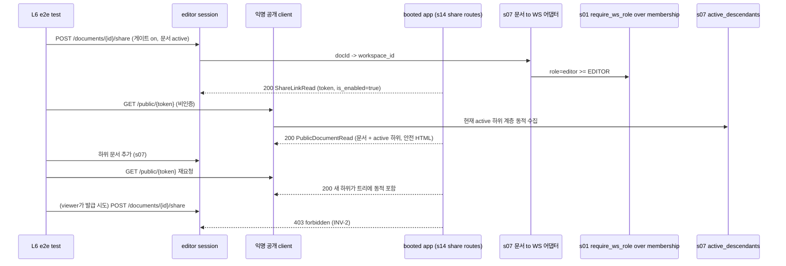
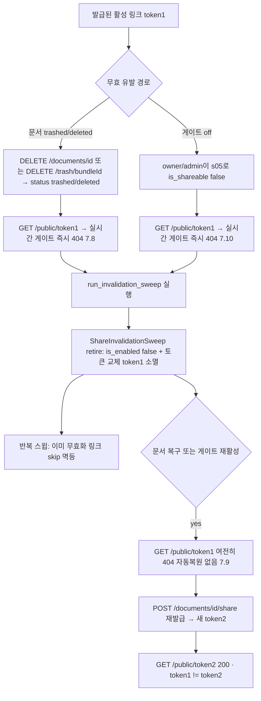
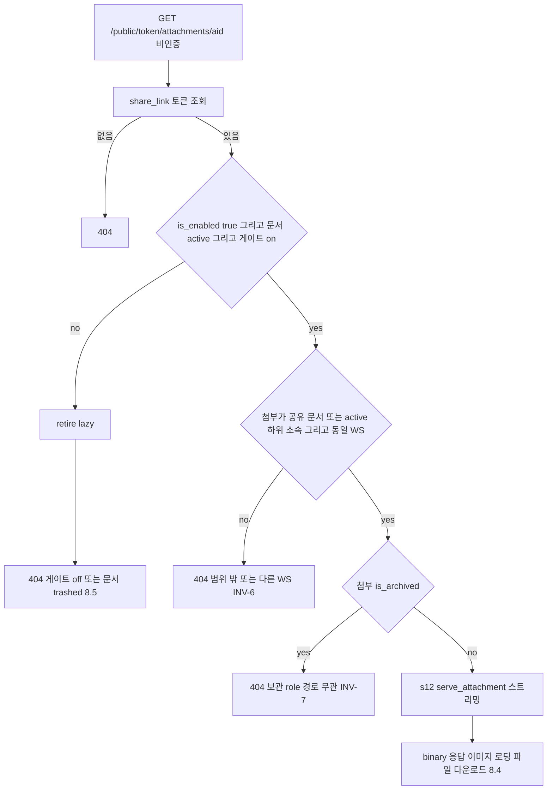
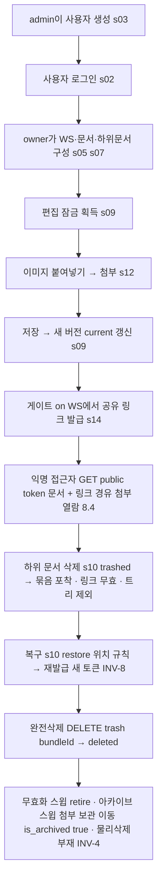
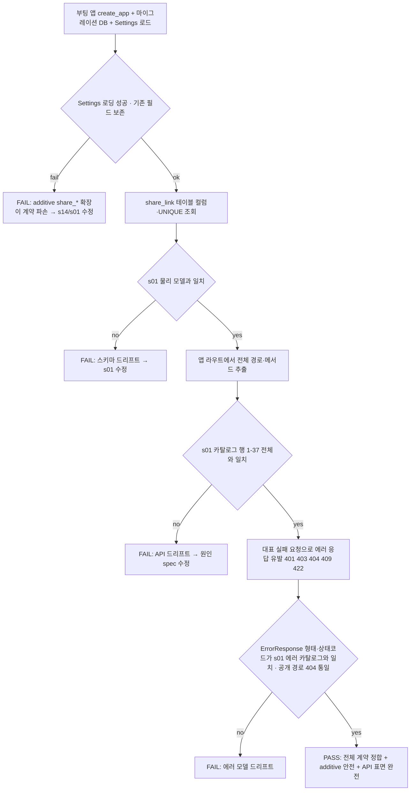

# Design Document — s15-integration-check-L6

## Overview

**Purpose**: `s15-integration-check-L6`는 **L6 누적 통합 검증 체크포인트이자 전체 시스템의 최종 e2e 체크포인트**다.
계층 6(sharing) 완성 = 전체 시스템 완성이므로, 이 시점까지 완성된 upstream 누적 집합 전체(`s01-contract-foundation`
⊕ `s02-auth` ⊕ `s03-admin-account` ⊕ `s05-workspace` ⊕ `s07-document-core` ⊕ `s09-lock-version` ⊕ `s10-trash` ⊕
`s12-attachment` ⊕ `s14-sharing` = **전체 시스템**)이 `s01` 단일 계약 소스와 정합하는지, 그리고 이번 계층에서 처음
결합되는 경계(**공유 링크 무효화·재발급(INV-8) ↔ 문서 status·워크스페이스 게이트 ↔ 링크 경유 첨부 접근**)와 **전
계층 관통 결합**이 실제 결합 상태에서 성립하는지 mock 없이 검증한다. 산출물은 **integration/e2e 테스트 자산과 게이트
판정 기록**뿐이며, feature 로직·엔드포인트·스키마·마이그레이션·상태 엔진·조정 서비스·스케줄러를 신규 구현하지 않는다.

검증 초점은 세 개의 계층 간 트리거와 하나의 전 계층 관통 흐름이다. (1) **무효화·재발급(INV-8, 7.8·7.9·7.10)**:
`s10`/`s07`이 문서를 trashed/deleted로 전이시키거나 `s05`가 게이트를 off로 두면 `s14`가 그 관측 가능한 결과를 근거로
공개 접근을 실시간 게이트로 즉시 차단하고 조정 스윕(`ShareInvalidationSweep`)으로 링크를 retire(비활성 + 토큰 교체)
한다. 문서 복구·게이트 재활성 후에도 이전 토큰은 소멸했으므로 재발급(새 토큰)만이 다시 공유를 가능케 한다. 사용자
조작 토글만 동일 토큰을 유지하는 유일한 상태 기반 예외다(7.7). (2) **링크 경유 첨부 접근·연동 차단(8.4·8.5, L5↔L6)**:
활성 링크로 공유 문서(및 현재 active 하위)에 속한 첨부를 `s12` 서빙 재사용으로 스트리밍하되(8.4), 게이트 off·문서
trashed 시 파일 접근도 함께 404(8.5)이고 보관 첨부는 role·경로 무관 404(INV-7), 서브트리 밖·다른 WS 첨부는
404(INV-6)다. (3) **문서 status·WS `is_shareable` ↔ 공유 링크 상호작용(7.8~7.10)**: 무효화가 문서 status·게이트라는
관측 결과에만 근거해 성립하며 하위 계층은 상위 계층(s14)을 알지 못한다(의존 방향 준수). (4) **전 계층 관통 e2e**:
한 사용자 여정이 auth → workspace → document → lock/version → trash → attachment → sharing 전체를 관통하고, 그
과정에서 12개 불변식(INV-1~12)이 완전히 조립된 시스템에서 모두 성립하는지 관찰한다. 조정 항목으로 `s14`가 `s01`
`Settings`에 additive로 추가한 `share_token_bytes`·`share_invalidation_sweep_interval_seconds`와 무효화 스케줄러
lifespan 결합이 `s01` Settings 로딩·앱 부팅을 회귀시키지 않는지 실제 부팅으로 확인한다.

**Users**: 로드맵 게이트 관리자가 이 체크포인트의 통과 여부로 **게이트(G-1 규칙)의 종단**을 판정한다 — 통과하면 전체
시스템이 GO 상태가 된다(downstream 없음). upstream 구현자는 이 체크포인트를 공유 생명주기·계층 간 트리거·전 계층
불변식 회귀의 최종 경보로 사용한다. 어떤 계층 수정 시에도 이 최종 체크포인트는 항상 재실행된다(재검증 트리거의 종단).

**Impact**: 현재 `backend/`에는 s01 공용 인프라 + s02~s12 도메인 + s14 `app/sharing/`(라우터·`ShareLinkService`·
`PublicShareService`·`ShareInvalidationSweep`·`ShareInvalidationScheduler`·`ShareLinkRepository`·문서→WS 어댑터
재사용·Settings additive 확장) 구현이 존재하고, `s13-integration-check-L5`의 `backend/tests/integration_L5/`
하네스(그리고 그것이 재사용하는 `integration_L4`/`L3`/`L2`/`L1`)가 존재한다(가정). 이 체크포인트는 그 위에
`backend/tests/integration_L6/` 테스트 스위트만 추가하며, **L5 하네스를 재사용·확장**하고 어떤 애플리케이션 코드도
수정하지 않는다.

### Goals

- 실제 결합(마이그레이션된 DB + 부팅 앱(s14 공유 라우터·무효화 스케줄러 포함) + 실제 세션 + 실제 멤버십 데이터 +
  실제 파일시스템 저장/보관 폴더 + 실제 `ShareInvalidationSweep` + 실제 `DocumentStateEngine`/`RetentionSweepService`/
  `ArchivalSweepService`)에서 계약 대조: `share_link` 스키마·공유 API(행 34~37)·`ShareLinkRead`/`ShareLinkUpdate`/
  `PublicDocumentRead`·공개 접근 계약·에러 모델·Base Schemas·**전체 API 표면(행 1~37)** 이 `s01` 단일 소스와 일치.
- **Settings additive 조정 항목** 검증: `share_token_bytes`·`share_invalidation_sweep_interval_seconds` 추가가
  `s01` `Settings` 계약 로딩을 깨지 않고 기존 필드 보존·단일 접근자 유지·무효화 스케줄러 결합 부팅 회귀 부재.
- 공유 발급·토글·공개 렌더·동적 하위 흐름 e2e: 게이트 하 발급(7.1·7.3)·공개 읽기전용 렌더(7.4)·동적 active
  하위(7.5·7.6)·토글 off/on 동일 토큰(7.7)·viewer 발급 403(INV-2)·admin bypass(INV-3).
- **무효화·재발급(INV-8, 7.8·7.9·7.10)**: 문서 trashed/deleted·게이트 off 관측 → 실시간 게이트 즉시 404 → 조정
  스윕 retire(토큰 교체) → 복구·게이트 재활성 후에도 이전 토큰 무효·재발급(새 토큰)만 유효·멱등. 실제 스윕 실행으로
  DB 부수효과 관찰.
- **링크 경유 첨부 접근·연동 차단(8.4·8.5)**: 활성 링크 이미지/파일 다운로드·참조 재작성(8.4)·게이트 off·문서
  trashed 시 파일 함께 차단(8.5)·보관 첨부 404(INV-7)·서브트리 밖/다른 WS 404(INV-6). `s12` 서빙 재사용.
- **전 계층 불변식 회귀(INV-1~12)**: 완전히 조립된 시스템에서 12개 불변식이 모두 성립.
- **대표 전 계층 관통 e2e 여정**: admin 사용자 생성 → owner WS·문서·하위 구성 → 잠금·저장(버전) → 이미지 붙여넣기
  → 공유 발급·외부 열람(첨부 포함) → 하위 삭제(묶음·링크 무효) → 복구·재발급 → 완전삭제(첨부 보관 이동).
- 게이트(G-1 규칙, L6 종단 = 전체 시스템 GO) 통과/미통과 판정과 재검증 트리거 대상(전체 upstream)을 명확히 산출.

### Non-Goals

- 새로운 feature 동작·엔드포인트·서비스·스키마·마이그레이션·상태 엔진·조정 서비스·스케줄러 구현(s01~s14 소유, 완료
  가정).
- 개별 spec 단위 검증의 재실행(각 spec 자체 테스트 소유). 체크포인트는 결합·경계만 본다.
- 발견된 계약 위반의 수정(원인 spec에서 수정 후 재실행).
- **범위 밖 기능**(`docs/projects.md` §6): 문서 검색·과거버전 rollback·lock 자동 타임아웃·실시간 동시편집(CRDT)·
  self sign-up/SSO/OAuth·보관 폴더 자동 정리·다중 admin·자식→부모 자동 재중첩. 검증 대상이 아니다.
- **후속 계층**: 없음. L6은 최종 체크포인트이며 downstream이 없다.

## Boundary Commitments

### This Spec Owns

- **L6 통합 테스트 스위트**(`backend/tests/integration_L6/`): mock을 쓰지 않는 실제 전체 결합 환경 위에서 공유 계약
  대조·전체 API 표면·Settings additive 조정 항목·발급/토글/공개 렌더 흐름·무효화·재발급(INV-8)·링크 경유 첨부 접근·
  연동 차단·전 계층 불변식(INV-1~12) 회귀·대표 전 계층 관통 e2e 여정을 검증하는 스위트.
- **L6 하네스 확장**: `s13` `integration_L5` 하네스(및 그것이 재사용하는 `integration_L4`/`L3`/`L2`/`L1`: 마이그레이션·
  앱 부팅·admin 시드·세션 유지 클라이언트·워크스페이스/멤버/role 세션·문서 트리·엔진 세션·두 editor 세션·잠금/저장/
  휴지통 헬퍼·`now` 주입 retention·아카이브 스윕·첨부 업로드/서빙·파일시스템 관찰 픽스처)를 **재사용**하고, 공유 링크
  발급/토글 헬퍼, 공개 렌더/공개 파일 조회 헬퍼(비인증 클라이언트), `now` 주입 없는(관측 기반) `ShareInvalidationSweep`/
  `run_invalidation_sweep` 호출 픽스처, share_link 토큰 교체·`is_enabled` 관찰 DB 헬퍼, 워크스페이스 `is_shareable`
  토글 헬퍼(`s05` 경로)만 신규 추가.
- **게이트 판정·재검증 트리거 기록**: 스위트 전체 통과를 게이트(G-1 규칙, L6 종단 = 전체 시스템 GO) 통과 조건으로
  집계하고 재검증 대상(전체 upstream s01/s02/s03/s05/s07/s09/s10/s12/s14)을 명시.

### Out of Boundary

- 애플리케이션 코드 일체(`app/common/*`, `app/auth/*`, `app/admin_account/*`, `app/workspace/*`, `app/document/*`,
  `app/lock_version/*`, `app/trash/*`, `app/attachment/*`, `app/sharing/*`, `app/models/*`, `config.yml`,
  마이그레이션). 체크포인트는 이들을 **소비·관찰만** 하고 수정하지 않는다.
- `s13`의 `integration_L5` 스위트·하네스, `s11` `integration_L4`·`s08` `integration_L3`·`s06` `integration_L2`·
  `s04` `integration_L1` 자산의 **정의 변경**. L6은 이를 **재사용**만 하고 하위 하네스를 수정하지 않는다.
- 공유 발급·토글·공개 렌더·링크 경유 파일 서빙·무효화 조정·스케줄러 동작 정의(s14), 문서 상태 전이·복구·묶음 엔진
  (s07·s10), 편집 잠금·저장·버전(s09), 첨부 저장·서빙·보관 이동(s12), 게이트 설정·멤버십(s05), 로그인·계정 관리
  (s02·s03)의 동작 정의. 검증 대상이지 구현 대상 아님.
- 계약 문서(카탈로그·불변식·에러 카탈로그·resolver 계약·Settings 스키마·물리 모델) 자체의 **정의·완전성**(s01 소유).
- 검증 실패의 코드 수정 — 원인 upstream spec에서 처리.
- `docs/projects.md` §6 범위 밖 기능(검색·rollback·CRDT 등).

### Allowed Dependencies

- **Upstream(검증 대상, 실제 구현 결합)**: `s01`·`s02`·`s03`·`s05`·`s07`·`s09`·`s10`·`s12`·`s14`의 실제 구현.
- **재사용 대상(하네스)**: `s13-integration-check-L5`의 `tests/integration_L5/conftest.py`·`helpers.py`(및 그것이
  재사용하는 `integration_L4`/`L3`/`L2`/`L1`): 마이그레이션·부팅·admin 시드·세션 클라이언트·워크스페이스/멤버/role
  세션·문서 트리·엔진 세션·두 editor 세션·잠금/저장/휴지통·`now` 주입 retention·아카이브 스윕·첨부 업로드/서빙·
  파일시스템 관찰 픽스처.
- **대조 기준(single source of truth)**: `s01-contract-foundation/design.md`(§Physical Data Model: `share_link`
  (`document_id`·`token VARCHAR(64) UNIQUE`·`is_enabled`·`created_at`) · §API Endpoint Catalog 행 34~37 및 전체
  카탈로그(행 1~37) · §Errors 에러 코드 카탈로그 · §Settings 스키마 · §Invariants Catalog INV-1~12 · §Common/
  Permissions `Role`·`require_ws_role`·admin bypass · §Base Schemas `TimestampedRead`·`ORMReadModel`·`Page`).
- **Shared infra(테스트 실행)**: FastAPI `TestClient`(Starlette, 쿠키 자 유지 인증 세션 + 비인증 공개 클라이언트 +
  multipart 업로드), SQLAlchemy 2.0(sync) 세션·`information_schema` 조회, `s14` `ShareInvalidationSweep`·
  `run_invalidation_sweep`(스윕 직접 호출), `s10` 완전삭제·`RetentionSweepService`, `s07` `DocumentStateEngine`·복구,
  `s12` `ArchivalSweepService`·`AttachmentService`, 표준 라이브러리 파일 I/O(저장/보관 파일 관찰), Alembic 마이그레이션,
  pytest, MySQL 8, APScheduler(부팅 결합 관찰). 모든 backend 명령은 `backend/`에서 `uv run`.
- **제약**: mock·stub·가짜 구현 금지(실제 결합만; 조정 서비스·스윕·엔진 직접 호출은 실제 s14·s10·s07·s12 코드 실행
  이므로 허용). 설정 접근은 `s01` 단일 `Settings` 경유. 애플리케이션 코드·`config.yml` 무수정. 대조 기준은 개별 spec
  design이 아니라 `s01` 단일 소스. L5 하네스는 재사용하되 중복 신설하지 않는다. share_link 물리 삭제 없음(INV-4) —
  retire(토큰 교체)만 관찰.

### Revalidation Triggers

이 체크포인트는 다음 변경 시 **누적 집합 기준으로 재실행**한다(roadmap §재검증 트리거). 이 체크포인트는 재검증 트리거의
**종단**이므로, 어떤 계층 upstream이 수정되어도 항상 재실행된다. `s14`(L6) 수정 시 이 체크포인트를, `s12`(L5)·
`s09`·`s10`(L4)·`s07`(L3)·`s05`(L2)·`s03`·`s02`(L1) 수정 시 해당 계층 이후 모든 체크포인트(이 최종 체크포인트 포함)를,
`s01`(계약) 수정 시 **모든** 체크포인트를 재실행한다.

- `s01` 계약 변경: `share_link` 스키마(컬럼·`token` UNIQUE·`is_enabled`), 카탈로그 행 34~37 경로·메서드·요구 role·
  요청/응답 스키마 이름(`ShareLinkRead`·`ShareLinkUpdate`·`PublicDocumentRead`), 권한 resolver(`Role` 위계·
  `require_ws_role`·admin bypass), 세션 인증 의존성, 공통 에러 카탈로그, `Settings` 스키마(additive 확장 계약),
  불변식 카탈로그(INV-1~12, 특히 INV-6·8).
- `s14` 변경: 공유 엔드포인트(행 34~37) 계약, 무효화 판정 기준(문서 status·게이트 관측)·retire=비활성+토큰 교체 규약,
  재발급 통일 원칙(토글=상태 기반 예외 ↔ 그 외 새 토큰) 구현, 공개 렌더 동적 active 하위·참조 재작성 규약, 링크 경유
  첨부 서브트리 소속·WS 격리·보관 차단 판정, `share_token_bytes`·`share_invalidation_sweep_interval_seconds` Settings
  필드 규약, 무효화 스케줄러 결합.
- `s12` 변경: 첨부 서빙(`serve_attachment`)·보관 404 규약·저장 격리(링크 경유 파일 접근 근거).
- `s09` 변경: 편집 잠금 단일성(INV-9)·저장 시 버전 생성 계약.
- `s10` 변경: 완전삭제·보관 만료의 deleted 전이·복구 위치 규칙·묶음 규약(무효화 관측 근거, INV-10~12).
- `s07` 변경: 문서→WS 어댑터·`active_descendants`·`MarkdownRenderer`·상태 엔진 primitive(공개 렌더 근거).
- `s02`·`s03`·`s05` 변경: 로그인/세션 게이트, 계정 상태 전이·보존, 워크스페이스/멤버십 role 판정 데이터·게이트 설정.
- 재실행 시에도 mock 없이 실제 구현을 결합한 상태로 검증한다.

## Architecture

### Architecture Pattern & Boundary Map

체크포인트는 애플리케이션 아키텍처를 확장하지 않는다. `tests/integration_L6/` 하나의 테스트 계층이 부팅된 실제
애플리케이션(s14 공유 라우터·무효화 스케줄러 포함 전체 도메인)과 실제 DB(실제 share_link·document·workspace·
attachment·membership 데이터 포함)와 실제 파일시스템(저장/보관 폴더)과 실제 `ShareInvalidationSweep`·
`DocumentStateEngine`·`RetentionSweepService`·`ArchivalSweepService`를 **관찰·호출**하여 s01 단일 소스와 대조한다.
하네스는 L5의 하네스를 재사용·확장한다. 공개 경로(행 36~37)는 인증 우회이므로 비인증 클라이언트로 접근한다.

```mermaid
graph TB
    subgraph Checkpoint_s15[tests integration_L6 - 이 spec 소유]
        Harness[L6 하네스 - L5 하네스 재사용 + 공유 발급/토글/공개 렌더/공개 파일/무효화 스윕/게이트 토글 픽스처]
        ContractSuite[전체 계약 대조 + 전체 API 표면 + Settings additive 스위트]
        ShareFlowSuite[발급 토글 공개렌더 동적하위 게이팅 스위트 7.1-7.7]
        InvalidationSuite[무효화 재발급 스위트 INV-8 7.8 7.9 7.10]
        LinkFileSuite[링크 경유 첨부 접근 연동차단 스위트 8.4 8.5]
        InvariantSuite[전 계층 불변식 회귀 스위트 INV-1~12]
        JourneySuite[대표 전 계층 관통 e2e 여정 스위트]
        Gate[게이트 판정 및 재검증 기록]
    end
    subgraph Reused[tests integration_L5 L4 L3 L2 L1 - 재사용, 무수정]
        L5Harness[L5 하네스 첨부 업로드 서빙 아카이브 스윕 파일시스템]
        LowerHarness[L4 L3 L2 L1 하네스 마이그레이션 부팅 admin시드 세션 워크스페이스 멤버 문서트리 엔진 잠금 휴지통 retention]
    end
    subgraph Under_Test[검증 대상 - 실제 구현 결합, 무수정]
        App[부팅된 FastAPI 앱 create_app - s14 공유 라우터 무효화 스케줄러 조립]
        ShareRoutes[s14 share routes 34-37]
        ShareSvc[s14 ShareLinkService issue toggle]
        PublicSvc[s14 PublicShareService render serve_public_attachment]
        InvSweep[s14 ShareInvalidationSweep invalidate_by_observation run_invalidation_sweep]
        TrashRoutes[s10 trash delete restore purge routes]
        Engine[s07 DocumentStateEngine active_descendants restore]
        WsRoutes[s05 workspace is_shareable 게이트 설정]
        AttServe[s12 AttachmentService serve_attachment]
        ArchiveSvc[s12 ArchivalSweepService]
        Resolver[s01 require_ws_role over real membership]
        Settings[s01 Settings with additive share_* fields]
        FS[(파일시스템 file_storage_root attachment_archive_root)]
        DB[(마이그레이션된 MySQL 8 share_link document workspace attachment member user)]
    end
    subgraph Baseline[대조 기준 - s01 단일 소스]
        Schema[Physical Model share_link]
        Catalog[API Catalog 34-37 및 전체 1-37]
        ErrModel[Errors 코드 카탈로그]
        SettingsContract[Settings 스키마]
        INV[Invariants INV-1~12]
        PermContract[Common Permissions Role require_ws_role bypass]
        BaseSch[Base Schemas TimestampedRead Page]
    end
    Harness --> L5Harness
    L5Harness --> LowerHarness
    Harness --> App
    Harness --> InvSweep
    Harness --> Engine
    Harness --> WsRoutes
    Harness --> FS
    Harness --> DB
    ContractSuite --> App
    ContractSuite --> Settings
    ContractSuite --> DB
    ContractSuite -.대조.-> Schema
    ContractSuite -.대조.-> Catalog
    ContractSuite -.대조.-> ErrModel
    ContractSuite -.대조.-> SettingsContract
    ContractSuite -.대조.-> BaseSch
    ShareFlowSuite --> ShareRoutes
    ShareFlowSuite --> ShareSvc
    ShareFlowSuite --> PublicSvc
    ShareFlowSuite --> Resolver
    ShareFlowSuite -.대조.-> PermContract
    ShareFlowSuite -.대조.-> INV
    InvalidationSuite --> TrashRoutes
    InvalidationSuite --> WsRoutes
    InvalidationSuite --> InvSweep
    InvalidationSuite --> PublicSvc
    InvalidationSuite -.대조.-> INV
    LinkFileSuite --> PublicSvc
    LinkFileSuite --> AttServe
    LinkFileSuite --> ArchiveSvc
    LinkFileSuite -.대조.-> INV
    InvariantSuite --> App
    InvariantSuite --> Engine
    InvariantSuite --> Resolver
    InvariantSuite --> DB
    InvariantSuite -.대조.-> INV
    JourneySuite --> App
    JourneySuite --> ShareRoutes
    JourneySuite --> TrashRoutes
    JourneySuite --> FS
    JourneySuite -.대조.-> INV
    Gate --> ContractSuite
    Gate --> ShareFlowSuite
    Gate --> InvalidationSuite
    Gate --> LinkFileSuite
    Gate --> InvariantSuite
    Gate --> JourneySuite
```



**Architecture Integration**:
- **Selected pattern**: 테스트 전용 검증 계층(외부 관찰자 + 조정 서비스/스윕/엔진 재사용 소비자). 실제 전체 결합
  e2e로 공유 생명주기·계층 간 트리거(INV-8·8.4·8.5)·전 계층 불변식 회귀를 최종 포착.
- **Domain/feature boundaries**: 체크포인트는 어떤 도메인 코드도 소유하지 않는다. `tests/integration_L6/`만 소유하고
  `tests/integration_L5/`(및 그 하위) 하네스를 재사용한다.
- **Existing patterns preserved**: uv 실행 표준, 단일 `Settings`, 부팅 앱(`create_app`)·마이그레이션 재사용, mock
  금지, 물리 삭제 없음(INV-4) 관찰, `s13` 하네스 패턴 확장, 상태/bundle 규칙 단일 구현(s07 엔진)·권한 판정 단일 구현
  (s01 resolver)·무효화 조정 단일 구현(s14)·첨부 서빙 단일 구현(s12) 소비.
- **New components rationale**: 신규는 L6 스위트와 공유 발급/토글/공개 렌더/공개 파일/무효화 스윕/게이트 토글 헬퍼뿐.
  각 스위트는 단일 검증 관심사(계약+API표면+Settings/공유흐름/무효화재발급/링크파일/전계층불변식/관통여정).
- **Steering compliance**: 대조 기준을 s01 단일 소스로 고정(드리프트 방지). 권한 판정은 s01 resolver 단일 구현을 실제
  데이터로 관찰, 상태/bundle 규칙은 s07 엔진, 무효화 조정은 s14, 첨부 서빙은 s12 단일 구현을 소비(structure.md
  단일화 원칙). 설정은 단일 Settings additive 확장을 관찰(모듈별 파일 부재 확인). mock 금지로 실제 결합 검증.

### Dependency Direction (강제)
```
s01 단일 소스(대조 기준)  ←대조←  Contract/ShareFlow/Invalidation/LinkFile/Invariant/Journey 스위트  ←관찰·호출←  부팅 앱 + s14 무효화 스윕/공개 서비스 + s10 삭제/복구/스윕 + s07 엔진 + s12 첨부 서빙 + 파일시스템 + 마이그레이션 DB
                                                    ↑
                          L6 하네스(conftest) = L5 하네스 재사용 + 공유 발급/토글/공개 렌더/공개 파일/무효화 스윕/게이트 토글 픽스처
```
테스트 계층은 애플리케이션을 **관찰·호출**만 하고 역방향으로 코드를 수정하지 않는다. L6 하네스는 `s01` `create_app`·
마이그레이션·`Settings`·`s14` `ShareInvalidationSweep`/`run_invalidation_sweep`·`s10` 완전삭제/`RetentionSweepService`·
`s07` `DocumentStateEngine`·`s12` `ArchivalSweepService`와 `s13` L5 하네스(및 하위 하네스)를 재사용한다.

### Technology Stack

체크포인트는 신규 런타임/라이브러리를 도입하지 않는다(테스트 도구 + s14 무효화 스윕·공개 서비스, s10/s07/s12 소비만
사용).

| Layer | Choice / Version | Role in Feature | Notes |
|-------|------------------|-----------------|-------|
| Test Runner | pytest(`s01` 스택) | 통합/e2e 테스트 실행 | `backend/`에서 `uv run pytest tests/integration_L6` |
| App Under Test | FastAPI `create_app`(s01) | 실제 결합된 부팅 앱 | s02~s12 + **s14 공유 라우터·무효화 스케줄러**가 조립된 상태 |
| HTTP Client | Starlette `TestClient` | role별 인증 세션 쿠키 유지 e2e + **비인증 공개 클라이언트** + multipart 업로드 | owner/editor/viewer/비멤버/admin + 다른 WS 사용자 + 익명(공개 링크) 클라이언트 분리 |
| Invalidation Sweep | `s14` `ShareInvalidationSweep`·`run_invalidation_sweep`(실제 구현) | INV-8 무효화 조정 직접 호출 | 관측 기반 retire·멱등 검증(mock 아님) |
| Public Service | `s14` `PublicShareService`(실제 구현) | 공개 렌더·링크 경유 파일 실시간 게이트 관찰 | 라우터 경유 공개 요청으로 관찰 |
| Trash / Restore | `s10` 완전삭제·`RetentionSweepService`·복구(실제 구현) | 문서 trashed/deleted/복구 유발(무효화 관측 근거) | `now` 주입 retention |
| State Engine | `s07` `DocumentStateEngine`·`active_descendants`·복구(실제 구현) | deleted/복구 유발·동적 active 하위 관찰 | 라우터 밖 재사용 경계 관찰(mock 아님) |
| Workspace Gate | `s05` `is_shareable` 게이트 설정(실제 구현) | 게이트 off/on 유발(7.10) | owner/admin 경로로 실제 설정 |
| Attachment Serve | `s12` `AttachmentService.serve_attachment`·`ArchivalSweepService`(실제 구현) | 링크 경유 파일 서빙·보관 404 | 재사용, 저장/격리/보관 재구현 금지 |
| Storage | 표준 라이브러리 파일 I/O(`pathlib`) | 저장/보관 파일 존재·경로 격리 관찰 | `file_storage_root`/`attachment_archive_root` 기준 |
| Config | `s01` `Settings`(pydantic-settings, additive `share_*`) | Settings 로딩·기존 필드 보존 관찰 | 단일 접근자 경유, 모듈별 파일 부재 확인 |
| Data / ORM | SQLAlchemy 2.0(sync, s01) | share_link·document·workspace·`information_schema` 조회 | 스키마 대조·`is_enabled`·`token` 교체 관찰 |
| Migration | Alembic(s01) | 검증용 스키마 준비 | `uv run alembic upgrade head`; s14 새 마이그레이션 부재 확인 |
| DB | MySQL 8 | 실제 결합 저장소(실제 공유/문서/워크스페이스/첨부/멤버십 데이터) | mock 금지 — 실 DB 필수 |
| Scheduler | `s14` `ShareInvalidationScheduler` + APScheduler(부팅 결합) | lifespan 기동/미기동 관찰 | `share_invalidation_sweep_interval_seconds` `>0`/`<=0` 분기 관찰 |
| Reused Harness | `s13` `tests/integration_L5`(+`L4`/`L3`/`L2`/`L1`) | 마이그레이션·부팅·admin 시드·세션·워크스페이스/멤버·문서 트리·엔진·잠금·휴지통·retention·아카이브·첨부 | 재사용·확장(중복 신설 금지) |

> 신규 외부 의존성 없음. 스택 근거는 `s01` design·research 및 `s14`/`s13` design 참조.

## File Structure Plan

### Directory Structure
```
backend/tests/integration_L6/                     # s15 체크포인트 소유(신규, 테스트 전용)
├── __init__.py
├── conftest.py                                    # L6 하네스: L5 하네스(마이그레이션·부팅·admin 시드·세션 클라이언트·
│                                                  #   워크스페이스/멤버/role 세션·문서 트리·엔진 세션·두 editor·잠금·
│                                                  #   휴지통·retention·아카이브 스윕·첨부 업로드/서빙·파일시스템 관찰)
│                                                  #   재사용 + 공유 발급/토글·공개 렌더/공개 파일(비인증)·무효화 스윕
│                                                  #   호출·게이트 토글·share_link 토큰/is_enabled 관찰 픽스처
├── helpers.py                                     # 공유 발급(POST share)·토글(PATCH share)·공개 렌더(GET public token)·
│                                                  #   공개 파일(GET public token attachments aid)·is_shareable 게이트
│                                                  #   토글(s05)·run_invalidation_sweep/ShareInvalidationSweep 호출·
│                                                  #   share_link DB 관찰 래퍼 (L5 잠금/저장/휴지통/복구/아카이브/첨부
│                                                  #   헬퍼 재사용)
├── test_cumulative_contract_conformance.py        # share_link 스키마·API(34~37)·전체 API 표면·ShareLinkRead/Update·PublicDocumentRead·에러·Base·Settings additive (REQ-2)
├── test_share_lifecycle_flow.py                   # 게이트 하 발급·토글·공개 렌더·동적 하위·게이팅 (REQ-3, 7.1~7.7)
├── test_invalidation_reissue.py                   # 문서 trashed/복구·게이트 off/on·retire·재발급·멱등 (REQ-4, INV-8, 7.8~7.10)
├── test_link_attachment_access.py                 # 링크 경유 첨부 접근·연동 차단·보관·범위/격리 (REQ-5, 8.4·8.5)
├── test_full_stack_invariants.py                  # 전 계층 불변식 INV-1~12 회귀 (REQ-6)
└── test_end_to_end_journey.py                     # 대표 전 계층 관통 e2e 여정 (REQ-7)
```

### Modified Files
- 없음. 체크포인트는 애플리케이션 코드와 `s13`/`s11`/`s08`/`s06`/`s04` 하네스 자산, `config.yml`을 수정하지 않는다.
  (`conftest.py`가 필요로 하는 테스트 설정은 `s01` `Settings`/`config.yml`의 기존 값(additive `share_token_bytes`·
  `share_invalidation_sweep_interval_seconds`·`attachment_*` 포함)과 L5/L4/L3/L2/L1 하네스를 재사용하며 별도 설정
  파일을 신설하지 않는다.)

> `tests/integration_L6/*`은 `s01`~`s14`의 공개 표면(부팅 앱·공유 라우트·`ShareLinkService`·`PublicShareService`·
> `ShareInvalidationSweep`·`run_invalidation_sweep`·`s10` 완전삭제/복구/`RetentionSweepService`·`s07` 엔진·`s12`
> `AttachmentService`/`ArchivalSweepService`·`s05` 게이트 설정·`Settings`·DB·파일시스템)과 `s13` L5 하네스만 소비하고,
> 대조 기준으로 `s01` design의 계약 요소를 참조한다. 게이트 판정 결과는 테스트 실행 결과(전부 통과 = 게이트 통과 =
> 전체 시스템 GO)로 산출된다.

## System Flows

### 공유 발급 → 공개 렌더 → 동적 하위 (REQ-3, 7.1·7.3·7.4·7.5·7.6)

- **게이트 조건**: 발급은 `require_ws_role(EDITOR)`(문서→WS)·게이트 on·문서 active. 공개 경로는 인증 우회, 접근 범위는
  토큰·게이트·문서 status·WS 격리로 제한. 하위 계층은 접근 시점의 현재 active 하위를 `s07` `active_descendants`로 동적
  수집(7.5·7.6). 실패 시 s14 발급·게이트 또는 s01/s05/s07 결합 회귀를 가리킨다.

### 무효화·재발급 (REQ-4, INV-8, 7.8·7.9·7.10) — status·게이트 관측 retire

- **판정 요지**: s14는 상태 전이·게이트 설정을 수행하지 않고 `document.status`·`workspace.is_shareable`라는 관측 가능한
  결과를 스캔해 판정한다(7.8·7.10·REQ-4.5). 실시간 공개 게이트가 스윕 이전에도 무효 접근을 즉시 차단하므로 while-invalid
  보장은 스윕 주기와 무관하다. retire는 물리 삭제 없이 `is_enabled=false` + 토큰 교체로 이전 토큰을 영구 무효화(INV-8).
  복구·게이트 재활성 후에도 토큰이 교체됐으므로 이전 URL은 되살아나지 않고 재발급(POST)이 필요하다(7.9·7.10). 이미
  무효화된 링크는 스코프에서 제외되어 멱등(REQ-4.2). 실패 시 무효화·재발급 계층 간 트리거(s14↔s10/s07/s05) 결합 회귀를
  가리킨다.

### 링크 경유 첨부 접근·연동 차단 (REQ-5, 8.4·8.5)

- **판정 요지**: 파일 접근 유효성은 공개 렌더와 동일(게이트·status). 게이트 off·문서 trashed면 파일도 함께 차단(8.5).
  첨부는 공유 문서 또는 그 현재 active 하위에 속하고 동일 WS여야 한다(범위·격리, INV-6). 보관된 첨부·부재는 `s12`
  `serve_attachment`가 role·경로 무관 404로 처리(INV-7). s14는 저장·격리·보관 판정을 재구현하지 않고 s12 서빙을
  재사용한다. 실패 시 링크 경유 파일 계층 간 트리거(s14↔s12) 결합 회귀를 가리킨다.

### 대표 전 계층 관통 e2e 여정 (REQ-7)

- **판정 요지**: 하나의 사용자 여정이 auth·admin·workspace·document·lock/version·trash·attachment·sharing 전체를
  관통한다. 각 단계는 실제 세션·멤버십·문서 트리·잠금·버전·첨부·공유·삭제·복구·완전삭제·보관 이동으로 성립하며, 그
  과정에서 INV-1~12가 유지된다. 실패 시 어느 계층 결합이 전체 흐름에서 깨지는지 여정 단계별 assertion이 지목한다.

### 전체 계약 대조 · Settings additive · 전체 API 표면 판정


## Requirements Traceability

| Requirement | Summary | Components | Interfaces / Contracts | Flows |
|-------------|---------|------------|------------------------|-------|
| 1.1–1.6 | mock 없는 전체 실제 결합·s01 단일 소스·feature 미구현·L5 하네스 확장·위반은 원인 spec 수정·무효화 스윕 실제 실행 | L6TestHarness, 전 스위트 | 실 DB·파일시스템·부팅 앱·인증/비인증 세션 클라이언트·무효화 스윕·L5 하네스 재사용 | 전 흐름 공통 |
| 2.1 | share_link 스키마 s01 일치·마이그레이션 무추가 | CumulativeContractConformanceSuite | `information_schema`/ORM ↔ s01 physical model | 계약 대조 |
| 2.2 | 카탈로그 34~37 + 전체 API 표면(1~37) 노출 정합 | CumulativeContractConformanceSuite | 앱 라우트 ↔ s01 카탈로그 전체 | 계약 대조 |
| 2.3 | 에러 응답 형태·상태코드·공개 경로 404 통일 | CumulativeContractConformanceSuite | `ErrorResponse` ↔ s01 에러 카탈로그 | 계약 대조 |
| 2.4 | ShareLinkRead/Update·PublicDocumentRead·바이너리 응답 | CumulativeContractConformanceSuite | Base Schemas ↔ s01 규약 | 계약 대조 |
| 2.5 | Settings additive `share_*` 로딩 안전·기존 필드 보존·단일 접근자 | CumulativeContractConformanceSuite | `Settings`/`get_settings` ↔ s01 스키마 | Settings 조정 |
| 2.6 | 무효화 스케줄러 결합 부팅 회귀 부재·`>0`/`<=0` 분기 | CumulativeContractConformanceSuite | `create_app` lifespan ↔ `ShareInvalidationScheduler` | Settings 조정 |
| 3.1 | 게이트 하 발급·게이트 off 발급/활성화 거부 | ShareLifecycleFlowSuite | `POST/PATCH /documents/{id}/share` | 공유 발급 |
| 3.2 | 공개 읽기전용 렌더·안전 HTML·문서+active 하위 | ShareLifecycleFlowSuite | `GET /public/{token}` | 공개 렌더 |
| 3.3 | 동적 하위 포함·trashed 제외 | ShareLifecycleFlowSuite, (s07 active_descendants) | `render_public_document` | 공개 렌더 |
| 3.4 | 토글 off/on 동일 토큰 | ShareLifecycleFlowSuite | `PATCH /documents/{id}/share` | 토글 |
| 3.5 | 발급/토글 게이팅·viewer 403·비멤버·미인증·admin bypass | ShareLifecycleFlowSuite | `require_ws_role`·문서→WS | 발급/토글 |
| 4.1 | 문서 trashed/deleted 즉시 무효(실시간 게이트) | InvalidationReissueSuite | `GET /public/{token}` 404 | 무효화·재발급 |
| 4.2 | 무효화 스윕 retire(토큰 교체)·멱등 | InvalidationReissueSuite | `invalidate_by_observation`/`run_invalidation_sweep` | 무효화·재발급 |
| 4.3 | 복구 후 이전 토큰 무효·재발급 새 토큰 | InvalidationReissueSuite | `POST /trash/{bundleId}/restore` + 재발급 | 무효화·재발급 |
| 4.4 | 게이트 off 즉시 무효·재 on 재발급 | InvalidationReissueSuite | `s05` 게이트 토글 + 재발급 | 무효화·재발급 |
| 4.5 | 관측 기반 조정·s14 전이 미수행·while-invalid 스윕 무관 | InvalidationReissueSuite | 문서 status·게이트 관측 | 무효화·재발급 |
| 5.1 | 링크 경유 첨부 스트리밍·참조 재작성(8.4) | LinkAttachmentAccessSuite | `GET /public/{token}/attachments/{aid}` | 링크 파일 |
| 5.2 | 게이트 off·문서 trashed 시 파일 함께 차단(8.5) | LinkAttachmentAccessSuite | 실시간 게이트 | 링크 파일 |
| 5.3 | 보관 첨부 role·경로 무관 404 | LinkAttachmentAccessSuite, (s12 serve_attachment) | 보관 404 | 링크 파일 |
| 5.4 | 서브트리 밖/다른 WS 첨부 404(INV-6) | LinkAttachmentAccessSuite | 소속·격리 검사 | 링크 파일 |
| 5.5 | s12 서빙 재사용·저장/격리/보관 재구현 부재 | LinkAttachmentAccessSuite | `serve_attachment`·`AttachmentRepository.get` | 링크 파일 |
| 6.1 | 권한 WS 단위(INV-1)·viewer 읽기전용(INV-2)·admin override(INV-3) | FullStackInvariantSuite | `require_ws_role` over membership | 전 계층 |
| 6.2 | 물리 삭제 부재(INV-4, user·document·attachment·share_link) | FullStackInvariantSuite, FS 헬퍼 | DB 관찰 | 전 계층 |
| 6.3 | 이동 사이클 없음(INV-5)·WS 경계(INV-6) | FullStackInvariantSuite | `POST /documents/{id}/move`·격리 | 전 계층 |
| 6.4 | 복원 없음(INV-7)·무효화 재발급(INV-8)·잠금 단일성(INV-9) | FullStackInvariantSuite | 복원 부재·retire·`lock_user_id` | 전 계층 |
| 6.5 | 묶음 원자·비병합(INV-10)·자식 먼저 trash(INV-11)·보관 만료 독립(INV-12) | FullStackInvariantSuite | bundle·`trashed_at`·retention | 전 계층 |
| 7.1–7.5 | 대표 전 계층 관통 e2e 여정 | EndToEndJourneySuite | 전 라우트·엔진·스윕 결합 | 관통 여정 |
| 8.1–8.4 | 게이트 판정·재검증 트리거·환경 미충족 실패 | GateVerdict | 전 스위트 결과 집계 | — |

## Components and Interfaces

| Component | Domain/Layer | Intent | Req Coverage | Key Dependencies (P0/P1) | Contracts |
|-----------|--------------|--------|--------------|--------------------------|-----------|
| L6TestHarness | Test/Fixture | 실 전체 결합 환경(L5 하네스 재사용 + 공유 발급/토글/공개 렌더/공개 파일/무효화 스윕/게이트 토글) | 1,2,3,4,5,6,7 | s13 L5 하네스 (P0), s01 create_app (P0), s14 ShareInvalidationSweep (P0), s10 완전삭제/복구 (P0), s07 Engine (P0), s05 게이트 (P0), s12 서빙 (P0), Alembic (P0), MySQL (P0), 파일시스템 (P0) | State |
| Helpers | Test/Support | 공유 발급·토글·공개 렌더·공개 파일·게이트 토글·무효화 스윕·share_link 관찰 래퍼(L5 헬퍼 재사용) | 3,4,5,6,7 | L6TestHarness (P0), s13 L5 helpers (P0) | Service |
| CumulativeContractConformanceSuite | Test/Contract | share_link 스키마·API(34~37)·전체 API 표면·ShareLinkRead/Update·PublicDocumentRead·에러·Base·Settings additive 대조 | 2 | L6TestHarness (P0), s01 단일 소스 (P0) | Batch |
| ShareLifecycleFlowSuite | Test/E2E | 게이트 하 발급·토글·공개 렌더·동적 하위·게이팅 | 3 | L6TestHarness (P0), Helpers (P0), s07 active_descendants (P0) | Batch |
| InvalidationReissueSuite | Test/E2E+Batch | 문서 trashed/복구·게이트 off/on·retire·재발급·멱등 (INV-8) | 4 | L6TestHarness (P0), Helpers (P0), s14 ShareInvalidationSweep (P0), s10 삭제/복구 (P0), s05 게이트 (P0) | Batch |
| LinkAttachmentAccessSuite | Test/E2E | 링크 경유 첨부 접근·연동 차단·보관·범위/격리 (8.4·8.5) | 5 | L6TestHarness (P0), Helpers (P0), s12 AttachmentService·ArchivalSweepService (P0) | Batch |
| FullStackInvariantSuite | Test/E2E | 전 계층 불변식 INV-1~12 회귀 | 6 | L6TestHarness (P0), Helpers (P0), s13 L5/L4 helpers (P0) | Batch |
| EndToEndJourneySuite | Test/E2E | 대표 전 계층 관통 e2e 여정 | 7 | L6TestHarness (P0), Helpers (P0) | Batch |
| GateVerdict | Test/Report | 게이트 판정·재검증 트리거 기록 | 8 | 전 스위트 (P0) | Batch |

### Test / Fixture

#### L6TestHarness
| Field | Detail |
|-------|--------|
| Intent | mock 없는 실제 전체 결합 검증 환경 제공(L5 하네스 재사용·확장 + 공유·무효화 스윕·게이트 토글·공개 접근) |
| Requirements | 1.1, 1.2, 1.3, 1.4, 1.6, 2.1, 3.1, 4.1, 5.1, 6.1, 7.1 |

**Responsibilities & Constraints**
- `s13` `tests/integration_L5`의 하네스 픽스처(마이그레이션 `alembic upgrade head`·`s01` `create_app()` 부팅·admin
  시드·세션 유지 `TestClient` 팩토리·고유 login_id 생성기·워크스페이스 생성·멤버 추가(role)·role별 세션 클라이언트·
  문서 트리 생성·부팅 앱과 동일 `SessionLocal`/`get_db` 세션의 `DocumentStateEngine` 접근·두 editor(A·B) 세션·잠금/
  저장·휴지통 삭제·복구·`now` 주입 `RetentionSweepService`·아카이브 스윕·첨부 업로드/서빙·파일시스템 관찰)를
  **재사용**한다. 동일 하네스를 중복 정의하지 않는다.
- 부팅 앱은 s02·s03·s05·s07·s09·s10·s12·**s14 공유 라우터 + 무효화 스케줄러가 조립된 상태**여야 한다(공유 발급·토글·
  공개 렌더·링크 경유 파일 라우트 노출, lifespan 무효화 스케줄러 훅 결합).
- 공유 시나리오 픽스처 신규 추가: 게이트 on 워크스페이스의 active 문서에 editor가 링크를 발급(`POST /documents/{id}/
  share`)하고, `PATCH /documents/{id}/share`로 토글하며, **비인증 공개 클라이언트**로 `GET /public/{token}`·`GET
  /public/{token}/attachments/{aid}`에 접근하는 셋업 제공.
- 무효 유발 픽스처: 공유 문서를 `DELETE /documents/{id}`(trashed)·`DELETE /trash/{bundleId}`(deleted)로 전이하거나,
  `s05` 경로로 워크스페이스 `is_shareable`를 false로 두거나, `POST /trash/{bundleId}/restore`로 복구하는 셋업(L5
  헬퍼 재사용).
- 무효화 스윕 접근 픽스처 신규 추가: 부팅 앱과 동일 DB 세션으로 `s14` `ShareInvalidationSweep.invalidate_by_observation`
  또는 `run_invalidation_sweep` 엔트리포인트를 호출(실제 s14 코드, mock 아님). 무효화는 관측 기반이므로 `now` 주입이
  아니라 문서 status·게이트 상태를 실제로 만든 뒤 스윕을 호출한다.
- share_link 관찰 픽스처 신규 추가: `share_link.token`·`is_enabled` 값을 DB에서 읽어 retire(토큰 교체 + 비활성)·재발급
  (새 토큰)을 관찰하는 헬퍼. 물리 삭제(DELETE row) 부재 관찰.
- **제약**: 어떤 애플리케이션 코드·`config.yml`·하위 하네스 자산도 수정하지 않는다. mock 미사용(조정 서비스·스윕·엔진
  직접 호출은 실제 s14·s10·s07·s12 코드). 설정은 s01 `Settings` 재사용. DB 미가용·부팅 실패·파일시스템 미가용 시
  스킵이 아니라 **실패** 처리.

**Dependencies**
- Inbound: 전 스위트 — 결합 환경(P0)
- Outbound: s13 L5 하네스(P0); s01 `create_app`·마이그레이션·`Settings`·모델(P0); s14 `ShareInvalidationSweep`·
  `run_invalidation_sweep`·`PublicShareService`(P0); s10 완전삭제·복구·`RetentionSweepService`(P0); s07
  `DocumentStateEngine`·`active_descendants`(P0); s05 게이트 설정(P0); s12 `AttachmentService`·`ArchivalSweepService`(P0);
  MySQL 8(P0); 파일시스템(P0)

**Contracts**: State [x]
- Preconditions: MySQL 8 가용, s01~s14 구현 및 s13 L5 하네스가 배치됨. `config.yml`에 `share_token_bytes`·
  `share_invalidation_sweep_interval_seconds`(s14 additive)·`attachment_*`·`file_storage_root` 존재.
- Postconditions: 마이그레이션된 DB + 부팅 앱(s14 포함) + admin 시드 + role별·두 WS·익명 공개 세션 클라이언트 +
  구성된 워크스페이스/멤버/문서/첨부/공유 링크 + 무효화 스윕 호출 헬퍼 + 게이트 토글 헬퍼 + share_link 관찰 헬퍼 +
  파일시스템 관찰 헬퍼 제공. 테스트 종료 시 정리.
- Invariants: mock 부재. 각 테스트는 고유 login_id·워크스페이스·문서·첨부·토큰으로 상태·경로 격리.

**Implementation Notes**
- Integration: `uv run pytest tests/integration_L6`로 실행. DB URL·저장/보관 루트·주기 설정은 s01 `Settings` 재사용.
- Validation: DB·파일시스템·부팅 실패 시 실패 처리. 인증 세션과 익명 공개 클라이언트는 독립. 무효화 스윕은 관측 기반
  직접 호출(스케줄러 job 대기 금지).
- Risks: 토큰 교체 관찰 비결정성 → 스윕을 `run_invalidation_sweep`로 직접 호출하고 DB에서 토큰 값 비교. 공개/인증
  클라이언트 쿠키 혼선 → 클라이언트 분리.

### Test / Support

#### Helpers
| Field | Detail |
|-------|--------|
| Intent | 공유 발급·토글·공개 렌더·공개 파일·게이트 토글·무효화 스윕·share_link 관찰 래퍼(L5 헬퍼 재사용·확장) |
| Requirements | 3.1, 4.1, 5.1, 6.1, 7.1 |

**Responsibilities & Constraints**
- 공유 헬퍼: `POST /documents/{id}/share`(발급/재발급) 래퍼, `PATCH /documents/{id}/share`(토글) 래퍼, 응답
  `ShareLinkRead`(`token`·`is_enabled`·`share_url`) 관찰.
- 공개 접근 헬퍼: **비인증** 클라이언트로 `GET /public/{token}`(공개 렌더, `PublicDocumentRead` 트리·상태코드 관찰)·
  `GET /public/{token}/attachments/{aid}`(링크 경유 파일, 바이너리·content-type·상태코드 관찰) 호출 래퍼.
- 게이트 토글 헬퍼: `s05` 경로(owner/admin)로 워크스페이스 `is_shareable`를 true/false로 설정하는 래퍼.
- 무효화 스윕 헬퍼: 하네스 세션으로 `ShareInvalidationSweep.invalidate_by_observation(db)` 또는
  `run_invalidation_sweep()`를 호출하고 결과(retire 건수)와 DB(`is_enabled`·`token` 교체) 상태를 관찰하는 래퍼.
- share_link 관찰 헬퍼: 문서/토큰 기준으로 `share_link` 행의 `token`·`is_enabled`를 읽고 물리 삭제 부재를 확인하는 래퍼.
- 잠금·저장·휴지통 삭제·복구·완전삭제·`now` 주입 retention·아카이브 스윕·첨부 업로드/서빙·파일시스템 관찰·워크스페이스
  생성·멤버 추가·role별 세션·계정 생성·로그인·상태 전이(비활동/삭제) 헬퍼는 `s13` L5 `helpers.py`(및 그것이 재사용하는
  L4/L3/L2/L1 헬퍼)를 **재사용**한다(중복 정의 금지).
- **제약**: 헬퍼는 실제 라우트·조정 서비스·스윕·파일 I/O 호출 래퍼일 뿐 애플리케이션 로직을 대체하지 않는다. mock 없음.

**Contracts**: Service [x]
- Trigger: 각 스위트가 시나리오 셋업·무효화 스윕/공개 접근/파일시스템 관찰에 사용.
- Output: 라우트 호출 결과(status·body·content-type), 스윕 결과(retire 건수·`is_enabled`·`token` 교체), 공개 렌더
  트리·바이너리, 구성된 문서·첨부·공유 링크 식별자.

### Test / Contract

#### CumulativeContractConformanceSuite
| Field | Detail |
|-------|--------|
| Intent | 실제 전체 결합 런타임을 s01 단일 소스와 대조(share_link 스키마·공유 API·전체 API 표면·스키마 규약·에러·Base·Settings additive) |
| Requirements | 2.1, 2.2, 2.3, 2.4, 2.5, 2.6 |

**Responsibilities & Constraints**
- **스키마**: 마이그레이션된 `share_link`의 컬럼(`id BIGINT PK`·`document_id BIGINT FK NOT NULL`·`token VARCHAR(64)
  NOT NULL UNIQUE`·`is_enabled BOOLEAN NOT NULL DEFAULT TRUE`·`created_at DATETIME NOT NULL`)과 UNIQUE 제약이 s01
  물리 모델과 일치하는지 `information_schema`/ORM 메타데이터로 대조. s14가 새 마이그레이션을 추가하지 않았음을 확인.
- **API 노출**: 부팅 앱 라우트에서 경로·메서드를 추출해 s01 카탈로그 행 34~37(`POST /documents/{id}/share` editor·
  `PATCH /documents/{id}/share` editor·`GET /public/{token}` 공개·`GET /public/{token}/attachments/{aid}` 공개)과
  대조하고, 나아가 **전체 API 표면(행 1~37)** 이 계약대로 노출됨을 확인(최종 계약 정합). 발급/토글은 role 게이트가
  실제로 걸려 있는지(viewer 발급 403·미인증 401), 공개 경로는 인증 우회임을 대표 요청으로 확인.
- **에러 모델**: 미인증(401)·권한 부족(403)·미존재(404)·상태 충돌(409, 게이트 off 발급·문서 비active 활성화)·검증
  실패(422)를 실제 유발해 응답이 `ErrorResponse`(`code`/`message`/`field_errors`) 형태이고 상태 코드가 s01 에러
  카탈로그와 일치하는지 확인. 공개 경로(행 36~37)가 무효·부재·범위 밖을 정보 비노출 목적으로 일관되게 404로 처리하는지
  확인(INV-8).
- **Base Schemas / 스키마 규약**: `ShareLinkRead`가 `TimestampedRead` 규약(`id`·`created_at`·`updated_at`·`document_id`·
  `token`·`is_enabled`·`share_url`)을 따르고, `ShareLinkUpdate`가 (`is_enabled`) 규약을, `PublicDocumentRead`가 중첩
  노드(읽기 전용, `workspace_id`·`created_by` 등 내부 필드 비노출) 규약을 따르며, 링크 경유 파일 응답이 스키마 본문이
  아니라 스트리밍(binary)임을 확인.
- **Settings additive 조정 항목**: `s14`가 추가한 `share_token_bytes`·`share_invalidation_sweep_interval_seconds`가
  존재하는 실제 결합 부팅에서 `s01` `Settings`/`get_settings` 로딩이 정상 성공(부팅 실패 없음)하고, 기존 필드
  (`file_storage_root`·`attachment_archive_root`·`attachment_sweep_interval_seconds`·`default_trash_retention_days`·
  `trash_sweep_interval_seconds`·`db_*`·`session_*` 등)가 보존되며 단일 `Settings`/`get_settings` 경유임을 확인.
- **무효화 스케줄러 결합**: 스케줄러 결합 상태에서 `create_app()`이 정상 부팅되고, `share_invalidation_sweep_interval_seconds`
  가 `>0`이면 스케줄러 기동·`<=0`이면 미기동되며 이 결합(s10 retention·s12 archival 스케줄러 결합 포함)이 기존 앱
  부팅 계약을 회귀시키지 않음을 확인(부팅 스모크).
- **제약**: s01 카탈로그·물리 모델·Settings 스키마가 **대조 기준**이다. s14 design은 기준이 아니라 검증 대상.

**Contracts**: Batch [x]
- Trigger: `uv run pytest tests/integration_L6/test_cumulative_contract_conformance.py`.
- Output: 스키마·API 노출(34~37·전체 표면)·에러 형태·Base 규약·Settings additive·스케줄러 결합 대조 그룹의 pass/fail.
  불일치 시 드리프트 요소 지목.

### Test / E2E

#### ShareLifecycleFlowSuite
| Field | Detail |
|-------|--------|
| Intent | 게이트 하 발급·토글·공개 렌더·동적 하위·게이팅을 실제 API·인증/비인증 결합에서 관찰 |
| Requirements | 3.1, 3.2, 3.3, 3.4, 3.5 |

**Responsibilities & Constraints**
- 게이트 on 워크스페이스에 owner/editor/viewer/비멤버/admin 세션 + 익명 공개 클라이언트를 구성한 뒤:
  - **발급·게이트**(3.1): 게이트 on·문서 active면 editor 발급 200(`ShareLinkRead`·활성 토큰); 게이트 off면 발급 409,
    비활성 링크 활성화 토글 409(7.1·7.2·7.3).
  - **공개 렌더**(3.2): 익명 클라이언트가 `GET /public/{token}`으로 문서 + 현재 active 하위 계층을 안전 HTML 트리
    (`PublicDocumentRead`)로 조회, 변경 동작 부재(읽기 전용, 7.4).
  - **동적 하위**(3.3): 공유 문서에 하위 추가 후 재요청 시 새 하위가 동적 포함, 그 하위 trashed 시 트리 제외(7.5·7.6).
  - **토글**(3.4): editor가 off 토글 → 동일 토큰 공개 404 → on 토글 → 동일 토큰 공개 200(토큰 유지, 7.7).
  - **게이팅**(3.5): 발급/토글=editor(viewer 403·비멤버 403·미인증 401)·미존재 문서/링크 404·admin bypass(INV-1·2·3).
    판정은 s05 실제 멤버십 위에서.
- 인증 세션 쿠키 자·익명 클라이언트로 e2e. mock 없음.

**Contracts**: Batch [x]
- Trigger: `uv run pytest tests/integration_L6/test_share_lifecycle_flow.py`.
- Output: 게이트 하 발급·공개 렌더·동적 하위·토글·게이팅이 실제 결합에서 통과/거부.

#### InvalidationReissueSuite
| Field | Detail |
|-------|--------|
| Intent | 문서 trashed/복구·게이트 off/on 관측 무효화·재발급(INV-8)을 실제 스윕·복구 결합으로 관찰 |
| Requirements | 4.1, 4.2, 4.3, 4.4, 4.5 |

**Responsibilities & Constraints**
- **문서 status 무효화**(4.1): 발급 후 `DELETE /documents/{id}`(trashed)·`DELETE /trash/{bundleId}`(deleted)로 문서를
  전이시키고 익명 `GET /public/{token}` 즉시 404(실시간 게이트, 7.8, trash L4 결합).
- **retire·멱등**(4.2): `run_invalidation_sweep`/`invalidate_by_observation` 실행 → 무효 조건 활성 링크가 `is_enabled=
  false` + 토큰 교체(retire)됨을 DB 관찰; 반복 실행 시 이미 무효화 링크 skip(멱등).
- **복구 후 재발급**(4.3): `POST /trash/{bundleId}/restore`로 복구 → 이전 토큰 여전히 404(자동 복원 없음) → 재발급
  (`POST /documents/{id}/share`)이 이전 토큰과 다른 새 토큰의 활성 링크 발급 → 새 토큰만 200(7.9, INV-8).
- **게이트 off/on**(4.4): `s05` 경로로 게이트 off → 익명 공개 즉시 404 → 스윕 retire → 게이트 재 on 후에도 이전 토큰
  404 → 재발급(새 토큰)만 유효(7.10, INV-8).
- **관측 판정·while-invalid**(4.5): s14가 상태 전이·게이트 설정을 수행하지 않고 `document.status`·`is_shareable` 관측
  으로 판정; 실시간 공개 게이트가 스윕 이전에도 무효 접근을 차단(while-invalid는 스윕 주기 무관).
- 문서 전이·복구·게이트 설정·스윕 직접 호출은 실제 s10·s07·s05·s14 코드. 이전 토큰과 재발급 토큰이 다름을 확인. mock 없음.

**Contracts**: Batch [x]
- Trigger: `uv run pytest tests/integration_L6/test_invalidation_reissue.py`.
- Output: 문서/게이트 무효화 즉시 차단·retire 토큰 교체·복구/재활성 후 이전 토큰 무효·재발급 새 토큰·멱등 통과(INV-8).

#### LinkAttachmentAccessSuite
| Field | Detail |
|-------|--------|
| Intent | 링크 경유 첨부 접근(8.4)과 게이트·status·보관·격리 연동 차단(8.5)을 실제 결합에서 관찰(L5↔L6) |
| Requirements | 5.1, 5.2, 5.3, 5.4, 5.5 |

**Responsibilities & Constraints**
- **링크 경유 첨부 스트리밍**(5.1): 공유 문서(또는 active 하위)에 `s12`로 올린 첨부를 익명 `GET /public/{token}/
  attachments/{aid}`로 조회 → 바이너리 반환(이미지 로딩·파일 다운로드); 공개 렌더 HTML의 `/attachments/{id}` 참조가
  `/public/{token}/attachments/{id}`로 재작성됨을 확인(8.4).
- **연동 차단**(5.2): 게이트 off·문서 trashed 시 링크 경유 첨부 접근도 공개 렌더와 동일하게 404로 함께 차단(8.5).
- **보관 차단**(5.3): 보관된(`is_archived=true`) 첨부는 `s12` 규약대로 role·경로 무관 404(INV-7). 보관 유발은 실제
  아카이브 스윕으로.
- **범위·격리**(5.4): 공유 서브트리 밖 문서의 첨부·다른 워크스페이스 첨부는 404(링크 범위 밖·다른 WS 비노출, INV-6).
- **재사용**(5.5): s14가 저장·격리·보관 판정을 재구현하지 않고 `s12` `serve_attachment`·`AttachmentRepository.get`을
  재사용함을 확인.
- 첨부 업로드·아카이브 스윕은 s12 실제 코드(L5 헬퍼 재사용). mock 없음.

**Contracts**: Batch [x]
- Trigger: `uv run pytest tests/integration_L6/test_link_attachment_access.py`.
- Output: 링크 경유 첨부 스트리밍·게이트/status 연동 차단·보관 404·범위/격리 404·s12 재사용 통과(8.4·8.5).

#### FullStackInvariantSuite
| Field | Detail |
|-------|--------|
| Intent | 완전히 조립된 전체 시스템에서 12개 불변식(INV-1~12) 회귀를 관찰 |
| Requirements | 6.1, 6.2, 6.3, 6.4, 6.5 |

**Responsibilities & Constraints**
- **권한·admin**(6.1): 권한 WS 단위 판정·문서별 개별 권한 부재(INV-1), viewer 문서·휴지통·공유 링크 변경 불가(INV-2),
  admin 비멤버 WS 문서·첨부·공유 접근·조작(INV-3)을 실제 멤버십 세션으로 관찰.
- **물리 삭제 부재**(6.2): user(`is_deleted`)·document(`status`)·attachment(`is_archived`)·share_link(`is_enabled`+
  토큰 교체)에 물리 삭제(DELETE row) 부재를 DB 관찰(INV-4).
- **이동·경계**(6.3): `POST /documents/{id}/move` 순환 거부(INV-5)·문서/이동/공유/링크 경유 파일이 WS 경계를 넘지
  않음(INV-6).
- **복원·무효화·잠금**(6.4): deleted 문서·보관 첨부 복원 경로 부재(INV-7)·무효화 링크 재발급 없이 접근 불가(INV-8)·
  문서당 편집 잠금 최대 1인(INV-9, `s09` `lock_user_id` 단일).
- **묶음**(6.5): 삭제/복구/완전삭제 묶음 원자·비병합(INV-10)·자식 먼저 trash(INV-11, `child.trashed_at ≤
  parent.trashed_at`)·묶음 보관 만료 각 `trashed_at` 독립 산정(INV-12)을 실제 삭제·복구·보관 만료 결합으로 관찰.
- 상태 전이·삭제·복구·보관 유발은 실제 s07/s10/s12 코드(L5/L4 헬퍼 재사용). mock 없음.

**Contracts**: Batch [x]
- Trigger: `uv run pytest tests/integration_L6/test_full_stack_invariants.py`.
- Output: INV-1~12가 완전히 조립된 시스템에서 모두 성립함을 실제 결합에서 통과.

#### EndToEndJourneySuite
| Field | Detail |
|-------|--------|
| Intent | 하나의 사용자 여정이 auth → workspace → document → lock/version → trash → attachment → sharing 전체를 관통함을 관찰 |
| Requirements | 7.1, 7.2, 7.3, 7.4, 7.5 |

**Responsibilities & Constraints**
- **계정·워크스페이스·문서**(7.1): admin이 사용자 생성(s03) → 사용자 로그인(s02) → owner로 워크스페이스·문서·하위문서
  구성(s05·s07). 실제 세션·멤버십·문서 트리로 성립.
- **잠금·저장·첨부·공유·외부 열람**(7.2): 문서 편집 잠금(s09) → 이미지 붙여넣기(s12) → 저장(s09 새 버전) → 게이트 on
  WS에서 공유 발급(s14) → 익명 접근자가 `GET /public/{token}` 문서·`GET /public/{token}/attachments/{aid}` 첨부 열람
  (8.4).
- **하위 삭제·묶음·링크 무효**(7.3): 하위 문서 삭제(s10 trashed) → 묶음 포착 → 공개 렌더 트리에서 제외 → 그 하위 대상
  링크(있다면) 무효화.
- **복구·재발급**(7.4): 삭제 하위 복구(s10 restore, 위치 규칙) → 그 문서 공유 재발급(이전 토큰과 다른 새 토큰, INV-8).
- **완전삭제·보관 이동**(7.5): 완전삭제(`DELETE /trash/{bundleId}`) → deleted → 무효화 스윕 retire + 아카이브 스윕
  첨부 보관 이동(`is_archived=true`)·물리 삭제 부재(INV-4)를 파일시스템·DB 관찰.
- 전 단계 실제 라우트·엔진·스윕 결합(L5/L4/L3/L2/L1 헬퍼 재사용). mock 없음.

**Contracts**: Batch [x]
- Trigger: `uv run pytest tests/integration_L6/test_end_to_end_journey.py`.
- Output: 전 계층 관통 여정이 하나의 실제 흐름으로 성립하고 각 단계에서 불변식이 유지됨을 통과.

### Test / Report

#### GateVerdict
| Field | Detail |
|-------|--------|
| Intent | 게이트(G-1 규칙, L6 종단 = 전체 시스템 GO) 판정·재검증 트리거 기록 |
| Requirements | 8.1, 8.2, 8.3, 8.4 |

**Responsibilities & Constraints**
- Requirement 2~7 스위트 전부 통과를 게이트(G-1 규칙, L6 종단) 통과로 집계(=전체 시스템 GO, downstream 없음), 하나라도
  실패면 미통과(=전체 시스템 GO 차단).
- 재검증 트리거 대상(전체 upstream `s01`·`s02`·`s03`·`s05`·`s07`·`s09`·`s10`·`s12`·`s14` 중 어느 것이 수정되어도 이
  최종 체크포인트를 항상 누적 집합 기준 재실행, `s01` 수정 시 모든 체크포인트 재실행)을 스위트 문서/주석으로 명시.
- 검증 대상 환경(MySQL 8·부팅 앱(공유 라우터·무효화 스케줄러 포함)·파일시스템 저장/보관 폴더·전체 스케줄러 결합)
  미충족은 스킵이 아니라 실패로 처리(미검증이 게이트 통과로 오인 방지).

**Contracts**: Batch [x]
- Trigger: `uv run pytest tests/integration_L6` 전체.
- Output: 게이트 통과/미통과 판정, 전체 시스템 GO 가부, 재검증 트리거 대상 기록.

## Testing Strategy

- **Integration Tests(계약 대조)**: share_link 스키마(`information_schema`/ORM) ↔ s01 물리 모델, 카탈로그 34~37 및
  전체 API 표면(1~37) 라우트 노출, 에러 응답 형태·상태코드·공개 경로 404 통일, `ShareLinkRead`/`ShareLinkUpdate`/
  `PublicDocumentRead` 규약, Settings additive 로딩·무효화 스케줄러 결합(REQ-2).
- **E2E(공유 흐름)**: 게이트 하 발급·토글·공개 렌더·동적 active 하위·발급/토글 게이팅(REQ-3, 7.1~7.7).
- **E2E+Batch(무효화·재발급)**: 문서 trashed/deleted·게이트 off 관측 → 실시간 게이트 즉시 404 → retire(토큰 교체) →
  복구·게이트 재활성 후 이전 토큰 무효·재발급 새 토큰·멱등(REQ-4, INV-8, 7.8~7.10). 스윕은 관측 기반 직접 호출로 실행
  하고 DB 부수효과 관찰(mock 없음).
- **E2E(링크 경유 파일)**: 링크 경유 첨부 스트리밍·참조 재작성(8.4)·게이트 off·문서 trashed 연동 차단(8.5)·보관 404·
  범위/격리 404(REQ-5, INV-6·7).
- **E2E(전 계층 불변식)**: INV-1~12가 완전히 조립된 시스템에서 모두 성립(REQ-6).
- **E2E(관통 여정)**: 대표 사용자 여정이 auth·admin·workspace·document·lock/version·trash·attachment·sharing 전체를
  관통(REQ-7).
- **환경 게이트**: DB·파일시스템·부팅 미충족은 실패 처리(REQ-8.4). 전 스위트 통과 = 게이트 통과 = 전체 시스템 GO
  (REQ-8.1).

## Security Considerations

- **재발급 통일 원칙·정보 비노출(INV-8)**: 무효화(retire)·재발급이 토큰을 교체해 이전 URL을 영구 무효화하고, 공개 경로가
  무효·부재·범위 밖을 404로 통일해 토큰·문서 존재를 추정할 수 없게 함을 실제 결합에서 관찰한다. 이는 무효화된 공유
  링크가 재발급 없이 되살아나지 않음을 보장하는 핵심 보안 경계다.
- **WS 격리·비노출**: 링크 경유 첨부가 공유 서브트리 소속·동일 WS만 서빙되고(INV-6), 보관 첨부는 role·경로 무관
  404(INV-7)이며, 게이트 off·문서 trashed 시 파일 접근이 함께 차단됨(8.5)을 관찰한다.
- **권한 판정 단일 구현**: 발급·토글 접근은 s01 `require_ws_role` 단일 구현을 실제 멤버십 데이터로 관찰(INV-1·2·3).
  공개 경로는 인증을 우회하되 토큰·게이트·문서 status·WS 격리로 접근 범위가 제한됨을 관찰한다. 체크포인트는 권한 로직을
  재구현하지 않는다.
- **읽기 전용·안전 렌더**: 공개 렌더가 변경 동작을 제공하지 않고 s07 안전 HTML 렌더 규약(스크립트·이벤트 핸들러 제거)만
  반환함을 관찰(XSS 방지).
- **물리 삭제 부재**: share_link 물리 삭제 없이 retire(토큰 교체)만, 그리고 user·document·attachment 물리 삭제 부재
  (INV-4)를 DB·파일시스템 관찰로 확인한다.

## Supporting References
- 계약 단일 소스(share_link 스키마·카탈로그 행 34~37 및 전체·에러·인증·resolver·Settings·INV-1~12):
  `.kiro/specs/s01-contract-foundation/design.md`.
- 공유 발급/토글·공개 렌더·무효화 조정·링크 경유 파일 서빙·Settings additive: `.kiro/specs/s14-sharing/design.md`.
- 게이트(`is_shareable`) 소유·`require_ws_role` 실동작: `.kiro/specs/s05-workspace/design.md`.
- 문서 status·`active_descendants`·안전 렌더·복구 위치 규칙: `.kiro/specs/s07-document-core/design.md`,
  `.kiro/specs/s10-trash/design.md`.
- 첨부 서빙·보관 404·아카이브 스윕: `.kiro/specs/s12-attachment/design.md`.
- 재사용·확장할 통합 테스트 하네스(L5 및 그 하위 L4/L3/L2/L1): `.kiro/specs/s13-integration-check-L5/design.md`.
- 게이트·재검증 트리거·Shared seams to watch: `.kiro/steering/roadmap.md`.
- 상위 근거: `docs/projects.md` §3 REQ-7·REQ-8.4·8.5, §4.5 재발급 통일, §5 INV-1~12.
