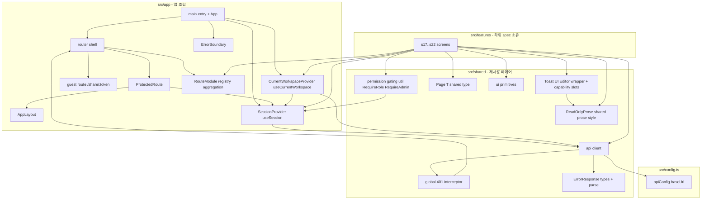
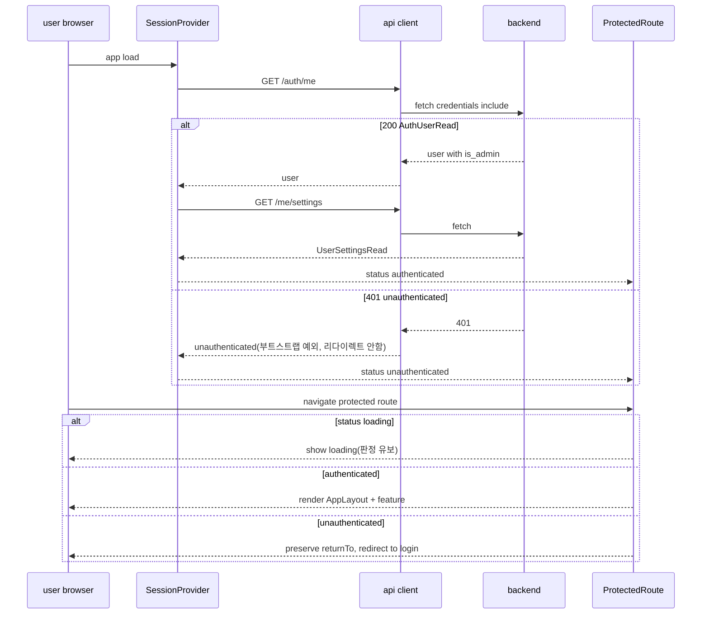
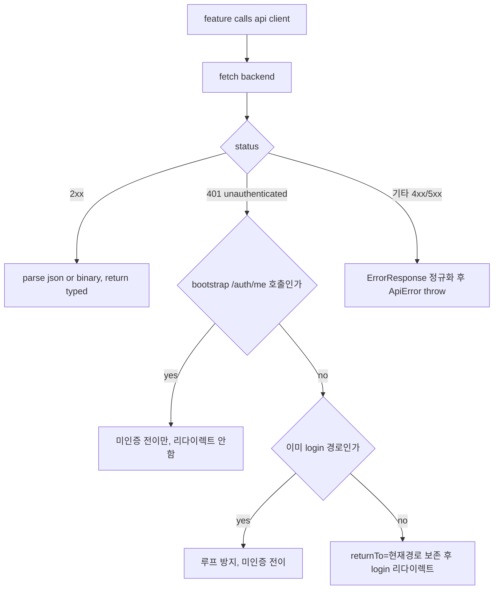

# Design Document — s16-fe-foundation

## Overview

**Purpose**: 이 spec은 MarkSpace 프론트엔드 전체(하위 spec s17~s22)가 소비하는 **교차 관심사 공통 레이어**
(`src/app`·`src/shared`)를 단일 소유한다. 백엔드가 `s01-contract-foundation`에서 계약·공용 인프라를 단일 소스로
확정한 것과 대칭으로, 프론트엔드 L0(upstream)로서 스캐폴드·설정 단일화·라우팅 셸·공용 API 클라이언트·전역
401 인터셉터·세션 컨텍스트·권한 게이팅 유틸·공용 UI·Toast UI Editor 래퍼를 **한 번만** 구현한다.

**Users**: 하위 feature 구현자(s17~s22)는 이 레이어를 재구현하지 않고 소비한다. 각 feature는 자기 화면·훅·
도메인 API 호출을 자기 폴더(`src/features/*`)에 두고, 라우팅 가드·401 처리·역할 비교·에디터 인스턴스는 이
공통 레이어를 통해서만 얻는다. 검증 기준은 백엔드와 동일하게 `s01-contract-foundation` 계약 단일 소스다.

**Impact**: 현재 `frontend/`는 존재하지 않는다(greenfield). 이 spec이 React + Vite + Tailwind CSS 4 SPA 골격과
공통 레이어를 최초로 도입하여 이후 모든 프론트 feature가 얹힐 기반을 만든다. 백엔드는 이미 전체 GO이므로 이
레이어는 실동작 API를 소비한다(mock 아님).

### Goals
- `frontend/` SPA 스캐폴드(React + Vite + Tailwind CSS 4, TypeScript strict)와 단일 설정 지점(`src/config.ts`)을 확립.
- 보호/게스트 라우트 프레임과 `returnTo` 보존·복귀를 공통 라우터 셸에 단일 구현.
- 공용 API 클라이언트(단일 base URL·세션 쿠키·`ErrorResponse` 파싱)와 전역 401 인터셉터를 단일 지점에 구현.
- `GET /auth/me`(→ `GET /me/settings`) 세션 부트스트랩을 컨텍스트로 노출(로딩/인증됨/미인증 + is_admin + 설정).
- 워크스페이스 role 위계 + admin override(INV-1·2·3) 권한 게이팅 유틸/컴포넌트 단일 제공.
- 공용 UI 프리미티브·전역 레이아웃·에러 경계, 그리고 Toast UI Editor 단일 래퍼(편집=WYSIWYG+md, 읽기=viewer).
- **현재 워크스페이스 앰비언트 컨텍스트**(세션 컨텍스트 대칭): `CurrentWorkspaceProvider`·`useCurrentWorkspace()`·
  단일 `CurrentWorkspaceContextValue` 타입 + 선택 localStorage 영속을 단일 소유.
- **feature 라우트/Provider 등록 메커니즘**(`RouteModule[]` export → 단일 취합), **공용 `Page<T>` 타입**,
  **읽기 전용 prose 스타일**(`ReadOnlyProse`)을 s17~s22 컨슈머용으로 단일 소유.
- EditorWrapper 계약을 s20(편집)·s21(첨부)이 인스턴스 포크 없이 소비하도록 확장(붙여넣기/드롭 훅·삽입/치환
  콜백·커스텀 이미지/HTML 렌더러 오버라이드).

### Non-Goals
- feature 화면·데이터 훅 구현: 로그인/비번변경(s17), 워크스페이스/admin 콘솔(s18), 문서/휴지통(s19),
  편집 생명주기·lock·자동저장·버전 뷰어(s20), 첨부(s21), 공유 링크·게스트 뷰(s22).
- 백엔드 API 동작(이미 s01~s15 소유). 이 spec은 계약을 소비만 한다.
- 상태관리 라이브러리(Redux 등) 도입(React Context로 충분, research.md).
- 자동저장/lock 등 편집 정책의 동작(Toast 래퍼는 인터페이스만 노출, 정책은 s20).

## Boundary Commitments

### This Spec Owns
- **FE 스캐폴드·설정**: `frontend/` Vite 프로젝트, Tailwind CSS 4 전역 CSS, TypeScript strict, 경로 alias(`@/`),
  단일 설정 파일 `src/config.ts`(API base URL 등).
- **라우터 셸**(`src/app`): 라우트 트리, 보호 라우트 프레임(`ProtectedRoute`)·게스트 라우트(`/share/:token`)
  등록 지점, `returnTo` 보존·복귀 규약.
- **공용 API 클라이언트**(`src/shared/api`): 단일 base URL·`credentials:"include"`·`ErrorResponse` 파싱/정규화·
  JSON/바이너리 응답 분기, 그리고 내장 전역 401 인터셉터.
- **세션 컨텍스트**(`src/app` or `src/shared/session`): `/auth/me`(→ `/me/settings`) 부트스트랩, `useSession()`,
  `status`·`user`(is_admin 포함)·`settings`·`refresh()` 노출.
- **권한 게이팅 유틸**(`src/shared/auth`): `Role` 위계, `hasWorkspaceRole()`, `<RequireRole>`, `<RequireAdmin>`
  (admin 라우트 게이팅, 세션 `is_admin` 판정, INV-3). s18은 `RequireAdmin`을 재구현하지 않고 소비.
- **현재 워크스페이스 앰비언트 컨텍스트**(`src/app/workspace-context`): `CurrentWorkspaceProvider`·
  `useCurrentWorkspace()`·단일 `CurrentWorkspaceContextValue` 타입 + 현재 WS 선택 localStorage 영속(읽기 표면).
- **라우트/Provider 등록 메커니즘**(`src/app`): `RouteModule` 계약 + `router.tsx` 단일 취합, 보호/게스트 등록
  슬롯, `main.tsx`/`AppLayout` Provider 합성 슬롯.
- **공용 `Page<T>` 타입**(`src/shared/types`): `{ items: T[]; total: number }`(백엔드 `base.py` 미러링).
- **공용 UI·레이아웃·에러 경계**(`src/shared/ui`, `src/app`): 프리미티브 최소 세트, `AppLayout`, `ErrorBoundary`,
  `ErrorResponse` 표시 유틸.
- **Toast UI Editor 단일 래퍼**(`src/shared/editor`): `mode`(edit|read) 단일 진입점, 콘텐츠 in/out 인터페이스,
  붙여넣기/드롭 구독 훅·삽입/치환 콜백·커스텀 이미지/HTML 렌더러 오버라이드(s20/s21 소비 계약).
- **읽기 전용 prose 스타일**(`src/shared/editor` 또는 `src/shared/ui`): `ReadOnlyProse` 컨테이너/공용 prose CSS를
  `EditorWrapper(mode:'read')`와 s22 공개 `content_html` 뷰가 공유.

### Out of Boundary
- feature 화면·라우트 대상 컴포넌트의 **내용**(s17~s22). 이 spec은 프레임과 등록 지점·소비 계약만 제공.
- 로그인/로그아웃 세션 write·비밀번호 변경 흐름(s17) — 세션 컨텍스트는 `refresh()` 진입점만 제공.
- 워크스페이스 관리 **화면**(스위처 UI·멤버/권한 관리·설정·admin 콘솔)과 WS/멤버 **CRUD API**(s18). 현재 WS
  앰비언트 컨텍스트는 s16이 소유하나 **읽기 표면·선택 영속·`refresh()` 진입점**만이며, `selectWorkspace`/
  `refresh`를 호출하고 mutation 하는 관리 화면은 s18 소유.
- 현재 사용자의 WS 멤버십 role **데이터 조달**(s18 멤버십). 백엔드 `WorkspaceRead`는 호출자 role을 담지
  않으므로, `CurrentWorkspaceContextValue.role`의 값은 s18 멤버십 데이터 경로로 주입되며 s16은 필드·형태만 소유.
- 자동저장(이탈 시 1회)·lock 획득/강제 해제·버전 뷰어 동작(s20). 에디터 래퍼는 인터페이스만.
- 첨부 업로드/blob 인증 로딩 **동작**(s21) — 래퍼는 붙여넣기/드롭 훅·삽입/치환·커스텀 렌더러 **슬롯**만.
- 공유 링크 관리·게스트 읽기 뷰 콘텐츠(s22). s16은 게스트 뷰가 공유하는 `ReadOnlyProse` 스타일만 제공.
- admin 콘솔 화면 내용(s18). s16은 `RequireAdmin` 게이팅 표면만 제공.

### Allowed Dependencies
- **Upstream**: `s01-contract-foundation` 계약(API 카탈로그·`ErrorResponse`·세션 의존성·권한 resolver·INV-1~12).
  백엔드 s01~s15의 실 엔드포인트를 HTTP로 소비. 현재 WS 앰비언트 컨텍스트는 `GET /workspaces`
  (→ `Page[WorkspaceRead]`, `backend/app/workspace/router.py`·`schemas.py`)를, 공용 `Page<T>`는
  `backend/app/schemas/base.py`의 `Page`(items·total)를 미러링만 한다(새 필드 발명 금지).
- **Shared infra(프론트)**: React, Vite, Tailwind CSS 4(`@tailwindcss/vite`), React Router, TypeScript,
  Toast UI Editor(`@toast-ui/editor`, `@toast-ui/react-editor`). 브라우저 `fetch`.
- **제약**: API base URL 등 환경 값은 단일 설정에서만 접근(하드코딩 상수 금지). 교차 관심사는 공통 레이어
  단일 소유(feature 중복 구현 금지). feature는 다른 feature를 직접 import 하지 않는다. TypeScript strict,
  `any` 금지. 클라이언트 권한 게이팅은 서버 강제를 대체하지 않는다.

### Revalidation Triggers
아래 변경은 하위 프론트 spec(s17~s22)의 재검증을 유발한다.
- 공용 API 클라이언트 시그니처·에러 정규화 형태·401 인터셉터 동작 변경.
- 세션 컨텍스트 계약(`useSession()` 노출 형태: status·user·settings·refresh) 변경.
- **현재 WS 앰비언트 컨텍스트 계약**(`CurrentWorkspaceContextValue` 형태: status·workspaces·currentWorkspace·
  workspaceId·role·isShareable·selectWorkspace·refresh) 또는 선택 영속 규약 변경 → **s18/s19/s20/s22 재검증**.
- 라우터 셸 규약(보호/게스트 프레임, `returnTo` 키·복귀 규칙) 또는 **라우트/Provider 등록 메커니즘**
  (`RouteModule` 형태·취합 함수·등록 슬롯) 변경 → **s17~s22 재검증**.
- 권한 게이팅 유틸 시그니처(`Role`·`hasWorkspaceRole`·`<RequireRole>`·`<RequireAdmin>`) 또는 위계 규칙 변경.
- **EditorWrapper 인터페이스 변경**(`mode`·콘텐츠 in/out·붙여넣기/드롭 훅·삽입/치환 콜백·커스텀 렌더러
  오버라이드) → **s19/s20/s21 재검증**.
- **공용 `Page<T>` 타입** 또는 **읽기 전용 prose 스타일**(`ReadOnlyProse`/공용 prose CSS) 변경 →
  s18/s19/s20(Page), 인증 읽기·s22 게스트 뷰(prose) 재검증.
- 단일 설정 파일 형태·API base URL 규약 변경.
- **상위 계약**(`s01`) 변경(에러 모델·`/auth/me`·`/me/settings` 형태·권한 resolver)은 이 레이어 재검증을 유발.

## Architecture

### Architecture Pattern & Boundary Map

공통 레이어 캡슐화 패턴(steering `structure.md` 정렬). `src/app`(앱 조립·라우팅·세션·레이아웃)과
`src/shared`(재사용 유틸: api·auth·ui·editor)가 교차 관심사를 단일 소유하고, `src/features/*`는 이를 소비한다.
의존 방향은 항상 feature → shared/app 단방향이며 feature 간 직접 import는 금지된다.



**Architecture Integration**:
- **Selected pattern**: 공통 레이어(`src/app`+`src/shared`) 단일 소유 + feature 폴더 소비. 백엔드 s01 대칭.
- **Domain/feature boundaries**: 교차 관심사(라우팅·401·권한·API·에디터)는 공통 레이어에만. feature는 소비만.
- **Existing patterns preserved**: 설정 단일화(단일 config), 절대 import alias(`@/`), `{Resource}Read/Update`
  계약 소비, INV-1·2·3 권한 위계(백엔드 resolver 미러링).
- **New components rationale**: greenfield이므로 공통 레이어 전부 신규. 각 컴포넌트는 단일 책임. cross-spec
  리뷰로 발견된 교차 관심 seam(현재 WS 앰비언트 컨텍스트·라우트/Provider 등록 메커니즘·공용 `Page<T>`·읽기
  전용 prose·`RequireAdmin`)을 s16이 단일 소유하도록 추가하여 s19/s20/s22의 형제(같은 wave) 의존을 제거하고
  `s16` 단일 upstream으로 수렴시킨다(roadmap "교차관심 단일 소유 정정" 반영).
- **Steering compliance**: `structure.md` "Frontend 교차 관심사는 공통 레이어가 단일 소유" 원칙을 그대로 구현.
- **하위 spec 소비**: 이 spec이 단일 소유하는 표면(위 seam 포함)은 s17~s22가 재구현 없이 소비하며, 컨슈머는
  각 컨텍스트/타입의 **동결된 단일 형태**에 정확히 바인딩한다.

### Dependency Direction (강제)
```
config  →  shared(api/errors, auth, ui, editor)  →  app(session, router, layout)  →  features(s17..s22)
```
각 레이어는 왼쪽만 import한다. `shared`는 `features`를 import하지 않는다. `features`는 서로 import하지 않는다.
401 인터셉터가 라우터에 의존하는 부분은 **네비게이션 핸들 주입** seam으로 결선하여 `shared → app` 역방향
정적 import를 만들지 않는다.

### Technology Stack

| Layer | Choice / Version | Role in Feature | Notes |
|-------|------------------|-----------------|-------|
| UI Framework | React 19 (`react`, `react-dom`) | SPA 렌더 | 함수형 컴포넌트 + hooks |
| Build / Dev | Vite 6 (`vite`, `@vitejs/plugin-react`) | 번들·개발 서버·env | 단일 설정 진입 |
| Styling | Tailwind CSS 4 (`tailwindcss`, `@tailwindcss/vite`) | 유틸리티 스타일 | 전역 CSS `@import "tailwindcss";` |
| Routing | React Router (`react-router-dom` v6+) | 라우트 트리·가드·리다이렉트 | `createBrowserRouter`/`<Navigate>` |
| Language | TypeScript 5 (strict) | 타입 안전 | `strict:true`, `any` 금지 |
| Editor | Toast UI Editor (`@toast-ui/editor`, `@toast-ui/react-editor`) | 편집/읽기 렌더 | 단일 래퍼가 Editor/Viewer 선택 |
| HTTP | 브라우저 `fetch` | API 호출 | `credentials:"include"` 서명 쿠키 세션 |

> 세부 버전 근거·대안 비교는 `research.md` 참조.

## File Structure Plan

### Directory Structure
```
frontend/
├── index.html                        # SPA 진입 HTML(root div)
├── package.json                      # 의존성·스크립트(dev/build/typecheck)
├── vite.config.ts                    # Vite + React + Tailwind(@tailwindcss/vite) + alias @/
├── tsconfig.json                     # TypeScript strict + path alias
├── .env.example                      # VITE_API_BASE_URL 예시(실제 .env는 커밋 금지)
└── src/
    ├── main.tsx                      # 앱 부트스트랩: ErrorBoundary+SessionProvider+RouterProvider
    ├── index.css                     # Tailwind 진입(@import "tailwindcss";)
    ├── config.ts                     # apiConfig(baseUrl 등) 단일 설정 소스
    ├── app/
    │   ├── App.tsx                   # 라우트 트리 조립(RouterProvider용 라우터 정의)
    │   ├── router.tsx                # 라우트 정의: 보호/게스트 프레임 + RouteModule[] 단일 취합
    │   ├── routeModule.ts            # RouteModule 계약 타입 + registerRoutes/모듈 취합 함수
    │   ├── providers.tsx             # Provider 합성 슬롯(하위 Provider 등록 지점)
    │   ├── ProtectedRoute.tsx        # 세션 가드: 미인증 시 returnTo 보존 리다이렉트
    │   ├── routes.ts                 # 경로 상수(LOGIN, SHARE 등) + returnTo 키 규약
    │   ├── AppLayout.tsx             # 인증 영역 공통 레이아웃 프레임(feature children 슬롯)
    │   ├── ErrorBoundary.tsx         # 전역 렌더 에러 경계
    │   ├── session/
    │   │   ├── SessionProvider.tsx   # /auth/me(→/me/settings) 부트스트랩 Context provider
    │   │   └── useSession.ts         # 세션 컨텍스트 소비 훅(status·user·settings·refresh)
    │   └── workspace-context/
    │       ├── CurrentWorkspaceProvider.tsx  # GET /workspaces 로드·현재 WS 선택·localStorage 영속
    │       ├── useCurrentWorkspace.ts        # 앰비언트 컨텍스트 소비 훅(단일 형태 반환)
    │       └── types.ts                      # CurrentWorkspaceContextValue 동결 타입
    └── shared/
        ├── api/
        │   ├── client.ts             # 공용 fetch 래퍼: base URL·credentials·응답/에러 정규화
        │   ├── errors.ts             # ErrorResponse/ErrorCode 타입 + 파싱/정규화 + ApiError
        │   └── navigation.ts         # 401 인터셉터용 네비게이션 핸들 주입 seam
        ├── types/
        │   ├── page.ts               # 공용 Page<T> = { items; total }(백엔드 base.py 미러링)
        │   └── workspace.ts          # WorkspaceRead 프론트 미러 타입(id·name·is_shareable 등)
        ├── auth/
        │   ├── roles.ts              # Role 위계(owner/editor/viewer) 정의·비교
        │   ├── permissions.ts        # hasWorkspaceRole(current,min,isAdmin) 순수 유틸
        │   ├── RequireRole.tsx       # 선언형 권한 게이팅 컴포넌트(WS role)
        │   └── RequireAdmin.tsx      # admin 라우트 게이팅(세션 is_admin, INV-3)
        ├── ui/
        │   ├── Button.tsx            # 공용 버튼 프리미티브
        │   ├── Spinner.tsx           # 로딩 인디케이터
        │   ├── EmptyState.tsx        # 빈/오류 상태 표시
        │   ├── ErrorMessage.tsx      # ErrorResponse message·field_errors 표시 유틸
        │   └── index.ts              # 프리미티브 배럴 export
        └── editor/
            ├── EditorWrapper.tsx     # Toast UI Editor 단일 래퍼(mode edit|read + capability 슬롯)
            ├── ReadOnlyProse.tsx     # 공용 읽기 prose 컨테이너(read 모드·s22 공개 뷰 공유)
            └── prose.css             # 공용 prose 스타일(인증 읽기·게스트 읽기 동일 렌더)
```

### Modified Files
- 없음 — 순수 greenfield. `frontend/` 전체가 이 spec에서 최초 생성된다.

> 각 파일은 단일 책임. `shared/*`는 `features/*`나 `app/*`를 정적 import 하지 않는다(401→라우팅은 주입 seam).
> feature 폴더(`src/features/*`)는 이 spec에서 생성하지 않으며 하위 spec이 소유한다.

## System Flows

### 세션 부트스트랩 및 보호 라우트 판정


### 전역 401 인터셉터(부트스트랩 이후 임의 호출)


## Requirements Traceability

| Requirement | Summary | Components | Interfaces / Contracts | Flows |
|-------------|---------|------------|------------------------|-------|
| 1.1–1.5 | 스캐폴드·설정 단일화·strict·alias | Scaffold, AppConfig | `vite.config.ts`, `tsconfig`, `apiConfig` | — |
| 2.1–2.5 | 보호/게스트 프레임·returnTo·로딩 유보 | Router, ProtectedRoute, Routes | 라우트 트리, `ProtectedRoute` | 부트스트랩 판정 |
| 3.1–3.5 | base URL·credentials·에러 파싱·바이너리 | ApiClient, ApiErrors | `apiClient`, `ApiError`, `ErrorResponse` | 401 인터셉터 |
| 4.1–4.4 | 401 단일 처리·returnTo·루프 방지 | ApiClient, NavSeam | `install401Interceptor` | 401 인터셉터 |
| 5.1–5.6 | /auth/me·/me/settings 부트스트랩·status·is_admin | SessionProvider, useSession | `SessionState`, `useSession()` | 부트스트랩 판정 |
| 6.1–6.6 | role 위계·admin override·게이팅 유틸/컴포넌트 | Roles, Permissions, RequireRole | `hasWorkspaceRole`, `<RequireRole>` | — |
| 7.1–7.5 | UI 프리미티브·레이아웃·에러 경계·에러 표시 | UiPrimitives, AppLayout, ErrorBoundary | `Button`/`Spinner`/`ErrorMessage` | — |
| 8.1–8.5 | Toast 단일 래퍼·edit/read·콘텐츠 in/out | EditorWrapper | `EditorWrapperProps(mode,...)` | — |
| 8.6–8.8 | 붙여넣기/드롭 훅·삽입/치환·커스텀 렌더러 | EditorWrapper | `onImagePaste`/`insert`/`customImageRenderer` | — |
| 9.1–9.6 | 현재 WS 앰비언트 컨텍스트·선택 영속·role 주입 | CurrentWorkspaceProvider, useCurrentWorkspace | `CurrentWorkspaceContextValue` | WS 부트스트랩 |
| 10.1–10.4 | RouteModule 등록·보호/게스트 슬롯·Provider 슬롯 | RouteRegistry, ProviderComposition | `RouteModule`, `registerRoutes` | — |
| 11.1–11.2 | 공용 `Page<T>`(items·total, limit/offset 없음) | SharedTypes | `Page<T>` | — |
| 12.1–12.2 | 읽기 전용 prose 공유(인증·게스트) | ReadOnlyProse | `ReadOnlyProse`, `prose.css` | — |
| 13.1–13.3 | 게이팅 표면 확정·RequireAdmin | RolePermissions, RequireRole, RequireAdmin | `hasWorkspaceRole`/`<RequireAdmin>` | — |

## Components and Interfaces

| Component | Domain/Layer | Intent | Req Coverage | Key Dependencies (P0/P1) | Contracts |
|-----------|--------------|--------|--------------|--------------------------|-----------|
| Scaffold | Build | Vite+Tailwind+TS strict 골격 | 1 | Vite (P0), Tailwind4 (P0) | State |
| AppConfig | Config | 단일 base URL 소스 | 1,3 | Vite env (P0) | State |
| ApiClient | shared/api | fetch 래퍼·정규화·401 | 3,4 | AppConfig (P0), ApiErrors (P0), NavSeam (P1) | Service |
| ApiErrors | shared/api | ErrorResponse 타입·파싱 | 3 | — | State |
| NavSeam | shared/api | 401→라우팅 주입 seam | 4 | Router (P1) | Service |
| SessionProvider | app/session | /auth/me·/me/settings 부트스트랩 | 5 | ApiClient (P0) | Service, State |
| useSession | app/session | 세션 컨텍스트 소비 훅 | 5 | SessionProvider (P0) | Service |
| Router | app | 라우트 트리·프레임 등록 | 2 | ProtectedRoute (P0) | State |
| ProtectedRoute | app | 세션 가드·returnTo | 2 | useSession (P0), Routes (P0) | Service |
| RolePermissions | shared/auth | role 위계·admin override | 6,13 | useSession (P1) | Service |
| RequireRole | shared/auth | 선언형 게이팅 컴포넌트 | 6,13 | RolePermissions (P0) | Service |
| RequireAdmin | shared/auth | admin 라우트 게이팅(is_admin) | 13 | useSession (P0) | Service |
| CurrentWorkspaceProvider | app/workspace-context | 현재 WS 앰비언트 컨텍스트·선택 영속 | 9 | ApiClient (P0), useSession (P1) | Service, State |
| useCurrentWorkspace | app/workspace-context | 앰비언트 컨텍스트 소비 훅 | 9 | CurrentWorkspaceProvider (P0) | Service |
| RouteRegistry | app | RouteModule[] 취합·등록 슬롯 | 10 | Router (P0) | State, Service |
| ProviderComposition | app | 하위 Provider 합성 슬롯 | 10 | — | State |
| SharedTypes | shared/types | 공용 `Page<T>`·WorkspaceRead 미러 | 9,11 | — | State |
| UiPrimitives | shared/ui | 공용 버튼·스피너·에러표시 | 7 | Tailwind4 (P0) | State |
| AppLayout | app | 인증 영역 공통 레이아웃 | 7 | — | State |
| ErrorBoundary | app | 전역 렌더 에러 경계 | 7 | — | Service |
| EditorWrapper | shared/editor | Toast UI 단일 래퍼(+capability 슬롯) | 8 | Toast UI (P0) | Service, State |
| ReadOnlyProse | shared/editor | 공용 읽기 prose(인증·게스트 공유) | 12 | — | State |

### shared / api

#### ApiClient
| Field | Detail |
|-------|--------|
| Intent | 단일 base URL·세션 쿠키·`ErrorResponse` 정규화·401 인터셉터 내장 fetch 래퍼 |
| Requirements | 3.1, 3.2, 3.3, 3.4, 3.5, 4.1, 4.2, 4.3, 4.4 |

**Responsibilities & Constraints**
- 모든 요청의 URL은 `apiConfig.baseUrl` 기준. 경로 상수 외 하드코딩 base URL 금지.
- `credentials: "include"`로 서명 쿠키 세션 전송(백엔드 SessionMiddleware).
- 응답이 오류면 공통 `ErrorResponse`로 파싱, 파싱 불가/비정형이면 안정 기본 오류로 정규화하여 `ApiError` throw.
- JSON/바이너리(첨부 서빙) 응답을 구분해 반환. 성공 응답은 제네릭으로 타입 안전 반환.
- 401(`unauthenticated`) 응답을 단일 지점에서 가로채 `returnTo` 보존 후 로그인 리다이렉트. 단, 부트스트랩
  `/auth/me` 호출과 로그인 경로 체류 시에는 리다이렉트하지 않고 미인증 전이만(루프 방지).

**Dependencies**
- Inbound: 모든 feature 데이터 훅·세션 부트스트랩(P0)
- Outbound: AppConfig(P0); ApiErrors(P0); NavSeam — 401 리다이렉트 결선(P1)

**Contracts**: Service [x]
```typescript
interface RequestOptions {
  method?: "GET" | "POST" | "PATCH" | "DELETE";
  body?: unknown;                 // JSON 직렬화 또는 FormData(multipart)
  responseType?: "json" | "blob"; // 기본 json, 첨부 서빙은 blob
  signal?: AbortSignal;
  skipAuthRedirect?: boolean;     // 부트스트랩 /auth/me 등 401 리다이렉트 제외
}

async function apiRequest<T>(path: string, options?: RequestOptions): Promise<T>;

// 편의 메서드
const apiClient: {
  get<T>(path: string, options?: RequestOptions): Promise<T>;
  post<T>(path: string, body?: unknown, options?: RequestOptions): Promise<T>;
  patch<T>(path: string, body?: unknown, options?: RequestOptions): Promise<T>;
  del<T>(path: string, options?: RequestOptions): Promise<T>;
};
```
- Preconditions: `NavSeam`에 네비게이션 핸들 주입됨(앱 부팅 시). `apiConfig.baseUrl` 유효.
- Postconditions: 2xx면 타입 `T`(json) 또는 `Blob`; 오류면 `ApiError` throw; 401(비-skip)이면 리다이렉트 트리거.
- Invariants: 401 처리·에러 정규화는 이 클라이언트 단일 지점에만 존재(호출부 중복 금지).

#### ApiErrors
| Field | Detail |
|-------|--------|
| Intent | 백엔드 `ErrorResponse` 계약의 프론트 타입·파싱·정규화 |
| Requirements | 3.3, 3.4 |

**Contracts**: State [x]
```typescript
type ErrorCode =
  | "unauthenticated" | "forbidden" | "validation_error"
  | "not_found" | "conflict" | "unprocessable" | "internal";

interface FieldError { field: string; message: string; }
interface ErrorResponse {
  code: ErrorCode | string;
  message: string;
  field_errors?: FieldError[] | null;
}

class ApiError extends Error {
  readonly status: number;
  readonly code: ErrorCode | string;
  readonly fieldErrors: FieldError[];
  readonly raw?: ErrorResponse;
}

function parseErrorResponse(status: number, body: unknown): ApiError; // 비정형이면 internal 기본
```
- Boundary: 백엔드 `ErrorResponse` 형태를 미러링만 하며 새 코드/필드를 발명하지 않는다(s01 계약 소비).

#### NavSeam
| Field | Detail |
|-------|--------|
| Intent | 401 인터셉터가 라우팅을 정적 import 하지 않도록 네비게이션 핸들을 주입받는 seam |
| Requirements | 4.1, 4.2, 4.4 |

**Contracts**: Service [x]
```typescript
type Navigate = (to: string, options?: { replace?: boolean }) => void;
function setNavigator(nav: Navigate): void;   // 앱 부팅 시 라우터가 주입
function redirectToLogin(currentPath: string): void; // returnTo 보존 후 login 이동
```
- Rationale: `shared → app` 역방향 정적 의존을 피하기 위한 런타임 주입(의존 방향 강제).

### app / session

#### SessionProvider & useSession
| Field | Detail |
|-------|--------|
| Intent | `/auth/me`(→ `/me/settings`) 부트스트랩과 세션 상태의 Context 노출 |
| Requirements | 5.1, 5.2, 5.3, 5.4, 5.5, 5.6 |

**Responsibilities & Constraints**
- 앱 로드 시 `apiClient.get("/auth/me", { skipAuthRedirect: true })`로 사용자 확정 → 성공 시 `/me/settings`
  로드. 401이면 `unauthenticated`로 전이(리다이렉트 없음).
- `status`·`user`(is_admin 포함)·`settings`·`refresh()`를 노출. 로그인/로그아웃 write는 s17이 `refresh()` 호출.

**Contracts**: Service [x] / State [x]
```typescript
interface AuthUser { id: number; login_id: string; name: string; email: string | null; is_admin: boolean; }
interface UserSettings { autosave_enabled: boolean; }

type SessionState =
  | { status: "loading" }
  | { status: "authenticated"; user: AuthUser; settings: UserSettings | null }
  | { status: "unauthenticated" };

function useSession(): SessionState & { refresh: () => Promise<void> };
```
- Preconditions: `SessionProvider`가 라우터 상위에 마운트.
- Postconditions: 부트스트랩 종료 후 `status`는 authenticated 또는 unauthenticated로 확정.
- Invariants: `AuthUser`/`UserSettings` 타입은 백엔드 `AuthUserRead`/`UserSettingsRead` 계약 미러링.

### app / router

#### Router & ProtectedRoute
| Field | Detail |
|-------|--------|
| Intent | 보호/게스트 라우트 프레임과 `returnTo` 보존·복귀 |
| Requirements | 2.1, 2.2, 2.3, 2.4, 2.5 |

**Responsibilities & Constraints**
- 라우트 트리 최상위에 게스트 라우트(`/share/:token`, 가드 없음)와 보호 영역(`ProtectedRoute` 하위)을 등록.
- `ProtectedRoute`는 `useSession().status`가 `loading`이면 로딩 표시(판정 유보), `unauthenticated`면 현재
  경로를 `returnTo`로 보존 후 로그인 경로로 `<Navigate replace>`, `authenticated`면 `AppLayout`+자식 렌더.
- 하위 spec 화면은 이 프레임의 자식 라우트로 등록만 한다(내용은 s17~s22 소유).

**Contracts**: State [x] / Service [x]
```typescript
// routes.ts
const ROUTES = { login: "/login", root: "/", share: "/share/:token" } as const;
const RETURN_TO_PARAM = "returnTo";
function buildLoginPath(returnTo: string): string;    // /login?returnTo=<encoded>
function resolveReturnTo(search: string): string;     // 복귀 경로 or 기본 root
```
- Boundary: 로그인 화면·`/share/:token` 뷰의 **내용**은 s17/s22. 이 spec은 프레임·경로 규약만.

### shared / auth

#### RolePermissions & RequireRole
| Field | Detail |
|-------|--------|
| Intent | 워크스페이스 role 위계 판정 + admin override(INV-1·2·3) |
| Requirements | 6.1, 6.2, 6.3, 6.4, 6.5, 6.6 |

**Responsibilities & Constraints**
- 권한은 워크스페이스 role만(INV-1). 위계 owner ≥ editor ≥ viewer.
- admin이면 항상 통과(INV-3). viewer는 editor 이상 요구 UI에서 거짓(INV-2, 읽기 전용).
- 순수 함수 + 선언형 컴포넌트 양쪽 제공. 현재 WS role 데이터는 feature가 주입(s18 멤버십 소유).
- **계약 명시**: 클라이언트 게이팅은 UI 노출 편의이며 서버측 권한 강제(백엔드 403)를 대체하지 않는다.

**Contracts**: Service [x]
```typescript
enum Role { VIEWER = 1, EDITOR = 2, OWNER = 3 }   // 위계 비교용(백엔드 Role 미러링)

function hasWorkspaceRole(
  input: { currentRole: Role | null; isAdmin: boolean; minimum: Role }
): boolean;   // isAdmin이면 항상 true, 아니면 currentRole >= minimum

// 선언형 게이팅: 조건 충족 시에만 children 렌더
interface RequireRoleProps {
  minimum: Role;
  currentRole: Role | null;   // feature가 현재 WS 멤버십에서 주입(또는 useCurrentWorkspace().role)
  fallback?: React.ReactNode; // 미충족 시 대체(기본 null)
  children: React.ReactNode;
}

// admin 라우트/화면 게이팅: 세션 is_admin 판정(INV-3), 워크스페이스 role과 독립.
interface RequireAdminProps {
  fallback?: React.ReactNode; // 미충족 시 대체(기본 null, 라우트 사용 시 리다이렉트/차단)
  children: React.ReactNode;
}
// RequireAdmin은 useSession()의 is_admin으로만 판정하며 s18 admin 콘솔 화면이 소비(재구현 금지).
```
- Invariants: 위계 규칙은 이 유틸에만 정의(컴포넌트별 역할 비교 산발 금지). `isAdmin`은 `useSession()`에서 취득.
- Boundary: `RequireRole`·`hasWorkspaceRole`·`RequireAdmin`은 s16-소유 게이팅 표면이며 s18 등 하위 spec은
  재구현하지 않고 소비한다. 클라이언트 게이팅은 UI 노출 편의이며 서버측 강제(403)를 대체하지 않는다(13.3).

### shared / editor

#### EditorWrapper
| Field | Detail |
|-------|--------|
| Intent | Toast UI Editor 단일 래퍼: 편집(WYSIWYG+md 토글)·읽기(viewer) 단일 진입점 |
| Requirements | 8.1, 8.2, 8.3, 8.4, 8.5 |

**Responsibilities & Constraints**
- `mode`가 `edit`면 Toast Editor(`initialEditType: "wysiwyg"`, 툴바 markdown 토글), `read`면 Toast Viewer로
  내부 선택. feature는 Editor/Viewer를 직접 고르지 않는다(렌더 경로 이원화 금지 — 단일 래퍼 유지).
- 초기 콘텐츠 주입·현재 콘텐츠 조회 인터페이스만 노출. 자동저장·lock 등 정책 동작은 미구현(s20 소비).
- Toast UI CSS import는 이 래퍼가 단일 소유. `read` 모드 렌더 컨테이너는 `ReadOnlyProse` 스타일을 소비하여
  s22 게스트 뷰와 동일 시각 언어를 갖는다.
- **capability 슬롯(신규)**: s20(편집)·s21(첨부)이 Toast 인스턴스를 포크하지 않고 소비하도록 (a) 붙여넣기/드롭
  이벤트 구독 훅, (b) `EditorHandle`의 콘텐츠 삽입/치환 콜백, (c) `/attachments/{id}` 참조를 인증 blob으로
  렌더하는 커스텀 이미지/HTML 렌더러 오버라이드를 노출한다. 실제 업로드·blob 로딩 **동작**은 s21 소유이며,
  래퍼는 슬롯·콜백만 제공한다(정책 미구현).

**Contracts**: Service [x] / State [x]
```typescript
interface EditorHandle {
  getMarkdown(): string;                         // 현재 콘텐츠 조회(s20 저장 결선용)
  insert(text: string): void;                    // 커서 위치에 삽입(s21 placeholder 삽입)
  replaceRange(from: EditorPos, to: EditorPos, text: string): void; // 업로드 placeholder→최종 참조 치환(s21)
}
type EditorPos = [line: number, ch: number];     // Toast 위치 좌표(래퍼가 정규화)

// 첨부/이미지 커스텀 렌더러 오버라이드(edit·read 양 모드 공통). /attachments/{id} → 인증 blob 로딩(s21 구현).
type CustomImageRenderer = (ref: string) => HTMLElement;
interface CustomRenderers {
  customImageRenderer?: CustomImageRenderer;
  customHTMLRenderer?: unknown;                  // Toast customHTMLRenderer 형태(래퍼가 그대로 위임)
}

interface EditorWrapperProps {
  mode: "edit" | "read";
  initialContent?: string;                 // markdown
  onReady?: (handle: EditorHandle) => void;// 편집 모드 콘텐츠 핸들 제공
  onImagePaste?: (file: File) => void;     // 붙여넣기 이미지 구독(s21 업로드 브리지)
  onFileDrop?: (file: File) => void;       // 드롭 파일 구독(s21 업로드 브리지)
  renderers?: CustomRenderers;             // edit·read 양 모드에서 동일 소비
}
```
- Boundary: 저장 시점(이탈 시 1회)·버전 스냅샷 결선은 s20. 업로드·placeholder 치환 **동작**과 blob 인증
  로딩은 s21. 이 래퍼는 렌더·콘텐츠 in/out·이벤트 슬롯·콜백만 제공한다(단일 인스턴스, 렌더 경로 포크 없음).
- **재검증 트리거**: 이 인터페이스(props·`EditorHandle`·`CustomRenderers`) 변경 → **s19/s20/s21 재검증**.

#### ReadOnlyProse (읽기 전용 prose 스타일)
| Field | Detail |
|-------|--------|
| Intent | 인증 읽기(`EditorWrapper(mode:'read')`)와 게스트 공개 뷰(s22 `content_html`)가 동일 렌더되도록 공용 prose 스타일 단일 제공 |
| Requirements | 12.1, 12.2 |

**Responsibilities & Constraints**
- 공용 prose CSS(`prose.css`)와 `ReadOnlyProse` 컨테이너를 단일 소유. `EditorWrapper`의 read 모드 컨테이너가 이를 소비.
- s22 공개 뷰는 에디터 인스턴스 없이 sanitized `content_html`을 렌더하되 **동일 `ReadOnlyProse` 스타일**을 소비한다
  (에디터 인스턴스 부재는 허용된 예외이며 렌더 경로 포크가 아님 — 공용 prose CSS 공유로 동일 시각 언어 보장).

**Contracts**: State [x]
```typescript
// content_html(신뢰된 sanitized HTML) 또는 children 을 공용 prose 스타일로 감싼다.
function ReadOnlyProse(props: { html?: string; children?: React.ReactNode }): JSX.Element;
```
- Boundary: sanitize 책임·`content_html` 조달은 s22(게스트 뷰) 소유. s16은 스타일 컨테이너만 제공.

### app / workspace-context

#### CurrentWorkspaceProvider & useCurrentWorkspace
| Field | Detail |
|-------|--------|
| Intent | 현재 워크스페이스 앰비언트 컨텍스트(목록·현재 WS·`workspaceId`·`role`·`isShareable`)를 세션 컨텍스트 대칭으로 단일 노출 |
| Requirements | 9.1, 9.2, 9.3, 9.4, 9.5, 9.6 |

**Responsibilities & Constraints**
- 인증 후 `apiClient.get("/workspaces")`(→ `Page<WorkspaceRead>`)로 현재 사용자 스코프 목록을 로드하고
  `status`(loading|ready|empty)·`workspaces`를 노출. 목록 비면 `empty`.
- 현재 선택 WS를 localStorage에 영속하고 재로드 시 복원. 유효하지 않은 저장 id는 무시하고 첫 WS 또는 null.
- 최상위 편의 접근자(`workspaceId`·`role`·`isShareable`)를 파생 노출하여 컨슈머가 중첩 필드에 산발 접근하지
  않게 한다. `isShareable = currentWorkspace?.is_shareable ?? false`, `workspaceId = currentWorkspace ?
  String(currentWorkspace.id) : null`.
- **role 조달 경계**: 백엔드 `GET /workspaces → Page[WorkspaceRead]`는 호출자 role을 담지 않는다(ground
  truth: `backend/app/workspace/schemas.py` `WorkspaceRead`에 role 필드 없음). 따라서 `role`은 s18이 소유하는
  멤버십 데이터 경로로 주입되는 값이며(=`RequireRole`의 `currentRole` 주입 seam과 동형), s16은 **필드·형태·
  기본값(null)만 단일 소유**한다. admin override는 `role`에 접합하지 않고 세션 `is_admin`으로 별도 판정(INV-3).
- `refresh()`는 목록·현재 WS를 재조회. mutation(생성/멤버 변경/설정)·관리 화면은 s18 소유(s16은 읽기 표면만).

**Contracts**: Service [x] / State [x]
```typescript
import type { WorkspaceRead } from "@/shared/types/workspace";
import { Role } from "@/shared/auth/roles";

// 동결된 단일 컨텍스트 값 타입 — s18/s19/s20/s22가 정확히 이 형태에 바인딩한다.
interface CurrentWorkspaceContextValue {
  status: "loading" | "ready" | "empty";
  workspaces: WorkspaceRead[];
  currentWorkspace: WorkspaceRead | null;
  workspaceId: string | null;          // String(currentWorkspace.id) | null (라우트 파라미터용 파생값)
  role: Role | null;                   // 현재 WS에서 현재 사용자의 role(s18 멤버십 경로로 주입). admin은 세션 is_admin 별도.
  isShareable: boolean;                // currentWorkspace?.is_shareable ?? false
  selectWorkspace(id: string): void;   // 현재 WS 선택 + localStorage 영속
  refresh(): Promise<void>;            // 목록·현재 WS 재조회(s18 mutation 후 호출)
}

function useCurrentWorkspace(): CurrentWorkspaceContextValue;
```
- Preconditions: `CurrentWorkspaceProvider`가 `SessionProvider` 하위에 마운트(인증 상태 의존).
- Postconditions: 인증됨이면 목록 로드 후 `ready`/`empty`로 확정, 미인증이면 provider는 유휴(로드 안 함).
- Invariants: 이 컨텍스트 값 형태는 단일 소스이며 변경 시 s18/s19/s20/s22 재검증 트리거.

### app / route + provider registration

#### RouteRegistry & ProviderComposition
| Field | Detail |
|-------|--------|
| Intent | feature가 `router.tsx`/`main.tsx`를 수기 편집하지 않고 라우트·Provider를 가산 등록하는 구체 메커니즘 |
| Requirements | 10.1, 10.2, 10.3, 10.4 |

**Responsibilities & Constraints**
- 각 feature는 라우트 설정 배열(`RouteModule[]`)을 export 하고, s16 `router.tsx`가 **단일 취합 함수**로 이를
  보호/게스트 슬롯에 합성한다. feature는 라우터 파일을 직접 수정하지 않는다(가산 등록만).
- 보호 라우트 슬롯(세션 필요, `ProtectedRoute`+`AppLayout` 하위)과 게스트 라우트 슬롯(`/share/:token` 등,
  가드 없음)을 명시적으로 구분한다.
- 하위 Provider(feature 자체 컨텍스트)를 앱 Provider 합성에 끼우는 명시적 슬롯을 `providers.tsx`에 제공한다.

**Contracts**: State [x] / Service [x]
```typescript
import type { RouteObject } from "react-router-dom";

interface RouteModule {
  scope: "protected" | "guest";  // 등록 슬롯 선택
  routes: RouteObject[];         // react-router 라우트 정의(엘리먼트는 feature 소유)
}

// s16이 단일 취합: feature 모듈들을 보호/게스트 슬롯으로 분류해 라우터 트리를 구성.
function composeRouter(modules: RouteModule[]): ReturnType<typeof createBrowserRouter>;

// Provider 합성 슬롯: 하위 Provider를 순서대로 감싸 앱 조립에 끼운다.
type ProviderComponent = (props: { children: React.ReactNode }) => JSX.Element;
function composeProviders(providers: ProviderComponent[], children: React.ReactNode): JSX.Element;
```
- Boundary: 라우트 엘리먼트·feature Provider의 **내용**은 s17~s22 소유. s16은 취합 메커니즘·슬롯 계약만.
- 재검증 트리거: `RouteModule` 형태·취합 함수·슬롯 규약 변경 → **s17~s22 재검증**.

### shared / types

#### SharedTypes (Page<T>, WorkspaceRead 미러)
| Field | Detail |
|-------|--------|
| Intent | 백엔드 계약을 미러링한 공용 프론트 타입 단일 정의(재정의 방지) |
| Requirements | 9.x, 11.1, 11.2 |

**Contracts**: State [x]
```typescript
// 백엔드 app/schemas/base.py Page 를 정확히 미러링 — items·total 만(limit/offset 없음).
interface Page<T> { items: T[]; total: number; }

// 백엔드 app/workspace/schemas.py WorkspaceRead 미러(TimestampedRead + 고유 필드).
interface WorkspaceRead {
  id: number;
  created_at: string;              // ISO 8601
  updated_at: string | null;
  name: string;
  is_shareable: boolean;
  trash_retention_days: number;
}
```
- Boundary: 이 타입들은 s01/워크스페이스 백엔드 계약을 **미러링만** 하며 필드를 발명하지 않는다. 페이지네이션
  쿼리(limit/offset)는 요청 측 관심사이며 `Page<T>` 응답 엔벨로프와 분리한다. s18/s19/s20은 `Page<T>`를 import.

### shared / ui & app / layout

#### UiPrimitives / AppLayout / ErrorBoundary
| Field | Detail |
|-------|--------|
| Intent | 공용 UI 프리미티브·전역 레이아웃·전역 에러 경계·에러 표시 |
| Requirements | 7.1, 7.2, 7.3, 7.4, 7.5 |

**Responsibilities & Constraints**
- `Button`·`Spinner`·`EmptyState`·`ErrorMessage` 최소 세트를 Tailwind 4로 구성. `ErrorMessage`는
  `ErrorResponse`의 `message`·`field_errors`를 표시.
- `AppLayout`은 인증 영역 공통 프레임(children 슬롯). `ErrorBoundary`는 렌더 예외를 포착해 복구 화면 표시.

**Contracts**: State [x] / Service [x]
```typescript
function ErrorMessage(props: { error: ApiError | null }): JSX.Element | null;
class ErrorBoundary extends React.Component<{ children: React.ReactNode }, { hasError: boolean }> {}
function AppLayout(props: { children: React.ReactNode }): JSX.Element;
```

## Data Models

이 spec은 자체 영속 데이터를 소유하지 않는다. 소비하는 백엔드 계약 형태의 프론트 타입만 미러링한다.

- `AuthUser` ← `AuthUserRead`(`GET /auth/me`): id·login_id·name·email·is_admin.
- `UserSettings` ← `UserSettingsRead`(`GET /me/settings`): autosave_enabled.
- `ErrorResponse`/`FieldError` ← 백엔드 공통 에러 모델.
- `Role` ← 백엔드 권한 resolver Role 위계(VIEWER<EDITOR<OWNER).
- `Page<T>` ← 백엔드 `app/schemas/base.py` `Page`: **items·total 만**(limit/offset 없음). s16 공용 타입으로
  단일 정의하여 s18/s19/s20이 재정의 없이 import.
- `WorkspaceRead` ← 백엔드 `app/workspace/schemas.py` `WorkspaceRead`: id·created_at·updated_at·name·
  is_shareable·trash_retention_days. **호출자 role 필드 없음** → 현재 WS `role`은 s18 멤버십 경로로 주입.
- `CurrentWorkspaceContextValue` — s16 소유 앰비언트 컨텍스트 형태(WorkspaceRead 목록 + 파생 접근자). 백엔드
  단일 스키마의 미러가 아니라 여러 계약을 조합한 프론트 전용 읽기 표면(형태는 s16 단일 소유).

### Data Contracts & Integration
- **API 데이터 전송**: JSON 기본, 첨부 서빙은 `Blob`(responseType:"blob"). 요청 세션은 서명 쿠키(credentials).
- **에러 직렬화**: 전 응답 오류는 `ErrorResponse` 단일 형태로 파싱 후 `ApiError`로 정규화.
- **계약 소유권**: 위 타입은 s01 백엔드 계약을 미러링만 하며, 형태 변경 시 revalidation trigger 발동.

## Error Handling

### Error Strategy
- **단일 정규화 지점**: 모든 HTTP 오류를 `apiClient`가 `ApiError`로 정규화(호출부 중복 파싱 금지).
- **전역 401**: 인터셉터가 `returnTo` 보존 후 로그인 리다이렉트(부트스트랩/로그인 경로 예외로 루프 방지).
- **렌더 예외**: `ErrorBoundary`가 포착해 앱 크래시 대신 복구 화면.

### Error Categories and Responses
- **User Errors(4xx)**: 401 → 전역 리다이렉트; 403 forbidden → feature가 `ApiError`로 처리(권한 안내);
  404 → feature 네비게이션 처리; 422 validation_error → `field_errors`를 `ErrorMessage`로 표시.
- **Business Logic(409/422)**: `ApiError.code`(conflict/unprocessable)로 feature가 상태 안내.
- **System Errors(5xx)**: internal → 사용자에게 일반 오류 메시지, 내부 세부정보 미표시.

### Monitoring
- 브라우저 콘솔 로깅(개발). 상세 관측 인프라는 범위 밖. `ErrorBoundary`가 렌더 실패를 가시화.

## Testing Strategy

### Unit Tests
- `parseErrorResponse`: 정형 `ErrorResponse`→`ApiError` 매핑, 비정형 본문→internal 기본 정규화(3.3, 3.4).
- `hasWorkspaceRole`: viewer<editor<owner 위계 충족/미충족, admin이면 항상 true, currentRole=null 거부(6.2, 6.3, 6.4).
- `buildLoginPath`/`resolveReturnTo`: returnTo 인코딩·복원, 없을 때 기본 root(2.2, 2.3).
- `apiClient`: 401(비-skip)→`redirectToLogin` 호출, `skipAuthRedirect`면 미호출, 성공 json/blob 분기(3.5, 4.1, 4.2, 4.4).

### Integration Tests
- SessionProvider 부트스트랩: `/auth/me` 200→authenticated + `/me/settings` 로드; 401→unauthenticated(리다이렉트 없음)(5.1, 5.2, 5.3).
- ProtectedRoute: status loading→로딩 표시, unauthenticated→login 리다이렉트(returnTo 보존), authenticated→children(2.2, 2.5).
- 게스트 라우트: `/share/:token`이 세션 없이 렌더되고 보호 리다이렉트가 강제되지 않음(2.4, 4.3).

### E2E / UI Tests
- 미인증 사용자가 보호 경로 진입 → 로그인 리다이렉트, (모의) 로그인 후 `returnTo` 복귀(2.2, 2.3).
- `EditorWrapper` mode=edit는 WYSIWYG+markdown 토글 노출, mode=read는 viewer 렌더(단일 컴포넌트)(8.2, 8.3).
- `RequireRole`: viewer 컨텍스트에서 editor 요구 UI 미노출, admin 컨텍스트에서 노출(6.3, 6.4).

### Build / Type Checks
- `tsc --noEmit`(strict) 통과, `vite build` 성공, Tailwind 유틸 적용 확인(1.1, 1.2).

## Security Considerations
- 세션은 백엔드 서명 쿠키(same_site=lax). 프론트는 토큰을 저장/노출하지 않고 `credentials:"include"`만 사용.
- **클라이언트 권한 게이팅은 보안 경계가 아님**: 서버측 resolver(403)가 최종 강제. UI 게이팅은 노출 편의(6.6).
- `ErrorResponse` 표시 시 내부 세부정보 없음(백엔드가 500 세부 미노출). API base URL은 단일 설정에서만.
- 게스트 라우트(`/share/:token`)는 인증 가드 밖이지만 접근 범위는 백엔드 공개 엔드포인트가 강제(읽기 전용).

## Supporting References
- 스택 선택 근거·부트스트랩/401/게이팅 설계 결정: `research.md`.
- 상위 계약: `s01-contract-foundation` requirements.md·design.md(API 카탈로그·ErrorResponse·SessionAuth·
  PermissionResolver·INV-1~12), `backend/app/auth/router.py`·`backend/app/user_settings/router.py`.
- steering: `tech.md`(Editor·설정 단일화·Frontend 결정)·`structure.md`(공통 레이어 단일 소유·라우팅)·`roadmap.md`(FE 계층 순서).
