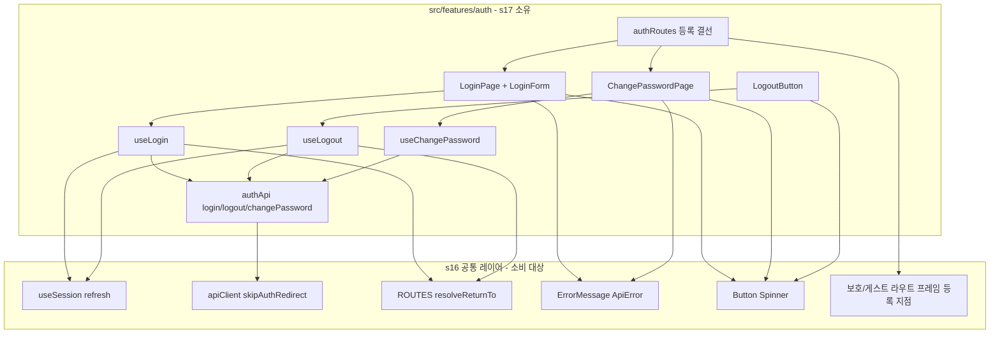
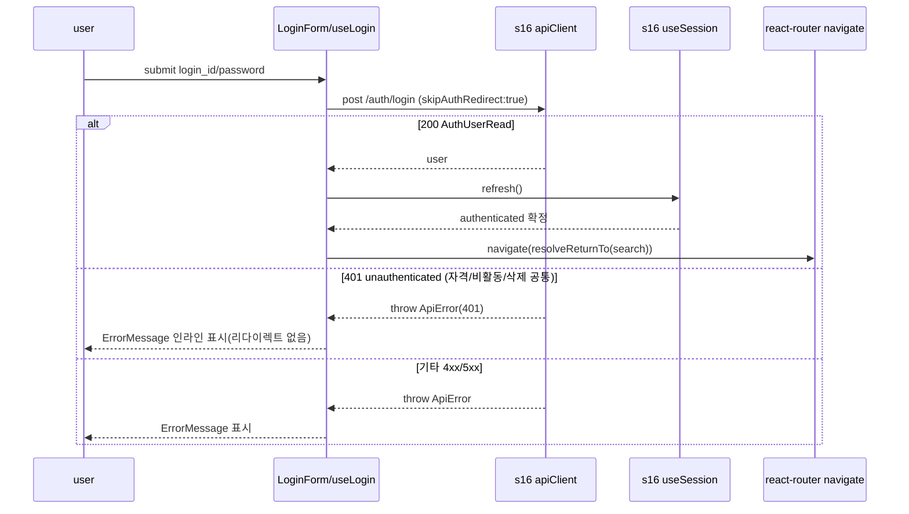
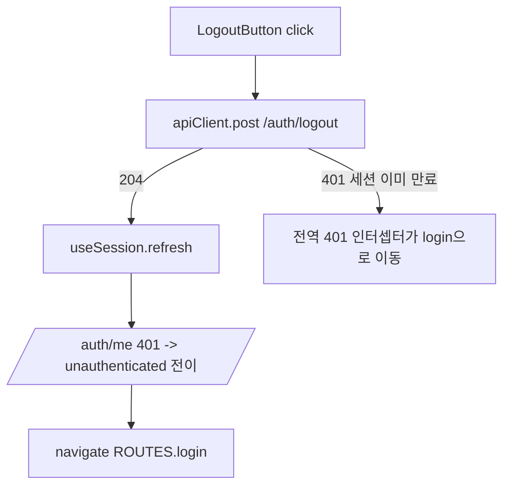
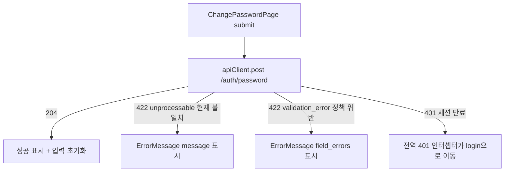

# Design Document — s17-fe-auth

## Overview

**Purpose**: 이 spec은 Notion-lite 프론트엔드의 **인증 화면·플로우**(로그인·로그아웃·본인 비밀번호 변경)를 소유한다.
폐쇄형 서비스 사용자가 UI에서 세션에 진입/이탈하고 본인 비밀번호를 변경하도록 하며, 로그인/로그아웃 결과를 공통
세션 컨텍스트에 반영한다. 세션 상태·라우팅·전역 401·에러 표시는 상위 공통 레이어 `s16-fe-foundation`이 단일 소유하며
이 spec은 그것을 **소비만** 한다(Wave-2, s16 upstream).

**Users**: 최종 사용자는 로그인/로그아웃/비밀번호 변경 화면을 사용하고, 하위 프론트 feature는 s17이 갱신한 세션
컨텍스트(로그인 후 authenticated, 로그아웃 후 unauthenticated)를 s16 `useSession()`으로 소비한다.

**Impact**: `frontend/`는 s16이 최초 도입하는 SPA 골격 위에 얹힌다. s17은 `src/features/auth/`를 신설하여 인증 화면·
훅·얇은 API 래퍼를 배치하고, s16 라우터 프레임의 등록 지점에 로그인(게스트 접근 프레임)·비밀번호 변경(보호 프레임)
화면을 연결한다. 백엔드 s02-auth는 이미 GO이므로 실동작 API를 소비한다(mock 아님).

### Goals
- 로그인 화면과 플로우: 자격 제출 → `refresh()`로 세션 확립 → `returnTo` 복귀(없으면 기본 홈).
- 로그인 실패(단일 401 `unauthenticated`)를 **전역 401 인터셉터를 우회(`skipAuthRedirect`)**하여 인라인 표면화.
- 로그아웃 액션: `POST /auth/logout` → `refresh()`(미인증 전이) → 로그인 경로 이동.
- 본인 비밀번호 변경 화면: 현재/새 비밀번호 제출, 두 갈래 422(현재 불일치·정책 위반)를 공통 에러 유틸로 표면화.
- 로그인/로그아웃 세션 반영을 s16 `refresh()` 단일 진입점으로만 수행.

### Non-Goals
- 세션 컨텍스트·`/auth/me` 부트스트랩·`is_admin`/설정 노출·전역 401 인터셉터·라우터 셸·`returnTo` 규약·공용 API
  클라이언트·`ErrorMessage`·UI 프리미티브(모두 s16 소유; s17은 소비만).
- self sign-up(회원가입) UI·비밀번호 분실 자가 재설정 UI(계약상 미제공/ s18 admin 소관).
- admin 사용자 CRUD·타인 비밀번호 재설정·계정 생명주기(s18-fe-workspace)·워크스페이스 권한(s18).
- 백엔드 인증 **동작**(s02-auth 소유). s17은 계약 소비만.

## Boundary Commitments

### This Spec Owns
- **auth feature 폴더**(`src/features/auth/`): 로그인·비밀번호 변경 화면, 로그아웃 액션, 관련 훅, 얇은 `authApi` 래퍼.
- **로그인 플로우**: 자격 제출 → `apiClient.post("/auth/login", …, { skipAuthRedirect: true })` → `refresh()` →
  `resolveReturnTo` 복귀. 실패 401의 인라인 표면화.
- **로그아웃 플로우**: `apiClient.post("/auth/logout")` → `refresh()` → `ROUTES.login` 이동.
- **비밀번호 변경 플로우**: `apiClient.post("/auth/password", …)` → 성공 표시/초기화, 두 갈래 422 표면화.
- **라우트 등록 결선**: s16 라우터 프레임 등록 지점에 로그인(게스트 접근 프레임)·비밀번호 변경(보호 프레임) 페이지
  element 연결(가드·프레임 로직은 재정의하지 않음).

### Out of Boundary
- 세션 컨텍스트/부트스트랩/`is_admin`·설정 노출/미인증 전이 규칙(s16). s17은 `refresh()`·`useSession()` 소비만.
- 공용 API 클라이언트·전역 401 인터셉터·에러 정규화(`ApiError`)·`ErrorMessage`·UI 프리미티브·라우터 셸·`returnTo`
  보존/복귀 규약(s16).
- self sign-up·비밀번호 분실 재설정·admin 콘솔·워크스페이스 권한(s18). 백엔드 인증 동작(s02-auth).

### Allowed Dependencies
- **Upstream(프론트)**: `s16-fe-foundation` — `useSession()`(status·user·settings·`refresh`), `apiClient`
  (`skipAuthRedirect` 포함), `ROUTES`·`buildLoginPath`·`resolveReturnTo`, `ErrorMessage`·`ApiError`, `Button`·
  `Spinner`, 정본 `AuthUser` 타입(세션 컨텍스트), 보호/게스트 라우트 프레임과 등록 지점.
- **Upstream(계약)**: `s01-contract-foundation` — `ErrorResponse`/`ErrorCode`(401 `unauthenticated`, 422
  `unprocessable`/`validation_error`), `AuthUserRead` 형태. 백엔드 s02-auth 실 엔드포인트를 HTTP로 소비.
- **Shared infra**: React, React Router, TypeScript strict(`any` 금지). 브라우저 `fetch`는 s16 `apiClient` 경유.
- **제약**: 교차 관심사는 s16 경유(재구현 금지). feature는 다른 feature를 직접 import하지 않는다. 클라이언트 검증은
  보안 경계가 아니며 백엔드 계약이 최종 강제.

### Revalidation Triggers
s17은 **최하위 소비자**이며 이 spec을 import하는 하위 spec은 없다(로그아웃 액션 배치 위치를 다른 화면이 참조할 수는
있으나 계약 의존은 아님). 아래 **상위 변경**은 s17 재검증을 유발한다.
- s16 `apiClient` 시그니처·`skipAuthRedirect` 동작·에러 정규화(`ApiError`) 변경.
- s16 `useSession()` 계약(status·user·settings·`refresh`) 또는 정본 `AuthUser` 타입 형태 변경.
- s16 라우터 규약(`ROUTES`·`buildLoginPath`·`resolveReturnTo`·보호/게스트 프레임·등록 지점) 변경.
- s16 `ErrorMessage`·UI 프리미티브 인터페이스 변경.
- 상위 계약(`s01`) 또는 백엔드 s02-auth의 `/auth/login`·`/auth/logout`·`/auth/password` 요청/응답·에러 형태 변경.

## Architecture

### Architecture Pattern & Boundary Map

feature 폴더 소비 패턴(steering `structure.md` 정렬). `src/features/auth/`가 화면·훅·얇은 API 래퍼를 소유하고,
교차 관심사(세션·API·라우팅·에러 표시·UI)는 s16 공통 레이어를 통해서만 접근한다. 의존 방향은 항상 feature →
shared/app 단방향이며, feature는 서로 import하지 않는다.



**Architecture Integration**:
- **Selected pattern**: feature 폴더(`features/auth`) + 얇은 훅/서비스. 교차 관심사는 s16 단일 소유 소비.
- **Domain/feature boundaries**: 인증 화면·플로우만 s17. 세션·라우팅·401·에러·UI는 s16 계약 경유.
- **Existing patterns preserved**: 세션 단일 소스(`useSession`), 단일 API 클라이언트, `returnTo` 규약, 단일 에러
  표시 유틸, `{Resource}Read` 계약 소비, 컴포넌트 PascalCase·훅 camelCase(`structure.md`).
- **New components rationale**: 인증 화면·플로우 훅·얇은 API 래퍼만 신규. 각 파일 단일 책임.
- **Steering compliance**: `structure.md` "feature는 공통 레이어 소비, 다른 feature 직접 import 금지"·"교차 관심사
  공통 레이어 단일 소유"를 그대로 따른다.

### Dependency Direction (강제)
```
config → shared(api/errors, ui) → app(session, router) [s16 소유]  →  features/auth [s17 소유]
```
`features/auth`는 s16의 `app`·`shared`만 import한다. 로그인 실패 401의 인라인 처리는 `apiClient`의
`skipAuthRedirect` 옵션을 지정해 전역 401 인터셉터(→ 라우팅) 경로와 분리한다. 라우트 등록은 앱 합성 루트
(s16 라우터의 "등록 지점")가 s17 페이지 element를 참조하는 형태로, 가드·프레임 로직을 s17이 재정의하지 않는다.

### Technology Stack

| Layer | Choice / Version | Role in Feature | Notes |
|-------|------------------|-----------------|-------|
| UI Framework | React 19 (s16 스택) | 인증 화면·폼 렌더 | 함수형 컴포넌트 + hooks |
| Routing | React Router (s16 셸) | 로그인 후 복귀·로그아웃 이동 | `useNavigate`·`useLocation`, 프레임/가드는 s16 |
| HTTP | s16 `apiClient` | `/auth/*` 호출 | `credentials:"include"`·`skipAuthRedirect`(로그인) |
| Session | s16 `useSession()` | 로그인/로그아웃 세션 반영 | `refresh()` 단일 진입점 |
| Error surface | s16 `ErrorMessage`/`ApiError` | 401·422 표면화 | message·field_errors 단일 유틸 |
| Language | TypeScript 5 (strict) | 타입 안전 | `strict:true`, `any` 금지 |

> 스택 선택 근거·설계 결정은 `research.md` 참조.

## File Structure Plan

### Directory Structure
```
frontend/src/features/auth/            # s17 소유 (s16이 만든 SPA 골격 위)
├── api/
│   └── authApi.ts                     # s16 apiClient 위 얇은 래퍼: login/logout/changePassword + 요청/응답 타입
├── hooks/
│   ├── useLogin.ts                    # 로그인 useCase: login → refresh() → resolveReturnTo 네비게이션 + 상태
│   ├── useLogout.ts                   # 로그아웃 useCase: logout → refresh() → ROUTES.login 네비게이션 + 상태
│   └── useChangePassword.ts           # 비밀번호 변경 useCase: changePassword + 성공/에러 상태
├── components/
│   ├── LoginForm.tsx                  # login_id/password 입력·제출·인라인 에러(ErrorMessage) 표시
│   └── LogoutButton.tsx               # 로그아웃 트리거(진행 중 비활성)
├── pages/
│   ├── LoginPage.tsx                  # 로그인 화면(게스트 접근 프레임 대상 element): LoginForm 배치
│   └── ChangePasswordPage.tsx         # 본인 비밀번호 변경 화면(보호 프레임 대상 element)
└── routes.tsx                         # authRoutes: 로그인/비밀번호 변경 페이지의 경로 대응(s16 등록 지점 소비)
```

> 각 파일 단일 책임. `features/auth/*`는 s16의 `app`·`shared`만 import하고 다른 feature를 import하지 않는다.
> `authApi`는 fetch·에러 파싱을 자체 구현하지 않고 s16 `apiClient`에 위임한다.

### Registration (RouteModule export, not router.tsx edit)
- s17은 `routes.tsx`에서 `authRoutes`를 `RouteModule[]`(로그인=게스트 슬롯, 비밀번호 변경=보호 슬롯)로 export
  하며, s16 `composeRouter` 취합 함수가 이를 각 슬롯에 합성한다. 이는 s16 `RouteModule` 계약에 대한 결선이며
  s17은 `src/app/router.tsx`·`main.tsx`를 직접 수정하지 않는다(프레임/가드 로직은 s16 소유).

## System Flows

### 로그인 플로우 (returnTo 복귀 + 실패 인라인)

로그인 401은 `skipAuthRedirect`로 전역 401 인터셉터를 우회하므로 세션 만료 리다이렉트 루프가 발생하지 않는다
(REQ 2.1·2.3). 성공 네비게이션은 `refresh()` 완료 후 수행해 인증 확정 이전 리다이렉트를 피한다.

### 로그아웃 플로우


### 비밀번호 변경 플로우


## Requirements Traceability

| Requirement | Summary | Components | Interfaces / Contracts | Flows |
|-------------|---------|------------|------------------------|-------|
| 1.1–1.5 | 로그인 화면·returnTo 복귀·로딩·중복방지 | LoginPage, LoginForm, useLogin, authApi, authRoutes | `login()`, `refresh()`, `resolveReturnTo` | 로그인 플로우 |
| 2.1–2.5 | 로그인 실패 401 인라인·단일 계약·skipAuthRedirect | useLogin, LoginForm | `apiClient.post(skipAuthRedirect)`, `ErrorMessage` | 로그인 플로우 |
| 3.1–3.4 | 로그아웃 액션·refresh·login 이동·중복방지 | LogoutButton, useLogout, authApi | `logout()`, `refresh()`, `ROUTES.login` | 로그아웃 플로우 |
| 4.1–4.6 | 비밀번호 변경 화면·204·두 갈래 422·정책 안내 | ChangePasswordPage, useChangePassword, authApi | `changePassword()`, `ErrorMessage` | 비밀번호 변경 플로우 |
| 5.1–5.3 | 세션 반영 refresh 단일·useSession 소비·판정 위임 | useLogin, useLogout | `useSession()`·`refresh()` | 로그인/로그아웃 플로우 |
| 6.1–6.5 | 소비 경계·미제공(가입/재설정)·feature 격리 | authApi, authRoutes, (전체) | s16 계약 소비만 | — |

## Components and Interfaces

| Component | Domain/Layer | Intent | Req Coverage | Key Dependencies (P0/P1) | Contracts |
|-----------|--------------|--------|--------------|--------------------------|-----------|
| authApi | features/auth/api | `/auth/*` 얇은 래퍼 | 1,3,4,6 | s16 apiClient (P0) | Service |
| useLogin | features/auth/hooks | 로그인 useCase·복귀 | 1,2,5 | authApi (P0), useSession (P0), Routes (P0) | Service, State |
| useLogout | features/auth/hooks | 로그아웃 useCase | 3,5 | authApi (P0), useSession (P0), Routes (P0) | Service, State |
| useChangePassword | features/auth/hooks | 비밀번호 변경 useCase | 4 | authApi (P0) | Service, State |
| LoginForm | features/auth/components | 자격 입력·인라인 에러 | 1,2 | useLogin (P0), ErrorMessage (P0), Button/Spinner (P1) | State |
| LoginPage | features/auth/pages | 게스트 프레임 element | 1 | LoginForm (P0) | State |
| ChangePasswordPage | features/auth/pages | 보호 프레임 element | 4 | useChangePassword (P0), ErrorMessage (P0), Button (P1) | State |
| LogoutButton | features/auth/components | 로그아웃 트리거 | 3 | useLogout (P0), Button (P1) | State |
| authRoutes | features/auth | s16 RouteModule[] export(게스트+보호 슬롯) | 1,4,6 | s16 RouteModule/composeRouter (P0) | State |

### features/auth/api

#### authApi
| Field | Detail |
|-------|--------|
| Intent | s16 `apiClient` 위 `/auth/*` 요청/응답의 얇은 타입 래퍼 |
| Requirements | 1.2, 3.2, 4.2, 6.1, 6.4 |

**Responsibilities & Constraints**
- fetch·에러 파싱·base URL·credentials를 자체 구현하지 않고 s16 `apiClient`에 위임한다(교차 관심사 재구현 금지).
- 로그인은 `skipAuthRedirect: true`로 호출하여 401을 인라인 처리 가능하게 한다(REQ 2.3). 로그아웃·비밀번호 변경은
  기본 경로(전역 401 인터셉터 활성) 유지.
- 응답 사용자 타입은 s16 정본 `AuthUser`(세션 컨텍스트 타입)를 **import 재사용**하고 로컬 재선언하지 않는다
  (drift 방지). 요청 본문 타입(`LoginRequest`·`PasswordChangeRequest`)만 백엔드 스키마를 미러링(발명 금지).

**Dependencies**
- Inbound: useLogin·useLogout·useChangePassword(P0)
- Outbound: s16 `apiClient`(P0)

**Contracts**: Service [x]
```typescript
import { apiClient } from "@/shared/api/client";
import type { AuthUser } from "@/app/session";  // s16 정본 AuthUser(세션 컨텍스트 타입) 재사용 — 로컬 재선언 금지(drift 방지)

function login(input: { login_id: string; password: string }): Promise<AuthUser>;
// 내부: apiClient.post<AuthUser>("/auth/login", input, { skipAuthRedirect: true })

function logout(): Promise<void>;
// 내부: apiClient.post<void>("/auth/logout")

function changePassword(input: { current_password: string; new_password: string }): Promise<void>;
// 내부: apiClient.post<void>("/auth/password", input)
```
- Preconditions: s16 `apiClient`가 조립되고 base URL·NavSeam이 주입됨.
- Postconditions: 성공 시 타입 반환(로그인=`AuthUser`, 그 외 void). 오류 시 `apiClient`가 `ApiError` throw.
- Invariants: 엔드포인트 경로·요청 본문 필드명은 백엔드 계약(`/auth/login`·`/auth/logout`·`/auth/password`) 고정.

### features/auth/hooks

#### useLogin
| Field | Detail |
|-------|--------|
| Intent | 로그인 제출 → 세션 반영 → `returnTo` 복귀, 진행/오류 상태 노출 |
| Requirements | 1.2, 1.3, 1.4, 2.1, 2.3, 2.5, 5.1 |

**Responsibilities & Constraints**
- `authApi.login()` 성공 시 `useSession().refresh()`로 세션을 확정한 뒤 `resolveReturnTo(location.search)` 경로로
  네비게이션한다(없으면 기본 홈). 복귀 경로 파싱은 s16 규약에만 위임(REQ 1.5).
- 실패 시 `ApiError`를 상태로 보관해 폼이 `ErrorMessage`로 인라인 표시하게 한다. 재제출 시 직전 오류 해제(REQ 2.5).
- 진행 중 `submitting` 플래그로 중복 제출 방지(REQ 1.4).

**Contracts**: Service [x] / State [x]
```typescript
interface UseLoginResult {
  submit: (credentials: { login_id: string; password: string }) => Promise<void>;
  submitting: boolean;
  error: ApiError | null;
}
function useLogin(): UseLoginResult;
```
- Postconditions: 성공 시 세션 authenticated + 네비게이션 완료. 실패 시 `error` 세팅, 네비게이션 없음.
- Invariants: 세션 write는 `refresh()`로만. 로그인 호출은 `skipAuthRedirect` 경로.

#### useLogout
| Field | Detail |
|-------|--------|
| Intent | 로그아웃 제출 → 세션 미인증 전이 → 로그인 이동 |
| Requirements | 3.2, 3.3, 3.4, 5.1 |

**Contracts**: Service [x] / State [x]
```typescript
interface UseLogoutResult { submit: () => Promise<void>; submitting: boolean; }
function useLogout(): UseLogoutResult;
```
- Postconditions: `authApi.logout()` 후 `refresh()` → `navigate(ROUTES.login)`. 진행 중 `submitting`으로 중복 방지.
- Invariants: 세션 반영은 `refresh()` 단일 진입점. 세션 이미 만료 시 전역 401 인터셉터가 login 이동을 보장.

#### useChangePassword
| Field | Detail |
|-------|--------|
| Intent | 비밀번호 변경 제출과 성공/오류 상태 노출 |
| Requirements | 4.2, 4.3, 4.4, 4.5, 4.6 |

**Contracts**: Service [x] / State [x]
```typescript
interface UseChangePasswordResult {
  submit: (input: { current_password: string; new_password: string }) => Promise<void>;
  submitting: boolean;
  succeeded: boolean;
  error: ApiError | null;
}
function useChangePassword(): UseChangePasswordResult;
```
- Postconditions: 204면 `succeeded=true`. 422(unprocessable·validation_error)면 `error`에 `ApiError` 세팅.
- Invariants: 실패 유형을 프론트에서 분기하지 않고 `ApiError`를 그대로 `ErrorMessage`에 위임. 대상은 항상 현재 사용자.

### features/auth/components & pages

#### LoginForm / LoginPage / ChangePasswordPage / LogoutButton
| Field | Detail |
|-------|--------|
| Intent | 인증 화면 프리젠테이션과 s16 프리미티브·에러 유틸 소비 |
| Requirements | 1.1, 1.4, 2.1, 2.4, 3.1, 4.1, 4.3 |

**Responsibilities & Constraints**
- `LoginForm`: `login_id`·`password` 입력, 제출 시 `useLogin().submit`, 진행 중 제출 비활성(`Spinner`),
  `error`를 `ErrorMessage`로 인라인 표시(REQ 1.4·2.1·2.4).
- `LoginPage`: 게스트 접근 프레임 대상 element로 `LoginForm`을 배치(내용만; 프레임/가드는 s16).
- `ChangePasswordPage`: 보호 프레임 대상 element. 현재/새 비밀번호 입력(대상은 현재 사용자 고정), `useChangePassword`
  소비, 성공 표시·입력 초기화, `error`를 `ErrorMessage`로 표시. 새 비밀번호 8자 클라이언트 편의 검증은 선택적 안내
  이며 백엔드 422가 최종 강제(REQ 4.6).
- `LogoutButton`: `useLogout().submit` 트리거, 진행 중 비활성. 배치 위치(레이아웃/헤더)는 소비 화면이 결정.

**Contracts**: State [x]
```typescript
function LoginForm(): JSX.Element;
function LoginPage(): JSX.Element;
function ChangePasswordPage(): JSX.Element;
function LogoutButton(props?: { className?: string }): JSX.Element;
```
- Boundary: 프리미티브(`Button`·`Spinner`)·에러 표시(`ErrorMessage`)는 s16 소유. 이 컴포넌트는 소비만.

### features/auth

#### authRoutes (등록 결선)
| Field | Detail |
|-------|--------|
| Intent | s16 라우터 등록 지점에 로그인·비밀번호 변경 페이지를 연결 |
| Requirements | 1.1, 4.1, 6.1 |

**Responsibilities & Constraints**
- 로그인 화면을 게스트 슬롯(`scope: "guest"`, `ROUTES.login`)에, 비밀번호 변경 화면을 보호 슬롯
  (`scope: "protected"`)에 대응하는 `RouteModule[]`로 export 한다.
- s16 라우터 프레임/가드/`returnTo` 규약을 재정의하지 않고 `RouteModule` 계약(scope 슬롯)만 소비. 경로 상수는
  s16 `ROUTES` 사용(하드코딩 경로 금지); 비밀번호 변경 전용 경로가 필요하면 s16 `ROUTES`의 확장 규약을 따른다.

**Contracts**: State [x]
```typescript
import type { RouteModule } from "@/app/routeModule"; // s16 계약(scope: "protected" | "guest"; routes: RouteObject[])

// s16 composeRouter가 취합하는 RouteModule[] export
// (게스트 슬롯=로그인 ROUTES.login, 보호 슬롯=비밀번호 변경)
export const authRoutes: RouteModule[] = [
  { scope: "guest", routes: [/* 로그인 화면(ROUTES.login) */] },
  { scope: "protected", routes: [/* 비밀번호 변경 화면 */] },
];
```
- Boundary: 프레임·가드는 s16. s17은 `RouteModule[]` export(경로·element)만 제공하며 `router.tsx`를 수기 편집하지 않는다.

## Data Models

이 spec은 자체 영속 데이터를 소유하지 않는다. 백엔드 계약 형태의 프론트 타입만 소비/미러링한다.

- `AuthUser` — s16 정본 타입(세션 컨텍스트, `useSession()` 노출)을 **import 재사용**하며 s17은 재선언하지 않는다
  (drift 방지). 형태 미러(백엔드 `AuthUserRead` ← `POST /auth/login`·`GET /auth/me`: id·login_id·name·email·is_admin)는
  s16이 단일 소유하고 s17은 그 타입에 바인딩만 한다.
- 로그인 요청 ← `LoginRequest`: login_id·password.
- 비밀번호 변경 요청 ← `PasswordChangeRequest`: current_password·new_password(최소 8자, 백엔드 강제).
- 오류 ← 공통 `ErrorResponse`/`ApiError`(401 `unauthenticated`, 422 `unprocessable`/`validation_error`+field_errors).

### Data Contracts & Integration
- **API 데이터 전송**: JSON. 세션은 서명 쿠키(s16 `apiClient` `credentials:"include"`).
- **에러 직렬화**: 모든 오류는 s16 `apiClient`가 `ApiError`로 정규화. s17은 재파싱하지 않고 `ErrorMessage`에 위임.
- **계약 소유권**: 위 타입은 s01/s02 백엔드 계약과 s16 프론트 타입을 미러링만 하며, 형태 변경은 revalidation trigger.

## Error Handling

### Error Strategy
- **단일 정규화 지점 소비**: 모든 HTTP 오류는 s16 `apiClient`가 `ApiError`로 정규화 → s17은 `ErrorMessage`로 표시.
- **로그인 401 분리**: 로그인 호출만 `skipAuthRedirect`로 전역 401 인터셉터를 우회해 인라인 표시(세션 만료 리다이렉트와
  이중화 금지, 루프 방지).
- **보호 엔드포인트 401**: 로그아웃·비밀번호 변경 중 세션 만료 401은 전역 401 인터셉터가 `returnTo` 보존 후 로그인
  이동을 처리(s16 소유). s17은 별도 처리하지 않는다.

### Error Categories and Responses
- **로그인 401 unauthenticated(4xx)**: 자격/비활동/삭제 공통 → 백엔드 메시지 인라인(`ErrorMessage`), 리다이렉트 없음.
- **비밀번호 변경 422 unprocessable**: 현재 비밀번호 불일치 → message 표시, 변경 미적용.
- **비밀번호 변경 422 validation_error**: 새 비밀번호 정책 위반 → `field_errors` 표시.
- **기타 4xx/5xx**: `ErrorMessage`로 일반 표면화(내부 세부정보 미노출, 백엔드가 500 세부 미노출).

### Monitoring
- 브라우저 콘솔 로깅(개발). 렌더 예외는 s16 `ErrorBoundary`가 포착. 상세 관측 인프라는 범위 밖.

## Testing Strategy

### Unit Tests
- `authApi.login`: `apiClient.post("/auth/login", …, { skipAuthRedirect: true })`로 호출되는지, 반환이 `AuthUser`
  형태인지(1.2, 2.3).
- `useLogin`: 성공 시 `refresh()` 후 `resolveReturnTo` 경로로 네비게이션, 실패 401 시 `error` 세팅·네비게이션 없음,
  재제출 시 직전 오류 해제(1.3, 2.1, 2.5, 5.1).
- `useLogout`: `logout()` → `refresh()` → `navigate(ROUTES.login)` 순서, 진행 중 `submitting`(3.2, 3.3, 3.4).
- `useChangePassword`: 204→`succeeded`, 422 unprocessable/validation_error→`error` 세팅(4.2, 4.4, 4.5).

### Integration Tests
- 로그인 성공 → 세션 authenticated 전이 → `returnTo` 경로 복귀(returnTo 없으면 기본 홈)(1.3, 5.1).
- 로그인 401 → 전역 401 인터셉터의 리다이렉트가 발동하지 않고 `ErrorMessage` 인라인 표시(2.1, 2.3).
- 로그아웃 → 204 → 세션 unauthenticated → 로그인 경로 이동(3.3, 5.1).
- 비밀번호 변경: 현재 비밀번호 불일치 422 message 표시 / 새 비밀번호 8자 미만 422 field_errors 표시(4.4, 4.5).

### E2E / UI Tests
- 미인증 사용자가 보호 경로 진입 → s16 로그인 리다이렉트 → 로그인 성공 → `returnTo` 복귀(1.1, 1.3).
- 비밀번호 변경 화면에서 성공 시 성공 표시·입력 초기화, 실패 시 오류 표면화(4.1, 4.3).
- self sign-up·비밀번호 분실 재설정 진입점이 UI에 존재하지 않음(6.2, 6.3).

### Build / Type Checks
- `tsc --noEmit`(strict) 통과, `any` 미사용. feature가 s16 `app`·`shared`만 import(다른 feature import 없음)(6.4).

## Security Considerations
- 세션은 백엔드 서명 쿠키. s17은 토큰을 저장/노출하지 않고 s16 `apiClient`의 `credentials:"include"`만 소비.
- 로그인 실패는 단일 401(계정 열거 방지)을 그대로 표시하고 사유별 분기를 발명하지 않는다(2.2).
- 새 비밀번호 클라이언트 편의 검증은 UI 안내이며 백엔드 422가 최종 강제(4.6). 클라이언트 게이팅은 보안 경계가 아님.
- self sign-up·비밀번호 분실 자가 재설정 미제공으로 폐쇄형 정책 유지(6.2, 6.3).

## Supporting References
- 상위 소비 계약: `s16-fe-foundation` requirements.md·design.md(ApiClient `skipAuthRedirect`·SessionProvider
  `refresh`·Router `ROUTES`/`resolveReturnTo`·`ErrorMessage`·UI 프리미티브).
- 상위 계약: `s01-contract-foundation` design.md(`ErrorResponse`/`ErrorCode` 401·422 매핑).
- 백엔드 ground truth: `backend/app/auth/router.py`·`service.py`·`schemas.py`(`/auth/login`·`/auth/logout`·
  `/auth/me`·`/auth/password` 요청/응답·에러).
- steering: `tech.md`(Frontend 설정 단일화)·`structure.md`(feature 폴더·공통 레이어 단일 소유·라우팅)·`roadmap.md`
  (FE 계층 순서 s16 → s17).
- 설계 결정·대안 비교: `research.md`.
