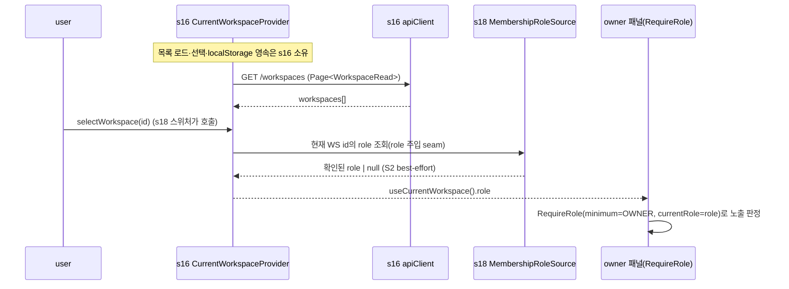
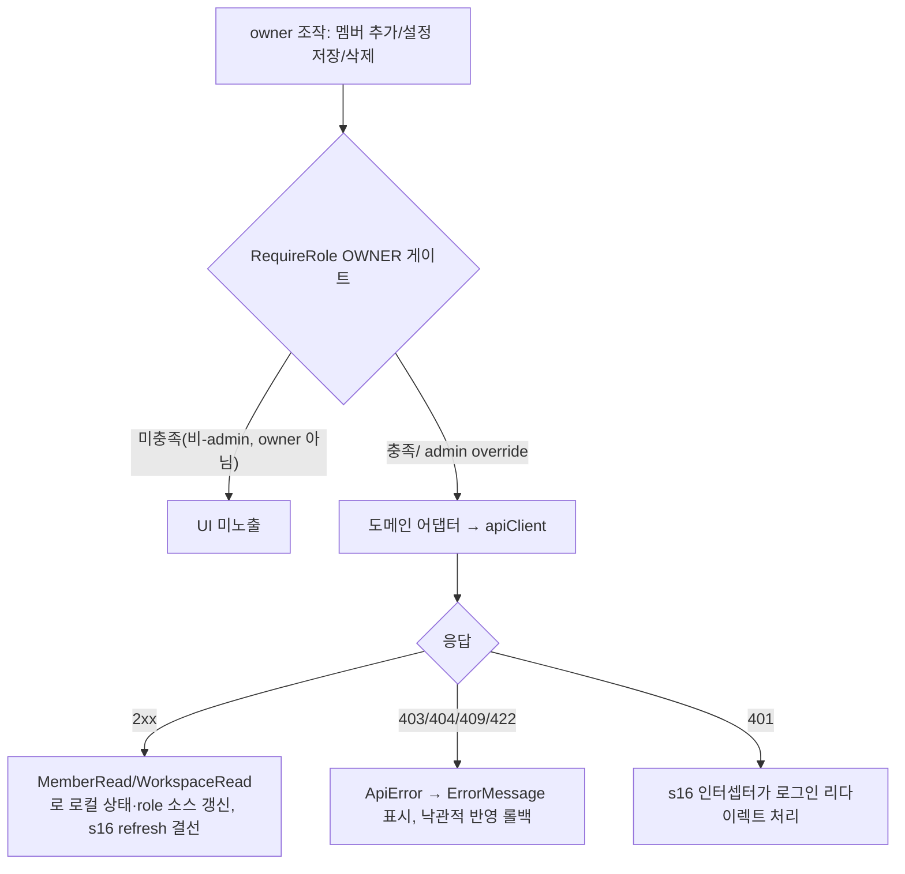
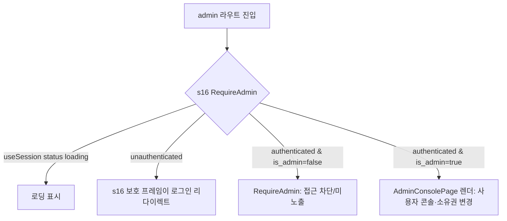

# Design Document — s18-fe-workspace

## Overview

**Purpose**: 이 spec은 MarkSpace 프론트엔드의 **워크스페이스 도메인 관리 화면군**(`src/features/workspace`)을
소유한다. 워크스페이스 스위처·생성, owner 멤버/권한 관리, owner WS 설정(`is_shareable`·보관 기간·삭제),
admin 사용자 콘솔·소유권 변경을 구현한다. 현재 WS **앰비언트 컨텍스트**(`CurrentWorkspaceProvider`·
`useCurrentWorkspace()`·`CurrentWorkspaceContextValue`)와 세션·API 클라이언트·권한 게이팅(`RequireAdmin`
포함)·라우트/Provider 등록 메커니즘·공용 `Page<T>`는 공통 레이어(`s16-fe-foundation`)가 단일 소유하며,
이 spec은 이를 **소비만** 한다.

**Users**: 워크스페이스를 전환·운영하는 일반 사용자와 owner, 계정·소유권을 관리하는 admin이 소비한다. 후속
프론트 spec(s19 문서·s20 편집·s22 공유) 구현자는 s16이 소유한 **현재 WS 앰비언트 컨텍스트**를 소비하며,
이 spec은 그 컨텍스트의 `role` 값을 조달하는 멤버십 seam과 관리 화면을 얹는다.

**Impact**: `frontend/`는 s16이 확립한 공통 레이어 위에 최초의 도메인 feature 폴더(`src/features/workspace`)를
추가한다. 백엔드 워크스페이스(s05)·admin 계정(s03)은 이미 GO이므로 이 화면군은 실동작 API를 소비한다(mock
아님). 이 spec은 현재 WS 컨텍스트를 **새로 만들지 않고** s16 것을 소비하며, 컨텍스트에 부족한 현재 사용자
`role`만 멤버십 데이터 경로로 조달한다.

### Goals
- s16의 **현재 WS 앰비언트 컨텍스트**(`useCurrentWorkspace()`)를 소비하는 워크스페이스 스위처·생성 UI를 구현.
- s16 컨텍스트가 담지 못하는 현재 사용자 `role`(백엔드 `WorkspaceRead`에 호출자 role 부재)을 **단일 멤버십
  role 소스**로 조달해 s16 provider의 role 주입 seam에 공급(role 파생 산발 금지).
- owner 멤버/권한 관리(추가·role 변경·제거)와 WS 설정(`is_shareable` 토글·보관 기간·이름·빈 WS 삭제)을 owner
  게이팅 하에 구현.
- admin 사용자 콘솔(목록·생성·비활동/재활성화·삭제/복원·비밀번호 재설정)과 WS 소유권 변경을 admin 게이팅 하에 구현.
- owner/admin 전용 노출을 s16 권한 게이팅 유틸(`RequireRole`)/s16 `RequireAdmin`(세션 `is_admin`) 단일 경로로만
  결정(컴포넌트 역할 비교 금지).
- 모든 서버 결선을 s16 `apiClient`로, 오류를 s16 `ApiError`/`ErrorMessage`로 통일.

### Non-Goals
- 공통 레이어(세션·API 클라이언트·401·게이팅 유틸·`RequireAdmin`·라우터 셸·**현재 WS 앰비언트 컨텍스트**·
  라우트/Provider 등록 메커니즘·공용 `Page<T>`·UI 프리미티브) 구현 — s16 소유, 소비만.
- 로그인/세션 write(s17), 문서·휴지통(s19), 편집·lock·자동저장(s20), 첨부(s21).
- 공유 링크 발급/토글/무효화 관리 UI와 게스트 뷰(s22) — 이 spec은 `is_shareable` 게이트 플래그 관리 UI만 소유.
- 백엔드 API 동작(s03·s05가 이미 소유). 이 spec은 계약을 소비만.
- 계약에 없는 엔드포인트(멤버 목록·비-admin 사용자 디렉터리·현재 role 조회) 신설 — 발명 금지, seam으로 명시.

## Boundary Commitments

### This Spec Owns
- **현재 WS `role` 조달 멤버십 seam**(`context/membershipRoleSource`): s16 `CurrentWorkspaceContextValue.role`은
  s16이 필드·형태·기본값(null)만 소유하고 값은 s18 멤버십 데이터 경로로 주입된다. 이 spec은 **role을 파생하는
  단일 소스**를 소유하여 s16 provider의 role 주입 seam에 공급한다(백엔드가 role을 담지 않으므로 뮤테이션
  응답으로 확인된 role만 best-effort, 부재 시 null). role 파생은 오직 이 모듈에만 존재한다.
- **워크스페이스 스위처·생성 UI**: s16 `useCurrentWorkspace()`의 목록·현재 WS를 표시하고 `selectWorkspace`로
  전환하며, 생성(`POST /workspaces`) 후 s16 `refresh()`로 컨텍스트를 갱신.
- **owner 멤버/권한 관리 UI**: 추가·role 변경·제거(`/workspaces/{id}/members[/{uid}]`).
- **owner WS 설정 UI**: 이름·`is_shareable` 토글·`trash_retention_days`·빈 WS 삭제(`PATCH/DELETE /workspaces/{id}`).
  `is_shareable` 관리 UI **단독 소유**.
- **admin 사용자 콘솔 UI**: 목록·생성·상태 갱신·비밀번호 재설정(`/admin/users`).
- **admin WS 소유권 변경 UI**(`POST /admin/workspaces/{id}/owner`).
- **도메인 API 어댑터**(`workspaceApi`·`memberApi`·`adminApi`): s16 `apiClient` 위에 도메인 경로·타입을 얇게
  결선한 계층(백엔드 계약 미러링만).
- **도메인 계약 미러 타입**(`api/types.ts`): s16이 소유하지 않는 타입(`WorkspaceCreate/Update`·`Member*`·
  `MemberRole`·`User*`·`AdminPasswordResetRequest`·`OwnerChangeRequest`)만 소유. `Page<T>`·`WorkspaceRead`는
  s16에서 import.
- 위 화면을 s16 라우트/Provider 등록 메커니즘에 얹는 **feature 라우트 모듈**(`RouteModule[]` export)과
  owner/admin 게이팅 결선.

### Out of Boundary
- **현재 WS 앰비언트 컨텍스트 자체**(`CurrentWorkspaceProvider`·`useCurrentWorkspace()`·
  `CurrentWorkspaceContextValue`·선택 localStorage 영속) — **s16 단일 소유, 소비만**. 이 spec은 컨텍스트를
  마운트·재구현하지 않고 훅으로 소비하며, `role` 값 조달과 `selectWorkspace`/`refresh` 호출만 담당한다.
- s16 공통 레이어 자체(세션·API 클라이언트·401·게이팅 유틸·`RequireAdmin`·라우터 셸·라우트/Provider 등록
  메커니즘·공용 `Page<T>`·UI 프리미티브·에디터 래퍼).
- 로그인/세션 write 흐름(s17), 문서/휴지통(s19), 편집/lock/버전(s20), 첨부(s21).
- 공유 링크 발급/관리·게스트 읽기 뷰(s22) — `is_shareable` 게이트 관리만 이 spec이 소유.
- 백엔드 워크스페이스·멤버·admin 계정 **동작**(s03·s05).
- 계약에 없는 엔드포인트 신설(멤버 목록·비-admin 사용자 디렉터리·현재 role 조회).

### Allowed Dependencies
- **Upstream(프론트)**: `s16-fe-foundation` —
  - `apiClient`(get/post/patch/del) — 도메인 결선 단일 경로.
  - `useSession()`(status·user.is_admin·settings·refresh).
  - **현재 WS 앰비언트 컨텍스트**: `useCurrentWorkspace()` → `CurrentWorkspaceContextValue`
    (status·workspaces·currentWorkspace·workspaceId·role·isShareable·selectWorkspace·refresh)와 role 주입 seam.
  - 권한 게이팅: `Role`·`hasWorkspaceRole`·`<RequireRole>`·**`<RequireAdmin>`**(세션 is_admin, INV-3).
  - 공용 타입: `Page<T>`(`{items,total}`)·`WorkspaceRead` 미러.
  - **라우트/Provider 등록 메커니즘**: `RouteModule` 계약(보호/게스트 슬롯)·Provider 합성 슬롯.
  - UI 프리미티브(`Button`·`Spinner`·`EmptyState`·`ErrorMessage`), `ApiError`.
- **Upstream(계약)**: `s01-contract-foundation` API 카탈로그(행 5~9·10~17)·`ErrorResponse`·권한 resolver
  (INV-1·2·3). 백엔드 s03·s05 실 엔드포인트를 HTTP로 소비.
- **제약**: 자체 `fetch`·base URL 상수·에러 파싱·세션 조회·**현재 WS 컨텍스트/Provider**·`RequireAdmin`·
  라우팅 가드·역할 비교·`Page<T>`/`WorkspaceRead` 타입 재구현 금지. 다른 feature(`src/features/*`) 직접 import
  금지. `router.tsx`/`main.tsx` 수기 편집 금지(s16 등록 메커니즘 경유). TypeScript strict, `any` 금지. 클라이언트
  게이팅은 서버 강제를 대체하지 않음. 새 API 형태 발명 금지.

### Revalidation Triggers
아래 변경은 이 spec의 재검증을 유발한다(이 spec은 더 이상 현재 WS 컨텍스트를 소유하지 않으므로 하위 spec의
컨텍스트 재검증은 s16이 트리거).
- **상위 s16 현재 WS 앰비언트 컨텍스트 계약**(`CurrentWorkspaceContextValue` 형태: status·workspaces·
  currentWorkspace·workspaceId·role·isShareable·selectWorkspace·refresh) 또는 **role 주입 seam** 변경 → 이 spec
  재검증(스위처·role 소스·게이팅 결선).
- 상위 s16 계약(apiClient 시그니처·useSession 형태·`RequireRole`/`RequireAdmin`·라우트/Provider 등록
  메커니즘·공용 `Page<T>`·`WorkspaceRead` 미러) 변경 → 이 spec 재검증.
- 상위 s01 계약(워크스페이스·멤버·admin 계정 엔드포인트 경로·스키마·요구 role) 변경 → 이 spec 재검증.
- 백엔드가 멤버 목록·현재 role 조회 엔드포인트를 추가하면(현 seam 해소), 멤버 관리·role 조달 설계 재검증.
- 이 spec `is_shareable` 관리 UI가 소비하는 `currentWorkspace.is_shareable` 노출(s16 소유) 변경 → 이 spec 재검증.

## Architecture

### Contract Constraints & Adjacent Seams (설계 전제)

이 spec은 계약(s01 카탈로그)·백엔드 라우터의 실제 시그니처만 소비하며 새 형태를 발명하지 않는다. 그 결과 아래
**계약 공백**을 설계 전제로 명시하고, 발명 대신 seam으로 처리한다.

| # | 공백 | 영향 | 이 spec의 처리(발명 아님) |
|---|------|------|---------------------------|
| S1 | 멤버 목록 조회 엔드포인트 없음(행 15~17은 add/patch/delete 뮤테이션만) | owner가 기존 멤버 전체를 권위 있게 열거 불가 | 뮤테이션 응답(`MemberRead`: user_id·role)으로 확인된 멤버만 화면 상태로 관리하고, 열거 한계를 UI에 명시. GET 멤버 엔드포인트를 발명하지 않음 |
| S2 | `WorkspaceRead`에 현재 사용자 role 필드 없음(ground truth: `backend/app/workspace/schemas.py`) | s16 `CurrentWorkspaceContextValue.role`을 직접 조달 불가 | s16이 role 필드·형태·기본값(null)만 소유하고, s18이 **단일 멤버십 role 소스**로 조달 가능한 신호(생성 응답 owner화·멤버 뮤테이션 role 에코)를 best-effort 공급, 부재 시 `null`. admin은 세션 `is_admin`으로 별도 게이팅(INV-3). 서버 403이 최종 권위 |
| S3 | 비-admin 사용자 디렉터리 엔드포인트 없음(`GET /admin/users`는 admin 전용) | 비-admin owner의 멤버 추가 시 대상 user 탐색 불가 | 멤버 추가는 `user_id` 직접 입력을 전제로 설계. 비-admin 디렉터리를 발명하지 않고 seam으로 명시 |

이 seam들은 cross-spec review와 백엔드 후속(멤버/role 조회 엔드포인트 추가 가능성)에서 조정한다. 설계는 계약이
제공하는 범위 안에서 사용자가 오해 없이 조작할 수 있도록 열거·조달 한계를 UI에 드러낸다.

### Architecture Pattern & Boundary Map

feature 폴더 캡슐화 패턴(steering `structure.md` 정렬). `src/features/workspace`가 워크스페이스 도메인 화면·
훅·API 어댑터를 자기 폴더에 두고, 교차 관심사는 전부 s16 공통 레이어를 소비한다. **현재 WS 앰비언트
컨텍스트는 s16이 단일 소유·마운트**하며, 이 spec은 (a) 그 컨텍스트를 훅으로 소비하고 (b) 컨텍스트가 담지
못하는 현재 사용자 `role`을 s16 provider의 주입 seam에 공급하는 **단일 role 소스**만 기여한다. feature 간 직접
import는 금지된다.

```mermaid
graph TB
    subgraph S16[s16 공통 레이어 - 소비 대상]
        Api[apiClient]
        Session[useSession is_admin]
        Perm[hasWorkspaceRole / RequireRole / Role]
        AdminGate[RequireAdmin]
        Ui[UI primitives / ErrorMessage]
        Router[RouteModule registry / Provider slots]
        CurWs[CurrentWorkspaceProvider / useCurrentWorkspace]
        PageT[Page T / WorkspaceRead]
    end
    subgraph WS[src/features/workspace - 이 spec 소유]
        RoleSrc[MembershipRoleSource: role 단일 소스 → s16 role 주입 seam]
        Switcher[WorkspaceSwitcher + CreateWorkspaceDialog]
        Members[MemberManagementPanel]
        Settings[WorkspaceSettingsPanel]
        subgraph Admin[admin 화면군]
            Console[AdminConsolePage]
            Users[AdminUserPanel + PasswordResetDialog]
            Owner[AdminOwnerChangePanel]
        end
        subgraph Adapters[도메인 API 어댑터]
            WsApi[workspaceApi]
            MemApi[memberApi]
            AdmApi[adminApi]
        end
        RouteMod[WorkspaceRouteModule: RouteModule[] export]
    end
    RoleSrc --> CurWs
    Switcher --> CurWs
    Switcher --> WsApi
    Switcher --> Ui
    Members --> MemApi
    Members --> Perm
    Members --> CurWs
    Members --> RoleSrc
    Settings --> WsApi
    Settings --> Perm
    Settings --> CurWs
    Console --> AdminGate
    Users --> AdmApi
    Owner --> AdmApi
    WsApi --> Api
    MemApi --> Api
    AdmApi --> Api
    WsApi --> PageT
    AdmApi --> PageT
    Console --> Router
    RouteMod --> Router
```

**Architecture Integration**:
- **Selected pattern**: feature 폴더 소유 + 공통 레이어 소비(s16 대칭). 현재 WS 컨텍스트는 s16 소유이므로 상향
  노출이 없다. 이 spec의 유일한 상향 기여는 s16 role 주입 seam에 공급하는 **단일 role 소스**다.
- **Domain/feature boundaries**: 워크스페이스·멤버·설정·admin을 한 feature 폴더에 두되, 하위 도메인별 패널·
  어댑터로 단일 책임 분리. admin 화면군은 s16 `RequireAdmin` 게이트 하위에 격리.
- **Existing patterns preserved**: 설정 단일화(base URL은 s16 config), 절대 import alias(`@/`),
  `{Resource}Read/Create/Update` 계약 소비, INV-1·2·3 게이팅을 s16 유틸 경유, 공용 `Page<T>`/`WorkspaceRead`
  s16 단일 정의 import.
- **New components rationale**: 각 패널은 하나의 API 어댑터·하나의 화면 책임. `MembershipRoleSource`는 role
  파생의 **단일 소유자**로, cross-spec review에서 s16이 현재 WS 컨텍스트를 단일 소유하도록 정정됨에 따라
  s18은 컨텍스트를 소비하고 role 값만 조달하는 역할로 수렴한다.
- **Steering compliance**: `structure.md` "feature는 공통 레이어를 소비하되 다른 feature를 직접 import 하지
  않는다", "권한 UI 노출은 공통 게이팅 유틸 경유", "교차 관심사는 공통 레이어 단일 소유" 원칙을 구현.

### Dependency Direction (강제)
```
s16(shared/api, auth[RequireAdmin], ui, session, router[RouteModule], workspace-context, Page<T>)
  →  features/workspace(adapters → role source/hooks → panels/pages → route module)
```
feature는 s16만 import한다. feature 내부는 `adapters → role source/hooks → UI` 단방향. 현재 WS 컨텍스트는 s16이
마운트하고 하위 feature가 훅으로 소비하며, 이 spec은 role 소스를 s16 provider의 주입 seam에 등록만 한다(s16
파일을 수기 편집하지 않고 등록 메커니즘 경유).

### Technology Stack

| Layer | Choice / Version | Role in Feature | Notes |
|-------|------------------|-----------------|-------|
| UI Framework | React 19 (s16 확립) | 화면·패널·다이얼로그 렌더 | 함수형 컴포넌트 + hooks |
| Routing | React Router (s16 셸) | 도메인 화면 등록·admin 라우트 | s16 `RouteModule[]` export로 가산 등록 |
| HTTP | s16 `apiClient` | 도메인 API 결선 | base URL·credentials·401·에러 정규화 내장 |
| 현재 WS 컨텍스트 | s16 `useCurrentWorkspace()` | 목록·현재 WS·role·isShareable 소비 | **s16 소유, 소비만**. role 값은 s18이 조달 |
| 권한 게이팅 | s16 `hasWorkspaceRole`·`<RequireRole>` + s16 `<RequireAdmin>`(session `is_admin`) | owner/admin UI 노출 | 컴포넌트 역할 비교 금지, `RequireAdmin` 재구현 금지 |
| 상태(도메인) | React 로컬 state | 멤버/패널/폼 상태·role 소스 | 전역 상태 라이브러리 미도입(s16 결정 계승) |
| Styling | Tailwind CSS 4 (s16) | 패널·표·폼 스타일 | s16 UI 프리미티브 재사용 |
| Language | TypeScript 5 (strict) | 타입 안전 | `any` 금지, 백엔드 계약 미러 타입 |

> 세부 결정 근거(계약 공백 처리·role 조달·컨텍스트 소비 경계)는 `research.md` 참조.

## File Structure Plan

### Directory Structure
```
frontend/src/features/workspace/
├── api/
│   ├── types.ts                      # s16이 소유하지 않는 계약 미러 타입만: WorkspaceCreate/Update,
│   │                                 #   MemberRead/Create/Update·MemberRole, UserRead/Create/Update,
│   │                                 #   AdminPasswordResetRequest, OwnerChangeRequest.
│   │                                 #   Page<T>·WorkspaceRead 는 s16(@/shared/types)에서 import(재정의 금지)
│   ├── workspaceApi.ts               # /workspaces 목록·생성·상세·수정·삭제 어댑터(apiClient 위)
│   ├── memberApi.ts                  # /workspaces/{id}/members[/{uid}] 추가·role변경·제거 어댑터
│   └── adminApi.ts                   # /admin/users(목록·생성·수정·비번재설정) + /admin/workspaces/{id}/owner 어댑터
├── context/
│   └── membershipRoleSource.ts       # 현재 WS role 조달 단일 소스. 뮤테이션 응답(생성 owner화·멤버 role 에코)으로
│                                     #   확인된 role만 best-effort 축적, s16 provider의 role 주입 seam에 공급(기본 null)
├── hooks/
│   ├── useWorkspaceActions.ts        # 생성·설정 갱신·삭제 뮤테이션(s16 refresh 결선, 생성 시 role 소스에 owner 기록)
│   └── useMemberActions.ts           # 멤버 추가·role변경·제거 뮤테이션(로컬 멤버 상태 관리, S1 seam; self role 에코를 role 소스에 반영)
├── components/
│   ├── WorkspaceSwitcher.tsx         # s16 useCurrentWorkspace 목록·현재 WS 전환(selectWorkspace) UI
│   ├── CreateWorkspaceDialog.tsx     # WS 생성 폼(성공 시 s16 refresh)
│   ├── MemberManagementPanel.tsx     # owner 멤버 추가/role변경/제거(RequireRole OWNER 게이트)
│   ├── WorkspaceSettingsPanel.tsx    # owner 이름/is_shareable/retention/삭제(RequireRole OWNER 게이트)
│   └── RoleSelect.tsx                # owner/editor/viewer 3값만 허용하는 role 선택 프리미티브
├── admin/
│   ├── AdminConsolePage.tsx          # admin 화면군 라우트 셸(s16 RequireAdmin 하위)
│   ├── AdminUserPanel.tsx            # 계정 목록·생성·상태 갱신(is_active/is_deleted 독립)
│   ├── AdminUserForm.tsx             # 계정 생성/편집 폼
│   ├── PasswordResetDialog.tsx       # admin 비밀번호 재설정
│   └── AdminOwnerChangePanel.tsx     # WS 소유권 변경(new_owner_user_id)
└── routes.tsx                        # s16 RouteModule[] export(보호 슬롯 워크스페이스 화면 + admin 서브트리)
```

### Consumed s16 Surfaces (재구현 금지)
- `@/app/workspace-context` — `CurrentWorkspaceProvider`(s16 마운트)·`useCurrentWorkspace()`·
  `CurrentWorkspaceContextValue` 및 role 주입 seam. 이 spec은 provider를 마운트하지 않고 훅으로 소비하며,
  role 소스를 s16 provider의 주입 seam에 등록한다.
- `@/shared/auth` — `Role`·`hasWorkspaceRole`·`<RequireRole>`·`<RequireAdmin>`.
- `@/shared/types` — `Page<T>`(`{items,total}`)·`WorkspaceRead`.
- `@/app` 라우트/Provider 등록 메커니즘 — `RouteModule` 계약. 이 spec은 `routes.tsx`에서 `RouteModule[]`를
  export 하여 s16 취합 함수가 보호 슬롯에 합성한다(`router.tsx`/`main.tsx` 수기 편집 없음).

> 각 파일은 단일 책임. feature는 s16만 import하고 다른 feature를 import하지 않는다. 계약 미러 타입은 `api/types.ts`
> 단일 소유이되 `Page<T>`·`WorkspaceRead`는 s16 정의를 import한다(새 필드 발명 금지).

## System Flows

### 현재 WS role 조달(멤버십 seam) — s16 컨텍스트 소비

role은 계약상 직접 조달 불가(S2). admin이면 s16 `RequireAdmin`/`hasWorkspaceRole`이 세션 `is_admin`으로 통과하므로
role 값 자체가 불필요하고, 비-admin은 생성 응답(owner화)·멤버 뮤테이션 자기 role 에코로 확인된 범위에서만
`MembershipRoleSource`가 채운다. 확정 불가 시 `null`이며 owner 전용 UI는 은닉되되 서버 403이 최종 권위다.
role 파생 로직은 `MembershipRoleSource` **한 곳**에만 존재한다.

### owner 뮤테이션 및 오류 처리(멤버/설정)


### admin 콘솔 게이팅(s16 RequireAdmin 소비)


## Requirements Traceability

| Requirement | Summary | Components | Interfaces / Contracts | Flows |
|-------------|---------|------------|------------------------|-------|
| 1.1–1.6 | s16 현재 WS 컨텍스트 소비·스위처 UI·role 멤버십 seam 조달 | WorkspaceSwitcher, MembershipRoleSource | s16 `useCurrentWorkspace()`, role 주입 seam | role 조달 |
| 2.1–2.4 | WS 생성(owner화)·검증·오류·refresh | CreateWorkspaceDialog, useWorkspaceActions, workspaceApi | `POST /workspaces`(WorkspaceCreate→WorkspaceRead), s16 `refresh` | owner 뮤테이션 |
| 3.1–3.7 | 멤버 추가/role변경/제거·owner 게이팅·열거 seam | MemberManagementPanel, useMemberActions, memberApi, RoleSelect | `POST/PATCH/DELETE /workspaces/{id}/members[/{uid}]` | owner 뮤테이션 |
| 4.1–4.6 | 이름/is_shareable/retention/삭제·owner 게이팅 | WorkspaceSettingsPanel, useWorkspaceActions, workspaceApi | `PATCH/DELETE /workspaces/{id}`(WorkspaceUpdate→WorkspaceRead) | owner 뮤테이션 |
| 5.1–5.7 | admin 계정 목록·생성·상태·비번재설정·단일 admin 잠금 | AdminUserPanel, AdminUserForm, PasswordResetDialog, adminApi | `GET/POST /admin/users`, `PATCH /admin/users/{id}`, `POST /admin/users/{id}/password` | admin 게이팅 |
| 6.1–6.3 | admin 소유권 변경 | AdminOwnerChangePanel, adminApi | `POST /admin/workspaces/{id}/owner`(OwnerChangeRequest→WorkspaceRead) | admin 게이팅 |
| 7.1–7.5 | owner/admin UI 노출 게이팅 s16 경유·서버 403 권위 | MemberManagementPanel, WorkspaceSettingsPanel, AdminConsolePage | s16 `hasWorkspaceRole`·`<RequireRole>`·`<RequireAdmin>` | 두 게이팅 flow |
| 8.1–8.5 | s16 소비·RouteModule 등록·오류 표시·feature 격리 | 모든 어댑터, WorkspaceRouteModule, MembershipRoleSource | s16 `apiClient`·`useSession`·`useCurrentWorkspace`·`ApiError`/`ErrorMessage`·`RouteModule` | 전체 |

## Components and Interfaces

| Component | Domain/Layer | Intent | Req Coverage | Key Dependencies (P0/P1) | Contracts |
|-----------|--------------|--------|--------------|--------------------------|-----------|
| DomainTypes | api | s16 비소유 계약 미러 타입 | 2,3,4,5,6 | s01 계약 (P0), s16 Page/WorkspaceRead (P0) | State |
| workspaceApi | api | /workspaces 어댑터 | 1,2,4 | apiClient (P0), DomainTypes (P0), Page<T> (P0) | Service |
| memberApi | api | 멤버 뮤테이션 어댑터 | 3 | apiClient (P0), DomainTypes (P0) | Service |
| adminApi | api | admin 계정·소유권 어댑터 | 5,6 | apiClient (P0), DomainTypes (P0), Page<T> (P0) | Service |
| MembershipRoleSource | context | 현재 WS role 조달 단일 소스(s16 role 주입 seam 공급) | 1 | useCurrentWorkspace (P0), 뮤테이션 응답 (P0) | Service, State |
| WorkspaceSwitcher | components | s16 컨텍스트 목록·전환 UI | 1 | useCurrentWorkspace (P0), Ui (P1) | State |
| CreateWorkspaceDialog | components | WS 생성 폼 | 2 | useWorkspaceActions (P0) | State |
| useWorkspaceActions | hooks | 생성·설정·삭제 뮤테이션 + s16 refresh | 2,4 | workspaceApi (P0), useCurrentWorkspace (P0), MembershipRoleSource (P1) | Service |
| MemberManagementPanel | components | owner 멤버 관리 UI | 3,7 | useMemberActions (P0), RequireRole (P0), useCurrentWorkspace (P0), RoleSelect (P1) | State |
| useMemberActions | hooks | 멤버 뮤테이션·로컬 상태(S1) | 3 | memberApi (P0), MembershipRoleSource (P1) | Service, State |
| RoleSelect | components | owner/editor/viewer 선택 | 3 | DomainTypes (P0) | State |
| WorkspaceSettingsPanel | components | owner 설정·is_shareable·삭제 | 4,7 | useWorkspaceActions (P0), RequireRole (P0), useCurrentWorkspace (P0) | State |
| AdminConsolePage | admin | admin 화면군 라우트 셸 | 5,6,7 | RequireAdmin (s16, P0), Router (P0) | State |
| AdminUserPanel | admin | 계정 목록·상태 갱신 | 5 | adminApi (P0), AdminUserForm (P1) | State |
| AdminUserForm | admin | 계정 생성/편집 폼 | 5 | adminApi (P0) | State |
| PasswordResetDialog | admin | 비밀번호 재설정 | 5 | adminApi (P0) | State |
| AdminOwnerChangePanel | admin | WS 소유권 변경 | 6 | adminApi (P0) | State |
| WorkspaceRouteModule | routes | s16 RouteModule[] export(보호 슬롯 + admin 서브트리) | 8 | RouteModule (s16, P0), RequireAdmin (s16, P0) | State |

### api

#### DomainTypes
| Field | Detail |
|-------|--------|
| Intent | 백엔드 멤버·admin 계정·WS 쓰기 계약의 프론트 미러 타입(발명 금지). `Page<T>`·`WorkspaceRead`는 s16에서 import |
| Requirements | 2.1, 3.1, 4.1, 5.1, 6.1 |

**Contracts**: State [x]
```typescript
// s16 공용 타입 소비 — 재정의 금지(s16 단일 소유)
import type { Page } from "@/shared/types/page";           // { items: T[]; total: number }
import type { WorkspaceRead } from "@/shared/types/workspace"; // id·created_at·updated_at·name·is_shareable·trash_retention_days

// s16이 소유하지 않는 도메인 계약만 이 spec이 미러링(백엔드 스키마 미러 — 새 필드/코드 발명 금지)
type MemberRole = "owner" | "editor" | "viewer";

interface WorkspaceCreate { name: string; }
interface WorkspaceUpdate { name?: string; is_shareable?: boolean; trash_retention_days?: number; }

interface MemberRead { id: number; workspace_id: number; user_id: number; role: MemberRole; }
interface MemberCreate { user_id: number; role: MemberRole; }
interface MemberUpdate { role: MemberRole; }

interface UserRead { id: number; created_at: string; updated_at: string | null;
  login_id: string; name: string; email: string | null;
  is_admin: boolean; is_active: boolean; is_deleted: boolean; }
interface UserCreate { login_id: string; password: string; name: string; email?: string | null; }
interface UserUpdate { name?: string; email?: string | null; is_active?: boolean; is_deleted?: boolean; }
interface AdminPasswordResetRequest { new_password: string; }
interface OwnerChangeRequest { new_owner_user_id: number; }
```
- Boundary: 백엔드 `MemberRead`/`UserRead` 등 형태를 미러링만. `Page<T>`(`{items,total}`)·`WorkspaceRead`는 s16
  단일 정의를 import 하여 형태 드리프트를 방지한다(`Page`에 limit/offset 필드 없음 — 페이지네이션은 쿼리 파라미터).
  `WorkspaceRead`에 role 필드가 없다는 사실(S2)을 그대로 반영(현재 role은 타입에 얹지 않음).

#### workspaceApi / memberApi / adminApi
| Field | Detail |
|-------|--------|
| Intent | s16 `apiClient` 위에 도메인 경로·타입을 얇게 결선한 어댑터(중복 fetch 금지) |
| Requirements | 1.1, 2.1, 3.1~3.3, 4.1, 4.4, 5.1~5.4, 6.1 |

**Contracts**: Service [x]
```typescript
const workspaceApi = {
  list: (limit?: number, offset?: number) => Promise<Page<WorkspaceRead>>,   // GET /workspaces (limit/offset=쿼리)
  create: (body: WorkspaceCreate) => Promise<WorkspaceRead>,                 // POST /workspaces (201)
  get: (id: number) => Promise<WorkspaceRead>,                               // GET /workspaces/{id}
  update: (id: number, body: WorkspaceUpdate) => Promise<WorkspaceRead>,     // PATCH /workspaces/{id}
  remove: (id: number) => Promise<void>,                                     // DELETE /workspaces/{id} (204)
};
const memberApi = {
  add: (id: number, body: MemberCreate) => Promise<MemberRead>,             // POST .../members (201)
  changeRole: (id: number, uid: number, body: MemberUpdate) => Promise<MemberRead>, // PATCH .../members/{uid}
  remove: (id: number, uid: number) => Promise<void>,                       // DELETE .../members/{uid} (204)
};
const adminApi = {
  listUsers: (limit?: number, offset?: number) => Promise<Page<UserRead>>,  // GET /admin/users (limit/offset=쿼리)
  createUser: (body: UserCreate) => Promise<UserRead>,                      // POST /admin/users (201)
  updateUser: (id: number, body: UserUpdate) => Promise<UserRead>,         // PATCH /admin/users/{id}
  resetPassword: (id: number, body: AdminPasswordResetRequest) => Promise<void>, // POST .../password (204)
  changeOwner: (id: number, body: OwnerChangeRequest) => Promise<WorkspaceRead>, // POST /admin/workspaces/{id}/owner
};
```
- Invariants: 모든 호출은 s16 `apiClient` 경유(401·에러 정규화 단일 지점 재사용). 경로·메서드·스키마는 카탈로그
  행 5~9·10~17과 정확히 일치. `list`/`listUsers`의 `limit`/`offset`은 **쿼리 파라미터**이며 응답 엔벨로프
  `Page<T>`에는 포함되지 않는다(s16 `Page<T>`={items,total}). 어댑터는 비즈니스 로직 없이 결선만.

### context

#### MembershipRoleSource (현재 WS role 조달 단일 소스)
| Field | Detail |
|-------|--------|
| Intent | s16 `CurrentWorkspaceContextValue.role` 값을 조달하는 **유일한** role 파생 지점. s16 provider의 role 주입 seam에 공급 |
| Requirements | 1.4 |

**Responsibilities & Constraints**
- s16이 role 필드·형태·기본값(null)만 소유하고 값은 s18 멤버십 데이터 경로로 주입된다(S2). 이 모듈은 role을
  **best-effort로 축적**하는 단일 소스로, 조달 가능한 신호만 사용한다:
  - 워크스페이스 생성 응답 → 생성자를 해당 WS의 `owner`로 기록(요구 2.3).
  - 멤버 뮤테이션 응답 중 **현재 사용자 자신**에 대한 role 에코 → 해당 WS role 갱신.
  - 그 외에는 조달 불가로 간주하여 `null`(요구 1.4). 백엔드는 role 조회 엔드포인트를 제공하지 않으므로 별도
    fetch를 발명하지 않는다.
- 이 값은 s16 `CurrentWorkspaceProvider`의 role 주입 seam(= `RequireRole` `currentRole` 주입과 동형)에 공급되어
  `useCurrentWorkspace().role`로 노출된다. s16 파일을 수기 편집하지 않고 등록 메커니즘/seam으로 결선한다.
- admin override는 role에 접합하지 않는다. admin은 s16 `RequireAdmin`/`hasWorkspaceRole`이 세션 `is_admin`으로
  별도 통과시킨다(INV-3). role 파생 로직은 이 모듈 밖에 두지 않는다(산발 금지).

**Contracts**: Service [x] / State [x]
```typescript
import { Role } from "@/shared/auth/roles";

// 현재 사용자의 WS별 확인된 role 을 축적하는 단일 소스. s16 role 주입 seam이 소비한다.
interface MembershipRoleSource {
  roleFor(workspaceId: number): Role | null;      // 확인된 role | null (S2 best-effort)
  recordOwner(workspaceId: number): void;         // WS 생성 응답 → 생성자=owner
  recordSelfRole(workspaceId: number, role: Role): void; // 멤버 뮤테이션의 자기 role 에코 반영
}
```
- Boundary: role의 **형태·기본값(null)·컨텍스트 노출**은 s16 소유. 이 모듈은 **값 조달**만 소유한다.
- Invariants: role 파생은 이 모듈에만 존재. 패널은 `useCurrentWorkspace().role`을 읽을 뿐 role을 재파생하지 않는다.

### components (owner 게이팅)

#### WorkspaceSwitcher / CreateWorkspaceDialog
| Field | Detail |
|-------|--------|
| Intent | s16 현재 WS 컨텍스트를 소비하는 스위처·생성 UI(컨텍스트 재구현 금지) |
| Requirements | 1.1, 1.2, 1.3, 1.5, 1.6, 2.1~2.4 |

**Responsibilities & Constraints**
- `WorkspaceSwitcher`는 `useCurrentWorkspace()`의 `workspaces`를 표시하고 `currentWorkspace`를 현재 선택으로
  강조한다. WS 전환은 `selectWorkspace(id: string)` 호출로 위임한다(`workspaceId`는 s16이 `String(id)`로 파생).
  목록 로드·선택 영속(localStorage)은 **s16 소유**이므로 재구현하지 않는다.
- `status === "empty"`(소속 WS 없음)면 빈 상태 안내를 표시하고 잘못된 현재 WS 선택을 강제하지 않는다(요구 1.5).
- `CreateWorkspaceDialog`는 이름 입력 → `POST /workspaces`. 성공 시 `useWorkspaceActions`가 s16 `refresh()`로
  목록·현재 WS를 갱신하고, `MembershipRoleSource.recordOwner(newId)`로 생성자 owner role을 기록한다(요구 2.3).
  빈 이름 방지 또는 서버 422를 s16 `ErrorMessage`로 표시한다.

**Contracts**: State [x]
- Inbound: `useCurrentWorkspace`(s16), `useWorkspaceActions`(P0).
- Boundary: WS 목록/선택/영속은 s16 컨텍스트 소비만. 이 컴포넌트는 표시·전환 트리거·생성 폼만 소유.

#### MemberManagementPanel / WorkspaceSettingsPanel
| Field | Detail |
|-------|--------|
| Intent | owner 멤버/권한·WS 설정 관리 UI. 노출은 s16 게이팅 유틸 경유 |
| Requirements | 3.1~3.7, 4.1~4.6, 7.1, 7.3, 7.4, 7.5 |

**Responsibilities & Constraints**
- 두 패널 모두 `<RequireRole minimum={Role.OWNER} currentRole={useCurrentWorkspace().role}>`로 감싸 노출(현재
  role은 s16 컨텍스트에서 주입, 값 조달은 `MembershipRoleSource`). admin은 s16 유틸이 `is_admin`으로 통과
  (INV-3). owner 미만은 은닉(INV-2).
- MemberManagementPanel: `user_id`+role 추가, role 변경, 제거. 멤버 목록 조회 엔드포인트 부재(S1)로 뮤테이션
  응답으로 확인된 멤버만 로컬 상태에 표시하고, 전체 열거가 아님을 UI에 명시. 대상이 자기 자신이면 role 에코를
  `MembershipRoleSource.recordSelfRole`로 반영.
- WorkspaceSettingsPanel: 이름·`is_shareable` 토글(현재 값은 `useCurrentWorkspace().currentWorkspace.is_shareable`
  또는 파생 `isShareable`)·`trash_retention_days` 편집(부분 갱신), 빈 WS 삭제(409 시 안내). 저장 성공 시 s16
  `refresh()`로 컨텍스트 갱신. `is_shareable` 관리 UI 단독 소유.
- 오류는 s16 `ErrorMessage`(ApiError)로 표시. 클라이언트 게이팅으로 숨겼어도 서버 403을 항상 오류로 처리(7.5).

**Contracts**: State [x]
- Inbound: `useCurrentWorkspace`(현재 WS id·role·isShareable), `useMemberActions`/`useWorkspaceActions`(P0).
- Boundary: role 문자열 직접 비교 금지 — 노출 판정은 오직 `RequireRole`/`hasWorkspaceRole`. WS 선택/영속은 s16.

### admin

#### AdminConsolePage / AdminUserPanel / PasswordResetDialog / AdminOwnerChangePanel
| Field | Detail |
|-------|--------|
| Intent | admin 세션 전용 화면군: 계정 생명주기·비번 재설정·WS 소유권 변경. 게이트는 s16 `RequireAdmin` 소비 |
| Requirements | 5.1~5.7, 6.1~6.3, 7.2 |

**Responsibilities & Constraints**
- 게이팅은 **s16 `<RequireAdmin>`**(세션 `is_admin` 단일 출처, INV-3)을 소비하며 이 spec은 재구현하지 않는다.
  admin 전용 경로는 WS role 위계가 아니므로 `hasWorkspaceRole`이 아니라 s16 `RequireAdmin`을 사용한다(요구
  5.6·6.2·7.2). 비-admin·미인증은 접근 차단(미인증은 s16 보호 프레임이 로그인 리다이렉트).
- `AdminConsolePage`는 s16 `RequireAdmin` 하위에 AdminUserPanel·AdminOwnerChangePanel을 배치하는 라우트 셸이다.
- `AdminUserPanel`: `GET /admin/users` 목록(삭제·비활동 포함), `POST /admin/users` 생성, `PATCH /admin/users/{id}`
  로 `is_active`·`is_deleted`를 **독립** 토글(비활동/재활성화·삭제/복원). 단일 admin 비활동/삭제 409 안내(5.5).
- `PasswordResetDialog`: `POST /admin/users/{id}/password`(new_password) 재설정, 204 확인.
- `AdminOwnerChangePanel`: `POST /admin/workspaces/{id}/owner`(new_owner_user_id), 200 시 `WorkspaceRead` 반영.
- 모든 오류는 s16 `ErrorMessage`로 표시(중복 login_id 409·미존재 404·검증 422·권한 403).

**Contracts**: Service [x] / State [x]
```typescript
import { RequireAdmin } from "@/shared/auth"; // s16 소유 게이트 소비(재구현 금지)

// AdminConsolePage 는 s16 RequireAdmin 으로 화면군 전체를 감싼다.
function AdminConsolePage(): JSX.Element; // <RequireAdmin> 하위에 AdminUserPanel·AdminOwnerChangePanel 배치
```
- Invariants: admin 판정은 s16 `RequireAdmin`(세션 `is_admin`) 단일 출처. admin 화면군은 이 게이트 하위에만 등록.

### routes

#### WorkspaceRouteModule (s16 RouteModule[] export)
| Field | Detail |
|-------|--------|
| Intent | 워크스페이스·admin 화면을 s16 라우트 등록 메커니즘에 가산 등록(`router.tsx` 수기 편집 금지) |
| Requirements | 8.3, 8.5 |

**Responsibilities & Constraints**
- `routes.tsx`는 s16 `RouteModule` 계약에 맞춰 **보호 슬롯**(`scope: "protected"`) 라우트 배열을 export 한다.
  워크스페이스 관리 화면과 admin 서브트리(내부에서 `RequireAdmin`으로 게이팅)를 포함한다.
- s16 취합 함수가 이 모듈을 보호 슬롯에 합성하므로, 이 spec은 `router.tsx`/`main.tsx`를 직접 수정하지 않는다.
- 현재 WS 앰비언트 컨텍스트 Provider는 s16이 마운트하므로 이 spec은 Provider를 마운트하지 않는다. 이 spec의
  `MembershipRoleSource`는 s16 provider의 role 주입 seam에 등록될 뿐 새 Provider를 앱에 끼우지 않는다(필요 시
  s16 Provider 합성 슬롯 경유).

**Contracts**: State [x]
```typescript
import type { RouteModule } from "@/app/routeModule"; // s16 계약

// 보호 슬롯에 가산 등록될 워크스페이스 feature 라우트 모듈
export const workspaceRoutes: RouteModule[] = [
  { scope: "protected", routes: [/* 워크스페이스 화면·admin 서브트리(RequireAdmin 하위) */] },
];
```
- Boundary: 라우팅 규약·가드·전역 401·Provider 마운트는 s16 소유. 이 spec은 `RouteModule[]` export만 제공.

## Data Models

이 spec은 자체 영속 데이터를 소유하지 않는다. 소비하는 백엔드 계약 형태의 프론트 타입만 미러링하며
(`api/types.ts`), 현재 WS 선택 영속(localStorage)은 **s16 소유**이므로 이 spec은 지속 상태를 갖지 않는다.

- `WorkspaceRead`·`Page<T>` ← **s16 단일 정의 import**(재정의 금지). `WorkspaceRead`에 role 필드 없음(S2),
  `Page<T>`={items,total}(limit/offset 없음).
- `WorkspaceCreate`/`WorkspaceUpdate` ← 백엔드 workspace 쓰기 스키마(name·is_shareable·trash_retention_days).
- `MemberRead`/`MemberCreate`/`MemberUpdate`·`MemberRole` ← workspace_member 스키마(user_id·role 문자열 enum).
- `UserRead`/`UserCreate`/`UserUpdate`·`AdminPasswordResetRequest` ← admin_account 스키마(민감 필드 미노출).
- `OwnerChangeRequest` ← admin 소유권 변경 요청.
- `Role`(s16, VIEWER<EDITOR<OWNER) ← 게이팅 위계 판정 소비. `MembershipRoleSource`가 조달한 값이 s16 컨텍스트
  `role`로 노출(요청/응답 직렬화는 `MemberRole` 문자열).

### Data Contracts & Integration
- **API 데이터 전송**: JSON. 세션은 s16 apiClient의 서명 쿠키(credentials). 목록은 `Page<T>`(s16).
- **에러 직렬화**: 전 오류는 s16 `apiClient`가 `ApiError`(ErrorResponse)로 정규화, `ErrorMessage`로 표시.
- **지속 상태**: 현재 WS 선택 영속은 s16 소유. 이 spec은 서버 권위(뮤테이션 후 s16 `refresh`)·로컬 멤버 상태
  (S1)·role 소스(S2)만 in-memory로 관리.
- **계약 소유권**: 도메인 미러 타입은 s01 계약 미러링만. `Page<T>`·`WorkspaceRead`·현재 WS 컨텍스트 형태 변경은
  **s16 소유**의 revalidation trigger이며, 변경 시 이 spec 재검증.

## Error Handling

### Error Strategy
- **단일 정규화 지점 재사용**: 모든 HTTP 오류는 s16 `apiClient`가 `ApiError`로 정규화. 이 spec은 파싱을
  재구현하지 않고 `ApiError.code`/`ErrorMessage`로 표시만.
- **낙관적 반영 롤백**: 멤버/설정/계정 뮤테이션 실패 시 로컬 상태·role 소스를 이전으로 되돌린다.
- **게이팅과 서버 강제 분리**: 클라이언트 게이팅으로 숨겼어도 서버 403을 항상 오류로 처리(보안 경계는 서버).

### Error Categories and Responses
- **User Errors(4xx)**: 401 → s16 전역 인터셉터가 로그인 리다이렉트(이 spec 개별 처리 없음); 403 forbidden →
  `ErrorMessage`로 권한 안내; 404 not_found → 대상 미존재 안내·s16 `refresh`; 409 conflict → 비-empty WS
  삭제·중복 멤버·중복 login_id·단일 admin 잠금 각각 맥락 안내; 422 validation_error → `field_errors` 표시.
- **Business Logic(409/422)**: `is_shareable`/retention 검증, empty-only 삭제, 단일 admin 잠금 등을
  `ApiError.code`로 분기 안내.
- **System Errors(5xx)**: internal → 일반 오류 메시지, 내부 세부 미표시.

### Monitoring
- 브라우저 콘솔 로깅(개발). 렌더 예외는 s16 `ErrorBoundary`가 포착. 별도 관측 인프라는 범위 밖.

## Testing Strategy

### Unit Tests
- `MembershipRoleSource`: 생성 응답 owner 기록·멤버 자기 role 에코 반영·신호 부재 시 `null`(1.4). role 파생이 이
  모듈에만 존재함을 확인(산발 금지).
- 어댑터(workspaceApi/memberApi/adminApi): 경로·메서드·바디가 카탈로그 행과 일치하고 apiClient 경유, `list`/
  `listUsers`의 limit/offset이 쿼리로 전달되고 응답이 `Page<T>`(items·total)임을 확인(8.1).
- `RoleSelect`: owner/editor/viewer 세 값만 방출(3.4).
- `WorkspaceSwitcher`: `useCurrentWorkspace()` 목록 표시·`selectWorkspace(String(id))` 호출·`empty` 빈 상태(1.1, 1.2, 1.5).

### Integration Tests
- WS 생성 흐름: `POST /workspaces` 성공 시 s16 `refresh()` 호출·role 소스 owner 기록, 실패 시 `ErrorMessage`(2.1, 2.3, 2.4).
- 멤버 뮤테이션: 추가(201)·role 변경·제거(204)가 로컬 멤버 상태에 반영, 중복 409·미존재 404 롤백(3.1, 3.2, 3.3, 3.6).
- 설정 갱신: `is_shareable` 토글·retention·이름 부분 갱신이 `WorkspaceRead`로 s16 `refresh` 반영, 비-empty 삭제
  409 안내(4.1, 4.2, 4.4).
- admin 계정: 목록(삭제·비활동 포함) 표시, 생성 201, `is_active`/`is_deleted` 독립 토글, 단일 admin 409 안내
  (5.1, 5.2, 5.3, 5.5); 소유권 변경 200 반영(6.1).

### E2E / UI Tests
- owner 게이팅: owner/admin 컨텍스트에서 멤버·설정 패널 노출, viewer/editor 컨텍스트에서 미노출(7.1, 7.4).
- admin 게이팅: 비-admin은 admin 콘솔 라우트 접근 차단(s16 `RequireAdmin`), admin은 콘솔·소유권 변경 노출
  (5.6, 6.2, 7.2).
- s16 컨텍스트 소비: 스위처가 s16 `useCurrentWorkspace()` 목록·현재 WS·`isShareable`을 소비하고 role 게이팅에
  `role`을 사용(1.1, 1.6, 4.2).

### Build / Type Checks
- `tsc --noEmit`(strict) 통과, `vite build` 성공, `any` 미사용(계약 미러 타입·s16 import 정합)(8.1, 8.5).

## Security Considerations
- 세션은 s16 apiClient의 서명 쿠키(credentials). 이 spec은 토큰을 저장/노출하지 않는다.
- **클라이언트 게이팅은 보안 경계가 아님**: owner/admin UI 은닉은 노출 편의이며, 서버측 resolver(403)·admin
  게이트가 최종 강제(7.5). admin 콘솔·소유권 변경은 서버가 `require_admin`으로 강제하므로 UI 게이팅 우회로도
  서버가 차단.
- 비밀번호 재설정·계정 생성 시 평문 비밀번호는 요청 바디로만 전송(서버가 즉시 해싱), 화면에 보존하지 않는다.
- admin 판정 근거는 s16 `RequireAdmin`(세션 `is_admin`, INV-3) 단일 출처. 컴포넌트별 역할 문자열 비교로
  admin/owner를 재판정하지 않는다. 현재 WS `role` 조달도 `MembershipRoleSource` 단일 소스로 집약한다.

## Supporting References
- 계약 공백(멤버 목록·현재 role·비-admin 디렉터리) 처리 결정·role 조달 전략·컨텍스트 소비 경계: `research.md`.
- 상위 공통 레이어: `s16-fe-foundation` design.md·requirements.md(apiClient·useSession·`RequireAdmin`·게이팅
  유틸·**현재 WS 앰비언트 컨텍스트**·라우트/Provider 등록 메커니즘·공용 `Page<T>`).
- 상위 계약: `s01-contract-foundation` design.md(API 카탈로그 행 5~17·ErrorResponse·권한 resolver INV-1·2·3).
- 백엔드 라우터(ground-truth): `backend/app/workspace/router.py`·`admin_router.py`·
  `backend/app/admin_account/router.py`, 스키마 `backend/app/workspace/schemas.py`·
  `backend/app/admin_account/schemas.py`, `backend/app/schemas/base.py`(`Page`={items,total}).
- steering: `tech.md`(Frontend 결정·설정 단일화)·`structure.md`(feature 소비·게이팅 단일 소유·교차 관심사 단일
  소유·라우팅)·`roadmap.md`(FE 계층 순서 s16 → {s17,s18,s19}).
