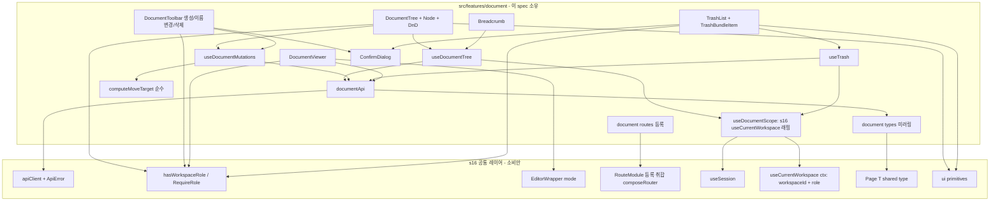
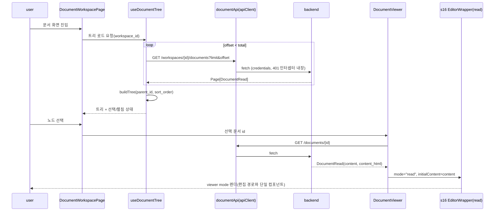
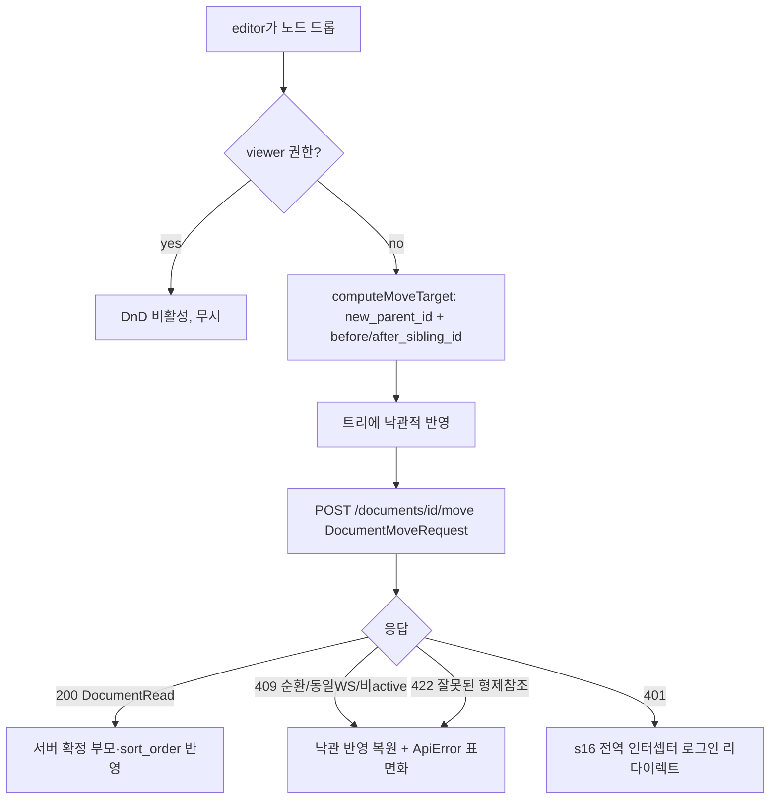
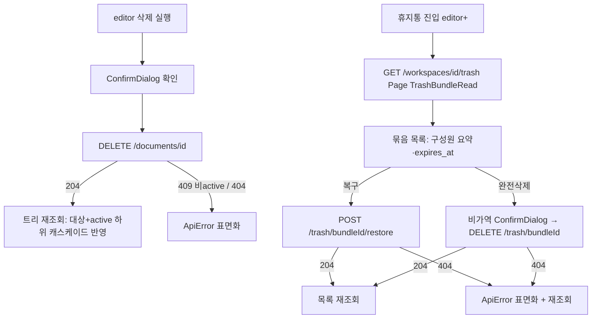

# Design Document — s19-fe-document

## Overview

**Purpose**: 이 spec은 MarkSpace 프론트엔드의 **문서 도메인 feature**(`src/features/document`)를 소유한다.
현재 WS의 문서 계층 트리 네비게이션·breadcrumb·문서 CRUD·드래그앤드롭 이동/재정렬·읽기 전용 뷰어와
휴지통(목록/복구/완전삭제) 화면을 구현하며, 모두 `s16-fe-foundation` 공통 레이어(공용 API 클라이언트·전역
401 인터셉터·권한 게이팅 유틸·라우터 셸·Toast UI Editor 래퍼)를 소비한다.

**Users**: 워크스페이스 멤버(viewer 이상)는 문서를 탐색·열람하고, editor 이상은 생성·이름변경·삭제·이동·
휴지통 조작을 수행한다. `s20`(편집)·`s21`(첨부)·`s22`(공유)는 이 spec이 확립한 문서 뷰·컨텍스트 위에 얹힌다.

**Impact**: 백엔드 `s07-document-core`·`s10-trash`는 이미 GO 상태이므로 이 feature는 실동작 WS-scoped
엔드포인트를 소비한다(mock 아님). 문서 status·묶음 전이 판정은 백엔드 엔진이 단독 소유하며, 이 spec은
결과·오류를 **낙관적으로 표면화**만 한다(재판정 없음).

### Goals
- 현재 WS의 active 문서를 `Page[DocumentRead]`로 조회·페이지 병합하여 `parent_id`/`sort_order` 기반 계층
  트리로 구성하고, 펼침/접힘·선택·breadcrumb·빈/로딩/오류 상태를 제공.
- editor 이상 게이팅된 생성(부모 지정)·이름변경(PATCH)·삭제(DELETE→휴지통)·드래그앤드롭 이동(`/move`)을
  낙관적 반영 + 백엔드 오류(순환·동일 WS·비active·묶음) 표면화로 구현.
- `s16` Toast UI Editor 래퍼를 `mode:"read"`로 재사용하는 읽기 전용 뷰어(편집 렌더 경로 이원화 금지) +
  `s20` 편집 진입 seam.
- editor 이상 WS 전체 접근 휴지통 화면(묶음 목록·구성원 요약·만료 예정·복구·비가역 완전삭제).

### Non-Goals
- 편집 진입/이탈·lock·자동저장·버전 뷰어(`s20`), 첨부(`s21`), 공유 링크·게스트 뷰(`s22`).
- 공통 레이어(라우터 셸·401·API 클라이언트·권한 유틸·Toast 래퍼)의 구현(`s16`이 이미 소유, 소비만).
- 현재 WS 앰비언트 컨텍스트(`useCurrentWorkspace`)의 **구현**(`s16` 단일 소유)·현재 WS 선택 관리 화면·멤버십/
  권한 데이터 조달(`s18`). 이 spec은 `s16` 컨텍스트 값을 소비만 한다.
- 문서 status·묶음 전이 판정(순환·동일 WS·묶음 원자성·복구 위치·보관 타이머): 백엔드 엔진 소유.

## Boundary Commitments

### This Spec Owns
- **문서 feature 폴더**(`src/features/document`): 문서/휴지통 화면·훅·도메인 API 호출·도메인 타입 미러링.
- **트리 조립·상태**: 페이지 병합 로드, `parent_id`/`sort_order` 기반 트리 빌드, 펼침/접힘·선택 상태,
  breadcrumb 조상 파생.
- **문서 변이 오케스트레이션(클라이언트측)**: 생성·이름변경·삭제·이동의 요청 조립·낙관적 반영·복원·오류
  표면화(백엔드 판정을 재구현하지 않는 얇은 소비 계층).
- **드래그앤드롭 → move 요청 매핑**: 드롭 위치를 `DocumentMoveRequest`(new_parent_id·before/after_sibling_id)로
  변환하는 순수 규약.
- **읽기 전용 뷰어 결선**: `GET /documents/{id}` 조회 + `s16 EditorWrapper(mode:"read")` 렌더 + `s20` 편집
  진입 seam.
- **휴지통 화면**: 묶음 목록·구성원 요약·만료 예정 표시, 복구, 비가역 완전삭제.
- **라우트 등록**: 문서/휴지통 화면을 `routes.tsx`에서 `RouteModule[]`(`scope: "protected"`)로 export 하여 `s16`
  `composeRouter`가 보호 슬롯에 합성하게 한다(`router.tsx` 수기 편집 금지; 프레임·가드는 `s16` 소유).

### Out of Boundary
- 편집 모드 동작(`s20`)·첨부(`s21`)·공유(`s22`). 편집 진입 진입점은 노출하되 동작은 위임.
- 공통 레이어·현재 WS 앰비언트 컨텍스트(`s16`)의 **구현**. 소비만 한다(WS 선택 관리 화면·멤버십 데이터는 `s18`).
- 문서 status/묶음 전이 **판정 로직**. 백엔드 엔진 결과만 반영한다.
- 서버측 권한 강제(백엔드 403). 클라이언트 게이팅은 UI 노출 편의일 뿐이다.

### Allowed Dependencies
- **Upstream(공통 레이어, `s16`)**: `apiClient`(공용 fetch·401·에러 정규화), `ApiError`/`ErrorResponse`,
  `Role`/`hasWorkspaceRole`/`<RequireRole>`, 라우트 등록 메커니즘(`RouteModule[]` export → `composeRouter` 취합),
  `EditorWrapper(mode)`, `useSession()`,
  `useCurrentWorkspace()`(현재 WS 앰비언트 컨텍스트: 최상위 `workspaceId`·`role` 등 `CurrentWorkspaceContextValue`),
  공용 `Page<T>`(`{items,total}`), 공용 UI(`Button`·`Spinner`·`EmptyState`·`ErrorMessage`).
- **Upstream(계약, `s01`)**: 문서/휴지통 엔드포인트·응답 스키마(`DocumentRead`·`TrashBundleRead`·`Page[T]`·
  `ErrorResponse`), 권한 위계·WS 격리·묶음 규칙(INV-1·2·3·6·10·11·12). 실제 라우터
  (`backend/app/document/router.py`·`backend/app/trash/router.py`)를 ground-truth로 미러링.
- **현재 WS 컨텍스트(`s16` 단일 소유)**: 현재 WS 식별자(`workspaceId`)와 현재 사용자 WS role(`role`)은 `s16`
  앰비언트 컨텍스트 `useCurrentWorkspace()`의 **최상위 접근자**에서만 소비한다(중첩 필드 접근 금지). 제공자는
  `s16`이며 이 spec은 별도 컨텍스트를 정의하지 않고 `useCurrentWorkspace`라는 이름을 재정의하지 않는다(형제 s18
  의존 없음). `role` 값의 조달 경로(s18 멤버십)는 `s16`이 내부적으로 흡수하므로 이 spec의 관심사가 아니다.
- **제약**: 모든 백엔드 호출은 `apiClient` 단일 경로. TypeScript strict, `any` 금지. 다른 feature 직접
  import 금지. API base URL 등은 `s16` 단일 설정에서만. 클라이언트 게이팅은 서버 강제를 대체하지 않는다.

### Revalidation Triggers
- `s16` 공용 API 클라이언트 시그니처·에러 정규화·401 인터셉터, `EditorWrapper` 인터페이스(`mode`·콘텐츠
  in/out), 권한 게이팅 유틸(`Role`·`hasWorkspaceRole`·`<RequireRole>`), 라우트 등록 메커니즘
  (`RouteModule`/`composeRouter`) 규약 변경.
- `s16` 현재 WS 앰비언트 컨텍스트(`CurrentWorkspaceContextValue`: 최상위 `workspaceId`·`role` 등) 형태 변경 →
  이 feature 재검증. 공용 `Page<T>` 형태 변경도 동일.
- **상위 계약(`s01`) 변경**: 문서/휴지통 엔드포인트 경로·`DocumentRead`/`TrashBundleRead`/`Page` 스키마·
  `ErrorResponse`·권한 위계·묶음 규칙 변경은 이 feature 재검증을 유발.
- 이 feature가 확립한 문서 뷰·선택 컨텍스트를 소비하는 하위 spec(`s20`·`s21`·`s22`)은 문서 선택 규약·편집
  진입 seam·뷰어 결선 형태가 바뀌면 재검증한다.

## Architecture

### Architecture Pattern & Boundary Map

feature 폴더 캡슐화 패턴(steering `structure.md` 정렬). `src/features/document`가 문서 도메인 화면·훅·API를
자기 폴더에 두고, 교차 관심사(API 클라이언트·권한·라우팅·에디터·세션)는 `s16` 공통 레이어(`src/app`·
`src/shared`)를 통해서만 소비한다. 의존 방향은 항상 feature → shared/app 단방향이며, 다른 feature를 직접
import 하지 않는다. 현재 WS 컨텍스트는 `s16` 앰비언트 컨텍스트(`useCurrentWorkspace()`)를 소비하며 형제 spec
의존이 없다.



**Architecture Integration**:
- **Selected pattern**: feature 폴더 단일 소유 + 공통 레이어 소비. 백엔드 `s07`/`s10` 도메인 경계 미러링.
- **Domain/feature boundaries**: 문서 도메인만 소유. 교차 관심사·현재 WS 앰비언트 컨텍스트는 모두 `s16` 경유
  (형제 의존 없음).
- **Existing patterns preserved**: `apiClient` 단일 호출, 권한 게이팅 유틸 단일 경로, `EditorWrapper` 단일
  렌더 경로(이원화 금지), 계약 스키마(`{Resource}Read`) 미러링, 단일 설정.
- **New components rationale**: 각 컴포넌트는 단일 책임(로드/트리조립, 변이, DnD 매핑, 뷰어, 휴지통, 라우팅).
- **Steering compliance**: `structure.md` "feature는 공통 레이어를 소비하되 다른 feature를 직접 import 하지
  않는다"·"권한 게이팅은 공통 유틸 경유" 원칙 준수.

### Dependency Direction (강제)
```
s16 shared/app (api·auth·editor·router·session·ui·useCurrentWorkspace·Page<T>)  ←  features/document (types → api → hooks → 화면)
```
`features/document` 내부도 좌→우 단방향(types → api → hooks → 화면)을 지킨다. 화면은 훅·공통 레이어만
소비하고 다른 feature 폴더를 import 하지 않는다.

### Technology Stack

| Layer | Choice / Version | Role in Feature | Notes |
|-------|------------------|-----------------|-------|
| UI Framework | React 19 (`s16` 스택) | 문서/휴지통 화면 렌더 | 함수형 + hooks |
| Routing | React Router v6+ (`s16` 셸) | 문서/휴지통 라우트 등록 | `RouteModule[]` export→`composeRouter` 보호 슬롯 |
| HTTP | `s16` `apiClient`(fetch) | WS-scoped 문서/휴지통 호출 | 401·에러 정규화 내장 |
| Editor(read) | Toast UI Editor via `s16` `EditorWrapper(mode:"read")` | 읽기 전용 렌더 | 편집 경로 이원화 금지 |
| DnD | 브라우저 HTML5 Drag and Drop API | 트리 이동/재정렬 | 외부 DnD 라이브러리 미도입(research.md) |
| Language | TypeScript 5 strict | 타입 안전 | `any` 금지, 계약 미러링 |
| Styling | Tailwind CSS 4 (`s16`) | 트리·휴지통 스타일 | 공용 UI 프리미티브 재사용 |

> DnD 방식(HTML5 native vs 라이브러리)·페이지 병합 전략의 근거는 `research.md` 참조.

## File Structure Plan

### Directory Structure
```
frontend/src/features/document/
├── types.ts                     # 계약 미러링: DocumentRead·TrashBundleRead·TrashMemberRead·요청 타입·DocumentNode·Role 재노출
├── api/
│   └── documentApi.ts           # 문서/휴지통 8개 엔드포인트 호출(apiClient 소비). 페이지 병합 loader 포함
├── hooks/
│   ├── useDocumentScope.ts      # s16 useCurrentWorkspace()를 감싼 얇은 선택자(workspaceId·role·isAdmin만 노출)
│   ├── useDocumentTree.ts       # active 문서 로드→트리 빌드→펼침/접힘·선택 상태·조상 파생
│   ├── useDocumentMutations.ts  # 생성·이름변경·삭제·이동 낙관적 반영·복원·오류 표면화
│   └── useTrash.ts              # 휴지통 묶음 로드·복구·완전삭제
├── lib/
│   ├── buildTree.ts             # 순수: 평면 DocumentRead[] → DocumentNode 트리(sort_order 정렬)
│   ├── resolveAncestors.ts      # 순수: 선택 문서 → 루트까지 조상 경로(breadcrumb용)
│   └── computeMoveTarget.ts     # 순수: DnD 드롭 위치 → DocumentMoveRequest(new_parent_id·before/after_sibling_id)
├── components/
│   ├── DocumentTree.tsx         # 트리 뷰 컨테이너(펼침/접힘·선택·DnD 결선)
│   ├── DocumentTreeNode.tsx     # 재귀 노드(토글·선택·drag/drop 핸들)
│   ├── Breadcrumb.tsx           # 조상 경로 표시·이동
│   ├── DocumentToolbar.tsx      # 생성·이름변경·삭제 조작(RequireRole 게이팅)
│   ├── DocumentViewer.tsx       # 상세 조회 + EditorWrapper(read) 렌더 + 편집 진입 seam
│   ├── ConfirmDialog.tsx        # 삭제·완전삭제 확인(비가역 표기)
│   ├── TrashList.tsx            # 휴지통 묶음 목록 화면(editor+ 게이팅)
│   └── TrashBundleItem.tsx      # 묶음 행(구성원 요약·만료·복구·완전삭제)
├── pages/
│   ├── DocumentWorkspacePage.tsx# 트리+breadcrumb+뷰어 조립(문서 메인 화면)
│   └── TrashPage.tsx            # 휴지통 화면 조립
└── routes.tsx                   # s16 RouteModule[] export(보호 슬롯 문서/휴지통 화면)
```

### Registration (RouteModule export, not router.tsx edit)
- `routes.tsx`는 `s16` `RouteModule` 계약에 맞춰 **보호 슬롯**(`scope: "protected"`) 라우트 배열을 export 한다.
  `s16` `composeRouter` 취합 함수가 이 모듈을 보호 슬롯에 합성하므로, 이 spec은 `frontend/src/app/router.tsx`·
  `main.tsx`를 직접 수정하지 않는다(가산 등록만; 라우트 프레임·가드 로직은 `s16` 소유).

> 각 파일은 단일 책임. `lib/*`는 순수 함수(테스트 용이). `hooks/*`는 `api`+`lib`+공통 레이어만 소비.
> `components/*`·`pages/*`는 훅·공통 레이어만 소비하며 다른 feature를 import 하지 않는다.

## System Flows

### 트리 로드·선택·뷰어 렌더


동일 `EditorWrapper(mode:"read")`를 뷰어가 소비하므로 편집(`s20`)·공유(`s22`) 뷰와 렌더 경로가 이원화되지
않는다. `content_html`은 응답에 있으나 별도 HTML 렌더 경로를 만들지 않기 위해 `content`(markdown)를 래퍼로
넘긴다(이원화 금지).

### 드래그앤드롭 이동(낙관적 + 복원)


순환·동일 WS·묶음 등 제약은 프론트가 판정하지 않고 백엔드 엔진 결과(409/422)를 표면화만 한다.

### 삭제·휴지통 복구/완전삭제


## Requirements Traceability

| Requirement | Summary | Components | Interfaces / Contracts | Flows |
|-------------|---------|------------|------------------------|-------|
| 1.1–1.7 | 트리 로드·페이지 병합·펼침/접힘·선택·정렬·빈/로딩/오류 | useDocumentTree, buildTree, DocumentTree, DocumentTreeNode | `listDocuments`, `Page[DocumentRead]`, `DocumentNode` | 트리 로드 |
| 2.1–2.4 | breadcrumb 조상 파생·이동 | resolveAncestors, Breadcrumb | `DocumentNode` 조상 파생 | 트리 로드 |
| 3.1–3.6 | 생성(부모 지정)·게이팅·오류 | useDocumentMutations, DocumentToolbar, RequireRole | `createDocument`, `DocumentCreate` | — |
| 4.1–4.6 | 이름변경(PATCH title)·게이팅 | useDocumentMutations, DocumentToolbar | `updateDocument`, `DocumentUpdate` | — |
| 5.1–5.6 | 삭제→휴지통·묶음 캐스케이드 관찰·확인 | useDocumentMutations, ConfirmDialog | `deleteDocument`(204) | 삭제·휴지통 |
| 6.1–6.7 | DnD 이동/재정렬·낙관적·복원·제약 표면화 | computeMoveTarget, useDocumentMutations, DocumentTree | `moveDocument`, `DocumentMoveRequest` | DnD 이동 |
| 7.1–7.6 | 읽기 전용 뷰어·EditorWrapper(read) 재사용·편집 seam | DocumentViewer, (s16)EditorWrapper | `getDocument`, `DocumentRead.content` | 트리 로드 |
| 8.1–8.7 | 휴지통 목록·복구·비가역 완전삭제·editor+ 접근 | useTrash, TrashList, TrashBundleItem, ConfirmDialog | `listTrash`/`restoreBundle`/`purgeBundle`, `TrashBundleRead` | 삭제·휴지통 |
| 9.1–9.7 | WS 컨텍스트 소비·게이팅·낙관·오류 표면화·단일 클라이언트 | useDocumentScope(s16 useCurrentWorkspace 래핑), RequireRole, documentApi | `CurrentWorkspaceContextValue`(s16), `ApiError`, `hasWorkspaceRole` | 전 flow |

## Components and Interfaces

| Component | Domain/Layer | Intent | Req Coverage | Key Dependencies (P0/P1) | Contracts |
|-----------|--------------|--------|--------------|--------------------------|-----------|
| DocumentTypes | features/document | 계약 미러링 타입·DocumentNode | 1,2,3,4,5,6,7,8 | s01 계약(P0) | State |
| DocumentApi | features/document/api | 8개 엔드포인트 호출·페이지 병합 | 1,3,4,5,6,7,8 | apiClient(P0), DocumentTypes(P0) | Service, API |
| useDocumentScope | features/document/hooks | s16 useCurrentWorkspace()를 감싼 얇은 선택자(workspaceId·role·isAdmin) | 9 | useCurrentWorkspace(s16,P0), useSession(P1) | Service, State |
| buildTree | features/document/lib | 평면 목록→트리(정렬) 순수 | 1,7 | DocumentTypes(P0) | Service |
| resolveAncestors | features/document/lib | 조상 경로 파생 순수 | 2 | DocumentTypes(P0) | Service |
| computeMoveTarget | features/document/lib | 드롭 위치→move 요청 순수 | 6 | DocumentTypes(P0) | Service |
| useDocumentTree | features/document/hooks | 로드·트리·선택·펼침·조상 | 1,2,7 | DocumentApi(P0), buildTree(P0), useDocumentScope(P0) | Service, State |
| useDocumentMutations | features/document/hooks | 생성·이름변경·삭제·이동 변이 | 3,4,5,6,9 | DocumentApi(P0), computeMoveTarget(P0) | Service, State |
| useTrash | features/document/hooks | 휴지통 로드·복구·완전삭제 | 8 | DocumentApi(P0), useDocumentScope(P0) | Service, State |
| DocumentTree | features/document/components | 트리 컨테이너·DnD 결선 | 1,6 | useDocumentTree(P0), useDocumentMutations(P0), RequireRole(P1) | State |
| DocumentTreeNode | features/document/components | 재귀 노드·토글·drag/drop | 1,6 | DocumentTree(P0) | State |
| Breadcrumb | features/document/components | 조상 경로 표시·이동 | 2 | useDocumentTree(P0), resolveAncestors(P0) | State |
| DocumentToolbar | features/document/components | 생성·이름변경·삭제 조작 | 3,4,5,9 | useDocumentMutations(P0), RequireRole(P0), ConfirmDialog(P1) | State |
| DocumentViewer | features/document/components | 상세 조회 + read 렌더 + 편집 seam | 7 | DocumentApi(P0), EditorWrapper(P0), RequireRole(P1) | Service, State |
| ConfirmDialog | features/document/components | 파괴적 조작 확인(비가역 표기) | 5,8 | ui primitives(P1) | State |
| TrashList | features/document/components | 휴지통 목록 화면(editor+) | 8 | useTrash(P0), RequireRole(P0) | State |
| TrashBundleItem | features/document/components | 묶음 행·복구·완전삭제 | 8 | useTrash(P0), ConfirmDialog(P1) | State |
| DocumentRoutes | features/document | 문서/휴지통 화면 s16 RouteModule[] export(보호 슬롯) | 7,8 | s16 RouteModule/composeRouter(P0) | State |

### features/document — types & api

#### DocumentTypes
| Field | Detail |
|-------|--------|
| Intent | 백엔드 계약을 미러링한 프론트 타입 + 트리 파생 타입(`DocumentNode`) |
| Requirements | 1.1, 2.1, 3.1, 4.1, 5.1, 6.1, 7.1, 8.1 |

**Responsibilities & Constraints**
- 백엔드 `DocumentRead`/`TrashBundleRead`/`TrashMemberRead`/요청 스키마를 **미러링만** 하며 새 필드를
  발명하지 않는다(`s01` 소비). `sort_order`는 백엔드에서 `Decimal`이며 JSON 직렬화 형태가 문자열일 수
  있으므로 **불투명 정렬 키**로 취급한다(프론트에서 값 재계산·산술 금지, Req 1.7·6.6).
- `DocumentNode`는 응답이 아니라 프론트 파생 타입(트리 조립용).

**Contracts**: State [x]
```typescript
type DocumentStatus = "active" | "trashed" | "deleted";

interface DocumentRead {
  id: number;
  created_at: string;
  updated_at: string | null;
  workspace_id: number;
  parent_id: number | null;
  title: string;
  status: DocumentStatus;
  sort_order: string;            // 백엔드 Decimal → 불투명 정렬 키(산술 금지)
  current_version_id: number | null;
  created_by: number;
  content: string;               // markdown 본문(현재 버전)
  content_html: string;          // 안전 렌더 HTML(뷰어는 이원화 금지 위해 content 사용)
}

interface DocumentCreate { title: string; parent_id?: number | null; }
interface DocumentUpdate { title?: string; }
interface DocumentMoveRequest {
  new_parent_id?: number | null;
  before_sibling_id?: number | null;
  after_sibling_id?: number | null;
}

interface TrashMemberRead { id: number; parent_id: number | null; title: string; }
interface TrashBundleRead {
  bundle_id: number;             // = root_document_id (카탈로그 {bundleId})
  root_document_id: number;
  root_title: string;
  workspace_id: number;
  trashed_at: string;
  expires_at: string;            // 서버 산정 파생값(trashed_at + retention)
  member_count: number;
  members: TrashMemberRead[];
}

// Page<T>는 s16 공용 타입(`@/shared/types/page`, `{ items, total }`)에서 import — 이 spec에서 재정의 금지.

// 프론트 파생 타입(응답 아님)
interface DocumentNode { doc: DocumentRead; children: DocumentNode[]; }
```
- Boundary: 필드 이름·형태는 실제 라우터/스키마와 1:1. 형태 변경 시 revalidation trigger.

#### DocumentApi
| Field | Detail |
|-------|--------|
| Intent | 문서/휴지통 8개 엔드포인트를 `apiClient`로 호출하고 목록은 페이지 병합 |
| Requirements | 1.1, 1.2, 3.1, 4.1, 5.1, 6.1, 7.1, 8.1, 8.3, 8.4, 9.6 |

**Responsibilities & Constraints**
- 모든 호출은 `s16` `apiClient` 단일 경로(401·에러 정규화 내장). 자체 fetch·에러 파싱 금지.
- WS-scoped 경로는 실제 라우터와 동일: 생성/목록은 `/workspaces/{workspace_id}/documents`, 상세/수정/이동/
  삭제는 `/documents/{id}`, 휴지통 목록은 `/workspaces/{id}/trash`, 복구/완전삭제는 `/trash/{bundleId}`.
- `loadAllActiveDocuments`는 `limit`/`offset`으로 `total`까지 순회해 전체 active 문서를 모은다(Req 1.2).

**Dependencies**
- Inbound: useDocumentTree·useDocumentMutations·useTrash·DocumentViewer(P0)
- Outbound: apiClient(P0); DocumentTypes(P0)

**Contracts**: Service [x] / API [x]
```typescript
// workspaceId는 s16 useCurrentWorkspace().workspaceId(string|null의 non-null 값)를 그대로 경로에 사용.
const documentApi = {
  loadAllActiveDocuments(workspaceId: string): Promise<DocumentRead[]>;      // 페이지 병합
  listDocuments(workspaceId: string, limit: number, offset: number): Promise<Page<DocumentRead>>;
  getDocument(id: number): Promise<DocumentRead>;
  createDocument(workspaceId: string, body: DocumentCreate): Promise<DocumentRead>;
  updateDocument(id: number, body: DocumentUpdate): Promise<DocumentRead>;
  moveDocument(id: number, body: DocumentMoveRequest): Promise<DocumentRead>;
  deleteDocument(id: number): Promise<void>;                                 // 204
  listTrash(workspaceId: string, limit: number, offset: number): Promise<Page<TrashBundleRead>>;
  restoreBundle(bundleId: number): Promise<void>;                            // 204
  purgeBundle(bundleId: number): Promise<void>;                              // 204, 비가역
};
```

##### API Contract
| Method | Endpoint | Request | Response | Errors |
|--------|----------|---------|----------|--------|
| POST | /workspaces/{workspace_id}/documents | DocumentCreate | 201 DocumentRead | 403,404,409,422 |
| GET | /workspaces/{workspace_id}/documents?limit&offset | — | 200 Page[DocumentRead] | 403 |
| GET | /documents/{id} | — | 200 DocumentRead | 403,404 |
| PATCH | /documents/{id} | DocumentUpdate | 200 DocumentRead | 403,404,422 |
| POST | /documents/{id}/move | DocumentMoveRequest | 200 DocumentRead | 403,404,409,422 |
| DELETE | /documents/{id} | — | 204 | 403,404,409 |
| GET | /workspaces/{id}/trash?limit&offset | — | 200 Page[TrashBundleRead] | 403 |
| POST | /trash/{bundleId}/restore | — | 204 | 403,404 |
| DELETE | /trash/{bundleId} | — | 204 | 403,404 |

- Preconditions: 인증 세션(쿠키)·현재 workspace_id 확보. 미인증 401은 `apiClient` 전역 처리.
- Postconditions: 성공 시 타입 `T`(json) 또는 void(204). 오류는 `ApiError`로 throw(호출부 표면화).
- Invariants: 401·에러 정규화는 `apiClient` 단일 지점. 이 모듈은 경로·요청 본문 조립만.

### features/document — hooks

#### useDocumentScope
| Field | Detail |
|-------|--------|
| Intent | `s16` 앰비언트 컨텍스트 `useCurrentWorkspace()`를 감싸 문서 feature가 쓰는 값(`workspaceId`·`role`·`isAdmin`)만 재노출하는 얇은 선택자 |
| Requirements | 9.1, 9.2 |

**Responsibilities & Constraints**
- `s16` `useCurrentWorkspace()`의 **최상위 접근자**(`status`·`workspaceId`·`role`)만 읽어 재노출한다.
  `currentWorkspace` 등 **중첩 필드에 접근하지 않으며**, 컨텍스트를 재구현하거나 `useCurrentWorkspace`라는 이름을
  재정의하지 않는다(이름 충돌·드리프트 금지).
- `workspaceId`는 `s16`이 동결한 `string | null`(경로/라우트 파라미터용 파생값)을 **그대로 전달**한다(문서/휴지통
  API 경로 조립에 사용, 산술·재계산 없음).
- `isAdmin`은 `s16` `useSession()`에서 취득해 게이팅에 합류한다. `role` 값의 조달 경로(s18 멤버십)는 `s16`이
  내부적으로 흡수하므로 이 선택자의 관심사가 아니다.

**Contracts**: Service [x] / State [x]
```typescript
import { useCurrentWorkspace } from "@/app/workspace-context/useCurrentWorkspace"; // s16 단일 소유
import { useSession } from "@/app/session/useSession";
import { Role } from "@/shared/auth/roles";

interface DocumentScope {
  status: "loading" | "ready" | "empty"; // s16 CurrentWorkspaceContextValue.status 전달
  workspaceId: string | null;            // s16 최상위 파생 접근자(String(id)); 경로 파라미터용, 그대로 전달
  role: Role | null;                     // s16 최상위 접근자(비멤버면 null; admin은 isAdmin으로 별도 판정)
  isAdmin: boolean;                      // s16 useSession()의 is_admin
}
function useDocumentScope(): DocumentScope;
```
- Boundary: WS 컨텍스트 **구현**은 `s16` 단일 소유. `CurrentWorkspaceContextValue` 형태 변경 시 revalidation
  trigger. 이 선택자는 `s16` 최상위 형태에 정확히 바인딩하는 소비 단일 지점이며 형제 s18 의존이 없다.

#### useDocumentTree
| Field | Detail |
|-------|--------|
| Intent | active 문서 로드→트리 빌드→선택/펼침 상태·조상 파생 |
| Requirements | 1.1, 1.2, 1.3, 1.4, 1.5, 1.6, 1.7, 2.1, 2.2, 2.3, 2.4, 7.1 |

**Responsibilities & Constraints**
- `documentApi.loadAllActiveDocuments(workspaceId)`로 전체 active 문서를 모아 `buildTree`로 트리 구성
  (`sort_order` 정렬은 buildTree 소유, 프론트 재계산 금지). 로딩/오류/빈 상태 노출.
- 선택 문서 id, 펼침 노드 집합을 상태로 관리. `resolveAncestors`로 breadcrumb 조상 경로 파생.
- 변이(생성·삭제·이동) 후 재조회 트리거(`reload`) 제공 — 낙관적 반영은 mutations 훅이 담당, 확정 재조회는
  여기서.

**Contracts**: Service [x] / State [x]
```typescript
interface DocumentTreeState {
  status: "loading" | "ready" | "error";
  roots: DocumentNode[];
  nodeById: Map<number, DocumentNode>;
  error: ApiError | null;
  selectedId: number | null;
  expandedIds: Set<number>;
}
function useDocumentTree(): DocumentTreeState & {
  reload(): Promise<void>;
  select(id: number | null): void;
  toggleExpand(id: number): void;
  ancestorsOf(id: number): DocumentRead[];   // resolveAncestors 위임
  applyLocal(patch: DocumentNode[] | null): void; // 낙관적 반영용 훅 결선
};
```
- Invariants: 정렬은 `sort_order`만 따르고 프론트 재계산 금지(Req 1.7).

#### useDocumentMutations
| Field | Detail |
|-------|--------|
| Intent | 생성·이름변경·삭제·이동을 낙관적 반영·복원·오류 표면화로 오케스트레이션 |
| Requirements | 3.1, 3.3, 3.4, 3.5, 4.1, 4.2, 4.3, 4.4, 5.1, 5.2, 5.4, 5.5, 6.1, 6.2, 6.3, 6.4, 6.5, 9.3, 9.4 |

**Responsibilities & Constraints**
- 각 변이는 `documentApi` 호출 → 성공 시 트리 확정 반영(재조회 또는 로컬 반영), 실패 시 `ApiError`를
  그대로 노출(자체 에러 형태 발명 금지, Req 9.4)하고 낙관 반영을 원복.
- 이동은 `computeMoveTarget`로 요청을 만들고, 낙관적 트리 반영 후 서버 응답으로 확정/복원.
- 백엔드 제약(순환·동일 WS·비active·묶음)을 프론트가 판정하지 않는다(Req 6.6). 삭제는 성공 후 재조회로
  묶음 캐스케이드를 반영(Req 5.2·5.3).

**Contracts**: Service [x] / State [x]
```typescript
interface MutationState { pending: boolean; error: ApiError | null; }
function useDocumentMutations(tree: ReturnType<typeof useDocumentTree>, workspaceId: string): {
  create(input: { title: string; parentId: number | null }): Promise<DocumentRead | null>;
  rename(id: number, title: string): Promise<DocumentRead | null>;
  remove(id: number): Promise<boolean>;                 // 삭제 후 tree.reload()
  move(dragId: number, drop: DropPosition): Promise<DocumentRead | null>; // computeMoveTarget → moveDocument
  state: MutationState;
};
```
- Postconditions: 성공은 트리 반영 + null 아닌 반환(삭제는 true). 실패는 `state.error`에 `ApiError` +
  낙관 반영 원복.

#### useTrash
| Field | Detail |
|-------|--------|
| Intent | 휴지통 묶음 로드·복구·완전삭제 |
| Requirements | 8.1, 8.2, 8.3, 8.4, 8.5, 8.7 |

**Responsibilities & Constraints**
- `documentApi.listTrash(workspaceId, ...)`로 묶음 목록(`Page[TrashBundleRead]`) 로드(페이지네이션 지원).
- 복구/완전삭제 성공(204) 후 목록 재조회. 404 등은 `ApiError` 표면화 + 재조회(Req 8.5).
- 복구 위치·묶음 원자성·비흡수 규칙은 판정하지 않고 백엔드 결과만 반영(Req 8.7).

**Contracts**: Service [x] / State [x]
```typescript
interface TrashState { status: "loading" | "ready" | "error"; bundles: TrashBundleRead[]; total: number; error: ApiError | null; }
function useTrash(workspaceId: string): TrashState & {
  reload(): Promise<void>;
  restore(bundleId: number): Promise<boolean>;
  purge(bundleId: number): Promise<boolean>;
  loadPage(limit: number, offset: number): Promise<void>;
};
```

### features/document — lib (pure)

#### buildTree / resolveAncestors / computeMoveTarget
| Field | Detail |
|-------|--------|
| Intent | 트리 조립·조상 파생·DnD→move 요청 매핑의 순수 로직 |
| Requirements | 1.1, 1.7, 2.1, 2.4, 6.1, 6.2 |

**Responsibilities & Constraints**
- `buildTree(docs)`: 평면 `DocumentRead[]`를 `parent_id`로 부모-자식 연결하고 형제를 `sort_order` 오름차순
  정렬(불투명 키 문자열 비교 규약)하여 루트 배열 반환. 고아(부모 미로딩)는 루트로 승격하지 않고 방어적으로
  누락 처리(전체 병합 로드 전제라 정상 시 발생하지 않음).
- `resolveAncestors(nodeById, id)`: `parent_id` 체인을 루트까지 거슬러 조상 배열(루트→현재)로 반환(순환
  방지 상한). 별도 API 없음(Req 2.4).
- `computeMoveTarget(tree, dragId, drop)`: 드롭 위치(대상 노드·before/after/inside)를 `DocumentMoveRequest`로
  변환. `inside`면 `new_parent_id=대상`, `before/after`면 대상의 부모를 `new_parent_id`로 두고
  `before_sibling_id`/`after_sibling_id` 지정. 루트 드롭은 `new_parent_id=null`.

**Contracts**: Service [x]
```typescript
type DropPosition =
  | { kind: "inside"; targetId: number }
  | { kind: "before"; targetId: number }
  | { kind: "after"; targetId: number }
  | { kind: "root" };

function buildTree(docs: DocumentRead[]): { roots: DocumentNode[]; nodeById: Map<number, DocumentNode> };
function resolveAncestors(nodeById: Map<number, DocumentNode>, id: number): DocumentRead[];
function computeMoveTarget(nodeById: Map<number, DocumentNode>, dragId: number, drop: DropPosition): DocumentMoveRequest;
```
- Invariants: 세 함수 모두 부수효과 없음(테스트 용이). 제약 판정(순환 등)은 하지 않음 — 서버 위임.

### features/document — 화면 컴포넌트

#### DocumentTree / DocumentTreeNode / Breadcrumb / DocumentToolbar / DocumentViewer / ConfirmDialog / TrashList / TrashBundleItem / DocumentRoutes
| Field | Detail |
|-------|--------|
| Intent | 트리/breadcrumb/툴바/뷰어/휴지통 UI와 라우트 등록 |
| Requirements | 1.3, 1.4, 1.5, 1.6, 2.1, 2.2, 3.6, 4.5, 5.1, 5.6, 6.7, 7.2, 7.3, 7.4, 7.5, 7.6, 8.1, 8.2, 8.6, 9.2, 9.5 |

**Responsibilities & Constraints**
- **DocumentTree/Node**: 펼침/접힘·선택·HTML5 native DnD 결선. viewer 권한이면 드래그 비활성(Req 6.7).
  drop 시 `DropPosition` 산정 → `useDocumentMutations.move`.
- **Breadcrumb**: `useDocumentTree.ancestorsOf(selectedId)`로 경로 표시·항목 클릭 시 `select`(Req 2.1·2.2).
- **DocumentToolbar**: 생성·이름변경·삭제 조작을 `<RequireRole minimum={EDITOR} currentRole=... >`로 감싸
  viewer에게 미노출(Req 3.6·4.5·5.6·9.2). 삭제·완전삭제는 `ConfirmDialog` 경유.
- **DocumentViewer**: `documentApi.getDocument(id)` → `EditorWrapper(mode:"read", initialContent=content)`로
  렌더(이원화 금지, Req 7.2·7.3). editor 이상에게만 편집 진입 진입점 노출(동작은 `s20` 위임, Req 7.4·7.5).
  실패 시 `ErrorMessage`(Req 7.6).
- **ConfirmDialog**: 삭제·완전삭제의 확인. 완전삭제는 **되돌릴 수 없음**을 명시(백엔드 OpenAPI 계약과 정합,
  Req 5.1·8.4).
- **TrashList/BundleItem**: `<RequireRole minimum={EDITOR}>`로 화면 게이팅(Req 8.6). 묶음 구성원 요약·
  `expires_at` 표시(Req 8.2), 복구/완전삭제 조작.
- **DocumentRoutes**: 문서 메인(`DocumentWorkspacePage`)·휴지통(`TrashPage`)을 `routes.tsx`에서 `RouteModule[]`
  (`scope: "protected"`)로 export 하여 `s16` `composeRouter`가 보호 슬롯에 합성한다(`router.tsx` 수기 편집 금지,
  프레임·가드는 s16). 401은 전역 인터셉터 위임(Req 9.5).

**Contracts**: State [x]
```typescript
// 대표 props(요약). 세부는 구현 시 확정.
interface DocumentTreeProps { tree: DocumentTreeState & {/* actions */}; canEdit: boolean; onMove(dragId: number, drop: DropPosition): void; }
interface DocumentViewerProps { documentId: number; canEdit: boolean; }
interface TrashBundleItemProps { bundle: TrashBundleRead; onRestore(id: number): void; onPurge(id: number): void; }
```
- Boundary: 권한 비교는 `RequireRole`/`hasWorkspaceRole`만 사용(컴포넌트 역할 비교 산발 금지, Req 9.2).

## Data Models

이 spec은 자체 영속 데이터를 소유하지 않는다. 백엔드 계약 형태를 프론트 타입으로 미러링하고, 트리 표시용
파생 타입(`DocumentNode`)만 추가한다.

- `DocumentRead` ← `backend/app/document/schemas.py::DocumentRead`(id·created_at·updated_at·workspace_id·
  parent_id·title·status·sort_order·current_version_id·created_by·content·content_html).
- `DocumentCreate`/`DocumentUpdate`/`DocumentMoveRequest` ← 동일 스키마 파일의 요청 모델.
- `TrashBundleRead`/`TrashMemberRead` ← `backend/app/trash/schemas.py`.
- `Page<T>` ← `s16` 공용 타입(`@/shared/types/page`, 백엔드 `base.py::Page`(items·total) 미러링). 이 spec은
  재정의하지 않고 import.
- `ApiError`/`ErrorResponse`·`Role` ← `s16` 공통 레이어(백엔드 계약 미러링).

### Data Contracts & Integration
- **전송**: JSON. 세션은 서명 쿠키(`apiClient`의 `credentials:"include"`). 목록은 `limit`/`offset` 쿼리.
- **정렬 키**: `sort_order`는 `Decimal`의 JSON 직렬화(문자열 가능)이므로 **불투명 키**로 취급하고 프론트에서
  산술·재계산하지 않는다(정렬은 서버 값 기준, Req 1.7·6.6).
- **파생 필드**: `content`(markdown)·`content_html`은 서버 파생값. 뷰어는 렌더 경로 이원화를 피하기 위해
  `content`를 `EditorWrapper(read)`로 렌더한다(`content_html` 미사용).
- **에러**: 모든 오류는 `apiClient`가 `ApiError`로 정규화. feature는 표면화만(자체 형태 발명 금지).
- **계약 소유권**: 위 타입은 `s01` 백엔드 계약 미러링만. 형태 변경 시 revalidation trigger.

## Error Handling

### Error Strategy
- **단일 정규화 지점**: 모든 HTTP 오류는 `s16` `apiClient`가 `ApiError`로 정규화. feature는 `ApiError`를
  `ErrorMessage`/상태로 표면화만.
- **전역 401**: 개별 처리 금지, `s16` 인터셉터의 `returnTo` 보존 로그인 리다이렉트에 위임(Req 9.5).
- **낙관적 반영 복원**: 생성·이름변경·이동은 낙관 반영 후 오류 시 원복(Req 9.3).

### Error Categories and Responses
- **403 forbidden**: 권한 미달. UI는 애초에 게이팅으로 미노출하나, 서버 403은 안내 메시지로 표면화(게이팅은
  보안 경계 아님, Req 9.7).
- **404 not_found**: 문서/묶음 부재 → 오류 표면화 + 목록 재조회(휴지통).
- **409 conflict**: 비active 삭제·순환·동일 WS·비active 이동 대상 → 낙관 복원 + 원인 안내(Req 5.4·6.4).
- **422 validation/unprocessable**: 공백 제목·잘못된 형제 참조 → `field_errors` 표시, 기존 상태 유지
  (Req 3.4·4.3·6.4).
- **5xx internal**: 일반 오류 메시지(내부 세부 미표시).

## Testing Strategy

### Unit Tests
- `buildTree`: 평면 목록을 `parent_id`로 계층화하고 형제를 `sort_order`로 정렬(불투명 키 비교), 루트 배열
  반환(1.1, 1.7).
- `resolveAncestors`: 깊은 노드→루트 조상 경로 순서·루트 문서 단일 경로·순환 상한 방어(2.1, 2.3, 2.4).
- `computeMoveTarget`: inside/before/after/root 드롭을 `DocumentMoveRequest`(new_parent_id·before/after)로
  정확히 매핑(6.1, 6.2).
- `documentApi.loadAllActiveDocuments`: `Page.total`까지 offset 순회로 전체 문서 병합(1.2).

### Integration Tests
- `useDocumentTree`: 로드→트리 준비→선택/펼침 토글, 오류 시 error 상태, 빈 WS 빈 상태(1.3, 1.4, 1.5, 1.6).
- `useDocumentMutations.move`: 낙관 반영 후 409/422에서 원복 + `ApiError` 노출, 200에서 서버 sort_order
  반영(6.3, 6.4, 6.5, 9.3, 9.4).
- `useDocumentMutations.remove`: 204 후 재조회로 묶음 캐스케이드 반영, 409에서 오류 표면화(5.2, 5.4).
- `useTrash`: 목록 로드→복구/완전삭제 204 후 재조회, 404에서 오류+재조회(8.1, 8.3, 8.4, 8.5).

### E2E / UI Tests
- viewer 컨텍스트에서 생성·이름변경·삭제·이동·휴지통 UI 미노출, editor/admin 컨텍스트에서 노출
  (3.6, 4.5, 5.6, 6.7, 8.6, 9.2).
- `DocumentViewer`가 `EditorWrapper(mode:"read")` 단일 컴포넌트로 `content`를 렌더하고 편집 인스턴스를
  별도로 만들지 않음, editor에게만 편집 진입 진입점 노출(7.2, 7.3, 7.4, 7.5).
- 드래그앤드롭으로 노드를 다른 부모/형제 위치로 이동 → `/move` 호출·트리 반영, 순환 시도 시 서버 409
  표면화(6.1, 6.4).
- 완전삭제 시 비가역 확인 절차 노출 후 `DELETE /trash/{bundleId}` 호출(8.4).

### Build / Type Checks
- `tsc --noEmit`(strict) 통과, `vite build` 성공(계약 타입 미러링·`any` 금지 확인).

## Security Considerations
- 세션은 `s16` `apiClient`의 서명 쿠키(`credentials:"include"`). feature는 토큰을 저장/노출하지 않는다.
- **클라이언트 게이팅은 보안 경계가 아님**: 생성·수정·삭제·이동·휴지통은 서버측 resolver(403)가 최종 강제.
  UI 게이팅(`RequireRole`)은 노출 편의(Req 9.7).
- WS 격리(INV-6): 문서/휴지통은 WS-scoped 엔드포인트로만 접근하며 타 WS 데이터는 서버가 차단.
- 뷰어는 `content`(markdown)를 `EditorWrapper(read)`로 렌더하며 원시 HTML 삽입 경로를 만들지 않는다
  (렌더 경로 단일화 + XSS 표면 축소).

## Supporting References
- 상위 계약: `s01-contract-foundation` requirements.md·design.md(문서·trash 계약·INV-1~12),
  `backend/app/document/router.py`·`backend/app/document/schemas.py`·`backend/app/trash/router.py`·
  `backend/app/trash/schemas.py`·`backend/app/schemas/base.py`.
- 소비 공통 레이어: `s16-fe-foundation` design.md(`apiClient`·`ApiError`·`Role`/`hasWorkspaceRole`/
  `RequireRole`·`EditorWrapper(mode)`·라우트 등록 메커니즘(`RouteModule[]` export→`composeRouter`)·`useSession`·`useCurrentWorkspace`(현재 WS 앰비언트
  컨텍스트, `CurrentWorkspaceContextValue`)·공용 `Page<T>`).
- steering: `tech.md`(Editor viewer mode·묶음 비흡수·설정 단일화)·`structure.md`(feature 폴더·공통 레이어
  소비·권한 게이팅 단일 경로)·`roadmap.md`(FE 계층 순서 `s16 → {s17,s18,s19}`).
- DnD 방식·페이지 병합 전략 근거: `research.md`.
