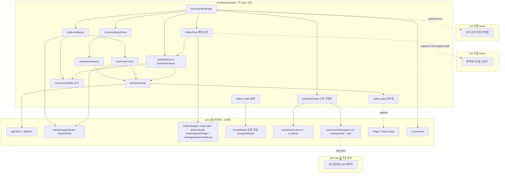
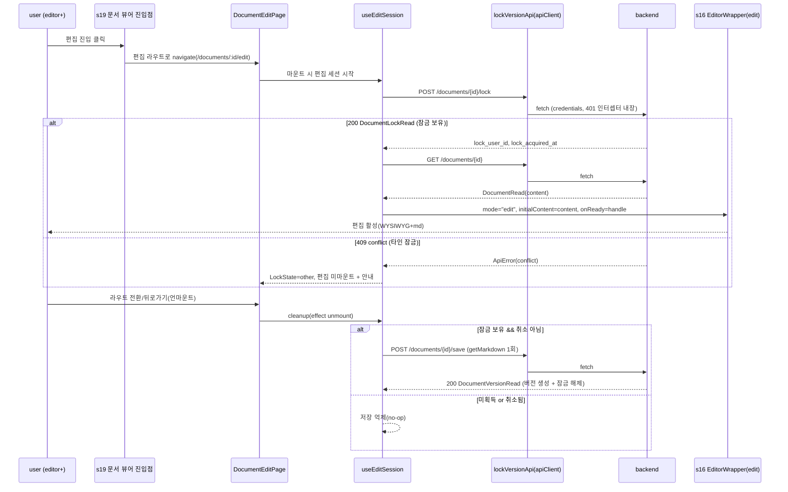
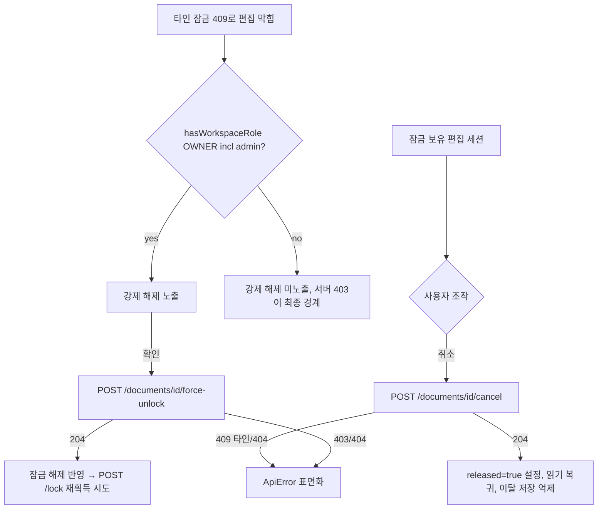
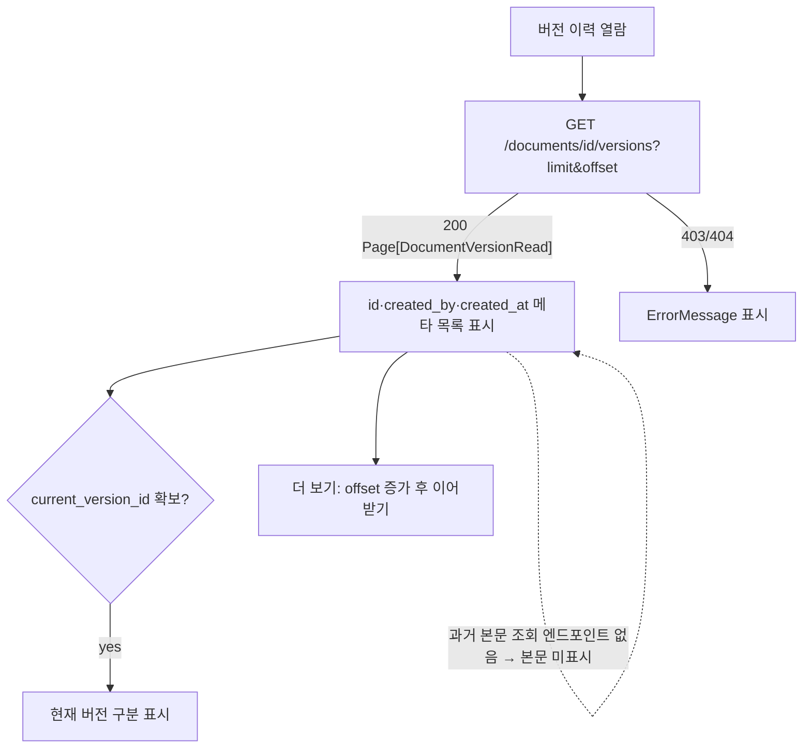

# Design Document — s20-fe-editor

## Overview

**Purpose**: 이 spec은 Notion-lite 프론트엔드의 **문서 편집 도메인 feature**(`src/features/editor`)를 소유한다.
`s19-fe-document`가 확립한 읽기 전용 문서 뷰 위에 편집 레이어를 얹어, editor 이상 사용자의 편집 모드 진입/이탈
생명주기(진입=잠금 획득, 이탈=이탈 시 1회 자동저장+잠금 해제), 잠금 상태 UX, 편집 취소, 강제 해제(제한 노출),
저장 버전 이력 뷰어를 구현한다. 모두 `s16-fe-foundation` 공통 레이어(공용 API 클라이언트·전역 401 인터셉터·
권한 게이팅 유틸·라우터 셸·Toast UI Editor 래퍼·`useSession`)를 소비한다.

**Users**: editor 이상 WS 멤버는 문서를 편집·저장·취소하고, WS owner·admin은 방치된 잠금을 강제 해제한다.
viewer 이상은 버전 이력을 열람한다. `s21`(첨부 붙여넣기/드롭)은 이 spec이 노출하는 편집 표면(에디터 pane)
seam에 얹히고, `s22`(공유)와 `s19`(읽기 뷰)는 이 편집 레이어와 렌더 경로를 공유한다(이원화 금지).

**Impact**: 백엔드 `s09-lock-version`은 이미 GO 상태이므로 이 feature는 실동작 잠금·저장·버전 엔드포인트를
소비한다(mock 아님). 잠금 판정(멱등 재획득·타인 잠금 충돌)·저장 원자성(버전 생성·`current_version_id` 갱신·
잠금 해제)·강제 해제 권한(OWNER)은 백엔드 엔진이 단독 소유하며, 이 spec은 결과·오류를 **표면화만** 한다.

### Goals
- editor 이상 편집 진입 시 `POST /documents/{id}/lock`으로 잠금 획득 → `s16` `EditorWrapper(mode:"edit")`
  마운트, 초기 콘텐츠는 `GET /documents/{id}`의 `content`(markdown)로 주입(읽기 경로와 이원화 금지).
- 편집 세션 이탈(라우트 전환·언마운트)에 바인딩된 **1회** 자동저장(`POST /documents/{id}/save`) — 주기 타이머·
  debounce 금지. 명시적 취소(`/cancel`) 후에는 이탈 저장 억제.
- 강제 해제(`/force-unlock`) 노출을 `s16` 게이팅 유틸(`hasWorkspaceRole(OWNER)` + admin bypass)로만 판정하고,
  자기 잠금 해제는 `/cancel` 경로로 처리(자기 잠금 해제에 owner 권한 불요).
- 저장 버전 이력 뷰어: `GET /documents/{id}/versions` 메타데이터 목록을 읽기 전용 표시(rollback·본문 조회 없음).

### Non-Goals
- 문서 트리·breadcrumb·CRUD·이동·읽기 전용 뷰어·휴지통(`s19`). 편집 진입점(버튼)은 `s19` 뷰어가 노출.
- 첨부 붙여넣기/드롭 업로드·이미지 렌더(`s21`) — 편집 표면 seam만 노출. 공유 링크·게스트 뷰(`s22`).
- 공통 레이어(라우터 셸·401·API 클라이언트·권한 유틸·Toast 래퍼)의 **구현**(`s16` 소유, 소비만).
- 현재 WS 앰비언트 컨텍스트의 **구현**(`s16` 단일 소유 `useCurrentWorkspace()`)·멤버십/권한 데이터 조달
  (`s18`이 `role` 값 주입). 이 spec은 s16 컨텍스트의 `workspaceId`·`role`을 소비만 한다.
- 잠금/저장/강제 해제 **판정 로직**(멱등·충돌·원자성·OWNER 강제)·버전 무한 보관·rollback: 백엔드 엔진 소유.

## Boundary Commitments

### This Spec Owns
- **편집 feature 폴더**(`src/features/editor`): 편집 화면·훅·잠금/버전 도메인 API 호출·도메인 타입 미러링.
- **편집 세션 생명주기(클라이언트측)**: 진입 시 잠금 획득, 이탈(라우트 전환·언마운트) 시 1회 자동저장 + 잠금
  해제, 명시적 취소. 저장/취소/강제 해제는 백엔드 판정을 재구현하지 않는 얇은 소비·오케스트레이션 계층.
- **잠금 상태 UX**: 자기 잠금 보유 표시(`lock_acquired_at`), 타인 잠금 충돌(409) 안내. 상태는 `/lock` 응답
  (200/409)에서만 파생(별도 조회 엔드포인트 없음).
- **이탈 시 1회 자동저장 정책 결선**: 편집 세션 언마운트 cleanup에 저장 1회 바인딩, 취소·미획득 시 저장 억제.
- **강제 해제 UI(제한 노출)**: `/force-unlock` 조작을 `s16` 게이팅 유틸로만 노출 판정(owner/admin), 자기 잠금은
  `/cancel`로 해제.
- **버전 이력 뷰어**: `/versions` 메타데이터 목록 읽기 전용 표시(rollback·본문 조회 미제공, 현재 버전 구분).
- **편집 표면 노출(s21 소비 지점)**: EditorPane이 `s16` `EditorWrapper(mode:"edit")`를 마운트하여 그 래퍼가
  문서화한 `onImagePaste`/`onFileDrop` 슬롯·`EditorHandle.insert`/`replaceRange`를 `s21`이 소비하게 한다. s20은
  자체 편집 표면 API를 발명하지 않고 s16 래퍼 계약을 노출 경로로 삼는다(업로드 동작은 `s21` 위임).
- **라우트 등록**: 편집 화면(`/documents/:id/edit`)을 `routes.tsx`에서 `RouteModule[]`(`scope: "protected"`)로
  export 하여 `s16` `composeRouter`가 보호 슬롯에 합성하게 한다(`router.tsx` 수기 편집 금지; 프레임·가드는 `s16` 소유).

### Out of Boundary
- 문서 뷰/트리/CRUD/휴지통(`s19`)·첨부 업로드(`s21`)·공유(`s22`). 편집 진입점 노출은 `s19`, 진입 대상 편집
  화면·동작은 이 spec.
- 공통 레이어(`s16`)·현재 WS 앰비언트 컨텍스트(`s16` 소유)의 **구현**. `role` 값 조달은 `s18`. 소비만 한다.
- 잠금/저장/강제 해제 **판정 로직**·버전 보관 정책. 백엔드 엔진 결과만 반영한다.
- 서버측 권한 강제(백엔드 403/409). 클라이언트 게이팅은 UI 노출 편의일 뿐이다.
- 과거 버전 **본문** 조회·rollback. 계약에 해당 엔드포인트/필드가 없으므로 제공하지 않는다.

### Allowed Dependencies
- **Upstream(공통 레이어, `s16`)**: `apiClient`(공용 fetch·401·에러 정규화), `ApiError`/`ErrorResponse`,
  `Role`/`hasWorkspaceRole`/`<RequireRole>`, 라우트 등록 메커니즘(`RouteModule[]` export → `composeRouter` 취합),
  `useSession()`, 공용 `Page<T>`(shared type),
  공용 UI(`Button`·`Spinner`·`EmptyState`·`ErrorMessage`), 그리고 아래 두 s16 단일 소유 표면:
  - **현재 WS 앰비언트 컨텍스트** `useCurrentWorkspace()`/`CurrentWorkspaceContextValue`(최상위 `workspaceId`·
    `role` 소비). s20은 동명 훅을 재정의하지 않고 얇은 래퍼(`useEditorScope`)로만 결합한다.
  - **확장된 `EditorWrapper(mode)`/`EditorHandle` 계약**: `getMarkdown`·`insert`/`replaceRange`, `onImagePaste`/
    `onFileDrop` 슬롯, `customImageRenderer`/`customHTMLRenderer` 오버라이드(s16 소유·s20 소비, 포크 금지).
- **Upstream(계약, `s01`)**: 잠금/저장/버전 엔드포인트·응답 스키마(`DocumentLockRead`·`DocumentVersionRead`·
  `DocumentSaveRequest`·`ErrorResponse`)와 문서 상세(`DocumentRead.content`·`current_version_id`),
  권한 위계·WS 격리(INV-1·2·3·6·9). 실제 라우터(`backend/app/lock_version/router.py`)·스키마
  (`backend/app/lock_version/schemas.py`)를 ground-truth로 미러링. 페이지 엔벨로프는 s01 `base.py::Page`를
  s16이 공용 `Page<T>`로 단일 소유하므로 s20은 s16 타입을 import(재정의 금지).
- **Upstream(문서 뷰, `s19`)**: 편집 진입점 seam(editor 이상 노출). 이 spec은 진입 대상 편집 라우트를 제공한다
  (경로 규약은 cross-spec 리뷰에서 정합; feature 간 직접 import 금지).
- **Adjacent seam(`s18`, role 값 주입 경로)**: 현재 WS `role` **값**은 s18 멤버십 데이터 경로로 주입되나, s20은
  그 값을 s16 `useCurrentWorkspace().role`로만 소비한다(현재 WS 컨텍스트 자체는 s16 단일 소유, s18 직접 의존 아님).
- **Adjacent seam(`s21`, 병렬 생성)**: 붙여넣기/드롭 업로드는 `s16` `EditorWrapper`의 `onImagePaste`/`onFileDrop`
  슬롯과 `EditorHandle.insert`/`replaceRange`(s16 소유·문서화된 계약)에 얹힌다. s20은 EditorPane에서 그 래퍼를
  마운트해 노출만 하고 `s21`이 소비한다(seam 형태는 s16 래퍼 계약으로 확정; s21 spec 파일 미참조).
- **제약**: 모든 백엔드 호출은 `apiClient` 단일 경로. 편집/읽기 렌더는 `s16` 단일 래퍼. TypeScript strict,
  `any` 금지. 다른 feature 직접 import 금지. API base URL 등은 `s16` 단일 설정에서만. 클라이언트 게이팅은
  서버 강제를 대체하지 않는다.

### Revalidation Triggers
- `s16` 공용 API 클라이언트 시그니처·에러 정규화·401 인터셉터, 권한 게이팅 유틸(`Role`·`hasWorkspaceRole`·
  `<RequireRole>`), 라우트 등록 메커니즘(`RouteModule`/`composeRouter`) 규약, `useSession()` 노출 형태 변경.
- **`s16` `EditorWrapper` 인터페이스 변경**(`mode`·콘텐츠 in/out·`EditorHandle.getMarkdown`/`insert`/
  `replaceRange`·`onImagePaste`/`onFileDrop`·`customImageRenderer`/`customHTMLRenderer`) → 이 feature 재검증.
- **`s16` 현재 WS 앰비언트 컨텍스트 `CurrentWorkspaceContextValue` 형태 변경**(특히 최상위 `workspaceId`·`role`)
  → 이 feature 재검증.
- **`s16` 공용 `Page<T>` 타입 변경**(items·total) → 이 feature 재검증.
- `s19` 편집 진입점 seam(진입 경로 규약) 변경 → 이 feature 재검증.
- `s21` 편집 표면 seam(s16 `EditorWrapper` 이벤트/핸들 소비 형태) 변경 → cross-spec 재검증.
- **상위 계약(`s01`) 변경**: 잠금/저장/버전 엔드포인트 경로·`DocumentLockRead`/`DocumentVersionRead`/
  `DocumentSaveRequest` 스키마·`ErrorResponse`·권한 위계·`DocumentRead` 스키마 변경은 이 feature
  재검증을 유발.

## Architecture

### Architecture Pattern & Boundary Map

feature 폴더 캡슐화 패턴(steering `structure.md` 정렬). `src/features/editor`가 편집 도메인 화면·훅·API를 자기
폴더에 두고, 교차 관심사(API 클라이언트·권한·라우팅·에디터·세션·현재 WS 컨텍스트)는 `s16` 공통 레이어
(`src/app`·`src/shared`)를 통해서만 소비한다. 의존 방향은 항상 feature → shared/app 단방향이며, 다른 feature를
직접 import 하지 않는다. 현재 WS(`workspaceId`·`role`)는 `s16` `useCurrentWorkspace()` 앰비언트 컨텍스트를
소비하고(`role` 값은 s18 멤버십 경로로 주입), 편집 진입은 `s19` seam을, 편집 표면은 `s16` `EditorWrapper` 슬롯을
통해 `s21`에 노출한다.



**Architecture Integration**:
- **Selected pattern**: feature 폴더 단일 소유 + 공통 레이어 소비. 백엔드 `s09-lock-version` 도메인 경계 미러링.
- **Domain/feature boundaries**: 편집 도메인만 소유. 교차 관심사(API·권한·에디터·세션·현재 WS 컨텍스트)는
  `s16` 경유, `role` 값 주입은 `s18`, 진입은 `s19`, 편집 표면은 `s16` `EditorWrapper` 슬롯으로 `s21`에 노출.
- **Existing patterns preserved**: `apiClient` 단일 호출, 권한 게이팅 유틸 단일 경로, `EditorWrapper` 단일 렌더
  경로(이원화 금지), 계약 스키마(`{Resource}Read`) 미러링, 단일 설정.
- **New components rationale**: 각 컴포넌트는 단일 책임(타입/API, 잠금 상태 순수 파생, 세션 생명주기, 강제 해제,
  버전 이력, 편집 표면, 잠금 배너, 버전 패널, 페이지 조립, 라우팅).
- **Steering compliance**: `tech.md` "자동저장 = 이탈 시 1회"·"편집 잠금 = 진입 시 획득"·"강제 해제 제한 노출"·
  "Editor 단일 래퍼 이원화 금지"·"rollback 미제공", `structure.md` "feature는 공통 레이어 소비·권한 게이팅 단일
  경로" 원칙 준수.

### Dependency Direction (강제)
```
s16 shared/app (api·auth·editor·router·session·ui·현재 WS 컨텍스트·Page<T>)  ←  features/editor (types → api → lib/hooks → 화면)
s16 useCurrentWorkspace() 앰비언트 컨텍스트(workspaceId·role)  →  features/editor (role 값은 s18 멤버십 경로 주입)
s19 편집 진입점 seam  →(라우팅 경로 규약)→  features/editor 편집 라우트
features/editor EditorPane → s16 EditorWrapper 슬롯(onImagePaste·onFileDrop·insert·replaceRange)  →  s21 (붙여넣기/드롭 소비)
```
`features/editor` 내부도 좌→우 단방향(types → api → lib/hooks → 화면)을 지킨다. 화면은 훅·공통 레이어만
소비하고 다른 feature 폴더를 import 하지 않는다.

### Technology Stack

| Layer | Choice / Version | Role in Feature | Notes |
|-------|------------------|-----------------|-------|
| UI Framework | React 19 (`s16` 스택) | 편집 화면 렌더·생명주기 훅 | 함수형 + hooks, effect cleanup에 이탈 저장 바인딩 |
| Routing | React Router v6+ (`s16` 셸) | 편집 라우트 등록·이탈 감지 | `RouteModule[]` export→`composeRouter` 보호 슬롯, 라우트 전환=언마운트 |
| HTTP | `s16` `apiClient`(fetch) | 잠금/저장/취소/강제해제/버전 호출 | 401·에러 정규화 내장 |
| Editor(edit) | Toast UI Editor via `s16` `EditorWrapper(mode:"edit")` | WYSIWYG+md 편집 렌더 | `EditorHandle.getMarkdown()`로 저장 결선; `insert`/`replaceRange`·`onImagePaste`/`onFileDrop` 슬롯은 s21에 노출, 이원화 금지 |
| Language | TypeScript 5 strict | 타입 안전 | `any` 금지, 계약 미러링 |
| Styling | Tailwind CSS 4 (`s16`) | 편집 화면·배너·버전 패널 스타일 | 공용 UI 프리미티브 재사용 |

> 편집 세션 생명주기(이탈 저장 1회)·잠금 상태 파생·강제 해제 노출 판정의 설계 결정 근거는 `research.md` 참조.

## File Structure Plan

### Directory Structure
```
frontend/src/features/editor/
├── types.ts                     # 계약 미러링: DocumentLockRead·DocumentVersionRead·DocumentSaveRequest·
│                                #   편집에 필요한 DocumentRead 부분집합·프론트 파생 LockState/EditSessionStatus
│                                #   (Page<T>는 s16 공용 타입 import, 재정의 금지)
├── api/
│   └── lockVersionApi.ts        # 잠금/저장/취소/강제해제/버전 5개 엔드포인트 + 편집용 getDocument 호출(apiClient 소비)
├── hooks/
│   ├── useEditorScope.ts        # s16 useCurrentWorkspace()(workspaceId·role) + useSession()(isAdmin·userId) 결합 얇은 래퍼(동명 훅 재정의 금지)
│   ├── useEditSession.ts        # 진입 잠금 획득 → 편집 → 이탈 시 1회 저장/취소·잠금 해제 생명주기 오케스트레이션
│   ├── useForceUnlock.ts        # 강제 해제(owner/admin) 조작 + 재획득 트리거
│   └── useVersionHistory.ts     # 버전 목록 로드(페이지네이션)·현재 버전 구분
├── lib/
│   └── resolveLockState.ts      # 순수: /lock 응답(200 DocumentLockRead | 409 ApiError)·currentUserId → LockState 파생
├── components/
│   ├── EditorPane.tsx           # s16 EditorWrapper(mode:"edit") 소비 + EditorHandle 바인딩 + save/cancel 컨트롤 + s16 래퍼 슬롯(onImagePaste/onFileDrop) s21 노출
│   ├── EditLockBanner.tsx       # 잠금 상태 표시(자기/타인) + 강제 해제 노출(RequireRole/hasWorkspaceRole OWNER 게이팅)
│   └── VersionHistoryPanel.tsx  # 버전 이력 읽기 전용 목록(저장자·시각·현재 버전 표시, rollback 없음)
├── pages/
│   └── DocumentEditPage.tsx     # 편집 화면 조립(세션 생명주기 + EditorPane + EditLockBanner + VersionHistoryPanel)
└── routes.tsx                   # s16 RouteModule[] export(보호 슬롯 편집 화면, 진입 경로 규약 노출)
```

### Registration (RouteModule export, not router.tsx edit)
- `routes.tsx`는 `s16` `RouteModule` 계약에 맞춰 **보호 슬롯**(`scope: "protected"`) 편집 라우트
  (`/documents/:id/edit`) 배열을 export 한다. `s16` `composeRouter` 취합 함수가 이 모듈을 보호 슬롯에 합성하므로,
  이 spec은 `frontend/src/app/router.tsx`·`main.tsx`를 직접 수정하지 않는다(가산 등록만; 라우트 프레임·가드는 `s16` 소유).

> 각 파일은 단일 책임. `lib/*`는 순수 함수(테스트 용이). `hooks/*`는 `api`+`lib`+공통 레이어만 소비.
> `components/*`·`pages/*`는 훅·공통 레이어만 소비하며 다른 feature를 import 하지 않는다.

## System Flows

### 편집 진입·잠금 획득·이탈 시 1회 자동저장


이탈 저장은 언마운트 cleanup에서 **정확히 1회** 실행되며, 주기 타이머·debounce가 없다. 취소(`/cancel`)로 이미
잠금을 해제했거나 진입 시 잠금을 획득하지 못한 경우 `released`/`acquired` 플래그로 저장을 억제한다(버전 폭증
회피 + 보유하지 않은 잠금 저장 금지). 저장이 버전 생성·`current` 갱신·잠금 해제를 원자적으로 수행함은 백엔드
소유이므로 프론트는 재판정하지 않는다.

### 편집 취소 vs 강제 해제(제한 노출)


자기 잠금 해제는 `/cancel`(EDITOR 접근 가능)로 처리하고, 타인 잠금 강제 해제는 `/force-unlock`(백엔드 OWNER
강제)로 처리한다. 노출 판정은 `s16` `hasWorkspaceRole({minimum: OWNER})`(admin bypass 포함) 단일 경로로만
수행하며 컴포넌트 역할 비교를 흩뿌리지 않는다. 클라이언트 게이팅은 노출 편의이며 서버측 OWNER 강제(403)가 최종
권한 경계다.

### 버전 이력 열람(읽기 전용)


계약(`DocumentVersionRead`)에 본문 필드가 없고 과거 버전 **본문** 조회 엔드포인트가 존재하지 않으므로, 뷰어는
저장자·저장 시각 메타데이터만 읽기 전용으로 표시하고 rollback·복원 액션을 노출하지 않는다.

## Requirements Traceability

| Requirement | Summary | Components | Interfaces / Contracts | Flows |
|-------------|---------|------------|------------------------|-------|
| 1.1–1.6 | 편집 진입·잠금 획득·초기 콘텐츠·멱등 재획득·게이팅 | useEditSession, EditorPane, lockVersionApi, EditorTypes | `lockDocument`, `getDocument`, `DocumentLockRead`, `EditorWrapper(edit)` | 편집 진입·이탈 |
| 2.1–2.4 | 잠금 상태 UX(자기/타인)·409 안내·조회 미발명 | resolveLockState, EditLockBanner, useEditSession | `LockState`, `ApiError` | 편집 진입·이탈 |
| 3.1–3.6 | 이탈 시 1회 저장·타이머/debounce 금지·억제 | useEditSession, EditorPane | `saveDocument`, `DocumentSaveRequest`, `DocumentVersionRead` | 편집 진입·이탈 |
| 4.1–4.5 | 편집 취소·저장 없이 해제·이탈 저장 억제 | useEditSession, EditorPane | `cancelEdit`(204) | 취소 vs 강제 해제 |
| 5.1–5.5 | 강제 해제 제한 노출·owner/admin·자기 잠금은 cancel | useForceUnlock, EditLockBanner, RequireRole | `forceUnlock`(204), `hasWorkspaceRole(OWNER)` | 취소 vs 강제 해제 |
| 6.1–6.6 | 버전 이력 읽기 전용·본문/rollback 없음·현재 버전 | useVersionHistory, VersionHistoryPanel | `listVersions`, s16 `Page<DocumentVersionRead>`, `current_version_id` | 버전 이력 열람 |
| 7.1–7.8 | 공통 레이어 소비·게이팅·WS 컨텍스트·오류·seam | useEditorScope, EditorRoutes, DocumentEditPage, EditorPane | s16 `useCurrentWorkspace()`(`workspaceId`·`role`), `ApiError`, `RouteModule`/`composeRouter` | 전 flow |

## Components and Interfaces

| Component | Domain/Layer | Intent | Req Coverage | Key Dependencies (P0/P1) | Contracts |
|-----------|--------------|--------|--------------|--------------------------|-----------|
| EditorTypes | features/editor | 계약 미러링 타입·프론트 파생(LockState), s16 `Page<T>` import | 1,2,3,6 | s01 계약(P0), s16 `Page<T>`(P0) | State |
| LockVersionApi | features/editor/api | 잠금/저장/취소/강제해제/버전 + getDocument 호출 | 1,3,4,5,6,7 | apiClient(P0), EditorTypes(P0) | Service, API |
| useEditorScope | features/editor/hooks | s16 `useCurrentWorkspace()`(workspaceId·role)+`useSession()`(isAdmin·userId) 결합 래퍼 | 7 | s16 useCurrentWorkspace(P0), useSession(P1) | Service, State |
| resolveLockState | features/editor/lib | /lock 응답→LockState 순수 파생 | 2 | EditorTypes(P0) | Service |
| useEditSession | features/editor/hooks | 진입 잠금·이탈 1회 저장·취소 생명주기 | 1,2,3,4 | LockVersionApi(P0), resolveLockState(P0), EditorWrapper handle(P0) | Service, State |
| useForceUnlock | features/editor/hooks | 강제 해제 조작·재획득 트리거 | 5 | LockVersionApi(P0), hasWorkspaceRole(P0) | Service, State |
| useVersionHistory | features/editor/hooks | 버전 목록 로드·현재 버전 구분 | 6 | LockVersionApi(P0) | Service, State |
| EditorPane | features/editor/components | s16 EditorWrapper(edit) 소비·핸들 바인딩·저장/취소 컨트롤·s16 래퍼 슬롯 s21 노출 | 1,3,4,7 | s16 EditorWrapper(P0), useEditSession(P0) | State |
| EditLockBanner | features/editor/components | 잠금 상태 표시·강제 해제 노출(게이팅) | 2,5 | resolveLockState(P0), useForceUnlock(P0), RequireRole(P1) | State |
| VersionHistoryPanel | features/editor/components | 버전 이력 읽기 전용 목록(rollback 없음) | 6 | useVersionHistory(P0) | State |
| DocumentEditPage | features/editor/pages | 편집 화면 조립·세션 생명주기 결선 | 1,2,3,4,5,6,7 | useEditSession(P0), useEditorScope(P0), EditorPane(P0), EditLockBanner(P0) | State |
| EditorRoutes | features/editor | 편집 화면 s16 RouteModule[] export(보호 슬롯)·진입 경로 규약 | 7 | s16 RouteModule/composeRouter(P0) | State |

### features/editor — types & api

#### EditorTypes
| Field | Detail |
|-------|--------|
| Intent | 백엔드 잠금/저장/버전 계약을 미러링한 프론트 타입 + 편집용 파생 타입 |
| Requirements | 1.1, 1.2, 2.1, 3.1, 6.1 |

**Responsibilities & Constraints**
- 백엔드 `DocumentLockRead`/`DocumentVersionRead`/`DocumentSaveRequest`와 편집에 필요한 `DocumentRead`
  부분집합을 **미러링만** 하며 새 필드를 발명하지 않는다(`s01` 소비). `Page<T>`는 s16 공용 타입을 import한다(재정의 금지).
- `DocumentVersionRead`에는 본문(content) 필드가 없다 — 계약 그대로. `LockState`/`EditSessionStatus`는 응답이
  아니라 프론트 파생 타입.

**Contracts**: State [x]
```typescript
import type { Page } from "@/shared/types/page";   // s16 공용 Page<T> = { items: T[]; total: number }

// 백엔드 계약 미러링 (backend/app/lock_version/schemas.py)
interface DocumentLockRead {
  document_id: number;
  lock_user_id: number;
  lock_acquired_at: string;         // ISO datetime
}
interface DocumentVersionRead {
  id: number;
  document_id: number;
  created_by: number;
  created_at: string;               // ISO datetime — 본문(content) 필드 없음(rollback 미제공)
}
interface DocumentSaveRequest { content: string; } // 빈 문자열 허용

// 편집에 필요한 문서 상세 부분집합 (backend/app/document/schemas.py::DocumentRead 미러링)
interface EditableDocument {
  id: number;
  workspace_id: number;
  title: string;
  content: string;                  // markdown 초기 콘텐츠(EditorWrapper edit 주입)
  current_version_id: number | null;
}

// 프론트 파생 타입(응답 아님)
type LockState =
  | { kind: "acquiring" }
  | { kind: "self"; lock: DocumentLockRead }        // 200: 현재 사용자 보유
  | { kind: "other"; error: ApiError }              // 409: 타인 보유
  | { kind: "error"; error: ApiError };             // 403/404 등
type EditSessionStatus = "idle" | "acquiring" | "editing" | "blocked" | "saving" | "released" | "error";
```
- Boundary: 필드 이름·형태는 실제 라우터/스키마와 1:1. 형태 변경 시 revalidation trigger.

#### LockVersionApi
| Field | Detail |
|-------|--------|
| Intent | 잠금/저장/취소/강제해제/버전 5개 엔드포인트 + 편집용 문서 상세를 `apiClient`로 호출 |
| Requirements | 1.1, 1.3, 3.1, 4.1, 5.2, 6.1, 6.2, 7.5 |

**Responsibilities & Constraints**
- 모든 호출은 `s16` `apiClient` 단일 경로(401·에러 정규화 내장). 자체 fetch·에러 파싱 금지.
- 경로는 실제 라우터와 동일: `POST /documents/{id}/lock`·`/save`·`/cancel`·`/force-unlock`,
  `GET /documents/{id}/versions?limit&offset`, 편집 초기 콘텐츠는 `GET /documents/{id}`.
- 204 응답(cancel·force-unlock)은 void 반환. `save`는 `DocumentVersionRead` 반환.

**Dependencies**
- Inbound: useEditSession·useForceUnlock·useVersionHistory(P0)
- Outbound: apiClient(P0); EditorTypes(P0)

**Contracts**: Service [x] / API [x]
```typescript
const lockVersionApi = {
  lockDocument(id: number): Promise<DocumentLockRead>;                 // 200
  getDocument(id: number): Promise<EditableDocument>;                 // 200, 편집 초기 콘텐츠
  saveDocument(id: number, body: DocumentSaveRequest): Promise<DocumentVersionRead>; // 200
  cancelEdit(id: number): Promise<void>;                              // 204
  forceUnlock(id: number): Promise<void>;                            // 204
  listVersions(id: number, limit: number, offset: number): Promise<Page<DocumentVersionRead>>; // 200
};
```

##### API Contract
| Method | Endpoint | Request | Response | Errors |
|--------|----------|---------|----------|--------|
| POST | /documents/{id}/lock | — | 200 DocumentLockRead | 401,403,404,409 |
| GET | /documents/{id} | — | 200 DocumentRead(부분집합 소비) | 401,403,404 |
| POST | /documents/{id}/save | DocumentSaveRequest | 200 DocumentVersionRead | 401,403,404,409,422 |
| POST | /documents/{id}/cancel | — | 204 | 401,403,404,409 |
| POST | /documents/{id}/force-unlock | — | 204 | 401,403,404 |
| GET | /documents/{id}/versions?limit&offset | — | 200 Page[DocumentVersionRead] | 401,403,404 |

- Preconditions: 인증 세션(쿠키)·대상 문서 id 확보. 미인증 401은 `apiClient` 전역 처리.
- Postconditions: 성공 시 타입 `T`(json) 또는 void(204). 오류는 `ApiError`로 throw(호출부 표면화).
- Invariants: 401·에러 정규화는 `apiClient` 단일 지점. 이 모듈은 경로·요청 본문 조립만. 잠금/저장 판정은 서버.

### features/editor — lib (pure)

#### resolveLockState
| Field | Detail |
|-------|--------|
| Intent | `/lock` 응답(성공 `DocumentLockRead` 또는 실패 `ApiError`)·현재 사용자 id로 `LockState` 파생 |
| Requirements | 2.1, 2.2, 2.3, 2.4 |

**Responsibilities & Constraints**
- 200 성공이면 `{ kind: "self", lock }`(현재 사용자 보유, 멱등 재획득 포함). 409(conflict)면
  `{ kind: "other", error }`. 기타 오류(403/404)면 `{ kind: "error", error }`.
- 잠금 현재 상태를 조회하는 별도 엔드포인트가 없으므로 오직 `/lock` 응답만을 입력으로 삼는다(폴링·추측 금지).
- 부수효과 없는 순수 함수(테스트 용이). 계약에 없는 보유자 식별 정보를 발명하지 않는다.

**Contracts**: Service [x]
```typescript
function resolveLockState(
  input: { ok: DocumentLockRead } | { error: ApiError }
): LockState;
```
- Invariants: 409 → other, 200 → self. 다른 상태 판정을 프론트가 하지 않는다(서버 위임).

### features/editor — hooks

#### useEditorScope
| Field | Detail |
|-------|--------|
| Intent | s16 현재 WS 앰비언트 컨텍스트(`workspaceId`·`role`)와 세션(`isAdmin`·현재 사용자 id)을 편집용으로 결합하는 얇은 래퍼 |
| Requirements | 7.1, 7.2 |

**Responsibilities & Constraints**
- 현재 WS(`workspaceId`·`role`)는 `s16`이 단일 소유하는 앰비언트 컨텍스트 `useCurrentWorkspace()`의 **최상위**
  `workspaceId`·`role`을 그대로 소비하고, `isAdmin`·현재 사용자 id는 `s16` `useSession()`에서 취득한다.
- s20은 `s16`과 **동명(`useCurrentWorkspace`) 훅을 재정의하지 않는다** — 이름 충돌·drift를 피하기 위해
  얇은 래퍼는 `useEditorScope`로 명명한다. `role` 값 자체는 s18 멤버십 경로로 주입되나 소비는 s16 훅 단일 경로.

**Contracts**: Service [x] / State [x]
```typescript
import { useCurrentWorkspace } from "@/app/workspace-context/useCurrentWorkspace"; // s16 앰비언트 컨텍스트(재정의 금지)
import { useSession } from "@/app/session/useSession";
import type { Role } from "@/shared/auth/roles";

// s16 CurrentWorkspaceContextValue의 최상위 workspaceId(string|null)·role(Role|null)과
// useSession()의 is_admin·user.id를 편집 게이팅용으로 결합.
interface EditorScope {
  workspaceId: string | null;      // s16 useCurrentWorkspace().workspaceId (라우트 파라미터용 파생 문자열)
  role: Role | null;               // s16 useCurrentWorkspace().role (s18 멤버십 경로 주입값)
  isAdmin: boolean;                // s16 useSession().user.is_admin
  currentUserId: number | null;    // s16 useSession().user.id
}
function useEditorScope(): EditorScope;
```
- Boundary: 현재 WS 컨텍스트 **구현**은 s16 단일 소유. `CurrentWorkspaceContextValue` 형태 변경 시 revalidation
  trigger. s20은 소비 단일 지점(`useEditorScope`)만 두고 컨텍스트를 재구현하지 않는다.

#### useEditSession
| Field | Detail |
|-------|--------|
| Intent | 진입 잠금 획득 → 편집 → 이탈 시 1회 저장/취소·잠금 해제 생명주기 오케스트레이션 |
| Requirements | 1.1, 1.2, 1.3, 1.4, 1.6, 2.1, 2.2, 3.1, 3.2, 3.3, 3.4, 3.5, 3.6, 4.1, 4.2, 4.3, 4.5 |

**Responsibilities & Constraints**
- 마운트 시 `lockDocument(id)` → `resolveLockState`. `self`면 `getDocument(id)`로 초기 콘텐츠 로드 후 편집
  활성(`EditorHandle` 바인딩), `other`/`error`면 편집 비활성 + 상태 노출.
- 언마운트/라우트 전환 cleanup에서 **정확히 1회** 저장: `acquired && !released`일 때만 `saveDocument(id, {content:
  handle.getMarkdown()})`. 주기 타이머·debounce 없음(Req 3.2). 취소 후(`released=true`)·미획득 시 저장 억제
  (Req 3.5·3.6).
- `cancel()`는 `cancelEdit(id)` 호출 후 `released=true` 설정(이탈 저장 억제) + 읽기 복귀. 저장 성공은 백엔드가
  버전 생성·잠금 해제를 수행함을 전제로 상태만 확정(재판정 없음).
- `getMarkdown`은 `EditorHandle`(s16 래퍼 `onReady` 제공)에서 취득. 저장/취소 오류는 `ApiError`로 표면화.

**Contracts**: Service [x] / State [x]
```typescript
interface EditSessionState {
  status: EditSessionStatus;         // idle|acquiring|editing|blocked|saving|released|error
  lockState: LockState;
  document: EditableDocument | null; // self일 때 초기 콘텐츠
  error: ApiError | null;
}
function useEditSession(documentId: number): EditSessionState & {
  bindHandle(handle: EditorHandle): void;  // EditorWrapper onReady 결선(getMarkdown 소스)
  cancel(): Promise<void>;                 // POST /cancel + released=true(이탈 저장 억제)
  retryAcquire(): Promise<void>;           // 강제 해제 후 재획득
};
```
- Preconditions: `documentId` 유효. `bindHandle`은 편집 활성(self) 이후 래퍼 준비 시 호출.
- Postconditions: 이탈 시 잠금 보유·미취소이면 저장 1회, 아니면 no-op. 취소는 즉시 해제 + 이후 저장 억제.
- Invariants: 이탈 저장은 세션당 최대 1회(중복 방지 플래그). 저장/취소/잠금 판정은 서버 소유.

#### useForceUnlock
| Field | Detail |
|-------|--------|
| Intent | 강제 해제(owner/admin) 조작과 해제 후 재획득 트리거 |
| Requirements | 5.1, 5.2, 5.4, 5.5 |

**Responsibilities & Constraints**
- 노출 판정은 `s16` `hasWorkspaceRole({ currentRole, isAdmin, minimum: Role.OWNER })` 단일 경로로만 수행
  (컴포넌트 역할 비교 금지). 판정 참일 때만 `forceUnlock(id)`를 노출·호출.
- 성공(204) 시 잠금 해제를 반영하고 `useEditSession.retryAcquire`로 재획득을 유도. 실패(403/404)는 `ApiError`
  표면화. 클라이언트 게이팅은 노출 편의이며 서버측 OWNER 강제(403)가 최종 경계(Req 5.5).

**Contracts**: Service [x] / State [x]
```typescript
function useForceUnlock(documentId: number): {
  canForceUnlock: boolean;                 // hasWorkspaceRole(OWNER) incl admin bypass
  forceUnlock(): Promise<boolean>;         // 204 → true, 오류 → false + error
  state: { pending: boolean; error: ApiError | null };
};
```

#### useVersionHistory
| Field | Detail |
|-------|--------|
| Intent | 버전 목록 로드(페이지네이션)·현재 버전 구분 |
| Requirements | 6.1, 6.2, 6.5, 6.6 |

**Responsibilities & Constraints**
- `listVersions(id, limit, offset)`로 `Page[DocumentVersionRead]` 로드. `loadMore`로 offset 증가·이어받기.
- `current_version_id`(문서 상세)를 받아 목록에서 현재 버전 구분. 본문 조회·rollback 없음(계약 제약).
- 로딩/오류/빈 상태 노출. 조회 실패(403/404)는 `ApiError` 표면화.

**Contracts**: Service [x] / State [x]
```typescript
interface VersionHistoryState {
  status: "loading" | "ready" | "error";
  versions: DocumentVersionRead[];
  total: number;
  currentVersionId: number | null;
  error: ApiError | null;
}
function useVersionHistory(documentId: number, currentVersionId: number | null): VersionHistoryState & {
  reload(): Promise<void>;
  loadMore(): Promise<void>;
};
```

### features/editor — 화면 컴포넌트

#### EditorPane / EditLockBanner / VersionHistoryPanel / DocumentEditPage / EditorRoutes
| Field | Detail |
|-------|--------|
| Intent | 편집 표면·잠금 배너·버전 패널·페이지 조립·라우트 등록 |
| Requirements | 1.2, 1.5, 2.1, 2.2, 3.1, 4.1, 5.1, 5.3, 6.3, 6.4, 6.5, 7.1, 7.2, 7.5, 7.6, 7.7 |

**Responsibilities & Constraints**
- **EditorPane**: `s16` `EditorWrapper(mode:"edit", initialContent=document.content)`를 렌더하고 `onReady`로
  받은 `EditorHandle`(`getMarkdown`·`insert`·`replaceRange`)를 `useEditSession.bindHandle`에 결선(저장 시
  `getMarkdown`). 저장(이탈 자동) 외 명시적 저장 버튼은 두지 않되 취소 컨트롤(`cancel`)을 노출. 자체 에디터
  인스턴스 금지(이원화 금지, Req 7.5). 편집 표면 노출은 s20가 자체 API를 발명하지 않고 `s16` `EditorWrapper`가
  문서화한 `onImagePaste`/`onFileDrop` 슬롯·`EditorHandle.insert`/`replaceRange`를 그대로 통과 노출하는 방식이며
  (s21이 소비), 업로드 동작은 미구현이다(Req 7.7).
- **EditLockBanner**: `LockState`가 `self`면 "내가 편집 중"(획득 시각), `other`면 "다른 사용자가 편집 중"
  안내(Req 2.1·2.2). `other`일 때 `useForceUnlock.canForceUnlock`(=`hasWorkspaceRole(OWNER)`)이 참인 owner/admin
  에게만 강제 해제 조작을 `<RequireRole minimum={OWNER}>`로 감싸 노출(Req 5.1). 자기 잠금 해제는 EditorPane의
  cancel 경로(Req 5.3). 오류는 `ErrorMessage`.
- **VersionHistoryPanel**: `useVersionHistory`로 버전 메타(저장자·시각) 읽기 전용 목록 렌더, `current_version_id`
  구분 표시(Req 6.5), 더 보기(Req 6.2). rollback·복원·본문 표시 UI를 두지 않는다(Req 6.3·6.4).
- **DocumentEditPage**: `useEditorScope`로 workspaceId·role·isAdmin·userId 주입(s16 `useCurrentWorkspace()`+
  `useSession()` 결합), `useEditSession`으로
  생명주기 결선, EditorPane+EditLockBanner+VersionHistoryPanel 조립. viewer 권한은 편집에 도달하지 않음
  (진입점 게이팅은 `s19`, 서버 403이 최종 경계, Req 1.5·7.2). 401은 전역 인터셉터 위임(Req 7.4).
- **EditorRoutes**: 편집 화면(`DocumentEditPage`, `/documents/:id/edit`)을 `routes.tsx`에서 `RouteModule[]`
  (`scope: "protected"`)로 export 하여 `s16` `composeRouter`가 보호 슬롯에 합성한다(`router.tsx` 수기 편집 금지,
  프레임·가드는 s16, Req 7.6). 진입 경로 규약을 노출해 `s19` 진입점이 도달하게 한다(cross-spec 정합).

**Contracts**: State [x]
```typescript
// 대표 props(요약). 세부는 구현 시 확정.
interface EditorPaneProps { session: ReturnType<typeof useEditSession>; }
interface EditLockBannerProps { lockState: LockState; documentId: number; onRetry(): void; }
interface VersionHistoryPanelProps { documentId: number; currentVersionId: number | null; }
```
- Boundary: 권한 비교는 `RequireRole`/`hasWorkspaceRole`만 사용(컴포넌트 역할 비교 산발 금지, Req 7.2).

## Data Models

이 spec은 자체 영속 데이터를 소유하지 않는다. 백엔드 계약 형태를 프론트 타입으로 미러링하고, 편집 세션·잠금
상태 표시용 파생 타입(`LockState`·`EditSessionStatus`)만 추가한다.

- `DocumentLockRead`/`DocumentVersionRead`/`DocumentSaveRequest` ← `backend/app/lock_version/schemas.py`.
- `EditableDocument` ← `backend/app/document/schemas.py::DocumentRead`의 부분집합(id·workspace_id·title·
  content·current_version_id). 편집 초기 콘텐츠·현재 버전 구분에만 사용.
- `Page<T>` ← `s16` 공용 타입(`@/shared/types/page`, 백엔드 `base.py::Page` items·total 미러). s20 재정의 금지.
- `ApiError`/`ErrorResponse`·`Role`·`EditorHandle`·`CurrentWorkspaceContextValue`(`useCurrentWorkspace()`) ←
  `s16` 공통 레이어(백엔드 계약 미러링/래퍼·컨텍스트 인터페이스).

### Data Contracts & Integration
- **전송**: JSON. 세션은 서명 쿠키(`apiClient`의 `credentials:"include"`). 버전 목록은 `limit`/`offset` 쿼리.
- **저장 본문**: `DocumentSaveRequest.content`는 markdown이며 **빈 문자열 허용**(빈 문서 저장, 계약 정합).
- **버전 본문 부재**: `DocumentVersionRead`에는 content 필드가 없고 과거 버전 본문 조회 엔드포인트도 없다 —
  뷰어는 메타데이터만 표시하며 본문/ rollback을 시도하지 않는다(계약 소비).
- **초기 콘텐츠**: 편집 렌더는 `content`(markdown)를 `EditorWrapper(edit)`로 주입하며 `content_html`을 쓰지
  않는다(읽기 뷰와 렌더 경로 단일화, 이원화 금지).
- **에러**: 모든 오류는 `apiClient`가 `ApiError`로 정규화. feature는 표면화만(자체 형태 발명 금지).
- **계약 소유권**: 위 타입은 `s01` 백엔드 계약 미러링만. 형태 변경 시 revalidation trigger.

## Error Handling

### Error Strategy
- **단일 정규화 지점**: 모든 HTTP 오류는 `s16` `apiClient`가 `ApiError`로 정규화. feature는 `ApiError`를
  `ErrorMessage`/상태로 표면화만.
- **전역 401**: 개별 처리 금지, `s16` 인터셉터의 `returnTo` 보존 로그인 리다이렉트에 위임(Req 7.4).
- **이탈 저장 실패**: 언마운트 저장이 409/422로 실패해도 세션은 종료되며, 가능 범위에서 오류를 표면화한다
  (라우트 이탈 이후에는 사용자 가시성이 제한될 수 있음 — 언마운트 전 상태로 표면화).

### Error Categories and Responses
- **401 unauthenticated**: `s16` 전역 인터셉터 위임(Req 7.4).
- **403 forbidden**: 권한 미달(편집·강제 해제). UI는 게이팅으로 미노출하나 서버 403은 안내로 표면화(게이팅은
  보안 경계 아님, Req 5.5·7.8).
- **404 not_found**: 문서/잠금 부재 → 오류 표면화, 편집 미마운트.
- **409 conflict**: 타인 잠금(진입/저장/취소) → `LockState=other` 또는 오류 안내 + 재획득(owner/admin) 경로
  (Req 2.2·3.4·4.4).
- **422 validation/unprocessable**: 저장 본문 형식 오류 → `ApiError` 표면화(Req 3.4).
- **5xx internal**: 일반 오류 메시지(내부 세부 미표시).

## Testing Strategy

### Unit Tests
- `resolveLockState`: 200 `DocumentLockRead`→`self`, 409→`other`, 403/404→`error` 매핑(계약에 없는 보유자
  정보 미발명)(2.1, 2.2, 2.3).
- `lockVersionApi`: 각 메서드가 올바른 경로·본문으로 `apiClient` 호출(lock/save/cancel/force-unlock/versions/
  getDocument), 204는 void, save는 `DocumentVersionRead` 반환, 오류는 `ApiError` 전파(1.1, 3.1, 4.1, 5.2, 6.1).
- `useForceUnlock.canForceUnlock`: `hasWorkspaceRole(OWNER)` 위임으로 owner/admin만 참, viewer/editor 거짓(5.1, 5.5).

### Integration Tests
- `useEditSession` 진입: `/lock` 200→`self`+`getDocument` 콘텐츠 로드→편집 활성, 409→`blocked`(편집 미마운트),
  멱등 재획득 200 반영(1.1, 1.2, 1.3, 1.4, 2.2).
- `useEditSession` 이탈 저장: 잠금 보유+미취소 언마운트에서 `/save` **정확히 1회** 호출, 취소 후·미획득 시
  저장 억제, 주기 타이머 없음(3.1, 3.2, 3.5, 3.6).
- `useEditSession.cancel`: `/cancel` 204 후 `released` 설정으로 이탈 저장 억제, 409/404 오류 표면화(4.1, 4.2, 4.4).
- `useVersionHistory`: `/versions` 로드·`loadMore` offset 이어받기·`current_version_id` 구분, 403/404 오류(6.1, 6.2, 6.5, 6.6).

### E2E / UI Tests
- editor가 편집 진입→잠금 획득→편집→다른 라우트로 이탈 시 `/save` 1회 호출·버전 생성, viewer는 편집 진입점
  미도달(1.1, 1.2, 3.1, 1.5).
- 타인 잠금(409) 상황에서 owner/admin에게만 강제 해제 노출·`/force-unlock` 후 재획득, viewer/editor에게는
  미노출(5.1, 5.2, 5.5).
- `EditorPane`가 `s16` `EditorWrapper(mode:"edit")` 단일 컴포넌트로 `content`를 렌더하고 자체 인스턴스를 만들지
  않음(편집/읽기 렌더 경로 이원화 금지)(1.3, 7.5).
- `VersionHistoryPanel`이 저장자·시각 메타만 표시하고 rollback·복원·본문 조회 UI를 노출하지 않음(6.3, 6.4).

### Build / Type Checks
- `tsc --noEmit`(strict) 통과, `vite build` 성공(계약 타입 미러링·`any` 금지 확인)(7.5).

## Security Considerations
- 세션은 `s16` `apiClient`의 서명 쿠키(`credentials:"include"`). feature는 토큰을 저장/노출하지 않는다.
- **클라이언트 게이팅은 보안 경계가 아님**: 편집(EDITOR)·강제 해제(OWNER)는 서버측 resolver(403)·서비스 충돌
  (409)이 최종 강제. UI 게이팅(`RequireRole`/`hasWorkspaceRole`)은 노출 편의(Req 5.5·7.8).
- WS 격리(INV-6)·잠금 단일 컬럼(INV-9): 편집/저장/잠금은 문서→WS 게이팅된 엔드포인트로만 접근하며 서버가 강제.
- 편집 렌더는 `content`(markdown)를 `EditorWrapper(edit)`로 처리하며 원시 HTML 삽입 경로를 만들지 않는다
  (렌더 경로 단일화 + XSS 표면 축소).
- 편집 표면 seam(`s21`): 붙여넣기/드롭 업로드는 `s21`이 소유하며, 이 spec은 표면만 노출하고 업로드 데이터를
  다루지 않는다(권한·격리는 백엔드 첨부 엔드포인트가 강제).

## Supporting References
- 상위 계약: `s01-contract-foundation` requirements.md·design.md(잠금·버전 계약·INV-1~12),
  `backend/app/lock_version/router.py`·`backend/app/lock_version/schemas.py`·`backend/app/document/schemas.py`·
  `backend/app/schemas/base.py`.
- 소비 공통 레이어: `s16-fe-foundation` design.md(`apiClient`·`ApiError`·`Role`/`hasWorkspaceRole`/`RequireRole`·
  확장 `EditorWrapper(mode)`/`EditorHandle`(`insert`/`replaceRange`·`onImagePaste`/`onFileDrop`·
  `customImageRenderer`/`customHTMLRenderer`)·현재 WS 앰비언트 컨텍스트 `useCurrentWorkspace()`/
  `CurrentWorkspaceContextValue`·공용 `Page<T>`·라우트 등록 메커니즘(`RouteModule[]` export→`composeRouter`)·`useSession`).
- 인접 문서 뷰: `s19-fe-document` design.md(`DocumentViewer` 편집 진입 seam·읽기 렌더 경로·`useCurrentWorkspace`
  소비 패턴).
- steering: `tech.md`(자동저장=이탈 시 1회·편집 잠금=진입 시 획득·강제 해제 제한 노출·Editor 단일 래퍼 이원화
  금지·rollback 미제공)·`structure.md`(feature 폴더·공통 레이어 소비·권한 게이팅 단일 경로)·`roadmap.md`(FE
  계층 순서 `s16 → {s17,s18,s19} → {s20,s21,s22}`).
- 편집 세션 생명주기·이탈 저장 1회·잠금 상태 파생 설계 근거: `research.md`.
