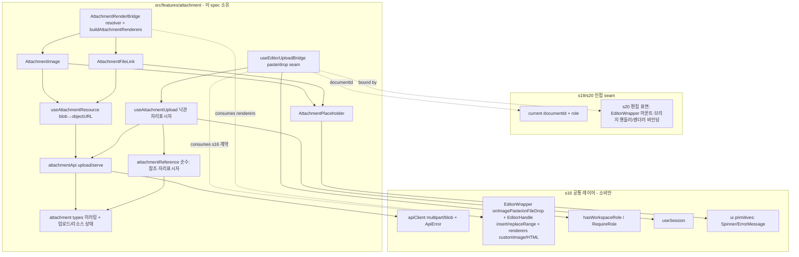
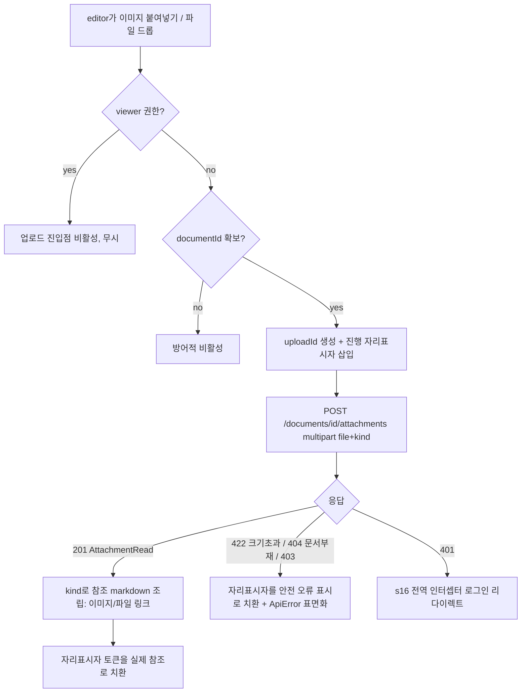
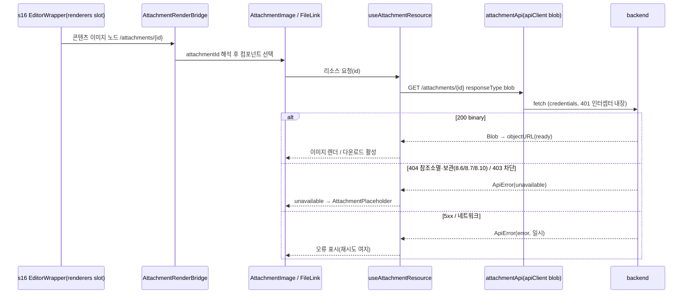

# Design Document — s21-fe-attachment

## Overview

**Purpose**: 이 spec은 MarkSpace 프론트엔드의 **첨부 UX feature**(`src/features/attachment`)를 소유한다.
편집 표면(s20)에 드롭/붙여넣기로 이미지·파일을 업로드하고, 업로드 진행 자리표시자를 낙관적으로 표시하며,
문서 콘텐츠의 첨부 참조(`/attachments/{id}`)를 인증·WS 격리 경로로 렌더/다운로드하고, 참조 소멸·서빙 불가
첨부를 안전한 placeholder로 폴백한다. 모두 `s16-fe-foundation` 공통 레이어(공용 API 클라이언트·전역 401·
Toast UI Editor 래퍼·공용 UI)와 `s19-fe-document` 문서 컨텍스트를 소비한다.

**Users**: 워크스페이스 editor 이상은 편집 중 이미지·파일을 업로드하고, viewer 이상은 문서에 삽입된 이미지·
파일 첨부를 열람·다운로드한다. 이 feature는 `s20` 편집 표면과 `s19`/`s22` 읽기·공유 뷰가 소비하는 첨부
렌더·업로드 결선을 확립한다(공유 링크 경유 서빙 경로는 `s22` 소유).

**Impact**: 백엔드 `s12-attachment`는 이미 GO 상태이므로 이 feature는 실동작 첨부 엔드포인트를 소비한다
(mock 아님). 첨부 저장·격리·완전삭제 반응 보관(8.6)·저장 참조 소멸 아카이브(8.7)·보관 비노출(8.10)은
백엔드 엔진이 단독 소유하며, 이 spec은 **서빙 결과(404/403)를 관측**하여 placeholder로 폴백만 한다(재판정 없음).

### Goals
- 드롭/붙여넣기 업로드: `s16` Toast UI 래퍼 이벤트 계약 경유로 이미지/파일 blob을 받아 `POST /documents/{id}/
  attachments`로 업로드하고, 성공 시 응답 `url`을 콘텐츠에 참조로 삽입.
- 낙관적 업로드 자리표시자: 진행 중 자리표시자 → 성공 시 실제 참조 교체 / 실패 시 안전한 오류 표시, 동시
  업로드 고유 id 추적.
- 인증·WS 격리 이미지 렌더·파일 다운로드: `s16` API 클라이언트로 `GET /attachments/{id}` 바이너리를 받아
  오브젝트 URL로 렌더/다운로드(원시 `src` 삽입 금지, 오브젝트 URL 해제).
- 참조 소멸/서빙 불가 placeholder: 서빙 404/403(8.6·8.7·8.10 결과) 관측 시 깨진 이미지 대신 안전한 placeholder.

### Non-Goals
- 첨부 파일 저장·WS 격리 저장·완전삭제 반응 보관(8.6)·저장 참조 소멸 아카이브(8.7)·보관 비노출(8.10):
  백엔드 `s12` 소유. 이 spec은 결과만 관측한다.
- 편집 진입/이탈·lock·이탈 시 1회 자동저장·버전 스냅샷(`s20`). 이 spec은 콘텐츠에 참조 삽입만 하며 저장 정책
  동작은 다루지 않는다.
- 공유 링크 경유 첨부 서빙(`GET /public/{token}/attachments/{aid}`, `s22`).
- 공통 레이어(API 클라이언트·전역 401·Toast UI 래퍼·공용 UI)의 **구현**(`s16`)·현재 WS/문서 컨텍스트 조달
  (`s18`/`s19`). 소비만 한다.

## Boundary Commitments

### This Spec Owns
- **첨부 feature 폴더**(`src/features/attachment`): 첨부 도메인 타입 미러링·API 호출·업로드/렌더 훅·순수 참조
  로직·렌더/다운로드/placeholder 컴포넌트·에디터 업로드/렌더 브리지.
- **드롭/붙여넣기 업로드 오케스트레이션**: blob/file 수신 → `uploadAttachment` 호출 → 낙관적 자리표시자 삽입/
  교체/오류 표면화. 업로드 진입점은 `s16` 래퍼 이벤트 계약 경유(에디터 표면은 `s20`).
- **첨부 참조 규약(클라이언트측)**: 응답 `url`(`/attachments/{id}`) → 콘텐츠 참조 markdown(이미지/파일 링크)
  조립과 자리표시자 토큰 삽입/치환의 순수 규약.
- **인증·WS 격리 렌더/다운로드 결선**: `s16` apiClient(blob)로 첨부 바이너리 취득 → 오브젝트 URL 렌더/다운로드,
  오브젝트 URL 생명주기 관리.
- **참조 소멸/서빙 불가 placeholder**: 서빙 404/403 관측 → 안전한 placeholder(`unavailable`) 표현, 일시 오류와 구분.
- **에디터 업로드/렌더 브리지**: `s16` `EditorWrapper`가 노출하는 붙여넣기/드롭 이벤트(`onImagePaste`/`onFileDrop`)·
  `EditorHandle`(`insert`/`replaceRange`) 콘텐츠 조작·`renderers`(`customImageRenderer`/`customHTMLRenderer`) 계약을
  **소비**하는 단일 seam(`useEditorUploadBridge`·`AttachmentRenderBridge`). 계약은 `s16` 소유이며 이 spec은 소비 어댑터만 소유한다.

### Out of Boundary
- 첨부 저장·격리·아카이브 판정(`s12` 백엔드). 서빙 결과만 관측한다.
- 편집 생명주기·lock·자동저장·버전(`s20`)·공유 링크 경유 서빙(`s22`).
- 공통 레이어(`s16`)·문서/WS 컨텍스트(`s19`/`s18`)의 **구현**. 소비만 한다.
- 서버측 권한 강제(백엔드 403·404). 클라이언트 업로드 게이팅은 UI 노출 편의일 뿐이다.

### Allowed Dependencies
- **Upstream(공통 레이어, `s16`)**: `apiClient`(공용 fetch·multipart·blob·401·에러 정규화),
  `ApiError`/`ErrorResponse`, **`EditorWrapper` 계약**(`onImagePaste(file)`·`onFileDrop(file)` 이벤트 슬롯,
  `onReady(handle)`로 제공되는 `EditorHandle.insert(text)`·`replaceRange(from,to,text)`, `renderers`의
  `customImageRenderer`·`customHTMLRenderer` 오버라이드 — edit·read 양 모드 공통), `Role`/`hasWorkspaceRole`/
  `<RequireRole>`, 공용 UI(`Spinner`·`ErrorMessage`·`EmptyState`), `useSession()`. 이 래퍼 계약은 `s16`이
  소유·노출하며 이 spec은 **소비만** 한다(래퍼 내부·인스턴스 비소유).
- **Upstream(계약, `s01`)**: 첨부 엔드포인트·`AttachmentRead`/`AttachmentKind`·`ErrorResponse`, WS 격리·권한
  위계(INV-1·2·3·6). 실제 라우터/스키마(`backend/app/attachment/router.py`·`schemas.py`)를 ground-truth로 미러링.
- **Adjacent seam(`s19`/`s20`, 동일 wave 병렬 생성)**: 업로드 대상 `documentId`(현재 문서 컨텍스트·편집 표면)와
  `s20` 편집 표면이 `s16` `EditorWrapper`를 마운트하고 이 spec의 브리지 핸들러(`onImagePaste`/`onFileDrop`/`onReady`)·
  `renderers`를 그 래퍼에 바인딩하는 결선 지점. 래퍼 이벤트/렌더 **계약 형태는 `s16` 소유**(위 Upstream)이며, 이
  seam은 `documentId` 조달과 바인딩 배선만 담당한다(계약 미정합 seam 아님).
- **제약**: 모든 백엔드 호출은 `apiClient` 단일 경로. TypeScript strict, `any` 금지. 다른 feature 직접 import
  금지. base URL 등은 `s16` 단일 설정에서만. 클라이언트 게이팅은 서버 강제를 대체하지 않는다.

### Revalidation Triggers
- `s16` 공용 API 클라이언트 시그니처(multipart/blob·에러 정규화·401 인터셉터), 권한 게이팅 유틸
  (`Role`/`hasWorkspaceRole`/`<RequireRole>`) 변경 → 이 feature 재검증.
- **`s16` `EditorWrapper` 인터페이스 변경** — `onImagePaste`/`onFileDrop` 이벤트 슬롯, `onReady`가 제공하는
  `EditorHandle`(`insert`/`replaceRange`), `renderers`(`customImageRenderer`/`customHTMLRenderer`) 형태 변경 →
  이 feature(`useEditorUploadBridge`·`AttachmentRenderBridge`) 재검증. (`s16` 재검증 트리거 "EditorWrapper
  인터페이스 변경 → s19/s20/s21"과 대칭으로, 이 방향 트리거를 s21 측에 명시해 트리거 공백을 닫는다.)
- `s19`/`s20`이 제공하는 `documentId` 컨텍스트·래퍼 바인딩 결선 지점 형태 변경 → 이 feature 재검증.
- **상위 계약(`s01`) 변경**: 첨부 엔드포인트 경로·`AttachmentRead`/`AttachmentKind` 스키마·`url` 규약·
  `ErrorResponse`·권한 위계·WS 격리 규칙 변경은 이 feature 재검증을 유발.
- 이 feature가 확립한 첨부 렌더·업로드 브리지를 소비하는 `s22`(공유 뷰 링크 경유 첨부)는 렌더 컴포넌트·resolver
  형태가 바뀌면 재검증한다(서빙 경로만 `/public/{token}/...`로 다름).

## Architecture

### Architecture Pattern & Boundary Map

feature 폴더 캡슐화 패턴(steering `structure.md` 정렬). `src/features/attachment`가 첨부 도메인 타입·API·훅·
컴포넌트·브리지를 자기 폴더에 두고, 교차 관심사(API 클라이언트·에디터 래퍼·권한·세션·UI)는 `s16` 공통 레이어를
통해서만 소비한다. 래퍼 이벤트/렌더 계약(`onImagePaste`/`onFileDrop`·`EditorHandle`·`renderers`)은 `s16`이
소유·노출하며 이 spec은 소비만 한다. 업로드 대상 `documentId`는 `s19`/`s20` 인접 seam으로 소비하고 `s20`이 래퍼
마운트·핸들러 바인딩을 담당한다. 의존
방향은 항상 feature → shared/app 단방향이며 다른 feature를 직접 import 하지 않는다.



**Architecture Integration**:
- **Selected pattern**: feature 폴더 단일 소유 + 공통 레이어 소비. 백엔드 `s12` 도메인 경계 미러링.
- **Domain/feature boundaries**: 첨부 UX만 소유. 교차 관심사는 `s16` 경유, 문서 컨텍스트·에디터 표면은
  `s19`/`s20` seam. 저장·아카이브는 백엔드 `s12`.
- **Existing patterns preserved**: `apiClient` 단일 호출(multipart/blob 포함), 권한 게이팅 유틸 단일 경로,
  `EditorWrapper` 단일 렌더 경로(이원화 금지), 계약 스키마(`AttachmentRead`) 미러링, 단일 설정.
- **New components rationale**: 각 컴포넌트 단일 책임(타입/API·참조 순수 로직·리소스 훅·업로드 훅·브리지·렌더/
  다운로드/placeholder 컴포넌트).
- **Steering compliance**: `structure.md` "feature는 공통 레이어 소비·다른 feature 직접 import 금지"·"렌더
  이원화 금지"·권한 게이팅 단일 경로 준수.

### Dependency Direction (강제)
```
s16 shared/app (apiClient·EditorWrapper[onImagePaste/onFileDrop·EditorHandle·renderers]·auth·session·ui)  ←  features/attachment (types → api/lib → hooks → 컴포넌트/브리지)
s19/s20 seam (documentId 조달 · s20 래퍼 마운트/핸들러 바인딩)  →  features/attachment
```
`features/attachment` 내부도 좌→우 단방향(types → api/lib → hooks → 컴포넌트/브리지)을 지킨다. 브리지·컴포넌트는
훅·공통 레이어·순수 로직만 소비하며 다른 feature 폴더를 import 하지 않는다.

### Technology Stack

| Layer | Choice / Version | Role in Feature | Notes |
|-------|------------------|-----------------|-------|
| UI Framework | React 19 (`s16` 스택) | 렌더/다운로드/placeholder 컴포넌트 | 함수형 + hooks |
| HTTP | `s16` `apiClient`(fetch) | 업로드(multipart)·서빙(blob) | 401·에러 정규화 내장 |
| Editor bridge | `s16` `EditorWrapper`(`onImagePaste`/`onFileDrop`·`EditorHandle.insert`/`replaceRange`·`renderers.customImage/HTML`) | 붙여넣기/드롭 업로드·자리표시자 삽입/치환·인증 렌더 결선 | 자체 인스턴스 금지, s16 계약 소비만 |
| Binary handling | 브라우저 `Blob` + `URL.createObjectURL` | 인증 첨부 렌더/다운로드 | 오브젝트 URL 언마운트 시 revoke |
| Language | TypeScript 5 strict | 타입 안전 | `any` 금지, 계약 미러링 |
| Styling | Tailwind CSS 4 (`s16`) | 자리표시자·placeholder 스타일 | 공용 UI 프리미티브 재사용 |

> multipart/blob 취득 전략·업로드 자리표시자·인증 렌더 경로 결정 근거는 `research.md` 참조.

## File Structure Plan

### Directory Structure
```
frontend/src/features/attachment/
├── types.ts                      # 계약 미러링: AttachmentKind·AttachmentRead + 업로드/리소스 상태·참조 파생 타입
├── api/
│   └── attachmentApi.ts          # 업로드(POST multipart)·서빙(GET blob) 2개 엔드포인트 호출(apiClient 소비)
├── lib/
│   └── attachmentReference.ts    # 순수: url→참조 markdown(이미지/파일 링크)·자리표시자 토큰 생성/치환·참조 파싱
├── hooks/
│   ├── useAttachmentResource.ts  # 서빙 blob→오브젝트 URL 취득·상태(loading|ready|unavailable|error)·해제
│   ├── useAttachmentUpload.ts    # 낙관적 자리표시자 삽입→업로드→교체/오류, uploadId 독립 추적
│   └── useEditorUploadBridge.ts  # s16 EditorWrapper onImagePaste/onFileDrop·onReady(EditorHandle) 소비→useAttachmentUpload
├── components/
│   ├── AttachmentImage.tsx       # 인증 이미지 렌더(useAttachmentResource) + 404/403 시 placeholder
│   ├── AttachmentFileLink.tsx    # 파일 다운로드 링크(원본명 보존) + 404/403 시 placeholder
│   ├── AttachmentPlaceholder.tsx # 안전 placeholder(uploading|error|unavailable 변형)
│   └── AttachmentRenderBridge.tsx# 콘텐츠 참조 resolver + s16 EditorWrapper.renderers(customImage/HTML) 결선
└── index.ts                      # feature 소비 진입점(브리지·컴포넌트 배럴 export; s20/s22가 소비)
```

### Modified Files
- 없음(신규 feature 폴더). 에디터 표면·라우트는 `s20`/`s19`가 소유하며, 이 spec은 `index.ts`가 export하는
  업로드/렌더 브리지를 그 표면이 **소비**하도록 계약만 제공한다(파일 직접 수정은 cross-spec 정합 후 소유 spec에서 수행).

> 각 파일은 단일 책임. `lib/*`는 순수 함수(테스트 용이). `hooks/*`는 `api`+`lib`+공통 레이어만 소비.
> `components/*`·브리지는 훅·공통 레이어·순수 로직만 소비하며 다른 feature를 import 하지 않는다.

## System Flows

### 드롭/붙여넣기 업로드(낙관적 자리표시자 + 교체/오류)


붙여넣기/드롭 진입점은 `s16` `EditorWrapper`의 `onImagePaste`/`onFileDrop` 슬롯 경유(`useEditorUploadBridge`)로
받으며, 자리표시자 삽입/치환은 `EditorHandle.insert`/`replaceRange`로 한다. 종류 확정·크기 한도·WS 격리 저장은
백엔드 위임이다. 여러 업로드는 `uploadId`로 독립 추적한다.

### 인증 첨부 렌더/다운로드 + 참조 소멸 placeholder


첨부 상태(보관·소멸)는 프론트가 판정하지 않고 서빙 응답(404/403)만 관측한다. 오브젝트 URL은 컴포넌트 언마운트·
참조 변경 시 `useAttachmentResource`가 해제한다.

## Requirements Traceability

| Requirement | Summary | Components | Interfaces / Contracts | Flows |
|-------------|---------|------------|------------------------|-------|
| 1.1–1.6 | 드롭/붙여넣기 업로드·문서 컨텍스트·참조 삽입·게이팅 | useEditorUploadBridge, useAttachmentUpload, attachmentApi, attachmentReference | `uploadAttachment`, `AttachmentRead` | 업로드 |
| 2.1–2.5 | 진행 자리표시자·교체·실패 표면화·동시 추적 | useAttachmentUpload, attachmentReference, AttachmentPlaceholder | `UploadItem`, 자리표시자 토큰 | 업로드 |
| 3.1–3.5 | 인증·WS 격리 이미지 렌더·오브젝트 URL·렌더 seam | useAttachmentResource, AttachmentImage, AttachmentRenderBridge | `fetchAttachmentBlob`, `AttachmentResourceState` | 렌더 |
| 4.1–4.4 | 파일 다운로드·원본명 보존·링크 구분 | useAttachmentResource, AttachmentFileLink | `fetchAttachmentBlob`, `original_name` | 렌더 |
| 5.1–5.5 | 참조 소멸/서빙 불가 placeholder·404/403 관측·admin 포함 | useAttachmentResource, AttachmentPlaceholder, AttachmentImage/FileLink | `AttachmentResourceState(unavailable)` | 렌더 |
| 6.1–6.6 | s16 단일 클라이언트·credentials·401 위임·ApiError·게이팅·격리 import | attachmentApi, useAttachmentResource, useAttachmentUpload | `apiClient`, `ApiError` | 전 flow |
| 7.1–7.5 | 계약 미러링·url 규약·s12/s20/s22 경계·래퍼 seam | AttachmentTypes, attachmentReference, AttachmentRenderBridge, useEditorUploadBridge | `AttachmentRead`, `url` | — |

## Components and Interfaces

| Component | Domain/Layer | Intent | Req Coverage | Key Dependencies (P0/P1) | Contracts |
|-----------|--------------|--------|--------------|--------------------------|-----------|
| AttachmentTypes | features/attachment | 계약 미러링 + 업로드/리소스 상태 타입 | 1,2,3,5,7 | s01 계약(P0) | State |
| AttachmentApi | features/attachment/api | 업로드(multipart)·서빙(blob) 호출 | 1,3,4,6 | apiClient(P0), AttachmentTypes(P0) | Service, API |
| attachmentReference | features/attachment/lib | url→참조 markdown·자리표시자 토큰 순수 | 1,2,7 | AttachmentTypes(P0) | Service |
| useAttachmentResource | features/attachment/hooks | 서빙 blob→오브젝트 URL·상태·해제 | 3,4,5,6 | AttachmentApi(P0) | Service, State |
| useAttachmentUpload | features/attachment/hooks | 낙관 자리표시자·업로드·교체/오류·동시추적 | 1,2,6 | AttachmentApi(P0), attachmentReference(P0) | Service, State |
| useEditorUploadBridge | features/attachment/hooks | s16 EditorWrapper 이벤트/EditorHandle 소비 브리지 | 1,7 | useAttachmentUpload(P0), s16 EditorWrapper(P0), RequireRole(P1), documentId seam(P1) | Service |
| AttachmentImage | features/attachment/components | 인증 이미지 렌더 + placeholder 폴백 | 3,5 | useAttachmentResource(P0), AttachmentPlaceholder(P1) | State |
| AttachmentFileLink | features/attachment/components | 파일 다운로드 링크 + placeholder 폴백 | 4,5 | useAttachmentResource(P0), AttachmentPlaceholder(P1) | State |
| AttachmentPlaceholder | features/attachment/components | 안전 placeholder(uploading/error/unavailable) | 2,5 | ui primitives(P1) | State |
| AttachmentRenderBridge | features/attachment/components | 콘텐츠 참조 resolver + s16 renderers(customImage/HTML) 결선 | 3,5,7 | AttachmentImage(P0), AttachmentFileLink(P0), s16 EditorWrapper.renderers(P0) | Service |

### features/attachment — types & api

#### AttachmentTypes
| Field | Detail |
|-------|--------|
| Intent | 백엔드 계약을 미러링한 프론트 타입 + 업로드/리소스 파생 상태 타입 |
| Requirements | 1.1, 2.1, 3.1, 5.1, 7.1 |

**Responsibilities & Constraints**
- 백엔드 `AttachmentRead`/`AttachmentKind`를 **미러링만** 하며 새 필드를 발명하지 않는다(`s01` 소비).
- `url`(`/attachments/{id}`)은 서버 산정 파생값(문서 본문 참조 규약)이며 프론트에서 재구성하지 않는다.
- `UploadItem`·`AttachmentResourceState`는 응답이 아니라 프론트 파생 상태 타입(업로드 자리표시자·리소스 로딩).

**Contracts**: State [x]
```typescript
type AttachmentKind = "image" | "file";

interface AttachmentRead {
  id: number;
  workspace_id: number;
  document_id: number;
  kind: AttachmentKind;
  original_name: string;
  is_archived: boolean;
  created_at: string;
  url: string;                 // = "/attachments/{id}" (문서 본문 참조 규약, 서버 산정)
}

// 업로드 자리표시자 추적(프론트 파생, 응답 아님)
type UploadStatus = "uploading" | "done" | "error";
interface UploadItem {
  uploadId: string;            // 낙관 자리표시자 토큰 키(동시 업로드 독립 추적)
  status: UploadStatus;
  fileName: string;
  attachment: AttachmentRead | null;  // 성공 시 채워짐
  error: ApiError | null;             // 실패 시 채워짐
}

// 리소스(서빙) 로딩 상태(프론트 파생)
type AttachmentResourceState =
  | { status: "loading" }
  | { status: "ready"; objectUrl: string; kind: AttachmentKind; fileName: string }
  | { status: "unavailable"; reason: "not_found" | "forbidden" }  // 404/403 → placeholder
  | { status: "error"; error: ApiError };                          // 일시 오류(재시도 여지)
```
- Boundary: 필드 이름·형태는 실제 스키마와 1:1. 형태 변경 시 revalidation trigger.

#### AttachmentApi
| Field | Detail |
|-------|--------|
| Intent | 첨부 업로드(multipart)·서빙(blob)을 `apiClient`로 호출 |
| Requirements | 1.1, 3.1, 4.1, 6.1, 6.2 |

**Responsibilities & Constraints**
- 모든 호출은 `s16` `apiClient` 단일 경로(credentials·401·에러 정규화 내장). 자체 fetch·에러 파싱·base URL
  하드코딩 금지.
- 업로드 경로는 실제 라우터와 동일: `POST /documents/{documentId}/attachments`. `FormData`에 `file`(바이너리)과
  선택 `kind`를 담아 multipart로 전송(`kind` 미지정 시 백엔드가 content-type으로 추론).
- 서빙은 `GET /attachments/{id}`를 `responseType:"blob"`으로 호출해 `Blob` 수신(404/403은 `ApiError`로 throw).

**Dependencies**
- Inbound: useAttachmentUpload·useAttachmentResource(P0)
- Outbound: apiClient(P0); AttachmentTypes(P0)

**Contracts**: Service [x] / API [x]
```typescript
const attachmentApi = {
  uploadAttachment(
    documentId: number,
    file: File | Blob,
    fileName: string,
    kind?: AttachmentKind,
  ): Promise<AttachmentRead>;                       // POST multipart, 201
  fetchAttachmentBlob(attachmentId: number): Promise<Blob>;  // GET blob, 200
};
```

##### API Contract
| Method | Endpoint | Request | Response | Errors |
|--------|----------|---------|----------|--------|
| POST | /documents/{documentId}/attachments | multipart(file, kind?) | 201 AttachmentRead | 403,404,422 |
| GET | /attachments/{id} | — (responseType blob) | 200 binary | 403,404 |

- Preconditions: 인증 세션(쿠키)·업로드는 대상 `documentId` 확보. 미인증 401은 `apiClient` 전역 처리.
- Postconditions: 업로드 성공 시 `AttachmentRead`(url 포함). 서빙 성공 시 `Blob`. 오류는 `ApiError`로 throw.
- Invariants: 401·에러 정규화·credentials는 `apiClient` 단일 지점. 이 모듈은 경로·FormData 조립·응답 타입 지정만.

### features/attachment — lib (pure)

#### attachmentReference
| Field | Detail |
|-------|--------|
| Intent | url→콘텐츠 참조 markdown·자리표시자 토큰 생성/치환의 순수 로직 |
| Requirements | 1.3, 2.1, 2.2, 2.3, 7.2 |

**Responsibilities & Constraints**
- `AttachmentRead.kind`로 콘텐츠 참조 형태를 결정: image → 이미지 참조(``), file → 다운로드 링크
  (`[name](url)`). `url`은 응답값 그대로 사용(재구성 금지, Req 7.2).
- 업로드 진행 자리표시자 토큰을 `uploadId`로 생성하고, 성공/실패 시 그 토큰을 실제 참조 또는 안전한 오류 표시로
  치환하는 순수 문자열 변환을 제공(래퍼 브리지가 에디터 콘텐츠에 적용).
- 부수효과 없음(테스트 용이). 첨부 상태 판정 없음.

**Contracts**: Service [x]
```typescript
function buildReferenceMarkdown(att: AttachmentRead): string;      // kind별 이미지/링크 참조
function buildPlaceholderToken(uploadId: string): string;         // 진행 자리표시자 토큰
function replacePlaceholder(content: string, uploadId: string, replacement: string): string;
function buildErrorMarker(uploadId: string): string;              // 실패 시 안전 오류 표시(깨진 이미지 아님)
```
- Invariants: 참조 url은 서버 산정값만 사용. 순수 함수(부수효과 없음).

### features/attachment — hooks

#### useAttachmentResource
| Field | Detail |
|-------|--------|
| Intent | 서빙 blob 취득 → 오브젝트 URL·상태 관리·해제 |
| Requirements | 3.1, 3.2, 3.3, 3.4, 4.1, 4.4, 5.1, 5.2, 5.4, 6.2, 6.4 |

**Responsibilities & Constraints**
- `attachmentApi.fetchAttachmentBlob(id)`로 바이너리를 받아 `URL.createObjectURL`로 오브젝트 URL 생성.
  상태를 `loading→ready`로 전이하고, 언마운트·id 변경 시 오브젝트 URL을 `revokeObjectURL`로 해제(Req 3.4).
- 404/403 `ApiError`는 `unavailable`(404=not_found, 403=forbidden)로 매핑해 placeholder 폴백 근거로 노출
  (Req 5.1·5.2·5.4). 5xx·네트워크는 `error`(일시)로 구분.
- 첨부 상태(보관·소멸)를 재판정하지 않고 서빙 응답만 관측(Req 5.3). 401은 `apiClient` 전역 위임(Req 6.3).

**Contracts**: Service [x] / State [x]
```typescript
function useAttachmentResource(
  attachmentId: number,
  meta?: { kind?: AttachmentKind; fileName?: string },
): AttachmentResourceState;
```
- Postconditions: `ready`면 유효 오브젝트 URL, `unavailable`이면 placeholder 신호, `error`면 재시도 여지.
- Invariants: 오브젝트 URL 생성/해제는 이 훅 단일 지점(누수 방지). 서빙 접근은 `apiClient` blob만.

#### useAttachmentUpload
| Field | Detail |
|-------|--------|
| Intent | 낙관적 자리표시자·업로드·성공 교체/실패 오류·동시 업로드 추적 |
| Requirements | 1.1, 1.3, 1.5, 2.1, 2.2, 2.3, 2.4, 2.5, 6.4 |

**Responsibilities & Constraints**
- 업로드 요청 1건마다 `uploadId`를 생성하고, `attachmentReference.buildPlaceholderToken`으로 진행 자리표시자를
  콘텐츠 삽입 지점에 반영(래퍼 브리지 콜백 경유). `attachmentApi.uploadAttachment` 성공 시 응답 `url`을
  `buildReferenceMarkdown`으로 참조로 만들어 자리표시자를 치환(Req 2.2), 실패 시 `buildErrorMarker`로 안전한
  오류 표시로 치환하고 `ApiError`를 표면화(Req 2.3·2.5).
- 여러 업로드를 `uploadId` 키의 `Map<string, UploadItem>`으로 독립 추적(Req 2.4). 자체 에러 형태 발명 금지
  (`ApiError` 그대로, Req 6.4).
- 종류 확정·크기 한도·저장 판정은 백엔드 위임(Req 1.5).

**Contracts**: Service [x] / State [x]
```typescript
// InsertContext는 useEditorUploadBridge가 s16 EditorHandle.insert(text)/replaceRange(from,to,text) 위에 구현.
interface InsertContext {
  insertPlaceholder(uploadId: string, token: string): void;   // → EditorHandle.insert(token) (삽입 range 추적)
  replaceToken(uploadId: string, replacement: string): void;  // → EditorHandle.replaceRange(추적 range, replacement)
}
function useAttachmentUpload(documentId: number, insert: InsertContext): {
  startUpload(input: { file: File | Blob; fileName: string; kind?: AttachmentKind }): Promise<AttachmentRead | null>;
  uploads: Map<string, UploadItem>;
};
```
- Postconditions: 성공은 자리표시자→실제 참조 치환 + `AttachmentRead` 반환. 실패는 자리표시자→오류 표시 치환 +
  `UploadItem.error`에 `ApiError`.

#### useEditorUploadBridge
| Field | Detail |
|-------|--------|
| Intent | `s16` `EditorWrapper`가 노출하는 붙여넣기/드롭 이벤트·`EditorHandle` 콘텐츠 조작 계약을 **소비**해 업로드 훅에 연결 |
| Requirements | 1.1, 1.2, 1.4, 1.6, 7.5 |

**Responsibilities & Constraints**
- `s16` `EditorWrapper`의 `onImagePaste(file: File)`·`onFileDrop(file: File)` 이벤트 슬롯에 그대로 바인딩할
  핸들러를 반환한다. 수신한 `File`(`Blob`이며 `file.name` 보유)을 `useAttachmentUpload.startUpload`로 전달하되,
  붙여넣기는 `kind:"image"`로 확정하고 드롭은 종류 추론을 백엔드에 위임한다(Req 1.1·1.4·1.5).
- `s16` `EditorWrapper`의 `onReady(handle: EditorHandle)`로 받은 `EditorHandle`을 저장하고, 그 `insert(text)`·
  `replaceRange(from, to, text)` 위에 `InsertContext`를 구현하여 자리표시자 삽입(→`handle.insert(token)`)과 성공/
  실패 치환(→`handle.replaceRange(추적 range, replacement)`)을 결선한다. 자리표시자 토큰의 삽입 range는 이 브리지가
  추적하며 동시 업로드를 `uploadId`로 구분한다(Req 2.1·2.2·2.4).
- 업로드 대상 `documentId`는 `s19` 문서 컨텍스트·`s20` 편집 표면 seam에서 소비(Req 1.2). 미확보 시 방어적 비활성.
- viewer 권한이면 업로드 진입점을 비활성화(`hasWorkspaceRole`/`RequireRole` 경유, Req 1.6). 클라이언트 게이팅은
  서버 403을 대체하지 않음.
- **소비 계약 명시(정합 완료)**: 이 훅은 `s16`이 소유·노출하는 `EditorWrapper` 계약(`onImagePaste`·`onFileDrop`·
  `onReady`·`EditorHandle.insert`·`replaceRange`)을 **소비만** 하며 에디터 인스턴스나 래퍼 내부를 소유하지 않는다
  (Req 7.5). 래퍼는 `s20` 편집 표면이 마운트하고, 이 훅이 반환하는 핸들러를 그 래퍼 props에 바인딩한다. 계약 타입은
  `s16` `EditorWrapper`에서 import한다(cross-spec 미정합 seam 아님).

**Contracts**: Service [x]
```typescript
import type { EditorHandle } from "@/shared/editor/EditorWrapper";  // s16 소유 계약(소비만)

function useEditorUploadBridge(input: {
  documentId: number | null;
  canUpload: boolean;   // viewer면 false (s16 게이팅 결과 주입)
}): {
  // s20 편집 표면이 <EditorWrapper .../> 에 그대로 바인딩하는 s16 이벤트 슬롯 핸들러
  onReady: (handle: EditorHandle) => void;   // EditorHandle 저장 → InsertContext 결선
  onImagePaste: (file: File) => void;        // → startUpload({ file, fileName: file.name, kind: "image" })
  onFileDrop: (file: File) => void;          // → startUpload({ file, fileName: file.name })
};
```
- Boundary: `EditorHandle`·`onImagePaste`/`onFileDrop`/`onReady` 형태는 `s16` `EditorWrapper` 소유. s16 인터페이스
  변경 시 revalidation trigger(위 Revalidation Triggers). 이 훅은 소비 어댑터일 뿐 계약을 소유하지 않는다.

### features/attachment — 화면 컴포넌트

#### AttachmentImage / AttachmentFileLink / AttachmentPlaceholder / AttachmentRenderBridge
| Field | Detail |
|-------|--------|
| Intent | 인증 이미지 렌더·파일 다운로드·안전 placeholder·콘텐츠 참조 resolver 결선 |
| Requirements | 3.1, 3.3, 3.5, 4.1, 4.2, 4.3, 4.4, 5.1, 5.2, 5.5, 7.5 |

**Responsibilities & Constraints**
- **AttachmentImage**: `useAttachmentResource(id)`로 오브젝트 URL을 받아 `` 렌더. `loading`이면 `Spinner`,
  `unavailable`(404/403)이면 `AttachmentPlaceholder`(깨진 이미지 아님, Req 3.3·5.1·5.2). admin도 보관 첨부는
  404 → placeholder(Req 5.5).
- **AttachmentFileLink**: 파일 첨부를 다운로드 가능한 링크로 표시(이미지와 구분, Req 4.3). 활성화 시
  `useAttachmentResource`/`fetchAttachmentBlob`로 blob 취득 후 오브젝트 URL + `download=original_name`으로
  다운로드 트리거(Req 4.1·4.2). 취득 실패는 오류 표시, 404/403은 placeholder(Req 4.4·5.1).
- **AttachmentPlaceholder**: `uploading`·`error`·`unavailable` 변형의 안전 placeholder. 공용 UI 프리미티브
  재사용. 내부 세부정보 과다 노출 없음(Req 5.2).
- **AttachmentRenderBridge**: `s16` `EditorWrapper`의 `renderers` 슬롯에 넘길 `CustomRenderers`
  (`customImageRenderer`·`customHTMLRenderer`, edit·read 양 모드 공통)를 구성한다. `customImageRenderer(ref)`는
  `resolveAttachmentReference`로 `/attachments/{id}` 참조를 파싱해 `attachmentId`를 얻고, 인증 blob 기반
  `AttachmentImage`를 마운트한 `HTMLElement`를 반환한다(원시 `src` 금지). 파일 링크(`[name](/attachments/{id})`)는
  `customHTMLRenderer`로 `AttachmentFileLink`에 라우팅한다. 래퍼가 edit·read 양 모드에서 동일 렌더러를 소비하므로
  렌더 경로를 이원화하지 않는다(Req 3.5·7.5). 첨부 상태(보관·소멸)는 서빙 결과(404/403)만 관측한다. `CustomRenderers`
  타입은 `s16` `EditorWrapper`에서 import(계약 소유는 s16).

**Contracts**: State [x]
```typescript
// 대표 props(요약). 세부는 구현 시 확정.
interface AttachmentImageProps { attachmentId: number; alt?: string; }
interface AttachmentFileLinkProps { attachmentId: number; fileName: string; }
interface AttachmentPlaceholderProps { variant: "uploading" | "error" | "unavailable"; label?: string; }
// s16 EditorWrapper.renderers 슬롯에 주입할 렌더러 묶음 + 참조 파서(s16 계약 소비)
import type { CustomRenderers } from "@/shared/editor/EditorWrapper";                 // s16 소유 계약
function resolveAttachmentReference(href: string): { attachmentId: number } | null;  // "/attachments/{id}" 파싱
function buildAttachmentRenderers(): CustomRenderers;  // customImageRenderer(→AttachmentImage) + customHTMLRenderer(→AttachmentFileLink)
```
- Boundary: 첨부 접근은 `useAttachmentResource`(→`apiClient`)만 사용. 원시 `src` 삽입 금지(Req 3.2). 참조
  파싱은 `url` 규약(`/attachments/{id}`)만 인식(Req 7.2).

## Data Models

이 spec은 자체 영속 데이터를 소유하지 않는다. 백엔드 계약 형태를 프론트 타입으로 미러링하고, 업로드/리소스
표시용 파생 상태 타입만 추가한다.

- `AttachmentRead`/`AttachmentKind` ← `backend/app/attachment/schemas.py`(id·workspace_id·document_id·kind·
  original_name·is_archived·created_at·url).
- `ApiError`/`ErrorResponse` ← `s16` 공통 레이어(백엔드 공통 에러 모델 미러링).
- `UploadItem`·`AttachmentResourceState`는 프론트 파생(업로드 자리표시자·리소스 로딩) — 응답 아님.

### Data Contracts & Integration
- **업로드 전송**: `multipart/form-data`(`file` + 선택 `kind`). 세션은 서명 쿠키(`apiClient`의
  `credentials:"include"`). `kind` 미지정 시 백엔드가 content-type으로 추론.
- **서빙 취득**: `responseType:"blob"`으로 바이너리 → `URL.createObjectURL`. 원시 `src` URL 삽입 금지(인증·WS
  격리·404 감지 위해 apiClient 경유만).
- **참조 규약**: 문서 본문 참조는 응답 `url`(`/attachments/{id}`)만 사용하며 프론트에서 재구성하지 않는다.
- **에러**: 모든 오류는 `apiClient`가 `ApiError`로 정규화. feature는 표면화(자체 형태 발명 금지). 404/403은
  렌더 시 `unavailable`(placeholder)로 매핑.
- **계약 소유권**: 위 타입은 `s01` 백엔드 계약 미러링만. 형태 변경 시 revalidation trigger.

## Error Handling

### Error Strategy
- **단일 정규화 지점**: 모든 HTTP 오류는 `s16` `apiClient`가 `ApiError`로 정규화. feature는 표면화만.
- **전역 401**: 개별 처리 금지, `s16` 인터셉터의 `returnTo` 보존 로그인 리다이렉트에 위임(Req 6.3).
- **낙관적 업로드 복원**: 업로드 실패 시 자리표시자를 안전한 오류 표시로 치환(깨진 콘텐츠 방지, Req 2.3).
- **서빙 불가 폴백**: 404/403은 placeholder(`unavailable`)로 안정 표현, 5xx·네트워크는 일시 오류로 구분(Req 5.4).

### Error Categories and Responses
- **403 forbidden**: 업로드 권한 미달·서빙 접근 거부. 업로드 UI는 게이팅으로 미노출하되 서버 403은 오류로
  표면화(게이팅은 보안 경계 아님, Req 6.5). 렌더 403은 placeholder.
- **404 not_found**: 대상 문서 부재(업로드) → 오류 표면화. 첨부 부재·보관 이동으로 참조 소멸(서빙, 8.6·8.7·8.10)
  → placeholder(Req 5.1·5.3).
- **422 unprocessable**: 업로드 크기 한도 초과 → `ApiError`로 표면화, 자리표시자 오류 표시(Req 2.5).
- **5xx internal / 네트워크**: 일반 오류 메시지(내부 세부 미표시), 렌더는 일시 오류(재시도 여지)로 구분.

### Monitoring
- 브라우저 콘솔 로깅(개발). 오브젝트 URL 누수 방지는 `useAttachmentResource` 해제 로직으로 보장.

## Testing Strategy

### Unit Tests
- `attachmentReference.buildReferenceMarkdown`: image→이미지 참조(``), file→다운로드 링크
  (`[...](url)`), `url`은 응답값 그대로 사용(재구성 없음)(1.3, 7.2).
- `attachmentReference.replacePlaceholder`/`buildErrorMarker`: 자리표시자 토큰이 실제 참조·안전 오류 표시로
  정확히 치환되고 동시 다중 토큰이 서로 침범하지 않음(2.2, 2.3, 2.4).
- `resolveAttachmentReference`: `/attachments/{id}` 참조를 `attachmentId`로 파싱하고 비대상 href는 null(3.5, 7.2).
- `attachmentApi.uploadAttachment`: 올바른 경로(`/documents/{id}/attachments`)·FormData(file+kind)로 `apiClient`
  호출, `fetchAttachmentBlob`는 `responseType:"blob"`으로 호출(1.1, 3.1, 6.1).

### Integration Tests
- `useAttachmentUpload`: 시작 시 자리표시자 삽입→201에서 실제 참조 치환·`AttachmentRead` 반환, 422/404/403에서
  오류 표시 치환+`ApiError` 노출, 동시 업로드 `uploadId` 독립 추적(2.1, 2.2, 2.3, 2.4, 2.5).
- `useAttachmentResource`: 200 blob→`ready`(오브젝트 URL)·언마운트 시 revoke, 404→`unavailable(not_found)`,
  403→`unavailable(forbidden)`, 5xx→`error`(3.1, 3.4, 5.1, 5.2, 5.4).
- 업로드 게이팅: viewer 컨텍스트에서 `useEditorUploadBridge`가 업로드 진입점 비활성, editor/admin에서 활성
  (1.6, 6.5).

### E2E / UI Tests
- editor가 이미지를 붙여넣으면 진행 자리표시자 표시 후 업로드 성공 시 인증 이미지로 교체, 파일 드롭은 다운로드
  링크로 삽입(1.1, 1.3, 2.1, 2.2, 4.3).
- `AttachmentImage`가 오브젝트 URL로 이미지를 렌더하고 원시 `src`를 삽입하지 않음, 서빙 404/403 시 깨진 이미지
  대신 `AttachmentPlaceholder` 표시(3.1, 3.2, 5.1, 5.2).
- `AttachmentFileLink` 활성화 시 `original_name`으로 다운로드 트리거, 취득 실패는 placeholder/오류 표시
  (4.1, 4.2, 4.4).
- admin이 보관(아카이브) 첨부 참조를 열람하면 백엔드 404로 placeholder가 표시됨(5.5).

### Build / Type Checks
- `tsc --noEmit`(strict) 통과, `vite build` 성공(계약 타입 미러링·`any` 금지 확인).

## Security Considerations
- 세션은 `s16` `apiClient`의 서명 쿠키(`credentials:"include"`). feature는 토큰을 저장/노출하지 않는다.
- **첨부 접근은 인증·WS 격리 경로만**: 이미지·파일 모두 `apiClient` blob으로만 취득하고 원시 `src`·인증 우회
  URL을 콘텐츠에 삽입하지 않는다(Req 3.2). WS 격리·viewer 게이팅·보관 차단(404)은 백엔드가 최종 강제.
- **클라이언트 업로드 게이팅은 보안 경계가 아님**: viewer 미노출은 편의이며 서버측 403·404가 최종 강제(Req 6.5).
- **보관 첨부 비노출 관측**: 보관(아카이브)은 admin 포함 어떤 경로로도 노출되지 않으며(백엔드 404), 프론트는
  placeholder로만 표현한다(참조 소멸/서빙 불가를 재판정하지 않음, Req 5.3·5.5).
- 오류 placeholder는 내부 세부정보를 과다 노출하지 않는다(Req 5.2).

## Supporting References
- 상위 계약: `s01-contract-foundation` requirements.md·design.md(첨부 카탈로그 행 32·33·37·INV-1~12),
  `backend/app/attachment/router.py`·`backend/app/attachment/schemas.py`.
- 소비 공통 레이어: `s16-fe-foundation` design.md(`apiClient` multipart/blob·`ApiError`·`EditorWrapper`·
  권한 게이팅·공용 UI)·`s19-fe-document` design.md(문서 컨텍스트·뷰어·`EditorWrapper(read)`).
- steering: `tech.md`(Editor 단일 래퍼·렌더 이원화 금지·설정 단일화)·`structure.md`(feature 폴더·공통 레이어
  소비·다른 feature 직접 import 금지)·`roadmap.md`(FE 계층 순서 `s16 → {s17,s18,s19} → {s20,s21,s22}`).
- 업로드 자리표시자·인증 렌더 경로·래퍼 seam 결정 근거: `research.md`.
