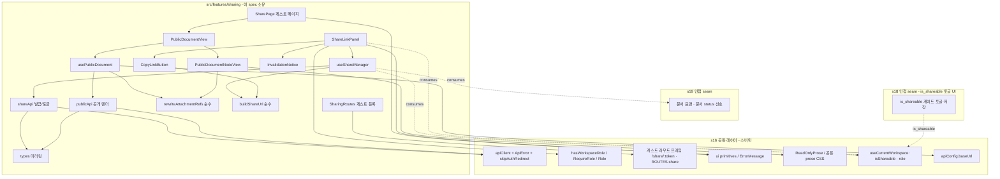
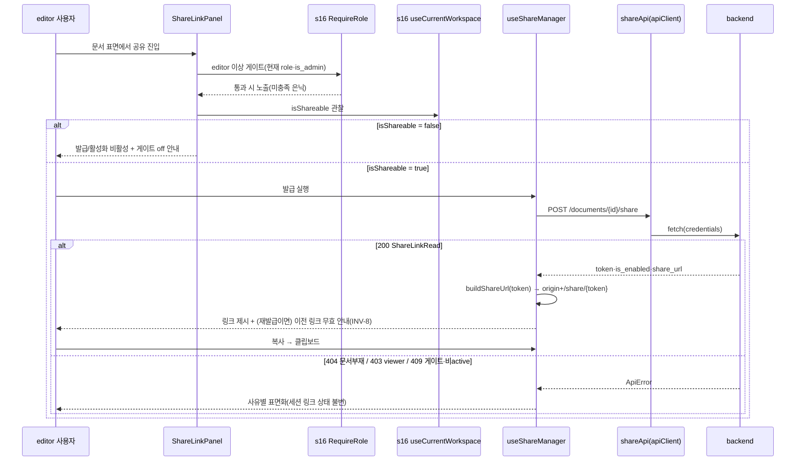
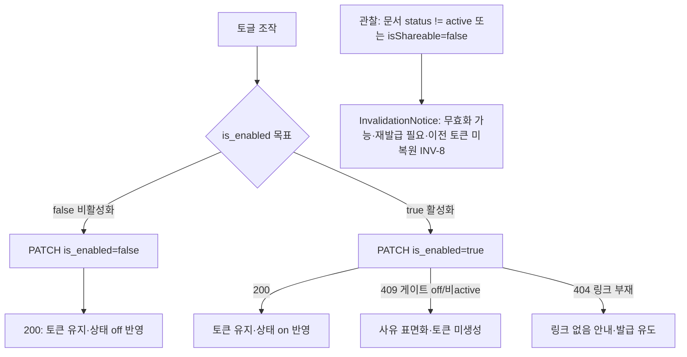
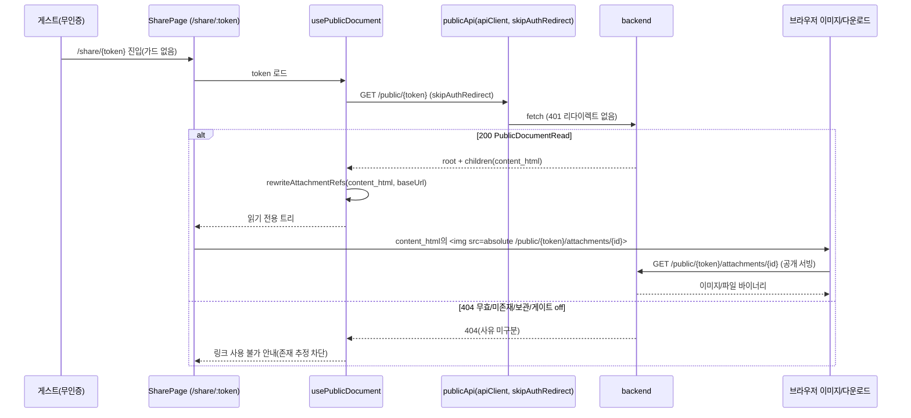

# Design Document — s22-fe-sharing

## Overview

**Purpose**: 이 spec은 Notion-lite 프론트엔드의 **문서 단위 읽기 전용 공유** 도메인 화면군
(`src/features/sharing`)을 소유한다. editor 이상 사용자의 공유 링크 관리(발급/재발급·on-off 토글·복사·무효화
안내)와, 링크를 받은 게스트의 인증 없는 읽기 전용 뷰(`/share/:token`), 그리고 링크 경유 첨부 접근·차단 반영을
구현하며, 모두 `s16-fe-foundation` 공통 레이어와 그 현재 WS 앰비언트 컨텍스트(`useCurrentWorkspace()`의 최상위
접근자 `isShareable`·`role`)를 **소비만** 한다(게이트 플래그 자체의 토글 UI는 `s18-fe-workspace` 소유).

**Users**: 문서를 외부에 공개하려는 editor 이상 사용자(관리 측)와, 링크를 받아 계정 없이 문서를 열람하는
게스트(공개 측)가 소비한다. 이 spec은 프론트 최상위 계층(Wave-3 종단)으로 downstream 소비자가 없다.

**Impact**: `frontend/`는 `s16` 공통 레이어(공용 유틸·현재 WS 앰비언트 컨텍스트·읽기 전용 prose 포함)와 `s19`
문서 표면 인접 seam 위에 공유 feature 폴더(`src/features/sharing`)를 추가한다(게이트 토글 UI는 s18, 값은 s16 컨텍스트 경유). 백엔드 공유·공개 엔드포인트(s14-sharing, s01 카탈로그 행 34~37)는 이미 GO이므로 이 화면군은 실동작
공개 계약을 소비한다(mock 아님). 무효화·재발급·lazy retire 판정은 백엔드가 단독 소유하며, 이 spec은 관찰
신호(문서 status·`isShareable`)와 응답·오류를 **표면화**만 한다.

### Goals
- editor 이상 게이팅된 공유 링크 관리: 발급/재발급(`POST /share`, INV-8 새 토큰)·토글(`PATCH /share`, 토큰 유지)·
  복사·무효화 안내를, `s16` 게이팅 유틸과 `s16` `useCurrentWorkspace().isShareable`·`role` 소비로 결선.
- `s16` 게스트 라우트(`/share/:token`, 가드 없음)에 마운트되는 공개 읽기 전용 뷰: `GET /public/{token}`으로
  루트 + 접근 시점의 현재 active 하위 계층을 `content_html` 중첩 트리로, `s16` `ReadOnlyProse` 공용 prose 스타일로 렌더.
- 링크 경유 첨부: 공개 렌더 HTML의 `/public/{token}/attachments/{id}` 참조를 API base URL 기준 절대 경로로
  재작성해 이미지 로딩·파일 다운로드를 공개 서빙으로 결선하고, 게이트 off·문서 trashed 시 문서·첨부 결합 차단 반영.
- 모든 서버 결선을 `s16` `apiClient`로, 오류를 `s16` `ApiError`/`ErrorMessage`로 통일.

### Non-Goals
- `is_shareable` 게이트 플래그 관리(설정 화면·토글 저장) — `s18` 단독 소유, 소비만.
- 문서 상태 전이·인증 문서 뷰어 자체 — `s19`·백엔드. 문서 status는 무효화 신호로 관찰만.
- 게스트 라우트 프레임 등록(`/share/:token` 경로·가드 없음 규약) — `s16` 소유. 이 spec은 마운트되는 뷰만 구현.
- 공통 레이어(API 클라이언트·401 인터셉터·권한 게이팅·UI 프리미티브·라우터 셸)의 구현 — `s16` 소유, 소비만.
- 백엔드 공유·공개 엔드포인트의 **동작**(발급/토글/공개 렌더/링크 경유 서빙·무효화 스윕·lazy retire) — `s14`.

## Boundary Commitments

### This Spec Owns
- **공유 feature 폴더**(`src/features/sharing`): 공유 관리·게스트 뷰 화면·훅·도메인 API 어댑터·계약 미러 타입.
- **공유 링크 관리 UI**(editor 이상): 발급/재발급(`POST /documents/{id}/share`)·토글(`PATCH /documents/{id}/share`)·
  복사·무효화 안내. 게이팅은 `s16` 유틸, 게이트 반영은 `s16` `useCurrentWorkspace().isShareable` 소비.
- **게스트 읽기 전용 뷰**: `s16` 게스트 라우트에 마운트되는 공개 뷰어(`GET /public/{token}`), 루트 + 현재 active
  하위 계층의 `content_html` 중첩 트리 읽기 전용 렌더(`s16` `ReadOnlyProse` 공용 prose 스타일 소비), 404 통일 무효 상태 처리.
- **링크 경유 첨부 참조 재작성·차단 반영**: 공개 렌더 HTML의 `/public/{token}/attachments/{id}` 참조를 API base
  URL 기준 절대 경로로 재작성(순수 규약), 이미지 로딩·다운로드 결선, 게이트 off·문서 trashed 결합 차단 반영.
- **프론트 공유 링크 규약**: 응답 `token`으로 게스트가 열람할 프론트 링크(`origin + /share/{token}`)를 구성하는
  순수 규약(백엔드 `share_url`=`/public/{token}`은 공개 API 경로이며 그대로 노출하지 않음).
- **라우트 등록**: 공개 뷰를 `s16` 게스트 라우트 프레임에 등록(프레임·가드는 `s16` 소유).

### Out of Boundary
- `s16` 공통 레이어·게스트 라우트 **프레임 등록**·현재 WS 앰비언트 컨텍스트 자체, `s18` `is_shareable` 게이트
  토글 UI **관리**, `s19` 문서 뷰어·상태 전이의 **구현**. 모두 소비/관찰만.
- 백엔드 발급/토글/공개 렌더/링크 경유 서빙·무효화 스윕·lazy retire **동작**(s14).
- 서버측 권한 강제(403)·게이트 강제(409)·공개 유효성 게이트(404 통일). 클라이언트 게이팅은 UI 노출 편의일 뿐이다.
- 인증 문서 첨부 렌더(`/attachments/{id}`, s21). 이 spec은 공개 경로(`/public/{token}/attachments/{id}`)만.

### Allowed Dependencies
- **Upstream(공통 레이어, `s16`)**: `apiClient`(공용 fetch·401·에러 정규화, `skipAuthRedirect`),
  `ApiError`/`ErrorResponse`, `Role`/`hasWorkspaceRole`/`<RequireRole>`, 게스트 라우트 프레임·`routes`(`ROUTES.share`),
  공용 UI(`Button`·`Spinner`·`EmptyState`·`ErrorMessage`), 읽기 전용 prose(`ReadOnlyProse`/공용 prose CSS),
  단일 설정(`apiConfig.baseUrl`), 그리고 **현재 WS 앰비언트 컨텍스트**(`useCurrentWorkspace()`의 최상위 접근자
  `isShareable`·`role`). `CurrentWorkspaceContextValue` 형태는 `s16` 단일 소유이며 이 spec은 값만 소비.
- **Adjacent seam(게이트 토글, `s18`)**: `is_shareable` 게이트 플래그의 **토글 UI·저장**은 `s18` 소유. 이 spec은
  그 플래그 값을 `s16` 앰비언트 컨텍스트(`useCurrentWorkspace().isShareable`)를 통해서만 소비하며 `s18` 설계에 직접
  의존하지 않는다(roadmap이 s22의 hard dep에서 s18 제거). 게이트 값 형태 변경 시 재검증은 `s16` 컨텍스트 계약을 따른다.
- **Upstream(계약, `s01`)**: 카탈로그 행 34~37(공유·공개), `ShareLinkRead`/`ShareLinkUpdate`/`PublicDocumentRead`/
  `PublicDocumentNode` 스키마, `ErrorResponse`, INV-8·§4.5 재발급 통일. 실제 라우터
  (`backend/app/sharing/router.py`·`schemas.py`·`service.py`·`public_service.py`)를 ground-truth로 미러링.
- **Adjacent seam(`s19` upstream / `s21` 병렬)**: 관리 UI가 노출되는 문서 표면·관찰하는 문서 status는 `s19`에서
  오고, 링크 경유 첨부는 `s21` 인접 seam으로 `s01` 공개 경로를 통해서만 정합한다(cross-spec 리뷰).
- **제약**: 모든 백엔드 호출은 `apiClient` 단일 경로. TypeScript strict, `any` 금지. 다른 feature 직접 import
  금지. API base URL 등은 `s16` 단일 설정에서만. 클라이언트 게이팅은 서버 강제를 대체하지 않는다. 새 API 형태
  발명 금지(특히 공유 링크 조회 GET 엔드포인트 부재를 seam으로 처리).

### Revalidation Triggers
- `s16` 공용 API 클라이언트 시그니처·에러 정규화·401 인터셉터·`skipAuthRedirect`, 게스트 라우트 프레임 등록
  규약(`ROUTES.share`), 권한 게이팅 유틸(`Role`·`hasWorkspaceRole`·`<RequireRole>`), 읽기 전용 prose
  (`ReadOnlyProse`/공용 prose CSS), 현재 WS 앰비언트 컨텍스트(`CurrentWorkspaceContextValue` 형태·최상위
  `isShareable`·`role` 접근자), 단일 설정(`apiConfig.baseUrl`) 변경 → 이 feature 재검증.
- `s18` 게이트 토글 UI가 소비하는 백엔드 `is_shareable` 플래그 계약이 바뀌어 `s16` 컨텍스트의 `isShareable`
  파생이 달라지면 → 이 feature 재검증.
- **상위 계약(`s01`) 변경**: 카탈로그 행 34~37 경로·메서드·요구 role, `ShareLinkRead`/`ShareLinkUpdate`/
  `PublicDocumentRead`/`PublicDocumentNode` 스키마, `ErrorResponse`, INV-8 재발급 통일 규칙 변경 → 재검증.
- 백엔드가 문서의 현재 공유 링크 조회 GET 엔드포인트를 추가하면(현 seam 해소), 관리 UI의 링크 상태 조달 설계 재검증.

## Architecture

### Contract Constraints & Adjacent Seams (설계 전제)

이 spec은 계약(`s01` 카탈로그 행 34~37)·백엔드 라우터의 실제 시그니처만 소비하며 새 형태를 발명하지 않는다.
그 결과 아래 **계약 공백/seam**을 설계 전제로 명시하고, 발명 대신 seam으로 처리한다.

| # | 공백/seam | 영향 | 이 spec의 처리(발명 아님) |
|---|-----------|------|---------------------------|
| S1 | 문서의 현재 공유 링크를 조회하는 GET 엔드포인트 없음(행 34~37은 발급 POST·토글 PATCH·공개 GET만) | 관리 UI가 cold load 시 기존 링크 존재/상태를 권위 있게 열거 불가 | 발급/토글 뮤테이션 응답(`ShareLinkRead`)으로 확인된 링크만 세션 상태로 관리하고, 사전 링크 열거 한계를 UI에 명시. GET 공유 링크 엔드포인트를 발명하지 않음 |
| S2 | 공개 렌더는 `content_html`만 노출(markdown `content` 미노출, s14 최소 노출 Req 7.1) | 게스트 뷰가 `s16` `EditorWrapper(mode:"read")`(markdown 입력)를 그대로 재사용 불가 | 게스트 뷰는 서버 산정 안전 HTML(`content_html`)을 읽기 전용으로 표시하고 별도 에디터 인스턴스를 만들지 않음(§Guest 렌더 결정). 인증 뷰어(s19)와 시각 언어를 일관화하되 render 데이터가 계약상 다름을 seam으로 명시 |
| S3 | 공개 렌더 HTML의 첨부 참조가 상대 경로(`/public/{token}/attachments/{id}`) | 브라우저가 이 경로를 프론트 origin 기준으로 해석해 백엔드 서빙에 도달 못함 | `apiConfig.baseUrl` 기준 절대 경로로 재작성(순수 변환, id 경계 보존). 참조 범위·격리·보관 판정은 백엔드 소유이므로 재구현하지 않음 |
| S4 | 관리 UI가 노출되는 문서 표면·문서 status 신호는 `s19` 소유 | 무효화 안내(문서 status 관찰)·관리 UI 마운트 지점이 s19 표면에 의존 | 관리 패널을 `documentId`+관찰 신호(status·`isShareable`)를 prop/컨텍스트로 받는 자족 컴포넌트로 설계하고, 마운트 지점은 cross-spec 리뷰에서 정합. s19 render 경로를 이원화·수정하지 않음 |

이 seam들은 cross-spec review와 백엔드 후속(공유 링크 조회 엔드포인트 추가 가능성)에서 조정한다.

### Guest 렌더 결정 (S2 — "render 경로 이원화 금지"의 정확한 준수)

steering `tech.md`의 "읽기 전용은 viewer mode로 통일, 편집 뷰와 읽기 뷰의 렌더 경로를 **이원화하지 않는다**"는
**편집기 인스턴스를 읽기용으로 별도 구성하지 말라**는 원칙이다. 게스트 뷰는 계약상 markdown `content`가 아니라
서버 산정 안전 HTML(`content_html`, s07 `MarkdownRenderer`가 nh3 새니타이즈 + 첨부 참조 재작성한 결과)만
제공받는다(S2). 따라서:
- 게스트 뷰는 **별도 에디터 인스턴스를 만들지 않고** 서버가 이미 안전화한 `content_html`을 읽기 전용으로 표시한다
  (편집기 이원화가 아니라 "에디터 미사용" — 원칙 위반이 아님).
- 인증 뷰어(s19 `DocumentViewer` = `EditorWrapper(mode:"read")` + markdown `content`)와 **시각 언어를 일관화**
  하되(동일 prose/viewer 스타일), render 입력 데이터가 계약상 다름(HTML vs markdown)을 seam으로 명시한다.
- `content_html`은 서버가 새니타이즈했으므로 프론트는 원시 HTML을 새로 생성하지 않고, 첨부 참조 URL 접두만
  재작성한다(§Security). 이로써 XSS 표면을 서버 새니타이즈에 위임하고 프론트 render 경로를 단순화한다.

### Architecture Pattern & Boundary Map

feature 폴더 캡슐화 패턴(steering `structure.md` 정렬). `src/features/sharing`이 공유 관리·게스트 뷰 화면·훅·
API 어댑터를 자기 폴더에 두고, 교차 관심사(API 클라이언트·권한·라우팅·UI·설정)는 `s16` 공통 레이어를, 현재 WS
게이트 값은 `s16` 현재 WS 앰비언트 컨텍스트(`isShareable`)를 통해서만 소비한다(토글 UI는 s18). 의존 방향은 항상 feature → shared/app 단방향이며 feature 간 직접
import는 금지된다. 관리 측은 인증 세션·게이팅 경유, 게스트 측은 인증과 독립된 공개 호출 경유로 이원화된다.



**Architecture Integration**:
- **Selected pattern**: feature 폴더 단일 소유 + 공통 레이어 소비. 관리 측(인증·게이팅)과 게스트 측(공개·무가드)의
  경로 이원화를 폴더 내부에서 명확히 분리(`shareApi`/`useShareManager`/`ShareLinkPanel` vs `publicApi`/
  `usePublicDocument`/`PublicDocumentView`).
- **Domain/feature boundaries**: 공유 도메인만 소유. 게이트 값은 `s16` 컨텍스트로 소비(토글 UI는 s18)·문서
  표면·status(s19)·공통 레이어(s16)는 소비/관찰.
- **Existing patterns preserved**: `apiClient` 단일 호출, 권한 게이팅 유틸 단일 경로, 계약 스키마(`{Resource}Read`)
  미러링, 단일 설정, 게스트 뷰 에디터 미이원화(서버 HTML 표시).
- **New components rationale**: 각 컴포넌트는 단일 책임(발급/토글, 공개 로드, 참조 재작성, 링크 구성, 관리 UI,
  게스트 뷰, 라우팅). 순수 함수(`rewriteAttachmentRefs`·`buildShareUrl`)는 테스트 용이하게 분리.
- **Steering compliance**: `structure.md` "feature는 공통 레이어를 소비하되 다른 feature를 직접 import 하지 않는다",
  "게스트 라우트는 인증 가드 없음", "권한 게이팅은 공통 유틸 경유" 원칙 준수.

### Dependency Direction (강제)
```
s16 shared/app (api·auth·ui·routes·config·prose·current-WS ctx isShareable/role)  ←  features/sharing (types → api → lib → hooks → 화면)
s18 is_shareable 게이트 토글 UI  →(값은 s16 컨텍스트 경유)→  features/sharing(관리 측)
s19 문서 표면·status 신호  →(인접 seam)→  features/sharing(관리 측 관찰)
```
`features/sharing` 내부도 좌→우 단방향(types → api → lib → hooks → 화면)을 지킨다. 화면은 훅·공통 레이어만
소비하고 다른 feature 폴더를 import 하지 않는다. 게스트 경로는 세션/게이팅에 의존하지 않는다(공개).

### Technology Stack

| Layer | Choice / Version | Role in Feature | Notes |
|-------|------------------|-----------------|-------|
| UI Framework | React 19 (`s16` 스택) | 관리 패널·게스트 뷰 렌더 | 함수형 + hooks |
| Routing | React Router v6+ (`s16` 게스트 프레임) | `/share/:token` 뷰 등록·`token` 파라미터 | 가드 없는 게스트 프레임 자식 |
| HTTP | `s16` `apiClient`(fetch) | 발급/토글(인증)·공개 렌더(`skipAuthRedirect`) | 401·에러 정규화 내장 |
| 게이트 소비 | `s16` `useCurrentWorkspace().isShareable` | 발급/활성화 가능 여부 반영 | 토글 UI는 s18 소유, 값은 s16 컨텍스트 경유 |
| 권한 게이팅 | `s16` `hasWorkspaceRole`·`<RequireRole>` + `useCurrentWorkspace().role` + session `is_admin` | editor+ 관리 UI 노출 | 컴포넌트 역할 비교 금지 |
| Guest 렌더 | 서버 산정 `content_html` + `s16` `ReadOnlyProse` | 읽기 전용 HTML 표시(공용 prose) | 에디터 인스턴스 미구성(S2), 인증 읽기와 동일 스타일 |
| 첨부 참조 | `apiConfig.baseUrl` 기준 절대 경로 재작성(순수) | 이미지 로딩·다운로드 결선 | id 경계 보존 문자열 변환 |
| Clipboard | 브라우저 `navigator.clipboard` + 폴백 | 링크 복사 | 실패 시 선택·복사 폴백 |
| Language | TypeScript 5 strict | 타입 안전 | `any` 금지, 계약 미러링 |
| Styling | Tailwind CSS 4 (`s16`) | 패널·게스트 뷰 스타일 | 공용 UI 프리미티브 재사용 |

> 게스트 렌더 결정(S2)·참조 재작성(S3)·계약 공백 처리(S1) 근거는 `research.md` 참조.

## File Structure Plan

### Directory Structure
```
frontend/src/features/sharing/
├── api/
│   ├── types.ts                   # 계약 미러: ShareLinkRead·ShareLinkUpdate·PublicDocumentRead·PublicDocumentNode
│   ├── shareApi.ts                # 관리(인증): POST /documents/{id}/share, PATCH /documents/{id}/share (apiClient 소비)
│   └── publicApi.ts               # 공개(무가드): GET /public/{token} (skipAuthRedirect), 첨부 서빙 URL 헬퍼
├── lib/
│   ├── buildShareUrl.ts           # 순수: token → 프론트 게스트 링크(origin + /share/{token})
│   └── rewriteAttachmentRefs.ts   # 순수: content_html의 /public/{token}/attachments/{id} → 절대 API base URL 재작성
├── hooks/
│   ├── useShareManager.ts         # 발급/재발급·토글·복사 오케스트레이션 + 세션 링크 상태 + 무효화 신호 관찰(S1·S4)
│   └── usePublicDocument.ts       # token으로 공개 렌더 로드·404 무효 상태·참조 재작성 결선
├── components/
│   ├── ShareLinkPanel.tsx         # 관리 UI(RequireRole editor 게이트, isShareable 반영, 발급/토글/복사/안내)
│   ├── CopyLinkButton.tsx         # 클립보드 복사 + 폴백 표시
│   ├── InvalidationNotice.tsx     # 무효화·재발급 안내(INV-8, status·isShareable 신호 표면화)
│   ├── PublicDocumentView.tsx     # 게스트 읽기 전용 뷰(로드/무효/오류 상태 + 트리 렌더)
│   └── PublicDocumentNodeView.tsx # 재귀 노드 렌더(s16 ReadOnlyProse로 content_html 표시 + children)
├── pages/
│   └── SharePage.tsx              # 게스트 라우트 페이지(/share/:token 마운트, token 추출 → PublicDocumentView)
└── routes.tsx                     # 공개 뷰를 s16 게스트 라우트 프레임에 등록
```

### Modified Files
- `frontend/src/app/router.tsx`(`s16` 소유) — 공개 뷰(`SharePage`)를 게스트 라우트(`/share/:token`) 프레임에
  **등록만** 연결한다. 게스트 프레임·가드 없음 규약은 `s16`이 소유하며 변경하지 않는다(등록 지점 소비).
- (인접 seam S4) 관리 패널(`ShareLinkPanel`)이 노출되는 **문서 표면 마운트 지점**은 `s19` 문서 뷰 표면과의
  cross-spec 리뷰에서 정합한다. 이 spec은 `documentId`+관찰 신호를 받는 자족 컴포넌트만 제공하며 `s19` render
  경로를 수정·이원화하지 않는다.

> 각 파일은 단일 책임. `lib/*`는 순수 함수(테스트 용이). `hooks/*`는 `api`+`lib`+공통 레이어만 소비.
> `components/*`·`pages/*`는 훅·공통 레이어만 소비하며 다른 feature를 import 하지 않는다.

## System Flows

### 공유 링크 발급·재발급·복사 (관리 측)

발급/재발급은 항상 새 토큰(INV-8)이므로 재발급 시 "이전에 배포한 링크는 더 이상 유효하지 않음"을 안내한다.
문서의 현재 링크를 조회하는 GET이 없어(S1) 상태는 뮤테이션 응답으로만 세션 내 관리한다.

### 공유 링크 토글 및 무효화 안내

토글은 재발급 통일 원칙의 유일한 상태 기반 예외(토큰 유지)다. 무효화 판정·retire는 백엔드 소유이며 프론트는
관찰 신호(status·isShareable)만 표면화한다. 이미 retire된 이전 토큰이 토글로 되살아난다고 안내하지 않는다.

### 게스트 읽기 전용 뷰 및 링크 경유 첨부 (공개 측)

게이트 off·문서 trashed면 `GET /public/{token}`이 404로 통일되어 문서·첨부가 함께 차단된다(결합 차단). 첨부
참조는 `apiConfig.baseUrl` 기준 절대 경로로 재작성되어 브라우저가 백엔드 공개 서빙에 직접 도달한다(S3).

## Requirements Traceability

| Requirement | Summary | Components | Interfaces / Contracts | Flows |
|-------------|---------|------------|------------------------|-------|
| 1.1–1.5 | 관리 UI 게이팅·isShareable 반영·링크 조회 seam·게이팅 비보안 | ShareLinkPanel, useShareManager, RequireRole | `hasWorkspaceRole`, `useCurrentWorkspace().isShareable`·`role` | 발급·복사 |
| 2.1–2.4 | 발급/재발급·새 토큰(INV-8)·프론트 링크·오류 | useShareManager, shareApi, buildShareUrl | `POST /documents/{id}/share`→`ShareLinkRead` | 발급·복사 |
| 3.1–3.4 | 토글 on/off·토큰 유지·404 발급 유도·유일 예외 | useShareManager, shareApi | `PATCH /documents/{id}/share`(`ShareLinkUpdate`)→`ShareLinkRead` | 토글·무효화 |
| 4.1–4.4 | 링크 복사·피드백·폴백·비활성 처리 | CopyLinkButton, buildShareUrl | `navigator.clipboard`, `origin+/share/{token}` | 발급·복사 |
| 5.1–5.4 | 무효화·재발급 안내·관찰 신호·404 통일 | InvalidationNotice, useShareManager, usePublicDocument | 문서 status·`isShareable` 신호, 404 통일 | 토글·무효화 / 게스트 |
| 6.1–6.6 | 게스트 뷰·공개 로드·content_html 트리·읽기전용·404·시각 일관 | SharePage, PublicDocumentView, PublicDocumentNodeView, usePublicDocument | `GET /public/{token}`→`PublicDocumentRead` | 게스트 뷰 |
| 7.1–7.5 | 첨부 참조 재작성·이미지·다운로드·결합 차단·범위 비재구현 | rewriteAttachmentRefs, usePublicDocument, PublicDocumentNodeView | `/public/{token}/attachments/{id}`·`apiConfig.baseUrl` | 게스트 뷰 |
| 8.1–8.5 | apiClient 단일·ApiError 표면화·공개 무리다이렉트·계약 미러·feature 격리 | shareApi, publicApi, types, 전 컴포넌트 | `apiClient`·`skipAuthRedirect`·`ApiError`·미러 타입 | 전 flow |

## Components and Interfaces

| Component | Domain/Layer | Intent | Req Coverage | Key Dependencies (P0/P1) | Contracts |
|-----------|--------------|--------|--------------|--------------------------|-----------|
| SharingTypes | features/sharing/api | 계약 미러 타입 | 2,3,6,8 | s01 계약 (P0) | State |
| shareApi | features/sharing/api | 발급/토글 어댑터(인증) | 2,3,8 | apiClient (P0), SharingTypes (P0) | Service, API |
| publicApi | features/sharing/api | 공개 렌더 어댑터(무가드) | 6,7,8 | apiClient (P0), SharingTypes (P0), apiConfig (P1) | Service, API |
| buildShareUrl | features/sharing/lib | token→프론트 게스트 링크 순수 | 2,4 | ROUTES.share (P1) | Service |
| rewriteAttachmentRefs | features/sharing/lib | 첨부 참조 절대 경로 재작성 순수 | 7 | apiConfig.baseUrl (P0) | Service |
| useShareManager | features/sharing/hooks | 발급/토글/복사·세션 상태·무효화 신호 | 1,2,3,4,5 | shareApi (P0), buildShareUrl (P0), useCurrentWorkspace (P1) | Service, State |
| usePublicDocument | features/sharing/hooks | 공개 로드·404 무효·참조 재작성 | 5,6,7 | publicApi (P0), rewriteAttachmentRefs (P0) | Service, State |
| ShareLinkPanel | features/sharing/components | 관리 UI(게이팅·게이트 반영) | 1,2,3,5 | useShareManager (P0), RequireRole (P0), InvalidationNotice (P1) | State |
| CopyLinkButton | features/sharing/components | 클립보드 복사·폴백 | 4 | buildShareUrl (P0), ui (P1) | State |
| InvalidationNotice | features/sharing/components | 무효화·재발급 안내(INV-8) | 5 | ui (P1) | State |
| PublicDocumentView | features/sharing/components | 게스트 뷰(상태 + 트리) | 6,7 | usePublicDocument (P0), PublicDocumentNodeView (P0), ui (P1) | State |
| PublicDocumentNodeView | features/sharing/components | 재귀 노드(content_html + children) | 6,7 | rewriteAttachmentRefs (P1), ReadOnlyProse (P1) | State |
| SharePage | features/sharing/pages | 게스트 페이지(token 추출) | 6 | PublicDocumentView (P0), routes (P1) | State |
| SharingRoutes | features/sharing | 게스트 라우트 등록 | 6 | s16 게스트 프레임 (P0) | State |

### features/sharing — api

#### SharingTypes
| Field | Detail |
|-------|--------|
| Intent | 백엔드 공유·공개 계약을 미러링한 프론트 타입(발명 금지) |
| Requirements | 2.1, 3.1, 6.3, 8.4 |

**Responsibilities & Constraints**
- 백엔드 `ShareLinkRead`/`ShareLinkUpdate`/`PublicDocumentRead`/`PublicDocumentNode`를 **미러링만** 하며 새 필드를
  발명하지 않는다(`s01`/`s14` 소비). `PublicDocumentNode.content_html`은 서버 산정 안전 HTML이다.
- `share_url`은 백엔드가 산정한 공개 API 경로(`/public/{token}`)이며, 게스트가 여는 프론트 링크와 구분한다(§buildShareUrl).

**Contracts**: State [x]
```typescript
// 백엔드 스키마 미러 — 새 필드/코드 발명 금지(s01/s14 계약 소비)
interface ShareLinkRead {
  id: number;
  created_at: string;
  updated_at: string | null;   // share_link 테이블에 컬럼 없음 → 항상 null
  document_id: number;
  token: string;
  is_enabled: boolean;
  share_url: string;           // 백엔드 산정 공개 API 경로 "/public/{token}" (프론트 링크와 구분)
}
interface ShareLinkUpdate { is_enabled: boolean; }

interface PublicDocumentNode {
  id: number;
  title: string;
  content_html: string;        // 서버 산정 안전 HTML(nh3 새니타이즈 + 첨부 참조 재작성)
  children: PublicDocumentNode[];
}
interface PublicDocumentRead { root: PublicDocumentNode; }
```
- Boundary: 필드 이름·형태는 실제 라우터/스키마와 1:1. 형태 변경 시 revalidation trigger.

#### shareApi / publicApi
| Field | Detail |
|-------|--------|
| Intent | `s16` `apiClient` 위에 공유·공개 경로·타입을 얇게 결선한 어댑터(중복 fetch 금지) |
| Requirements | 2.1, 3.1, 6.2, 7.1, 8.1, 8.3 |

**Responsibilities & Constraints**
- `shareApi`(관리, 인증): `POST /documents/{id}/share`·`PATCH /documents/{id}/share`를 `apiClient`로 호출.
- `publicApi`(공개, 무가드): `GET /public/{token}`을 `apiClient.get(..., { skipAuthRedirect: true })`로 호출해
  전역 401 리다이렉트를 유발하지 않는다(공개 경로). 첨부 서빙 URL은 브라우저 직접 로딩용 절대 경로 헬퍼로 제공.
- 경로·메서드·스키마는 카탈로그 행 34~37과 정확히 일치. 어댑터는 비즈니스 로직 없이 결선만.

**Contracts**: Service [x] / API [x]
```typescript
const shareApi = {
  issueLink: (documentId: number) => Promise<ShareLinkRead>,                 // POST /documents/{id}/share (200)
  toggleLink: (documentId: number, body: ShareLinkUpdate) => Promise<ShareLinkRead>, // PATCH /documents/{id}/share (200)
};
const publicApi = {
  getPublicDocument: (token: string) => Promise<PublicDocumentRead>,         // GET /public/{token} (skipAuthRedirect)
  buildAttachmentUrl: (token: string, attachmentId: number) => string,       // 절대 API base URL 기반 공개 서빙 URL
};
```

##### API Contract
| Method | Endpoint | Request | Response | Errors |
|--------|----------|---------|----------|--------|
| POST | /documents/{id}/share | — | 200 ShareLinkRead | 401,403,404,409 |
| PATCH | /documents/{id}/share | ShareLinkUpdate | 200 ShareLinkRead | 401,403,404,409 |
| GET | /public/{token} | — (공개, skipAuthRedirect) | 200 PublicDocumentRead | 404 |
| GET | /public/{token}/attachments/{aid} | — (공개, 브라우저 직접) | 200 (binary) | 404 |

- Preconditions: 관리 호출은 인증 세션(쿠키)·문서 id. 공개 호출은 token만(무인증). base URL은 `s16` 단일 설정.
- Postconditions: 관리 2xx→`ShareLinkRead`, 공개 2xx→`PublicDocumentRead`. 오류는 `ApiError`로 throw(표면화).
- Invariants: 401·에러 정규화는 `apiClient` 단일 지점. 공개 호출은 `skipAuthRedirect`로 401 리다이렉트 제외.

### features/sharing — lib (pure)

#### buildShareUrl / rewriteAttachmentRefs
| Field | Detail |
|-------|--------|
| Intent | 프론트 게스트 링크 구성·공개 렌더 HTML의 첨부 참조 절대 경로 재작성(순수) |
| Requirements | 2.2, 4.1, 7.1, 7.5 |

**Responsibilities & Constraints**
- `buildShareUrl(token)`: 게스트가 여는 프론트 링크를 `` `${origin}${ROUTES.share.replace(":token", token)}` ``
  (`/share/{token}`)로 구성한다. `s16` `ROUTES.share`는 정적 문자열 `"/share/:token"`이므로(경로 빌더 함수가
  아님) `buildShareUrl`이 s22 자체에서 `:token` 자리표시자를 치환하며, s16에 없는 경로 빌더를 가정하지 않는다.
  백엔드 `share_url`(`/public/{token}` 공개 API 경로)을 그대로 노출하지 않는다(관리자용 표시·복사 대상은 프론트 링크).
- `rewriteAttachmentRefs(html, token, baseUrl)`: 공개 렌더 HTML의 `/public/{token}/attachments/{id}` 참조를
  `${baseUrl}/public/{token}/attachments/{id}` 절대 경로로 재작성한다. 숫자 id 경계를 보존하는 문자열 변환만
  수행하고(백엔드가 이미 링크 스코프로 재작성한 참조의 origin만 절대화), 참조 범위·격리·보관 판정을 재구현하지 않는다.

**Contracts**: Service [x]
```typescript
function buildShareUrl(token: string): string;                                  // origin + /share/{token}
function rewriteAttachmentRefs(html: string, token: string, baseUrl: string): string; // 절대 API base URL 접두
```
- Invariants: 두 함수 모두 부수효과 없음(테스트 용이). 재작성은 id 경계 보존(`/public/{token}/attachments/5`와
  `/attachments/50`이 서로 오염되지 않음). 판정(범위·격리·보관)은 서버 위임.

### features/sharing — hooks

#### useShareManager
| Field | Detail |
|-------|--------|
| Intent | 발급/재발급·토글·복사 오케스트레이션 + 세션 링크 상태 + 무효화 신호 관찰 |
| Requirements | 1.3, 1.4, 2.1, 2.3, 2.4, 3.1, 3.2, 3.3, 4.1, 5.1, 5.2, 5.3 |

**Responsibilities & Constraints**
- 발급(`issueLink`)·토글(`toggleLink`)을 `shareApi`로 호출하고 응답 `ShareLinkRead`를 세션 링크 상태로 반영.
  문서 현재 링크 조회 GET 부재(S1)로 뮤테이션 응답으로 확인된 링크만 관리하며 사전 링크 존재를 단정하지 않는다.
- 재발급은 항상 새 토큰(INV-8)이므로 재발급 시 이전 링크 무효 안내 플래그를 세운다. 토글은 토큰 유지(§System Flows).
- 무효화 신호 관찰: 주입받은 문서 status(s19 관찰)·`s16` `useCurrentWorkspace().isShareable`로 무효화 가능
  상태를 파생해 `InvalidationNotice` 렌더 근거를 제공(판정·retire는 서버 소유, Req 5.2).
- 오류는 `ApiError` 그대로 노출(자체 형태 발명 금지). 실패 시 세션 링크 상태 불변(Req 2.4).

**Contracts**: Service [x] / State [x]
```typescript
interface ShareManagerState {
  link: ShareLinkRead | null;      // 세션 내 확인된 링크(S1: 사전 열거 불가)
  frontShareUrl: string | null;    // buildShareUrl(link.token)
  reissued: boolean;               // 직전 조작이 재발급이면 이전 링크 무효 안내(INV-8)
  invalidated: boolean;            // 관찰 신호(status != active || !isShareable)로 파생
  pending: boolean;
  error: ApiError | null;
}
function useShareManager(input: {
  documentId: number;
  documentStatus: string;          // s19 관찰 신호(active 여부)
}): ShareManagerState & {
  issue(): Promise<ShareLinkRead | null>;
  toggle(enabled: boolean): Promise<ShareLinkRead | null>;
};
```
- Postconditions: 성공은 `link` 갱신 + null 아닌 반환. 실패는 `error`에 `ApiError` + 링크 상태 불변.
- Invariants: 무효화 판정·토큰 교체는 서버 소유. 이 훅은 관찰 신호 표면화·응답 반영만.

#### usePublicDocument
| Field | Detail |
|-------|--------|
| Intent | token으로 공개 렌더 로드·404 무효 상태·첨부 참조 재작성 결선 |
| Requirements | 5.4, 6.2, 6.3, 6.5, 7.1 |

**Responsibilities & Constraints**
- `publicApi.getPublicDocument(token)`를 `skipAuthRedirect`로 호출(공개, 401 리다이렉트 없음). 성공 시
  `content_html`을 `rewriteAttachmentRefs`로 절대 경로 재작성해 읽기 전용 트리로 노출.
- 404는 무효/미존재/보관/게이트 off를 구분하지 않고 단일 "링크 사용 불가" 상태로 매핑(존재 추정 차단, Req 5.4·6.5).
- 그 외 오류(5xx 등)는 `ApiError`로 표면화.

**Contracts**: Service [x] / State [x]
```typescript
type PublicDocState =
  | { status: "loading" }
  | { status: "ready"; root: PublicDocumentNode }   // content_html 재작성 완료
  | { status: "unavailable" }                        // 404 통일(사유 비노출)
  | { status: "error"; error: ApiError };
function usePublicDocument(token: string): PublicDocState;
```
- Invariants: 404는 사유 미구분 `unavailable`. 참조 재작성은 `apiConfig.baseUrl` 기준(단일 설정).

### features/sharing — 화면 컴포넌트

#### ShareLinkPanel / CopyLinkButton / InvalidationNotice / PublicDocumentView / PublicDocumentNodeView / SharePage / SharingRoutes
| Field | Detail |
|-------|--------|
| Intent | 관리 패널·복사·무효화 안내·게스트 뷰·재귀 노드·게스트 페이지·라우트 등록 |
| Requirements | 1.1, 1.2, 1.3, 2.2, 3.3, 4.1, 4.2, 4.3, 4.4, 5.1, 5.3, 6.1, 6.4, 6.6, 7.2, 7.3, 7.4 |

**Responsibilities & Constraints**
- **ShareLinkPanel**: `<RequireRole minimum={EDITOR} currentRole={useCurrentWorkspace().role}>`로 감싸 노출
  (viewer 은닉, admin은 `is_admin` 통과). `s16` `useCurrentWorkspace().isShareable`가 false면 발급/활성화 비활성 + 게이트 off 안내(Req 1.3).
  발급·토글·복사 조작을 `useShareManager`에 위임하고, 오류는 `ErrorMessage`로 표면화. 역할 문자열 직접 비교 금지.
- **CopyLinkButton**: `buildShareUrl(token)` 절대 링크를 `navigator.clipboard`로 복사(성공 피드백), 실패 시 링크
  문자열을 선택·복사 가능한 형태로 표시하는 폴백(Req 4.2·4.3). 활성 링크 없으면 비활성(Req 4.4).
- **InvalidationNotice**: 관찰 신호(문서 status != active 또는 `isShareable` off)에서 무효화 가능·재발급 필요·
  이전 토큰 미복원(INV-8)을 안내(Req 5.1·5.3). 판정은 하지 않고 신호 표면화만.
- **PublicDocumentView**: `usePublicDocument` 상태별 렌더 — loading(Spinner)·unavailable(EmptyState "링크 사용
  불가")·error(ErrorMessage)·ready(트리). 변경 조작 일절 없음(읽기 전용, Req 6.4). `s16` `ReadOnlyProse` 공용 prose
  스타일 소비로 인증 뷰어와 시각 일관(Req 6.6).
- **PublicDocumentNodeView**: 재귀 노드. 서버 산정 `content_html`을 `s16` `ReadOnlyProse` 공용 prose 스타일로 읽기
  전용 표시(에디터 미구성, S2 — 별도 prose 스타일 정의 없이 s16 스타일 재사용) 하고 `children`을 재귀 렌더. 이미지
  참조는 재작성된 절대 경로로 브라우저가 공개 서빙에서 로딩(Req 7.2), 파일 다운로드 링크도 동일 경로(Req 7.3).
- **SharePage**: 게스트 라우트 페이지. `useParams`의 `token`을 추출해 `PublicDocumentView`에 전달. 세션·게이팅에
  의존하지 않음(공개).
- **SharingRoutes**: `SharePage`를 `s16` 게스트 라우트(`/share/:token`) 프레임에 **등록만** 한다(프레임·가드는 s16).

**Contracts**: State [x]
```typescript
// 대표 props(요약). 세부는 구현 시 확정.
interface ShareLinkPanelProps { documentId: number; documentStatus: string; }  // status는 s19 관찰 신호
interface CopyLinkButtonProps { frontShareUrl: string | null; }
interface InvalidationNoticeProps { invalidated: boolean; reissued: boolean; }
interface PublicDocumentViewProps { token: string; }
interface PublicDocumentNodeViewProps { node: PublicDocumentNode; }
```
- Boundary: 권한 비교는 `RequireRole`/`hasWorkspaceRole`만 사용(컴포넌트 역할 비교 산발 금지, Req 1.1). 게스트
  컴포넌트는 세션/게이팅을 소비하지 않는다(공개).

## Data Models

이 spec은 자체 영속 데이터를 소유하지 않는다. 백엔드 공유·공개 계약 형태를 프론트 타입으로 미러링하고, 세션
내 링크 상태(`ShareManagerState`)만 훅 로컬 상태로 관리한다(S1: 서버 조회 GET 부재로 지속·재로드 불가).

- `ShareLinkRead`/`ShareLinkUpdate` ← `backend/app/sharing/schemas.py`(document_id·token·is_enabled·share_url;
  `updated_at`은 컬럼 부재로 null).
- `PublicDocumentRead`/`PublicDocumentNode` ← 동일 파일(root·id·title·content_html·children; 최소 노출).
- `ApiError`/`ErrorResponse`·`Role`·`apiConfig`·`ReadOnlyProse`(공용 prose) ← `s16` 공통 레이어.
- 현재 WS `isShareable`·`role` ← `s16` `useCurrentWorkspace()` 앰비언트 컨텍스트(소비만; 게이트 토글 UI는 s18).

### Data Contracts & Integration
- **전송**: 관리 호출 JSON(세션 쿠키 `credentials:"include"`), 공개 호출 JSON(`skipAuthRedirect`, 무인증), 첨부는
  브라우저가 절대 경로로 직접 로딩(공개 서빙 바이너리).
- **파생 필드**: `content_html`은 서버 산정 안전 HTML. 프론트는 첨부 참조 origin만 절대화하고 원시 HTML을 새로
  만들지 않으며, 표시 컨테이너는 `s16` `ReadOnlyProse` 공용 prose 스타일을 재사용해 인증 읽기와 동일 렌더를
  보장한다(§Security). `share_url`(공개 API 경로)과 프론트 게스트 링크(`/share/{token}`)를 구분한다.
- **에러**: 모든 오류는 `apiClient`가 `ApiError`로 정규화. feature는 표면화만(자체 형태 발명 금지). 공개 404는
  단일 `unavailable`로 매핑.
- **계약 소유권**: 위 타입은 `s01`/`s14` 백엔드 계약 미러링만. 형태 변경 시 revalidation trigger.

## Error Handling

### Error Strategy
- **단일 정규화 지점**: 모든 HTTP 오류는 `s16` `apiClient`가 `ApiError`로 정규화. feature는 `ApiError`를
  `ErrorMessage`/상태로 표면화만.
- **공개 404 통일**: `GET /public/{token}` 404는 사유(무효/미존재/보관/게이트 off)를 구분하지 않고 단일 "링크
  사용 불가"로 매핑(존재 추정 차단).
- **관리 뮤테이션 실패 불변**: 발급/토글 실패 시 세션 링크 상태를 변경하지 않는다.

### Error Categories and Responses
- **401 unauthenticated**: 관리 호출은 `s16` 전역 인터셉터가 로그인 리다이렉트(개별 처리 없음). 공개 호출은
  `skipAuthRedirect`로 리다이렉트 제외.
- **403 forbidden**: 관리 UI는 게이팅으로 미노출하나 서버 403은 `ErrorMessage`로 표면화(게이팅은 보안 경계 아님).
- **404 not_found**: 관리(문서 부재·토글 대상 링크 부재)→사유 안내·발급 유도; 공개→단일 `unavailable`.
- **409 conflict**: 게이트 off·비active 문서 발급/활성화 → 사유 표면화, 토큰 미생성.
- **5xx internal**: 일반 오류 메시지(내부 세부 미표시).

## Testing Strategy

### Unit Tests
- `buildShareUrl`: token→`origin + /share/{token}` 구성, 백엔드 `share_url`(`/public/{token}`) 미노출(2.2, 4.1).
- `rewriteAttachmentRefs`: `/public/{token}/attachments/5`와 `/attachments/50` id 경계 보존, `apiConfig.baseUrl`
  접두, token 문자열 안전 치환(7.1, 7.5).
- `shareApi`/`publicApi`: 경로·메서드가 카탈로그 행 34~37과 일치하고 `apiClient` 경유, 공개 호출이
  `skipAuthRedirect`를 지정(8.1, 8.3).
- `useShareManager`: 발급 성공 시 link·frontShareUrl 반영, 재발급 시 reissued 플래그, 실패 시 상태 불변(2.1, 2.3, 2.4).

### Integration Tests
- 발급 흐름: `POST /share` 200→세션 링크 반영·프론트 링크 제시, 409(게이트 off)·403(viewer)·404(부재) 표면화(2.1, 2.4).
- 토글 흐름: `PATCH is_enabled=false/true` 200 토큰 유지 반영, 활성화 409·링크 부재 404 처리(3.1, 3.2, 3.3).
- 무효화 안내: 문서 status != active 또는 `useCurrentWorkspace().isShareable`=false 신호에서 `InvalidationNotice` 노출·재발급 필요·이전
  토큰 미복원 안내(5.1, 5.3).
- `usePublicDocument`: `GET /public/{token}` 200→content_html 재작성 트리, 404→`unavailable`(무리다이렉트)(6.2, 6.5, 7.1).

### E2E / UI Tests
- viewer 컨텍스트(`useCurrentWorkspace().role`)에서 공유 관리 UI 미노출, editor/admin 컨텍스트에서 노출;
  `useCurrentWorkspace().isShareable`=false면 발급 비활성(1.1, 1.2, 1.3).
- 게스트가 `/share/{token}` 진입 시 세션 없이 문서·하위 트리·이미지 표시, 변경 조작 부재; 무효 링크는 사용 불가
  안내(6.1, 6.4, 6.5, 7.2).
- 링크 복사 후 클립보드에 절대 게스트 링크 존재, 복사 실패 시 폴백 표시(4.1, 4.2, 4.3).

### Build / Type Checks
- `tsc --noEmit`(strict) 통과, `vite build` 성공(계약 타입 미러링·`any` 금지 확인).

## Security Considerations
- 관리 세션은 `s16` `apiClient`의 서명 쿠키(`credentials:"include"`). 게스트 경로는 무인증 공개 호출(쿠키 불요).
  feature는 토큰을 저장/노출하지 않는다(공유 token은 링크 구성용 파생값).
- **클라이언트 게이팅은 보안 경계가 아님**: 발급/토글은 서버측 resolver(403)·게이트(409)가 최종 강제. UI 게이팅
  (`RequireRole`)·`isShareable` 반영은 노출 편의(Req 1.5).
- **XSS**: 게스트 뷰는 서버가 nh3로 새니타이즈한 `content_html`만 표시하고 프론트가 원시 HTML을 새로 생성하지
  않는다. 첨부 참조는 origin 절대화(문자열 접두)만 수행해 스크립트 주입 표면을 넓히지 않는다. 게스트 뷰는 별도
  에디터 인스턴스를 만들지 않으며 표시 스타일은 `s16` `ReadOnlyProse`를 소비한다(S2 — 에디터 미사용은 허용된
  예외이고 렌더 경로 포크가 아니며, 공용 prose CSS 공유로 인증 읽기와 동일 시각 언어를 갖는다).
- **존재 추정 차단**: 공개 404는 무효/미존재/보관/게이트 off를 구분하지 않고 단일 "링크 사용 불가"로 표면화한다.
- **무효화·재발급(INV-8)**: 무효화 판정·토큰 교체 retire는 백엔드 소유. 프론트는 관찰 신호만 안내하며, 이전 토큰이
  토글로 되살아난다고 오도하지 않는다.

## Supporting References
- 상위 계약: `s01-contract-foundation` design.md(카탈로그 행 34~37·ErrorResponse·INV-8·§4.5 재발급 통일),
  `backend/app/sharing/router.py`·`schemas.py`·`service.py`·`public_service.py`(ground-truth API 형태).
- 소비 공통 레이어: `s16-fe-foundation` design.md(`apiClient`·`skipAuthRedirect`·`ApiError`·`Role`/
  `hasWorkspaceRole`/`RequireRole`·게스트 라우트 프레임·`ROUTES.share`·`apiConfig`·`ReadOnlyProse`/공용 prose CSS·
  현재 WS 앰비언트 컨텍스트 `useCurrentWorkspace().isShareable`·`role`).
- 소비 게이트 토글: `s18-fe-workspace` design.md(`is_shareable` 게이트 토글 UI·저장; 플래그 값은 s16 컨텍스트 경유 소비).
- 인접 뷰어: `s19-fe-document` design.md(문서 표면·문서 status 신호·읽기 뷰어 시각 일관, render 경로 미이원화).
- 게스트 렌더 결정(S2)·첨부 참조 재작성(S3)·공유 링크 조회 GET 부재(S1) 처리 근거: `research.md`.
- steering: `tech.md`(Editor viewer mode·설정 단일화·Frontend 결정)·`structure.md`(feature 소비·게스트 라우트
  무가드·권한 게이팅 단일 경로)·`roadmap.md`(FE 계층 순서 `s16 → {s17,s18,s19} → {s20,s21,s22}`).
