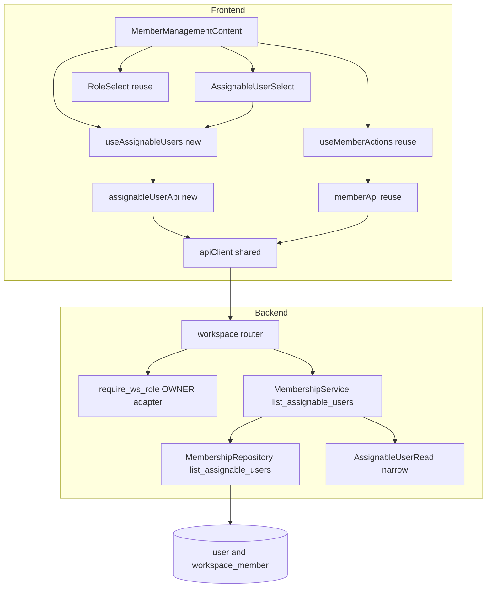
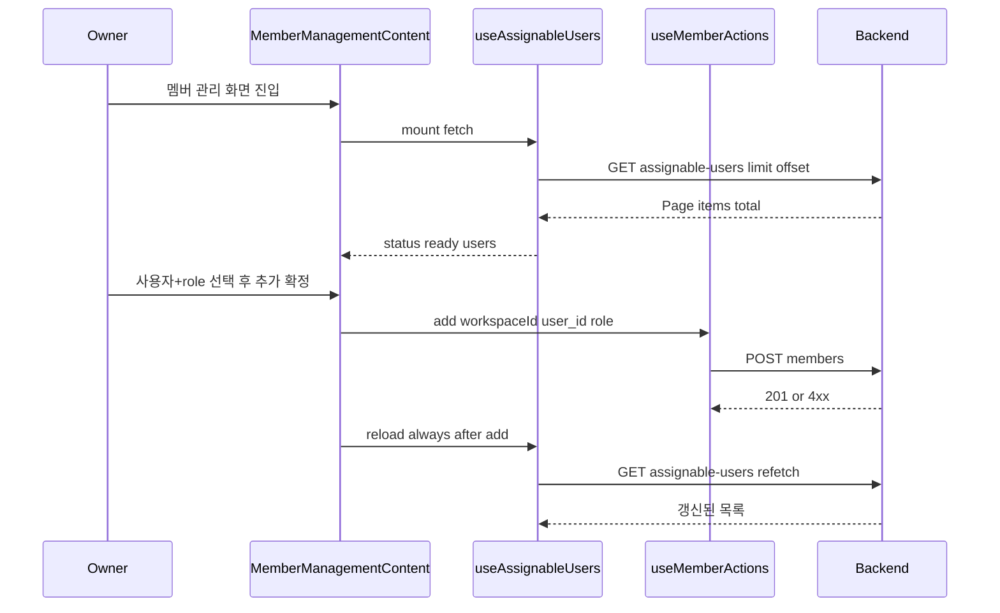
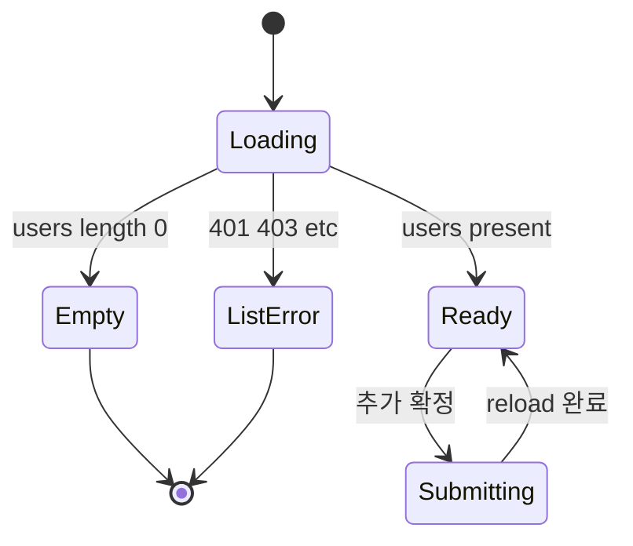

# Design Document

## Overview

**Purpose.** 이 기능은 워크스페이스 **owner(및 admin override)** 에게 "현재 워크스페이스에 **배정 가능한
사용자**(admin 아님·활성·비삭제·비-멤버)를 이름·이메일과 함께 열람·선택해 멤버로 추가"하는 능력을 제공한다.
현재 owner 는 대상의 raw `user_id` 를 직접 입력해야 하고(사용자 열거 수단 부재 = 의도된 anti-enumeration),
이 spec 은 그 경계를 **owner 범위로만 좁게 완화**한다.

**Users.** 워크스페이스 owner 가 멤버 관리 화면에서 이 능력을 사용한다. admin 은 기존 override 로 동일 접근을
얻는다. editor·viewer·비멤버·미인증은 접근하지 못한다.

**Impact.** 백엔드에 **owner-gated 조회 엔드포인트 1개**(`GET /workspaces/{id}/assignable-users`)와 교차 도메인
anti-join 쿼리를 추가하고, 프론트 멤버 관리 폼의 raw `user_id` 숫자 입력을 **선택 UI** 로 대체한다. 기존 멤버
추가 뮤테이션·게이팅·오류표시·페이지네이션 계약은 **변경 없이 재사용**한다. 아키텍처 패턴 변경은 없다.

### Goals
- owner(+admin)가 배정 가능 사용자를 **id·이름·이메일만** 열람하는 전용 조회 능력 제공.
- 멤버 추가 UI 를 raw `user_id` 입력 → **목록 선택** 으로 대체.
- 최소 노출 원칙(narrow 스키마·owner 게이트·멤버 열거 비노출)을 **정확히** 지킨다.

### Non-Goals
- 권위 있는 **전체 멤버 목록** 조회 능력 신설(S1 계약 공백 해소 아님). "비-멤버" 판정은 서버 내부 수행.
- 계정 생성·상태 전이·비밀번호 재설정(= s03 admin 소유), self sign-up.
- 검색어 필터·정렬 UI, 무한 스크롤/`loadMore`(응답 형태는 페이지 확장 여지를 남기되 이 spec 수용 기준 밖).
- 멤버 제거 후 배정 가능 목록 실시간 재동기화(선택 사항 — 마운트·추가 후 refetch 로 충분).

## Boundary Commitments

### This Spec Owns
- **엔드포인트** `GET /workspaces/{id}/assignable-users` 와 그 응답 계약 `Page[AssignableUserRead]`.
- **narrow 스키마** `AssignableUserRead` (= `id`/`name`/`email`) — 신규 계약, 이 spec 이 안정화.
- **교차 도메인 anti-join 쿼리** `MembershipRepository.list_assignable_users` (배정 가능 필터 + count).
- **프론트 조회 계층**: `assignableUserApi.listAssignable`, `useAssignableUsers` 훅, `AssignableUserSelect`
  컴포넌트, 그리고 `MemberManagementContent` 의 raw `user_id` 입력 → 선택 UI 교체.

### Out of Boundary
- 멤버 추가/변경/제거 뮤테이션과 owner 게이트(`require_ws_role(OWNER)`)·admin override — **s05 소유, 재사용**.
- 사용자 계정 모델·`is_admin`/`is_active`/`is_deleted` 의미 — **s01·s03 소유, 수정 금지**.
- `app/common/*`·`app/models/*`·`app/schemas/base.py`·프론트 `shared/*`·`RequireRole`·`MembershipRoleSource`
  — 소비만, 수정 금지.
- 권위 멤버 목록 GET(S1) 신설 — 구조적으로 **비-멤버만** 반환해 회피.

### Allowed Dependencies
- **백엔드**: `app.workspace.dependencies.require_ws_role`(경로 `{id}`→`workspace_id` 어댑터), `Role`,
  `AuthContext`/`get_current_user`(`app.common.auth`), `Page`/`ORMReadModel`(`app.schemas.base`),
  `User`(`app.models.user`)·`WorkspaceMember`(`app.models.workspace`) — 읽기 전용, 기존 `get_membership_service`
  provider.
- **프론트**: `@/shared/api/client`(`apiClient`, 전역 401), `@/shared/types/page`(`Page<T>`),
  `@/shared/ui`(`Button`·`Spinner`·`EmptyState`·`ErrorMessage`), `@/shared/auth`(`Role`·`RequireRole`),
  `../context/membershipRoleSource`, `../hooks/useMemberActions`(뮤테이션), `./RoleSelect`.
- **의존 방향(엄수)**: `models/schemas → repository → service → router`(백), `types → api → hook → component → panel`(프론트).
  각 계층은 왼쪽만 import. 역방향 금지.

### Revalidation Triggers
- `AssignableUserRead` 필드 형태 변경(계약 shape) → 프론트 `AssignableUser` 미러·`AssignableUserSelect` 재검증.
- 배정 가능 필터 정의(admin/active/deleted/비-멤버) 변경 → 보안 경계·통합 테스트 재검증.
- 엔드포인트 경로/페이지네이션 파라미터 변경 → `assignableUserApi` 경로 빌더 재검증.
- `MembershipRepository`/`MembershipService` provider 시그니처 변경 → 조립 지점(`get_membership_service`) 재검증.
- `require_ws_role`·`AuthContext.is_admin`·`Page[T]` 등 상류 계약 변경 → 게이팅·응답 봉투 전반 재검증.

## Architecture

### Existing Architecture Analysis
- **레이어드 백엔드**(router→service→repository→models). 워크스페이스 패키지에 멤버십 도메인이 이미 존재하며
  `router.py` 가 provider factory(`get_membership_service`)와 owner 게이트를 소유한다. 라우터 prefix 는 bare
  이고 `/api/1.0` 은 `app/main.py` 의 단일 `APIRouter(prefix=API_V1_PREFIX)` 에서 부여된다.
- **소유 게이트 단일 소스**: `WorkspaceRoleResolver.has_at_least` 가 `ctx.is_admin` 를 멤버십 조회 전에 단락 →
  admin override(R2.2)를 추가 구현 없이 충족. 401 은 `get_current_user`, 403 은 `require_ws_role` 이 담당.
- **narrow 직렬화 관례**: read 스키마는 `ORMReadModel`(from_attributes)을 상속하고 **선언 필드만** 직렬화 →
  누출 차단은 스키마 선언으로 달성(별도 화이트리스트 불필요). `admin_account.UserRead` 는 `login_id`·상태 flag 를
  노출하므로 **재사용 불가**.
- **페이지네이션 통일 관례**: `Query(50, ge=1)`/`Query(0, ge=0)` → service → repo `(items, total)` → `Page[T]`,
  `ORDER BY <table>.id`. 커서 없음.
- **프론트 교차 관심사 단일 소유**: 라우팅·전역 401·권한 게이팅은 공통 레이어가 소유. 멤버 관리 패널은
  `RequireRole minimum={OWNER} currentRole={roleFor(id)}` 로 게이팅하고, 역할은 `useCurrentWorkspace().role`
  (하드코딩 null)이 아니라 **`MembershipRoleSource.roleFor`**(s18 seam)에서 조달한다.
- **프론트 뮤테이션 관례**: `useMemberActions.add` 는 **비낙관** — 성공 시에만 로컬 `members` 에 append, 실패 시
  `ApiError` 를 `error` 상태에 저장하고 상태 무변경(= 롤백). 이 계약을 그대로 이용한다.

### Architecture Pattern & Boundary Map



**Architecture Integration**
- **Selected pattern**: 기존 레이어드 워크스페이스 패키지 **내부 확장**(하이브리드 Option C). 신규 패키지·provider
  배선 없음.
- **Domain/feature boundaries**: 조회(배정 가능 열거)와 뮤테이션(멤버 추가)은 프론트에서 **분리된 훅**
  (`useAssignableUsers` vs `useMemberActions`)이 소유. 백엔드에서 anti-join 은 멤버 관계를 이미 소유한
  `MembershipRepository` 에 응집.
- **Existing patterns preserved**: owner 게이트·admin override·`Page[T]` 봉투·`ORMReadModel` narrow·비낙관 뮤테이션·
  전역 401·`RequireRole` 게이팅.
- **New components rationale**: `AssignableUserRead`(누출 없는 전용 응답)·anti-join 쿼리(상태 필터 선례 부재)·
  프론트 조회 훅/어댑터/선택 컴포넌트(기존 fetch 자산 없음)만 신규.
- **Steering compliance**: 권한 검사 공통 레이어 단일 소유, 설정 주입, feature 간 직접 import 금지, 역할 비교
  로직 분산 금지(게이팅은 `RequireRole` 경유) 준수.

### Technology Stack

| Layer | Choice / Version | Role in Feature | Notes |
|-------|------------------|-----------------|-------|
| Frontend | React 18 + TypeScript + Vite, Tailwind CSS 4 | 선택 UI·조회 훅·상태기계(loading/empty/error/stale) | 신규 의존성 없음. `@/shared/*` 재사용 |
| Backend | FastAPI + SQLAlchemy 2.x (ORM `select`) | owner-gated 조회 엔드포인트·anti-join·narrow 직렬화 | 신규 의존성 없음. Pydantic v2 `ORMReadModel` |
| Data | MySQL(InnoDB), 기존 스키마 | `user` ⋈ `workspace_member` anti-join 조회(읽기 전용) | 스키마 변경·마이그레이션 없음. 인덱스 `ix_user_is_deleted_is_active` 재사용 |
| Test | pytest(백), Vitest + Testing Library(프론트) | 경계·상태전이·누출 방지 검증 | 기존 관례(`vi.mock("@/shared/api/client")`) 재사용 |

## File Structure Plan

### Directory Structure (신규 파일)
```
frontend/src/features/workspace/
├── api/
│   └── assignableUserApi.ts        # 신규: listAssignable(id, {limit,offset}) — Page<AssignableUser> 조회 어댑터
├── hooks/
│   └── useAssignableUsers.ts       # 신규: 조회 훅(status/users/total/error + reload). useVersionHistory 형태 미러
└── components/
    └── AssignableUserSelect.tsx    # 신규: 선택 UI(loading→Spinner, empty→EmptyState, error→ErrorMessage)
```
> 백엔드는 신규 파일 없음 — 전부 기존 워크스페이스 패키지 파일에 메서드/엔드포인트/스키마 추가.

### Modified Files

**Backend** (`backend/app/workspace/`)
- `schemas.py` — `AssignableUserRead(ORMReadModel)` 추가(`id`/`name`/`email: str | None`).
- `repository.py` — `MembershipRepository.list_assignable_users(db, workspace_id, limit, offset) -> tuple[list[User], int]`
  추가(anti-join + 동일 필터 count). `User` import 기존 존재.
- `service.py` — `MembershipService.list_assignable_users(db, workspace_id, limit, offset) -> Page[AssignableUserRead]` 추가.
- `router.py` — `GET /workspaces/{id}/assignable-users` 엔드포인트 추가(owner 게이트 + 페이지네이션 Query).

**Frontend** (`frontend/src/features/workspace/`)
- `api/types.ts` — `AssignableUser { id: number; name: string; email: string | null }` 인터페이스 추가.
- `components/MemberManagementPanel.tsx` — `MemberManagementContent` 의 `<input id="member-add-user-id">` 를
  `AssignableUserSelect` 로 교체, `useAssignableUsers` 결선, 추가 후 `reload()` + 선택 초기화.

## System Flows

### 배정 가능 열거 + 선택 기반 추가 (핵심 흐름)



**흐름 결정**
- 추가 시도 **완료 후 항상 `reload()`**: 성공→추가 사용자 제외(R3.4), stale-409→목록 교정(R4.3), 기타 실패→
  서버 진실 재확인(부분 반영 없음, R4.2). `useMemberActions` 는 항상 void resolve 하므로 await 후 reload 가능
  (계약 변경 불필요).
- 게이팅: 패널 전체가 `RequireRole minimum={OWNER}` 하위. 서버 403/401 은 클라 게이팅과 별개로 항상 표면화(R2.4·R4.1).

### 추가 UI 상태기계


- `Loading`·`Empty`·`ListError`·`Submitting(pending)` 에서 추가 동작 비활성(R3.5·R3.6). `Submitting` 종료 시
  reload 로 `Ready`/`Empty` 재평가.

## Requirements Traceability

| Requirement | Summary | Components | Interfaces | Flows |
|-------------|---------|------------|------------|-------|
| 1.1 | 배정 가능 필터(admin 아님·활성·비삭제·비-멤버) | MembershipRepository.list_assignable_users | anti-join `select(User).where(...~exists)` | 열거 |
| 1.2 | id·name·email **만** 노출 | AssignableUserRead | `ORMReadModel` 선언 필드만 | 열거 |
| 1.3 | email null → 빈 값, 제외 안 함 | AssignableUserRead / AssignableUserSelect | `email: str \| None` → 프론트 빈 문자열 | 열거 |
| 1.4 | 빈 목록 = 오류 아님 | MembershipService.list_assignable_users | `Page(items=[], total=0)` | 열거 |
| 1.5 | 결정적 순서 + 페이지 조회 | repository / router | `ORDER BY user.id`·`Query(50,ge=1)`/`Query(0,ge=0)` | 열거 |
| 2.1 | 비-owner 403 | router 게이트 | `require_ws_role(Role.OWNER)` | 게이팅 |
| 2.2 | admin override 허용 | 게이트(공통) | `AuthContext.is_admin` 단락 | 게이팅 |
| 2.3 | 미인증 401 | 게이트(공통) | `get_current_user` | 게이팅 |
| 2.4 | 서버 게이트가 유일 경계 | router / 프론트 | 서버 403 항상 `ErrorMessage` 표시 | 게이팅 |
| 3.1 | 목록을 name·email 로 표시 | useAssignableUsers + AssignableUserSelect | 조회 훅 + 선택 컴포넌트 | 추가 |
| 3.2 | raw user_id 입력 → 선택 교체 | MemberManagementContent | 입력 교체 | 추가 |
| 3.3 | 선택 사용자+role 추가 요청 | useMemberActions(재사용) | `add(id,{user_id,role})` | 추가 |
| 3.4 | 성공 시 목록에서 제거/갱신 | useAssignableUsers.reload | 추가 후 refetch | 추가 |
| 3.5 | 배정 가능 0명 안내·추가 비활성 | AssignableUserSelect | `EmptyState` + 버튼 disabled | 상태기계 |
| 3.6 | 로딩 중 상태·추가 방지 | AssignableUserSelect | `Spinner` + 버튼 disabled | 상태기계 |
| 4.1 | 조회 실패 인라인 표시 | AssignableUserSelect / 훅 error | `ErrorMessage error={assignable.error}` | 게이팅 |
| 4.2 | 추가 실패 표시·상태 롤백 | useMemberActions(재사용) | 성공 시에만 append(비낙관) | 추가 |
| 4.3 | stale 409 → 표시 + 목록 갱신 | useMemberActions.error + reload | 409 표시 + refetch | 추가 |

## Components and Interfaces

| Component | Domain/Layer | Intent | Req Coverage | Key Dependencies (P0/P1) | Contracts |
|-----------|--------------|--------|--------------|--------------------------|-----------|
| assignable-users endpoint | Backend/Router | owner-gated 배정 가능 조회 | 1.1, 1.4, 1.5, 2.1, 2.2, 2.3, 2.4 | require_ws_role(P0), MembershipService(P0) | API |
| MembershipService.list_assignable_users | Backend/Service | items+total → `Page[AssignableUserRead]` | 1.1, 1.4 | MembershipRepository(P0), AssignableUserRead(P0) | Service |
| MembershipRepository.list_assignable_users | Backend/Repo | anti-join + 동일 필터 count | 1.1, 1.5 | User(P0), WorkspaceMember(P0) | Service |
| AssignableUserRead | Backend/Schema | narrow 응답(id/name/email) | 1.2, 1.3 | ORMReadModel(P0) | State |
| assignableUserApi | FE/API | Page 조회 어댑터 | 3.1 | apiClient(P0) | API |
| useAssignableUsers | FE/Hook | 조회 상태기계 + reload | 3.1, 3.4, 3.6, 4.1 | assignableUserApi(P0) | State |
| AssignableUserSelect | FE/UI | 선택 UI + loading/empty/error | 3.1, 3.5, 3.6, 4.1 | useAssignableUsers(P1), shared/ui(P1) | State |
| MemberManagementContent (mod) | FE/UI | 입력 교체·추가 결선·reload | 3.2, 3.3, 4.3 | useMemberActions(P0), useAssignableUsers(P0) | State |

### Backend

#### assignable-users endpoint

| Field | Detail |
|-------|--------|
| Intent | owner-gated 배정 가능 사용자 조회 HTTP 결선 |
| Requirements | 1.1, 1.4, 1.5, 2.1, 2.2, 2.3, 2.4 |

**Responsibilities & Constraints**
- `workspace/router.py` 에 GET 라우트 1개 추가. 게이트는 **`app.workspace.dependencies.require_ws_role(Role.OWNER)`**
  (경로 `{id}`→`workspace_id` 어댑터) — `common` 직접 사용 금지.
- 페이지네이션 Query 는 코드베이스 관례 그대로: `limit: int = Query(50, ge=1)`, `offset: int = Query(0, ge=0)`.
- 조립: `app/main.py` 의 `api.include_router(workspace_router)` 로 이미 마운트 → 전체 경로
  `GET /api/1.0/workspaces/{id}/assignable-users`. 신규 등록 없음.

**Dependencies**
- Inbound: `apiClient`(프론트) — HTTP 호출 (P0)
- Outbound: `require_ws_role(Role.OWNER)` — 게이팅 (P0); `get_membership_service` provider(재사용) → `MembershipService` (P0)

**Contracts**: API ☑

##### API Contract
| Method | Endpoint | Request | Response | Errors |
|--------|----------|---------|----------|--------|
| GET | /workspaces/{id}/assignable-users?limit&offset | path `id:int`, query `limit`(기본50,≥1)·`offset`(기본0,≥0) | `Page[AssignableUserRead]` (200) | 401 미인증, 403 비-owner, 422 잘못된 쿼리 |

**Implementation Notes**
- Integration: 시그니처는 `list_workspaces` GET 패턴 + `get_workspace` 의 owner 게이트 조합.
- Validation: 게이트가 401/403 을, FastAPI 가 422(limit/offset 범위)를 담당. 존재하지 않는 workspace 는 게이트
  단계에서 비-멤버 → 403(열거 방지, 404 로 존재 노출 안 함).
- Risks: `common.permissions.require_ws_role`(path `workspace_id`) 오용 시 경로 파라미터 불일치. 반드시
  `workspace.dependencies` 어댑터 사용.

#### MembershipService.list_assignable_users

| Field | Detail |
|-------|--------|
| Intent | repo `(items, total)` → `Page[AssignableUserRead]` 매핑 |
| Requirements | 1.1, 1.4 |

**Contracts**: Service ☑

##### Service Interface
```python
class MembershipService:  # 기존 클래스에 메서드 추가
    def list_assignable_users(
        self, db: Session, workspace_id: int, limit: int, offset: int
    ) -> Page[AssignableUserRead]:
        ...
```
- Preconditions: 호출부(router)에서 owner 게이트 통과 완료(서비스는 인증 게이팅 미보유 — 기존 관례).
- Postconditions: `Page(items=[AssignableUserRead.model_validate(u) for u in items], total=total)`.
- Invariants: `total` 은 `items` 페이지가 아니라 **배정 가능 총수**(repo 가 동일 필터 count 로 보장).

**Implementation Notes**
- Integration: 기존 `get_membership_service`(생성자 `MembershipRepository, WorkspaceRepository`) 재사용 —
  provider 신규 배선 없음.
- Risks: 빈 목록은 오류 아님 → `Page(items=[], total=0)` 반환(R1.4).

#### MembershipRepository.list_assignable_users

| Field | Detail |
|-------|--------|
| Intent | `user` ⋈ `workspace_member` anti-join + 동일 필터 count |
| Requirements | 1.1, 1.5 |

**Contracts**: Service ☑

##### Service Interface
```python
class MembershipRepository:  # 기존 클래스에 메서드 추가
    def list_assignable_users(
        self, db: Session, workspace_id: int, limit: int, offset: int
    ) -> tuple[list[User], int]:
        ...
```
- 필터 절(단일 헬퍼로 items/count 공유 → 드리프트 차단):
  `User.is_admin.is_(False)`, `User.is_active.is_(True)`, `User.is_deleted.is_(False)`,
  `~exists(select(WorkspaceMember.id).where(WorkspaceMember.workspace_id == workspace_id, WorkspaceMember.user_id == User.id))`.
- items: `select(User).where(*filters).order_by(User.id).limit(limit).offset(offset)` → `list(db.scalars(...))`.
- total: `select(func.count()).select_from(User).where(*filters)` → `db.scalar(...) or 0`.
- Preconditions: `User` import 기존 존재(`user_exists`), `WorkspaceMember` import 필요 시 추가.
- Invariants: `ORDER BY user.id` 결정적 순서(R1.5). 상관 `NOT EXISTS` 로 비-멤버만(R1.1).

**Implementation Notes**
- Integration: `select`/`func` 는 `repository.py` 상단 기존 import. `WorkspaceMember` 모델 참조.
- Validation: `user_exists` 의 무필터 관례를 **복제하지 말 것** — 이 쿼리는 상태 필터 필수. `list_paginated` 무필터
  count 도 복제 금지 — count 에 동일 필터 적용.
- Risks: 필터 절 items/count 불일치 시 `total` 왜곡 → 반드시 공유 헬퍼로 단일화. `~exists` 상관 조건에
  `WorkspaceMember.user_id == User.id` 누락 시 전 워크스페이스 멤버를 제외하는 버그.

#### AssignableUserRead (narrow schema)

| Field | Detail |
|-------|--------|
| Intent | 누출 없는 전용 응답(선언 필드만 직렬화) |
| Requirements | 1.2, 1.3 |

**Contracts**: State ☑

##### State Management
```python
class AssignableUserRead(ORMReadModel):  # workspace/schemas.py
    id: int
    name: str
    email: str | None = None
```
- `ORMReadModel`(`model_config = ConfigDict(from_attributes=True)`) 로 `User` ORM 에서 선언 필드만 읽음 →
  `login_id`·`password_hash`·상태 flag·타임스탬프는 **직렬화 대상 아님**(R1.2). email null 그대로(R1.3, 제외 안 함).

### Frontend

#### assignableUserApi (신규)

| Field | Detail |
|-------|--------|
| Intent | 배정 가능 목록 조회 얇은 어댑터 |
| Requirements | 3.1 |

**Contracts**: API ☑
```typescript
// features/workspace/api/assignableUserApi.ts
import { apiClient } from "@/shared/api/client";
import type { Page } from "@/shared/types/page";
import type { AssignableUser } from "./types";

interface ListAssignableParams { limit?: number; offset?: number; }

function listAssignable(
  workspaceId: number,
  params?: ListAssignableParams,
): Promise<Page<AssignableUser>> {
  const q = new URLSearchParams();
  q.set("limit", String(params?.limit ?? 50));
  q.set("offset", String(params?.offset ?? 0));
  return apiClient.get<Page<AssignableUser>>(
    `/workspaces/${workspaceId}/assignable-users?${q.toString()}`,
  );
}

export const assignableUserApi = { listAssignable };
```
- `apiClient` 는 query-param 옵션이 없어 경로에 직접 조립(기존 `buildListUsersPath` 관례). base URL·전역 401 은
  `apiClient` 소유.

**Types** (`api/types.ts` 추가):
```typescript
export interface AssignableUser {
  id: number;
  name: string;
  email: string | null;
}
```

#### useAssignableUsers (신규)

| Field | Detail |
|-------|--------|
| Intent | 조회 상태기계 + reload 소유 |
| Requirements | 3.1, 3.4, 3.6, 4.1 |

**Contracts**: State ☑
```typescript
// features/workspace/hooks/useAssignableUsers.ts
export interface AssignableUsersState {
  status: "loading" | "ready" | "error";
  users: AssignableUser[];
  total: number;
  error: ApiError | null;
}
export type UseAssignableUsers = AssignableUsersState & {
  reload(): Promise<void>;
};
export function useAssignableUsers(workspaceId: number | null): UseAssignableUsers;
```
- **Preconditions**: `workspaceId === null` 이면 fetch 금지(status 는 안정 초기값, 예: `ready`+빈 목록 또는 no-op).
- **Postconditions**: 마운트 시 첫 페이지(limit 기본 50) fetch; `reload()` 재-fetch.
- **Invariants**: `useVersionHistory` 형태 미러 — `mountedRef` 언마운트 가드, 인-플라이트 가드, 예외는
  `toApiError(cause)` 로 정규화해 `error` 에 저장(status→`"error"`).
- **Risks**: `loadMore`(추가 페이지)는 이 spec 밖 — 인터페이스에 노출하지 않음(형태만 확장 여지). 언마운트 후
  setState 방지.

#### AssignableUserSelect (신규, presentational)

| Field | Detail |
|-------|--------|
| Intent | 사용자 선택 UI + loading/empty/error 표면화 |
| Requirements | 3.1, 3.5, 3.6, 4.1 |

**Contracts**: State ☑
```typescript
interface AssignableUserSelectProps {
  users: AssignableUser[];
  status: "loading" | "ready" | "error";
  error: ApiError | null;
  value: number | null;              // 선택된 user id
  onChange: (userId: number | null) => void;
  disabled?: boolean;
}
```
- 렌더: `status==="loading"`→`<Spinner>`(추가 비활성, R3.6); `status==="ready" && users.length===0`→
  `<EmptyState title="배정 가능한 사용자가 없습니다" ...>`(추가 비활성, R3.5); `status==="error"`→
  `<ErrorMessage error={error} />`(R4.1); 그 외 `<select>` 에 `이름 (email)` 옵션(email 빈값이면 이름만, R1.3).
- **Implementation Note**: 순수 표시 컴포넌트 — 데이터·reload 는 상위(`useAssignableUsers`)가 소유. 역할 선택은
  기존 `RoleSelect` 재사용(이 컴포넌트 책임 아님).

#### MemberManagementContent (modified)

| Field | Detail |
|-------|--------|
| Intent | raw user_id 입력 교체·추가 결선·추가 후 reload |
| Requirements | 3.2, 3.3, 4.3 |

**Responsibilities & Constraints**
- `useMemberActions()`(기존)와 `useAssignableUsers(workspaceId)`(신규) 소비. `<input id="member-add-user-id">`
  제거, `AssignableUserSelect`(선택 사용자) + 기존 `RoleSelect`(역할)로 교체.
- 제출: `await add(workspaceId, { user_id: selectedUserId, role: addRole })` → 선택 초기화 →
  `void assignable.reload()`(성공/실패 무관, 단일 경로).
- 추가 버튼 disabled: `pending || assignable.status !== "ready" || assignable.users.length === 0 || selectedUserId === null`.
- 오류 표시: 추가 실패는 `useMemberActions.error`(409/404/403 포함), 조회 실패는 `assignable.error` — 둘 다
  `ErrorMessage` 로 표면화(클라 게이팅으로 억제 금지, R4.1). 게이팅은 상위 `MemberManagementPanel` 의
  `RequireRole minimum={OWNER} currentRole={roleFor(id)}` 유지(변경 없음).

**Implementation Note**: `useMemberActions` 계약은 변경하지 않는다(비낙관 append·실패 시 무변경 그대로 → R4.2).

## Data Models

### Domain Model
- **불변식**: "배정 가능" = `is_admin=false ∧ is_active=true ∧ is_deleted=false ∧ ¬멤버(workspace_id)`.
  물리 삭제 없음(INV-4). `workspace_member` 는 `(workspace_id, user_id)` 유일.
- 이 spec 은 **읽기 전용** — 새 테이블·컬럼·마이그레이션 없음.

### Logical Data Model
- `user`(id PK, name, email nullable, is_admin/is_active/is_deleted, login_id/password_hash/timestamps=비노출)
  와 `workspace_member`(workspace_id FK, user_id FK, role, uniq (workspace_id,user_id)) 를 anti-join.
- 인덱스: `ix_user_is_deleted_is_active`(상태 필터), `ix_workspace_member_user_id`(상관 서브쿼리 조인)로 지원.

### Data Contracts & Integration
- **응답**: `Page[AssignableUserRead] = { items: AssignableUserRead[], total: number }`,
  `AssignableUserRead = { id, name, email: str|None }`. 프론트 미러 `AssignableUser`(email `string|null`).
- **직렬화 안전**: 스키마 선언 필드만 직렬화 → 계정 필드·멤버 열거 자체 비노출.

## Error Handling

### Error Strategy
- **백엔드**: 401(미인증)·403(비-owner, 존재하지 않는 workspace 도 403 으로 열거 방지)·422(limit/offset 범위)는
  기존 게이트/FastAPI 가 담당. 서비스는 도메인 오류를 새로 만들지 않음(단순 조회).
- **프론트**: 조회 실패는 `useAssignableUsers.error`→`ErrorMessage`(R4.1); 추가 실패(404/409/403)는
  `useMemberActions.error`→`ErrorMessage`(R4.2); stale-409 는 표시 + `reload()`(R4.3). 401 은 `apiClient`
  전역 인터셉터가 로그인 리다이렉트(단일 지점).

### Error Categories and Responses
- **User (4xx)**: 403→게이팅 안내(비-owner)·인라인 오류; 409→"이미 멤버"·목록 갱신; 404→"대상 미존재"·상태 무변경.
- **Business (충돌)**: stale 목록으로 인한 409 는 refetch 로 자기 교정.

### Monitoring
- 기능 특이 관측 요구 없음 — 기존 라우터 오류 로깅 관례 준수.

## Testing Strategy

### Unit Tests (Backend, pytest)
- `list_assignable_users` repo: admin·비활성·삭제·기존 멤버가 **제외**되고 배정 가능만 반환(경계값 각 1개).
- `total` 정확성: 페이지 크기보다 배정 가능 총수가 클 때 `total` 이 총수와 일치(무필터 count 회귀 방지).
- narrow 직렬화: `AssignableUserRead` 응답에 `login_id`·상태 flag·타임스탬프·`password_hash` **부재**, email null 통과.
- 결정적 순서: `ORDER BY user.id` 로 동일 입력에 동일 순서.

### Integration Tests (Backend, pytest)
- 게이팅 매트릭스: owner→200, editor/viewer/비멤버→403, admin(비-owner)→200, 미인증→401.
- 존재하지 않는 workspace: 403(404 로 존재 노출 안 함, anti-enumeration).
- 페이지네이션: `limit`/`offset` 경계에서 items/total 일관, 빈 목록→`{items:[],total:0}`.

### E2E/UI Tests (Frontend, Vitest + Testing Library)
- 선택→역할→추가 성공: 추가 후 해당 사용자가 목록에서 사라짐(reload). (`vi.mock` 대상: hooks 또는
  `@/shared/api/client` — 기존 `MemberManagementPanel.test` 관례. `RequireRole`/`RoleSelect`/`ErrorMessage` 는 실제 사용.)
- 빈 상태(R3.5): 배정 가능 0명 → `EmptyState` + 추가 버튼 disabled.
- 로딩(R3.6): status loading → `Spinner` + 추가 방지.
- 조회 오류(R4.1): 403/401 → `ErrorMessage` 표시(게이팅으로 억제 안 됨).
- stale-409(R4.3): 추가 시 409 → `ErrorMessage`(409) + 목록 refetch.

## Security Considerations
- **최소 노출**: `AssignableUserRead` 선언 필드(id/name/email)만 — 스키마 레벨에서 계정 필드·`password_hash`
  누출 원천 차단. `admin_account.UserRead` 재사용 금지.
- **anti-enumeration 완화 범위 통제**: 접근은 **서버 owner 게이트가 유일 경계**(R2.4). admin override 는
  기존 `is_admin` 단락 재사용(신규 게이트 정의 금지). 존재하지 않는 workspace 는 403 으로 존재 비노출.
- **멤버 열거 비노출**: 전용 `assignable-users` 경로가 **비-멤버만** 반환 → 권위 멤버 목록(S1) 재개방 회피.
  프론트 클라 게이팅은 편의일 뿐 보안 경계 아님(서버 게이트가 진실).
