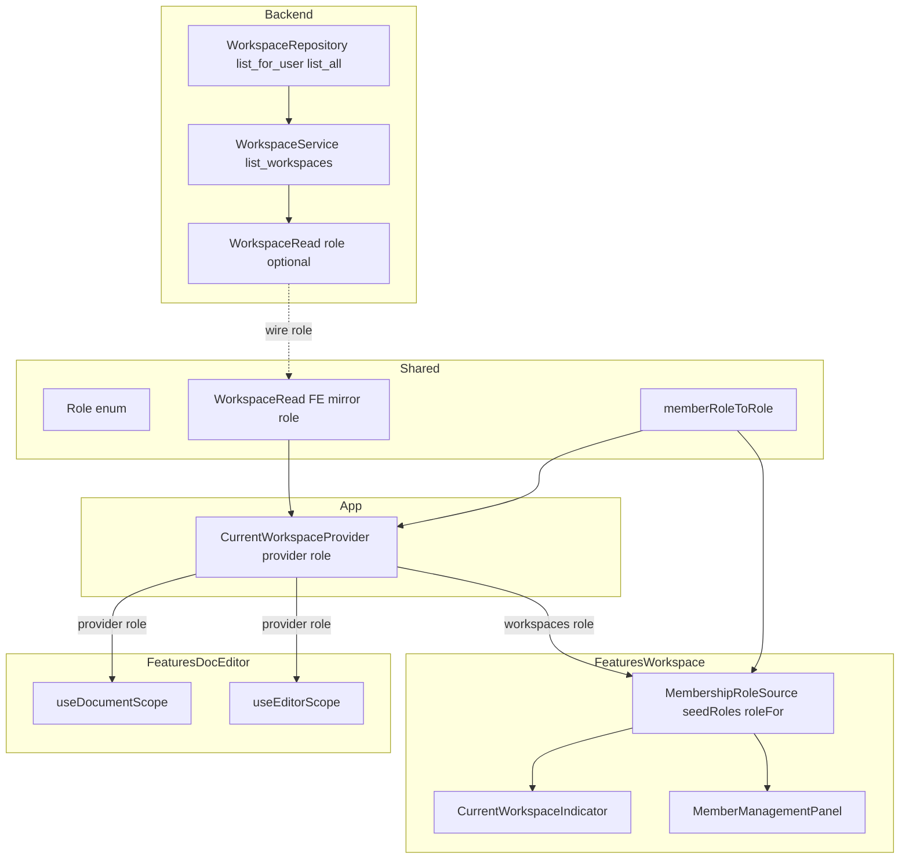
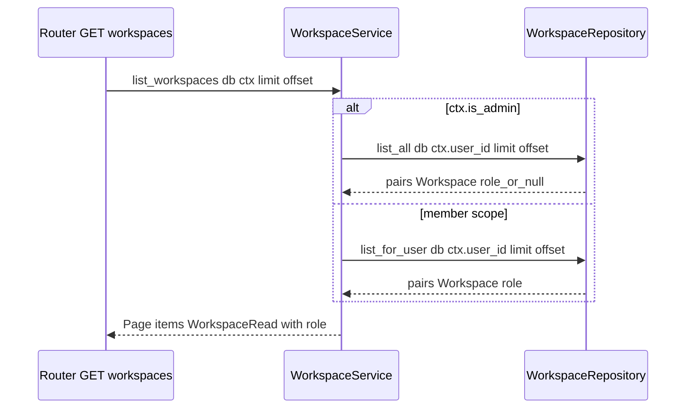
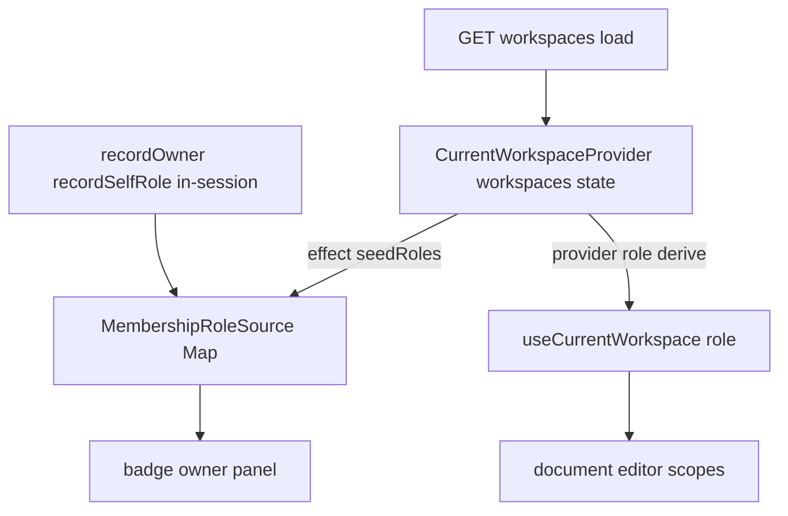

# Technical Design

## Overview

**목적**: 이 기능은 재로그인·새로고침 이후에도 현재 사용자의 워크스페이스별 role(owner/editor/viewer)을
복원해, "역할 미확인"으로 뜨는 헤더 배지 표시 결함과 owner 가 자기 워크스페이스의 멤버 관리 UI 에 접근하지
못하는 기능 잠금을 함께 해소한다.

**사용자**: 일반 사용자(owner/editor/viewer)와 유지보수자. owner 는 새로고침 후에도 멤버 관리에 진입하고,
모든 멤버는 헤더에서 자기 role 을 정확히 확인한다. admin 은 기존 세션 `is_admin` 경로로 계속 통과한다.

**영향**: 현재 role 신호는 프론트 메모리(in-session 축적)에만 best-effort 로 존재해 로드 시점에 재구성할
데이터 경로가 없다. 본 기능은 `GET /workspaces` 응답(`WorkspaceRead`)에 **호출자 관점의 멤버십 role** 을
가산적으로 실어 서버를 권위 있는 role 출처로 만들고, 프론트가 로드 시점에 그 값으로 (1) s16 앰비언트
`useCurrentWorkspace().role` 과 (2) s18 `MembershipRoleSource` 를 시드한다. 이로써 s18~s22 에 반복 기록된
"role=null 상위갭"을 정식으로 해소한다.

### Goals
- `GET /workspaces` 목록 응답의 각 항목에 호출자 멤버십 role 을 별도 요청 없이 가산적으로 노출한다.
- 로드 시점에 응답 role 로 앰비언트 provider-role 과 `MembershipRoleSource` 를 시드해, 새로고침 후에도 배지·
  owner 게이팅이 정확히 동작하게 한다.
- 로드-시드와 기존 in-session 축적(`recordOwner`/`recordSelfRole`)을 모순 없이 공존시키고, role 문자열→등급
  변환을 단일 규칙으로 유지한다.

### Non-Goals
- role 필드에 admin override 를 접합하지 않는다(INV-3). admin 접근은 기존 세션 `is_admin` 경로가 담당한다.
- in-session best-effort 축적(`recordOwner`/`recordSelfRole`)을 제거·대체하지 않는다.
- role 등급 체계(VIEWER<EDITOR<OWNER)·권한 검사 로직·인증/세션/로그인 흐름·문서 단위 권한을 변경하지 않는다.
- role 신호의 실시간 푸시·polling 갱신을 도입하지 않는다(로드/refresh 시점 복원에 한정).
- 새 엔드포인트·새 DB 컬럼·새 마이그레이션을 추가하지 않는다(role 은 기존 `workspace_member.role` 재사용).

## Boundary Commitments

### This Spec Owns
- **백엔드**: `WorkspaceRead.role`(가산 optional 필드)와 `list_workspaces` 경로에서의 호출자 role 조달. role
  값은 오직 호출자의 멤버십 role 에서만 산출한다(admin 상승 미반영).
- **공통 레이어(shared)**: `WorkspaceRead`(FE 미러)의 가산 `role` 필드, role 문자열→`Role` 등급 변환 단일
  함수(`memberRoleToRole`)의 최종 소유 위치.
- **앰비언트 컨텍스트(app)**: `CurrentWorkspaceProvider` 의 provider-role 파생(현재 `null` 하드코딩 대체).
  `CurrentWorkspaceContextValue.role` 의 **형태(`Role | null`)는 s16 소유 그대로 유지**하고 s24 는 값 주입만
  담당한다.
- **멤버십 role 시드(features/workspace)**: `MembershipRoleSource` 의 로드-시드 진입점(`seedRoles`)과 로드-시드
  ⊕ in-session 병합(upsert·서버값 우선) 의미.

### Out of Boundary
- admin override 판정·세션 경로(`RequireRole`/`RequireAdmin`/`hasWorkspaceRole`). role 필드에 admin 상승을
  담지 않는다(INV-3).
- 배지·owner 패널·문서/편집 툴바 등 소비 컴포넌트의 **게이팅 로직 자체**. 이들은 복원된 role 신호를 그대로
  소비하며, 본 기능은 신호를 채울 뿐 비교 로직을 변경하지 않는다.
- in-session 축적 메서드(`recordOwner`/`recordSelfRole`)의 동작·호출 지점(`useWorkspaceActions`/`useMemberActions`).
- create/get/update/change_owner 등 목록 외 `WorkspaceRead` 반환 경로의 role 값(가산 필드 기본 `None` 유지).

### Allowed Dependencies
- 백엔드: s05 `WorkspaceRepository`·`MembershipRepository`·`schemas`, s01 `common`·`models`·`Page`. 다른 feature
  도메인·라우터를 import 하지 않는다.
- shared: s01 `Role`(`shared/auth/roles`) 및 `WorkspaceRole` 문자열 유니온. 상위 레이어(app·features)를 import
  하지 않는다.
- app `CurrentWorkspaceProvider`: `shared`(`memberRoleToRole`·`WorkspaceRead`) 만 소비한다. `features/*` 를
  import 하지 않는다(의존 방향).
- features `MembershipRoleProvider`: app 앰비언트 `CurrentWorkspaceContext`(옵셔널 읽기)·shared
  `memberRoleToRole` 를 소비한다. app→features 역방향 의존을 만들지 않는다.

### Revalidation Triggers
- `WorkspaceRead` 응답 형태 변경(가산 role 추가 자체는 superset 계약이라 무파손이나, **필드 삭제·타입 변경**은
  하위 미러·L2 계약 재검증 트리거).
- `CurrentWorkspaceContextValue` 형태 변경 — 본 기능은 형태를 바꾸지 않고 값만 주입하나, provider-role 이
  `null`→실값으로 바뀌는 것은 이를 소비하는 s19/s20 스코프(`useDocumentScope`/`useEditorScope`)의 **행동
  변화**를 유발하므로 해당 소비처 재검증 트리거.
- `MembershipRoleSource` 인터페이스 확장(`seedRoles` 추가) — 소비자(배지·owner 패널) 재검증 트리거.
- `memberRoleToRole` 소유 위치 이동(features→shared) — import 경로 변경. 기존 경로는 재-export 로 후방 호환
  유지(파손 없음).
- 마운트 순서 규약: `MembershipRoleProvider` 가 `CurrentWorkspaceProvider` **하위**에 마운트된다는 전제.
  이 순서 변경은 시드 중단(옵셔널 읽기 null)을 유발하는 재검증 트리거.

## Architecture

### Existing Architecture Analysis

- **백엔드 목록 경로**: `WorkspaceService.list_workspaces` 가 `ctx.is_admin` 로 `list_all`/`list_for_user` 를
  분기하고, 각 ORM `Workspace` 를 `WorkspaceRead.model_validate(ws)` 로 직렬화한다. role 은 `Workspace` 의
  속성이 아니라 **호출자 상대값**이므로 `model_validate` 만으로 채울 수 없다. `list_for_user` 는 이미
  `workspace_member` 를 조인(member_scope)하고, `MembershipRepository.get_role(ws_id, user_id)` 라는 단건 role
  조회가 존재한다.
- **프론트 role 신호의 2갈래 분기**(핵심 제약):
  - `useCurrentWorkspace().role`(provider-role): 현재 `null` 하드코딩. `useDocumentScope`·`useEditorScope` 가
    이미 통과·소비하며 `DocumentToolbar`/`TrashList`/`EditLockBanner` 게이팅에 주입된다.
  - `MembershipRoleSource.roleFor(wsId)`(in-session Map): `MemberManagementPanel` owner 게이팅과
    `CurrentWorkspaceIndicator` 배지가 소비한다.
  - 요구가 지목한 결함(배지·owner 게이팅)은 **후자**, Req 2.2 가 명시한 값은 **전자**다. 따라서 두 sink 를
    같은 서버 role 로 채우는 하이브리드가 필요하다.
- **의존 방향 제약(structure 스티어링)**: `app/` 는 `features/*` 를 import 하지 않는다. 따라서 provider-role
  파생에 필요한 role 문자열→`Role` 변환 함수(`memberRoleToRole`, 현재 features 소유)를 `shared/` 로 이관해야
  방향 위반 없이 단일 소스를 유지할 수 있다.
- **계약 가드**: L2 `test_workspace_contract_conformance` 는 `WorkspaceRead` 필드를 **superset("field in
  body")** 로 단언하고, workspace/workspace_member DB 컬럼은 exact-set 으로, 마이그레이션은 단일 리비전으로
  단언한다. role 은 가산 응답 필드 + 기존 컬럼 재사용이므로 이 가드를 깨지 않는다.

### Architecture Pattern & Boundary Map

**패턴**: 서버 권위 소스(server-authoritative) + 로드-시드(load-time seeding). 단일 role 기원(`WorkspaceRead.role`)에서
두 프론트 sink 를 파생하되, 각 sink 의 소유 레이어와 소비자를 분리한다.



**아키텍처 통합**:
- **선택 패턴**: 서버 권위 role + 로드-시드. 별도 조회·엔드포인트 없이 목록 응답 확장으로 충족.
- **도메인 경계**: 백엔드는 role 조달·직렬화만, shared 는 타입·번역 단일 소스만, app 은 provider-role 파생만,
  features 는 시드 진입점·병합·소비만 소유한다.
- **보존 패턴**: `MembershipRoleSource` 소비자(배지·owner 패널)는 `roleFor` 소비를 **그대로 유지**하고 재배선
  하지 않는다. 세션 기반 admin override(`RequireRole`)도 무변경.
- **신규 컴포넌트 근거**: 신규 클래스·컴포넌트는 없다. `seedRoles` 메서드 1개, `memberRoleToRole` 위치 이동,
  provider-role 파생식 1개, 리포지토리 반환 형태 확장이 전부다.
- **스티어링 준수**: 의존 방향(shared←app←features, features→app 허용/ app→features 금지), 권한 게이팅 공통
  레이어 단일 소유, role 번역 단일 소스를 모두 준수한다.

### Technology Stack

| Layer | Choice / Version | Role in Feature | Notes |
|-------|------------------|-----------------|-------|
| Frontend | React 19 + TypeScript strict | provider-role 파생, `seedRoles` 시드, 소비 | 신규 의존성 없음 |
| Backend / Services | FastAPI + Pydantic v2 | `WorkspaceRead.role` 가산 필드, role 조달 | `model_validate` + role 주입 |
| Data / Storage | MySQL 8 (SQLAlchemy) | 기존 `workspace_member.role` 조인 재사용 | 새 컬럼·마이그레이션 없음 |

## File Structure Plan

### Modified Files (Backend)
- `backend/app/workspace/schemas.py` — `WorkspaceRead` 에 `role: MemberRole | None = None` 가산 필드 추가.
  기존 필드·상속(`TimestampedRead`) 무변경. optional 기본값으로 목록 외 경로는 role=None 직렬화.
- `backend/app/workspace/repository.py` — `WorkspaceRepository.list_for_user` 반환을 `(Workspace, role)` 튜플
  목록으로 확장(member 조인에 `WorkspaceMember.role` SELECT 추가). `list_all` 시그니처에 호출자 `user_id` 추가,
  호출자 멤버십 LEFT OUTER JOIN 으로 `(Workspace, role|None)` 반환.
- `backend/app/workspace/service.py` — `list_workspaces` 가 `(ws, role)` 를 받아 각 `WorkspaceRead` 에 role 을
  주입해 매핑. `list_all` 호출에 `ctx.user_id` 전달. admin 여부로 role 을 상승시키지 않는다(INV-3).

### Modified Files (Frontend)
- `frontend/src/shared/types/workspace.ts` — `WorkspaceRole = "owner"|"editor"|"viewer"` 문자열 유니온 추가,
  `WorkspaceRead` 에 `role?: WorkspaceRole | null` 가산 미러.
- `frontend/src/shared/auth/roles.ts` — `memberRoleToRole(role: WorkspaceRole): Role` 를 이 위치로 **이관**
  (번역 단일 소스의 최종 소유). `Role` enum 과 co-locate.
- `frontend/src/app/workspace-context/CurrentWorkspaceProvider.tsx` — `value.role` 을 `null` 하드코딩에서
  `currentWorkspace?.role ? memberRoleToRole(currentWorkspace.role) : null` 파생으로 대체. `shared` 만 import.
- `frontend/src/features/workspace/context/membershipRoleSource.tsx` — (1) `MembershipRoleSource` 에
  `seedRoles(entries)` 추가, (2) `MembershipRoleProvider` 가 옵셔널 `CurrentWorkspaceContext` 를 읽어 로드된
  `workspaces[].role` 을 effect 로 시드, (3) `memberRoleToRole` 를 `shared/auth/roles` 재-export 로 전환
  (기존 import 경로 후방 호환).
- `frontend/src/features/workspace/hooks/useMemberActions.ts` — `memberRoleToRole` import 를 재-export 또는
  shared 경로로 정렬(동작 무변경, 단일 소스 준수).

### New Files
- 없음. 본 기능은 기존 파일의 가산 확장으로 충족한다(신규 컴포넌트·엔드포인트·마이그레이션 없음).

## System Flows

### 목록 role 조달 (Backend)



- admin `list_all` 은 호출자 `user_id` 로 `WorkspaceMember` LEFT OUTER JOIN 한다: 멤버인 WS 는 실제 멤버십
  role, 비멤버 WS 는 `None`(Req 1.3). 이 조인은 admin 여부로 role 을 올리지 않으므로 1.2·1.3 을 동시에 만족.
- 비-admin `list_for_user` 는 member_scope inner 조인이라 모든 항목이 멤버십 role 을 가진다.

### 로드-시드 ⊕ in-session 병합 (Frontend)



- **병합 의미(Req 5)**: `seedRoles` 는 `Map` upsert 다 — 목록에 있는 WS 항목은 서버값으로 **덮어쓰고**(5.2
  서버 권위 우선), 목록에 없는 WS 항목(예: 방금 생성돼 목록 재조회 이전)은 in-session 기록을 **보존**한다(5.3).
  이로써 단일 `Map` 이 WS 당 단일 role 값만 노출한다(5.2 모순 동시 노출 금지).
- **role=null 항목**: 로드된 항목의 role 이 null(비멤버·admin 전체 조회)이면 시드하지 않아 해당 WS 신호를
  null 로 유지한다(2.4·3.3). provider-role 도 동일하게 null 파생.
- **경합 안전**: 시드 effect 는 provider 의 **커밋된** `workspaces` 상태(runId latest-wins 해석 이후)에
  반응하므로, stale 응답이 최신 in-session 기록을 덮어쓰지 않는다.

## Requirements Traceability

| Requirement | Summary | Components | Interfaces | Flows |
|-------------|---------|------------|------------|-------|
| 1.1 | 목록 각 항목에 호출자 role 포함 | WorkspaceService, WorkspaceRepository, WorkspaceRead | list_workspaces, list_for_user/list_all | 목록 role 조달 |
| 1.2 | role=멤버십 role 만, admin 상승 미반영 | WorkspaceService | list_all LEFT JOIN(호출자 멤버십) | 목록 role 조달 |
| 1.3 | 비멤버 항목 role null | WorkspaceRepository | list_all outerjoin → None | 목록 role 조달 |
| 1.4 | 단일 목록 응답 안에서 제공(추가 요청 없음) | WorkspaceRepository | 조인 SELECT(role 컬럼) | 목록 role 조달 |
| 1.5 | 기존 필드 무변경 + 가산만 | WorkspaceRead(schemas) | `role: MemberRole \| None = None` | — |
| 2.1 | 로드 시 role 신호 시드 | CurrentWorkspaceProvider, MembershipRoleProvider | provider-role 파생, seedRoles | 로드-시드 ⊕ in-session |
| 2.2 | 복원 시 provider-role 비-null 제공 | CurrentWorkspaceProvider | `value.role = memberRoleToRole(...)` | 로드-시드 |
| 2.3 | WS 전환 시 role 반영 | CurrentWorkspaceProvider | selectWorkspace → role 재파생 | 로드-시드 |
| 2.4 | role 부재 항목 null 유지 | CurrentWorkspaceProvider, seedRoles | null 파생·미시드 | 로드-시드 |
| 2.5 | 문자열→등급 변환 단일 규칙 | shared memberRoleToRole | `memberRoleToRole` | — |
| 3.1 | 배지에 복원 role 표시 | CurrentWorkspaceIndicator(무변경) | roleFor 소비(시드됨) | 로드-시드 |
| 3.2 | in-session 없어도 복원 role 표시 | MembershipRoleProvider(시드) | seedRoles | 로드-시드 |
| 3.3 | 신호 없으면 "역할 미확인" | CurrentWorkspaceIndicator(무변경) | roleFor → null | 로드-시드 |
| 4.1 | owner role 복원 시 멤버 관리 허용 | MemberManagementPanel(무변경) | RequireRole currentRole=roleFor | 로드-시드 |
| 4.2 | in-session 없어도 복원 role 로 허용 | MembershipRoleProvider(시드) | seedRoles | 로드-시드 |
| 4.3 | editor/viewer 차단 | RequireRole(무변경) | currentRole 위계 비교 | — |
| 4.4 | admin 은 세션 경로, role 에 admin 미접합 | RequireRole/세션(무변경) | is_admin bypass | — |
| 5.1 | in-session 축적 동작 유지 | MembershipRoleProvider | recordOwner/recordSelfRole(무변경) | 로드-시드 ⊕ in-session |
| 5.2 | 로드-시드 우선·단일 값 노출 | seedRoles | Map upsert(덮어쓰기) | 병합 의미 |
| 5.3 | 미시드 WS 는 in-session 유지 | seedRoles | Map upsert(비목록 보존) | 병합 의미 |
| 5.4 | role 신호에 admin override 미접합 | seedRoles/provider-role | 멤버십 role 만 시드 | — |

## Components and Interfaces

| Component | Domain/Layer | Intent | Req Coverage | Key Dependencies (P0/P1) | Contracts |
|-----------|--------------|--------|--------------|--------------------------|-----------|
| WorkspaceRead | Backend/Schema | role 가산 응답 필드 | 1.1, 1.5 | s01 TimestampedRead(P0) | API/State |
| WorkspaceRepository | Backend/Data | 호출자 role 조달(조인) | 1.1, 1.3, 1.4 | s01 models(P0) | Service |
| WorkspaceService | Backend/Service | role 주입·admin 상승 금지 | 1.1, 1.2 | WorkspaceRepository(P0) | Service |
| memberRoleToRole | shared/auth | 문자열→Role 단일 번역 | 2.5 | Role enum(P0) | Service |
| CurrentWorkspaceProvider | app/context | provider-role 파생 | 2.1–2.4 | shared memberRoleToRole(P0), WorkspaceRead(P0) | State |
| MembershipRoleSource | features/workspace | seedRoles·병합·roleFor | 2.1, 3.x, 4.x, 5.x | app CurrentWorkspaceContext(P0), memberRoleToRole(P0) | State |
| CurrentWorkspaceIndicator | features/workspace/UI | 배지 표시(무변경) | 3.1, 3.3 | MembershipRoleSource(P1) | — |
| MemberManagementPanel | features/workspace/UI | owner 게이팅(무변경) | 4.1, 4.3 | MembershipRoleSource(P0), RequireRole(P0) | — |

### Backend

#### WorkspaceRead (schema)

| Field | Detail |
|-------|--------|
| Intent | 워크스페이스 응답에 호출자 role 을 가산적으로 노출 |
| Requirements | 1.1, 1.5 |

**Responsibilities & Constraints**
- `role: MemberRole | None = None` 가산 필드. 기존 필드(id·name·is_shareable·trash_retention_days·타임스탬프)와
  `TimestampedRead` 상속 무변경(1.5).
- optional 기본값으로 `model_validate(workspace)`(ORM 에 role 속성 없음)에서도 검증 통과(role→None). 목록
  경로만 role 을 명시 주입하며, create/get/update/change_owner 는 role=None 을 유지한다(경계).

**Contracts**: API [x] / State [x]

##### API Contract
| Method | Endpoint | Response | Notes |
|--------|----------|----------|-------|
| GET | /workspaces | Page[WorkspaceRead] (각 item `role` 포함) | role=호출자 멤버십 role, 비멤버 null |

#### WorkspaceRepository (data)

**Responsibilities & Constraints**
- `list_for_user(db, user_id, limit, offset) -> list[tuple[Workspace, str]]`: 기존 member_scope 조인에
  `WorkspaceMember.role` 을 함께 SELECT 한다. inner 조인이므로 모든 항목이 멤버십 role 을 가진다(1.1).
  `total`·정렬(`Workspace.id` 오름차순)·limit/offset 의미는 무변경.
- `list_all(db, user_id, limit, offset) -> list[tuple[Workspace, str | None]]`: 호출자 `user_id` 로
  `WorkspaceMember` LEFT OUTER JOIN(상관: `workspace_id == Workspace.id AND user_id == 호출자`)해 멤버인 WS 는
  role, 비멤버 WS 는 `None` 을 반환한다(1.3). admin 여부로 role 을 상승시키지 않는다(1.2).

**Contracts**: Service [x]

##### Service Interface
```python
class WorkspaceRepository:
    def list_for_user(
        self, db: Session, user_id: int, limit: int, offset: int
    ) -> tuple[list[tuple[Workspace, str]], int]: ...
    def list_all(
        self, db: Session, user_id: int, limit: int, offset: int
    ) -> tuple[list[tuple[Workspace, str | None]], int]: ...
```
- Preconditions: `db` 는 유효 세션, `user_id` 는 호출자 식별자.
- Postconditions: items 는 `(Workspace, role)` 튜플, `total` 은 limit/offset 이전 스코프 전체 개수(무변경).
- Invariants: role 은 오직 `workspace_member.role` 원시 문자열. 계층 비교·admin bypass 판정 없음.

**Implementation Notes**
- Integration: `list_workspaces` 가 유일 호출자. 튜플 반환 전환은 s05 내부 계약 변경으로 국소적.
- Validation: LEFT JOIN 상관 조건에 `WorkspaceMember.user_id == 호출자` 를 반드시 포함(누락 시 임의 멤버십이
  섞여 role 오산).
- Risks: N+1 회피를 위해 단일 조인 쿼리를 사용한다(1.4). `get_role` 반복 호출(후조회) 방식은 채택하지 않는다.

#### WorkspaceService (service)

**Responsibilities & Constraints**
- `list_workspaces` 가 `(ws, role)` 목록을 받아 각 `WorkspaceRead.model_validate(ws)` 결과에 role 을 주입한다
  (예: `.model_copy(update={"role": role})`). `list_all` 호출에 `ctx.user_id` 를 전달한다.
- admin 이어도 role 필드에 상승을 반영하지 않는다(1.2, INV-3). role 은 리포지토리가 산출한 멤버십 role(또는
  None)을 그대로 싣는다.

**Contracts**: Service [x]

### Shared

#### memberRoleToRole (translation)

**Responsibilities & Constraints**
- role 문자열(`WorkspaceRole`) → s01 `Role` enum 변환의 **단일 소스**(2.5). `shared/auth/roles.ts` 로 이관해
  app·features 양측이 방향 위반 없이 소비한다.
- 기존 `features/workspace/context/membershipRoleSource` 의 `memberRoleToRole` export 는 shared 재-export 로
  전환해 후방 호환(useMemberActions·기존 테스트 import 무파손).

**Contracts**: Service [x]

##### Service Interface
```typescript
export type WorkspaceRole = "owner" | "editor" | "viewer";
export function memberRoleToRole(role: WorkspaceRole): Role;
```

### App

#### CurrentWorkspaceProvider (provider-role 파생)

**Responsibilities & Constraints**
- `value.role` 을 `null` 하드코딩에서 `currentWorkspace?.role ? memberRoleToRole(currentWorkspace.role) : null`
  파생으로 대체한다(2.2·2.4). WS 전환(`selectWorkspace`) 시 새 `currentWorkspace` 로 role 이 재파생된다(2.3).
- `CurrentWorkspaceContextValue.role` 의 **형태(`Role | null`)는 변경하지 않는다**(s16 소유). `shared` 만
  import 해 의존 방향을 지킨다.

**Contracts**: State [x]

**Implementation Notes**
- Integration: `useMemo` 의존성에 `currentWorkspace` 가 이미 포함되어 있어 파생식 교체만으로 반응. 소비처
  (`useDocumentScope`/`useEditorScope`)는 무변경으로 값을 통과받는다(파급 복원).
- Risks: provider-role 이 `null`→실값으로 바뀌며 `DocumentToolbar`/`TrashList`/`EditLockBanner` 게이팅이
  비-admin editor/owner 에게 **의도대로** 노출되기 시작한다(기존 "role=null 상위갭"의 정식 해소). 소비처
  게이팅 로직은 무변경이며 회귀 테스트로 확인한다.

### Features / Workspace

#### MembershipRoleSource (seedRoles + 시드)

**Responsibilities & Constraints**
- 인터페이스에 `seedRoles(entries: Iterable<readonly [number, Role]>): void` 추가. `Map` upsert 로 목록 항목은
  덮어쓰고 비목록 항목은 보존한다(5.2·5.3). role 파생·번역은 shared `memberRoleToRole` 단일 소스만 사용.
- `MembershipRoleProvider` 가 **옵셔널** `CurrentWorkspaceContext`(`useContext`, provider 밖이면 null)를 읽어
  로드된 `workspaces` 를 `effect` 로 시드한다: role 이 있는 항목만 `[id, memberRoleToRole(role)]` 로 변환해
  `seedRoles` 호출(role=null 항목은 미시드, 2.4). 컨텍스트가 null 인 standalone 마운트(단위 테스트)에서는
  시드하지 않아 기존 in-session 전용 동작을 보존한다.
- `recordOwner`/`recordSelfRole` 동작·시그니처는 무변경(5.1). 시드는 이들을 대체하지 않고 보강한다.

**Contracts**: State [x]

##### State Management
- State model: `Map<number, Role>` 단일 상태. 시드·record 모두 `new Map(prev)` 불변 갱신으로 재렌더 보장.
- Persistence & consistency: 서버 권위 값(시드)이 로드마다 목록 항목을 덮어쓴다(5.2). in-session 기록은 다음
  로드까지 유효하며, 목록에 없는 WS 는 계속 보존된다(5.3).
- Concurrency strategy: 시드 effect 는 provider 의 커밋된 `workspaces` 참조 변화에만 반응(로드마다 새 배열)해
  멱등하게 재시드한다. 동일 로드 내 무한 루프 없음(로컬 상태 변경은 부모 `workspaces` 를 바꾸지 않음).

**Implementation Notes**
- Integration: `MembershipRoleProvider` 는 main.tsx 에서 `CurrentWorkspaceProvider` **하위**·라우터 상위에
  마운트(기존 조립 무변경). features→app 옵셔널 읽기는 `CurrentWorkspaceIndicator` 가 이미 쓰는 idiom.
- Validation: 시드 대상은 role≠null 항목만. admin override 는 시드에 접합하지 않는다(5.4).
- Risks: 마운트 순서 역전 시 옵셔널 읽기 null → 시드 중단(배지·owner 게이팅이 새로고침 후 미복원). 조립
  테스트로 순서를 못박는다.

## Data Models

- **DB 변경 없음**: role 은 기존 `workspace_member.role`(ENUM owner/editor/viewer, s01 소유) 컬럼을 조인으로
  재사용한다. 새 컬럼·테이블·마이그레이션을 추가하지 않는다(L2 exact-set 컬럼 가드·단일 리비전 가드 무영향).
- **API 데이터 전송**: `WorkspaceRead` 에 `role`(optional) 가산. 목록 응답 각 item 이 role 을 포함하며 다른
  기존 필드는 무변경(superset). FE 미러(`shared/types/workspace.ts`)도 `role?: WorkspaceRole | null` 로 정렬.

## Error Handling

- 본 기능은 새 오류 경로를 도입하지 않는다. 목록 조회 실패(네트워크·401)는 기존 경로가 담당한다:
  `CurrentWorkspaceProvider` 는 로드 실패 시 `empty` 로 수렴(role 신호는 자연히 부재→null), 전역 401 은
  apiClient 인터셉터가 처리한다.
- role 부재는 오류가 아니라 정상 상태다: 배지는 "역할 미확인"(3.3), owner 게이팅은 미허용(fallback null),
  provider-role 은 null. admin 은 세션 경로로 별도 통과(4.4).

## Testing Strategy

### Unit Tests
- `WorkspaceRepository.list_for_user`: 호출자별로 각 항목이 실제 멤버십 role(owner/editor/viewer)을 반환(1.1).
- `WorkspaceRepository.list_all`: admin 이 멤버인 WS 는 해당 role, 비멤버 WS 는 None 을 반환하고 admin 상승이
  없음(1.2·1.3).
- `memberRoleToRole`(shared): "owner"/"editor"/"viewer" → `Role.OWNER`/`EDITOR`/`VIEWER`(2.5). features 재-export
  경로가 동일 함수를 가리킴.
- `seedRoles` upsert: 목록 role 로 기존 in-session 값 덮어쓰기(5.2), 목록에 없는 WS 의 recordOwner 값 보존
  (5.3), role=null 미시드(2.4).
- `CurrentWorkspaceProvider`: `currentWorkspace.role` → provider-role 파생(2.2), role 부재/미선택 시 null(2.4),
  `selectWorkspace` 전환 시 재파생(2.3).

### Integration Tests
- `GET /workspaces`(비-admin): 응답 각 item 에 role 존재 + 기존 필드 무변경(superset), 단일 응답으로 제공(1.1·
  1.4·1.5). L2 계약 스위트 유지 통과.
- `GET /workspaces`(admin): 멤버 WS role + 비멤버 WS role 미포함/null(1.2·1.3).
- `MembershipRoleProvider` + `CurrentWorkspaceProvider` 조립: 로드 후 `roleFor(id)` 가 시드 role 반환(3.2·4.2),
  role=null 항목은 null 유지(3.3), recordOwner 후 목록 재조회로 덮어써도 값 일관(5.1·5.2).
- 배지 회귀: in-session 이력 없이 새로고침 시 배지가 실제 role 표시(3.1), 신호 없으면 "역할 미확인"(3.3).
- owner 패널 회귀: in-session 없이 owner role 복원만으로 멤버 관리 노출(4.1·4.2), editor/viewer 차단(4.3).

### E2E/UI Tests (critical paths)
- **owner 새로고침**: 헤더 배지=owner + 멤버 관리 UI 접근 가능(3.1·4.1).
- **editor 새로고침**: 문서 툴바(생성·이름변경·삭제) 노출 + 멤버 관리 은닉(파급 복원 + 4.3).
- **viewer 새로고침**: 읽기 전용, 툴바·멤버 관리 미노출, 배지=viewer(3.1·4.3).
- **admin**: 세션 경로로 관리/툴바 통과, role 필드에는 멤버십 role 만(admin 상승 없음)(1.2·4.4·5.4).

## Security Considerations

- **INV-3 (admin override 미접합)**: role 필드·시드·provider-role 은 오직 멤버십 role 만 담는다. admin 접근은
  기존 세션 `is_admin` 경로(`RequireRole`/`RequireAdmin`/`hasWorkspaceRole`)가 별도로 통과시키며, 서버
  `list_workspaces`/`list_all` 은 admin 여부로 role 을 상승시키지 않는다(1.2·5.4).
- **클라이언트 게이팅은 보안 경계가 아님**: provider-role·roleFor 복원은 UI 노출 판정용이며, 서버 권한 검사
  (라우터 `require_ws_role`/`require_admin`)는 무변경으로 최종 방어선을 유지한다. 복원된 role 이 부정확해도
  서버가 403 으로 차단한다.
