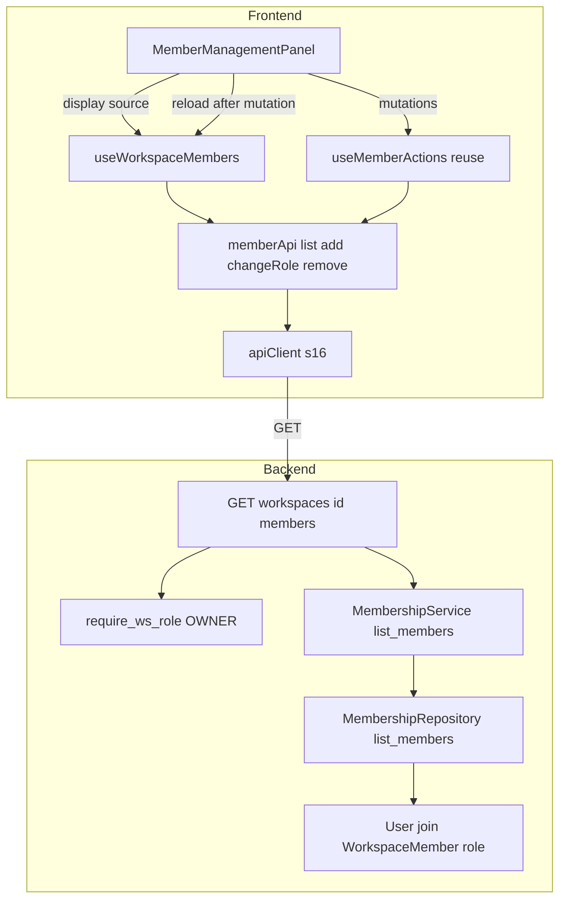
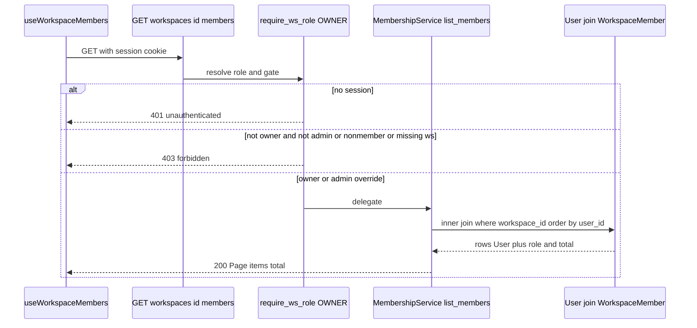
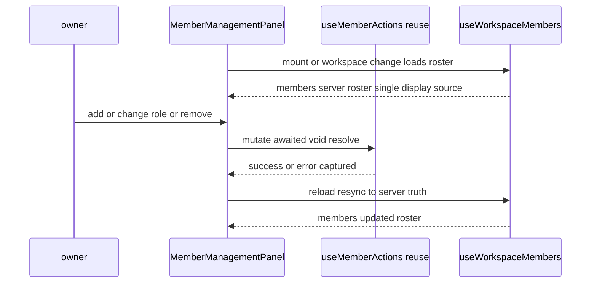

# 기술 설계 문서 — s25-member-roster

## Overview

이 기능은 워크스페이스 owner(및 admin override)가 자신이 소유한 워크스페이스의 **현재 멤버 로스터**(이미 멤버인 사용자 전체)를 서버에서 권위 있게 열거하도록 한다. 계약 공백 **S1**(멤버 목록 조회 GET 부재)을 정식 해소하며, 백엔드에 owner 게이팅·admin override·anti-enumeration을 갖춘 조회 엔드포인트를 추가하고, 프론트에서 마운트/재로그인 시 서버 로스터로 멤버 목록을 시드해 표시한다.

**Users**: 워크스페이스 owner(및 admin)가 멤버 관리 화면에서 재로그인 이후에도 기존 멤버를 빠짐없이 확인·관리한다.

**Impact**: 현재 `MemberManagementPanel`은 이번 세션의 뮤테이션으로 확인된 멤버(`useMemberActions().members`)만 표시하므로 새 세션에서 비어 있다. 이 설계는 표시원을 **서버 로스터**로 전환해 재로그인 이후에도 전체 멤버가 보이게 하고, 이름 캡처 우회(`nameById`)를 제거한다.

### Goals

- owner 게이팅·admin override·anti-enumeration·narrow 노출을 갖춘 `GET /workspaces/{id}/members` 조회 엔드포인트를 s23 assignable 패턴의 확장으로 추가한다.
- 비활성·삭제 상태 멤버까지 포함한 워크스페이스 전체 멤버십을 `user_id`·이름·이메일·`role`로 결정적 순서로 노출한다.
- 프론트에서 서버 로스터를 **유일 표시원**으로 삼아 마운트/재로그인/워크스페이스 변경 시 시드하고, 세션 뮤테이션을 reload로 단일 소스에 반영한다.

### Non-Goals

- 멤버 뮤테이션(추가/역할변경/제거)의 백엔드·프론트 동작 — s05·s18 소유를 재사용만 한다. 이 spec은 뮤테이션 로직을 재구현하지 않는다.
- 사용자 계정 생명주기(등록·비활성·삭제·재활성, s03), assignable-users 조회(s23) — 소유 밖.
- 서버 측 페이지네이션 루프/무한 스크롤 — `Page{items,total}`(첫 페이지 limit=50 + total)만 노출하고 다중 페이지 순회는 미래 확장 여지로 남긴다(현재 폐쇄형 환경 멤버 규모 가정).

## Boundary Commitments

### This Spec Owns

- **백엔드**: `GET /workspaces/{id}/members` 라우트, `MembershipRepository.list_members`(소프트삭제 미필터 inner-join + count), `MemberRosterRead` narrow 읽기 모델, `MembershipService.list_members`.
- **프론트**: `memberApi.list` 어댑터, `useWorkspaceMembers` 로드 훅, `MemberManagementPanel`의 표시원을 서버 로스터로 전환(단일 소스화·`nameById` 제거), 프론트 미러 타입 `MemberRosterRow`.

### Out of Boundary

- 멤버 뮤테이션 동작: `useMemberActions`·`memberApi.add/changeRole/remove`·백엔드 멤버 CRUD(add/change_role/remove) — s05·s18 소유. 재사용만 하고 표시원만 이동한다.
- 접근 통제 판정: `require_ws_role`·`WorkspaceRoleResolver.has_at_least`(위계 비교·admin bypass·403) — s01·s05 소유. 게이트 부착만 하고 판정을 재구현하지 않는다.
- self-role 에코: `MembershipRoleSource.recordSelfRole` — s18 소유. 로스터 조회는 role 소스를 시드하지 않는다.
- assignable-users 조회(`useAssignableUsers`·`list_assignable_users`) — s23 소유. 형태만 미러한다.

### Allowed Dependencies

- **백엔드**: s01 `app.common.auth`(AuthContext)·`app.schemas.base`(Page)·`app.models`(User·WorkspaceMember), s05 `app.workspace.dependencies`(require_ws_role·Role)·`schemas`(MemberRole)·`repository`·`service`. 신규 모듈·마이그레이션 없음(기존 `router.py`/`repository.py`/`service.py`/`schemas.py`에 추가).
- **프론트**: s16 `apiClient`·`Page<T>`·`ApiError`·`RequireRole`·`Role`, s18 `MembershipRoleSource`·`useMemberActions`·`useAssignableUsers`·`memberApi`·`./types`. feature 간 직접 import 금지(공통 레이어만 소비).

### Revalidation Triggers

- `MemberRosterRead` 필드 형태 변경(추가/제거/타입/`user_id`↔`id` 키 변경) → 프론트 `MemberRosterRow` 미러·패널 표시 재검증.
- `GET /workspaces/{id}/members` 경로·게이트·응답 봉투 변경 → 어댑터·로드 훅·통합 테스트 재검증.
- `useMemberActions` 뮤테이션 계약(반환·에러 삼킴·void resolve) 변경 → 패널의 reload-after-mutation 결선 재검증.
- s05 게이트(`require_ws_role`)·resolver admin override 동작 변경 → 게이팅 매트릭스 통합 테스트 재검증.

## Architecture

### Existing Architecture Analysis

- **레이어드 백엔드**: `router`(HTTP 결선·게이트 부착) → `service`(도메인 판정) → `repository`(데이터 접근) → s01 `models`. 세션은 메서드별 인자, 저장소는 생성자 주입. `MembershipService`는 이미 `list_assignable_users`를 보유하며 동일 위치에 `list_members`를 추가한다.
- **게이트 선행 anti-enumeration**: `require_ws_role(OWNER)`가 존재검사보다 먼저 실행되어 비-멤버·미존재 WS를 게이트 단계에서 403으로 통일한다(별도 존재검사 금지 → 404로 존재 노출 안 함).
- **narrow 직렬화 관례**: `ORMReadModel`/`BaseModel`은 선언 필드만 직렬화하므로 계정 필드 누출을 스키마 형태로 원천 차단한다.
- **프론트 교차 관심사 단일 소유**: `apiClient`(전역 401·baseURL·credentials), `RequireRole`/`MembershipRoleSource`(owner 게이팅). feature 어댑터는 얇은 타입 래퍼, 로드 훅은 `useAssignableUsers` 형태를 표준으로 삼는다.

### 결정적 divergence — 로스터는 assignable의 반대 필터

s23 assignable은 "배정 **가능**"(비-멤버·활성·비삭제·비-admin)을 배제형 필터로 조회한다. 로스터는 **정반대**로 "워크스페이스 소속 전량"을 소프트삭제 필터 없이 조회해야 한다(Req 1.5). 템플릿을 무비판 복사하면 이 기능의 존재 이유(기존 멤버 전량 노출)를 스스로 깬다. → `list_members`는 **소프트삭제 필터를 적용하지 않는** inner-join이며, INV-4(물리삭제 없음)로 멤버십↔user FK dangling이 없어 inner-join이 안전하다.

### Architecture Pattern & Boundary Map



**Architecture Integration**:
- 선택 패턴: 기존 workspace feature 내 **확장**(Option A). 신규 라우터 파일·마이그레이션 없음.
- 경계 분리: 조회(이 spec) ↔ 뮤테이션(s18 `useMemberActions`)은 별도 훅으로 분리하되, 패널은 **서버 로스터만 표시**하고 뮤테이션 후 `reload()`로 단일 소스에 반영한다(Req 4.2 "두 목록 분리 금지").
- 보존 패턴: owner 게이트·narrow 봉투·Page·결정적 순서·null-guard 로드 훅.
- 신규 근거: `MemberRosterRead`(assignable/MemberRead 둘 다 부적합), `list_members`(기존 조인은 user→workspace 방향), `useWorkspaceMembers`(로스터 전용 표시원).

### Dependency Direction

- 백엔드: `models` → `schemas` → `repository` → `service` → `router`. 상위 import 금지(router만 service·schemas 소비).
- 프론트: `types` → `api(memberApi.list)` → `hooks(useWorkspaceMembers)` → `components(MemberManagementPanel)`. feature는 공통 레이어만 소비, 다른 feature 직접 import 금지.

### Technology Stack

| Layer | Choice / Version | Role in Feature | Notes |
|-------|------------------|-----------------|-------|
| Frontend | React 19 + TypeScript strict | 로드 훅·표시원 전환 | 신규 의존성 없음, `useAssignableUsers` 미러 |
| Backend | FastAPI + SQLAlchemy(Python 3.13) | 조회 라우트·서비스·리포지토리 | 신규 의존성·마이그레이션 없음 |
| Data | MySQL 8 (`user`⋈`workspace_member`) | inner-join 프로젝션 | 소프트삭제 필터 미적용 |

## File Structure Plan

### Modified Files — Backend

- `backend/app/workspace/schemas.py` — `MemberRosterRead`(BaseModel: user_id·name·email·role) 추가 및 `__all__` 등록.
- `backend/app/workspace/repository.py` — `MembershipRepository.list_members(db, workspace_id, limit, offset)` 추가(소프트삭제 미필터 inner-join items + workspace_id 소속 count).
- `backend/app/workspace/service.py` — `MembershipService.list_members(db, workspace_id, limit, offset) -> Page[MemberRosterRead]` 추가(행별 role 명시 주입) 및 `MemberRosterRead` import.
- `backend/app/workspace/router.py` — `GET /workspaces/{id}/members`(`response_model=Page[MemberRosterRead]`, `Depends(require_ws_role(Role.OWNER))`) 추가 및 `MemberRosterRead` import.

### Modified Files — Frontend

- `frontend/src/features/workspace/api/types.ts` — `MemberRosterRow` 인터페이스(user_id·name·email·role) 추가.
- `frontend/src/features/workspace/api/memberApi.ts` — `list(id, {limit?, offset?}): Promise<Page<MemberRosterRow>>` 추가(GET `/workspaces/{id}/members`, `assignableUserApi.listAssignable` query 조립 미러).
- `frontend/src/features/workspace/hooks/useWorkspaceMembers.ts` **(신규)** — `useAssignableUsers` 미러 로드 훅(items→`members`, 타입 `MemberRosterRow`).
- `frontend/src/features/workspace/components/MemberManagementPanel.tsx` — 표시원을 `useWorkspaceMembers`로 전환. `nameById` 제거, 라벨은 로스터 `name` 사용. 뮤테이션 후 로스터(및 add/remove 시 assignable) `reload()`. `useMemberActions().members`를 표시에 사용하지 않음.

### New Test Files

- `backend/tests/workspace/test_member_roster_integration.py` — 게이팅 매트릭스 + 로스터 divergence(비활성·삭제·owner 포함, narrow 4-필드, pagination, 결정적 순서).
- `backend/tests/workspace/test_membership_repository.py`·`test_membership_service.py`·`test_schemas.py` — 기존 파일에 `list_members`·`MemberRosterRead` 케이스 추가.
- `frontend/src/features/workspace/hooks/useWorkspaceMembers.test.ts` **(신규)**, `MemberManagementPanel.test.tsx`(재로그인 시드·단일 소스·reload 케이스 추가), `memberApi.test.ts`(list 케이스 추가).

## System Flows

### 로스터 조회 게이팅 (조회 흐름)



미존재 WS는 게이트 단계에서 비-멤버 → 403(404로 존재 노출 안 함, anti-enumeration). admin은 owner 여부와 무관하게 override로 200(INV-3).

### 단일 소스 표시 + 뮤테이션 재동기화



표시원은 항상 `useWorkspaceMembers.members`(서버 로스터). 뮤테이션은 `useMemberActions`가 수행하되 결과는 로스터 reload로 반영한다 — 로컬 델타를 표시에 병합하지 않아 "두 목록 분리"(Req 4.2)를 원천 차단한다. reload는 서버가 add(중복 없음)·remove(제외)·role 변경을 권위 있게 반영하므로 Req 4.1을 자명하게 충족한다.

## Requirements Traceability

| Requirement | Summary | Components | Interfaces | Flows |
|-------------|---------|------------|------------|-------|
| 1.1 | owner 멤버 집합 반환 | Router·Service·Repo | `GET /workspaces/{id}/members` | 조회 |
| 1.2 | user_id·이름·이메일·role(이메일 null 허용) | MemberRosterRead·Service | `MemberRosterRead` | 조회 |
| 1.3 | owner 자신 포함 전체 멤버십 | Repo(inner-join, 제외 없음) | `list_members` | 조회 |
| 1.4 | 페이지 초과 시 전체 노출 + 개수 | Service·Repo | `Page{items,total}` | 조회 |
| 1.5 | 비활성·삭제 멤버도 role과 포함 | Repo(소프트삭제 미필터) | `list_members` | 조회 |
| 1.6 | 결정적·안정 순서 | Repo(`order_by(User.id)`) | `list_members` | 조회 |
| 2.1 | 무세션 → 401 | Gate(get_current_user) | require_ws_role | 조회 |
| 2.2 | editor/viewer → 403 | Gate(OWNER) | require_ws_role | 조회 |
| 2.3 | 비-멤버 → 403 | Gate(resolve→None) | require_ws_role | 조회 |
| 2.4 | 미존재 WS → 403(404 금지) | Gate 선행(존재검사 없음) | require_ws_role | 조회 |
| 2.5 | admin override 허용(INV-3) | Resolver has_at_least | require_ws_role | 조회 |
| 2.6 | 민감 필드 비노출 | MemberRosterRead(선언 4필드) | `MemberRosterRead` | 조회 |
| 3.1 | 마운트/WS 변경 시 조회 | useWorkspaceMembers | `[workspaceId]` effect | 표시 |
| 3.2 | 재로그인 새 세션 서버 시드 | useWorkspaceMembers·Panel | 마운트 fetch | 표시 |
| 3.3 | 로딩 상태 | useWorkspaceMembers | `status:"loading"` | 표시 |
| 3.4 | 실패 오류 상태 | useWorkspaceMembers | `status:"error"` | 표시 |
| 3.5 | 성공·빈 로스터 → 빈 상태 | Panel | `members:[]`,`total:0` | 표시 |
| 3.6 | WS 미선택 시 조회 안 함·안정 비로딩 | useWorkspaceMembers(null 가드) | `status:"ready"` | 표시 |
| 3.7 | 이름=서버 값, 캡처 우회 미의존 | Panel(`nameById` 제거) | `MemberRosterRow.name` | 표시 |
| 4.1 | 세션 뮤테이션 로스터에 일관 반영 | Panel(reload-after-mutation) | `reload()` | 재동기화 |
| 4.2 | 단일 목록 통합(분리 금지) | Panel(표시원=로스터 단일) | `members` | 재동기화 |
| 4.3 | 재로드 시 서버 현재상태 재동기화 | useWorkspaceMembers | `reload()` | 재동기화 |

## Components and Interfaces

| Component | Domain/Layer | Intent | Req Coverage | Key Dependencies | Contracts |
|-----------|--------------|--------|--------------|------------------|-----------|
| MembershipRepository.list_members | BE/Data | 소속 전량 inner-join items+count | 1.1,1.3,1.5,1.6 | models User·WorkspaceMember (P0) | Service(method) |
| MembershipService.list_members | BE/Service | 행별 role 주입 → Page | 1.1,1.2,1.4 | list_members(P0) | Service |
| MemberRosterRead | BE/Schema | narrow 4-필드 응답 | 1.2,2.6 | schemas.base(P0) | API/State |
| GET /workspaces/{id}/members | BE/Router | owner-gated 조회 결선 | 1.1,2.1~2.5 | require_ws_role(P0),Service(P0) | API |
| memberApi.list | FE/API | 얇은 GET 어댑터 | 3.1 | apiClient(P0),types(P0) | API |
| useWorkspaceMembers | FE/Hook | 로드·상태·reload | 3.1~3.6,4.3 | memberApi.list(P0) | State |
| MemberManagementPanel | FE/UI | 서버 로스터 표시·단일 소스 | 3.5,3.7,4.1,4.2 | useWorkspaceMembers(P0),useMemberActions(P1) | State |

### Backend

#### MembershipRepository.list_members

| Field | Detail |
|-------|--------|
| Intent | 대상 워크스페이스의 소속 멤버 전량을 `(User, role)` 목록·total로 반환 |
| Requirements | 1.1, 1.3, 1.5, 1.6 |

**Responsibilities & Constraints**
- `select(User, WorkspaceMember.role).join(WorkspaceMember, WorkspaceMember.user_id == User.id).where(WorkspaceMember.workspace_id == workspace_id).order_by(User.id).limit(limit).offset(offset)`.
- **소프트삭제 필터를 적용하지 않는다**(Req 1.5). `is_active`/`is_deleted` 미필터 — 비활성·삭제 멤버도 role과 함께 포함. INV-4로 inner-join FK 안전.
- `total = select(func.count()).select_from(WorkspaceMember).where(WorkspaceMember.workspace_id == workspace_id)` — 소속 멤버십 전체 개수. items와 동일한 workspace_id 필터만 공유(드리프트 차단), limit/offset은 items에만 적용.
- role은 원시 문자열(owner/editor/viewer)을 그대로 반환하며 위계 비교·bypass 판정은 하지 않는다(resolver 책임).

**Dependencies**: Outbound — `app.models.User`·`WorkspaceMember` (P0). 다른 feature 도메인 import 금지.

**Contracts**: Service ☑

##### Service Interface
```python
def list_members(
    self, db: Session, workspace_id: int, limit: int, offset: int
) -> tuple[list[tuple[User, str]], int]: ...
```
- Preconditions: `limit >= 1`, `offset >= 0`(라우터 FastAPI 검증). workspace_id 존재 여부는 게이트가 선행 처리(리포지토리는 존재검사 안 함).
- Postconditions: items는 `User.id` 오름차순, 각 항목에 멤버십 role 동반. total은 소속 멤버십 전체 개수(limit/offset 무관).
- Invariants: items·total은 동일 workspace_id 필터. 소프트삭제 미필터.

#### MembershipService.list_members

| Field | Detail |
|-------|--------|
| Intent | 리포지토리 `(User, role)` 행을 narrow `MemberRosterRead`로 직렬화해 `Page`로 반환 |
| Requirements | 1.1, 1.2, 1.4 |

**Responsibilities & Constraints**
- `items, total = self._member_repo.list_members(db, workspace_id, limit, offset)` 위임.
- 각 행을 `MemberRosterRead(user_id=user.id, name=user.name, email=user.email, role=MemberRole(role))`로 **명시 생성**(join 프로젝션이므로 `model_validate(user)`의 id→user_id 리네임 모호를 피함, research §6.3).
- `total`은 리포지토리 계산값을 그대로 전달(items 길이 아님). 멤버 0명(불가하지만 방어적)이라도 `Page(items=[], total=…)`.
- owner 게이트는 라우터 책임(서비스는 도메인 조립만).

**Contracts**: Service ☑

##### Service Interface
```python
def list_members(
    self, db: Session, workspace_id: int, limit: int, offset: int
) -> Page[MemberRosterRead]: ...
```
- Postconditions: `Page[MemberRosterRead]`, 각 item은 user_id·name·email·role. 순서·total은 리포지토리 계약 승계.

#### MemberRosterRead (Schema)

| Field | Detail |
|-------|--------|
| Intent | 로스터 행 narrow 응답(선언 4필드만) — 민감 필드 원천 비노출 |
| Requirements | 1.2, 2.6 |

**Responsibilities & Constraints**
- `BaseModel` 상속(ORM 단일 엔티티가 아닌 join 프로젝션이므로 `ORMReadModel` from_attributes 미사용). 선언 필드만 직렬화 → `login_id`·`password_hash`·상태 flag·타임스탬프 누출 원천 차단(Req 2.6, 별도 화이트리스트 불필요).
- `email`은 nullable — 이메일 없는(또는 비활성) 멤버도 `email: null`로 포함(Req 1.2·1.5).
- `role`은 `MemberRole`(str Enum, owner/editor/viewer). 위계 비교용 s01 `Role`(IntEnum)과 별개.

**Contracts**: API ☑ / State ☑

##### Data Contract
```python
class MemberRosterRead(BaseModel):
    user_id: int
    name: str
    email: str | None = None
    role: MemberRole
```

#### GET /workspaces/{id}/members (Router)

| Field | Detail |
|-------|--------|
| Intent | owner-gated 로스터 조회 HTTP 결선 |
| Requirements | 1.1, 1.4, 2.1~2.5 |

**Responsibilities & Constraints**
- `require_ws_role(Role.OWNER)` 게이트 부착만(위계 미달·비-멤버·미존재 WS → 403, 미인증 → 401, admin override → 통과: 판정은 s01·s05 소유).
- POST `/workspaces/{id}/members`(add_member)와 **동일 경로·다른 메서드** → 충돌 없음.
- `limit`(기본 50, ge=1)·`offset`(기본 0, ge=0) query. 범위 위반은 FastAPI 422.
- 별도 존재검사 없음(anti-enumeration: 게이트 선행이 404 노출 차단).

**Contracts**: API ☑

##### API Contract
| Method | Endpoint | Request | Response | Errors |
|--------|----------|---------|----------|--------|
| GET | `/workspaces/{id}/members?limit&offset` | query limit·offset | 200 `Page[MemberRosterRead]` | 401(무세션), 403(비-owner·비-멤버·미존재 WS), 422(limit/offset 범위) |

### Frontend

#### memberApi.list (API 어댑터)

기존 `memberApi` 객체에 `list`를 추가한다. `assignableUserApi.listAssignable`의 query 조립 관례를 미러한다.

```typescript
function list(
  id: number,
  params?: { limit?: number; offset?: number },
): Promise<Page<MemberRosterRow>> {
  const q = new URLSearchParams();
  q.set("limit", String(params?.limit ?? 50));
  q.set("offset", String(params?.offset ?? 0));
  return apiClient.get<Page<MemberRosterRow>>(`/workspaces/${id}/members?${q.toString()}`);
}
```
- 계약 경계: fetch·baseURL·credentials·401·에러 파싱은 `apiClient` 단일 소유(재구현 금지). 타입은 `./types`(`MemberRosterRow`·`Page`) 미러.

**MemberRosterRow** (`types.ts`, 백엔드 `MemberRosterRead` 미러):
```typescript
export interface MemberRosterRow {
  user_id: number;
  name: string;
  email: string | null;
  role: MemberRole;
}
```

#### useWorkspaceMembers (로드 훅)

| Field | Detail |
|-------|--------|
| Intent | 서버 로스터를 로드·상태 노출·reload — 유일 표시원 |
| Requirements | 3.1, 3.2, 3.3, 3.4, 3.5, 3.6, 4.3 |

**Responsibilities & Constraints** — `useAssignableUsers` 형태를 그대로 미러(items→`members`, 타입 `MemberRosterRow`):
- `workspaceId === null`이면 fetch 없이 안정 `status:"ready"`·빈 목록·total 0·error null로 정착(Req 3.6, 로딩 고착 금지). null인 동안 `reload()`는 no-op.
- `workspaceId` non-null 변경 시 재조회(`[workspaceId]` effect, Req 3.1). 마운트 시 fetch가 로컬 세션 이력과 무관하게 서버 시드(Req 3.2).
- `loadingRef`(in-flight 가드)·`mountedRef`(언마운트 후 상태 갱신 억제). 실패는 `toApiError`로 정규화 → `status:"error"`(Req 3.4).

**Contracts**: State ☑
```typescript
export interface WorkspaceMembersState {
  status: "loading" | "ready" | "error";
  members: MemberRosterRow[];
  total: number;
  error: ApiError | null;
}
export type UseWorkspaceMembers = WorkspaceMembersState & { reload(): Promise<void> };
export function useWorkspaceMembers(workspaceId: number | null): UseWorkspaceMembers;
```

#### MemberManagementPanel (UI, 표시원 전환)

| Field | Detail |
|-------|--------|
| Intent | 서버 로스터를 단일 표시원으로 렌더, 뮤테이션 후 reload |
| Requirements | 3.5, 3.7, 4.1, 4.2 |

**Responsibilities & Constraints**
- 표시원 = `useWorkspaceMembers(workspaceId).members`(서버 로스터). **`useMemberActions().members`를 표시에 사용하지 않는다**(단일 소스, Req 4.2).
- 멤버 라벨은 로스터 `name` 사용 → `nameById` Map 제거(Req 3.7). 라벨: `` `${row.user_id} ${row.name}` ``.
- 뮤테이션: `useMemberActions`의 `add/changeRole/remove`를 그대로 호출(재구현 금지). await 후 `void roster.reload()`로 서버 재동기화(Req 4.1·4.3). add·remove는 assignable 집합도 변하므로 `void assignable.reload()`도 유지(changeRole은 assignable 불변 → 로스터만 reload).
- 상태 표면화: 로딩(`roster.status==="loading"`)·오류(`roster.status==="error"`→`roster.error`)·빈(`roster.status==="ready"` && `members.length===0`, Req 3.5). 뮤테이션 오류는 `useMemberActions().error`를 계속 `ErrorMessage`로 표시(Req 7.5 유지).
- 게이팅 노출은 s16 `RequireRole`+s18 `MembershipRoleSource` 단일 소스 유지(기존 D-1, 변경 없음). S1 열거 한계 안내 문구는 제거(로스터가 권위 있는 전체 목록이므로 더 이상 유효하지 않음).

**Implementation Notes**
- Integration: `MemberManagementContent`가 `workspaceId`(null 가능)를 `useWorkspaceMembers`에 그대로 전달 → WS 미선택 시 안정 비로딩(Req 3.6). 패널은 WS 미선택 시 마운트되지 않으며 방어적 no-render 유지.
- Validation: reload는 뮤테이션 완료(pending false) 후 호출되어 in-flight 가드와 경합하지 않음.
- Risks: add-success와 reload-complete 사이 짧은 반영 지연 가능(낙관적 표시 미채택). 폐쇄형 환경·소규모 로스터 가정상 허용. 낙관 병합은 removal-of-preexisting 갭·순서 재조정 복잡도로 기각(research §6.3).

## Data Models

### Logical Data Model

로스터는 신규 저장이 없는 **조회 프로젝션**이다: `user` ⋈ `workspace_member` (ON `user_id`, WHERE `workspace_id`).

- **Cardinality**: `workspace_member (workspace_id, user_id)` UNIQUE → 워크스페이스당 사용자 1행. inner-join이 멤버당 정확히 1개 로스터 행 산출.
- **Referential integrity**: `workspace_member.user_id` → `user.id` FK. INV-4(물리삭제 없음)로 dangling 없음 → inner-join이 비활성·삭제 멤버도 안전히 포함.
- **노출 필드**: `user.id`(→`user_id`)·`user.name`·`user.email`(nullable)·`workspace_member.role`. 그 외 `user` 컬럼(login_id·password_hash·상태 flag·타임스탬프)은 비노출.
- **결정성**: `ORDER BY user.id ASC`로 반복 조회 안정 순서(Req 1.6).

### Data Contracts & Integration

- 응답: `Page[MemberRosterRead]{items: MemberRosterRead[], total: int}`. JSON.
- 프론트 미러: `Page<MemberRosterRow>`. `user_id` 키는 `MemberRead.user_id`·프론트 멤버 키잉과 정합(Req 1.2).

## Error Handling

### Error Categories and Responses

- **401 unauthenticated**: 세션 없음·무효 → `get_current_user`(s01). 프론트는 전역 401 인터셉터가 `returnTo` 보존 후 로그인 리다이렉트(호출부 개별 처리 없음).
- **403 forbidden**: 비-owner(editor/viewer)·비-멤버·미존재 WS → `require_ws_role(OWNER)`. 프론트 `useWorkspaceMembers`는 `status:"error"`로 표면화, 패널이 오류 상태 렌더.
- **422 validation_error**: limit/offset 범위 위반 → FastAPI. 정상 흐름에서 어댑터가 유효 기본값(50/0) 사용하므로 발생하지 않음.
- **프론트 네트워크/예상외**: `toApiError`가 `ApiError{status:0, code:"internal"}`로 정규화 → `status:"error"`.

**anti-enumeration 불변**: 미존재 WS는 반드시 403(404 금지). 서비스·리포지토리에 별도 존재검사를 추가하지 않는다(게이트 선행이 유일 판정점).

### Monitoring

- 신규 관측 요건 없음. 게이트·에러는 s01 전역 핸들러가 공통 `ErrorResponse`로 변환(기존 로깅 승계).

## Testing Strategy

### Unit Tests (Backend)
- `list_members` 리포지토리: (a) 비활성·삭제 멤버가 role과 함께 포함(소프트삭제 미필터, Req 1.5), (b) owner 자신 포함(Req 1.3), (c) `User.id` 오름차순 결정적 순서(Req 1.6), (d) total은 소속 멤버십 전체 개수(limit/offset 무관, Req 1.4).
- `list_members` 서비스: `(User, role)` 행이 `MemberRosterRead`(user_id·name·email·role)로 정확 매핑, role 문자열→`MemberRole` 정규화, email null 보존.
- `MemberRosterRead` 스키마: 선언 4필드만 직렬화, 임의 User dict에 상태 flag 주입해도 누출 없음(Req 2.6).

### Integration Tests (Backend, `test_member_roster_integration.py`)
- **게이팅 매트릭스**(assignable 하네스 미러): owner→200, editor→403, viewer→403, 비-멤버→403, admin(비-owner)→200, 미인증→401(Req 2.1~2.5).
- **anti-enumeration**: 미존재 WS→403(≠404, Req 2.4).
- **로스터 divergence**: 비활성·삭제 멤버가 role과 함께 로스터에 존재(Req 1.5), owner 자신 포함(Req 1.3).
- **narrow 봉투**: 각 item 키가 정확히 `{user_id, name, email, role}` — login_id·password_hash·상태 flag·타임스탬프 부재, email null 멤버 포함(Req 2.6·1.2).
- **pagination**: total > 페이지 크기일 때 limit/offset 경계에서 items·total 일관·결정적 순서(Req 1.4·1.6), limit=0·offset=-1→422.

### UI Tests (Frontend)
- `useWorkspaceMembers`: null 가드(안정 ready·no-op reload), 마운트 fetch, `[workspaceId]` 재조회, 성공 시 members·total, 실패 시 `status:"error"`, reload 재조회(useAssignableUsers 테스트 미러).
- `memberApi.list`: 경로·query(limit/offset) 조립, `Page<MemberRosterRow>` 반환.
- `MemberManagementPanel`:
  - **재로그인 시드**(핵심 가치): 로컬 뮤테이션 이력 없이 마운트 시 서버 로스터로 기존 멤버 표시(Req 3.2).
  - **이름 서버 값**: `nameById` 없이 로스터 `name` 렌더(Req 3.7).
  - **단일 소스**: `useMemberActions().members`가 아닌 로스터가 표시원(Req 4.2).
  - **reload-after-mutation**: add/changeRole/remove 후 로스터 재조회로 반영(Req 4.1·4.3).
  - 로딩·오류·빈 상태(Req 3.3·3.4·3.5), WS 미선택 시 안정 비로딩(Req 3.6).

### E2E (Frontend)
- 재로그인 → 멤버 관리 진입 → 서버 로스터로 기존 멤버 전량 표시(재로그인 이후 가시성, Req 3.2).
- 기존 로스터 멤버 제거 → reload 후 목록에서 제외(Req 4.1, 델타 병합으로는 불가한 케이스 실증).

## Security Considerations

- **접근 통제**: owner 게이트 + admin override(INV-1·2·3)를 s01·s05 단일 소스 재사용. 게이트 판정 재구현 금지.
- **anti-enumeration**: 미존재 WS도 403(404로 존재 노출 금지). 게이트 선행이 유일 판정점.
- **최소 노출(Req 2.6)**: `MemberRosterRead` 선언 4필드만 직렬화 → login_id·password_hash·상태 flag·타임스탬프 원천 비노출. 통합 테스트가 HTTP 경계에서 누출 부재 단언.
