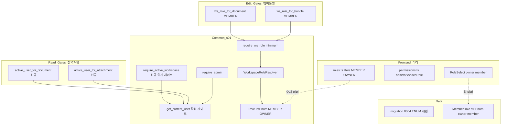
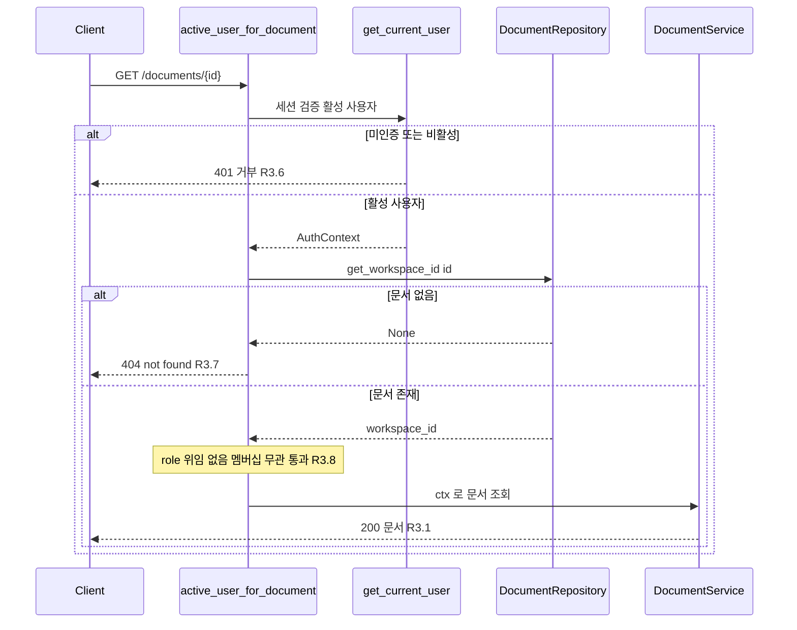

# Technical Design Document — s26-open-access-roles

## Overview

**Purpose**: markspace 의 권한 모델을 두 축에서 재편한다 — (1) 워크스페이스 role 을
owner/editor/viewer 3단계에서 **owner/member 2단계**로 축소하고, (2) 문서·첨부·버전·워크스페이스
상세 읽기를 **전역 개방**(인증된 활성 사용자면 멤버십 무관 읽기)한다. 편집·관리 권한은 여전히
워크스페이스 멤버십 단위로만 판정한다.

**Users**: 활성 사용자(admin 등록 계정)는 소속과 무관하게 조직 내 모든 문서를 열람하고, 멤버는
소속 워크스페이스에서 문서를 편집하며, owner 는 관리 작업을 통제한다.

**Impact**: s01-contract-foundation 이 정의한 권한 근간(`Role` IntEnum·`MemberRole` 직렬화·
`workspace_member.role` ENUM)과 이를 미러하는 프론트엔드 role 모델, L1~L6 통합 체크포인트의
권한 경계를 재편한다. 새 판정 로직·알고리즘은 없다 — 기존 s01 단일 소스(resolver·어댑터·
활성 게이트)를 **재구성·재사용**한다. 판정 재구현이 아니라 seam 재배치가 이 설계의 본질이다.

### Goals
- 워크스페이스 role 을 owner/member 2단계로 재정의(위계·직렬화·저장 값 집합)하고 기존
  editor·viewer 멤버십을 데이터 손실 없이 member 로 이관한다.
- 읽기 5개 엔드포인트(문서 트리·문서 상세·버전 이력·첨부 조회/다운로드·WS 상세)를 활성
  사용자 게이트로 전환해 전역 개방한다(읽기 경로 열거-방지 403 제거).
- 편집·휴지통 게이트를 "멤버(owner 또는 member)"로 통일하고 관리 게이트를 owner 전용 유지한다.
- BE `Role`/`MemberRole` 과 FE role 모델의 수치·값 집합 정합, admin bypass(INV-3) 유지.

### Non-Goals
- 문서별 개별 권한 도입(여전히 없음 — 편집·관리는 워크스페이스 단위 판정 유지).
- 읽기 전용 공유 링크(s14) 재설계 — 미인증 외부 접근의 토큰·`is_shareable` 게이트는 불변.
- 새로운 관리 기능·역할 추가, 버전 rollback 등 신규 기능. 계정 활성/삭제 판정 로직 변경.
- 휴지통 목록의 전역 개방(R7.4 — 휴지통은 개방 제외, member 이상 유지).

## Boundary Commitments

### This Spec Owns
- 워크스페이스 role 의 값 집합·위계·직렬화 재정의: `Role`(IntEnum) 2단계 재번호,
  `MemberRole`(str Enum) 2값, `_ROLE_MAP` 재정의, FE `roles.ts` 미러.
- 읽기 5개 게이트의 활성-사용자 전환(신규 게이트 3종 + WS 상세 서비스 role 주입).
- 편집·휴지통 게이트의 `EDITOR`→`MEMBER` 치환, 관리 게이트 owner 유지.
- `workspace_member.role` ENUM 마이그레이션 0004(editor·viewer → member 이관 + downgrade 비대칭).
- FE role 모델·RoleSelect·게이팅 판정·s24 복원 값 집합의 owner/member 정합.
- L1~L6 및 단위 권한 테스트의 새 모델·전역 읽기 경계 반영, steering 문서 문구 정합.

### Out of Boundary
- 문서별 개별 권한, 공유 링크(s14) 토큰·`is_shareable` 게이트 재설계, 신규 관리 기능/역할.
- auth 계층의 "활성 사용자" 판정 로직 자체(재사용만 하며 변경하지 않음).
- `get_current_user`·`WorkspaceRoleResolver.has_at_least`·`require_admin`·기존 어댑터의
  매핑/404 로직 자체(재사용·재배치만 하며 판정 알고리즘을 재구현하지 않음).
- Toast UI Editor 의 "viewer mode"(읽기 렌더 모드 명칭) — role 이름이 아니므로 유지.

### Allowed Dependencies
- **BE**: s01 `app/common`(auth·db·permissions·errors·models). 신규 common 게이트는
  `Workspace` 모델을 직접 조회할 수 있다(common 은 이미 `WorkspaceMember` 를 조회). feature
  도메인(document/attachment/workspace)은 **다른 feature 를 import 하지 않으며**, 읽기 게이트는
  자기 feature 의 repository 만 소비한다. lock_version 라우터는 기존과 동일하게 document
  dependencies 를 재사용한다(신규 교차 import 아님).
- **FE**: `shared/auth`(roles·permissions)를 features 가 소비하되 feature 간 직접 import 없음.
- **의존 방향**(불변): `models → common(auth·db·errors·permissions) → feature(repository →
  service → router)`. 각 계층은 좌측만 import 한다.

### Revalidation Triggers
- `Role`/`MemberRole` 값 집합·수치 변경 → FE `roles.ts` 미러 및 이를 소비하는 모든 게이팅
  재검증(BE/FE 동기 실패 시 게이팅 오작동).
- 읽기 게이트 계약 변경(403→200, 존재검사 위치) → L2~L6 권한 경계 스위트 재검증.
- `workspace_member.role` ENUM/마이그레이션 head 변경 → L2~L6 head-guard·roundtrip 재검증.
- `WorkspaceRead.role` 주입 지점 변경(get_workspace) → WS 상세 소비 FE(현재 WS 표시) 재검증.

## Architecture

### Existing Architecture Analysis

- **권한 근간(s01, `app/common/permissions.py`)**: `Role(IntEnum)` 수치 순서 = 위계
  포함관계(현 VIEWER=1<EDITOR=2<OWNER=3). `_ROLE_MAP` 이 ENUM 문자열→Role 번역. `require_ws_role
  (minimum)` (path `workspace_id`), `require_admin`, `WorkspaceRoleResolver.resolve/has_at_least`
  가 모든 판정의 단일 소스. **admin bypass(INV-3) 는 `has_at_least`·`require_admin` 이 소유**.
- **어댑터 패턴**: `ws_role_for_document(minimum)`·`ws_role_for_attachment(minimum)`·
  `ws_role_for_bundle(minimum)` 은 "리소스 id → workspace_id 매핑(부재 404) → s01 위임"의 얇은
  래퍼. 판정을 재구현하지 않는다. `workspace/dependencies.py` 는 path `{id}`→ws_id 브리지.
- **활성 사용자 게이트**: `get_current_user` 가 세션→User→(is_active·is_deleted 거부)→
  `AuthContext` 를 산출한다. 이것이 곧 R3.6 의 "활성 사용자" 판정 — 전역 읽기가 재사용한다.
- **직렬화 role**: `MemberRole(str, Enum)` 은 요청/응답 전용, `Role`(IntEnum, 위계)과 별개 타입.
  `WorkspaceRead.role: MemberRole|None` 은 s24 가산 필드(현재 `list_workspaces` 만 주입).
- **DB**: `workspace_member.role = ENUM('owner','editor','viewer')`, 마이그레이션 head=0003.
- **FE 미러**: `shared/auth/roles.ts`(`Role` enum·`WorkspaceRole` union·`memberRoleToRole`),
  `shared/auth/permissions.ts`(`hasWorkspaceRole`), `features/workspace` 의 `MemberRole`·
  `RoleSelect`, s24 복원(`membershipRoleSource`·`CurrentWorkspaceProvider`).

### Architecture Pattern & Boundary Map

**선택 패턴**: 기존 레이어드 구조 **in-place 전환**(research Option A) + 읽기 게이트는 편집
어댑터의 대칭 축소(role 위임 제거). 새 컴포넌트는 읽기 게이트 3종뿐이며 판정 로직은 전부 s01
재사용이다.



**Architecture Integration**:
- **Selected pattern**: in-place 값 재정의 + 읽기 게이트 대칭 축소. 편집 어댑터의 "매핑+404"
  절반은 유지, "role 위임" 절반만 제거해 읽기 게이트를 만든다.
- **Boundaries**: 읽기 게이트는 활성 사용자+대상 존재만 판정(role 없음). 편집·관리 게이트는
  기존 s01 위임 유지(minimum 만 MEMBER/OWNER 로). 판정 재구현 없음 → 게이팅 단일 소스 유지.
- **Preserved patterns**: 어댑터=매핑만·판정=s01, admin bypass=s01 소유, 권한검사=공통 레이어
  (structure.md), 설정 단일화(변경 없음).
- **New components rationale**: 읽기 게이트 3종(`require_active_workspace`·
  `active_user_for_document`·`active_user_for_attachment`)만 신설 — 기존 어댑터가 role 을
  강제하던 자리에 role 없는 활성 게이트가 필요하기 때문. 병렬 role 모델·플래그·검증기는
  신설하지 않는다(research §8.3).
- **Steering compliance**: 권한검사 공통 레이어 단일 소유, feature 간 직접 import 금지,
  의존 방향 좌향 준수, 마이그레이션 단일 선형 체인 유지.

### Technology Stack

| Layer | Choice / Version | Role in Feature | Notes |
|-------|------------------|-----------------|-------|
| Frontend | React + Vite + TS (기존) | role 모델·게이팅·선택 UI 미러 | 신규 의존성 없음 |
| Backend / Services | FastAPI + Pydantic (기존) | 게이트·enum·서비스 role 주입 | 신규 의존성 없음 |
| Data / Storage | MySQL 8 + Alembic (기존) | ENUM 3-스텝 마이그레이션 0004 | head 0003→0004, 비-additive |

신규 라이브러리·버전 변경 없음. 전부 기존 스택 재구성이다.

## File Structure Plan

### Modified Files — Backend (권한 근간·게이트)
- `backend/app/common/permissions.py` — **핵심**. `Role` IntEnum → `{MEMBER=1, OWNER=2}`
  (VIEWER 삭제·EDITOR→MEMBER 리네임). `_ROLE_MAP` → `{"owner":OWNER,"member":MEMBER}`.
  신규 `require_active_workspace(workspace_id)` 읽기 게이트 추가(활성+WS 존재→404, role 없음).
  `Workspace` 모델 import 추가.
- `backend/app/workspace/schemas.py` — `MemberRole` → `{OWNER="owner", MEMBER="member"}`
  (EDITOR/VIEWER 삭제). 나머지 스키마 변경 없음(값 집합 축소가 자동 전파).
- `backend/app/workspace/service.py` — `get_workspace(db, workspace_id, ctx)` 시그니처에 `ctx`
  추가, 호출자 role 조회→`_to_read(ws, role_str)` 주입(R3.5). `_to_read` 재사용(변경 없음).
- `backend/app/workspace/router.py` — WS 상세(`GET /workspaces/{id}`) 게이트를
  `require_ws_role(VIEWER)` → `get_current_user`(활성만)로 교체, 서비스에 `ctx` 전달. 관리
  게이트(OWNER) 7지점 변경 없음.
- `backend/app/document/dependencies.py` — 신규 `active_user_for_document(id)`(문서→ws 매핑,
  None→404, ctx 반환, role 위임 없음). 기존 `ws_role_for_document` 유지(편집용).
- `backend/app/document/router.py` — 트리(`GET /workspaces/{workspace_id}/documents`) 게이트를
  `require_ws_role(VIEWER)` → `require_active_workspace`(common). 문서 상세(`GET /documents/{id}`)
  를 `ws_role_for_document(VIEWER)` → `active_user_for_document`. 편집 4지점 EDITOR→MEMBER.
- `backend/app/attachment/dependencies.py` — 신규 `active_user_for_attachment(id)`(첨부→ws
  매핑, None→404, ctx 반환). 기존 `ws_role_for_attachment` 유지(현재 사용처 없어질 경우 정리).
- `backend/app/attachment/router.py` — 첨부 서빙(`GET /attachments/{id}`)을
  `ws_role_for_attachment(VIEWER)` → `active_user_for_attachment`. 업로드 EDITOR→MEMBER.
- `backend/app/lock_version/router.py` — 버전 이력(`GET /documents/{id}/versions`)을
  `ws_role_for_document(VIEWER)` → `active_user_for_document`. lock/save/cancel EDITOR→MEMBER,
  force-unlock OWNER 유지.
- `backend/app/sharing/router.py` — 발급/토글 EDITOR→MEMBER(2지점). 공유 링크 게스트 경로 불변.
- `backend/app/trash/router.py` — 목록(`require_ws_role(EDITOR)`)·복원/완전삭제
  (`ws_role_for_bundle(EDITOR)`)를 MEMBER 로(R7.4 — 활성 게이트로 내리지 않음).

> `trash/dependencies.py`(`ws_role_for_bundle`)는 minimum 을 인자로 받으므로 파일 변경 없이
> 라우터에서 `Role.MEMBER` 전달만으로 전환된다.

### New Files — Backend (마이그레이션)
- `backend/migrations/versions/0004_open_access_roles.py` — 3-스텝 ENUM 재편
  (확장→UPDATE→축소), downgrade 역순+비대칭(member→editor, viewer 미복구). down_revision="0003".

### Modified Files — Frontend (미러)
- `frontend/src/shared/auth/roles.ts` — `Role` enum → `{MEMBER=1, OWNER=2}`, `WorkspaceRole` →
  `"owner"|"member"`, `memberRoleToRole` 2 case.
- `frontend/src/shared/auth/permissions.ts` — 로직 불변. 소비처의 `minimum: Role.EDITOR` →
  `Role.MEMBER` (편집성 UI 게이팅).
- `frontend/src/features/workspace/api/types.ts` — `MemberRole` → `"owner"|"member"`.
- `frontend/src/features/workspace/components/RoleSelect.tsx` — `ROLE_OPTIONS` 2값(owner·member).
- s24 복원 경로(`features/workspace/context/membershipRoleSource.tsx`,
  `app/workspace-context/CurrentWorkspaceProvider.tsx`, `features/workspace/components/
  CurrentWorkspaceIndicator.tsx`, `MemberManagementPanel.tsx` 등) — 메커니즘 불변, 소비하는 role
  값 집합만 owner/member 로 정합(리터럴·라벨 갱신).

### Modified Files — Docs / Tests
- `.kiro/steering/product.md`·`tech.md` — "owner/editor/viewer"·"viewer 권한" 문구 갱신
  (Toast "viewer mode" 렌더 모드 명칭은 유지).
- 회귀: research §7 D7 의 head-guard 파일 + L2~L6 권한 경계 스위트 + 단위 권한 테스트
  (`test_permissions.py`·`test_membership_service.py`·`test_permission_boundary.py`·
  `test_admin_override.py`·`test_migration_roundtrip.py`) + FE role 테스트(~30 파일).

## System Flows

### 읽기 전역 개방 게이트 판정 (문서 상세 예시)



**핵심 결정**: 게이트는 role 을 판정하지 않으므로 403 발생 지점이 존재하지 않는다 — 비멤버
활성 사용자는 존재하는 리소스에 200 을 받는다(R3.8). 존재검사(404)는 기존 어댑터와 동일 위치.
트리·첨부·WS 상세도 동일 형태이며 존재 확인 대상만 다르다(WS/첨부).

### 마이그레이션 0004 (3-스텝 ENUM)

```mermaid
graph LR
    S0[owner editor viewer] -->|1 MODIFY 확장| S1[owner editor viewer member]
    S1 -->|2 UPDATE editor viewer to member| S2[owner member 데이터]
    S2 -->|3 MODIFY 축소| S3[owner member]
    S3 -.downgrade 1 확장.-> D1[owner editor viewer member]
    D1 -.downgrade 2 member to editor.-> D2[viewer 미복구 비대칭]
    D2 -.downgrade 3 축소.-> D3[owner editor viewer 구조]
```



**핵심 결정**: 4값 임시 확장으로 UPDATE 를 안전하게 수행(제약 위반 없이 값 이관). owner 행은
어느 스텝도 건드리지 않아 단일 owner 불변식 보존(R2.3). downgrade 는 member→editor 만 복원하고
viewer 는 복구하지 않는다(R2.5 의도된 비대칭 — 원본 editor/viewer 구분이 이미 소실되었으므로).

## Requirements Traceability

| Requirement | Summary | Components | Interfaces | Flows |
|-------------|---------|------------|------------|-------|
| 1.1, 1.2 | role 2값·위계 | `Role` IntEnum | `{MEMBER=1,OWNER=2}` | — |
| 1.3 | role 직렬화 | `MemberRole` | `{OWNER,MEMBER}` | — |
| 1.4 | 잘못된 role 거부 | `MemberCreate/Update.role` | pydantic 422 (자동) | — |
| 1.5 | admin bypass | `has_at_least`·`require_admin` | 불변 | — |
| 2.1, 2.2, 2.4 | 데이터 이관 | migration 0004 upgrade | 3-스텝 UPDATE | 마이그레이션 flow |
| 2.3 | 단일 owner 유지 | migration 0004 | owner 행 불변 | 마이그레이션 flow |
| 2.5 | downgrade 비대칭 | migration 0004 downgrade | member→editor | 마이그레이션 flow |
| 3.1, 3.2 | 문서·트리 읽기 개방 | `active_user_for_document`·`require_active_workspace` | 읽기 게이트 | 읽기 flow |
| 3.3 | 버전 읽기 개방 | `active_user_for_document`(재사용) | 읽기 게이트 | 읽기 flow |
| 3.4 | 첨부 읽기 개방 | `active_user_for_attachment` | 읽기 게이트 | 읽기 flow |
| 3.5 | WS 상세 role 주입 | `WorkspaceService.get_workspace` | `get_workspace(...,ctx)` | — |
| 3.6 | 미인증·비활성 거부 | `get_current_user`(재사용) | 401 | 읽기 flow |
| 3.7 | 리소스 부재 404 | 게이트 존재검사·서비스 404 | 404 | 읽기 flow |
| 3.8 | 비멤버 200 (403 제거) | 읽기 게이트(role 위임 없음) | 200 | 읽기 flow |
| 4.1~4.5 | 멤버 편집 허용 | 편집 게이트 MEMBER | `Role.MEMBER` | — |
| 4.6 | 비멤버 편집 거부 | s01 위임(MEMBER 미달) | 403 | — |
| 5.1~5.4 | owner 관리 유지 | OWNER 게이트(불변) | `Role.OWNER` | — |
| 5.5 | 멤버 응답 role 표현 | `MemberRead`·`MemberRosterRead` | `MemberRole` | — |
| 6.1~6.5 | FE 정합 | `roles.ts`·`permissions.ts`·`RoleSelect`·s24 | 값·수치 미러 | — |
| 7.1 | 편집·관리 멤버십 판정 | 편집·관리 게이트 유지 | INV-1(편집·관리) | — |
| 7.2 | 읽기 INV-1 완화 | 읽기 게이트(멤버십 미요구) | — | 읽기 flow |
| 7.3 | 공유 게이트 불변 | sharing 게스트 경로(미변경) | 토큰·is_shareable | — |
| 7.4 | 휴지통 개방 제외 | trash 게이트 MEMBER(활성 게이트 아님) | `Role.MEMBER` | — |
| 7.5 | 회귀 정합 | L1~L6·단위 테스트 갱신 | — | — |

## Components and Interfaces

| Component | Domain/Layer | Intent | Req Coverage | Key Dependencies | Contracts |
|-----------|--------------|--------|--------------|------------------|-----------|
| `Role` IntEnum | Common | 2단계 위계 비교 근간 | 1.1, 1.2 | — | Service |
| `require_active_workspace` | Common | 읽기: 활성+WS 존재 게이트 | 3.2, 3.6, 3.7, 3.8 | get_current_user (P0), Workspace (P0) | Service |
| `MemberRole` | Workspace/Schema | role 직렬화 2값 | 1.3, 1.4, 5.5 | — | State |
| `WorkspaceService.get_workspace` | Workspace/Service | WS 상세 + role 주입 | 3.5, 3.7 | Resolver/MembershipRepo (P0) | Service |
| `active_user_for_document` | Document/Dep | 읽기: 활성+문서 존재 | 3.1, 3.6, 3.7, 3.8 | DocumentRepository (P0) | Service |
| `active_user_for_attachment` | Attachment/Dep | 읽기: 활성+첨부 존재 | 3.4, 3.6, 3.7, 3.8 | AttachmentRepository (P0) | Service |
| 편집 게이트(MEMBER 치환) | 다도메인/Router | 편집·휴지통 멤버 통일 | 4.1~4.6, 7.4 | s01 어댑터 (P0) | API |
| migration 0004 | Data | ENUM 재편·데이터 이관 | 2.1~2.5 | Alembic (P0) | Batch |
| FE role 미러 | Frontend | role 값·수치·선택 UI 정합 | 6.1~6.5 | shared/auth (P0) | State |

### Common — 권한 근간

#### `Role` (IntEnum 재설계)

| Field | Detail |
|-------|--------|
| Intent | 워크스페이스 role 위계 비교의 2단계 단일 소스 |
| Requirements | 1.1, 1.2 |

**Responsibilities & Constraints**
- 정수 순서가 곧 권한 포함관계: `OWNER(2) ≥ MEMBER(1)`. owner 는 member 의 모든 권한 포함.
- `VIEWER` 삭제, `EDITOR` 심볼 → `MEMBER` 리네임, 하위 호환 alias 없음.
- `_ROLE_MAP: {"owner": OWNER, "member": MEMBER}` — DB ENUM 문자열→Role 번역. 이관 후 DB 에는
  owner/member 만 존재하므로 editor/viewer 매핑 제거. 미정의 문자열은 매핑 제외→resolve None.

##### Service Interface
```python
class Role(IntEnum):
    MEMBER = 1
    OWNER = 2

_ROLE_MAP: dict[str, Role] = {"owner": Role.OWNER, "member": Role.MEMBER}
```
- Preconditions: 없음(순수 상수).
- Postconditions: `Role.OWNER > Role.MEMBER`. FE `roles.ts` 와 수치 동일(계약).
- Invariants: `has_at_least`·`resolve`·`require_ws_role`·어댑터의 판정 로직은 **불변**
  (값 집합만 축소). admin bypass(INV-3) 불변.

**Implementation Notes**
- Integration: `Role.EDITOR` 참조가 남아 있으면 즉시 임포트 에러 → 편집 게이트 치환 강제.
  `Role.VIEWER` 참조는 읽기 게이트 전환으로 앱 코드에서 소멸(테스트만 잔존).
- Validation: `test_permissions.py`·`roles.test.ts` 가 수치·위계 즉시 검증.
- Risks: BE/FE 수치 불일치 시 게이팅 오작동 — 두 파일 동시 갱신 필수.

#### `require_active_workspace` (신규 읽기 게이트)

| Field | Detail |
|-------|--------|
| Intent | 활성 사용자 + WS 존재만 요구하는 읽기 게이트(role 판정 없음) |
| Requirements | 3.2, 3.6, 3.7, 3.8 |

**Responsibilities & Constraints**
- `get_current_user`(활성 게이트)를 재사용해 미인증·비활성 401 거부(R3.6).
- `Workspace` 를 id 로 조회해 없으면 404(R3.7). 존재하면 role 판정 없이 `ctx` 반환.
- **role 위임 없음** → 403 발생 지점 부재 → 비멤버 활성 사용자 200(R3.8, R7.2).
- 문서 트리(`GET /workspaces/{workspace_id}/documents`, document router)가 소비. common 배치로
  document→workspace 교차 import 회피(research §7 D2).

**Dependencies**
- Outbound: `get_current_user` — 활성 사용자 판정 (P0).
- Outbound: `Workspace`(models) — 존재검사 (P0). common 이 이미 `WorkspaceMember` 조회하므로
  동일 계층에서 `Workspace` 조회 허용.

##### Service Interface
```python
def require_active_workspace(
    workspace_id: int,
    ctx: AuthContext = Depends(get_current_user),
    db: Session = Depends(get_db),
) -> AuthContext:
    """활성 사용자 + WS 존재 게이트 (읽기 전역 개방). role 판정 없음."""
```
- Preconditions: 경로 파라미터 `workspace_id: int`.
- Postconditions: 활성 사용자면서 WS 존재 → `ctx` 반환. 비활성/미인증 → 401(get_current_user).
  WS 부재 → 404. **어떤 경우에도 403 을 내지 않는다**(role 미판정).
- Invariants: 멤버십을 조회하지 않는다(INV-1 읽기 완화, R7.2).

**Implementation Notes**
- Integration: 존재검사는 `db.query(Workspace.id).filter(...).first()` 경량 PK 조회.
- Risks: WS 상세와 달리 트리는 서비스가 WS 를 로드하지 않으므로 이 게이트가 존재검사의 유일한
  지점 — 누락 시 부재 WS 가 빈 200 을 반환(R3.7 위반). 트리 라우트에 반드시 부착.

### Document / Attachment — 읽기 게이트(어댑터 대칭 축소)

#### `active_user_for_document` / `active_user_for_attachment`

| Field | Detail |
|-------|--------|
| Intent | 리소스 id→ws 매핑(부재 404) 후 활성 사용자만 요구(role 위임 제거) |
| Requirements | 3.1, 3.3(문서 재사용), 3.4(첨부), 3.6, 3.7, 3.8 |

**Responsibilities & Constraints**
- 기존 `ws_role_for_document`/`ws_role_for_attachment` 의 **앞 절반**(id→ws 매핑, None→404)을
  그대로 유지하고 **뒤 절반**(`_delegate` = s01 role 위임)을 제거한 대칭 게이트.
- 매핑 후 role 판정 없이 `ctx` 반환 → 403 부재 → 비멤버 200(R3.8).
- `active_user_for_document` 은 문서 상세(document router)와 버전 이력(lock_version router,
  기존처럼 document dependencies 재사용)이 공유.
- 자기 feature repository 만 소비(교차 import 없음).

##### Service Interface
```python
def active_user_for_document(
    id: int,
    ctx: AuthContext = Depends(get_current_user),
    db: Session = Depends(get_db),
) -> AuthContext:
    """문서 id→workspace 매핑(부재 404) 후 활성 사용자면 통과. role 위임 없음."""
    # workspace_id = _repository.get_workspace_id(db, id); None -> 404; return ctx
# active_user_for_attachment: 동형(AttachmentRepository.get 로 첨부 존재검사)
```
- Preconditions: 경로 `id: int`(문서/첨부 id).
- Postconditions: 리소스 존재 + 활성 사용자 → `ctx`. 리소스 부재 → 404. **403 없음**.
- Invariants: 매핑된 workspace_id 로 role 을 판정하지 않는다(읽기 완화).

**Implementation Notes**
- Integration: 첨부 보관(`is_archived`) 서빙 차단(role 무관 404)은 기존대로 **서비스 단계**가
  권한 이전에 처리(어댑터 소관 아님) — 읽기 게이트 전환이 이 동작을 바꾸지 않는다.
- Risks: 기존 편집 어댑터(`ws_role_for_*`)와 병존하므로 라우터가 읽기/편집 라우트에 올바른
  게이트를 부착해야 한다 — 읽기 라우트에 편집 어댑터가 남으면 403 회귀.

### Workspace — WS 상세 role 주입

#### `WorkspaceService.get_workspace`

| Field | Detail |
|-------|--------|
| Intent | WS 상세 반환 + 호출자 관점 role(owner/member/null) 주입 |
| Requirements | 3.5, 3.7 |

**Responsibilities & Constraints**
- 시그니처에 `ctx: AuthContext` 추가. WS 로드(None→404) 후 호출자 멤버십 role 문자열을 조회해
  기존 `_to_read(ws, role_str)` 로 주입(비멤버 None, admin 상승 없음 INV-3).
- role 문자열 조회는 `MembershipRepository.get(db, workspace_id, ctx.user_id)` → `.role`(없으면
  None). 게이트(`get_current_user`)가 활성만 보장하고 존재검사·role 주입은 서비스가 담당.

##### Service Interface
```python
def get_workspace(self, db: Session, workspace_id: int, ctx: AuthContext) -> WorkspaceRead:
    """WS 상세 + 호출자 role 주입 (R3.5). 부재 404. 비멤버 role=None."""
```
- Preconditions: `ctx` 는 라우터 `get_current_user` 산출(활성 사용자).
- Postconditions: `WorkspaceRead` 반환, `role ∈ {owner, member, None}`. 비멤버도 이름·설정
  (is_shareable·보관일)을 받는다(R3.5). WS 부재 → 404.
- Invariants: admin 이어도 role 을 상승시키지 않는다(호출자 실제 멤버십 role 만).

**Implementation Notes**
- Integration: `_to_read` 는 `MemberRole(role) if role else None` 로 정규화 — role 문자열이
  이관 후 owner/member 이므로 자동 정합. 라우터는 `require_ws_role(VIEWER)` 게이트를 제거하고
  `get_current_user` 로 교체 후 `ctx` 전달.
- Risks: 게이트 교체를 누락하면 비멤버가 여전히 403 → R3.5·R3.8 위반.

### Data — 마이그레이션 0004

#### `0004_open_access_roles`

| Field | Detail |
|-------|--------|
| Intent | workspace_member.role ENUM 재편 + editor/viewer→member 이관 |
| Requirements | 2.1, 2.2, 2.3, 2.4, 2.5 |

**Contracts**: Batch

##### Batch / Job Contract
- **Trigger**: `alembic upgrade head`. down_revision="0003", revision="0004".
- **upgrade**(3-스텝): ① `MODIFY role ENUM('owner','editor','viewer','member') NOT NULL`(확장)
  → ② `UPDATE workspace_member SET role='member' WHERE role IN ('editor','viewer')`(이관,
  owner 불변) → ③ `MODIFY role ENUM('owner','member') NOT NULL`(축소).
- **downgrade**(역순·비대칭): ① 4값 확장 → ② `UPDATE ... SET role='editor' WHERE role='member'`
  (viewer 미복구, R2.5) → ③ `MODIFY role ENUM('owner','editor','viewer') NOT NULL`.
- **Idempotency & recovery**: 각 ALTER/UPDATE 는 Alembic 트랜잭션 내 순차 실행. 단일 owner
  불변식(R2.3)은 owner 행 미변경으로 보존. 구조 roundtrip 통과(데이터 비대칭은 의도).

**Implementation Notes**
- Integration: head 0003→0004. research §7 D7 의 head-guard(L2/L4/L5/L6·workspace·attachment·
  roundtrip) 및 단일-선형-체인 단언을 `[…,"0004…"]`/`["0004"]` 로 동시 갱신(같은 task).
- Risks: 비-additive 변경이므로 0002/0003 가산 패턴과 다르다 — roundtrip 은 데이터가 아닌 구조
  복귀만 검증하므로 viewer 소실을 잡지 않는다(의도된 결과, downgrade 주석에 명문화).

### Frontend — role 미러 (Summary-only, 새 경계 없음)

- `roles.ts`: `Role = {MEMBER=1, OWNER=2}`, `WorkspaceRole = "owner"|"member"`,
  `memberRoleToRole` 2 case. **BE `Role` 수치와 동일**(6.1).
- `permissions.ts`: `hasWorkspaceRole` 로직 불변(admin→null→`currentRole>=minimum`). 편집성 UI
  게이팅 소비처의 `minimum` 을 `Role.MEMBER` 로(6.4). admin 항상 통과 유지(INV-3).
- `features/workspace/api/types.ts`: `MemberRole = "owner"|"member"`(6.1).
- `RoleSelect.tsx`: `ROLE_OPTIONS` = owner·member 2값(6.2).
- s24 복원(`membershipRoleSource`·`CurrentWorkspaceProvider` 등): 메커니즘 불변, 표시·복원
  값 집합만 owner/member(6.3, 6.5).

**Implementation Note**: FE 는 순수 미러이므로 새 경계·훅을 도입하지 않는다. `roles.test`·
`permissions.test`·`RoleSelect.test`·`rolePersistence.e2e` 가 값·수치·복원을 검증.

## Error Handling

### Error Categories and Responses
- **401 (미인증·비활성)**: 읽기 게이트가 `get_current_user` 를 재사용해 세션 부재·비활성 계정을
  거부(R3.6). 기존 전역 401 인터셉터(FE)가 returnTo 보존 후 로그인 리다이렉트.
- **403 (권한 부족)**: **읽기 경로에서 제거**(R3.8·R7.2 — 열거-방지 403 폐지). 편집·관리·휴지통
  경로는 s01 위임이 유지(MEMBER/OWNER 미달·비멤버 → 403). force-unlock OWNER 미달 → 403.
- **404 (리소스 부재)**: 읽기 게이트의 존재검사(문서·첨부·WS)와 서비스 404 가 유지(R3.7). 읽기
  개방 후에도 부재 리소스는 200 이 아닌 404.
- **422 (잘못된 role)**: `MemberCreate/Update.role: MemberRole` 값 집합 축소로 "editor"/"viewer"
  요청을 pydantic 이 자동 거부(R1.4). 서비스 재검증 없음.

### Monitoring
기존 s01 `DomainError`→전역 핸들러→공통 `ErrorResponse` 경로 재사용. 신규 로깅·모니터링 없음.

## Testing Strategy

### Unit Tests
- `Role` 위계·수치: `OWNER(2) > MEMBER(1)`, VIEWER/EDITOR 심볼 부재, `_ROLE_MAP` 2값
  (`test_permissions.py`). FE `roles.test.ts` 수치 동기.
- `MemberRole` 2값 직렬화 + `MemberCreate("editor")` → 422(R1.4, `test_membership_service.py`).
- `get_workspace(ctx)` role 주입: owner/member/비멤버(None)·admin 미상승(R3.5).
- `hasWorkspaceRole`: admin 통과·null 거부·member>=member(FE `permissions.test.ts`, 6.4).

### Integration Tests
- 읽기 전역 개방(비멤버 활성 사용자 200): 문서 상세·트리·버전·첨부·WS 상세 각각 200 이며 403
  아님(R3.1~3.5·3.8). 부재 리소스 404(R3.7). 미인증 401(R3.6). L2~L6 권한 경계 스위트 기대값
  403→200 전환.
- 편집 멤버 통일: member 가 문서 생성·저장·업로드·공유·휴지통 복원 허용(R4), 비멤버 403(R4.6),
  force-unlock 은 member 거부·owner 허용(R5.3).
- 휴지통 개방 제외(R7.4): 비멤버가 휴지통 목록 조회 시 403(활성 게이트로 내려가지 않음).
- 공유 게스트 경로 불변(R7.3): 미인증 토큰 접근이 기존 is_shareable 게이트대로 동작.
- 마이그레이션 0004: upgrade 후 editor/viewer→member·owner 유지·WS 당 owner 1개(R2.1~2.4),
  downgrade 후 member→editor·viewer 미복구(R2.5), 구조 roundtrip(`test_migration_roundtrip.py`).
- head-guard 정합: L2/L4/L5/L6·workspace·attachment 스위트가 head="0004"·4-리비전 체인 단언
  (research §7 D7).

### E2E / UI Tests
- role 표시·선택: 멤버 관리 화면이 owner·member 2 선택지만 노출(6.2), 멤버 목록·현재 WS 표시가
  owner/member 표기(6.3).
- s24 복원: 재로그인·새로고침 후 서버 제공 owner/member role 복원(6.5, `rolePersistence.e2e`).
- 비멤버 열람 플로우: 비소속 워크스페이스 문서를 열어 읽기 뷰 200(R3.1).

## Security Considerations

- **읽기 개방 범위 한정**: 전역 읽기 완화는 **인증된 활성 사용자에만** 적용된다(R7.3). 미인증
  외부 접근은 공유 링크 토큰·`is_shareable` 게이트가 그대로 차단 — 본 spec 은 이를 변경하지
  않는다. 폐쇄형 제품(self-signup 없음, admin 발급 계정)이므로 "활성 사용자 = 조직 구성원"이라는
  전제가 전역 읽기의 신뢰 경계다.
- **FE 게이팅은 편의**: `hasWorkspaceRole` 은 UI 노출 편의일 뿐 서버 강제를 대체하지 않는다
  (기존 계약 유지). 편집·관리는 서버 게이트가 재판정한다.
- **admin bypass 불변(INV-3)**: 값 집합 축소가 admin 판정 로직에 영향을 주지 않는다.

## Migration Strategy

마이그레이션 상세는 §System Flows(0004 3-스텝) 및 §Data Components 참조. 핵심: 4값 임시 확장으로
안전한 UPDATE, owner 행 불변으로 단일 owner 보존, downgrade 비대칭(viewer 미복구)은 R2.5 의도.
롤백 트리거: 배포 후 게이팅 회귀 발견 시 `alembic downgrade -1`(member→editor 복원, viewer 소실
수용). 검증 체크포인트: upgrade 후 `SELECT DISTINCT role` = {owner, member}, WS 당 owner count=1.
