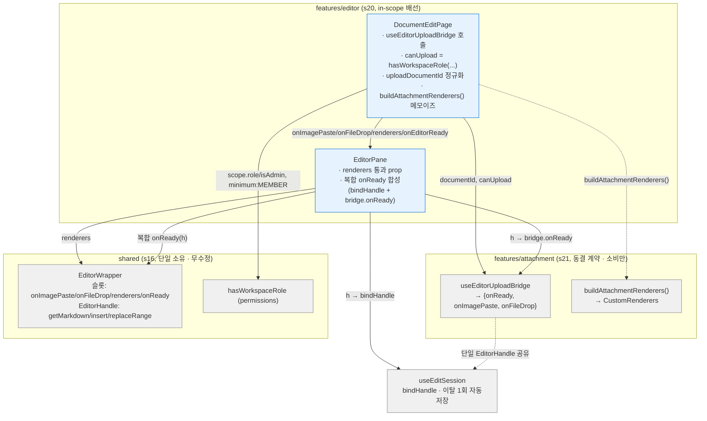
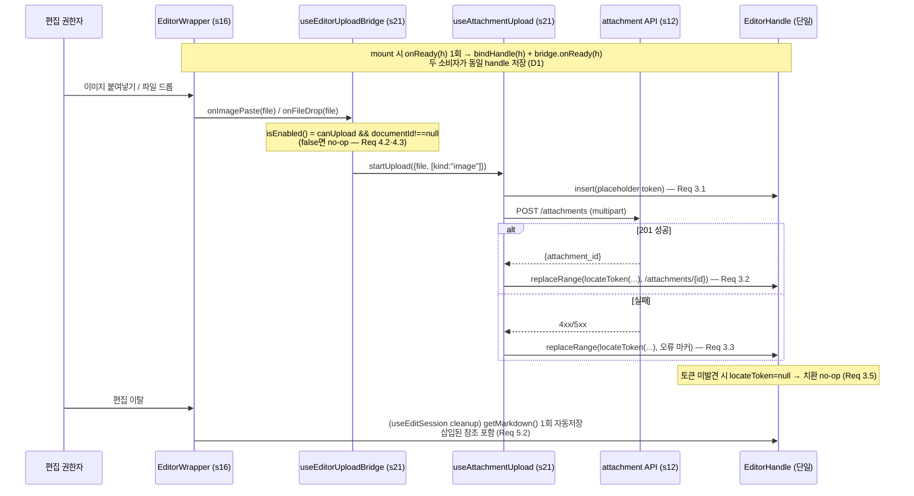

# 기술 설계 문서 — s27-fe-editor-attachment-wiring

## 개요 (Overview)

이 스펙은 **새 기능이 아니라 조립 갭(assembly gap) 해소**다. s21 첨부 브리지(`useEditorUploadBridge`·`buildAttachmentRenderers`)와 s16 `EditorWrapper` 슬롯(`onImagePaste`·`onFileDrop`·`renderers`·`onReady`)은 이미 완성·단위테스트되어 있으나 **전 코드베이스 소비처가 0**이다. 그 결과 편집 권한자가 마크다운 편집 모드에서 이미지를 붙여넣거나 파일을 드롭해도 업로드가 전혀 일어나지 않는다. 이 설계는 s20 편집 표면(`DocumentEditPage → EditorPane → EditorWrapper`)에 s21 브리지를 실제로 **결선**하고, 단위테스트가 못 잡은 결선 갭 회귀를 막는 조립 레벨 통합 테스트를 정의한다.

**대상 사용자**: 워크스페이스 편집 권한자(member↑ 또는 admin). 이들이 마크다운 편집 중 이미지·파일을 붙여넣기/드래그앤드롭으로 업로드하고, 삽입 결과(`/attachments/{id}` 참조)를 편집 표면에서 실제 이미지·다운로드 링크로 확인한다.

**영향(Impact)**: `DocumentEditPage.tsx`·`EditorPane.tsx` 두 파일에만 소량 신규 배선 코드를 더한다. 업로드 요청·blob 로딩·자리표시자 치환·백엔드 저장/서빙은 전부 기존 소유이므로 손대지 않는다. 신규 로직은 (a) 브리지 호출·`canUpload` 도출·`documentId` 정규화·`buildAttachmentRenderers()` 주입(페이지), (b) `renderers` 통과 prop + 복합 `onReady` 합성(pane)뿐이다.

### 목표 (Goals)

- 마크다운 편집 모드에서 붙여넣기/드롭 업로드 진입점을 활성화한다(브리지 핸들러를 편집 표면 슬롯에 바인딩).
- 편집 표면의 첨부 렌더(인증 blob 이미지 + `/attachments/{id}` 파일 링크)를 **읽기 뷰와 동일 경로**로 결선한다.
- 업로드 낙관 자리표시자 삽입 → 성공 시 참조 치환 → 실패 시 오류 마커 치환이 마크다운 모드에서 종단 동작하게 한다.
- `canUpload`를 현재 워크스페이스 role에서 s16 공통 게이팅 유틸로 도출한다(자체 role 비교 금지).
- 단일 `EditorHandle`을 자동저장 경로와 업로드 삽입 경로 양쪽에 공유해 결선 충돌(첨부 유실)을 방지한다.
- 조립 레벨 통합 테스트로 결선 갭 회귀를 고정한다.

### 비목표 (Non-Goals)

- s21이 소유한 업로드 요청·blob 로딩·자리표시자 치환 **동작의 재구현**(결선만 한다).
- 백엔드 s12 첨부 저장·격리·서빙 로직 수정.
- 위지윅(WYSIWYG) 모드의 삽입 좌표(`replaceSelection`) 결함 수정 및 위지윅 종단 지원.
- s16 `EditorWrapper` 내부(`.outerHTML` 직렬화 seam 포함) 수정 — 마운트된 라이브 React 루트의 진정한 blob 실렌더는 s16 소유 seam에 의해 제한되며, 이 스펙은 seam을 수정하지 않고 상위(s16)로 보고만 한다.
- 새 편집 표면 API·별도 Toast 에디터 인스턴스 발명.

## 경계 확약 (Boundary Commitments)

### 이 스펙이 소유 (This Spec Owns)

- `DocumentEditPage`에서의 **브리지 결선 배선**: `useEditorUploadBridge({documentId, canUpload})` 호출, `canUpload` 도출, `uploadDocumentId` 정규화(NaN→null), `buildAttachmentRenderers()` 메모이즈·주입.
- `EditorPane`의 **통과 배선 확장**: `renderers` 통과 prop 추가, 복합 `onReady` 합성(`session.bindHandle` + 브리지 `onReady`를 단일 handle에 분배).
- **조립 레벨 통합 테스트**: `DocumentEditPage`/`EditorPane` 결선을 통해 붙여넣기·드롭 → 업로드 → 자리표시자 치환 및 첨부 렌더 배선을 검증하는 신규 테스트.

### 경계 밖 (Out of Boundary)

- s21 소유 동작: 업로드 요청(`useAttachmentUpload`·`startUpload`), 인증 blob 로딩(`AttachmentImage`/`AttachmentFileLink`), 자리표시자 치환 로직(`locateToken`·`InsertContext`), 렌더러 구성 내부(`buildAttachmentRenderers` 구현).
- s16 소유 계약: `EditorWrapper` 내부(Toast 인스턴스 생성·`addImageBlobHook`/DOM `drop` 결선·`toToastHTMLRenderer` `.outerHTML` 직렬화·`EditorHandle` 구현).
- 백엔드 s12: 첨부 저장·격리·서빙(`POST /attachments`, `GET /attachments/{id}`) 및 서버측 403 권한 강제.
- 위지윅 삽입 좌표 결함·위지윅 종단 지원.

### 허용 의존성 (Allowed Dependencies)

- **s16 공통 레이어**: `@/shared/editor/EditorWrapper`(슬롯 계약·`EditorHandle`·`CustomRenderers`), `@/shared/auth/permissions`(`hasWorkspaceRole`), `@/shared/auth/roles`(`Role`).
- **s21 attachment feature 배럴**: `@/features/attachment`의 `useEditorUploadBridge`·`buildAttachmentRenderers`. 배럴이 자기규정한 **인가된 소비 seam**이며, structure.md의 "feature→feature 직접 import 금지" 불변식에 대한 **명시적·문서화된 예외**다(아래 [핵심 결정 D2] 참조).
- **s18/s24 role 주입 경로**: `useEditorScope().role`·`isAdmin`(s16 `useCurrentWorkspace` + 세션 파생). `canUpload` 도출의 원천.
- **제약**: attachment 외 다른 feature(`@/features/document`·`@/features/workspace`)는 여전히 import하지 않는다. Toast 인스턴스·s16 래퍼 내부·s21 동작을 소유하거나 이원화하지 않는다.

### 재검증 트리거 (Revalidation Triggers)

- s16 `EditorWrapper`의 슬롯 시그니처(`onImagePaste`/`onFileDrop`/`renderers`/`onReady`) 또는 `EditorHandle` 형태 변경 → 본 스펙 배선·s21 브리지 동시 재검증.
- s21 브리지 반환 계약(`{onReady, onImagePaste, onFileDrop}`) 또는 `buildAttachmentRenderers()` 반환 형태 변경 → 페이지·pane 배선 재검증.
- s16 `.outerHTML` 직렬화 seam이 라이브 마운트로 근본 수정되면 → 본 스펙 R2 통합 테스트의 검증 깊이(배선 → 실 blob DOM)를 상향 재검토.
- s18/s24 role 주입 경로가 편집 라우트에서 role을 시드하지 않게 되면 → `canUpload` 도출이 상시 false로 붕괴(업로드 진입점 무력화) → 재검증.
- `Role` enum의 최소 편집 role 정의 변경 → `minimum: Role.MEMBER` 도출 재검토.

## 아키텍처 (Architecture)

### 기존 아키텍처 분석 (Existing Architecture Analysis)

편집 표면은 이미 **단일 Toast 인스턴스 · 단일 렌더 경로** 원칙 위에 서 있다. s16 `EditorWrapper`가 Toast 인스턴스와 모든 capability 슬롯을 단일 소유하고, s20 편집 표면(`DocumentEditPage → EditorPane`)이 이를 마운트하며, s21 브리지는 그 슬롯을 소비만 하도록 설계됐다. 문제는 s20 조립부가 s21 브리지를 **호출·바인딩하지 않는다**는 것뿐이다:

- `EditorPane.tsx`의 `onImagePaste`/`onFileDrop` prop은 **존재하나 상위가 바인딩하지 않아 항상 `undefined`** → `EditorWrapper`가 `wireImagePaste`(209행)·`wireFileDrop`(247·263행) 조건을 false로 판정해 두 캡처 경로를 등록하지 않는다.
- `EditorPane.tsx`에 `renderers` prop **자체가 없어** 첨부 렌더 override가 전달되지 않는다.
- `DocumentEditPage.tsx`가 `useEditorScope()`로 `role`을 이미 취득(56행)하나 `canUpload` 도출·브리지 호출에 쓰지 않는다.

이 설계는 이 세 조립 공백만 메운다. 유지해야 할 기존 패턴: 단일 인스턴스, 렌더 경로 단일화, role 비교의 공통 레이어 위임, "콘텐츠 확보 시에만 편집 표면 마운트".

### 아키텍처 패턴 & 경계 지도 (Boundary Map)

핵심 패턴은 **소비 어댑터 결선(Consumer-Adapter Wiring)**이다: 조립부가 브리지를 호출하고, 반환 핸들러/렌더러를 이미 존재하는 슬롯에 바인딩하며, 단일 `EditorHandle`을 두 소비자에게 분배한다.



**아키텍처 통합 요약**:
- **선택 패턴**: 소비 어댑터 결선 — 조립부가 훅을 호출하고 반환값을 기존 슬롯에 바인딩. 신규 표면 API 없음.
- **feature 경계**: editor(배선) / attachment(동결 소비 계약) / shared(단일 소유). editor만 변경.
- **보존 패턴**: 단일 Toast 인스턴스, 렌더 경로 단일화, role 비교의 공통 레이어 위임(`hasWorkspaceRole`), "콘텐츠 확보 시에만 마운트".
- **신규 컴포넌트 없음**: 신규 파일 0. 기존 2파일 확장.
- **steering 정합성**: "권한에 따른 UI 노출은 공통 권한 게이팅 유틸을 거쳐 결정, 컴포넌트마다 역할 비교 로직을 흩뿌리지 않는다"(structure.md) → `canUpload`는 `hasWorkspaceRole` 단일 경로로 도출.

### 핵심 설계 결정 (Key Design Decisions)

#### D1 · 복합 `onReady`를 EditorPane 내부에서 합성 (Req 5)

`EditorPane`은 기존 `onReady={session.bindHandle}` 책임을 유지하면서, 추가 `onEditorReady?: (h: EditorHandle) => void` prop(브리지 `onReady`)을 받아 **내부에서 합성**한다:

```typescript
const handleReady = useCallback(
  (h: EditorHandle) => {
    session.bindHandle(h);
    onEditorReady?.(h);
  },
  [session.bindHandle, onEditorReady],
);
// <EditorWrapper onReady={handleReady} ... />
```

- **근거**: EditorPane의 "세션 결선 소유" 책임을 보존하고 surface를 prop 1개로 최소화한다. 대안(A-2: 페이지가 복합 콜백 완전 소유)은 EditorPane의 현재 `onReady` 자기소유를 페이지로 이관해 기존 계약·테스트 변경 폭이 커진다.
- **단일 handle 공유 불변식**: `EditorWrapper`는 mount 시 `onReady`를 **정확히 1회** 호출한다(194·276행, effect deps `[mode, initialContent]`). 그 1회 호출로 두 소비자(`session.handleRef`·`bridge.handleRef`)가 **동일 handle**을 저장 → 단일 Toast 인스턴스의 `getMarkdown`/`insert`/`replaceRange`를 공유. 따라서 업로드로 삽입된 참조가 이탈 시 자동저장(`getMarkdown`)에 그대로 반영된다(R5.1·5.2).
- **exactly-once 자동저장 무해성**: `bindHandle`·`bridge.onReady`는 각자 handle을 ref에 저장할 뿐 부수효과가 없다. `useEditSession` cleanup의 exactly-once 자동저장 가드(`savedRef`/`releasedRef`)와 상호작용하지 않는다. 복합 콜백이 매 렌더 재생성되어도 `EditorWrapper`가 ref로 캡처하고 mount 시점 값만 사용하므로 재인스턴스화·중복 호출을 유발하지 않는다(R5.3).

#### D2 · `@/features/attachment` 직접 import를 인가된 소비 seam으로 문서화 (structure.md 불변식 예외)

`DocumentEditPage`가 `import { useEditorUploadBridge, buildAttachmentRenderers } from "@/features/attachment"`로 s21 배럴을 직접 소비한다. 이는 **전 코드베이스 최초의 feature→feature 직접 import**이며 structure.md 불변식("feature는 다른 feature를 직접 import 하지 않는다")과 표면적으로 충돌한다. 그럼에도 이 방식을 채택하는 정당화:

1. **s21 배럴의 자기규정**: `features/attachment/index.ts`는 두 브리지를 "s20 편집 표면 소비용 진입점"으로 export하며 문서상 소비 seam으로 자기규정한다.
2. **s20 비의존 목록의 의도적 배제**: `DocumentEditPage`의 코드 주석에 문서화된 비의존 목록(s20 스펙 기준)은 `@/features/document`·`@/features/workspace`를 명시하되 **attachment는 의도적으로 제외**했다 — 배럴이 인가된 소비 seam임을 암시.
3. **훅 특성**: `useEditorUploadBridge`는 훅이라 렌더 트리 안에서 호출돼야 한다. 대안(B-2: 앱 레이어가 훅을 호출해 render-prop으로 주입)은 간접 배관 층을 신설해 과설계 위험이 있다.

**정당화 원칙**: attachment 배럴은 편집 표면의 **인가된 소비 seam**이며, 이 예외는 "편집 표면이 첨부 브리지를 소비한다"는 한 방향에만 국한된다. attachment는 editor를 import하지 않으며(단방향), editor는 attachment 외 다른 feature를 여전히 import하지 않는다. 이 결정은 향후 유사 소비(s19 읽기 뷰·s22 공유 뷰가 `buildAttachmentRenderers`를 결선)의 선례가 되지만, 각 소비는 배럴이 export한 계약으로 한정된다.

#### D3 · `.outerHTML` 직렬화 seam으로 인한 R2 검증 깊이 (배선 검증)

s16 `EditorWrapper.toToastHTMLRenderer`(131~138행)는 이미지 컨버터에서 `imageRenderer(ref).outerHTML`로 **반환 HTMLElement를 동기 직렬화**한다. s21 `buildAttachmentRenderers`의 `customImageRenderer`는 React 19 `createRoot`로 `AttachmentImage`를 마운트한 컨테이너를 반환하나, `createRoot`는 **비동기 커밋**이라 동기 `.outerHTML` read 시점에 라이브 blob DOM이 아직 없다(s21 `AttachmentRenderBridge`가 자기문서에 REVALIDATION TRIGGER로 기록).

- **결정**: R6.3이 s16 수정을 금지하므로, R2 통합 테스트는 **"`buildAttachmentRenderers()` 산출물이 `EditorWrapper`의 `renderers` prop에 결선됨"(배선 검증)**까지 단언하고, 라이브 blob DOM 실렌더 검증은 s16 소유 seam 한계로 **유보**한다. 이 간극은 요구(R2.1 인증 blob 실렌더)와 런타임 사이의 명시적 문서화 대상이며, s16 seam이 라이브 마운트로 근본 수정될 때 검증 깊이를 상향한다(재검증 트리거).
- **폴백 표시 위임(R2.4)**: 첨부 서빙 실패(404/403) 시 편집 표면은 s21 렌더 컴포넌트(`AttachmentImage`/`AttachmentFileLink`)가 정의한 대체 표시를 그대로 노출하며 첨부 상태를 재판정하지 않는다 — 이는 s21 소유이므로 배선만 검증한다.

### 기술 스택 (Technology Stack)

| 계층 | 선택 / 버전 | 기능 내 역할 | 비고 |
|------|-------------|--------------|------|
| Frontend | React 19 + TypeScript(strict) | 조립부 배선·prop 통과 | 신규 의존성 없음 |
| Editor | Toast UI Editor v3.2.2 | 편집 표면(마크다운 모드) | s16 래퍼 경유, 무수정 |
| 소비 계약 | s21 attachment 배럴 · s16 EditorWrapper/permissions | 브리지·렌더러·게이팅 | 동결 계약, 소비만 |
| 테스트 | Vitest + Testing Library + jsdom | 조립 통합 테스트 | 기존 목킹 하네스 재사용 |

## 파일 구조 계획 (File Structure Plan)

신규 파일 없음. 기존 2개 파일 수정 + 2개 테스트 확장/신규.

### 수정 파일 (Modified Files)

- **`frontend/src/features/editor/pages/DocumentEditPage.tsx`** — 조립부 배선. `@/features/attachment` 배럴 import 추가; `uploadDocumentId`(NaN→null 정규화) 산출; `canUpload = hasWorkspaceRole({currentRole: scope.role, isAdmin: scope.isAdmin, minimum: Role.MEMBER})` 도출; `const bridge = useEditorUploadBridge({documentId: uploadDocumentId, canUpload})`; `const renderers = useMemo(() => buildAttachmentRenderers(), [])`; `EditorPane`에 `onImagePaste={bridge.onImagePaste}`·`onFileDrop={bridge.onFileDrop}`·`renderers={renderers}`·`onEditorReady={bridge.onReady}` 전달. 기존 `documentId = Number(id)`(세션·배너용 number)는 유지하고 브리지용 정규화 값만 추가한다.
- **`frontend/src/features/editor/components/EditorPane.tsx`** — 통과 배선 확장. `EditorPaneProps`에 `renderers?: CustomRenderers`·`onEditorReady?: (h: EditorHandle) => void` 추가; 복합 `onReady` 합성(`session.bindHandle` + `onEditorReady`, D1); `<EditorWrapper>`에 `renderers={renderers}` 통과. `CustomRenderers`·`EditorHandle` 타입은 `@/shared/editor/EditorWrapper`에서 import.

### 테스트 파일 (Modified/New Tests)

- **`frontend/src/features/editor/components/EditorPane.test.tsx`**(확장) — `renderers` 통과 단언; 복합 `onReady` 발화 시 `session.bindHandle`·`onEditorReady` **양쪽**이 동일 handle로 호출됨을 단언(D1 단일 handle 공유).
- **`frontend/src/features/editor/pages/DocumentEditPage.integration.test.tsx`**(신규) — 조립 레벨 통합 테스트(R6.4). 실제 `DocumentEditPage`+`EditorPane`+s21 브리지를 마운트하고 `@/shared/editor/EditorWrapper`와 attachment API(`apiClient`)만 목킹. `EditorWrapper` stub이 수신 props를 기록하고 `onReady(mockHandle)`·`onImagePaste(file)`를 발화 → 브리지가 `startUpload` 구동 → placeholder 삽입(`handle.insert`) → 201 성공 시 `/attachments/{id}` 치환(`handle.replaceRange`) 종단 검증. 기존 `DocumentEditPage.test.tsx`(EditorPane 목킹)는 canUpload 도출·브리지 prop 결선 단언을 추가.

## 시스템 흐름 (System Flows)

### 붙여넣기/드롭 업로드 종단 흐름 (Req 1·3·5)



**흐름 결정 요약**: 게이팅은 브리지 내부 `isEnabled()`가 소유하며(`canUpload && documentId!==null`), 조립부는 `canUpload`·`uploadDocumentId`를 올바르게 주입할 책임만 진다. 치환 좌표는 `locateToken`이 콘텐츠 문자열에서 토큰을 재탐색해 계산하므로 `insert`가 위치를 반환하지 않아도 정확 치환이 가능하고, 토큰 부재 시 안전 no-op이다(R3.4·3.5). 단일 handle 공유가 업로드 삽입과 이탈 자동저장을 한 인스턴스에 수렴시킨다(R5).

## 요구사항 추적성 (Requirements Traceability)

| 요구사항 | 요약 | 실현 요소 | 배선 위치 |
|----------|------|-----------|-----------|
| 1.1 | 붙여넣기 이미지 업로드 시작 | `bridge.onImagePaste` → `startUpload({kind:"image"})` | 페이지가 EditorPane→EditorWrapper `onImagePaste` 바인딩 |
| 1.2 | 드롭 파일 업로드(종류 미지정) | `bridge.onFileDrop` → `startUpload({})` | `onFileDrop` 바인딩 |
| 1.3 | 이미지 파일 드롭 → 붙여넣기 경로 | Toast `dropImage` 플러그인 → `addImageBlobHook` → `onImagePaste` | s16 소유, 배선만 |
| 1.4 | 마크다운 모드에서 진입점 활성 | 슬롯 바인딩 시 `wireImagePaste`/`wireFileDrop` true | EditorWrapper 209·247행 조건 충족 |
| 1.5 | 비초점 루트 드롭 인식 | EditorWrapper `el` DOM `drop` 리스너 | `onFileDrop` 바인딩 시 등록 |
| 2.1 | 인증 blob 이미지 렌더 | `buildAttachmentRenderers().customImageRenderer` | 페이지 주입 → EditorPane `renderers` 통과(D3 배선 검증) |
| 2.2 | 파일 링크 렌더 | `customHTMLRenderer.link` | 동일 경로 |
| 2.3 | 읽기 뷰와 동일 렌더 경로 | `buildAttachmentRenderers` edit·read 공통 단일 객체 | s21 소유, 이원화 없음 |
| 2.4 | 서빙 실패 폴백 위임 | `AttachmentImage`/`AttachmentFileLink` 관측 폴백 | s21 소유, 재판정 안 함 |
| 3.1 | 낙관 자리표시자 삽입 | `InsertContext.insertPlaceholder` → `handle.insert` | s21 소유, 종단 통합 테스트 |
| 3.2 | 성공 시 참조 치환 | `replaceToken` → `handle.replaceRange` | 동일 |
| 3.3 | 실패 시 오류 마커 치환 | 동일 경로(replacement=오류 마커) | 동일 |
| 3.4 | 콘텐츠 문자열 토큰 위치 탐색 | `locateToken`(1-based line/0-based ch) | s21 소유 |
| 3.5 | 토큰 미발견 시 no-op | `locateToken===null` → return | s21 소유 |
| 4.1 | 편집 권한자 canUpload=true | `hasWorkspaceRole({minimum: Role.MEMBER})` | 페이지 도출 |
| 4.2 | viewer/null이면 no-op | `hasWorkspaceRole` role null→false + 브리지 `isEnabled` | 페이지 도출 + 브리지 게이팅 |
| 4.3 | documentId 미확보 no-op | `uploadDocumentId` NaN→null + 브리지 `documentId!==null` | 페이지 정규화 |
| 4.4 | 서버 403이 최종 경계 | 클라이언트 게이팅=UI 편의, 백엔드 무수정 | 문서화 |
| 4.5 | role 비교 s16 위임 | `hasWorkspaceRole` 단일 경로, 자체 비교 금지 | 페이지 도출 |
| 5.1 | 단일 handle 양쪽 결선 | 복합 `onReady`(bindHandle + bridge.onReady) | EditorPane 합성(D1) |
| 5.2 | 삽입분 이탈 자동저장 반영 | 단일 handle `getMarkdown` | EditorPane + useEditSession |
| 5.3 | 편집당 단일 Toast 인스턴스 | EditorWrapper 1개 마운트, 포크 금지 | EditorPane 불변식 |
| 6.1 | s21 동작 재구현 금지 | 브리지·업로드·치환 소비만 | 경계 |
| 6.2 | 백엔드 s12 무수정 | FE 전용 | 경계 |
| 6.3 | s16 래퍼 단일 소유 존중 | Toast·래퍼 내부·렌더 경로 미소유 | 경계(D3) |
| 6.4 | 조립 통합 테스트 추가 | `DocumentEditPage.integration.test.tsx` | 테스트 |
| 6.5 | 위지윅 제외·마크다운만 보장 | 삽입 좌표 결함 미수정 | 경계 |

## 컴포넌트 및 인터페이스 (Components and Interfaces)

| 컴포넌트 | 계층 | 의도 | Req 커버리지 | 핵심 의존성 | 계약 |
|----------|------|------|--------------|-------------|------|
| DocumentEditPage | UI/조립 | 브리지 호출·canUpload 도출·렌더러 주입 | 1,2,3,4,5,6 | useEditorUploadBridge(P0)·hasWorkspaceRole(P0)·EditorPane(P0) | State |
| EditorPane | UI/조립 | renderers 통과·복합 onReady 합성 | 1,2,5 | EditorWrapper(P0)·useEditSession(P0) | State |

### features/editor — 조립부

#### DocumentEditPage (수정)

| 필드 | 내용 |
|------|------|
| Intent | 라우트 세션·스코프 결선에 더해 s21 업로드 브리지·첨부 렌더러를 편집 표면에 결선 |
| Requirements | 1.1, 1.2, 2.1, 2.2, 4.1, 4.2, 4.3, 4.5, 5.1 |

**책임 & 제약**
- s21 배럴을 인가된 소비 seam으로 import(D2). attachment 외 다른 feature는 import하지 않는다.
- `canUpload`를 `hasWorkspaceRole` 단일 경로로 도출한다 — 자체 role 비교 금지(R4.5).
- `uploadDocumentId`를 `number | null`로 정규화해 브리지 R4.3 no-op을 만족한다. 기존 `documentId = Number(id)`(세션·배너 계약)는 유지한다.
- `buildAttachmentRenderers()`는 `useMemo(..., [])`로 안정화해 불필요한 재생성을 막는다.

**의존성**
- Inbound: 라우터(`/documents/:id/edit`) — documentId 원천 (P0)
- Outbound: `useEditorUploadBridge`(P0)·`buildAttachmentRenderers`(P1)·`hasWorkspaceRole`(P0)·`EditorPane`(P0)
- External: 없음(신규 의존성 0)

**계약**: State [x]

```typescript
// DocumentEditPage 내부 배선(신규 부분)
import { useEditorUploadBridge, buildAttachmentRenderers } from "@/features/attachment";
import { hasWorkspaceRole } from "@/shared/auth/permissions";
import { Role } from "@/shared/auth/roles";

const documentId = Number(id);                       // 기존 유지(세션·배너 계약)
const uploadDocumentId = Number.isNaN(documentId) ? null : documentId; // 신규(R4.3)
const canUpload = hasWorkspaceRole({
  currentRole: scope.role,
  isAdmin: scope.isAdmin,
  minimum: Role.MEMBER,
});                                                  // R4.1·4.2·4.5
const bridge = useEditorUploadBridge({ documentId: uploadDocumentId, canUpload });
const renderers = useMemo(() => buildAttachmentRenderers(), []);
// <EditorPane
//   session={session}
//   onImagePaste={bridge.onImagePaste}
//   onFileDrop={bridge.onFileDrop}
//   renderers={renderers}
//   onEditorReady={bridge.onReady}
// />
```

- Preconditions: `useEditorScope()`·`useEditSession()` 이미 호출됨. 훅은 조건 없이 무조건 호출(hook 규칙).
- Postconditions: `session.document !== null`일 때만 EditorPane 마운트(기존 조건 유지).
- Invariants: `canUpload` 도출은 `hasWorkspaceRole` 외 경로를 쓰지 않는다.

**구현 노트**
- 통합: 브리지 훅은 렌더 트리 안에서 무조건 호출한다. `session.document===null`이어도 훅은 호출되며 EditorPane만 조건부 마운트된다.
- 검증: role 로딩 중 순간 null → `canUpload` false → 진입점 방어적 비활성(허용, R4.2).
- 위험: `buildAttachmentRenderers()`를 매 렌더 재생성하면 EditorWrapper effect 재실행 유발 가능 → `useMemo([])`로 방지.

#### EditorPane (수정)

| 필드 | 내용 |
|------|------|
| Intent | s16 EditorWrapper에 renderers를 통과하고 복합 onReady로 단일 handle을 자동저장·브리지 양쪽에 분배 |
| Requirements | 1.4, 1.5, 2.1, 2.2, 5.1, 5.3 |

**책임 & 제약**
- `onReady`를 내부 합성한다(D1): `session.bindHandle` + `onEditorReady`. 단일 handle 공유 불변식을 소유한다(R5.1).
- `renderers`를 `EditorWrapper`로 그대로 통과한다 — 렌더 경로를 이원화하지 않는다(R2.3·6.3).
- Toast 인스턴스를 정확히 1개만 마운트한다(포크 금지, R5.3). `session.document===null`이면 마운트하지 않는다(기존).

**계약**: State [x]

```typescript
import type { CustomRenderers, EditorHandle } from "@/shared/editor/EditorWrapper";

export interface EditorPaneProps {
  session: UseEditSession;
  onImagePaste?: (file: File) => void;   // 기존
  onFileDrop?: (file: File) => void;     // 기존
  renderers?: CustomRenderers;           // 신규(R2 통과)
  onEditorReady?: (handle: EditorHandle) => void; // 신규(D1 복합 onReady)
}

// 내부: 복합 onReady 합성
const handleReady = useCallback(
  (h: EditorHandle) => {
    session.bindHandle(h);   // 자동저장 경로
    onEditorReady?.(h);      // 업로드 브리지 경로 (동일 handle 공유)
  },
  [session.bindHandle, onEditorReady],
);
// <EditorWrapper onReady={handleReady} renderers={renderers} ... />
```

- Preconditions: `session.document !== null`(마운트 조건). `onEditorReady` 미주입 시(테스트 등) `bindHandle`만 결선(하위 호환).
- Postconditions: EditorWrapper `onReady` 1회 호출 시 두 소비자가 동일 handle 저장.
- Invariants: 편집당 EditorWrapper 인스턴스 1개. 복합 콜백은 재인스턴스화를 유발하지 않는다.

**구현 노트**
- 통합: `onEditorReady`는 optional이라 기존 EditorPane 소비처·테스트(bindHandle만 기대)와 하위 호환된다.
- 위험: 복합 콜백 identity가 매 렌더 변해도 EditorWrapper effect deps(`[mode, initialContent]`)에 포함되지 않아 재마운트 없음. `useCallback`은 방어적 안정화.

## 오류 처리 (Error Handling)

이 스펙은 배선만 하므로 신규 오류 경로를 소유하지 않는다. 오류 처리는 전부 위임된다:

- **업로드 실패(4xx/5xx)**: s21 `useAttachmentUpload`가 자리표시자를 오류 마커로 치환한다(R3.3). 조립부는 배선만 검증.
- **서빙 실패(404/403)**: s21 `AttachmentImage`/`AttachmentFileLink`가 관측해 placeholder 폴백(R2.4). 재판정 없음.
- **권한 거부(403)**: 서버가 최종 판정(R4.4). 클라이언트 `canUpload`는 UI 편의.
- **401**: s16 전역 인터셉터가 처리(기존, 특별 취급 없음).
- **토큰 미발견**: `locateToken===null` → 치환 no-op으로 에디터 상태 보존(R3.5).
- **documentId 미확보/viewer**: 브리지 `isEnabled()` no-op(R4.2·4.3).

## 테스트 전략 (Testing Strategy)

기존 편집 테스트 하네스(`vi.mock("@/shared/editor/EditorWrapper")`로 heavy Toast 목킹, 수신 props 기록·콜백 발화)를 재사용한다. 실제 Toast/jsdom paste·drop DOM 이벤트는 미사용하고 기록된 콜백을 구동한다.

### 단위 테스트 (Unit Tests)
- **EditorPane · 복합 onReady 단일 handle 공유(R5.1)**: `onReady(mockHandle)` 발화 시 `session.bindHandle`·`onEditorReady`가 **동일 handle**로 각 1회 호출됨을 단언.
- **EditorPane · renderers 통과(R2.3)**: 주입한 `renderers` 객체가 EditorWrapper prop에 동일 참조로 도달함을 단언.
- **EditorPane · 하위 호환**: `onEditorReady` 미주입 시 `bindHandle`만 결선(기존 테스트 보존).
- **DocumentEditPage · canUpload 도출(R4.1·4.2·4.5)**: `scope.role`(member/owner/null)·`isAdmin`별로 `hasWorkspaceRole` 결과가 브리지 입력·진입점 활성에 반영됨을 단언.
- **DocumentEditPage · uploadDocumentId 정규화(R4.3)**: 비수치 `:id`에서 브리지 `documentId`가 null로 정규화됨을 단언.

### 통합 테스트 (Integration Tests) — 조립 레벨(R6.4, 신규 파일)
- **붙여넣기 → 업로드 시작(R1.1·3.1)**: 실제 페이지+pane+브리지 마운트, EditorWrapper·apiClient만 목킹. `onReady(handle)` → `onImagePaste(file)` 발화 → `handle.insert(placeholder)` 호출 + `POST /attachments` 발생 단언.
- **성공 치환(R3.2)**: 201 mock 응답 → `handle.replaceRange`가 `/attachments/{id}` 참조로 치환 단언.
- **실패 치환(R3.3)**: 4xx mock → `handle.replaceRange`가 오류 마커로 치환 단언.
- **드롭 종류 미지정(R1.2)**: `onFileDrop(file)` → `startUpload`에 `kind` 미포함(백엔드 추론 위임) 단언.
- **렌더러 결선(R2.1·2.2 배선 검증)**: `buildAttachmentRenderers()` 산출물이 EditorWrapper `renderers`에 도달함을 단언. **라이브 blob DOM 실렌더는 D3 seam 한계로 유보**(명시적 주석).
- **canUpload 게이팅 종단(R4.2)**: role=null이면 `onImagePaste(file)` 발화가 no-op(`POST` 미발생) 단언.

### 회귀 방지 관점
- 기존 s21 단위테스트는 통과하지만 소비처 0 조립 갭을 못 잡았다. 통합 테스트는 **결선 경로 자체**(페이지→pane→래퍼 slot)를 관측해 재발을 막는다(R6.4).

## 보안 고려사항 (Security Considerations)

- **클라이언트 게이팅은 보안 경계가 아니다(R4.4)**: `canUpload`(`hasWorkspaceRole`)는 UI 노출 편의일 뿐이며, 첨부 업로드의 최종 권한 경계는 백엔드 s12의 403이다. 클라이언트 게이팅을 우회해도 서버가 재판정한다.
- **admin override**: `hasWorkspaceRole`이 `isAdmin` 우선 판정(INV-3)하므로 admin은 role 무관하게 업로드 진입점을 얻는다 — 백엔드 권한 모델과 일치.
- **인증 blob 로딩**: 첨부 이미지·파일은 s21이 인증된 blob 경로로 로딩한다(원시 `` 금지). 이 스펙은 배선만 하고 로딩 정책을 소유하지 않는다.

---
_참고: 갭 분석·구현 접근 선택지·규모/위험 상세는 `research.md`에 있다. 본 설계는 결정과 계약을 자체 포함한다._
