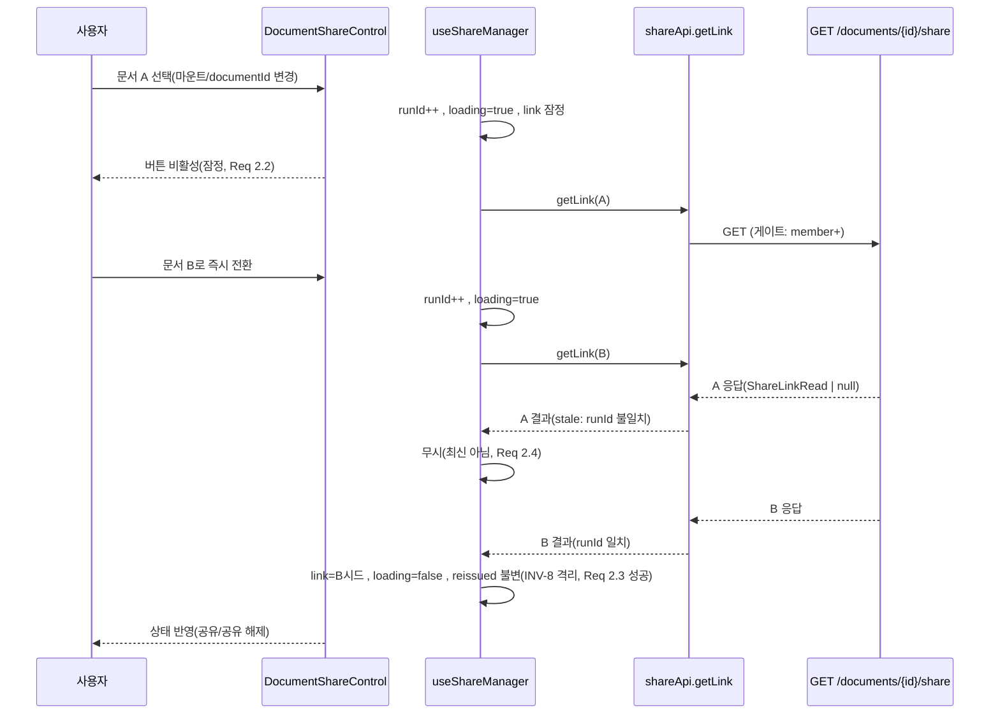
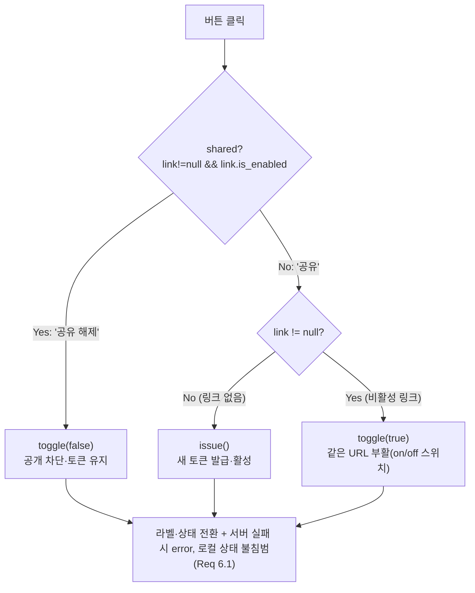

# Design Document — s28-share-status-control

## Overview

**Purpose**: 이미 백엔드(s14-sharing)·프론트(s22-fe-sharing)에 부품이 모두 구현된 문서 공유 기능을 사용자에게 **도달**시킨다. 두 결함을 메운다: (1) 문서의 현재 공유 상태를 조회하는 읽기 전용 백엔드 엔드포인트 부재, (2) 공유 컨트롤이 문서 화면에 마운트되지 않아 진입점이 없음.

**Users**: 공유 관리 권한자(owner/admin)가 문서 메인 화면(`DocumentWorkspacePage`)의 편집·삭제 컨트롤 옆에서 현재 공유 상태에 따라 "공유"/"공유 해제" 단일 토글을 조작하고, 공유 중일 때 게스트용 링크를 복사한다.

**Impact**: 공유 링크 도메인 로직(토큰 발급, 재발급 통일 원칙 INV-8, 무효화, 공개 렌더·링크 경유 첨부 서빙)은 **재구현하지 않고** 기존 구현에 전량 위임한다. 본 스펙은 얇은 조회 엔드포인트 1개 + 프론트 결선 + 마운트 시 초기 상태 판별만 더한다. DB 스키마·마이그레이션 변경 없음.

### Goals
- 문서의 현재 공유 상태를 조회하는 읽기 전용 GET 엔드포인트(발급·전환·무효화 없음).
- 문서 로드 시점의 공유 상태 초기 판별(latest-wins·loading·실패 표면화).
- owner/admin + 공유 가능 워크스페이스 + active 문서에서만 상태 기반 단일 토글 버튼 노출.
- 공유 중일 때 게스트용 링크 복사(기존 `CopyLinkButton` 재사용).

### Non-Goals
- 공유 링크 도메인 로직 재구현(토큰 발급/재발급, INV-8, 무효화 스윕, 공개 렌더·링크 경유 첨부 서빙) — 기존 sharing 도메인 소유.
- DB 스키마 변경·마이그레이션.
- 워크스페이스 공유 가능 게이트(`is_shareable`) 자체를 켜고 끄는 설정 UI.
- 서버측 권한 강제 재구현 — 프론트 노출 게이팅은 UX 편의일 뿐 서버 강제를 대체하지 않는다.

## Boundary Commitments

### This Spec Owns
- **BE 읽기 전용 조회**: `GET /documents/{id}/share` 라우트 + `ShareLinkService.get_link` 메서드(상태 전이 없음).
- **FE 초기 판별**: `useShareManager` 의 마운트 시 초기 조회(loading·latest-wins·실패 표면화) + `shareApi.getLink` 래퍼.
- **FE 상태 기반 컨트롤**: 신규 `DocumentShareControl`(features/sharing) — 단일 토글 버튼(라벨 전환·동작 매핑) + 복사 결선.
- **FE 노출 게이팅**: `DocumentToolbar`/`DocumentWorkspacePage` 결선(canShare(OWNER) && isShareable && active && hasSelection) + `useDocumentScope` 의 `isShareable` 표면화(1필드 확장).

### Out of Boundary
- 공유 토큰 발급·재발급·무효화 판정·retire — s14 `ShareLinkRepository`/`ShareLinkService`/`ShareInvalidationSweep` 소유(무변경).
- 공개 렌더·링크 경유 첨부 서빙·공유 URL 규약(`/public/{token}`) — s14 `PublicShareService` 소유(무변경).
- 서버측 권한 강제(문서→WS 게이트, member 이상 + admin bypass, 404/401/403, 공유 불가·비active 409) — 기존 sharing 도메인 소유.
- 요청·인증·오류 정규화·전역 401 인터셉트 — s16 `apiClient` 단일 소유.
- 워크스페이스 role·`isShareable` 신호 **원천** — `app/workspace-context` 소유(본 스펙은 관측·투영만).

### Allowed Dependencies
- **BE**: `app.sharing.{repository,schemas,service}`, `app.document.dependencies.ws_role_for_document`(문서→WS 어댑터, 재사용), `app.common.{auth,db}`. main 을 import 하지 않는다.
- **FE**: `@/shared/api/client`(apiClient), `@/shared/auth/{permissions,roles,RequireRole}`, `@/shared/ui`, `@/app/workspace-context/useCurrentWorkspace`, 그리고 **선례 기반 교차-feature import**: `features/document` → `features/sharing`(아래 결정 참조).
- **의존 제약**: sharing 은 document 를 import 하지 않는다(비순환 유지). BE `get_link` 은 리포지토리·스키마만 소비하고 상태 전이 협력자(`upsert_reissue`·`set_enabled`·`retire`)를 호출하지 않는다.

### Revalidation Triggers
- **계약 형태 변경**: `ShareLinkRead` 필드 변경, `GET .../share` 응답 형태(`200 + null` ↔ `204`) 변경 → FE `getLink`·`useShareManager`·s14 소비처 재검증.
- **의존 방향 변경**: `document → sharing` import 경계를 슬롯(Option C)으로 되돌리면 → 결선 지점·테스트 재검증.
- **게이트 기준 변경**: BE 조회 게이트(member 이상)를 owner 로 좁히거나 FE 노출 게이트(owner/admin)를 넓히면 → 두 계층 기준 차이 문서 재검증.
- **기존 테스트 영향(즉시 재검증 필요)**: `useShareManager` 마운트가 `shareApi.getLink` 를 호출 → `useShareManager.test.ts`·`ShareLinkPanel.test.tsx`·`ShareLinkPanel.integration.test.tsx` 의 shareApi 모크에 `getLink` 추가 필요.

## Architecture

### Existing Architecture Analysis

- **BE sharing 계층 분리**: `router`(게이트 결선·상태코드 매핑) → `service`(유스케이스·관측) → `repository`(단일 데이터 접근점). `get_link` 은 이 3계층 중 service·router 에만 얇게 얹히고 repository 의 기존 `get_by_document`(router.md 확인: `repository.py:51`)를 그대로 소비한다.
- **게이트 재사용**: `ws_role_for_document(Role.MEMBER)` dependency 가 문서 부재→404·미인증→401·비멤버→403·admin bypass 를 판정 이전 단계에서 산출한다(`router.py:81,101`). GET 라우트는 이 dependency 를 그대로 붙여 Req 1.4~1.7 을 무비용 충족한다.
- **FE feature 경계**: structure.md:25-28 — "feature 는 다른 feature 를 직접 import 하지 않는다". **단, 완화 선례 존재**: `DocumentViewer.tsx:25` 가 `@/features/attachment`(배럴)를 직접 import 한다("capability feature" 교차 소비, 비순환). 본 스펙은 이 선례를 따라 `document → sharing` 을 허용한다.
- **useShareManager 계약**: 현재 `link` 는 항상 null 로 시작(S1 seam: 사전 조회 GET 부재)하고 mutation 응답으로만 채워진다. 본 스펙이 그 seam 을 닫아 마운트 시 초기 조회로 `link` 를 시드한다 — 단 INV-8 `reissued` 판정을 오염시키지 않는다.

### Architecture Pattern & Boundary Map

```mermaid
flowchart TB
  subgraph BE["backend/app/sharing (기존 계층)"]
    R["router.py<br/>+ GET /documents/{id}/share"]
    S["service.py<br/>+ get_link (읽기 전용)"]
    Repo["repository.py<br/>get_by_document (무변경 재사용)"]
    Sch["schemas.py<br/>ShareLinkRead (무변경 재사용)"]
    R -->|ws_role_for_document(MEMBER)| Gate["app.document.dependencies<br/>(문서→WS 게이트, 무변경)"]
    R --> S --> Repo
    S --> Sch
  end

  subgraph SharingFE["frontend/features/sharing (소유)"]
    Api["api/shareApi.ts<br/>+ getLink"]
    Hook["hooks/useShareManager.ts<br/>+ 초기 조회·loading·latest-wins"]
    Ctrl["components/DocumentShareControl.tsx<br/>(신규: 단일 토글 + 복사)"]
    Copy["components/CopyLinkButton.tsx<br/>(무변경 재사용)"]
    Build["lib/buildShareUrl.ts<br/>(무변경 재사용)"]
    Barrel["index.ts (배럴)<br/>+ DocumentShareControl 공개"]
    Ctrl --> Hook --> Api
    Ctrl --> Copy
    Hook --> Build
    Barrel --> Ctrl
  end

  subgraph DocFE["frontend/features/document (결선)"]
    Scope["hooks/useDocumentScope.ts<br/>+ isShareable 투영"]
    Toolbar["components/DocumentToolbar.tsx<br/>+ 공유 클러스터"]
    Page["pages/DocumentWorkspacePage.tsx<br/>+ canShare(OWNER) 산정"]
    Page --> Toolbar
    Page --> Scope
  end

  Api -->|apiClient.get| Client["shared/api/client (s16, 무변경)"]
  Client -.HTTP GET.-> R
  Toolbar -->|"교차-feature import (선례)"| Barrel
  Ctrl -->|isShareable/role| WsCtx["app/workspace-context (무변경)"]
  Page -->|hasWorkspaceRole(OWNER)| Perm["shared/auth/permissions (무변경)"]

  style Ctrl fill:#d4f4dd
  style R fill:#d4f4dd
  style S fill:#d4f4dd
  style Api fill:#d4f4dd
```

**Architecture Integration**:
- **선택 패턴**: 기존 3계층(BE) + feature 소유 컴포넌트(FE) 확장. 신규 도메인 로직 없음.
- **feature 경계**: sharing 로직은 sharing feature 에 잔류(`DocumentShareControl` 이 `useShareManager`·`CopyLinkButton` 소비). document feature 는 **결선만**(canShare 산정 + 배럴 import).
- **보존 패턴**: BE 게이트 dependency, INV-8 재발급 통일, latest-wins idiom, 단일 error sink, `apiClient` 교차 관심사 단일 소유.
- **신규 컴포넌트 근거**: `DocumentShareControl` — `ShareLinkPanel`(발급/재발급 중심 관리 패널)과 다른 UX(단일 토글 + 초기 판별)이므로 별도 경량 컴포넌트가 관심사 분리·테스트 격리에 유리.

### Technology Stack

| Layer | Choice / Version | Role in Feature | Notes |
|-------|------------------|-----------------|-------|
| Frontend | React 19 + TS, Vitest | 컨트롤·훅 확장·결선 | `any` 금지, 기존 타입 미러 재사용 |
| Backend | FastAPI ≥0.139, SQLAlchemy, Pydantic v2 | GET 라우트 + 서비스 메서드 | `response_model=ShareLinkRead \| None` |
| Data / Storage | MySQL (기존 share_link) | 조회만(읽기 전용) | **스키마·마이그레이션 무변경** |

> FastAPI ≥0.139 는 `response_model=ShareLinkRead | None` 반환값 `None` 을 `200 + 본문 null` 로 직렬화한다. 상세 근거는 `research.md §7.1`.

## File Structure Plan

### Directory Structure (신규 파일)
```
frontend/src/features/sharing/
├── components/
│   ├── DocumentShareControl.tsx     # 신규: 상태 기반 단일 토글 + 복사(문서 표면 마운트 유닛)
│   └── DocumentShareControl.test.tsx
└── index.ts                         # 신규(또는 확장): DocumentShareControl 공개 배럴
```

### Modified Files

**Backend**
- `backend/app/sharing/service.py` — `ShareLinkService.get_link(db, document_id) -> ShareLinkRead | None` 추가. `get_by_document` 로 링크 로드 → 있으면 `from_share_link`, 없으면 `None`. **상태 전이 없음**(Req 1.3).
- `backend/app/sharing/router.py` — `GET /documents/{id}/share` 추가. 게이트 `ws_role_for_document(Role.MEMBER)` 재사용, `response_model=ShareLinkRead | None`, `service.get_link` 위임.

**Frontend — sharing(소유)**
- `frontend/src/features/sharing/api/shareApi.ts` — `getLink(documentId) -> Promise<ShareLinkRead | null>` 추가(`apiClient.get`). 기존 `issueLink`/`toggleLink` 무변경.
- `frontend/src/features/sharing/hooks/useShareManager.ts` — 마운트/documentId 변경 시 초기 조회 추가. 신규 `loading` 상태, latest-wins runId 가드, `reissued` 격리(초기 시드가 건드리지 않음). 기존 issue/toggle/INV-8 보존.

**Frontend — document(결선)**
- `frontend/src/features/document/hooks/useDocumentScope.ts` — `isShareable: boolean` 1필드 투영 추가(`useCurrentWorkspace().isShareable` 통과). 기존 최상위 접근자 idiom 유지.
- `frontend/src/features/document/components/DocumentToolbar.tsx` — 우측 클러스터에 공유 컨트롤 결선. `@/features/sharing` 배럴에서 `DocumentShareControl` import(선례). 신규 props: `canShare?`, `shareable?`(또는 게이트 결과 단일 prop).
- `frontend/src/features/document/pages/DocumentWorkspacePage.tsx` — `canShare = hasWorkspaceRole({currentRole: scope.role, isAdmin: scope.isAdmin, minimum: Role.OWNER})` 산정, `canShare`·`isShareable` 툴바 주입.

**Tests(재검증 갱신)**
- `frontend/src/features/sharing/hooks/useShareManager.test.ts` — shareApi 모크에 `getLink` 추가 + 초기 시드·loading·latest-wins·reissued 격리 단언.
- `frontend/src/features/sharing/components/ShareLinkPanel.test.tsx`·`ShareLinkPanel.integration.test.tsx` — 모크에 `getLink` 추가(마운트 조회 흡수).
- `frontend/src/features/sharing/api/shareApi.test.ts` — `getLink` GET 계약 테스트.
- `backend/tests/sharing/test_router.py`·`test_service.py` — GET 라우트·`get_link` 테스트 추가(기존 패턴 미러).

## System Flows

### 로드 시 초기 판별 (latest-wins) — Req 2



- **loading 축**(Req 2.2): 조회 in-flight 동안 버튼을 확정 라벨로 표기하지 않고 비활성. 초기 조회 실패 시(Req 2.3) `error` 표면화 + `link=null` 유지(공유 중으로 단정 금지).
- **latest-wins**(Req 2.4): 각 documentId 변경마다 `runIdRef` 증가, 비동기 결과는 runId 일치 시에만 반영. `DocumentViewer.tsx:62-96` idiom 재사용.
- **INV-8 격리**: 초기 조회는 `link`/`linkRef` 만 시드하고 `reissued` 를 절대 set 하지 않는다. `reissued` 는 오직 "링크가 있던 상태의 `issue()`" 에서만 true.

### 단일 버튼 동작 매핑 — Req 4



- **라벨**(Req 4.1/4.2): `shared` 이면 "공유 해제", 아니면 "공유".
- **진행 중 비활성**(Req 6.2): `pending` 동안 버튼 비활성(중복 실행 방지).
- **서버 강제**(Req 4.5/4.6): 공유 켜짐/해제 후 게스트 접근은 기존 공개 렌더 경로(200)·무효화(404)가 그대로 소유.

## Requirements Traceability

| Requirement | Summary | Components | Interfaces | Flows |
|-------------|---------|------------|------------|-------|
| 1.1, 1.2 | 공유 상태 조회(링크/링크 없음 정상 응답) | ShareLinkService.get_link, SharingRouter | `GET /documents/{id}/share` → `ShareLinkRead \| None` | — |
| 1.3 | 읽기 전용(전이 없음) | ShareLinkService.get_link | 상태 전이 협력자 미호출 | — |
| 1.4, 1.5, 1.6, 1.7 | 404/401/403·게이트(member+·admin bypass) | ws_role_for_document(MEMBER) | 게이트 dependency(재사용) | — |
| 2.1 | 로드 시 조회·반영 | useShareManager(초기 조회), shareApi.getLink | `getLink()` | 초기 판별 |
| 2.2 | 조회 중 잠정 표기 | useShareManager.loading, DocumentShareControl | `loading` 상태 | 초기 판별 |
| 2.3 | 실패 표면화·공유 중 단정 금지 | useShareManager(error), DocumentShareControl | `error` 상태, link=null 유지 | 초기 판별 |
| 2.4 | 연속 전환 시 최신만 반영 | useShareManager(runId 가드) | latest-wins | 초기 판별 |
| 3.1 | owner/admin+공유가능+active 노출 | DocumentToolbar, DocumentWorkspacePage | canShare&&isShareable&&active&&hasSelection | — |
| 3.2 | owner 미만·비admin 미노출 | DocumentWorkspacePage(hasWorkspaceRole OWNER) | `hasWorkspaceRole({minimum:OWNER})` | — |
| 3.3 | isShareable=false 미노출 | useDocumentScope(isShareable), DocumentToolbar | `isShareable` 게이트 | — |
| 3.4 | 비active(휴지통) 미노출 | DocumentWorkspacePage(!trashMode) | trashMode 파생 | — |
| 3.5 | 게이팅=UX 편의(서버 강제 불대체) | (전제) | — | — |
| 4.1, 4.2 | 라벨 전환 | DocumentShareControl | `shared` 파생 | 동작 매핑 |
| 4.3, 4.4 | 공유/해제 동작 | DocumentShareControl, useShareManager | issue()/toggle() | 동작 매핑 |
| 4.5, 4.6 | 게스트 접근 200/404 | (기존 PublicShareService, 무변경) | `/public/{token}` | — |
| 5.1, 5.5 | 공유 중일 때만 복사 버튼 | DocumentShareControl, CopyLinkButton | shared 시 렌더 | — |
| 5.2, 5.3 | 복사·피드백·폴백 | CopyLinkButton(무변경) | `frontShareUrl` | — |
| 5.4 | 게스트 프론트 링크 사용 | buildShareUrl(무변경) | `<origin>/share/<token>` | — |
| 6.1 | 실패 표면화·로컬 상태 불침범 | useShareManager(error), DocumentShareControl | `error`, link 불침범 | 동작 매핑 |
| 6.2 | 진행 중 버튼 비활성 | DocumentShareControl | `pending` | 동작 매핑 |
| 6.3 | 교차 관심사 apiClient 위임 | shareApi, apiClient(무변경) | — | — |

## Components and Interfaces

| Component | Domain/Layer | Intent | Req Coverage | Key Dependencies (P0/P1) | Contracts |
|-----------|--------------|--------|--------------|--------------------------|-----------|
| ShareLinkService.get_link | BE Service | 읽기 전용 공유 상태 조회 | 1.1–1.3 | ShareLinkRepository (P0) | Service |
| SharingRouter (GET) | BE Router | 게이트 결선·조회 위임 | 1.1, 1.4–1.7 | ws_role_for_document (P0), get_link (P0) | API |
| shareApi.getLink | FE Api | GET 타입 래퍼 | 2.1, 6.3 | apiClient (P0) | Service |
| useShareManager (확장) | FE Hook | 초기 조회·loading·latest-wins·INV-8 격리 | 2.1–2.4, 6.1 | shareApi (P0), useCurrentWorkspace (P1) | State |
| DocumentShareControl | FE UI | 상태 기반 단일 토글 + 복사 | 2.2, 2.3, 4.1–4.4, 5.1, 5.5, 6.1, 6.2 | useShareManager (P0), CopyLinkButton (P1) | State |
| DocumentToolbar (확장) | FE UI | 공유 클러스터 결선·노출 게이트 | 3.1, 3.3 | DocumentShareControl (P0, 교차-feature) | — |
| DocumentWorkspacePage (확장) | FE UI | canShare(OWNER) 산정·주입 | 3.1–3.4 | hasWorkspaceRole (P0), useDocumentScope (P1) | — |
| useDocumentScope (확장) | FE Hook | isShareable 투영 | 3.3 | useCurrentWorkspace (P0) | State |

### Backend

#### ShareLinkService.get_link

| Field | Detail |
|-------|--------|
| Intent | 문서의 현재 공유 링크 상태를 읽기 전용으로 조회 |
| Requirements | 1.1, 1.2, 1.3 |

**Responsibilities & Constraints**
- `get_by_document(db, document_id)` 로 링크(최대 1개) 로드 → 있으면 `ShareLinkRead.from_share_link(link)`, 없으면 `None`.
- **읽기 전용**: `upsert_reissue`·`set_enabled`·`retire` 를 호출하지 않는다(Req 1.3). 게이트·문서 status 를 관측조차 하지 않는다(조회는 전이·거부 조건과 무관, 비active/게이트 off 여도 링크 상태 그대로 반환).
- 404/401/403 은 라우터 게이트 dependency 가 산출하므로 서비스는 권한 재검사하지 않는다(계약 시그니처는 `ctx` 불요 — issue 와 달리 role 재검사 없음).

**Dependencies**
- Outbound: `ShareLinkRepository.get_by_document` — 단건 조회(P0).

**Contracts**: Service [x]

```python
def get_link(self, db: Session, document_id: int) -> ShareLinkRead | None:
    link = self._repository.get_by_document(db, document_id)
    return ShareLinkRead.from_share_link(link) if link is not None else None
```
- Preconditions: 라우터 게이트 통과(member 이상 또는 admin), 문서 존재(dependency 가 부재 시 404 선산출).
- Postconditions: 상태 불변(어떤 행도 쓰지 않음). 링크 있으면 `is_enabled·token·share_url` 포함 응답, 없으면 `None`.
- Invariants: 물리 삭제·토큰 변경·상태 전이 없음(INV-4·INV-8 무영향).

#### SharingRouter — `GET /documents/{id}/share`

**Contracts**: API [x]

##### API Contract
| Method | Endpoint | Request | Response | Errors |
|--------|----------|---------|----------|--------|
| GET | `/documents/{id}/share` | (없음) | `ShareLinkRead \| None` (200; 링크 없으면 본문 `null`) | 401(미인증), 403(비멤버·비admin), 404(문서 부재) |

**Implementation Notes**
- Integration: 발급·전환 라우트와 **동일 파일·동일 게이트**. 경로 파라미터 이름 `id`(문서 id)여야 `ws_role_for_document` 어댑터가 바인딩한다(`router.py:81` 대칭).
- Validation: `response_model=ShareLinkRead | None`. `get_link` 이 `None` 반환 시 FastAPI 가 `200 + null` 로 직렬화(발급/토글의 `200 + ShareLinkRead` 와 균질, Req 1.2).
- Risks: 없음(읽기 전용, 부작용 없음).

### Frontend

#### shareApi.getLink

**Contracts**: Service [x]

```typescript
function getLink(documentId: number): Promise<ShareLinkRead | null> {
  return apiClient.get<ShareLinkRead | null>(`/documents/${documentId}/share`);
}
```
- `200 + null` 본문 → `apiClient` 의 `parseJsonBody` 가 `JSON.parse("null")=null` 로 반환(`client.ts:60-68`). 별도 "링크 없음" 분기 불필요.
- 오류(401/403/404)는 `apiClient` 정규화 `ApiError` 로 throw → `useShareManager` 가 `error` 로 표면화(Req 6.3 위임).

#### useShareManager (확장)

| Field | Detail |
|-------|--------|
| Intent | 기존 발급·토글에 마운트 시 초기 조회를 더하되 INV-8·latest-wins 를 지킨다 |
| Requirements | 2.1, 2.2, 2.3, 2.4, 6.1 |

**Responsibilities & Constraints**
- **신규 상태**: `loading: boolean`(초기 조회 in-flight). 반환 형태에 추가.
- **초기 조회**: `useEffect([documentId])` 에서 `shareApi.getLink(documentId)` 호출. `runIdRef` 증가로 latest-wins, unmount 가드. 성공 → `setLink(fetched)`·`linkRef.current=fetched`·`loading=false`. 실패 → `setError(정규화)`·`loading=false`·`link` 불침범(Req 2.3).
- **INV-8 격리**(Req 2.1 seam): 초기 시드는 `reissued` 를 절대 set 하지 않는다. `issue()` 의 `hadLink` 판정은 시드된 `linkRef` 를 정직하게 반영한다(사전 링크 존재 시 재발급이 올바르게 `reissued=true`).
- **보존**: 기존 `issue`/`toggle`/`frontShareUrl`/`invalidated`/`error`/`pending` 시맨틱과 실패 시 link 불침범(Req 6.1) 그대로 유지.

**Contracts**: State [x]
- State model: `{ link, frontShareUrl, reissued, invalidated, pending, loading(신규), error, issue(), toggle() }`.
- Concurrency: `runIdRef`(latest-wins) + `linkRef`(INV-8 동기 판정). 초기 조회와 mutation 은 `error`·`link` 단일 sink 를 공유.

#### DocumentShareControl (신규)

| Field | Detail |
|-------|--------|
| Intent | 문서 표면에 마운트되는 자기완결 단일 토글 컨트롤(상태 기반 라벨·동작·복사) |
| Requirements | 2.2, 2.3, 4.1, 4.2, 4.3, 4.4, 5.1, 5.5, 6.1, 6.2 |

**Responsibilities & Constraints**
- Props: `{ documentId: number; documentStatus: string }`(ShareLinkPanel 의 자기완결 계약 미러). **노출 게이트는 소유하지 않는다** — 툴바가 마운트 여부를 결정하므로 이 컴포넌트는 마운트되면 렌더한다.
- 내부: `useShareManager({ documentId, documentStatus })` 소비.
  - `loading` → 버튼 비활성·잠정 표기(Req 2.2).
  - `shared = link !== null && link.is_enabled` → 라벨 "공유 해제"/"공유"(Req 4.1/4.2).
  - onClick: `shared ? toggle(false) : (link ? toggle(true) : issue())`(Req 4.3/4.4, `research.md §7.1` 매핑).
  - `pending` → 버튼 비활성(Req 6.2).
  - `shared` 일 때만 `<CopyLinkButton frontShareUrl={frontShareUrl} />` 렌더(Req 5.1/5.5).
  - `error` → `<ErrorMessage error={error} />`(Req 6.1, 초기 조회 실패·mutation 실패 공통 sink).
- 경계: s19 뷰어·트리를 import 하지 않는다(sharing 전용). `CopyLinkButton`·`buildShareUrl`(via hook) 재사용, 복사 대상은 `frontShareUrl`(게스트 프론트 링크)뿐(Req 5.4).

**Contracts**: State [x] (프레젠테이션 + 훅 소비)

#### DocumentToolbar / DocumentWorkspacePage / useDocumentScope (결선)

**Responsibilities & Constraints**
- **useDocumentScope**: `isShareable: boolean` 을 `useCurrentWorkspace().isShareable` 에서 1필드 투영 추가(기존 `status/workspaceId/role/isAdmin` 최상위 접근자 idiom 유지, 산술·가공 없음).
- **DocumentWorkspacePage**: `canShare = hasWorkspaceRole({ currentRole: scope.role, isAdmin: scope.isAdmin, minimum: Role.OWNER })` 산정(admin override 포함, Req 3.2). `canShare`·`scope.isShareable` 를 툴바에 주입.
- **DocumentToolbar**: 우측 클러스터(편집·삭제 옆, Req 3.1)에서 `!trashMode && canShare && shareable && hasSelection` 일 때만 `<DocumentShareControl documentId={selectedId} documentStatus="active" />` 렌더. `@/features/sharing` 배럴에서 import(교차-feature, 선례).
  - active 축(Req 3.4): 활성 트리 선택 + 비휴지통 모드로 보장(`documentStatus="active"` 상수 안전).
  - owner⊇member 이므로 공유 클러스터 노출 시 편집·삭제 클러스터도 함께 노출(모순 없음).

**Dependencies**
- Outbound(교차-feature, 선례): `DocumentToolbar` → `@/features/sharing`(P0). 비순환(sharing 은 document 를 import 하지 않음).

## Error Handling

### Error Strategy
- **BE**: GET 은 부작용이 없어 자체 오류를 만들지 않는다. 404/401/403 은 게이트 dependency(재사용)가 `DomainError` 로 산출 → s01 전역 핸들러가 공통 `ErrorResponse` 직렬화. 라우터는 오류를 매핑하지 않는다.
- **FE**: 초기 조회·발급·토글 실패 모두 `shareApi` 가 전파한 `ApiError` 를 `useShareManager` 가 `error` 단일 sink 로 표면화. 실패 시 `link` 로컬 상태를 침범하지 않는다(Req 6.1). 전역 401·정규화는 `apiClient` 위임(Req 6.3, 무재구현).

### Error Categories and Responses
- **User (4xx)**: 404(문서 부재)·403(권한 부족) → `ErrorMessage` 로 표면화(초기 조회 시 공유 중으로 단정하지 않음, Req 2.3). 401 → 전역 인터셉터 로그인 리다이렉트.
- **Business (409)**: 공유 불가·비active 로 인한 활성화 실패(발급/토글 경로) → 서버 409 → `error` 표면화, 직전 로컬 상태 불침범(Req 6.1).
- **Clipboard**: 복사 실패(API 부재·거부) → 오류 throw 없이 선택 가능한 폴백 입력창(CopyLinkButton 기존 동작, Req 5.3).

### Monitoring
- 신규 관측 요소 없음. 기존 `apiClient`·전역 핸들러 로깅 재사용.

## Testing Strategy

### Unit Tests
- `ShareLinkService.get_link`: 링크 존재 → `ShareLinkRead`(token·is_enabled·share_url) 반환 / 링크 없음 → `None` / 호출 후 링크 행·토큰·상태 불변(읽기 전용 Req 1.3).
- `shareApi.getLink`: `GET /documents/{id}/share` 경로·메서드 결선 / `200 + null` → `null` 반환 / `ApiError` 전파.
- `useShareManager` 초기 조회: 마운트 시 `getLink` 1회 호출·link 시드 / 시드가 `reissued` 를 건드리지 않음(INV-8, Req 2.1) / `loading` 전이(Req 2.2) / 조회 실패 시 `error` 표면화·`link=null`(Req 2.3).
- `useShareManager` latest-wins: documentId 연속 전환 시 stale 응답 무시, 최신만 반영(Req 2.4).

### Integration Tests
- BE `test_router.py`: `GET .../share` — 미인증 401 / 비멤버 403 / 문서 부재 404 / member·admin 200(링크/`null`) — 발급·토글과 동일 게이트 동작 확인(Req 1.4–1.7).
- `DocumentShareControl` 동작 매핑: 미공유→"공유" 클릭→(링크 없음)issue / (비활성)toggle(true); 공유 중→"공유 해제"→toggle(false); 라벨·pending 비활성(Req 4, 6.2).
- `DocumentShareControl` 복사 게이팅: 공유 중일 때만 `CopyLinkButton` 노출, 복사 대상=`frontShareUrl`(Req 5.1/5.4/5.5).
- 재검증: `ShareLinkPanel.integration.test.tsx` — 마운트 시 `getLink` 흡수 후 기존 발급/토글/무효화 경로 무회귀.

### E2E/UI Tests
- 노출 게이팅 종단: owner/admin + isShareable + active 문서 → 툴바에 공유 버튼 노출 / owner 미만·비admin, isShareable=false, 휴지통 문서 → 각각 미노출(Req 3.1–3.4).
- 공유 켜기→게스트 링크 접근(200)→공유 해제→이전 링크 접근(404) 종단(Req 4.5/4.6, 기존 공개 경로 위임 확인).

## Security Considerations
- **두 계층 게이트 기준 차이(의도적)**: BE 조회 게이트는 발급·전환과 동일하게 member 이상(admin bypass 포함)을 허용하나, FE 컨트롤은 owner/admin 에게만 노출(더 좁은 UX 정책). 프론트 게이팅은 UX 편의일 뿐 서버 강제를 대체하지 않는다(Req 3.5).
- **anti-enumeration**: 조회 게이트가 발급·전환과 동일하므로 존재 추정 표면을 넓히지 않는다(문서 부재는 게이트 dependency 가 404 로 통일).
- **링크 노출**: 관리자에게 제시·복사되는 링크는 게스트 프론트 링크(`/share/:token`)이며 백엔드 공개 API 경로(`/public/{token}`)를 직접 노출하지 않는다(Req 5.4).
